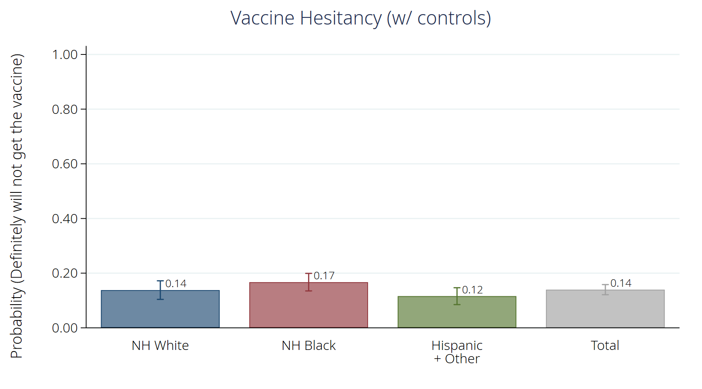
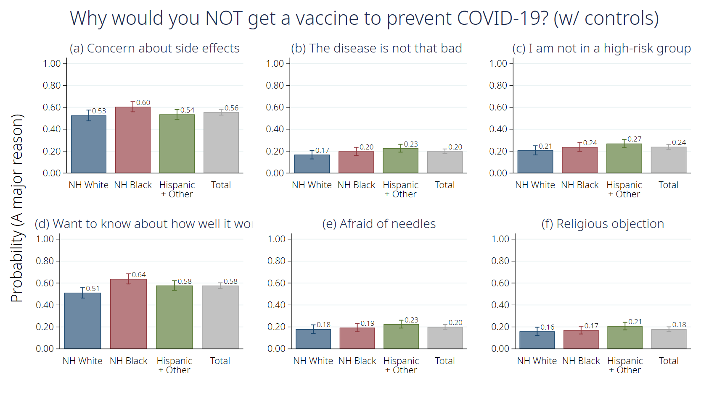
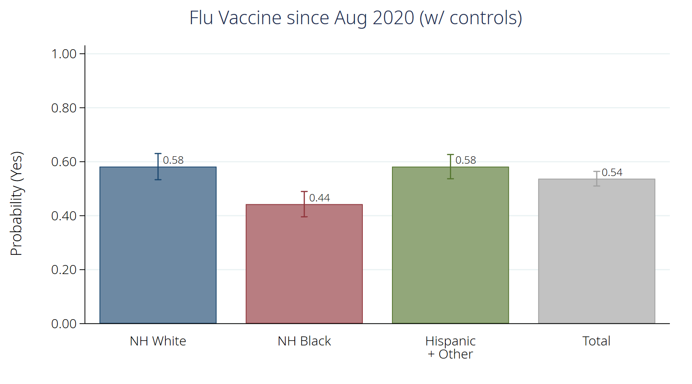
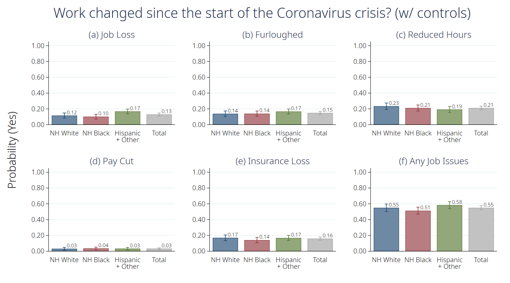
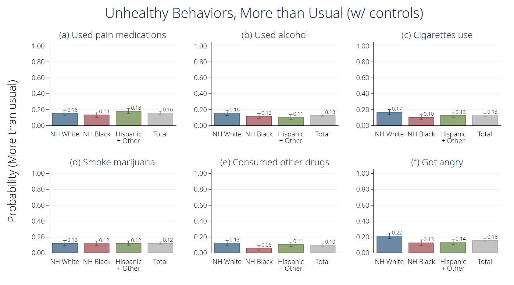
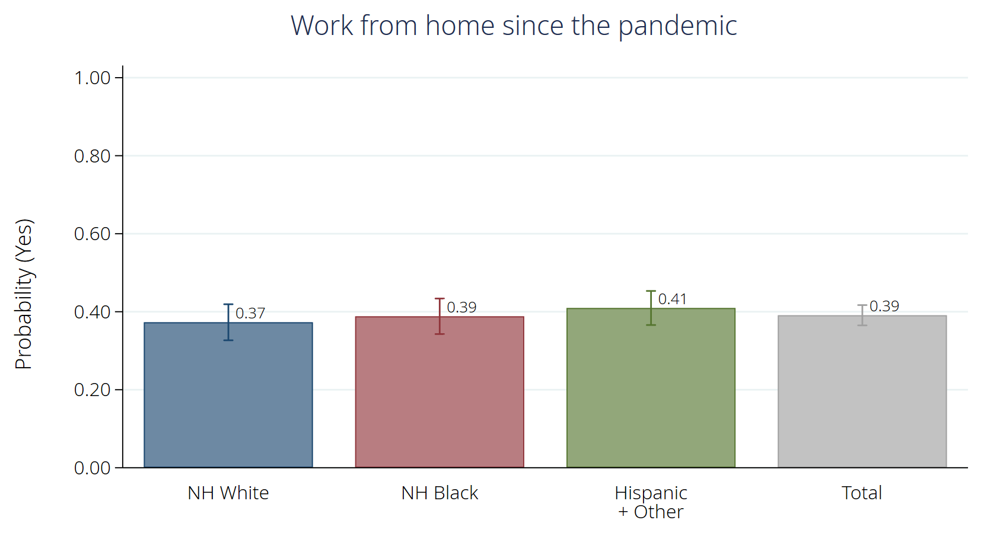
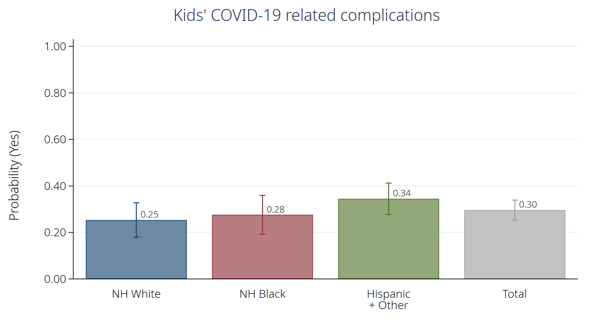
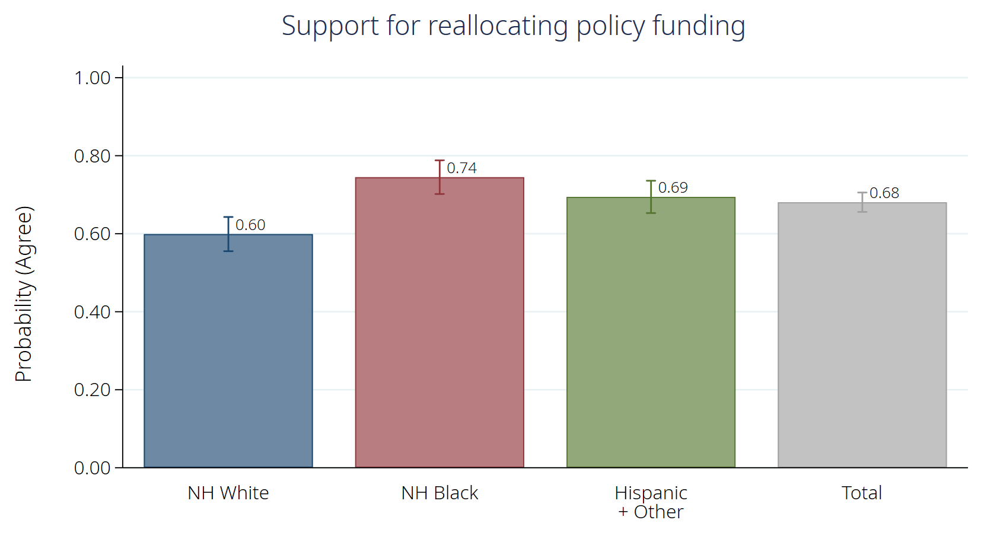
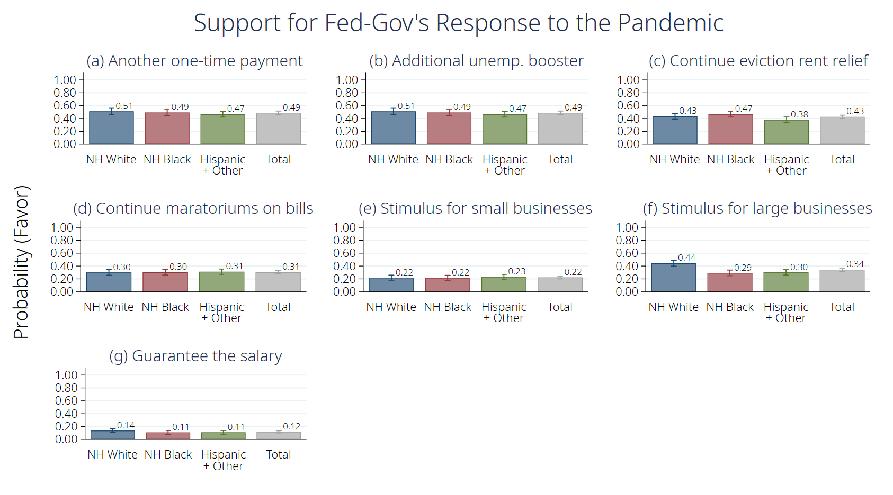

# Doubly Burdened: Race-Ethnic Disparities in the Effects of COVID-19 and COVID-19 Mitigation Strategies (NYS COVID-19 Disparities White Paper)

Authors: Ashley Fox<sup>1</sup> & Yongjin Choi<sup>2</sup></br>
<sup>1</sup> Associate Professor, Department of Public Administration and Policy, Rockefeller College of Public Affairs and Policy, UAlbany</br>
<sup>2</sup> Doctoral Candidate, Department of Public Administration and Policy, Rockefeller College of Public Affairs and Policy, UAlbany

Prepared for the NYS COVID-19 Minority Health Disparities Team, University at Albany

#### What's Included

* [Abstract](#abstract)
* [Overview](#overview)
* [Methods](#methods)
* [Results](#results)
  * [Vaccine Hesitancy](#vaccine-hesitancy)
  * [Economic Impacts](#economic-impacts)
  * [Direct COVID19 Exposure and Impact](#direct-covid19-exposure-and-impact)
  * [School Closures](#school-closures)
  * [Race, Racism and Support for the Black Lives Matter Movement](#race,-racism-and-support-for-the-black-lives-matter-movement)
  * [Policy Attitudes](#police-attitudes)
* [Project Information](#project-information)
* [File Descriptions](#file-descriptions)

Last updated: April 4th, 2021</br>

## Abstract

Black and Hispanic populations across New York State and around the United States have been disproportionately impacted by COVID-19 both in terms of COVID-19 associated morbidity and mortality but also bearing a larger burden of the economic impacts. Race-ethnic minorities also experience more longstanding and justified distrust of the medical community, which could serve to prolong the pandemic effects in the most vulnerable communities by contributing to reduced vaccine uptake. This paper reports the results of a survey fielded in November 2020 with an oversampling of Non-Hispanic Black and Hispanic respondents across New York State concerning the impacts of the virus and intentions to seek vaccination and estimates of the social and economic impacts of COVID-19 on minority communities. Overall, the survey finds that Latinx populations have been especially negatively impacted by the virus followed by non-Hispanic (NH) Blacks and NH Whites. Consistent with other surveys, NH Blacks were more hesitant about vaccination than other groups; however, 42% of respondents reported that they would definitely get the vaccine as soon as possible and another 27% said they would probably get the vaccine. All groups reported substantial indirect economic and social effects related to stay-at-home orders including lost income, but Hispanics have been the most impacted population, followed by NH Blacks. More effort should be put in understanding and alleviating the economic and social harms from COVID-19 mitigation strategies and consideration should be given to how these economic and social effects may compound existing health disparities into the future.

## Overview

The SARS-CoV-2 virus (COVID-19), which was first identified in New York State (NYS) in February of last year, has exposed and heightened pre-existing inequalities of all kinds. However, while COVID-19 does not discriminate, efforts to prevent and contain it do. Black and Hispanic populations across NYS and around the United States are experiencing a double burden: Race-ethnic minorities have been disproportionately impacted by COVID-19 associated morbidity and mortality. Additionally, race-ethnic minorities are bearing a larger burden of the economic and social impacts of COVID-19 mitigation strategies. 

The COVID-19 vaccine offers hope of a reduction in both the direct health impacts from the disease and the indirect social and economic impacts, but only if enough trust can be built to assuage justified hesitancy.  Race-ethnic minorities experience more longstanding and justified distrust of the medical community, which could serve to prolong the pandemic effects in the most vulnerable communities by contributing to reduced vaccine uptake (Ray, 2020).

We fielded a survey of a diverse sample of New Yorkers to examine disparities in vaccine hesitancy and both the effects of COVID-19 and the effects of mitigation strategies (i.e., stay at home measures, school closures, economic impacts) on race-ethnic minorities compared with NH Whites.  We report the results of the survey in terms of overall effects on New Yorkers and broken out by race/ethnicity. 

## Methods

A survey of a sample of 1,353 Qualtrics respondents was fielded between November 23-December 8, 2020. Black and Hispanic respondents were oversampled to produce a balanced-sample of 429 non-Hispanic (NH) Whites, 443 NH Blacks and 481 Hispanics.  Respondents were drawn from both Downstate (43%) from Upstate (57%).  While the survey cannot be interpreted as representative of the population of the state of NY, the age and economic distribution match closely the pop of NY. 

We first examine race-ethnic disparities in hesitancy towards vaccination and the reasons for this. Next, we examine disparities in the economic and social impacts of COVID-19, support for the Black Lives Matter protests, and potential policy solutions preferred by different groups. We present the overall probability (percent) of respondents that endorse particular views broken out by race-ethnicity. We present the disparities unadjusted for and adjusted for socioeconomic confounders (e.g., age, gender, and annual household income in 2019).

### Basic Setting

### Delimiter, working directory, and description option


```stata
#delimit ;
clear all;
cd "C:\Users\NoMoreTicket\OneDrive - University at Albany - SUNY\03.data\01.Survey\202011_NYS_Minority\";
set more off;

set linesize 240;
display "{hline}";

set scheme s2color;
grstyle init;
grstyle color background white;

// Image Repository
global myimg "C:\Users\NoMoreTicket\OneDrive - University at Albany - SUNY\05.Research\2020_NYS COVID19 Survey\02.WhitePaper\img";

global grpcombine 
    b1("")
    ycommon
    xsize(9) ysize(5);
```

    
    
    C:\Users\NoMoreTicket\OneDrive - University at Albany - SUNY\03.data\01.Survey\2
    > 02011_NYS_Minority
    
    
    
    ------------------------------------------------------------------------------------------------------------------------------------------------------------------------------------------------------------------------------------------------
    
    
    
    
    
    delimiter now ;

### (Optional) Packages required


```stata
/*----- Installing Packages -----*/
ssc install estout, replace;
ssc install catplot, replace;
ssc install coefplot, replace;
ssc install tabout, replace;
ssc install grstyle, replace;
ssc install palettes, replace;
ssc install asdoc, replace;
```

### Data Prep


```stata
/*----- Importing csv -----*/
import delimited "C:\Users\NoMoreTicket\OneDrive - University at Albany - SUNY\03.data\01.Survey\202011_NYS_Minority\NYS_COVID19_Disparities_2020_12_11_Numeric.csv", varnames(1) case(upper) clear;

capture label var STARTDATE "Start Date";
capture label var ENDDATE "End Date";
capture label var STATUS "Response Type";
capture label var IPADDRESS "IP Address";
capture label var PROGRESS "Progress";
capture label var DURATION (IN SECONDS) "Duration (in seconds)";
capture label var FINISHED "Finished";
capture label var RECORDEDDATE "Recorded Date";
capture label var RESPONSEID "Response ID";
capture label var RECIPIENTLASTNAME "Recipient Last Name";
capture label var RECIPIENTFIRSTNAME "Recipient First Name";
capture label var RECIPIENTEMAIL "Recipient Email";
capture label var EXTERNALREFERENCE "External Data Reference";
capture label var LOCATIONLATITUDE "Location Latitude";
capture label var LOCATIONLONGITUDE "Location Longitude";
capture label var DISTRIBUTIONCHANNEL "Distribution Channel";
capture label var USERLANGUAGE "User Language";
capture label var CONSENT_2 "Do you consent to participate in this survey?";
capture label var EXP1_ARTICLE4_FIRST CLICK "Timing - First Click";
capture label var EXP1_ARTICLE4_LAST CLICK "Timing - Last Click";
capture label var EXP1_ARTICLE4_PAGE SUBMIT "Timing - Page Submit";
capture label var EXP1_ARTICLE4_CLICK COUNT "Timing - Click Count";
capture label var EXP1ARM1_COMP1 "Who did the U.S. advisory panel recommend get the vaccine first while supplies are scarce? [select all that apply]";
capture label var EXP1ARM1_COMP2 "Did the U.S. advisory panel recommend the vaccine be free?";
capture label var EXP1ARM2_ARTICLE4_FIRST CLICK "Timing - First Click";
capture label var EXP1ARM2_ARTICLE4_LAST CLICK "Timing - Last Click";
capture label var EXP1ARM2_ARTICLE4_PAGE SUBMIT "Timing - Page Submit";
capture label var EXP1ARM2_ARTICLE4_CLICK COUNT "Timing - Click Count";
capture label var EXP1ARM2_COMP1 "Who did U.S. the advisory panel recommend get the vaccine first while supplies are scarce?";
capture label var EXP1ARM2_COMP2 "Did the U.S. advisory panel recommend the vaccine be free?";
capture label var VACCINE_1 "Willingness to get the vaccine";
capture label var VACCINE_1_1 "Briefly describe why you would get the vaccine as soon as possible";
capture label var VACCINE_1_1 "Briefly describe why you would not get the vaccine as soon as possible";
capture label var VACCINE_2_1 "Would NOT get a vaccine because: Concern about side effects";
capture label var VACCINE_2_2 "Would NOT get a vaccine because: Do not think I need it because the disease is not that bad";
capture label var VACCINE_2_3 "Would NOT get a vaccine because: Do not think I need it because I am not in a high-risk group";
capture label var VACCINE_2_4 "Would NOT get a vaccine because: Want to know more about how well it works";
capture label var VACCINE_2_5 "Would NOT get a vaccine because: Afraid of needles";
capture label var VACCINE_2_6 "Would NOT get a vaccine because: Religious objection";
capture label var VACCINE_2_DO "Would NOT get a vaccine because: Display Order";
capture label var VACCINE_3 "Which of the following best describes your own belief about the seriousness of Coronavirus as a threat to the nation’s health and the need for renewed social distancing measures?";
capture label var VACCINE_4 "Which of the following statements comes closer to your view:";
capture label var VACCINE_5_1 "Protective measure: Worn a mask when out in public";
capture label var VACCINE_5_2 "Protective measure: Washed hands after being out";
capture label var VACCINE_5_3 "Protective measure: Used hand sanitizer at stores or when out";
capture label var VACCINE_5_4 "Protective measure: Sought out testing for Coronavirus before seeing someone who may be vulnerable to complications";
capture label var VACCINE_5_5 "Protective measure: Changed travel plans or decided not to travel";
capture label var VACCINE_5_6 "Protective measure: Avoided contact with people who who may be vulnerable to complications (e.g., grandparents, immunocompromised, etc)";
capture label var VACCINE_5_7 "Protective measure: Avoided large or medium size gatherings";
capture label var VACCINE_5_8 "Protective measure: Avoided small group gatherings";
capture label var VACCINE_5_9 "Protective measure: Sought information on Coronavirus";
capture label var VACCINE_5_10 "How frequently have you been doing each of the following over the past month to personally protect yourself and others from Coronavirus? - Self-quarantined/isolated";
capture label var VACCINE_6 "When it comes to responding to the Coronavirus, do you mostly support or oppose requiring people to wear face masks indoors and where social distancing isn’t possible.";
capture label var VACCINE_7 "Does wearing a mask help to reduce the spread of the coronavirus?";
capture label var VACCINE_8 "Thinking about the development of a vaccine for COVID-19, which of the following concerns you more?";
capture label var VACCINE_9_1 "Agree: Getting a COVID-19 vaccine myself will be an important way to protect myself from catching the disease";
capture label var VACCINE_9_2 "Agree: Getting a COVID-19 vaccine myself will be an important way to protect my immediate family members and friends from catching the disease";
capture label var VACCINE_9_3 "Agree: Getting a COVID-19 vaccine myself will be an important way to protect vulnerable members of my community from catching the disease";
capture label var VACCINE_9_4 "Agree: Everyone who doesn't have a medical reason not to should get a COVID-19 vaccine to help end the pandemic";
capture label var VACCINE_9_5 "Agree: For a future COVID-19 vaccine, the health benefits of getting the vaccine are likely to outweigh the risks";
capture label var VACCINE_9_6 "Agree: Political leaders should be willing to get the vaccine first to demonstrate its safety and efficacy.";
capture label var VACCINE_10_1 "Agree: The side effects for most vaccines are minor";
capture label var VACCINE_10_2 "Agree: Serious side effects from vaccines are rare";
capture label var VACCINE_10_3 "Agree: You can catch the flu from a flu vaccine";
capture label var VACCINE_10_4 "Agree: When everyone else is vaccinated, I don't need to be vaccinated";
capture label var VACCINE_10_5 "Agree: I have a responsibility to get vaccinated because I can protect others with a weaker immune system";
capture label var VACCINE_10_6 "Agree: When I think about getting vaccinated, I weigh benefits and risks to make the best decision possible";
capture label var VACCINE_10_7 "Agree: Vaccines contain dangerous ingredients";
capture label var VACCINE_10_8 "Agree: The decision to vaccinate or not is a personal choice";
capture label var VACCINE_10_DO "Please indicate how much you disagree or agree with the following statements about vaccines in general (for all diseases). - Display Order";
capture label var VACCINE_11_1 "Confidence: Elected federal government officials under the Biden Administration";
capture label var VACCINE_11_2 "Confidence: Federal health agencies (e.g., the FDA and CDC)";
capture label var VACCINE_11_3 "Confidence: Local public health agencies";
capture label var VACCINE_11_4 "Confidence: Medical scientists and researchers";
capture label var VACCINE_11_5 "Confidence: Physicians";
capture label var VACCINE_11_6 "Confidence: U.S. Based Pharmaceutical companies";
capture label var VACCINE_11_7 "Confidence: Chinese-based researchers/companies";
capture label var VACCINE_11_8 "Confidence: European-based researchers/companies";
capture label var VACCINE_11_DO "Confidence: Display Order";
capture label var VACCINE_12 "How often do you typically get a seasonal flu vaccination?";
capture label var VACCINE_13 "Since August 2020, have you had a season flu vaccination?";
capture label var EXP2ARM1 "EXP2ARM1";
capture label var EXP2ARM2 "EXP2ARM2";
capture label var EXP2CONTROL "EXP2CONTROL";
capture label var EXP3ARM1 "EXP3ARM1";
capture label var EXP3CONTROL "EXP3CONTROL";
capture label var DELIVERY_1 "Factors for vaccine decision: If it is required in order to board a plane or go on a cruise";
capture label var DELIVERY_2 "Factors for vaccine decision: If your workplace requires it to go back to work in person";
capture label var DELIVERY_3 "Factors for vaccine decision: If it is available for free at a retail pharmacy (e.g., CVS, Walgreens, etc.)";
capture label var DELIVERY_4 "Factors for vaccine decision: If it is available for free and delivered by a community health worker to your home/residence";
capture label var DELIVERY_5 "Factors for vaccine decision: If the vaccine is free and available through a drive through or mobile clinic";
capture label var DELIVERY_6 "Factors for vaccine decision: If you have to pay $20 out of pocket to receive it";
capture label var DELIVERY_7 "Factors for vaccine decision: If your insurance or the government pays you $20 to get the vaccine";
capture label var BLM_1 "How concerned are you that the COVID-19 pandemic is doing greater damage to people of color?";
capture label var BLM_2 "From what you’ve read and heard, how do you feel about the Black Lives Matter movement?";
capture label var BLM_3 "Has your attitude towards the Black Lives Matter movement changed since the George Floyd incident that sparked off protests around the country over the summer?";
capture label var BLM_4 "Have race relations in the United States become better or worse since Donald Trump became president, or has there been no change?";
capture label var BLM_5 "Which concerns you more--the actions of the police and the death of an African American man, or protests that have turned violent?";
capture label var BLM_6_1 "Do you have a mostly positive or mostly negative reaction to the following terms: - Defund the police";
capture label var BLM_6_2 "Do you have a mostly positive or mostly negative reaction to the following terms: - Blue Lives Matter";
capture label var BLM_6_3 "Do you have a mostly positive or mostly negative reaction to the following terms: - All Lives Matter";
capture label var BLM_6_4 "Do you have a mostly positive or mostly negative reaction to the following terms: - Socialism";
capture label var BLM_7 "Do you think that police are more likely to use deadly force on black Americans or white Americans?";
capture label var BLM_8 "Have you yourself participated in a protest related to the Black Lives Matter?";
capture label var BLM_9 "Do you support or oppose the idea of reallocating some police funding towards community services such as mental health services and addiction treatment programs?";
capture label var BLM_10 "How much discrimination do you believe that Black Americans face today?";
capture label var BLM_11 "How many times have you been unfairly stopped, searched, questioned, physically threatened or abused by the police?";
capture label var SD_1_1 "Worry: Contracting coronavirus?";
capture label var SD_1_2 "Worry: Experiencing a serious complication or death from Coronavirus if you were to contract it?";
capture label var SD_1_3 "Worry: Someone close to you (family, close friend, loved one) experiencing a serious complication or death from the Coronavirus if they were to contract it?";
capture label var SD_1_4 "Worry: The negative effects of social distancing measures on the economy in general";
capture label var SD_1_5 "Worry: The negative effects of social distancing measures on my personal finances";
capture label var SD_1_6 "Worry: Your local health system capacity being overwhelmed";
capture label var SD_1_7 "Worry: Schools closing or remaining closed";
capture label var SD_1_8 "Worry: Shortages of necessary items";
capture label var SD_1_9 "Worry: Not being able to pay your mortgage/rent";
capture label var SD_1_10 "How worried are you about each of the following happening if the Coronavirus continues to spread in the US over the next 6 months: - Losing your job or not being able to find a job";
capture label var SD_2_1 "How positively or negatively would you rate the response of each of the following to the Coronavirus pandemic in the US? - Governor Andrew Cuomo";
capture label var SD_2_2 "How positively or negatively would you rate the response of each of the following to the Coronavirus pandemic in the US? - President Donald Trump";
capture label var SD_2_3 "How positively or negatively would you rate the response of each of the following to the Coronavirus pandemic in the US? - Dr. Anthony Fauci";
capture label var SD_2_4 "How positively or negatively would you rate the response of each of the following to the Coronavirus pandemic in the US? - Mayor Bill DeBlasio";
capture label var STIMULUS_1 "Have you received any personal benefit from the stimulus bill, for instance in the form of a check from the government, small business loan or unemployment benefits? [check all that apply]";
capture label var STIMULUS_2 "If you received unemployment benefits, did you receive the $600 booster to your unemployment benefits?";
capture label var STIMULUS_3 "If you received the $600 booster to your unemployment benefits, has that booster now stopped?";
capture label var STIMULUS_4 "Have you benefited from any of the following measures to offset the economic hardships associated with Coronavirus-induced economic downturn [check all that apply]: - Selected Choice";
capture label var STIMULUS_4_5_TEXT "Have you benefited from any of the following measures to offset the economic hardships associated with Coronavirus-induced economic downturn [check all that apply]: - Other, specify in box provided - Text";
capture label var STIMULUS_5 "How has your work changed since the start of the Coronavirus crisis? [check all that apply] - Selected Choice";
capture label var STIMULUS_5_9_TEXT "How has your work changed since the start of the Coronavirus crisis? [check all that apply] - Other, specify in box provided - Text";
capture label var STIMULUS_6 "Besides yourself, has anyone in your immediate family or close to you been laid off or furloughed because of the COVID-19 crisis?";
capture label var STIMULUS_7 "Over the past 6 months, have you or anyone in your household been unable to pay for any of the following [check all that apply]: - Selected Choice";
capture label var STIMULUS_7_9_TEXT "Over the past 6 months, have you or anyone in your household been unable to pay for any of the following [check all that apply]: - Other, specify in box provided - Text";
capture label var STIMULUS_8 "Have you had to use your personal savings to pay for bills in the past 6 months?";
capture label var M4A_1 "Have you or anyone close to you lost their health insurance in the last 6 months due to being laid off from work or for other reasons? [check all that apply]";
capture label var M4A_2 "Which of the following best represents your current primary source of health insurance coverage, if any? - Selected Choice";
capture label var M4A_2_9_TEXT "Which of the following best represents your current primary source of health insurance coverage, if any? - Other, specify in box provided - Text";
capture label var M4A_3 "Support for M4A";
capture label var M4A_4 "Heard of the New York Health Act";
capture label var M4A_5_1 "Support for New York Health Act";
capture label var M4A_5_2 "Support for New York Health Act, given that it is paid by tax and replace ESI";
capture label var M4A_6 "Of the following approaches to reforming health care in the US, which do you most support? - Selected Choice";
capture label var M4A_6_4_TEXT "Of the following approaches to reforming health care in the US, which do you most support? - Something else,  - Text";
capture label var M4A_7 "Top 3 things that you would like to see the federal government do";
capture label var M4A_7_9_TEXT "Top 3 things that you would like to see the federal government do: - Other, specify in the box provided - Text";
capture label var M4A_8 "Support for basic income";
capture label var MEDIA_1 "How much media coverage of Coronavirus have you been consuming in the past week?";
capture label var MEDIA_2 "Of the following TV news media outlets, which would you say is your primary source of news information? - Selected Choice";
capture label var MEDIA_2_6_TEXT "Of the following TV news media outlets, which would you say is your primary source of news information? - Other, specify in box provided - Text";
capture label var TRUST_1 "Generally speaking, would say that";
capture label var TRUST_2 "Do you think most people :";
capture label var TRUST_3 "Would you say that most of the time people:";
capture label var HEALTH_1 "Putting aside Coronavirus, how is your physical health in general?";
capture label var HEALTH_2 "Has a doctor ever told you that you have any of the following health conditions [select all that apply]? - Selected Choice";
capture label var HEALTH_2_11_TEXT "Has a doctor ever told you that you have any of the following health conditions [select all that apply]? - Other - Text";
capture label var HEALTH_3 "Which of the following best describes your smoking status?";
capture label var HEALTH_4_1 "Engaged in: Used pain medications";
capture label var HEALTH_4_2 "Engaged in: Used alcohol";
capture label var HEALTH_4_3 "Engaged in: Smoked cigarettes or vaping products";
capture label var HEALTH_4_4 "Engaged in: Smoked marijuana";
capture label var HEALTH_4_5 "Engaged in: Consumed other drugs/substances";
capture label var HEALTH_4_6 "Engaged in: Got angry and lost my temper with family members or close friends";
capture label var HEALTH_4_7 "Engaged in: Got at least 8 hours of sleep";
capture label var HEALTH_4_8 "Engaged in: Got at least 30 minutes of physical activity a day";
capture label var HEALTH_4_9 "Engaged in: Ate 5 or more fruits and vegetables a day";
capture label var HEALTH_5 "Do you have a usual source of medical care (e.g., a clinic, personal doctor or health care provider that you typically go to)?";
capture label var HEALTH_6 "Was there a time in the past 6 months when you needed medical care but did NOT get it or delayed care due to concerns about Coronavirus?";
capture label var HEALTH_7 "Was there a time in the past 6 months when you needed medical care but did NOT get it or delayed care because you could not afford the out-of-pocket costs, such as copays or deductibles?";
capture label var EXPOSURE_1_1 "In the past 4 weeks have you been... - …in close contact with a person who has tested positive for Coronavirus?";
capture label var EXPOSURE_1_2 "In the past 4 weeks have you been... - …ill with a cold or flu-like illness?";
capture label var EXPOSURE_1_3 "In the past 4 weeks have you been... - …tested for Coronavirus";
capture label var EXPOSURE_2 "Have you ever tested positive for Coronavirus?";
capture label var EXPOSURE_2_1 "How serious were your symptoms?";
capture label var EXPOSURE_2_2 "Please describe anything you would like to here about your symptoms and experience with Coronavirus:";
capture label var EXPOSURE_3 "Has someone in your immediate family ever tested positive for Coronavirus (either through an antibody test or a diagnostic test)?";
capture label var EXPOSURE_4 "Has someone in your immediate family died from Coronavirus since the beginning of the pandemic?";
capture label var EXPOSURE_5 "Has a close friend, colleague or someone in your immediate social circle tested positive for Coronavirus to your knowledge?";
capture label var EXPOSURE_6 "Has a close friend, colleague or someone in your immediate social circle died from Coronavirus since the beginning of the pandemic?";
capture label var FOOD_1 "In the last 6 weeks, did (you/you or other adults in your household) ever cut the size of your meals or skip meals because there wasn't enough money for food?";
capture label var FOOD_2 "In the last two weeks have you (or other adults in your household) sought food assistance from any of the following [check all that apply]:";
capture label var MENTAL_1 "Little interest or pleasure in doing things";
capture label var MENTAL_2 "Feeling down, depressed or hopeless";
capture label var CHILD_1 "Do you have children age 4 or under?";
capture label var CHILD_1_1 "If yes, what are their ages [check all that apply]:";
capture label var CHILD_1_2 "If you have children under the age of 5, which of the following best describes what you are doing with them for childcare: - Selected Choice";
capture label var CHILD_1_2_5_TEXT "If you have children under the age of 5, which of the following best describes what you are doing with them for childcare: - Other, specify in the box provided - Text";
capture label var CHILD_2 "Do you have any children age 5-18?";
capture label var CHILD_2_1 "If yes, what are their ages [check all that apply]:";
capture label var CHILD_2_2 "Below is a list of possible situations concerning school reopening. Please check all that apply to your current situation:";
capture label var CHILD_2_3 "Have you made or joined a pod, or other alternative arrangements to assist with the education of your child?";
capture label var CHILD_2_4 "Did you choose to do online learning for your children even though school was available in person?";
capture label var CHILD_2_4_1 "IF YES, which reason best reflects the primary reason why you chose to do online schooling for your child: - Selected Choice";
capture label var CHILD_2_4_1_6_TEXT "IF YES, which reason best reflects the primary reason why you chose to do online schooling for your child: - Other, specify in the box below - Text";
capture label var CHILD_2_5 "Does your child have a condition that might put them at risk for COVID-19 related complications? - Selected Choice";
capture label var CHILD_2_5_1_TEXT "Does your child have a condition that might put them at risk for COVID-19 related complications? - Yes, specify in the box below - Text";
capture label var CHILD_2_6 "Outside of school, which of the following best describes what you are doing for childcare? - Selected Choice";
capture label var CHILD_2_6_5_TEXT "Outside of school, which of the following best describes what you are doing for childcare? - Kids are being watched by another caretaker, specify - Text";
capture label var CHILD_2_6_7_TEXT "Outside of school, which of the following best describes what you are doing for childcare? - Other, specify below - Text";
capture label var CHILD_2_7 "Which of the following best reflects your level of satisfaction with your school district's decision regarding school reopening?";
capture label var CHILD_2_8 "Do you have access to adequate high-speed internet connection in your home?";
capture label var CHILD_2_9 "How often have you needed to leave your child under age 10 in what you consider to be potentially unsafe circumstances due to lack of available childcare since March of 2020?";
capture label var CHILD_2_10 "How much trouble have you had finding adequate childcare for your children since March 2020:";
capture label var CHILD_2_11 "Which of the following is your school district doing to reduce risk of transmission in the school [check all that apply]:";
capture label var CHILD_2_12 "How worried are you about your children falling behind in school due to the lock-downs or schools not being fully in-person?";
capture label var CHILD_2_13 "Which of the following concerns you more:";
capture label var CHILD_2_14 "Which of the following do you consider to be the top two most important things that schools should do to reopen safely [choose 2]:";
capture label var CHILD_2_15 "Have you used free grab-and-go breakfast and/or lunch for your children?";
capture label var CHILD_2_15_VACCINE "Support for schools requiring children to vaccinate";
capture label var CHILD_3 "Which of the following best reflects your feelings about school re-openings:";
capture label var CHILD_2_16_1 "Would NOT want child vaccination because: Concern about side effects";
capture label var CHILD_2_16_2 "Would NOT want child vaccination because: Do not think they need it because the disease is not that bad in kids";
capture label var CHILD_2_16_3 "Would NOT want child vaccination because: Do not think they need it because they do not have a condition that makes them high risk";
capture label var CHILD_2_16_4 "Would NOT want child vaccination because: Want to know more about how well it works";
capture label var CHILD_2_16_5 "Would NOT want child vaccination because: Vaccine requirements are an infringement on individual liberty";
capture label var CHILD_2_16_6 "Would NOT want child vaccination because: Religious objection";
capture label var CHILD_4 "Which of the following best represents your understanding of the risk of developing severe complications from Coronavirus for children under the age of 10?";
capture label var CHILD_5 "Which of the following best represents your understanding of the risk for children under the age of 10 to spread Coronavirus to others?";
capture label var CHILD_6 "Do you have an adult child in college?";
capture label var CHILD_6_1 "If yes, which of the following best describes your child’s situation when it comes to taking college classes: - Selected Choice";
capture label var CHILD_6_1_5_TEXT "If yes, which of the following best describes your child’s situation when it comes to taking college classes: - Other, specify - Text";
capture label var CHILD_7 "Beside yourself, is there anyone living with you (or that you live with) who is age 65 years old or older?";
capture label var CHILD_7_1 "If yes, how many";
capture label var IDEOLOGY_1 "In politics today, do you consider yourself a Republican, Democrat, or Independent? - Selected Choice";
capture label var IDEOLOGY_1_4_TEXT "In politics today, do you consider yourself a Republican, Democrat, or Independent? - Other, describe - Text";
capture label var IDEOLOGY_2 "If you had to describe your ideology, which of the following would come closest to how you would describe yourself?";
capture label var IDEOLOGY_3 "Did you vote in the Democratic Primary?";
capture label var IDEOLOGY_4 "If you voted in the Democratic Primary, who did you vote for? - Selected Choice";
capture label var IDEOLOGY_4_3_TEXT "If you voted in the Democratic Primary, who did you vote for? - Other, specify in the box below - Text";
capture label var IDEOLOGY_5 "Who did you vote for in the 2016 Presidential Election? - Selected Choice";
capture label var IDEOLOGY_5_5_TEXT "Who did you vote for in the 2016 Presidential Election? - Someone else, specify in the box below - Text";
capture label var IDEOLOGY_6 "Who did you vote for in the 2020 Presidential election? - Selected Choice";
capture label var IDEOLOGY_6_5_TEXT "Who did you vote for in the 2020 Presidential election? - Someone else, specify in the box below - Text";
capture label var IDEOLOGY_7 "How did you vote in the 2020 election?";
capture label var Q314 "How interested would you say you are in politics/public affairs?";
capture label var CULTURE_11_1 "The government interferes far too much in our everyday lives";
capture label var CULTURE_11_2 "Sometimes government needs to make laws that protect people from hurting themselves";
capture label var CULTURE_11_3 "It is not the government’s business to try to protect people from hurting themselves.";
capture label var CULTURE_11_4 "The government should stop telling people how to live their lives.";
capture label var CULTURE_11_5 "The government should do more to advance society’s goals even if that means limiting the freedom of choices of individuals.";
capture label var CULTURE_11_6 "Government should put limits on the choices individuals can make so they do not get in the way of what is good for society.";
capture label var CULTURE_11_7 "People should not do things that are disgusting, even if no one is harmed";
capture label var CULTURE_11_8 "I do whatever I have to in order to work hard and don’t accept hand outs";
capture label var CULTURE_11_9 "In general, I avoid discussions dealing with my feelings and emotions";
capture label var CULTURE_11_10 "I don't often tell others about my feelings of love and affection for them";
capture label var CULTURE_11_11 "I don't take orders (or advice) from anybody";
capture label var CULTURE_21_1 "We have gone too far in pushing for equal rights in this country.";
capture label var CULTURE_21_2 "Our society would be better off if the distribution of wealth was more equal.";
capture label var CULTURE_21_3 "We need to dramatically reduce inequalities between men and women.";
capture label var CULTURE_21_4 "Discrimination against minorities is still a very serious problem in our society.";
capture label var CULTURE_21_5 "It seems like blacks, women, homosexuals and other groups don’t want equal rights, they want special rights just for them.";
capture label var CULTURE_21_6 "I am proud of my country’s history.";
capture label var CULTURE_21_7 "Chastity is an important and valuable virtue.";
capture label var CULTURE_21_8 "If I were a soldier and disagreed with my commanding officer's orders, I would obey anyway because that is my duty.";
capture label var CULTURE_21_9 "People should be loyal to their friends or family members, even when they have done something wrong.";
capture label var DEMO_1 "What kind of work do you do? That is, what is your occupation? (For example: plumber, teacher, farmer, retired, student...)";
capture label var DEMO_2 "Is your job considered essential according to the rules of your state or what your employer has told you?";
capture label var DEMO_3 "What year were you born?";
capture label var DEMO_4 "Please enter your zip or postal code of your permanent address:";
capture label var DEMO_5 "Do you rent or own your current home?";
capture label var DEMO_6 "How often do you take public transportation?";
capture label var DEMO_7 "Were you born in the US?";
capture label var DEMO_8 "What is your present religion, if any? - Selected Choice";
capture label var DEMO_8_11_TEXT "What is your present religion, if any? - Something else (SPECIFY) - Text";
capture label var DEMO_9 "How important is religion in your life – very important, somewhat important, not too important, or not at all important?";
capture label var DEMO_10 "What gender do you identify as? - Selected Choice";
capture label var DEMO_10_3_TEXT "What gender do you identify as? - Other, specify - Text";
capture label var DEMO_11 "What is the highest level of school you have completed?";
capture label var DEMO_12 "What was your annual household income in 2019 in US dollars?";
capture label var DEMO_13 "How would you describe your class background as you experienced it growing up?";
capture label var DEMO_14 "Are you Hispanic or Latino?";
capture label var DEMO_14_1 "What national origin do you identify with? - Selected Choice";
capture label var DEMO_14_1_5_TEXT "What national origin do you identify with? - Other, specify in the box below - Text";
capture label var DEMO_15 "Which one or more of the following would you say best describes your race? [check all that apply]";
capture label var FL_7_DO "FL_7 - Block Randomizer - Display Order";
capture label var FL_92_DO "FL_92 - Block Randomizer - Display Order";
capture label var FL_93_DO "FL_93 - Block Randomizer - Display Order";
capture label var FL_89_DO "FL_89 - Block Randomizer - Display Order";

desc;
```

    
    (286 vars, 1,951 obs)
    
    
    
    
    
    
    
    
    
    
    
    
    
    
    
    
    
    
    
    
    
    
    
    
    
    
    
    
    
    
    
    
    
    
    
    
    
    
    
    
    
    
    
    
    
    
    
    
    
    
    
    
    
    
    
    
    
    
    
    
    
    
    
    
    
    
    
    
    
    
    
    
    
    
    
    
    
    
    
    
    
    
    
    
    
    
    
    
    
    
    
    
    
    
    
    
    
    
    
    
    
    
    
    
    
    
    
    
    
    
    
    
    
    
    
    
    
    
    
    
    
    
    
    
    
    
    
    
    
    
    
    
    
    
    
    
    
    
    
    
    
    
    
    
    
    
    
    
    
    
    
    
    
    
    
    
    
    
    
    
    
    
    
    
    
    
    
    
    
    
    
    
    
    
    
    
    
    
    
    
    
    
    
    
    
    
    
    
    
    
    
    
    
    
    
    
    
    
    
    
    
    
    
    
    
    
    
    
    
    
    
    
    
    
    
    
    
    
    
    
    
    
    
    
    
    
    
    
    
    
    
    
    
    
    
    
    
    
    
    
    
    
    
    
    
    
    
    
    
    
    
    
    
    
    
    
    
    
    
    
    
    
    
    
    
    
    
    
    
    
    
    
    
    
    
    
    
    Contains data
      obs:         1,951                          
     vars:           286                          
     size:     8,186,396                          
    ------------------------------------------------------------------------------------------------------------------------------------------------------------------------------------------------------------------------------------------------
                  storage   display    value
    variable name   type    format     label      variable label
    ------------------------------------------------------------------------------------------------------------------------------------------------------------------------------------------------------------------------------------------------
    STARTDATE       str16   %16s                  Start Date
    ENDDATE         str16   %16s                  End Date
    STATUS          byte    %8.0g                 Response Type
    IPADDRESS       str15   %15s                  IP Address
    PROGRESS        byte    %8.0g                 Progress
    DURATIONINSEC~S long    %12.0g                Duration (in seconds)
    FINISHED        byte    %8.0g                 Finished
    RECORDEDDATE    str16   %16s                  Recorded Date
    RESPONSEID      str17   %17s                  Response ID
    RECIPIENTLAST~E byte    %8.0g                 Recipient Last Name
    RECIPIENTFIRS~E byte    %8.0g                 Recipient First Name
    RECIPIENTEMAIL  byte    %8.0g                 Recipient Email
    EXTERNALREFER~E byte    %8.0g                 External Data Reference
    LOCATIONLATIT~E float   %9.0g                 Location Latitude
    LOCATIONLONGI~E float   %9.0g                 Location Longitude
    DISTRIBUTIONC~L str9    %9s                   Distribution Channel
    USERLANGUAGE    str2    %9s                   User Language
    CONSENT_2       byte    %8.0g                 Do you consent to participate in this survey?
    EXP1_A~RSTCLICK float   %9.0g                 EXP1_ARTICLE4_First Click
    EXP1_A~ASTCLICK float   %9.0g                 EXP1_ARTICLE4_Last Click
    EXP1_ARTICLE~IT float   %9.0g                 EXP1_ARTICLE4_Page Submit
    EXP1_ARTICLE~NT byte    %8.0g                 EXP1_ARTICLE4_Click Count
    EXP1ARM1_COMP1  str5    %9s                   Who did the U.S. advisory panel recommend get the vaccine first while supplies a
    EXP1ARM1_COMP2  byte    %8.0g                 Did the U.S. advisory panel recommend the vaccine be free?
    EXP1AR~RSTCLICK float   %9.0g                 EXP1ARM2_ARTICLE4_First Click
    EXP1AR~ASTCLICK float   %9.0g                 EXP1ARM2_ARTICLE4_Last Click
    EXP1ARM2_ART~IT float   %9.0g                 EXP1ARM2_ARTICLE4_Page Submit
    EXP1ARM2_ART~NT byte    %8.0g                 EXP1ARM2_ARTICLE4_Click Count
    EXP1ARM2_COMP1  byte    %8.0g                 Who did U.S. the advisory panel recommend get the vaccine first while supplies a
    EXP1ARM2_COMP2  byte    %8.0g                 Did the U.S. advisory panel recommend the vaccine be free?
    VACCINE_1       byte    %8.0g                 Willingness to get the vaccine
    VACCINE_1_1     str609  %609s                 Briefly describe why you would not get the vaccine as soon as possible
    V33             str330  %330s                 VACCINE_1_1
    VACCINE_2_1     byte    %8.0g                 Would NOT get a vaccine because: Concern about side effects
    VACCINE_2_2     byte    %8.0g                 Would NOT get a vaccine because: Do not think I need it because the disease is n
    VACCINE_2_3     byte    %8.0g                 Would NOT get a vaccine because: Do not think I need it because I am not in a hi
    VACCINE_2_4     byte    %8.0g                 Would NOT get a vaccine because: Want to know more about how well it works
    VACCINE_2_5     byte    %8.0g                 Would NOT get a vaccine because: Afraid of needles
    VACCINE_2_6     byte    %8.0g                 Would NOT get a vaccine because: Religious objection
    VACCINE_3       byte    %8.0g                 Which of the following best describes your own belief about the seriousness of C
    VACCINE_4       byte    %8.0g                 Which of the following statements comes closer to your view:
    VACCINE_5_1     byte    %8.0g                 Protective measure: Worn a mask when out in public
    VACCINE_5_2     byte    %8.0g                 Protective measure: Washed hands after being out
    VACCINE_5_3     byte    %8.0g                 Protective measure: Used hand sanitizer at stores or when out
    VACCINE_5_4     byte    %8.0g                 Protective measure: Sought out testing for Coronavirus before seeing someone who
    VACCINE_5_5     byte    %8.0g                 Protective measure: Changed travel plans or decided not to travel
    VACCINE_5_6     byte    %8.0g                 Protective measure: Avoided contact with people who who may be vulnerable to com
    VACCINE_5_7     byte    %8.0g                 Protective measure: Avoided large or medium size gatherings
    VACCINE_5_8     byte    %8.0g                 Protective measure: Avoided small group gatherings
    VACCINE_5_9     byte    %8.0g                 Protective measure: Sought information on Coronavirus
    VACCINE_5_10    byte    %8.0g                 How frequently have you been doing each of the following over the past month to
    VACCINE_6       byte    %8.0g                 When it comes to responding to the Coronavirus, do you mostly support or oppose
    VACCINE_7       byte    %8.0g                 Does wearing a mask help to reduce the spread of the coronavirus?
    VACCINE_8       byte    %8.0g                 Thinking about the development of a vaccine for COVID-19, which of the following
    VACCINE_9_1     byte    %8.0g                 Agree: Getting a COVID-19 vaccine myself will be an important way to protect mys
    VACCINE_9_2     byte    %8.0g                 Agree: Getting a COVID-19 vaccine myself will be an important way to protect my
    VACCINE_9_3     byte    %8.0g                 Agree: Getting a COVID-19 vaccine myself will be an important way to protect vul
    VACCINE_9_4     byte    %8.0g                 Agree: Everyone who doesn't have a medical reason not to should get a COVID-19 v
    VACCINE_9_5     byte    %8.0g                 Agree: For a future COVID-19 vaccine, the health benefits of getting the vaccine
    VACCINE_9_6     byte    %8.0g                 Agree: Political leaders should be willing to get the vaccine first to demonstra
    VACCINE_10_1    byte    %8.0g                 Agree: The side effects for most vaccines are minor
    VACCINE_10_2    byte    %8.0g                 Agree: Serious side effects from vaccines are rare
    VACCINE_10_3    byte    %8.0g                 Agree: You can catch the flu from a flu vaccine
    VACCINE_10_4    byte    %8.0g                 Agree: When everyone else is vaccinated, I don't need to be vaccinated
    VACCINE_10_5    byte    %8.0g                 Agree: I have a responsibility to get vaccinated because I can protect others wi
    VACCINE_10_6    byte    %8.0g                 Agree: When I think about getting vaccinated, I weigh benefits and risks to make
    VACCINE_10_7    byte    %8.0g                 Agree: Vaccines contain dangerous ingredients
    VACCINE_10_8    byte    %8.0g                 Agree: The decision to vaccinate or not is a personal choice
    VACCINE_11_1    byte    %8.0g                 Confidence: Elected federal government officials under the Biden Administration
    VACCINE_11_2    byte    %8.0g                 Confidence: Federal health agencies (e.g., the FDA and CDC)
    VACCINE_11_3    byte    %8.0g                 Confidence: Local public health agencies
    VACCINE_11_4    byte    %8.0g                 Confidence: Medical scientists and researchers
    VACCINE_11_5    byte    %8.0g                 Confidence: Physicians
    VACCINE_11_6    byte    %8.0g                 Confidence: U.S. Based Pharmaceutical companies
    VACCINE_11_7    byte    %8.0g                 Confidence: Chinese-based researchers/companies
    VACCINE_11_8    byte    %8.0g                 Confidence: European-based researchers/companies
    VACCINE_12      byte    %8.0g                 How often do you typically get a seasonal flu vaccination?
    VACCINE_13      byte    %8.0g                 Since August 2020, have you had a season flu vaccination?
    EXP2ARM1        byte    %8.0g                 EXP2ARM1
    EXP2ARM2        byte    %8.0g                 EXP2ARM2
    EXP2CONTROL     byte    %8.0g                 EXP2CONTROL
    EXP3ARM1        byte    %8.0g                 EXP3ARM1
    EXP3CONTROL     byte    %8.0g                 EXP3CONTROL
    DELIVERY_1      byte    %8.0g                 Factors for vaccine decision: If it is required in order to board a plane or go
    DELIVERY_2      byte    %8.0g                 Factors for vaccine decision: If your workplace requires it to go back to work i
    DELIVERY_3      byte    %8.0g                 Factors for vaccine decision: If it is available for free at a retail pharmacy (
    DELIVERY_4      byte    %8.0g                 Factors for vaccine decision: If it is available for free and delivered by a com
    DELIVERY_5      byte    %8.0g                 Factors for vaccine decision: If the vaccine is free and available through a dri
    DELIVERY_6      byte    %8.0g                 Factors for vaccine decision: If you have to pay $20 out of pocket to receive it
    DELIVERY_7      byte    %8.0g                 Factors for vaccine decision: If your insurance or the government pays you $20 t
    BLM_1           byte    %8.0g                 How concerned are you that the COVID-19 pandemic is doing greater damage to peop
    BLM_2           byte    %8.0g                 From what you’ve read and heard, how do you feel about the Black Lives Matter
    BLM_3           byte    %8.0g                 Has your attitude towards the Black Lives Matter movement changed since the Geor
    BLM_4           byte    %8.0g                 Have race relations in the United States become better or worse since Donald Tru
    BLM_5           byte    %8.0g                 Which concerns you more--the actions of the police and the death of an African A
    BLM_6_1         byte    %8.0g                 Do you have a mostly positive or mostly negative reaction to the following terms
    BLM_6_2         byte    %8.0g                 Do you have a mostly positive or mostly negative reaction to the following terms
    BLM_6_3         byte    %8.0g                 Do you have a mostly positive or mostly negative reaction to the following terms
    BLM_6_4         byte    %8.0g                 Do you have a mostly positive or mostly negative reaction to the following terms
    BLM_7           byte    %8.0g                 Do you think that police are more likely to use deadly force on black Americans
    BLM_8           byte    %8.0g                 Have you yourself participated in a protest related to the Black Lives Matter?
    BLM_9           byte    %8.0g                 Do you support or oppose the idea of reallocating some police funding towards co
    BLM_10          byte    %8.0g                 How much discrimination do you believe that Black Americans face today?
    BLM_11          byte    %8.0g                 How many times have you been unfairly stopped, searched, questioned, physically
    SD_1_1          byte    %8.0g                 Worry: Contracting coronavirus?
    SD_1_2          byte    %8.0g                 Worry: Experiencing a serious complication or death from Coronavirus if you were
    SD_1_3          byte    %8.0g                 Worry: Someone close to you (family, close friend, loved one) experiencing a ser
    SD_1_4          byte    %8.0g                 Worry: The negative effects of social distancing measures on the economy in gene
    SD_1_5          byte    %8.0g                 Worry: The negative effects of social distancing measures on my personal finance
    SD_1_6          byte    %8.0g                 Worry: Your local health system capacity being overwhelmed
    SD_1_7          byte    %8.0g                 Worry: Schools closing or remaining closed
    SD_1_8          byte    %8.0g                 Worry: Shortages of necessary items
    SD_1_9          byte    %8.0g                 Worry: Not being able to pay your mortgage/rent
    SD_1_10         byte    %8.0g                 How worried are you about each of the following happening if the Coronavirus con
    SD_2_1          byte    %8.0g                 How positively or negatively would you rate the response of each of the followin
    SD_2_2          byte    %8.0g                 How positively or negatively would you rate the response of each of the followin
    SD_2_3          byte    %8.0g                 How positively or negatively would you rate the response of each of the followin
    SD_2_4          byte    %8.0g                 How positively or negatively would you rate the response of each of the followin
    STIMULUS_1      str9    %9s                   Have you received any personal benefit from the stimulus bill, for instance in t
    STIMULUS_2      byte    %8.0g                 If you received unemployment benefits, did you receive the $600 booster to your
    STIMULUS_3      byte    %8.0g                 If you received the $600 booster to your unemployment benefits, has that booster
    STIMULUS_4      str9    %9s                   Have you benefited from any of the following measures to offset the economic har
    STIMULUS_4_5_~T str83   %83s                  Have you benefited from any of the following measures to offset the economic har
    STIMULUS_5      str17   %17s                  How has your work changed since the start of the Coronavirus crisis? [check all
    STIMULUS_5_9_~T str122  %122s                 How has your work changed since the start of the Coronavirus crisis? [check all
    STIMULUS_6      byte    %8.0g                 Besides yourself, has anyone in your immediate family or close to you been laid
    STIMULUS_7      str17   %17s                  Over the past 6 months, have you or anyone in your household been unable to pay
    STIMULUS_7_9_~T str544  %544s                 Over the past 6 months, have you or anyone in your household been unable to pay
    STIMULUS_8      byte    %8.0g                 Have you had to use your personal savings to pay for bills in the past 6 months?
    M4A_1           str9    %9s                   Have you or anyone close to you lost their health insurance in the last 6 months
    M4A_2           byte    %8.0g                 Which of the following best represents your current primary source of health ins
    M4A_2_9_TEXT    str46   %46s                  Which of the following best represents your current primary source of health ins
    M4A_3           byte    %8.0g                 Support for M4A
    M4A_4           byte    %8.0g                 Heard of the New York Health Act
    M4A_5_1         byte    %8.0g                 Support for New York Health Act
    M4A_5_2         byte    %8.0g                 Support for New York Health Act, given that it is paid by tax and replace ESI
    M4A_6           byte    %8.0g                 Of the following approaches to reforming health care in the US, which do you mos
    M4A_6_4_TEXT    str126  %126s                 Of the following approaches to reforming health care in the US, which do you mos
    M4A_7           str15   %15s                  Top 3 things that you would like to see the federal government do
    M4A_7_9_TEXT    str97   %97s                  Top 3 things that you would like to see the federal government do: - Other, spec
    M4A_8           byte    %8.0g                 Support for basic income
    MEDIA_1         byte    %8.0g                 How much media coverage of Coronavirus have you been consuming in the past week?
    MEDIA_2         byte    %8.0g                 Of the following TV news media outlets, which would you say is your primary sour
    MEDIA_2_6_TEXT  str78   %78s                  Of the following TV news media outlets, which would you say is your primary sour
    TRUST_1         byte    %8.0g                 Generally speaking, would say that
    TRUST_2         byte    %8.0g                 Do you think most people :
    TRUST_3         byte    %8.0g                 Would you say that most of the time people:
    HEALTH_1        byte    %8.0g                 Putting aside Coronavirus, how is your physical health in general?
    HEALTH_2        str20   %20s                  Has a doctor ever told you that you have any of the following health conditions
    HEALTH_2_11_T~T str70   %70s                  Has a doctor ever told you that you have any of the following health conditions
    HEALTH_3        byte    %8.0g                 Which of the following best describes your smoking status?
    HEALTH_4_1      byte    %8.0g                 Engaged in: Used pain medications
    HEALTH_4_2      byte    %8.0g                 Engaged in: Used alcohol
    HEALTH_4_3      byte    %8.0g                 Engaged in: Smoked cigarettes or vaping products
    HEALTH_4_4      byte    %8.0g                 Engaged in: Smoked marijuana
    HEALTH_4_5      byte    %8.0g                 Engaged in: Consumed other drugs/substances
    HEALTH_4_6      byte    %8.0g                 Engaged in: Got angry and lost my temper with family members or close friends
    HEALTH_4_7      byte    %8.0g                 Engaged in: Got at least 8 hours of sleep
    HEALTH_4_8      byte    %8.0g                 Engaged in: Got at least 30 minutes of physical activity a day
    HEALTH_4_9      byte    %8.0g                 Engaged in: Ate 5 or more fruits and vegetables a day
    HEALTH_5        byte    %8.0g                 Do you have a usual source of medical care (e.g., a clinic, personal doctor or h
    HEALTH_6        byte    %8.0g                 Was there a time in the past 6 months when you needed medical care but did NOT g
    HEALTH_7        byte    %8.0g                 Was there a time in the past 6 months when you needed medical care but did NOT g
    EXPOSURE_1_1    byte    %8.0g                 In the past 4 weeks have you been... - …in close contact with a person who has
    EXPOSURE_1_2    byte    %8.0g                 In the past 4 weeks have you been... - …ill with a cold or flu-like illness?
    EXPOSURE_1_3    byte    %8.0g                 In the past 4 weeks have you been... - …tested for Coronavirus
    EXPOSURE_2      byte    %8.0g                 Have you ever tested positive for Coronavirus?
    EXPOSURE_2_1    byte    %8.0g                 How serious were your symptoms?
    EXPOSURE_2_2    str261  %261s                 Please describe anything you would like to here about your symptoms and experien
    EXPOSURE_3      byte    %8.0g                 Has someone in your immediate family ever tested positive for Coronavirus (eithe
    EXPOSURE_4      byte    %8.0g                 Has someone in your immediate family died from Coronavirus since the beginning o
    EXPOSURE_5      byte    %8.0g                 Has a close friend, colleague or someone in your immediate social circle tested
    EXPOSURE_6      byte    %8.0g                 Has a close friend, colleague or someone in your immediate social circle died fr
    FOOD_1          byte    %8.0g                 In the last 6 weeks, did (you/you or other adults in your household) ever cut th
    FOOD_2          str13   %13s                  In the last two weeks have you (or other adults in your household) sought food a
    MENTAL_1        byte    %8.0g                 Little interest or pleasure in doing things
    MENTAL_2        byte    %8.0g                 Feeling down, depressed or hopeless
    CHILD_1         byte    %8.0g                 Do you have children age 4 or under?
    CHILD_1_1       str7    %9s                   If yes, what are their ages [check all that apply]:
    CHILD_1_2       byte    %8.0g                 If you have children under the age of 5, which of the following best describes w
    CHILD_1_2_5_T~T str46   %46s                  If you have children under the age of 5, which of the following best describes w
    CHILD_2         byte    %8.0g                 Do you have any children age 5-18?
    CHILD_2_1       str36   %36s                  If yes, what are their ages [check all that apply]:
    CHILD_2_2       str7    %9s                   Below is a list of possible situations concerning school reopening. Please check
    CHILD_2_3       byte    %8.0g                 Have you made or joined a pod, or other alternative arrangements to assist with
    CHILD_2_4       byte    %8.0g                 Did you choose to do online learning for your children even though school was av
    CHILD_2_4_1     byte    %8.0g                 IF YES, which reason best reflects the primary reason why you chose to do online
    CHILD_2_4_1_6~T str78   %78s                  IF YES, which reason best reflects the primary reason why you chose to do online
    CHILD_2_5       byte    %8.0g                 Does your child have a condition that might put them at risk for COVID-19 relate
    CHILD_2_5_1_T~T str53   %53s                  Does your child have a condition that might put them at risk for COVID-19 relate
    CHILD_2_6       byte    %8.0g                 Outside of school, which of the following best describes what you are doing for
    CHILD_2_6_5_T~T str7    %9s                   Outside of school, which of the following best describes what you are doing for
    CHILD_2_6_7_T~T str27   %27s                  Outside of school, which of the following best describes what you are doing for
    CHILD_2_7       byte    %8.0g                 Which of the following best reflects your level of satisfaction with your school
    CHILD_2_8       byte    %8.0g                 Do you have access to adequate high-speed internet connection in your home?
    CHILD_2_9       byte    %8.0g                 How often have you needed to leave your child under age 10 in what you consider
    CHILD_2_10      byte    %8.0g                 How much trouble have you had finding adequate childcare for your children since
    CHILD_2_11      str11   %11s                  Which of the following is your school district doing to reduce risk of transmiss
    CHILD_2_12      byte    %8.0g                 How worried are you about your children falling behind in school due to the lock
    CHILD_2_13      byte    %8.0g                 Which of the following concerns you more:
    CHILD_2_14      str3    %9s                   Which of the following do you consider to be the top two most important things t
    CHILD_2_15      str5    %9s                   Have you used free grab-and-go breakfast and/or lunch for your children?
    CHILD_2_15_VA~E byte    %8.0g                 Support for schools requiring children to vaccinate
    CHILD_3         byte    %8.0g                 Which of the following best reflects your feelings about school re-openings:
    CHILD_2_16_1    byte    %8.0g                 Would NOT want child vaccination because: Concern about side effects
    CHILD_2_16_2    byte    %8.0g                 Would NOT want child vaccination because: Do not think they need it because the
    CHILD_2_16_3    byte    %8.0g                 Would NOT want child vaccination because: Do not think they need it because they
    CHILD_2_16_4    byte    %8.0g                 Would NOT want child vaccination because: Want to know more about how well it wo
    CHILD_2_16_5    byte    %8.0g                 Would NOT want child vaccination because: Vaccine requirements are an infringeme
    CHILD_2_16_6    byte    %8.0g                 Would NOT want child vaccination because: Religious objection
    CHILD_4         byte    %8.0g                 Which of the following best represents your understanding of the risk of develop
    CHILD_5         byte    %8.0g                 Which of the following best represents your understanding of the risk for childr
    CHILD_6         byte    %8.0g                 Do you have an adult child in college?
    CHILD_6_1       byte    %8.0g                 If yes, which of the following best describes your child’s situation when it c
    CHILD_6_1_5_T~T str77   %77s                  If yes, which of the following best describes your child’s situation when it c
    CHILD_7         byte    %8.0g                 Beside yourself, is there anyone living with you (or that you live with) who is
    CHILD_7_1       str129  %129s                 If yes, how many
    IDEOLOGY_1      byte    %8.0g                 In politics today, do you consider yourself a Republican, Democrat, or Independe
    IDEOLOGY_1_4_~T str72   %72s                  In politics today, do you consider yourself a Republican, Democrat, or Independe
    IDEOLOGY_2      byte    %8.0g                 If you had to describe your ideology, which of the following would come closest
    IDEOLOGY_3      byte    %8.0g                 Did you vote in the Democratic Primary?
    IDEOLOGY_4      byte    %8.0g                 If you voted in the Democratic Primary, who did you vote for? - Selected Choice
    IDEOLOGY_4_3_~T str16   %16s                  If you voted in the Democratic Primary, who did you vote for? - Other, specify i
    IDEOLOGY_5      byte    %8.0g                 Who did you vote for in the 2016 Presidential Election? - Selected Choice
    IDEOLOGY_5_5_~T str49   %49s                  Who did you vote for in the 2016 Presidential Election? - Someone else, specify
    IDEOLOGY_6      byte    %8.0g                 Who did you vote for in the 2020 Presidential election? - Selected Choice
    IDEOLOGY_6_5_~T str21   %21s                  Who did you vote for in the 2020 Presidential election? - Someone else, specify
    IDEOLOGY_7      byte    %8.0g                 How did you vote in the 2020 election?
    Q314            byte    %8.0g                 How interested would you say you are in politics/public affairs?
    CULTURE_11_1    byte    %8.0g                 The government interferes far too much in our everyday lives
    CULTURE_11_2    byte    %8.0g                 Sometimes government needs to make laws that protect people from hurting themsel
    CULTURE_11_3    byte    %8.0g                 It is not the government’s business to try to protect people from hurting them
    CULTURE_11_4    byte    %8.0g                 The government should stop telling people how to live their lives.
    CULTURE_11_5    byte    %8.0g                 The government should do more to advance society’s goals even if that means li
    CULTURE_11_6    byte    %8.0g                 Government should put limits on the choices individuals can make so they do not
    CULTURE_11_7    byte    %8.0g                 People should not do things that are disgusting, even if no one is harmed
    CULTURE_11_8    byte    %8.0g                 I do whatever I have to in order to work hard and don’t accept hand outs
    CULTURE_11_9    byte    %8.0g                 In general, I avoid discussions dealing with my feelings and emotions
    CULTURE_11_10   byte    %8.0g                 I don't often tell others about my feelings of love and affection for them
    CULTURE_11_11   byte    %8.0g                 I don't take orders (or advice) from anybody
    CULTURE_21_1    byte    %8.0g                 We have gone too far in pushing for equal rights in this country.
    CULTURE_21_2    byte    %8.0g                 Our society would be better off if the distribution of wealth was more equal.
    CULTURE_21_3    byte    %8.0g                 We need to dramatically reduce inequalities between men and women.
    CULTURE_21_4    byte    %8.0g                 Discrimination against minorities is still a very serious problem in our society
    CULTURE_21_5    byte    %8.0g                 It seems like blacks, women, homosexuals and other groups don’t want equal rig
    CULTURE_21_6    byte    %8.0g                 I am proud of my country’s history.
    CULTURE_21_7    byte    %8.0g                 Chastity is an important and valuable virtue.
    CULTURE_21_8    byte    %8.0g                 If I were a soldier and disagreed with my commanding officer's orders, I would o
    CULTURE_21_9    byte    %8.0g                 People should be loyal to their friends or family members, even when they have d
    DEMO_1          str150  %150s                 What kind of work do you do? That is, what is your occupation? (For example: plu
    DEMO_2          byte    %8.0g                 Is your job considered essential according to the rules of your state or what yo
    DEMO_3          int     %8.0g                 What year were you born?
    DEMO_4          long    %12.0g                Please enter your zip or postal code of your permanent address:
    DEMO_5          byte    %8.0g                 Do you rent or own your current home?
    DEMO_6          byte    %8.0g                 How often do you take public transportation?
    DEMO_7          byte    %8.0g                 Were you born in the US?
    DEMO_8          byte    %8.0g                 What is your present religion, if any? - Selected Choice
    DEMO_8_11_TEXT  str269  %269s                 What is your present religion, if any? - Something else (SPECIFY) - Text
    DEMO_9          byte    %8.0g                 How important is religion in your life – very important, somewhat important, n
    DEMO_10         byte    %8.0g                 What gender do you identify as? - Selected Choice
    DEMO_10_3_TEXT  str20   %20s                  What gender do you identify as? - Other, specify - Text
    DEMO_11         byte    %8.0g                 What is the highest level of school you have completed?
    DEMO_12         byte    %8.0g                 What was your annual household income in 2019 in US dollars?
    DEMO_13         byte    %8.0g                 How would you describe your class background as you experienced it growing up?
    DEMO_14         byte    %8.0g                 Are you Hispanic or Latino?
    DEMO_14_1       byte    %8.0g                 What national origin do you identify with? - Selected Choice
    DEMO_14_1_5_T~T str21   %21s                  What national origin do you identify with? - Other, specify in the box below - T
    DEMO_15         str11   %11s                  Which one or more of the following would you say best describes your race? [chec
    OPP             str22   %22s                  opp
    RID             str36   %36s                  rid
    RISN            long    %12.0g                
    V               str1    %9s                   
    Q_TOTALDURATION long    %12.0g                Q_TotalDuration
    QPMID           int     %8.0g                 qpmid
    VIGA            str36   %36s                  viga
    PROJECTTOKEN    str36   %36s                  ProjectToken
    CINTID          str36   %36s                  cintid
    PID             long    %12.0g                
    PSID            str24   %24s                  psid
    RNID            byte    %8.0g                 rnid
    K2              int     %8.0g                 
    STUDY           byte    %8.0g                 study
    MED             str20   %20s                  med
    LS              str20   %20s                  
    GC              byte    %8.0g                 gc
    TERM            str10   %10s                  term
    ------------------------------------------------------------------------------------------------------------------------------------------------------------------------------------------------------------------------------------------------
    Sorted by: 
         Note: Dataset has changed since last saved.
    


```stata
/*----- Data Cleaning -----*/

// Drop responses completed for preview
drop if DISTRIBUTIONCHANNEL == "preview";

// Drop responses which are not good completes
drop if GC != 1;

// Drop responses whose age is under 18
drop if DEMO_3 <= 8;


/*----- Variables -----*/
// Experiment 1
gen EXP1 = 0;
replace EXP1 = 1 if EXP1ARM1_COMP2 == 1;
label var EXP1 "Experiment1";
label define EXP1 0 "Broader Risk Group Arm" 1 "Racial Disparities Arm";
label values EXP1 EXP1;

// Race, ethnicity
gen RACE = 2;
replace RACE = 0 if DEMO_15 == "1";
replace RACE = 1 if DEMO_15 == "2";
label var RACE "Race";
label define RACE 0 "White" 1 "Black" 2 "Others"; // Please note that the "Others" category includes those who checked white or African American with other categories.
label values RACE RACE;

gen HISPANIC = 0;
replace HISPANIC = 1 if DEMO_14 == 1;
label var HISPANIC "Hispanic";
label define HISPANIC 0 "Non Hispanic" 1 "Hispanic";
label values HISPANIC HISPANIC;

replace DEMO_14_1 = 0 if DEMO_14_1 == . | DEMO_14_1 == 6;
label define DEMO_14_1 0 "Non Hispanic" 1 "Puerto Rican" 1 "Mexican" 2 "Dominican" 3 "Cuban" 4 "Other Hispanic";
label values DEMO_14_1 DEMO_14_1;

recode RACE (0=1 "White") (1=4 "Black") (2=7 "Other"), generate(RACE5);
generate RACE_ETHNICITY5 = RACE5+ HISPANIC;
tab RACE_ETHNICITY5;
recode RACE_ETHNICITY5 (1=0 "NH White") (4=1 "NH Black") (2 5 7 8=2 "Hispanic + Other"), generate(race_ethnicity_final);

// Metropolitan area: Based on zipcode (DEMO_4), New York (100-102), Bronx (104), Kings (112), and Queens (11004, 11005, 111, 114-116) are coded as 1
gen METRO = string(DEMO_4);
replace METRO = "00" + METRO if strlen(METRO) == 3;
replace METRO = "0" + METRO if strlen(METRO) == 4;
replace METRO = "1" if METRO == "11004" | METRO == "11005";
replace METRO = substr(METRO, 1, 3) if METRO != "1";
replace METRO = "1" if inlist(METRO, "100", "101", "102", "104", "110", "111" "112", "113", "114", "116");
replace METRO = "0" if METRO != "1";
destring METRO, replace;
label var METRO "Metropolitan Area (New York, Bronx, Kings, Queens)";
label define METRO 0 "Others" 1 "Metropolitan Area"; // Please note that the "Others" category includes those who checked white or African American with other categories.
label values METRO METRO;

// Age groups
gen AGE = DEMO_3 + 9;
replace AGE = 0 if AGE <= 29;
replace AGE = 1 if AGE >= 30 & AGE <= 39;
replace AGE = 2 if AGE >= 40 & AGE <= 49;
replace AGE = 3 if AGE >= 50 & AGE <= 59;
replace AGE = 4 if AGE >= 60;
label var AGE "Age";
label define AGE 0 "18-29" 1 "30-39" 2 "40-49" 3 "50-59" 4 ">60"; // Please note that the "Others" category includes those who checked white or African American with other categories.
label values AGE AGE;

//----- Media 1: How much media coverage of Coronavirus have you been consuming in the past week? -----//
gen MEDIA_FREQ = 0;
replace MEDIA_FREQ = 3 if MEDIA_1 == 1;
replace MEDIA_FREQ = 2 if MEDIA_1 == 2;
replace MEDIA_FREQ = 1 if MEDIA_1 == 3;
destring MEDIA_FREQ, replace;
label var MEDIA_FREQ "Media Consumption";
label define MEDIA_FREQ 0 "< Weekely" 1 "Weekly" 2 "Daily" 3 "> Daily";
label values MEDIA_FREQ MEDIA_FREQ;

// Media 2: Of the following TV news media outlets, which would you say is your primary source of news information?
gen MEDIA_FOX = 0;
replace MEDIA_FOX = 1 if MEDIA_2 == 1;
label var MEDIA_FOX "Fox News Viewers";
label define MEDIA_FOX 0 "Others" 1 "Fox News Viewer";
label values MEDIA_FOX MEDIA_FOX;


/*----- Vaccine Questions -----*/
// Vaccine 1: If a vaccine to prevent COVID-19 was approved by the FDA through normal procedures and available today for free to the public, would you...
gen VACC_TAKE = 0;
replace VACC_TAKE = 1 if VACCINE_1 <= 2;
label var VACC_TAKE "Willingness to get the vaccine, dichotomized";
label define VACC_TAKE 0 "Get the vaccine" 1 "Don't get the vaccine";
label values VACC_TAKE VACC_TAKE;

gen VACC_TAKE3 = 1;
replace VACC_TAKE3 = 2 if VACCINE_1 == 2 | VACCINE_1 == 3;
replace VACC_TAKE3 = 3 if VACCINE_1 == 4;
label var VACC_TAKE3 "Willingness to get the vaccine, 3 categories";
label define VACC_TAKE3 1 "Definitely get the vaccine" 2 "Prabably get or don't got" 3 "Definitely don't get the vaccine";
label values VACC_TAKE3 VACC_TAKE3;

recode VACCINE_1 (1=1 "definitely get vaccine") (2 3=0 "maybe get vaccine") (4=-1 "definitely not"), generate(vac_willingness);
recode VACCINE_1 (1 2=1 "Probably will get vaccine") (3 4=0 "probably will not get vaccine"), generate(vac_willingness_dummy);
recode VACCINE_1 (1=1 "Definitely will get vaccine") (2 3 4=0 "may get vacccine"), generate(definitely_vax_dummy);
recode VACCINE_1 (4=1 "Definitely will not get vaccine") (1 2 3=0 "will probably get vacccine"), generate(anti_vax_dummy);
label var anti_vax_dummy "Definitely Will not get vaccine";
recode VACCINE_1 (3=1 "Probably will not get vaccine") (1 2 4=0 "will probably get vacccine"), generate(prob_not_vax_dummy);

recode VACCINE_3 (1=1 "overeaction") (2=2 "still serious") (3=3 "very serious"), generate(seriousness_of_COVID);
recode VACCINE_4 (1=1 "threat to economy greater") (0=0 "threat to health greater"), generate(threat_to_econ);

recode VACCINE_2_1 (1=2 "major reason") (2=1 "minor reason") (3=0 "not a reason"), generate(vac_2_1_side_effect);
recode VACCINE_2_2 (1=2 "major reason") (2=1 "minor reason") (3=0 "not a reason"), generate(vac_2_2_dis_not_bad);
recode VACCINE_2_3 (1=2 "major reason") (2=1 "minor reason") (3=0 "not a reason"), generate(vac_2_3_not_high_risk);
recode VACCINE_2_4 (1=2 "major reason") (2=1 "minor reason") (3=0 "not a reason"), generate(vac_2_4_effectiveness);
recode VACCINE_2_5 (1=2 "major reason") (2=1 "minor reason") (3=0 "not a reason"), generate(vac_2_5_afraid_of_needles);
recode VACCINE_2_6 (1=2 "major reason") (2=1 "minor reason") (3=0 "not a reason"), generate(vac_2_6_relig_object);

recode VACCINE_9_1 (1 2= 1 "Agree vac help myself") (3 4=0), generate(vac_help_myself);
recode VACCINE_9_2 (1 2= 1 "Agree vac help family") (3 4=0), generate(vac_help_family);
recode VACCINE_9_3 (1 2= 1 "Agree vac help community") (3 4=0), generate(vac_help_community);

recode VACCINE_13 (1 = 1 "Yes") (2 = 0 "No") (3 = .), generate(VACCINE13);
label var VACCINE13 "Had flu vaccine since Aug 2020";

// Vaccine 2
recode VACCINE_2_1 (1 = 1 "A major reason") (2 3 = 0 "A minor or not a reason"), generate(VACCINE21);
recode VACCINE_2_2 (1 = 1 "A major reason") (2 3 = 0 "A minor or not a reason"), generate(VACCINE22);
recode VACCINE_2_3 (1 = 1 "A major reason") (2 3 = 0 "A minor or not a reason"), generate(VACCINE23);
recode VACCINE_2_4 (1 = 1 "A major reason") (2 3 = 0 "A minor or not a reason"), generate(VACCINE24);
recode VACCINE_2_5 (1 = 1 "A major reason") (2 3 = 0 "A minor or not a reason"), generate(VACCINE25);
recode VACCINE_2_6 (1 = 1 "A major reason") (2 3 = 0 "A minor or not a reason"), generate(VACCINE26);

// Vaccine 7: Does wearing a mask help to reduce the spread of the coronavirus?
gen BELIEVE_MASK = 0;
replace BELIEVE_MASK = 1 if VACCINE_7 <= 2;
label var BELIEVE_MASK "Does wearing a mask help to reduce the spread of the coronavirus?, recoded from VACCINE_7";
label define BELIEVE_MASK 0 "No/Not sure" 1 "Yes";
label values BELIEVE_MASK BELIEVE_MASK;

// COVID-19 Anxiety
gen WORRY_CONTRACTING = 0;
replace WORRY_CONTRACTING = 1 if SD_1_1 <= 2;
label var WORRY_CONTRACTING "Worry: Contracting Coronavirus";
label define WORRY_CONTRACTING 0 "Not worried at all" 1 "Worried";
label values WORRY_CONTRACTING WORRY_CONTRACTING;

// Exposure
recode EXPOSURE_2 (1 2 = 1 "Yes") (3 = 0 "No"), generate(EXPOSURE2);
label var EXPOSURE2 "Self tested positive";
recode EXPOSURE_3 (1 = 1 "Yes") (2 = 0 "No"), generate(EXPOSURE3);
label var EXPOSURE3 "Immediate family tested positive";
recode EXPOSURE_4 (1 = 1 "Yes") (2 = 0 "No") (3 = .), generate(EXPOSURE4);
label var EXPOSURE4 "Immediate family died";
recode EXPOSURE_5 (1 = 1 "Yes") (2 = 0 "No"), generate(EXPOSURE5);
label var EXPOSURE5 "Close friends tested positive";
recode EXPOSURE_6 (1 = 1 "Yes") (2 = 0 "No") (3 = .), generate(EXPOSURE6);
label var EXPOSURE6 "Close friends died";

// Food Insecurity
recode FOOD_1 (1 = 1 "Yes") (2 = 0 "No"), generate(FOOD1);
label var FOOD1 "Cut/skip meals";
gen FOOD2 = cond(strpos(FOOD_2,"1") + strpos(FOOD_2,"2") + strpos(FOOD_2,"3") + strpos(FOOD_2,"4") + strpos(FOOD_2,"5") > 0, 1, 0);
label var FOOD2 "Sought to food assistance";

// Child Care
recode CHILD_2_15_VACCINE (1 2 = 1 "Support") (3 4 = 0 "Oppose"), generate(CHILD_VACC);
label var CHILD_VACC "Child Vaccination";

gen CHILD2_2 = cond(strpos(CHILD_2_2, "1") > 0, 1,
               cond(CHILD_2_2 == "", ., 0));
label var CHILD2_2 "Full-time in person classes";

recode CHILD_2_3 (1 = 1 "Yes") (2 = 0 "No"), generate(CHILD2_3);
label var CHILD2_3 "Joined pod";

recode CHILD_2_5 (1 = 1 "Yes") (2 = 0 "No") (3 = .), generate(CHILD2_5);
label var CHILD2_3 "Kids' complications";

recode CHILD_2_8 (1 = 1 "Yes") (2 = 0 "No"), generate(CHILD2_8);
label var CHILD2_8 "Internet Access";

recode CHILD_2_9 (1 = 1 "Never") (2 3 4 = 0 "Sometimes/A lot/All the time") (5 = .), generate(CHILD2_9);
label var CHILD2_9 "Leaving child at unsafe circumstances";

recode CHILD_2_10 (1 = 1 "A lot") (2 3 = 0 "A little/No"), generate(CHILD2_10);
label var CHILD2_10 "Trouble in finding childcare";

// BLM
recode BLM_1 (1 2 = 1 "Extremely/Somewhat") (3 4 = 0 "A little bit/Not at all"), generate(BLM1);
label var BLM1 "Greater pandemic damage to the colored";

recode BLM_2 (1 2 = 1 "Support") (3 4 = 0 "Oppose"), generate(BLM2);
label var BLM2 "Feeling about the BLM";

recode BLM_8 (1 = 1 "Yes, in support") (2 3 4 5 = 0 "Others"), generate(BLM8);
label var BLM8 "Participation in BLM";

recode BLM_11 (1 = 1 "Never") (2 3 = 0 "At least once"), generate(BLM11);
label var BLM11 "Unfair treatments by the police";

// M4A and Policy
gen M4A7_1 = cond(strpos(M4A_7, "2"), 1, 0);
label var M4A7_1 "Top 3 Fed-Gov's response to the pandemic: Another one-time payment";
gen M4A7_2 = cond(strpos(M4A_7, "2"), 1, 0);
label var M4A7_2 "Top 3 Fed-Gov's response to the pandemic: Additional unemp. booster";
gen M4A7_3 = cond(strpos(M4A_7, "3"), 1, 0);
label var M4A7_3 "Top 3 Fed-Gov's response to the pandemic: Continue eviction rent relief";
gen M4A7_4 = cond(strpos(M4A_7, "4"), 1, 0);
label var M4A7_4 "Top 3 Fed-Gov's response to the pandemic: Continue maratoriums on other bills";
gen M4A7_5 = cond(strpos(M4A_7, "5"), 1, 0);
label var M4A7_5 "Top 3 Fed-Gov's response to the pandemic: Stimulus for small businesses";
gen M4A7_6 = cond(strpos(M4A_7, "6"), 1, 0);
label var M4A7_6 "Top 3 Fed-Gov's response to the pandemic: Stimulus for large businesses";
gen M4A7_7 = cond(strpos(M4A_7, "7"), 1, 0);
label var M4A7_7 "Top 3 Fed-Gov's response to the pandemic: Guarantee the salary";

recode M4A_8 (1 2 = 1 "Support") (3 4 5 = 0 "Oppose/don't know"), generate(M4A8);
label var M4A_8 "Support for the basic income";

recode M4A_3 (1 2 = 1 "Support") (3 4 5 = 0 "Oppose/don't know"), generate(M4A3);
label var M4A3 "Support for M4A";

recode BLM_9 (1 2 = 1 "Support") (3 4 5 = 0 "Oppose/don't know"), generate(BLM9);
label var BLM9 "Reallocating policy funding";

/*----- Ideology and Demographic Information -----*/
recode IDEOLOGY_1 (1=0 "Democrat") (2=1 "Republican") (3 4=2 "Others"), generate(IDEOLOGY);
recode DEMO_10 (1=1 "female") (2 3=0 "male or other"), generate(female);
recode DEMO_11 (1 2 3=0 "High school or less") (4=1 "Associate") (5=2 "College or University") (6=3 "Graduage"), generate(EDUCATION);
recode DEMO_12 (1 2=0 "<$20,000") (3 4=1 "$20,001-$75,000") (5 6 7 8=2 ">$75,001"), generate(INCOME);


save "NYS_COVID19_Disparities", replace;
```

    
    (3 observations deleted)
    
    (590 observations deleted)
    
    (5 observations deleted)
    
    
    (680 real changes made)
    
    
    
    
    
    (628 real changes made)
    
    (544 real changes made)
    
    
    
    
    
    (448 real changes made)
    
    
    
    
    (916 real changes made)
    
    
    
    (1353 differences between RACE and RACE5)
    
    
    
    RACE_ETHNIC |
           ITY5 |      Freq.     Percent        Cum.
    ------------+-----------------------------------
              1 |        429       31.71       31.71
              2 |        199       14.71       46.42
              4 |        443       32.74       79.16
              5 |        101        7.46       86.62
              7 |         33        2.44       89.06
              8 |        148       10.94      100.00
    ------------+-----------------------------------
          Total |      1,353      100.00
    
    (1154 differences between RACE_ETHNICITY5 and race_ethnicity_final)
    
    
    (1 real change made)
    
    (6 real changes made)
    
    (4 real changes made)
    
    (1,349 real changes made)
    
    (575 real changes made)
    
    (774 real changes made)
    
    METRO: all characters numeric; replaced as byte
    
    
    
    
    
    (418 real changes made)
    
    (341 real changes made)
    
    (204 real changes made)
    
    (173 real changes made)
    
    (217 real changes made)
    
    
    
    
    
    (512 real changes made)
    
    (482 real changes made)
    
    (238 real changes made)
    
    MEDIA_FREQ already numeric; no replace
    
    
    
    
    
    (295 real changes made)
    
    
    
    
    
    (931 real changes made)
    
    
    
    
    
    (592 real changes made)
    
    (189 real changes made)
    
    
    
    
    (781 differences between VACCINE_1 and vac_willingness)
    
    (781 differences between VACCINE_1 and vac_willingness_dummy)
    
    (781 differences between VACCINE_1 and definitely_vax_dummy)
    
    (1353 differences between VACCINE_1 and anti_vax_dummy)
    
    
    (1353 differences between VACCINE_1 and prob_not_vax_dummy)
    
    (0 differences between VACCINE_3 and seriousness_of_COVID)
    
    (0 differences between VACCINE_4 and threat_to_econ)
    
    (1353 differences between VACCINE_2_1 and vac_2_1_side_effect)
    
    (1353 differences between VACCINE_2_2 and vac_2_2_dis_not_bad)
    
    (1353 differences between VACCINE_2_3 and vac_2_3_not_high_risk)
    
    (1353 differences between VACCINE_2_4 and vac_2_4_effectiveness)
    
    (1353 differences between VACCINE_2_5 and vac_2_5_afraid_of_needles)
    
    (1353 differences between VACCINE_2_6 and vac_2_6_relig_object)
    
    (698 differences between VACCINE_9_1 and vac_help_myself)
    
    (733 differences between VACCINE_9_2 and vac_help_family)
    
    (731 differences between VACCINE_9_3 and vac_help_community)
    
    (650 differences between VACCINE_13 and VACCINE13)
    
    
    (602 differences between VACCINE_2_1 and VACCINE21)
    
    (1084 differences between VACCINE_2_2 and VACCINE22)
    
    (1029 differences between VACCINE_2_3 and VACCINE23)
    
    (573 differences between VACCINE_2_4 and VACCINE24)
    
    (1082 differences between VACCINE_2_5 and VACCINE25)
    
    (1109 differences between VACCINE_2_6 and VACCINE26)
    
    
    (1,181 real changes made)
    
    note: label truncated to 80 characters
    
    
    
    
    (1,216 real changes made)
    
    
    
    
    (1070 differences between EXPOSURE_2 and EXPOSURE2)
    
    
    (934 differences between EXPOSURE_3 and EXPOSURE3)
    
    
    (1117 differences between EXPOSURE_4 and EXPOSURE4)
    
    
    (802 differences between EXPOSURE_5 and EXPOSURE5)
    
    
    (1026 differences between EXPOSURE_6 and EXPOSURE6)
    
    
    (910 differences between FOOD_1 and FOOD1)
    
    
    
    
    (223 differences between CHILD_2_15_VACCINE and CHILD_VACC)
    
    
    (899 missing values generated)
    
    
    (219 differences between CHILD_2_3 and CHILD2_3)
    
    
    (335 differences between CHILD_2_5 and CHILD2_5)
    
    
    (35 differences between CHILD_2_8 and CHILD2_8)
    
    
    (282 differences between CHILD_2_9 and CHILD2_9)
    
    
    (229 differences between CHILD_2_10 and CHILD2_10)
    
    
    (688 differences between BLM_1 and BLM1)
    
    
    (654 differences between BLM_2 and BLM2)
    
    
    (867 differences between BLM_8 and BLM8)
    
    
    (667 differences between BLM_11 and BLM11)
    
    
    
    
    
    
    
    
    
    
    
    
    
    
    
    
    (777 differences between M4A_8 and M4A8)
    
    
    (822 differences between M4A_3 and M4A3)
    
    
    (754 differences between BLM_9 and BLM9)
    
    
    (1353 differences between IDEOLOGY_1 and IDEOLOGY)
    
    (667 differences between DEMO_10 and female)
    
    (1350 differences between DEMO_11 and EDUCATION)
    
    (1353 differences between DEMO_12 and INCOME)
    
    file NYS_COVID19_Disparities.dta saved
    

### Loading the Cleaned Data


```stata
use "NYS_COVID19_Disparities", clear;
```

## Results

### Vaccine Hesitancy

#### Are minorities more vaccine hesitant and why?

Previous research has shown that race-ethnic minorities tend to be more vaccine hesitant than other groups owing to justified mistrust of the medical establishment due to historical mistreatment and implicit bias in medical care provision (Ray, 2020). In keeping with other studies, our survey found elevated mistrust of the vaccine among NH Blacks compared with NH Whites and Hispanics.  We asked respondents if a vaccine to prevent COVID-19 was approved by the FDA through normal procedures and available today for free to the public, how likely they would be to vaccinate as soon as possible. Overall, 42% of the sample reported that they would definitely get the vaccine as soon as possible, 44% would potentially get or not get the vaccine and 14% reported that they would definitely not get the vaccine. 

The probability of stating they would definitely not get the vaccine was 5.5 percentage points higher among Non-Hispanic Blacks with nearly 18% reporting they did not intend to get the vaccine.  Even after adjustment for confounders including income and education, NH Blacks were still more likely than other groups to report hesitancy. The percent stating they would definitely not get the vaccine was highest among NH Black women with 23% reporting they would definitely not vaccinate right away.  

If all individuals that reported some hesitancy towards getting the vaccine (44%) were to get the vaccine in addition to those who stated they would definitely get it (42%), this would be enough to achieve the levels of herd immunity that are being recommended by the CDC even without the most hesitant getting the vaccine. On the other hand, about one third expressed they would not get the vaccine even once it became widely available.

**Fig.1:** Proportion reporting they would definitely NOT get a COVID-19 vaccine ASAP w/ and w/o controls



NOTES: The proportion x 100 can be interpreted a percent; Controls include age, gender, and annual household income in 2019

#### What are the major vaccine concerns?

Concern about side-effects and wanting to know more about how well it works were the two biggest concerns mentioned with more than half of the sample stating these were major concerns. These concerns were highest among NH Blacks both with and without adjustment for confounders. Hispanics were somewhat more likely than other groups to express other reasons for not vaccinating including that the disease is not that bad, not being in a high-risk group and religious objections. 

**Fig.2:** Proportion reporting major reasons they would be concerned about getting a COVID-19 vaccine ASAP w/ and w/o controls



NOTES: The proportion x 100 can be interpreted a percent; Controls include age, gender, and annual household income in 2019

#### What is the best way to distribute the vaccine to encourage broader uptake, especially in minority communities?

NYS has developed an Equity Task Force that will work to ensure that vulnerable and underserved communities are not left behind by breaking down the barriers to vaccination and will ensure there is equitable distribution of the vaccine across the state. One strategy to increase vaccination includes actively promoting vaccination in communities that have both the highest rates of COVID-19 transmission and also may be the most hesitant to receive the vaccine. In addition, many of the most vulnerable communities are considered to be “health care deserts,” lacking the basic infrastructure to effectively deliver vaccines. As a consequence, the state is planning to distribute Community Vaccination Kits to communities, particularly those located within health care deserts, with the supplies and resources needed for setting up “pop-up” vaccination sites.

Respondents were asked about what types of delivery would make them more likely to vaccinate. Among the options, the probabilities were similar, except requiring people to pay \$20 of the out of pocket, which reduced people’s likelihood of vaccination. Importantly, delivery via Community Health Workers and Mobile Clinics, two strategies designed to improve access in minority communities, were not more likely than requirements or other measures in encouraging uptake with just over half of respondents reporting this measure would make them somewhat or much more likely to get the vaccine. All of the delivery options were more likely to encourage NH White and Hispanics to vaccinate while having less influence on NH Blacks both with and without controls. 

**Fig.3:** Proportion reporting that specific distribution mechanisms would make them more likely to get the COVID-19 vaccine w/ and w/o controls


NOTES: The proportion x 100 can be interpreted a percent; Controls include age, gender, and annual household income in 2019

Parents were asked about their support for schools requiring children to vaccinate against COVID-19 to attend school if it would enable schools to fully reopen for in-person instruction (Fig 4). Eighty-four percent reported they would somewhat or strongly support this measure with little difference across race-ethnic groups, and 16% somewhat or strongly opposed the idea, with 9% strongly opposing.  This degree of hesitancy was slightly lower than observed for adult vaccination, but comports with national estimates that 84% of parents support childhood vaccinations down from 94% in 2001 (Russell, 2021).

**Fig.4:** Proportion supporting for requiring children to vaccinate against COVID-19 to attend school if it would enable schools to fully reopen w/ and w/o controls


NOTES: The proportion x 100 can be interpreted a percent; Controls include age, gender, and annual household income in 2019. These results are from a subsample of 468 parents.

#### Since August 2020, have you had a seasonal flu vaccination?

In the present survey, 54% of the sample reported having received their flu vaccine since August, which is higher than typically observed in national surveys and higher than a survey from November 2019, but still less than is necessary to build herd immunity against the flu (CDC, 2019).  NH Blacks had substantially lower rates of flu vaccination than NH Whites at 43% compared with 62% among Whites. Hispanics also had lower vaccination rates at 56%. Adjustment for confounders did little to alter the disparity in vaccine uptake.

Receiving the flu vaccine is even more important during the pandemic than in a normal year for several reasons. First, by vaccinating against the flu, it will be easier for people to distinguish when their symptoms are likely to be the seasonal flu versus Coronavirus. Second, increased flu vaccination coverage could reduce hospitalizations related to complications from the flu. The CDC estimates the flu-related hospitalizations could be reduced by between 4,000 to 11,000 hospitalizations if coverage of the flu vaccine was increased by five percentage points (Hughes et al, 2019).

Prior to the pandemic, flu vaccination coverage rates were relatively low and not high enough to confer herd immunity against the flu. Based on self-reported estimates, in 2019, 63% of children aged 6 months to 17 years received a flu vaccination and 45% among adults ≥18 years, though coverage rates vary greatly by state (CDC, 2019). 

**Fig.5:** Proportion reporting that they received the flu vaccine since August w/ and w/o controls 



NOTES: The proportion x 100 can be interpreted a percent; Controls include age, gender, and annual household income in 2019


### Economic Impacts

#### Have minorities been more affected by the economic impacts of the pandemic and why?

_Job-related disruptions_

Nearly half of the sample reported having experienced some kind of job disruption due to the economic effects of the virus.  Overall, the probabilities of having experienced a job disruption are higher among the minority groups, especially Hispanics. Hispanics were 11 percentage points higher more likely to have experienced a job disruption compared with NH Whites though this reduced after adjustment for confounders. Thirteen percent reported having lost their job, 15% were furloughed, 21% experienced reduced hours and 16% had lost their health insurance. 

**Fig.6:** Proportion reporting that their work situation had changed since the start of the pandemic w/ and w/o controls



NOTES: The proportion x 100 can be interpreted a percent; Controls include age, gender, and annual household income in 2019

_Financial Difficulties_

As a consequence of job disruptions, over half of respondents reported having experienced difficulty in making payments for recurring expenses over the past 6 months. Rent/mortgage, car payment, and utility bills were particularly prevalent issues. Nearly a quarter of respondents reported issues paying their rent or mortgage.  Hispanics were especially vulnerable to these negative effects followed by NH Blacks. Overall Hispanics were 23 percentage points more likely to have experienced difficulty paying bills compared with Whites and NH Blacks were 16 percentage points more likely though these differences reduced somewhat after adjustment.

**Fig.7:** Proportion reporting that they had difficulty making payments over the past 6-months w/ and w/o controls


NOTES: The proportion x 100 can be interpreted a percent; Controls include age, gender, and annual household income in 2019

#### Are NH Whites more able to work from home?

Nearly 40% of the sample reported working from home since the onset of the pandemic. Hispanics and NH Blacks were moderately more likely to report working from home compared with NH Whites. This could reflect higher unemployment in these groups. Hispanics were also more likely to report that their jobs were considered to be essential at 55% compared with 45% of NH Whites, but this difference reduced after adjustment.

**Fig.8:** Proportion reporting that they were working from home or considered as an essential worker w/ and w/o controls


NOTES: The proportion x 100 can be interpreted a percent; Controls include age, gender, and annual household income in 2019

#### Are there differences in stimulus receipt by race-ethnicity?

The 2.2 trillion dollar CARES Act, a Coronavirus stimulus bill, provided \$250 billion for direct payments to individuals and families, \$350 billion in small business loans, \$250 billion in unemployment insurance benefits and \$500 billion in loans for distressed companies. Under the plan, individuals who earn up to \$75,000 (married couples up to \$150,000) would get direct payments of \$1,200 each (\$2,400 for married couples) -- and an additional \$500 per each child. The payment would scale down by income, phasing out entirely at \$99,000 for singles and \$198,000 for couples without children.

We asked which of these forms of support respondents had received. Receiving the stimulus was the most common type of support received at 65\% most likely because eligibility for this payment was not contingent on job loss. Black and Hispanic people were about 11 percentage points less likely than Whites to have received a government check. Previous studies have shown that people without bank account to direct deposit into or not having a recent work history on file with the IRS to enable direct deposit were less likely to receive the stimulus checks (Marr et al., 2020). Fifteen percent of the sample reported having received unemployment benefits. Hispanics were modestly more likely to report report receiving unemployment benefits with and without adjustment.

**Fig.9:** Proportion reporting that they received a stimulus payment or unemployment benefits w/ and w/o controls


NOTES: The proportion x 100 can be interpreted a percent; Controls include age, gender, and annual household income in 2019

#### Food Insecurity

Thirty-three percent of the sample reported some degree of food insecurity. Hispanics have been particularly negatively impacted by food insecurity with 42% of Hispanics reporting cutting or skipping meals and 60% reporting using some type of food assistance.  NH Blacks were also more likely than NH Whites to have sought food assistance and these disparities persisted after adjusting for confounders.

**Fig.10:** Proportion reporting that they experienced food insecurity w/ and w/o controls


NOTES: The proportion x 100 can be interpreted a percent; Controls include age, gender, and annual household income in 2019

#### Mental Health

A quarter of the sample reported symptoms of depression including “lacking interest in doing things” and “feeling down.” Hispanics and NH Blacks were more likely to have experienced a mental health issue compared with NH Whites. The probability was higher among Hispanics even after controlling for confounders.

**Fig.11:** Proportion reporting that they experienced symptoms of depression w/ and w/o controls


 	 
NOTES: The proportion x 100 can be interpreted a percent; Controls include age, gender, and annual household income in 2019

#### Have negative health behaviors (smoking, drinking, etc) increased more for minorities?

Between 10-16\% of respondents reported engaging more often in a number of harmful behaviors since the start of the pandemic including using pain medications, alcohol, cigarettes, marijuana and other drugs more frequently. Sixteen percent reported getting angry and yelling at friends or family more often. NH Whites were modestly more likely to engage in these behaviors after adjustment with the exception of using pain medications more where Hispanics reported higher rates.

**Fig.12:** Proportion reporting that they engaged in negative health behaviors w/ and w/o controls



NOTES: The proportion x 100 can be interpreted a percent; Controls include age, gender, and annual household income in 2019

#### Have health promoting behaviors increased more for minorities?

While people reported an increase in unhealthy behaviors, increases in healthy behaviors were also recorded. Overall, the negative health consequences of stress seemed to be balanced out by some improvements in positive health behaviors. About a fifth of the sample reported improvements sleep, physical activity and eating more fruits and vegetables. These gains were fairly evenly shared across race-ethnic groups. 

**Fig.13:** Proportion reporting that they engaged in positive health behaviors w/ and w/o controls


NOTES: The proportion x 100 can be interpreted a percent; Controls include age, gender, and annual household income in 2019


```stata
eststo clear;
local outcomes JOBLOSS FURLOUGHED REDUCEHOUR PAYCUT INSURANCE_LOSS ANYJOBISSUE;
local title0 "Work changed since the start of the Coronavirus crisis?";
local title1 "(a) Job Loss";
local title2 "(b) Furloughed";
local title3 "(c) Reduced Hours";
local title4 "(d) Pay Cut";
local title5 "(e) Insurance Loss";
local title6 "(f) Any Job Issues";

local num = 1;
foreach x in `outcomes' {;
    
    eststo lm`num': qui reg `x' i.race_ethnicity_final;
    eststo mfx`num': qui margins, at(race_ethnicity_final=(0(1)2)) vsquish post;
    eststo lm1_`num': qui reg `x';
    qui coefplot (mfx`num', keep(1._at))
         (mfx`num', keep(2._at))
         (mfx`num', keep(3._at))
         (lm1_`num', keep(_cons) ciopts(color(gs10) recast(rcap)) color(gs10))
      , title("`title`num''") xtitle("") ytitle("")
        vertical legend(off) nooffsets recast(bar) barwidth(0.8) fcolor(*.8)
        citop ciopts(recast(rcap)) format(%9.2f)
        coeflabels(1._at = "NH White" 2._at = "NH Black" 3._at = `""Hispanic" "+ Other""' _cons = "Total", notick labgap(2)) plotregion(margin(b=0))
        addplot(scatter @b @at, ms(i) mlabel(@b) mlabpos(2) mlabcolor(black)) ylab(, ang(hor)) yscale(range(0.1(0.1)1))
        xsize(8) ysize(5)
        name(g`num', replace);
    
    local num = `num' + 1;
};

qui graph combine g1 g2 g3 g4 g5 g6, 
    title("`title0'")
    b1("")
    l1("Probability (Yes)")
    ycommon
    xsize(9) ysize(5);
graph export "$myimg\econ1.png", replace;

local num = 1;
foreach x in `outcomes' {;
    
    eststo lm`num': qui reg `x' i.race_ethnicity_final i.AGE i.female i.INCOME;
    eststo mfx`num': qui margins, at(race_ethnicity_final=(0(1)2)) vsquish post;
    eststo lm1_`num': qui reg `x';
    qui coefplot (mfx`num', keep(1._at))
         (mfx`num', keep(2._at))
         (mfx`num', keep(3._at))
         (lm1_`num', keep(_cons) ciopts(color(gs10) recast(rcap)) color(gs10))
      , title("`title`num''") xtitle("") ytitle("")
        vertical legend(off) nooffsets recast(bar) barwidth(0.8) fcolor(*.8)
        citop ciopts(recast(rcap)) format(%9.2f)
        coeflabels(1._at = "NH White" 2._at = "NH Black" 3._at = `""Hispanic" "+ Other""' _cons = "Total", notick labgap(2)) plotregion(margin(b=0))
        addplot(scatter @b @at, ms(i) mlabel(@b) mlabpos(2) mlabcolor(black)) ylab(, ang(hor)) yscale(range(0.1(0.1)1))
        xsize(8) ysize(5)
        name(g`num', replace);
    
    local num = `num' + 1;
};

graph combine g1 g2 g3 g4 g5 g6, 
    title("`title0' (w/ controls)")
    b1("")
    l1("Probability (Yes)")
    ycommon
    xsize(9) ysize(5);
graph export "$myimg\econ1_control.png", replace;
```

#### Payment issues

* Overall, Rent/mortgage, car payment, and utility bill are major issues that make differences bewteen White people and the others.
* In particular, the car payment issue is 13.32 percentage points higher among Hispanic people than among White people.


```stata
/*----- Over the past 6 months, have you or anyone in your household been unable to pay for any of the following -----*/
eststo clear;
local outcomes PRBLM_RENT PRBLM_CAR PRBLM_UTILITY PRBLM_MEDICAL PRBLM_SCHOOL PRBLM_STULOAN PRBLM_CREDIC ANYPAYISSUE;
local title0 "Difficulty in making payment, over the past 6 months";
local title1 "(a) Rent/mortgage";
local title2 "(b) Car payment";
local title3 "(c) Utility bill";
local title4 "(d) Medcal bill";
local title5 "(e) School/daycare expenses";
local title6 "(f) Student loan debt";
local title7 "(g) Credit card bills";
local title8 "(H) Any pay issues";

local num = 1;
foreach x in `outcomes' {;
    
    eststo lm`num': qui reg `x' i.race_ethnicity_final;
    eststo mfx`num': qui margins, at(race_ethnicity_final=(0(1)2)) vsquish post;
    eststo lm1_`num': qui reg `x';
    qui coefplot (mfx`num', keep(1._at))
         (mfx`num', keep(2._at))
         (mfx`num', keep(3._at))
         (lm1_`num', keep(_cons) ciopts(color(gs10) recast(rcap)) color(gs10))
      , title("`title`num''") xtitle("") ytitle("")
        vertical legend(off) nooffsets recast(bar) barwidth(0.8) fcolor(*.8)
        citop ciopts(recast(rcap)) format(%9.2f)
        coeflabels(1._at = "NH White" 2._at = "NH Black" 3._at = `""Hispanic" "+ Other""' _cons = "Total", notick labgap(2)) plotregion(margin(b=0))
        addplot(scatter @b @at, ms(i) mlabel(@b) mlabpos(2) mlabcolor(black)) ylab(, ang(hor)) yscale(range(0.1(0.1)1))
        xsize(8) ysize(5)
        name(g`num', replace);
    
    local num = `num' + 1;
};

qui graph combine g1 g2 g3 g4 g5 g6 g7 g8, 
    title("`title0'")
    b1("")
    l1("Predicted Probability")
    ycommon
    xsize(9) ysize(5);
graph export "$myimg\econ2.png", replace;

local num = 1;
foreach x in `outcomes' {;
    
    eststo lm`num': qui reg `x' i.race_ethnicity_final i.AGE i.female i.INCOME;
    eststo mfx`num': qui margins, at(race_ethnicity_final=(0(1)2)) vsquish post;
    eststo lm1_`num': qui reg `x';
    qui coefplot (mfx`num', keep(1._at))
         (mfx`num', keep(2._at))
         (mfx`num', keep(3._at))
         (lm1_`num', keep(_cons) ciopts(color(gs10) recast(rcap)) color(gs10))
      , title("`title`num''") xtitle("") ytitle("")
        vertical legend(off) nooffsets recast(bar) barwidth(0.8) fcolor(*.8)
        citop ciopts(recast(rcap)) format(%9.2f)
        coeflabels(1._at = "NH White" 2._at = "NH Black" 3._at = `""Hispanic" "+ Other""' _cons = "Total", notick labgap(2)) plotregion(margin(b=0))
        addplot(scatter @b @at, ms(i) mlabel(@b) mlabpos(2) mlabcolor(black)) ylab(, ang(hor)) yscale(range(0.1(0.1)1))
        xsize(8) ysize(5)
        name(g`num', replace);
    
    local num = `num' + 1;
};

graph combine g1 g2 g3 g4 g5 g6 g7 g8, 
    title("`title0' (w/ controls)")
    b1("")
    l1("Probability (Yes)")
    ycommon
    xsize(9) ysize(5);
graph export "$myimg\econ2_control.png", replace;
```

    
    
    
    
    
    
    
    
    
    
    
    
    
    
    
    (file C:\Users\NoMoreTicket\OneDrive - University at Albany - SUNY\05.Research\2020_NYS COVID19 Survey\02.WhitePaper\img\econ2.png written in PNG format)
    


                <iframe frameborder="0" scrolling="no" height="333" width="600"                srcdoc="<html><body>&lt;?xml version=&quot;1.0&quot; encoding=&quot;UTF-8&quot; standalone=&quot;no&quot;?&gt;
&lt;!-- This is a Stata 15.1 generated SVG file (http://www.stata.com) --&gt;

&lt;svg version=&quot;1.1&quot; width=&quot;600px&quot; height=&quot;333px&quot; viewBox=&quot;0 0 6480 3600&quot; xmlns=&quot;http://www.w3.org/2000/svg&quot; xmlns:xlink=&quot;http://www.w3.org/1999/xlink&quot;&gt;
	&lt;desc&gt;Stata Graph - Graph&lt;/desc&gt;
	&lt;rect x=&quot;0&quot; y=&quot;0&quot; width=&quot;6480&quot; height=&quot;3600&quot; style=&quot;fill:#FFFFFF;stroke:none&quot;/&gt;
	&lt;rect x=&quot;0.00&quot; y=&quot;0.00&quot; width=&quot;6479.80&quot; height=&quot;3600.00&quot; style=&quot;fill:#FFFFFF&quot;/&gt;
	&lt;rect x=&quot;3.60&quot; y=&quot;3.60&quot; width=&quot;6472.60&quot; height=&quot;3592.80&quot; style=&quot;fill:none;stroke:#FFFFFF;stroke-width:7.20&quot;/&gt;
	&lt;rect x=&quot;259.81&quot; y=&quot;297.49&quot; width=&quot;2046.87&quot; height=&quot;1074.31&quot; style=&quot;fill:#FFFFFF&quot;/&gt;
	&lt;rect x=&quot;262.21&quot; y=&quot;299.89&quot; width=&quot;2042.07&quot; height=&quot;1069.51&quot; style=&quot;fill:none;stroke:#FFFFFF;stroke-width:4.80&quot;/&gt;
	&lt;rect x=&quot;615.80&quot; y=&quot;526.93&quot; width=&quot;1607.04&quot; height=&quot;521.26&quot; style=&quot;fill:#FFFFFF&quot;/&gt;
	&lt;rect x=&quot;618.20&quot; y=&quot;529.33&quot; width=&quot;1602.24&quot; height=&quot;516.46&quot; style=&quot;fill:none;stroke:#FFFFFF;stroke-width:4.80&quot;/&gt;
	&lt;line x1=&quot;615.80&quot; y1=&quot;1048.19&quot; x2=&quot;2222.84&quot; y2=&quot;1048.19&quot; style=&quot;stroke:#EAF2F3;stroke-width:7.20&quot;/&gt;
	&lt;line x1=&quot;615.80&quot; y1=&quot;954.42&quot; x2=&quot;2222.84&quot; y2=&quot;954.42&quot; style=&quot;stroke:#EAF2F3;stroke-width:7.20&quot;/&gt;
	&lt;line x1=&quot;615.80&quot; y1=&quot;860.87&quot; x2=&quot;2222.84&quot; y2=&quot;860.87&quot; style=&quot;stroke:#EAF2F3;stroke-width:7.20&quot;/&gt;
	&lt;line x1=&quot;615.80&quot; y1=&quot;767.10&quot; x2=&quot;2222.84&quot; y2=&quot;767.10&quot; style=&quot;stroke:#EAF2F3;stroke-width:7.20&quot;/&gt;
	&lt;line x1=&quot;615.80&quot; y1=&quot;673.34&quot; x2=&quot;2222.84&quot; y2=&quot;673.34&quot; style=&quot;stroke:#EAF2F3;stroke-width:7.20&quot;/&gt;
	&lt;line x1=&quot;615.80&quot; y1=&quot;579.58&quot; x2=&quot;2222.84&quot; y2=&quot;579.58&quot; style=&quot;stroke:#EAF2F3;stroke-width:7.20&quot;/&gt;
	&lt;rect x=&quot;655.90&quot; y=&quot;946.32&quot; width=&quot;321.37&quot; height=&quot;101.86&quot; style=&quot;fill:#6D89A3&quot;/&gt;
	&lt;rect x=&quot;658.30&quot; y=&quot;948.72&quot; width=&quot;316.57&quot; height=&quot;97.06&quot; style=&quot;fill:none;stroke:#1A476F;stroke-width:4.80&quot;/&gt;
	&lt;line x1=&quot;816.68&quot; y1=&quot;965.76&quot; x2=&quot;816.68&quot; y2=&quot;926.68&quot; style=&quot;stroke:#1A476F;stroke-width:7.20&quot;/&gt;
	&lt;line x1=&quot;798.25&quot; y1=&quot;926.68&quot; x2=&quot;834.91&quot; y2=&quot;926.68&quot; stroke-linecap=&quot;round&quot; style=&quot;stroke:#1A476F;stroke-width:7.20&quot;/&gt;
	&lt;line x1=&quot;798.25&quot; y1=&quot;965.76&quot; x2=&quot;834.91&quot; y2=&quot;965.76&quot; stroke-linecap=&quot;round&quot; style=&quot;stroke:#1A476F;stroke-width:7.20&quot;/&gt;
	&lt;rect x=&quot;1057.66&quot; y=&quot;940.45&quot; width=&quot;321.37&quot; height=&quot;107.73&quot; style=&quot;fill:#B87D81&quot;/&gt;
	&lt;rect x=&quot;1060.06&quot; y=&quot;942.85&quot; width=&quot;316.57&quot; height=&quot;102.93&quot; style=&quot;fill:none;stroke:#90353B;stroke-width:4.80&quot;/&gt;
	&lt;line x1=&quot;1218.44&quot; y1=&quot;958.88&quot; x2=&quot;1218.44&quot; y2=&quot;922.02&quot; style=&quot;stroke:#90353B;stroke-width:7.20&quot;/&gt;
	&lt;line x1=&quot;1200.02&quot; y1=&quot;922.02&quot; x2=&quot;1236.67&quot; y2=&quot;922.02&quot; stroke-linecap=&quot;round&quot; style=&quot;stroke:#90353B;stroke-width:7.20&quot;/&gt;
	&lt;line x1=&quot;1200.02&quot; y1=&quot;958.88&quot; x2=&quot;1236.67&quot; y2=&quot;958.88&quot; stroke-linecap=&quot;round&quot; style=&quot;stroke:#90353B;stroke-width:7.20&quot;/&gt;
	&lt;rect x=&quot;1459.42&quot; y=&quot;929.52&quot; width=&quot;321.37&quot; height=&quot;118.67&quot; style=&quot;fill:#92A77A&quot;/&gt;
	&lt;rect x=&quot;1461.82&quot; y=&quot;931.92&quot; width=&quot;316.57&quot; height=&quot;113.87&quot; style=&quot;fill:none;stroke:#55752F;stroke-width:4.80&quot;/&gt;
	&lt;line x1=&quot;1620.20&quot; y1=&quot;947.34&quot; x2=&quot;1620.20&quot; y2=&quot;911.90&quot; style=&quot;stroke:#55752F;stroke-width:7.20&quot;/&gt;
	&lt;line x1=&quot;1601.78&quot; y1=&quot;911.90&quot; x2=&quot;1638.43&quot; y2=&quot;911.90&quot; stroke-linecap=&quot;round&quot; style=&quot;stroke:#55752F;stroke-width:7.20&quot;/&gt;
	&lt;line x1=&quot;1601.78&quot; y1=&quot;947.34&quot; x2=&quot;1638.43&quot; y2=&quot;947.34&quot; stroke-linecap=&quot;round&quot; style=&quot;stroke:#55752F;stroke-width:7.20&quot;/&gt;
	&lt;rect x=&quot;1861.18&quot; y=&quot;938.43&quot; width=&quot;321.37&quot; height=&quot;109.76&quot; style=&quot;fill:#C2C2C2&quot;/&gt;
	&lt;rect x=&quot;1863.58&quot; y=&quot;940.83&quot; width=&quot;316.57&quot; height=&quot;104.96&quot; style=&quot;fill:none;stroke:#A0A0A0;stroke-width:4.80&quot;/&gt;
	&lt;line x1=&quot;2021.96&quot; y1=&quot;948.96&quot; x2=&quot;2021.96&quot; y2=&quot;927.90&quot; style=&quot;stroke:#A0A0A0;stroke-width:7.20&quot;/&gt;
	&lt;line x1=&quot;2003.54&quot; y1=&quot;927.90&quot; x2=&quot;2040.19&quot; y2=&quot;927.90&quot; stroke-linecap=&quot;round&quot; style=&quot;stroke:#A0A0A0;stroke-width:7.20&quot;/&gt;
	&lt;line x1=&quot;2003.54&quot; y1=&quot;948.96&quot; x2=&quot;2040.19&quot; y2=&quot;948.96&quot; stroke-linecap=&quot;round&quot; style=&quot;stroke:#A0A0A0;stroke-width:7.20&quot;/&gt;
	&lt;text x=&quot;847.06&quot; y=&quot;928.91&quot; style=&quot;font-family:&#x27;Helvetica&#x27;;font-size:66.62px;fill:#000000&quot;&gt;0.22&lt;/text&gt;
	&lt;text x=&quot;1248.82&quot; y=&quot;923.04&quot; style=&quot;font-family:&#x27;Helvetica&#x27;;font-size:66.62px;fill:#000000&quot;&gt;0.23&lt;/text&gt;
	&lt;text x=&quot;1650.58&quot; y=&quot;912.10&quot; style=&quot;font-family:&#x27;Helvetica&#x27;;font-size:66.62px;fill:#000000&quot;&gt;0.25&lt;/text&gt;
	&lt;text x=&quot;2052.34&quot; y=&quot;921.01&quot; style=&quot;font-family:&#x27;Helvetica&#x27;;font-size:66.62px;fill:#000000&quot;&gt;0.23&lt;/text&gt;
	&lt;line x1=&quot;615.80&quot; y1=&quot;1048.19&quot; x2=&quot;615.80&quot; y2=&quot;526.93&quot; style=&quot;stroke:#000000;stroke-width:4.80&quot;/&gt;
	&lt;line x1=&quot;615.80&quot; y1=&quot;1048.19&quot; x2=&quot;582.39&quot; y2=&quot;1048.19&quot; style=&quot;stroke:#000000;stroke-width:4.80&quot;/&gt;
	&lt;text x=&quot;565.78&quot; y=&quot;1077.44&quot; style=&quot;font-family:&#x27;Helvetica&#x27;;font-size:83.43px;fill:#000000&quot; text-anchor=&quot;end&quot;&gt;0.00&lt;/text&gt;
	&lt;line x1=&quot;615.80&quot; y1=&quot;954.42&quot; x2=&quot;582.39&quot; y2=&quot;954.42&quot; style=&quot;stroke:#000000;stroke-width:4.80&quot;/&gt;
	&lt;text x=&quot;565.78&quot; y=&quot;983.68&quot; style=&quot;font-family:&#x27;Helvetica&#x27;;font-size:83.43px;fill:#000000&quot; text-anchor=&quot;end&quot;&gt;0.20&lt;/text&gt;
	&lt;line x1=&quot;615.80&quot; y1=&quot;860.87&quot; x2=&quot;582.39&quot; y2=&quot;860.87&quot; style=&quot;stroke:#000000;stroke-width:4.80&quot;/&gt;
	&lt;text x=&quot;565.78&quot; y=&quot;890.12&quot; style=&quot;font-family:&#x27;Helvetica&#x27;;font-size:83.43px;fill:#000000&quot; text-anchor=&quot;end&quot;&gt;0.40&lt;/text&gt;
	&lt;line x1=&quot;615.80&quot; y1=&quot;767.10&quot; x2=&quot;582.39&quot; y2=&quot;767.10&quot; style=&quot;stroke:#000000;stroke-width:4.80&quot;/&gt;
	&lt;text x=&quot;565.78&quot; y=&quot;796.36&quot; style=&quot;font-family:&#x27;Helvetica&#x27;;font-size:83.43px;fill:#000000&quot; text-anchor=&quot;end&quot;&gt;0.60&lt;/text&gt;
	&lt;line x1=&quot;615.80&quot; y1=&quot;673.34&quot; x2=&quot;582.39&quot; y2=&quot;673.34&quot; style=&quot;stroke:#000000;stroke-width:4.80&quot;/&gt;
	&lt;text x=&quot;565.78&quot; y=&quot;702.59&quot; style=&quot;font-family:&#x27;Helvetica&#x27;;font-size:83.43px;fill:#000000&quot; text-anchor=&quot;end&quot;&gt;0.80&lt;/text&gt;
	&lt;line x1=&quot;615.80&quot; y1=&quot;579.58&quot; x2=&quot;582.39&quot; y2=&quot;579.58&quot; style=&quot;stroke:#000000;stroke-width:4.80&quot;/&gt;
	&lt;text x=&quot;565.78&quot; y=&quot;608.83&quot; style=&quot;font-family:&#x27;Helvetica&#x27;;font-size:83.43px;fill:#000000&quot; text-anchor=&quot;end&quot;&gt;1.00&lt;/text&gt;
	&lt;line x1=&quot;615.80&quot; y1=&quot;1048.19&quot; x2=&quot;2222.84&quot; y2=&quot;1048.19&quot; style=&quot;stroke:#000000;stroke-width:4.80&quot;/&gt;
	&lt;text x=&quot;816.68&quot; y=&quot;1154.48&quot; style=&quot;font-family:&#x27;Helvetica&#x27;;font-size:83.43px;fill:#000000&quot; text-anchor=&quot;middle&quot;&gt;NH White&lt;/text&gt;
	&lt;text x=&quot;1218.44&quot; y=&quot;1154.48&quot; style=&quot;font-family:&#x27;Helvetica&#x27;;font-size:83.43px;fill:#000000&quot; text-anchor=&quot;middle&quot;&gt;NH Black&lt;/text&gt;
	&lt;text x=&quot;1620.20&quot; y=&quot;1154.48&quot; style=&quot;font-family:&#x27;Helvetica&#x27;;font-size:83.43px;fill:#000000&quot; text-anchor=&quot;middle&quot;&gt;Hispanic&lt;/text&gt;
	&lt;text x=&quot;1620.20&quot; y=&quot;1237.92&quot; style=&quot;font-family:&#x27;Helvetica&#x27;;font-size:83.43px;fill:#000000&quot; text-anchor=&quot;middle&quot;&gt;+ Other&lt;/text&gt;
	&lt;text x=&quot;2021.96&quot; y=&quot;1154.48&quot; style=&quot;font-family:&#x27;Helvetica&#x27;;font-size:83.43px;fill:#000000&quot; text-anchor=&quot;middle&quot;&gt;Total&lt;/text&gt;
	&lt;text x=&quot;1419.32&quot; y=&quot;477.46&quot; style=&quot;font-family:&#x27;Helvetica&#x27;;font-size:116.64px;fill:#1E2D53&quot; text-anchor=&quot;middle&quot;&gt;(a) Rent/mortgage&lt;/text&gt;
	&lt;rect x=&quot;2306.68&quot; y=&quot;297.49&quot; width=&quot;2046.87&quot; height=&quot;1074.31&quot; style=&quot;fill:#FFFFFF&quot;/&gt;
	&lt;rect x=&quot;2309.08&quot; y=&quot;299.89&quot; width=&quot;2042.07&quot; height=&quot;1069.51&quot; style=&quot;fill:none;stroke:#FFFFFF;stroke-width:4.80&quot;/&gt;
	&lt;rect x=&quot;2662.67&quot; y=&quot;526.93&quot; width=&quot;1607.04&quot; height=&quot;521.26&quot; style=&quot;fill:#FFFFFF&quot;/&gt;
	&lt;rect x=&quot;2665.07&quot; y=&quot;529.33&quot; width=&quot;1602.24&quot; height=&quot;516.46&quot; style=&quot;fill:none;stroke:#FFFFFF;stroke-width:4.80&quot;/&gt;
	&lt;line x1=&quot;2662.67&quot; y1=&quot;1048.19&quot; x2=&quot;4269.71&quot; y2=&quot;1048.19&quot; style=&quot;stroke:#EAF2F3;stroke-width:7.20&quot;/&gt;
	&lt;line x1=&quot;2662.67&quot; y1=&quot;954.42&quot; x2=&quot;4269.71&quot; y2=&quot;954.42&quot; style=&quot;stroke:#EAF2F3;stroke-width:7.20&quot;/&gt;
	&lt;line x1=&quot;2662.67&quot; y1=&quot;860.87&quot; x2=&quot;4269.71&quot; y2=&quot;860.87&quot; style=&quot;stroke:#EAF2F3;stroke-width:7.20&quot;/&gt;
	&lt;line x1=&quot;2662.67&quot; y1=&quot;767.10&quot; x2=&quot;4269.71&quot; y2=&quot;767.10&quot; style=&quot;stroke:#EAF2F3;stroke-width:7.20&quot;/&gt;
	&lt;line x1=&quot;2662.67&quot; y1=&quot;673.34&quot; x2=&quot;4269.71&quot; y2=&quot;673.34&quot; style=&quot;stroke:#EAF2F3;stroke-width:7.20&quot;/&gt;
	&lt;line x1=&quot;2662.67&quot; y1=&quot;579.58&quot; x2=&quot;4269.71&quot; y2=&quot;579.58&quot; style=&quot;stroke:#EAF2F3;stroke-width:7.20&quot;/&gt;
	&lt;rect x=&quot;2702.77&quot; y=&quot;978.93&quot; width=&quot;321.37&quot; height=&quot;69.26&quot; style=&quot;fill:#6D89A3&quot;/&gt;
	&lt;rect x=&quot;2705.17&quot; y=&quot;981.33&quot; width=&quot;316.57&quot; height=&quot;64.46&quot; style=&quot;fill:none;stroke:#1A476F;stroke-width:4.80&quot;/&gt;
	&lt;line x1=&quot;2863.55&quot; y1=&quot;996.14&quot; x2=&quot;2863.55&quot; y2=&quot;961.51&quot; style=&quot;stroke:#1A476F;stroke-width:7.20&quot;/&gt;
	&lt;line x1=&quot;2845.13&quot; y1=&quot;961.51&quot; x2=&quot;2881.78&quot; y2=&quot;961.51&quot; stroke-linecap=&quot;round&quot; style=&quot;stroke:#1A476F;stroke-width:7.20&quot;/&gt;
	&lt;line x1=&quot;2845.13&quot; y1=&quot;996.14&quot; x2=&quot;2881.78&quot; y2=&quot;996.14&quot; stroke-linecap=&quot;round&quot; style=&quot;stroke:#1A476F;stroke-width:7.20&quot;/&gt;
	&lt;rect x=&quot;3104.53&quot; y=&quot;975.08&quot; width=&quot;321.37&quot; height=&quot;73.11&quot; style=&quot;fill:#B87D81&quot;/&gt;
	&lt;rect x=&quot;3106.93&quot; y=&quot;977.48&quot; width=&quot;316.57&quot; height=&quot;68.31&quot; style=&quot;fill:none;stroke:#90353B;stroke-width:4.80&quot;/&gt;
	&lt;line x1=&quot;3265.31&quot; y1=&quot;991.28&quot; x2=&quot;3265.31&quot; y2=&quot;958.68&quot; style=&quot;stroke:#90353B;stroke-width:7.20&quot;/&gt;
	&lt;line x1=&quot;3246.89&quot; y1=&quot;958.68&quot; x2=&quot;3283.54&quot; y2=&quot;958.68&quot; stroke-linecap=&quot;round&quot; style=&quot;stroke:#90353B;stroke-width:7.20&quot;/&gt;
	&lt;line x1=&quot;3246.89&quot; y1=&quot;991.28&quot; x2=&quot;3283.54&quot; y2=&quot;991.28&quot; stroke-linecap=&quot;round&quot; style=&quot;stroke:#90353B;stroke-width:7.20&quot;/&gt;
	&lt;rect x=&quot;3506.29&quot; y=&quot;940.86&quot; width=&quot;321.37&quot; height=&quot;107.33&quot; style=&quot;fill:#92A77A&quot;/&gt;
	&lt;rect x=&quot;3508.69&quot; y=&quot;943.26&quot; width=&quot;316.57&quot; height=&quot;102.53&quot; style=&quot;fill:none;stroke:#55752F;stroke-width:4.80&quot;/&gt;
	&lt;line x1=&quot;3667.07&quot; y1=&quot;956.65&quot; x2=&quot;3667.07&quot; y2=&quot;925.06&quot; style=&quot;stroke:#55752F;stroke-width:7.20&quot;/&gt;
	&lt;line x1=&quot;3648.64&quot; y1=&quot;925.06&quot; x2=&quot;3685.30&quot; y2=&quot;925.06&quot; stroke-linecap=&quot;round&quot; style=&quot;stroke:#55752F;stroke-width:7.20&quot;/&gt;
	&lt;line x1=&quot;3648.64&quot; y1=&quot;956.65&quot; x2=&quot;3685.30&quot; y2=&quot;956.65&quot; stroke-linecap=&quot;round&quot; style=&quot;stroke:#55752F;stroke-width:7.20&quot;/&gt;
	&lt;rect x=&quot;3908.05&quot; y=&quot;964.14&quot; width=&quot;321.37&quot; height=&quot;84.04&quot; style=&quot;fill:#C2C2C2&quot;/&gt;
	&lt;rect x=&quot;3910.45&quot; y=&quot;966.54&quot; width=&quot;316.57&quot; height=&quot;79.24&quot; style=&quot;fill:none;stroke:#A0A0A0;stroke-width:4.80&quot;/&gt;
	&lt;line x1=&quot;4068.83&quot; y1=&quot;973.66&quot; x2=&quot;4068.83&quot; y2=&quot;954.42&quot; style=&quot;stroke:#A0A0A0;stroke-width:7.20&quot;/&gt;
	&lt;line x1=&quot;4050.41&quot; y1=&quot;954.42&quot; x2=&quot;4087.06&quot; y2=&quot;954.42&quot; stroke-linecap=&quot;round&quot; style=&quot;stroke:#A0A0A0;stroke-width:7.20&quot;/&gt;
	&lt;line x1=&quot;4050.41&quot; y1=&quot;973.66&quot; x2=&quot;4087.06&quot; y2=&quot;973.66&quot; stroke-linecap=&quot;round&quot; style=&quot;stroke:#A0A0A0;stroke-width:7.20&quot;/&gt;
	&lt;text x=&quot;2893.93&quot; y=&quot;961.51&quot; style=&quot;font-family:&#x27;Helvetica&#x27;;font-size:66.62px;fill:#000000&quot;&gt;0.15&lt;/text&gt;
	&lt;text x=&quot;3295.69&quot; y=&quot;957.66&quot; style=&quot;font-family:&#x27;Helvetica&#x27;;font-size:66.62px;fill:#000000&quot;&gt;0.16&lt;/text&gt;
	&lt;text x=&quot;3697.45&quot; y=&quot;923.44&quot; style=&quot;font-family:&#x27;Helvetica&#x27;;font-size:66.62px;fill:#000000&quot;&gt;0.23&lt;/text&gt;
	&lt;text x=&quot;4099.21&quot; y=&quot;946.73&quot; style=&quot;font-family:&#x27;Helvetica&#x27;;font-size:66.62px;fill:#000000&quot;&gt;0.18&lt;/text&gt;
	&lt;line x1=&quot;2662.67&quot; y1=&quot;1048.19&quot; x2=&quot;2662.67&quot; y2=&quot;526.93&quot; style=&quot;stroke:#000000;stroke-width:4.80&quot;/&gt;
	&lt;line x1=&quot;2662.67&quot; y1=&quot;1048.19&quot; x2=&quot;2629.26&quot; y2=&quot;1048.19&quot; style=&quot;stroke:#000000;stroke-width:4.80&quot;/&gt;
	&lt;text x=&quot;2612.66&quot; y=&quot;1077.44&quot; style=&quot;font-family:&#x27;Helvetica&#x27;;font-size:83.43px;fill:#000000&quot; text-anchor=&quot;end&quot;&gt;0.00&lt;/text&gt;
	&lt;line x1=&quot;2662.67&quot; y1=&quot;954.42&quot; x2=&quot;2629.26&quot; y2=&quot;954.42&quot; style=&quot;stroke:#000000;stroke-width:4.80&quot;/&gt;
	&lt;text x=&quot;2612.66&quot; y=&quot;983.68&quot; style=&quot;font-family:&#x27;Helvetica&#x27;;font-size:83.43px;fill:#000000&quot; text-anchor=&quot;end&quot;&gt;0.20&lt;/text&gt;
	&lt;line x1=&quot;2662.67&quot; y1=&quot;860.87&quot; x2=&quot;2629.26&quot; y2=&quot;860.87&quot; style=&quot;stroke:#000000;stroke-width:4.80&quot;/&gt;
	&lt;text x=&quot;2612.66&quot; y=&quot;890.12&quot; style=&quot;font-family:&#x27;Helvetica&#x27;;font-size:83.43px;fill:#000000&quot; text-anchor=&quot;end&quot;&gt;0.40&lt;/text&gt;
	&lt;line x1=&quot;2662.67&quot; y1=&quot;767.10&quot; x2=&quot;2629.26&quot; y2=&quot;767.10&quot; style=&quot;stroke:#000000;stroke-width:4.80&quot;/&gt;
	&lt;text x=&quot;2612.66&quot; y=&quot;796.36&quot; style=&quot;font-family:&#x27;Helvetica&#x27;;font-size:83.43px;fill:#000000&quot; text-anchor=&quot;end&quot;&gt;0.60&lt;/text&gt;
	&lt;line x1=&quot;2662.67&quot; y1=&quot;673.34&quot; x2=&quot;2629.26&quot; y2=&quot;673.34&quot; style=&quot;stroke:#000000;stroke-width:4.80&quot;/&gt;
	&lt;text x=&quot;2612.66&quot; y=&quot;702.59&quot; style=&quot;font-family:&#x27;Helvetica&#x27;;font-size:83.43px;fill:#000000&quot; text-anchor=&quot;end&quot;&gt;0.80&lt;/text&gt;
	&lt;line x1=&quot;2662.67&quot; y1=&quot;579.58&quot; x2=&quot;2629.26&quot; y2=&quot;579.58&quot; style=&quot;stroke:#000000;stroke-width:4.80&quot;/&gt;
	&lt;text x=&quot;2612.66&quot; y=&quot;608.83&quot; style=&quot;font-family:&#x27;Helvetica&#x27;;font-size:83.43px;fill:#000000&quot; text-anchor=&quot;end&quot;&gt;1.00&lt;/text&gt;
	&lt;line x1=&quot;2662.67&quot; y1=&quot;1048.19&quot; x2=&quot;4269.71&quot; y2=&quot;1048.19&quot; style=&quot;stroke:#000000;stroke-width:4.80&quot;/&gt;
	&lt;text x=&quot;2863.55&quot; y=&quot;1154.48&quot; style=&quot;font-family:&#x27;Helvetica&#x27;;font-size:83.43px;fill:#000000&quot; text-anchor=&quot;middle&quot;&gt;NH White&lt;/text&gt;
	&lt;text x=&quot;3265.31&quot; y=&quot;1154.48&quot; style=&quot;font-family:&#x27;Helvetica&#x27;;font-size:83.43px;fill:#000000&quot; text-anchor=&quot;middle&quot;&gt;NH Black&lt;/text&gt;
	&lt;text x=&quot;3667.07&quot; y=&quot;1154.48&quot; style=&quot;font-family:&#x27;Helvetica&#x27;;font-size:83.43px;fill:#000000&quot; text-anchor=&quot;middle&quot;&gt;Hispanic&lt;/text&gt;
	&lt;text x=&quot;3667.07&quot; y=&quot;1237.92&quot; style=&quot;font-family:&#x27;Helvetica&#x27;;font-size:83.43px;fill:#000000&quot; text-anchor=&quot;middle&quot;&gt;+ Other&lt;/text&gt;
	&lt;text x=&quot;4068.83&quot; y=&quot;1154.48&quot; style=&quot;font-family:&#x27;Helvetica&#x27;;font-size:83.43px;fill:#000000&quot; text-anchor=&quot;middle&quot;&gt;Total&lt;/text&gt;
	&lt;text x=&quot;3466.19&quot; y=&quot;477.46&quot; style=&quot;font-family:&#x27;Helvetica&#x27;;font-size:116.64px;fill:#1E2D53&quot; text-anchor=&quot;middle&quot;&gt;(b) Car payment&lt;/text&gt;
	&lt;rect x=&quot;4353.55&quot; y=&quot;297.49&quot; width=&quot;2047.07&quot; height=&quot;1074.31&quot; style=&quot;fill:#FFFFFF&quot;/&gt;
	&lt;rect x=&quot;4355.95&quot; y=&quot;299.89&quot; width=&quot;2042.27&quot; height=&quot;1069.51&quot; style=&quot;fill:none;stroke:#FFFFFF;stroke-width:4.80&quot;/&gt;
	&lt;rect x=&quot;4709.54&quot; y=&quot;526.93&quot; width=&quot;1607.04&quot; height=&quot;521.26&quot; style=&quot;fill:#FFFFFF&quot;/&gt;
	&lt;rect x=&quot;4711.94&quot; y=&quot;529.33&quot; width=&quot;1602.24&quot; height=&quot;516.46&quot; style=&quot;fill:none;stroke:#FFFFFF;stroke-width:4.80&quot;/&gt;
	&lt;line x1=&quot;4709.54&quot; y1=&quot;1048.19&quot; x2=&quot;6316.58&quot; y2=&quot;1048.19&quot; style=&quot;stroke:#EAF2F3;stroke-width:7.20&quot;/&gt;
	&lt;line x1=&quot;4709.54&quot; y1=&quot;954.42&quot; x2=&quot;6316.58&quot; y2=&quot;954.42&quot; style=&quot;stroke:#EAF2F3;stroke-width:7.20&quot;/&gt;
	&lt;line x1=&quot;4709.54&quot; y1=&quot;860.87&quot; x2=&quot;6316.58&quot; y2=&quot;860.87&quot; style=&quot;stroke:#EAF2F3;stroke-width:7.20&quot;/&gt;
	&lt;line x1=&quot;4709.54&quot; y1=&quot;767.10&quot; x2=&quot;6316.58&quot; y2=&quot;767.10&quot; style=&quot;stroke:#EAF2F3;stroke-width:7.20&quot;/&gt;
	&lt;line x1=&quot;4709.54&quot; y1=&quot;673.34&quot; x2=&quot;6316.58&quot; y2=&quot;673.34&quot; style=&quot;stroke:#EAF2F3;stroke-width:7.20&quot;/&gt;
	&lt;line x1=&quot;4709.54&quot; y1=&quot;579.58&quot; x2=&quot;6316.58&quot; y2=&quot;579.58&quot; style=&quot;stroke:#EAF2F3;stroke-width:7.20&quot;/&gt;
	&lt;rect x=&quot;4749.64&quot; y=&quot;962.52&quot; width=&quot;321.37&quot; height=&quot;85.66&quot; style=&quot;fill:#6D89A3&quot;/&gt;
	&lt;rect x=&quot;4752.04&quot; y=&quot;964.92&quot; width=&quot;316.57&quot; height=&quot;80.86&quot; style=&quot;fill:none;stroke:#1A476F;stroke-width:4.80&quot;/&gt;
	&lt;line x1=&quot;4910.42&quot; y1=&quot;980.55&quot; x2=&quot;4910.42&quot; y2=&quot;944.50&quot; style=&quot;stroke:#1A476F;stroke-width:7.20&quot;/&gt;
	&lt;line x1=&quot;4891.99&quot; y1=&quot;944.50&quot; x2=&quot;4928.65&quot; y2=&quot;944.50&quot; stroke-linecap=&quot;round&quot; style=&quot;stroke:#1A476F;stroke-width:7.20&quot;/&gt;
	&lt;line x1=&quot;4891.99&quot; y1=&quot;980.55&quot; x2=&quot;4928.65&quot; y2=&quot;980.55&quot; stroke-linecap=&quot;round&quot; style=&quot;stroke:#1A476F;stroke-width:7.20&quot;/&gt;
	&lt;rect x=&quot;5151.40&quot; y=&quot;967.18&quot; width=&quot;321.37&quot; height=&quot;81.00&quot; style=&quot;fill:#B87D81&quot;/&gt;
	&lt;rect x=&quot;5153.80&quot; y=&quot;969.58&quot; width=&quot;316.57&quot; height=&quot;76.20&quot; style=&quot;fill:none;stroke:#90353B;stroke-width:4.80&quot;/&gt;
	&lt;line x1=&quot;5312.18&quot; y1=&quot;984.19&quot; x2=&quot;5312.18&quot; y2=&quot;950.17&quot; style=&quot;stroke:#90353B;stroke-width:7.20&quot;/&gt;
	&lt;line x1=&quot;5293.76&quot; y1=&quot;950.17&quot; x2=&quot;5330.41&quot; y2=&quot;950.17&quot; stroke-linecap=&quot;round&quot; style=&quot;stroke:#90353B;stroke-width:7.20&quot;/&gt;
	&lt;line x1=&quot;5293.76&quot; y1=&quot;984.19&quot; x2=&quot;5330.41&quot; y2=&quot;984.19&quot; stroke-linecap=&quot;round&quot; style=&quot;stroke:#90353B;stroke-width:7.20&quot;/&gt;
	&lt;rect x=&quot;5553.16&quot; y=&quot;953.82&quot; width=&quot;321.37&quot; height=&quot;94.37&quot; style=&quot;fill:#92A77A&quot;/&gt;
	&lt;rect x=&quot;5555.56&quot; y=&quot;956.22&quot; width=&quot;316.57&quot; height=&quot;89.57&quot; style=&quot;fill:none;stroke:#55752F;stroke-width:4.80&quot;/&gt;
	&lt;line x1=&quot;5713.94&quot; y1=&quot;970.02&quot; x2=&quot;5713.94&quot; y2=&quot;937.41&quot; style=&quot;stroke:#55752F;stroke-width:7.20&quot;/&gt;
	&lt;line x1=&quot;5695.52&quot; y1=&quot;937.41&quot; x2=&quot;5732.17&quot; y2=&quot;937.41&quot; stroke-linecap=&quot;round&quot; style=&quot;stroke:#55752F;stroke-width:7.20&quot;/&gt;
	&lt;line x1=&quot;5695.52&quot; y1=&quot;970.02&quot; x2=&quot;5732.17&quot; y2=&quot;970.02&quot; stroke-linecap=&quot;round&quot; style=&quot;stroke:#55752F;stroke-width:7.20&quot;/&gt;
	&lt;rect x=&quot;5954.92&quot; y=&quot;960.90&quot; width=&quot;321.37&quot; height=&quot;87.28&quot; style=&quot;fill:#C2C2C2&quot;/&gt;
	&lt;rect x=&quot;5957.32&quot; y=&quot;963.30&quot; width=&quot;316.57&quot; height=&quot;82.48&quot; style=&quot;fill:none;stroke:#A0A0A0;stroke-width:4.80&quot;/&gt;
	&lt;line x1=&quot;6115.70&quot; y1=&quot;970.62&quot; x2=&quot;6115.70&quot; y2=&quot;951.18&quot; style=&quot;stroke:#A0A0A0;stroke-width:7.20&quot;/&gt;
	&lt;line x1=&quot;6097.27&quot; y1=&quot;951.18&quot; x2=&quot;6133.93&quot; y2=&quot;951.18&quot; stroke-linecap=&quot;round&quot; style=&quot;stroke:#A0A0A0;stroke-width:7.20&quot;/&gt;
	&lt;line x1=&quot;6097.27&quot; y1=&quot;970.62&quot; x2=&quot;6133.93&quot; y2=&quot;970.62&quot; stroke-linecap=&quot;round&quot; style=&quot;stroke:#A0A0A0;stroke-width:7.20&quot;/&gt;
	&lt;text x=&quot;4940.80&quot; y=&quot;945.11&quot; style=&quot;font-family:&#x27;Helvetica&#x27;;font-size:66.62px;fill:#000000&quot;&gt;0.18&lt;/text&gt;
	&lt;text x=&quot;5342.56&quot; y=&quot;949.77&quot; style=&quot;font-family:&#x27;Helvetica&#x27;;font-size:66.62px;fill:#000000&quot;&gt;0.17&lt;/text&gt;
	&lt;text x=&quot;5744.32&quot; y=&quot;936.40&quot; style=&quot;font-family:&#x27;Helvetica&#x27;;font-size:66.62px;fill:#000000&quot;&gt;0.20&lt;/text&gt;
	&lt;text x=&quot;6146.08&quot; y=&quot;943.49&quot; style=&quot;font-family:&#x27;Helvetica&#x27;;font-size:66.62px;fill:#000000&quot;&gt;0.19&lt;/text&gt;
	&lt;line x1=&quot;4709.54&quot; y1=&quot;1048.19&quot; x2=&quot;4709.54&quot; y2=&quot;526.93&quot; style=&quot;stroke:#000000;stroke-width:4.80&quot;/&gt;
	&lt;line x1=&quot;4709.54&quot; y1=&quot;1048.19&quot; x2=&quot;4676.13&quot; y2=&quot;1048.19&quot; style=&quot;stroke:#000000;stroke-width:4.80&quot;/&gt;
	&lt;text x=&quot;4659.52&quot; y=&quot;1077.44&quot; style=&quot;font-family:&#x27;Helvetica&#x27;;font-size:83.43px;fill:#000000&quot; text-anchor=&quot;end&quot;&gt;0.00&lt;/text&gt;
	&lt;line x1=&quot;4709.54&quot; y1=&quot;954.42&quot; x2=&quot;4676.13&quot; y2=&quot;954.42&quot; style=&quot;stroke:#000000;stroke-width:4.80&quot;/&gt;
	&lt;text x=&quot;4659.52&quot; y=&quot;983.68&quot; style=&quot;font-family:&#x27;Helvetica&#x27;;font-size:83.43px;fill:#000000&quot; text-anchor=&quot;end&quot;&gt;0.20&lt;/text&gt;
	&lt;line x1=&quot;4709.54&quot; y1=&quot;860.87&quot; x2=&quot;4676.13&quot; y2=&quot;860.87&quot; style=&quot;stroke:#000000;stroke-width:4.80&quot;/&gt;
	&lt;text x=&quot;4659.52&quot; y=&quot;890.12&quot; style=&quot;font-family:&#x27;Helvetica&#x27;;font-size:83.43px;fill:#000000&quot; text-anchor=&quot;end&quot;&gt;0.40&lt;/text&gt;
	&lt;line x1=&quot;4709.54&quot; y1=&quot;767.10&quot; x2=&quot;4676.13&quot; y2=&quot;767.10&quot; style=&quot;stroke:#000000;stroke-width:4.80&quot;/&gt;
	&lt;text x=&quot;4659.52&quot; y=&quot;796.36&quot; style=&quot;font-family:&#x27;Helvetica&#x27;;font-size:83.43px;fill:#000000&quot; text-anchor=&quot;end&quot;&gt;0.60&lt;/text&gt;
	&lt;line x1=&quot;4709.54&quot; y1=&quot;673.34&quot; x2=&quot;4676.13&quot; y2=&quot;673.34&quot; style=&quot;stroke:#000000;stroke-width:4.80&quot;/&gt;
	&lt;text x=&quot;4659.52&quot; y=&quot;702.59&quot; style=&quot;font-family:&#x27;Helvetica&#x27;;font-size:83.43px;fill:#000000&quot; text-anchor=&quot;end&quot;&gt;0.80&lt;/text&gt;
	&lt;line x1=&quot;4709.54&quot; y1=&quot;579.58&quot; x2=&quot;4676.13&quot; y2=&quot;579.58&quot; style=&quot;stroke:#000000;stroke-width:4.80&quot;/&gt;
	&lt;text x=&quot;4659.52&quot; y=&quot;608.83&quot; style=&quot;font-family:&#x27;Helvetica&#x27;;font-size:83.43px;fill:#000000&quot; text-anchor=&quot;end&quot;&gt;1.00&lt;/text&gt;
	&lt;line x1=&quot;4709.54&quot; y1=&quot;1048.19&quot; x2=&quot;6316.58&quot; y2=&quot;1048.19&quot; style=&quot;stroke:#000000;stroke-width:4.80&quot;/&gt;
	&lt;text x=&quot;4910.42&quot; y=&quot;1154.48&quot; style=&quot;font-family:&#x27;Helvetica&#x27;;font-size:83.43px;fill:#000000&quot; text-anchor=&quot;middle&quot;&gt;NH White&lt;/text&gt;
	&lt;text x=&quot;5312.18&quot; y=&quot;1154.48&quot; style=&quot;font-family:&#x27;Helvetica&#x27;;font-size:83.43px;fill:#000000&quot; text-anchor=&quot;middle&quot;&gt;NH Black&lt;/text&gt;
	&lt;text x=&quot;5713.94&quot; y=&quot;1154.48&quot; style=&quot;font-family:&#x27;Helvetica&#x27;;font-size:83.43px;fill:#000000&quot; text-anchor=&quot;middle&quot;&gt;Hispanic&lt;/text&gt;
	&lt;text x=&quot;5713.94&quot; y=&quot;1237.92&quot; style=&quot;font-family:&#x27;Helvetica&#x27;;font-size:83.43px;fill:#000000&quot; text-anchor=&quot;middle&quot;&gt;+ Other&lt;/text&gt;
	&lt;text x=&quot;6115.70&quot; y=&quot;1154.48&quot; style=&quot;font-family:&#x27;Helvetica&#x27;;font-size:83.43px;fill:#000000&quot; text-anchor=&quot;middle&quot;&gt;Total&lt;/text&gt;
	&lt;text x=&quot;5513.06&quot; y=&quot;477.46&quot; style=&quot;font-family:&#x27;Helvetica&#x27;;font-size:116.64px;fill:#1E2D53&quot; text-anchor=&quot;middle&quot;&gt;(c) Utility bill&lt;/text&gt;
	&lt;rect x=&quot;259.81&quot; y=&quot;1371.80&quot; width=&quot;2046.87&quot; height=&quot;1074.51&quot; style=&quot;fill:#FFFFFF&quot;/&gt;
	&lt;rect x=&quot;262.21&quot; y=&quot;1374.19&quot; width=&quot;2042.07&quot; height=&quot;1069.71&quot; style=&quot;fill:none;stroke:#FFFFFF;stroke-width:4.80&quot;/&gt;
	&lt;rect x=&quot;615.80&quot; y=&quot;1601.24&quot; width=&quot;1607.04&quot; height=&quot;521.46&quot; style=&quot;fill:#FFFFFF&quot;/&gt;
	&lt;rect x=&quot;618.20&quot; y=&quot;1603.64&quot; width=&quot;1602.24&quot; height=&quot;516.66&quot; style=&quot;fill:none;stroke:#FFFFFF;stroke-width:4.80&quot;/&gt;
	&lt;line x1=&quot;615.80&quot; y1=&quot;2122.70&quot; x2=&quot;2222.84&quot; y2=&quot;2122.70&quot; style=&quot;stroke:#EAF2F3;stroke-width:7.20&quot;/&gt;
	&lt;line x1=&quot;615.80&quot; y1=&quot;2028.94&quot; x2=&quot;2222.84&quot; y2=&quot;2028.94&quot; style=&quot;stroke:#EAF2F3;stroke-width:7.20&quot;/&gt;
	&lt;line x1=&quot;615.80&quot; y1=&quot;1935.17&quot; x2=&quot;2222.84&quot; y2=&quot;1935.17&quot; style=&quot;stroke:#EAF2F3;stroke-width:7.20&quot;/&gt;
	&lt;line x1=&quot;615.80&quot; y1=&quot;1841.62&quot; x2=&quot;2222.84&quot; y2=&quot;1841.62&quot; style=&quot;stroke:#EAF2F3;stroke-width:7.20&quot;/&gt;
	&lt;line x1=&quot;615.80&quot; y1=&quot;1747.85&quot; x2=&quot;2222.84&quot; y2=&quot;1747.85&quot; style=&quot;stroke:#EAF2F3;stroke-width:7.20&quot;/&gt;
	&lt;line x1=&quot;615.80&quot; y1=&quot;1654.09&quot; x2=&quot;2222.84&quot; y2=&quot;1654.09&quot; style=&quot;stroke:#EAF2F3;stroke-width:7.20&quot;/&gt;
	&lt;rect x=&quot;655.90&quot; y=&quot;2064.17&quot; width=&quot;321.37&quot; height=&quot;58.53&quot; style=&quot;fill:#6D89A3&quot;/&gt;
	&lt;rect x=&quot;658.30&quot; y=&quot;2066.57&quot; width=&quot;316.57&quot; height=&quot;53.73&quot; style=&quot;fill:none;stroke:#1A476F;stroke-width:4.80&quot;/&gt;
	&lt;line x1=&quot;816.68&quot; y1=&quot;2080.37&quot; x2=&quot;816.68&quot; y2=&quot;2047.97&quot; style=&quot;stroke:#1A476F;stroke-width:7.20&quot;/&gt;
	&lt;line x1=&quot;798.25&quot; y1=&quot;2047.97&quot; x2=&quot;834.91&quot; y2=&quot;2047.97&quot; stroke-linecap=&quot;round&quot; style=&quot;stroke:#1A476F;stroke-width:7.20&quot;/&gt;
	&lt;line x1=&quot;798.25&quot; y1=&quot;2080.37&quot; x2=&quot;834.91&quot; y2=&quot;2080.37&quot; stroke-linecap=&quot;round&quot; style=&quot;stroke:#1A476F;stroke-width:7.20&quot;/&gt;
	&lt;rect x=&quot;1057.66&quot; y=&quot;2060.93&quot; width=&quot;321.37&quot; height=&quot;61.77&quot; style=&quot;fill:#B87D81&quot;/&gt;
	&lt;rect x=&quot;1060.06&quot; y=&quot;2063.33&quot; width=&quot;316.57&quot; height=&quot;56.97&quot; style=&quot;fill:none;stroke:#90353B;stroke-width:4.80&quot;/&gt;
	&lt;line x1=&quot;1218.44&quot; y1=&quot;2076.32&quot; x2=&quot;1218.44&quot; y2=&quot;2045.74&quot; style=&quot;stroke:#90353B;stroke-width:7.20&quot;/&gt;
	&lt;line x1=&quot;1200.02&quot; y1=&quot;2045.74&quot; x2=&quot;1236.67&quot; y2=&quot;2045.74&quot; stroke-linecap=&quot;round&quot; style=&quot;stroke:#90353B;stroke-width:7.20&quot;/&gt;
	&lt;line x1=&quot;1200.02&quot; y1=&quot;2076.32&quot; x2=&quot;1236.67&quot; y2=&quot;2076.32&quot; stroke-linecap=&quot;round&quot; style=&quot;stroke:#90353B;stroke-width:7.20&quot;/&gt;
	&lt;rect x=&quot;1459.42&quot; y=&quot;2045.54&quot; width=&quot;321.37&quot; height=&quot;77.16&quot; style=&quot;fill:#92A77A&quot;/&gt;
	&lt;rect x=&quot;1461.82&quot; y=&quot;2047.94&quot; width=&quot;316.57&quot; height=&quot;72.36&quot; style=&quot;fill:none;stroke:#55752F;stroke-width:4.80&quot;/&gt;
	&lt;line x1=&quot;1620.20&quot; y1=&quot;2060.33&quot; x2=&quot;1620.20&quot; y2=&quot;2030.76&quot; style=&quot;stroke:#55752F;stroke-width:7.20&quot;/&gt;
	&lt;line x1=&quot;1601.78&quot; y1=&quot;2030.76&quot; x2=&quot;1638.43&quot; y2=&quot;2030.76&quot; stroke-linecap=&quot;round&quot; style=&quot;stroke:#55752F;stroke-width:7.20&quot;/&gt;
	&lt;line x1=&quot;1601.78&quot; y1=&quot;2060.33&quot; x2=&quot;1638.43&quot; y2=&quot;2060.33&quot; stroke-linecap=&quot;round&quot; style=&quot;stroke:#55752F;stroke-width:7.20&quot;/&gt;
	&lt;rect x=&quot;1861.18&quot; y=&quot;2056.48&quot; width=&quot;321.37&quot; height=&quot;66.22&quot; style=&quot;fill:#C2C2C2&quot;/&gt;
	&lt;rect x=&quot;1863.58&quot; y=&quot;2058.88&quot; width=&quot;316.57&quot; height=&quot;61.42&quot; style=&quot;fill:none;stroke:#A0A0A0;stroke-width:4.80&quot;/&gt;
	&lt;line x1=&quot;2021.96&quot; y1=&quot;2065.19&quot; x2=&quot;2021.96&quot; y2=&quot;2047.77&quot; style=&quot;stroke:#A0A0A0;stroke-width:7.20&quot;/&gt;
	&lt;line x1=&quot;2003.54&quot; y1=&quot;2047.77&quot; x2=&quot;2040.19&quot; y2=&quot;2047.77&quot; stroke-linecap=&quot;round&quot; style=&quot;stroke:#A0A0A0;stroke-width:7.20&quot;/&gt;
	&lt;line x1=&quot;2003.54&quot; y1=&quot;2065.19&quot; x2=&quot;2040.19&quot; y2=&quot;2065.19&quot; stroke-linecap=&quot;round&quot; style=&quot;stroke:#A0A0A0;stroke-width:7.20&quot;/&gt;
	&lt;text x=&quot;847.06&quot; y=&quot;2046.76&quot; style=&quot;font-family:&#x27;Helvetica&#x27;;font-size:66.62px;fill:#000000&quot;&gt;0.12&lt;/text&gt;
	&lt;text x=&quot;1248.82&quot; y=&quot;2043.52&quot; style=&quot;font-family:&#x27;Helvetica&#x27;;font-size:66.62px;fill:#000000&quot;&gt;0.13&lt;/text&gt;
	&lt;text x=&quot;1650.58&quot; y=&quot;2028.13&quot; style=&quot;font-family:&#x27;Helvetica&#x27;;font-size:66.62px;fill:#000000&quot;&gt;0.16&lt;/text&gt;
	&lt;text x=&quot;2052.34&quot; y=&quot;2039.06&quot; style=&quot;font-family:&#x27;Helvetica&#x27;;font-size:66.62px;fill:#000000&quot;&gt;0.14&lt;/text&gt;
	&lt;line x1=&quot;615.80&quot; y1=&quot;2122.70&quot; x2=&quot;615.80&quot; y2=&quot;1601.24&quot; style=&quot;stroke:#000000;stroke-width:4.80&quot;/&gt;
	&lt;line x1=&quot;615.80&quot; y1=&quot;2122.70&quot; x2=&quot;582.39&quot; y2=&quot;2122.70&quot; style=&quot;stroke:#000000;stroke-width:4.80&quot;/&gt;
	&lt;text x=&quot;565.78&quot; y=&quot;2151.95&quot; style=&quot;font-family:&#x27;Helvetica&#x27;;font-size:83.43px;fill:#000000&quot; text-anchor=&quot;end&quot;&gt;0.00&lt;/text&gt;
	&lt;line x1=&quot;615.80&quot; y1=&quot;2028.94&quot; x2=&quot;582.39&quot; y2=&quot;2028.94&quot; style=&quot;stroke:#000000;stroke-width:4.80&quot;/&gt;
	&lt;text x=&quot;565.78&quot; y=&quot;2058.19&quot; style=&quot;font-family:&#x27;Helvetica&#x27;;font-size:83.43px;fill:#000000&quot; text-anchor=&quot;end&quot;&gt;0.20&lt;/text&gt;
	&lt;line x1=&quot;615.80&quot; y1=&quot;1935.17&quot; x2=&quot;582.39&quot; y2=&quot;1935.17&quot; style=&quot;stroke:#000000;stroke-width:4.80&quot;/&gt;
	&lt;text x=&quot;565.78&quot; y=&quot;1964.43&quot; style=&quot;font-family:&#x27;Helvetica&#x27;;font-size:83.43px;fill:#000000&quot; text-anchor=&quot;end&quot;&gt;0.40&lt;/text&gt;
	&lt;line x1=&quot;615.80&quot; y1=&quot;1841.62&quot; x2=&quot;582.39&quot; y2=&quot;1841.62&quot; style=&quot;stroke:#000000;stroke-width:4.80&quot;/&gt;
	&lt;text x=&quot;565.78&quot; y=&quot;1870.87&quot; style=&quot;font-family:&#x27;Helvetica&#x27;;font-size:83.43px;fill:#000000&quot; text-anchor=&quot;end&quot;&gt;0.60&lt;/text&gt;
	&lt;line x1=&quot;615.80&quot; y1=&quot;1747.85&quot; x2=&quot;582.39&quot; y2=&quot;1747.85&quot; style=&quot;stroke:#000000;stroke-width:4.80&quot;/&gt;
	&lt;text x=&quot;565.78&quot; y=&quot;1777.11&quot; style=&quot;font-family:&#x27;Helvetica&#x27;;font-size:83.43px;fill:#000000&quot; text-anchor=&quot;end&quot;&gt;0.80&lt;/text&gt;
	&lt;line x1=&quot;615.80&quot; y1=&quot;1654.09&quot; x2=&quot;582.39&quot; y2=&quot;1654.09&quot; style=&quot;stroke:#000000;stroke-width:4.80&quot;/&gt;
	&lt;text x=&quot;565.78&quot; y=&quot;1683.34&quot; style=&quot;font-family:&#x27;Helvetica&#x27;;font-size:83.43px;fill:#000000&quot; text-anchor=&quot;end&quot;&gt;1.00&lt;/text&gt;
	&lt;line x1=&quot;615.80&quot; y1=&quot;2122.70&quot; x2=&quot;2222.84&quot; y2=&quot;2122.70&quot; style=&quot;stroke:#000000;stroke-width:4.80&quot;/&gt;
	&lt;text x=&quot;816.68&quot; y=&quot;2228.99&quot; style=&quot;font-family:&#x27;Helvetica&#x27;;font-size:83.43px;fill:#000000&quot; text-anchor=&quot;middle&quot;&gt;NH White&lt;/text&gt;
	&lt;text x=&quot;1218.44&quot; y=&quot;2228.99&quot; style=&quot;font-family:&#x27;Helvetica&#x27;;font-size:83.43px;fill:#000000&quot; text-anchor=&quot;middle&quot;&gt;NH Black&lt;/text&gt;
	&lt;text x=&quot;1620.20&quot; y=&quot;2228.99&quot; style=&quot;font-family:&#x27;Helvetica&#x27;;font-size:83.43px;fill:#000000&quot; text-anchor=&quot;middle&quot;&gt;Hispanic&lt;/text&gt;
	&lt;text x=&quot;1620.20&quot; y=&quot;2312.43&quot; style=&quot;font-family:&#x27;Helvetica&#x27;;font-size:83.43px;fill:#000000&quot; text-anchor=&quot;middle&quot;&gt;+ Other&lt;/text&gt;
	&lt;text x=&quot;2021.96&quot; y=&quot;2228.99&quot; style=&quot;font-family:&#x27;Helvetica&#x27;;font-size:83.43px;fill:#000000&quot; text-anchor=&quot;middle&quot;&gt;Total&lt;/text&gt;
	&lt;text x=&quot;1419.32&quot; y=&quot;1551.76&quot; style=&quot;font-family:&#x27;Helvetica&#x27;;font-size:116.64px;fill:#1E2D53&quot; text-anchor=&quot;middle&quot;&gt;(d) Medcal bill&lt;/text&gt;
	&lt;rect x=&quot;2306.68&quot; y=&quot;1371.80&quot; width=&quot;2046.87&quot; height=&quot;1074.51&quot; style=&quot;fill:#FFFFFF&quot;/&gt;
	&lt;rect x=&quot;2309.08&quot; y=&quot;1374.19&quot; width=&quot;2042.07&quot; height=&quot;1069.71&quot; style=&quot;fill:none;stroke:#FFFFFF;stroke-width:4.80&quot;/&gt;
	&lt;rect x=&quot;2662.67&quot; y=&quot;1601.24&quot; width=&quot;1607.04&quot; height=&quot;521.46&quot; style=&quot;fill:#FFFFFF&quot;/&gt;
	&lt;rect x=&quot;2665.07&quot; y=&quot;1603.64&quot; width=&quot;1602.24&quot; height=&quot;516.66&quot; style=&quot;fill:none;stroke:#FFFFFF;stroke-width:4.80&quot;/&gt;
	&lt;line x1=&quot;2662.67&quot; y1=&quot;2122.70&quot; x2=&quot;4269.71&quot; y2=&quot;2122.70&quot; style=&quot;stroke:#EAF2F3;stroke-width:7.20&quot;/&gt;
	&lt;line x1=&quot;2662.67&quot; y1=&quot;2028.94&quot; x2=&quot;4269.71&quot; y2=&quot;2028.94&quot; style=&quot;stroke:#EAF2F3;stroke-width:7.20&quot;/&gt;
	&lt;line x1=&quot;2662.67&quot; y1=&quot;1935.17&quot; x2=&quot;4269.71&quot; y2=&quot;1935.17&quot; style=&quot;stroke:#EAF2F3;stroke-width:7.20&quot;/&gt;
	&lt;line x1=&quot;2662.67&quot; y1=&quot;1841.62&quot; x2=&quot;4269.71&quot; y2=&quot;1841.62&quot; style=&quot;stroke:#EAF2F3;stroke-width:7.20&quot;/&gt;
	&lt;line x1=&quot;2662.67&quot; y1=&quot;1747.85&quot; x2=&quot;4269.71&quot; y2=&quot;1747.85&quot; style=&quot;stroke:#EAF2F3;stroke-width:7.20&quot;/&gt;
	&lt;line x1=&quot;2662.67&quot; y1=&quot;1654.09&quot; x2=&quot;4269.71&quot; y2=&quot;1654.09&quot; style=&quot;stroke:#EAF2F3;stroke-width:7.20&quot;/&gt;
	&lt;rect x=&quot;2702.77&quot; y=&quot;2095.16&quot; width=&quot;321.37&quot; height=&quot;27.54&quot; style=&quot;fill:#6D89A3&quot;/&gt;
	&lt;rect x=&quot;2705.17&quot; y=&quot;2097.56&quot; width=&quot;316.57&quot; height=&quot;22.74&quot; style=&quot;fill:none;stroke:#1A476F;stroke-width:4.80&quot;/&gt;
	&lt;line x1=&quot;2863.55&quot; y1=&quot;2106.50&quot; x2=&quot;2863.55&quot; y2=&quot;2084.02&quot; style=&quot;stroke:#1A476F;stroke-width:7.20&quot;/&gt;
	&lt;line x1=&quot;2845.13&quot; y1=&quot;2084.02&quot; x2=&quot;2881.78&quot; y2=&quot;2084.02&quot; stroke-linecap=&quot;round&quot; style=&quot;stroke:#1A476F;stroke-width:7.20&quot;/&gt;
	&lt;line x1=&quot;2845.13&quot; y1=&quot;2106.50&quot; x2=&quot;2881.78&quot; y2=&quot;2106.50&quot; stroke-linecap=&quot;round&quot; style=&quot;stroke:#1A476F;stroke-width:7.20&quot;/&gt;
	&lt;rect x=&quot;3104.53&quot; y=&quot;2098.60&quot; width=&quot;321.37&quot; height=&quot;24.10&quot; style=&quot;fill:#B87D81&quot;/&gt;
	&lt;rect x=&quot;3106.93&quot; y=&quot;2101.00&quot; width=&quot;316.57&quot; height=&quot;19.30&quot; style=&quot;fill:none;stroke:#90353B;stroke-width:4.80&quot;/&gt;
	&lt;line x1=&quot;3265.31&quot; y1=&quot;2109.13&quot; x2=&quot;3265.31&quot; y2=&quot;2087.87&quot; style=&quot;stroke:#90353B;stroke-width:7.20&quot;/&gt;
	&lt;line x1=&quot;3246.89&quot; y1=&quot;2087.87&quot; x2=&quot;3283.54&quot; y2=&quot;2087.87&quot; stroke-linecap=&quot;round&quot; style=&quot;stroke:#90353B;stroke-width:7.20&quot;/&gt;
	&lt;line x1=&quot;3246.89&quot; y1=&quot;2109.13&quot; x2=&quot;3283.54&quot; y2=&quot;2109.13&quot; stroke-linecap=&quot;round&quot; style=&quot;stroke:#90353B;stroke-width:7.20&quot;/&gt;
	&lt;rect x=&quot;3506.29&quot; y=&quot;2086.65&quot; width=&quot;321.37&quot; height=&quot;36.05&quot; style=&quot;fill:#92A77A&quot;/&gt;
	&lt;rect x=&quot;3508.69&quot; y=&quot;2089.05&quot; width=&quot;316.57&quot; height=&quot;31.25&quot; style=&quot;fill:none;stroke:#55752F;stroke-width:4.80&quot;/&gt;
	&lt;line x1=&quot;3667.07&quot; y1=&quot;2096.78&quot; x2=&quot;3667.07&quot; y2=&quot;2076.32&quot; style=&quot;stroke:#55752F;stroke-width:7.20&quot;/&gt;
	&lt;line x1=&quot;3648.64&quot; y1=&quot;2076.32&quot; x2=&quot;3685.30&quot; y2=&quot;2076.32&quot; stroke-linecap=&quot;round&quot; style=&quot;stroke:#55752F;stroke-width:7.20&quot;/&gt;
	&lt;line x1=&quot;3648.64&quot; y1=&quot;2096.78&quot; x2=&quot;3685.30&quot; y2=&quot;2096.78&quot; stroke-linecap=&quot;round&quot; style=&quot;stroke:#55752F;stroke-width:7.20&quot;/&gt;
	&lt;rect x=&quot;3908.05&quot; y=&quot;2093.33&quot; width=&quot;321.37&quot; height=&quot;29.36&quot; style=&quot;fill:#C2C2C2&quot;/&gt;
	&lt;rect x=&quot;3910.45&quot; y=&quot;2095.73&quot; width=&quot;316.57&quot; height=&quot;24.56&quot; style=&quot;fill:none;stroke:#A0A0A0;stroke-width:4.80&quot;/&gt;
	&lt;line x1=&quot;4068.83&quot; y1=&quot;2099.21&quot; x2=&quot;4068.83&quot; y2=&quot;2087.26&quot; style=&quot;stroke:#A0A0A0;stroke-width:7.20&quot;/&gt;
	&lt;line x1=&quot;4050.41&quot; y1=&quot;2087.26&quot; x2=&quot;4087.06&quot; y2=&quot;2087.26&quot; stroke-linecap=&quot;round&quot; style=&quot;stroke:#A0A0A0;stroke-width:7.20&quot;/&gt;
	&lt;line x1=&quot;4050.41&quot; y1=&quot;2099.21&quot; x2=&quot;4087.06&quot; y2=&quot;2099.21&quot; stroke-linecap=&quot;round&quot; style=&quot;stroke:#A0A0A0;stroke-width:7.20&quot;/&gt;
	&lt;text x=&quot;2893.93&quot; y=&quot;2077.74&quot; style=&quot;font-family:&#x27;Helvetica&#x27;;font-size:66.62px;fill:#000000&quot;&gt;0.06&lt;/text&gt;
	&lt;text x=&quot;3295.69&quot; y=&quot;2081.18&quot; style=&quot;font-family:&#x27;Helvetica&#x27;;font-size:66.62px;fill:#000000&quot;&gt;0.05&lt;/text&gt;
	&lt;text x=&quot;3697.45&quot; y=&quot;2069.24&quot; style=&quot;font-family:&#x27;Helvetica&#x27;;font-size:66.62px;fill:#000000&quot;&gt;0.08&lt;/text&gt;
	&lt;text x=&quot;4099.21&quot; y=&quot;2075.92&quot; style=&quot;font-family:&#x27;Helvetica&#x27;;font-size:66.62px;fill:#000000&quot;&gt;0.06&lt;/text&gt;
	&lt;line x1=&quot;2662.67&quot; y1=&quot;2122.70&quot; x2=&quot;2662.67&quot; y2=&quot;1601.24&quot; style=&quot;stroke:#000000;stroke-width:4.80&quot;/&gt;
	&lt;line x1=&quot;2662.67&quot; y1=&quot;2122.70&quot; x2=&quot;2629.26&quot; y2=&quot;2122.70&quot; style=&quot;stroke:#000000;stroke-width:4.80&quot;/&gt;
	&lt;text x=&quot;2612.66&quot; y=&quot;2151.95&quot; style=&quot;font-family:&#x27;Helvetica&#x27;;font-size:83.43px;fill:#000000&quot; text-anchor=&quot;end&quot;&gt;0.00&lt;/text&gt;
	&lt;line x1=&quot;2662.67&quot; y1=&quot;2028.94&quot; x2=&quot;2629.26&quot; y2=&quot;2028.94&quot; style=&quot;stroke:#000000;stroke-width:4.80&quot;/&gt;
	&lt;text x=&quot;2612.66&quot; y=&quot;2058.19&quot; style=&quot;font-family:&#x27;Helvetica&#x27;;font-size:83.43px;fill:#000000&quot; text-anchor=&quot;end&quot;&gt;0.20&lt;/text&gt;
	&lt;line x1=&quot;2662.67&quot; y1=&quot;1935.17&quot; x2=&quot;2629.26&quot; y2=&quot;1935.17&quot; style=&quot;stroke:#000000;stroke-width:4.80&quot;/&gt;
	&lt;text x=&quot;2612.66&quot; y=&quot;1964.43&quot; style=&quot;font-family:&#x27;Helvetica&#x27;;font-size:83.43px;fill:#000000&quot; text-anchor=&quot;end&quot;&gt;0.40&lt;/text&gt;
	&lt;line x1=&quot;2662.67&quot; y1=&quot;1841.62&quot; x2=&quot;2629.26&quot; y2=&quot;1841.62&quot; style=&quot;stroke:#000000;stroke-width:4.80&quot;/&gt;
	&lt;text x=&quot;2612.66&quot; y=&quot;1870.87&quot; style=&quot;font-family:&#x27;Helvetica&#x27;;font-size:83.43px;fill:#000000&quot; text-anchor=&quot;end&quot;&gt;0.60&lt;/text&gt;
	&lt;line x1=&quot;2662.67&quot; y1=&quot;1747.85&quot; x2=&quot;2629.26&quot; y2=&quot;1747.85&quot; style=&quot;stroke:#000000;stroke-width:4.80&quot;/&gt;
	&lt;text x=&quot;2612.66&quot; y=&quot;1777.11&quot; style=&quot;font-family:&#x27;Helvetica&#x27;;font-size:83.43px;fill:#000000&quot; text-anchor=&quot;end&quot;&gt;0.80&lt;/text&gt;
	&lt;line x1=&quot;2662.67&quot; y1=&quot;1654.09&quot; x2=&quot;2629.26&quot; y2=&quot;1654.09&quot; style=&quot;stroke:#000000;stroke-width:4.80&quot;/&gt;
	&lt;text x=&quot;2612.66&quot; y=&quot;1683.34&quot; style=&quot;font-family:&#x27;Helvetica&#x27;;font-size:83.43px;fill:#000000&quot; text-anchor=&quot;end&quot;&gt;1.00&lt;/text&gt;
	&lt;line x1=&quot;2662.67&quot; y1=&quot;2122.70&quot; x2=&quot;4269.71&quot; y2=&quot;2122.70&quot; style=&quot;stroke:#000000;stroke-width:4.80&quot;/&gt;
	&lt;text x=&quot;2863.55&quot; y=&quot;2228.99&quot; style=&quot;font-family:&#x27;Helvetica&#x27;;font-size:83.43px;fill:#000000&quot; text-anchor=&quot;middle&quot;&gt;NH White&lt;/text&gt;
	&lt;text x=&quot;3265.31&quot; y=&quot;2228.99&quot; style=&quot;font-family:&#x27;Helvetica&#x27;;font-size:83.43px;fill:#000000&quot; text-anchor=&quot;middle&quot;&gt;NH Black&lt;/text&gt;
	&lt;text x=&quot;3667.07&quot; y=&quot;2228.99&quot; style=&quot;font-family:&#x27;Helvetica&#x27;;font-size:83.43px;fill:#000000&quot; text-anchor=&quot;middle&quot;&gt;Hispanic&lt;/text&gt;
	&lt;text x=&quot;3667.07&quot; y=&quot;2312.43&quot; style=&quot;font-family:&#x27;Helvetica&#x27;;font-size:83.43px;fill:#000000&quot; text-anchor=&quot;middle&quot;&gt;+ Other&lt;/text&gt;
	&lt;text x=&quot;4068.83&quot; y=&quot;2228.99&quot; style=&quot;font-family:&#x27;Helvetica&#x27;;font-size:83.43px;fill:#000000&quot; text-anchor=&quot;middle&quot;&gt;Total&lt;/text&gt;
	&lt;text x=&quot;3466.19&quot; y=&quot;1551.76&quot; style=&quot;font-family:&#x27;Helvetica&#x27;;font-size:116.64px;fill:#1E2D53&quot; text-anchor=&quot;middle&quot;&gt;(e) School/daycare expenses&lt;/text&gt;
	&lt;rect x=&quot;4353.55&quot; y=&quot;1371.80&quot; width=&quot;2047.07&quot; height=&quot;1074.51&quot; style=&quot;fill:#FFFFFF&quot;/&gt;
	&lt;rect x=&quot;4355.95&quot; y=&quot;1374.19&quot; width=&quot;2042.27&quot; height=&quot;1069.71&quot; style=&quot;fill:none;stroke:#FFFFFF;stroke-width:4.80&quot;/&gt;
	&lt;rect x=&quot;4709.54&quot; y=&quot;1601.24&quot; width=&quot;1607.04&quot; height=&quot;521.46&quot; style=&quot;fill:#FFFFFF&quot;/&gt;
	&lt;rect x=&quot;4711.94&quot; y=&quot;1603.64&quot; width=&quot;1602.24&quot; height=&quot;516.66&quot; style=&quot;fill:none;stroke:#FFFFFF;stroke-width:4.80&quot;/&gt;
	&lt;line x1=&quot;4709.54&quot; y1=&quot;2122.70&quot; x2=&quot;6316.58&quot; y2=&quot;2122.70&quot; style=&quot;stroke:#EAF2F3;stroke-width:7.20&quot;/&gt;
	&lt;line x1=&quot;4709.54&quot; y1=&quot;2028.94&quot; x2=&quot;6316.58&quot; y2=&quot;2028.94&quot; style=&quot;stroke:#EAF2F3;stroke-width:7.20&quot;/&gt;
	&lt;line x1=&quot;4709.54&quot; y1=&quot;1935.17&quot; x2=&quot;6316.58&quot; y2=&quot;1935.17&quot; style=&quot;stroke:#EAF2F3;stroke-width:7.20&quot;/&gt;
	&lt;line x1=&quot;4709.54&quot; y1=&quot;1841.62&quot; x2=&quot;6316.58&quot; y2=&quot;1841.62&quot; style=&quot;stroke:#EAF2F3;stroke-width:7.20&quot;/&gt;
	&lt;line x1=&quot;4709.54&quot; y1=&quot;1747.85&quot; x2=&quot;6316.58&quot; y2=&quot;1747.85&quot; style=&quot;stroke:#EAF2F3;stroke-width:7.20&quot;/&gt;
	&lt;line x1=&quot;4709.54&quot; y1=&quot;1654.09&quot; x2=&quot;6316.58&quot; y2=&quot;1654.09&quot; style=&quot;stroke:#EAF2F3;stroke-width:7.20&quot;/&gt;
	&lt;rect x=&quot;4749.64&quot; y=&quot;2075.31&quot; width=&quot;321.37&quot; height=&quot;47.39&quot; style=&quot;fill:#6D89A3&quot;/&gt;
	&lt;rect x=&quot;4752.04&quot; y=&quot;2077.71&quot; width=&quot;316.57&quot; height=&quot;42.59&quot; style=&quot;fill:none;stroke:#1A476F;stroke-width:4.80&quot;/&gt;
	&lt;line x1=&quot;4910.42&quot; y1=&quot;2089.69&quot; x2=&quot;4910.42&quot; y2=&quot;2060.73&quot; style=&quot;stroke:#1A476F;stroke-width:7.20&quot;/&gt;
	&lt;line x1=&quot;4891.99&quot; y1=&quot;2060.73&quot; x2=&quot;4928.65&quot; y2=&quot;2060.73&quot; stroke-linecap=&quot;round&quot; style=&quot;stroke:#1A476F;stroke-width:7.20&quot;/&gt;
	&lt;line x1=&quot;4891.99&quot; y1=&quot;2089.69&quot; x2=&quot;4928.65&quot; y2=&quot;2089.69&quot; stroke-linecap=&quot;round&quot; style=&quot;stroke:#1A476F;stroke-width:7.20&quot;/&gt;
	&lt;rect x=&quot;5151.40&quot; y=&quot;2069.03&quot; width=&quot;321.37&quot; height=&quot;53.66&quot; style=&quot;fill:#B87D81&quot;/&gt;
	&lt;rect x=&quot;5153.80&quot; y=&quot;2071.43&quot; width=&quot;316.57&quot; height=&quot;48.87&quot; style=&quot;fill:none;stroke:#90353B;stroke-width:4.80&quot;/&gt;
	&lt;line x1=&quot;5312.18&quot; y1=&quot;2082.80&quot; x2=&quot;5312.18&quot; y2=&quot;2055.46&quot; style=&quot;stroke:#90353B;stroke-width:7.20&quot;/&gt;
	&lt;line x1=&quot;5293.76&quot; y1=&quot;2055.46&quot; x2=&quot;5330.41&quot; y2=&quot;2055.46&quot; stroke-linecap=&quot;round&quot; style=&quot;stroke:#90353B;stroke-width:7.20&quot;/&gt;
	&lt;line x1=&quot;5293.76&quot; y1=&quot;2082.80&quot; x2=&quot;5330.41&quot; y2=&quot;2082.80&quot; stroke-linecap=&quot;round&quot; style=&quot;stroke:#90353B;stroke-width:7.20&quot;/&gt;
	&lt;rect x=&quot;5553.16&quot; y=&quot;2072.07&quot; width=&quot;321.37&quot; height=&quot;50.63&quot; style=&quot;fill:#92A77A&quot;/&gt;
	&lt;rect x=&quot;5555.56&quot; y=&quot;2074.47&quot; width=&quot;316.57&quot; height=&quot;45.83&quot; style=&quot;fill:none;stroke:#55752F;stroke-width:4.80&quot;/&gt;
	&lt;line x1=&quot;5713.94&quot; y1=&quot;2085.23&quot; x2=&quot;5713.94&quot; y2=&quot;2058.91&quot; style=&quot;stroke:#55752F;stroke-width:7.20&quot;/&gt;
	&lt;line x1=&quot;5695.52&quot; y1=&quot;2058.91&quot; x2=&quot;5732.17&quot; y2=&quot;2058.91&quot; stroke-linecap=&quot;round&quot; style=&quot;stroke:#55752F;stroke-width:7.20&quot;/&gt;
	&lt;line x1=&quot;5695.52&quot; y1=&quot;2085.23&quot; x2=&quot;5732.17&quot; y2=&quot;2085.23&quot; stroke-linecap=&quot;round&quot; style=&quot;stroke:#55752F;stroke-width:7.20&quot;/&gt;
	&lt;rect x=&quot;5954.92&quot; y=&quot;2072.07&quot; width=&quot;321.37&quot; height=&quot;50.63&quot; style=&quot;fill:#C2C2C2&quot;/&gt;
	&lt;rect x=&quot;5957.32&quot; y=&quot;2074.47&quot; width=&quot;316.57&quot; height=&quot;45.83&quot; style=&quot;fill:none;stroke:#A0A0A0;stroke-width:4.80&quot;/&gt;
	&lt;line x1=&quot;6115.70&quot; y1=&quot;2079.77&quot; x2=&quot;6115.70&quot; y2=&quot;2064.38&quot; style=&quot;stroke:#A0A0A0;stroke-width:7.20&quot;/&gt;
	&lt;line x1=&quot;6097.27&quot; y1=&quot;2064.38&quot; x2=&quot;6133.93&quot; y2=&quot;2064.38&quot; stroke-linecap=&quot;round&quot; style=&quot;stroke:#A0A0A0;stroke-width:7.20&quot;/&gt;
	&lt;line x1=&quot;6097.27&quot; y1=&quot;2079.77&quot; x2=&quot;6133.93&quot; y2=&quot;2079.77&quot; stroke-linecap=&quot;round&quot; style=&quot;stroke:#A0A0A0;stroke-width:7.20&quot;/&gt;
	&lt;text x=&quot;4940.80&quot; y=&quot;2057.90&quot; style=&quot;font-family:&#x27;Helvetica&#x27;;font-size:66.62px;fill:#000000&quot;&gt;0.10&lt;/text&gt;
	&lt;text x=&quot;5342.56&quot; y=&quot;2051.62&quot; style=&quot;font-family:&#x27;Helvetica&#x27;;font-size:66.62px;fill:#000000&quot;&gt;0.11&lt;/text&gt;
	&lt;text x=&quot;5744.32&quot; y=&quot;2054.65&quot; style=&quot;font-family:&#x27;Helvetica&#x27;;font-size:66.62px;fill:#000000&quot;&gt;0.11&lt;/text&gt;
	&lt;text x=&quot;6146.08&quot; y=&quot;2054.65&quot; style=&quot;font-family:&#x27;Helvetica&#x27;;font-size:66.62px;fill:#000000&quot;&gt;0.11&lt;/text&gt;
	&lt;line x1=&quot;4709.54&quot; y1=&quot;2122.70&quot; x2=&quot;4709.54&quot; y2=&quot;1601.24&quot; style=&quot;stroke:#000000;stroke-width:4.80&quot;/&gt;
	&lt;line x1=&quot;4709.54&quot; y1=&quot;2122.70&quot; x2=&quot;4676.13&quot; y2=&quot;2122.70&quot; style=&quot;stroke:#000000;stroke-width:4.80&quot;/&gt;
	&lt;text x=&quot;4659.52&quot; y=&quot;2151.95&quot; style=&quot;font-family:&#x27;Helvetica&#x27;;font-size:83.43px;fill:#000000&quot; text-anchor=&quot;end&quot;&gt;0.00&lt;/text&gt;
	&lt;line x1=&quot;4709.54&quot; y1=&quot;2028.94&quot; x2=&quot;4676.13&quot; y2=&quot;2028.94&quot; style=&quot;stroke:#000000;stroke-width:4.80&quot;/&gt;
	&lt;text x=&quot;4659.52&quot; y=&quot;2058.19&quot; style=&quot;font-family:&#x27;Helvetica&#x27;;font-size:83.43px;fill:#000000&quot; text-anchor=&quot;end&quot;&gt;0.20&lt;/text&gt;
	&lt;line x1=&quot;4709.54&quot; y1=&quot;1935.17&quot; x2=&quot;4676.13&quot; y2=&quot;1935.17&quot; style=&quot;stroke:#000000;stroke-width:4.80&quot;/&gt;
	&lt;text x=&quot;4659.52&quot; y=&quot;1964.43&quot; style=&quot;font-family:&#x27;Helvetica&#x27;;font-size:83.43px;fill:#000000&quot; text-anchor=&quot;end&quot;&gt;0.40&lt;/text&gt;
	&lt;line x1=&quot;4709.54&quot; y1=&quot;1841.62&quot; x2=&quot;4676.13&quot; y2=&quot;1841.62&quot; style=&quot;stroke:#000000;stroke-width:4.80&quot;/&gt;
	&lt;text x=&quot;4659.52&quot; y=&quot;1870.87&quot; style=&quot;font-family:&#x27;Helvetica&#x27;;font-size:83.43px;fill:#000000&quot; text-anchor=&quot;end&quot;&gt;0.60&lt;/text&gt;
	&lt;line x1=&quot;4709.54&quot; y1=&quot;1747.85&quot; x2=&quot;4676.13&quot; y2=&quot;1747.85&quot; style=&quot;stroke:#000000;stroke-width:4.80&quot;/&gt;
	&lt;text x=&quot;4659.52&quot; y=&quot;1777.11&quot; style=&quot;font-family:&#x27;Helvetica&#x27;;font-size:83.43px;fill:#000000&quot; text-anchor=&quot;end&quot;&gt;0.80&lt;/text&gt;
	&lt;line x1=&quot;4709.54&quot; y1=&quot;1654.09&quot; x2=&quot;4676.13&quot; y2=&quot;1654.09&quot; style=&quot;stroke:#000000;stroke-width:4.80&quot;/&gt;
	&lt;text x=&quot;4659.52&quot; y=&quot;1683.34&quot; style=&quot;font-family:&#x27;Helvetica&#x27;;font-size:83.43px;fill:#000000&quot; text-anchor=&quot;end&quot;&gt;1.00&lt;/text&gt;
	&lt;line x1=&quot;4709.54&quot; y1=&quot;2122.70&quot; x2=&quot;6316.58&quot; y2=&quot;2122.70&quot; style=&quot;stroke:#000000;stroke-width:4.80&quot;/&gt;
	&lt;text x=&quot;4910.42&quot; y=&quot;2228.99&quot; style=&quot;font-family:&#x27;Helvetica&#x27;;font-size:83.43px;fill:#000000&quot; text-anchor=&quot;middle&quot;&gt;NH White&lt;/text&gt;
	&lt;text x=&quot;5312.18&quot; y=&quot;2228.99&quot; style=&quot;font-family:&#x27;Helvetica&#x27;;font-size:83.43px;fill:#000000&quot; text-anchor=&quot;middle&quot;&gt;NH Black&lt;/text&gt;
	&lt;text x=&quot;5713.94&quot; y=&quot;2228.99&quot; style=&quot;font-family:&#x27;Helvetica&#x27;;font-size:83.43px;fill:#000000&quot; text-anchor=&quot;middle&quot;&gt;Hispanic&lt;/text&gt;
	&lt;text x=&quot;5713.94&quot; y=&quot;2312.43&quot; style=&quot;font-family:&#x27;Helvetica&#x27;;font-size:83.43px;fill:#000000&quot; text-anchor=&quot;middle&quot;&gt;+ Other&lt;/text&gt;
	&lt;text x=&quot;6115.70&quot; y=&quot;2228.99&quot; style=&quot;font-family:&#x27;Helvetica&#x27;;font-size:83.43px;fill:#000000&quot; text-anchor=&quot;middle&quot;&gt;Total&lt;/text&gt;
	&lt;text x=&quot;5513.06&quot; y=&quot;1551.76&quot; style=&quot;font-family:&#x27;Helvetica&#x27;;font-size:116.64px;fill:#1E2D53&quot; text-anchor=&quot;middle&quot;&gt;(f) Student loan debt&lt;/text&gt;
	&lt;rect x=&quot;259.81&quot; y=&quot;2446.31&quot; width=&quot;2046.87&quot; height=&quot;1074.51&quot; style=&quot;fill:#FFFFFF&quot;/&gt;
	&lt;rect x=&quot;262.21&quot; y=&quot;2448.71&quot; width=&quot;2042.07&quot; height=&quot;1069.71&quot; style=&quot;fill:none;stroke:#FFFFFF;stroke-width:4.80&quot;/&gt;
	&lt;rect x=&quot;615.80&quot; y=&quot;2675.75&quot; width=&quot;1607.04&quot; height=&quot;521.46&quot; style=&quot;fill:#FFFFFF&quot;/&gt;
	&lt;rect x=&quot;618.20&quot; y=&quot;2678.15&quot; width=&quot;1602.24&quot; height=&quot;516.66&quot; style=&quot;fill:none;stroke:#FFFFFF;stroke-width:4.80&quot;/&gt;
	&lt;line x1=&quot;615.80&quot; y1=&quot;3197.21&quot; x2=&quot;2222.84&quot; y2=&quot;3197.21&quot; style=&quot;stroke:#EAF2F3;stroke-width:7.20&quot;/&gt;
	&lt;line x1=&quot;615.80&quot; y1=&quot;3103.45&quot; x2=&quot;2222.84&quot; y2=&quot;3103.45&quot; style=&quot;stroke:#EAF2F3;stroke-width:7.20&quot;/&gt;
	&lt;line x1=&quot;615.80&quot; y1=&quot;3009.69&quot; x2=&quot;2222.84&quot; y2=&quot;3009.69&quot; style=&quot;stroke:#EAF2F3;stroke-width:7.20&quot;/&gt;
	&lt;line x1=&quot;615.80&quot; y1=&quot;2915.93&quot; x2=&quot;2222.84&quot; y2=&quot;2915.93&quot; style=&quot;stroke:#EAF2F3;stroke-width:7.20&quot;/&gt;
	&lt;line x1=&quot;615.80&quot; y1=&quot;2822.37&quot; x2=&quot;2222.84&quot; y2=&quot;2822.37&quot; style=&quot;stroke:#EAF2F3;stroke-width:7.20&quot;/&gt;
	&lt;line x1=&quot;615.80&quot; y1=&quot;2728.60&quot; x2=&quot;2222.84&quot; y2=&quot;2728.60&quot; style=&quot;stroke:#EAF2F3;stroke-width:7.20&quot;/&gt;
	&lt;rect x=&quot;655.90&quot; y=&quot;3120.26&quot; width=&quot;321.37&quot; height=&quot;76.95&quot; style=&quot;fill:#6D89A3&quot;/&gt;
	&lt;rect x=&quot;658.30&quot; y=&quot;3122.66&quot; width=&quot;316.57&quot; height=&quot;72.15&quot; style=&quot;fill:none;stroke:#1A476F;stroke-width:4.80&quot;/&gt;
	&lt;line x1=&quot;816.68&quot; y1=&quot;3136.66&quot; x2=&quot;816.68&quot; y2=&quot;3103.85&quot; style=&quot;stroke:#1A476F;stroke-width:7.20&quot;/&gt;
	&lt;line x1=&quot;798.25&quot; y1=&quot;3103.85&quot; x2=&quot;834.91&quot; y2=&quot;3103.85&quot; stroke-linecap=&quot;round&quot; style=&quot;stroke:#1A476F;stroke-width:7.20&quot;/&gt;
	&lt;line x1=&quot;798.25&quot; y1=&quot;3136.66&quot; x2=&quot;834.91&quot; y2=&quot;3136.66&quot; stroke-linecap=&quot;round&quot; style=&quot;stroke:#1A476F;stroke-width:7.20&quot;/&gt;
	&lt;rect x=&quot;1057.66&quot; y=&quot;3129.98&quot; width=&quot;321.37&quot; height=&quot;67.23&quot; style=&quot;fill:#B87D81&quot;/&gt;
	&lt;rect x=&quot;1060.06&quot; y=&quot;3132.38&quot; width=&quot;316.57&quot; height=&quot;62.43&quot; style=&quot;fill:none;stroke:#90353B;stroke-width:4.80&quot;/&gt;
	&lt;line x1=&quot;1218.44&quot; y1=&quot;3145.37&quot; x2=&quot;1218.44&quot; y2=&quot;3114.38&quot; style=&quot;stroke:#90353B;stroke-width:7.20&quot;/&gt;
	&lt;line x1=&quot;1200.02&quot; y1=&quot;3114.38&quot; x2=&quot;1236.67&quot; y2=&quot;3114.38&quot; stroke-linecap=&quot;round&quot; style=&quot;stroke:#90353B;stroke-width:7.20&quot;/&gt;
	&lt;line x1=&quot;1200.02&quot; y1=&quot;3145.37&quot; x2=&quot;1236.67&quot; y2=&quot;3145.37&quot; stroke-linecap=&quot;round&quot; style=&quot;stroke:#90353B;stroke-width:7.20&quot;/&gt;
	&lt;rect x=&quot;1459.42&quot; y=&quot;3135.85&quot; width=&quot;321.37&quot; height=&quot;61.36&quot; style=&quot;fill:#92A77A&quot;/&gt;
	&lt;rect x=&quot;1461.82&quot; y=&quot;3138.25&quot; width=&quot;316.57&quot; height=&quot;56.56&quot; style=&quot;fill:none;stroke:#55752F;stroke-width:4.80&quot;/&gt;
	&lt;line x1=&quot;1620.20&quot; y1=&quot;3150.84&quot; x2=&quot;1620.20&quot; y2=&quot;3120.86&quot; style=&quot;stroke:#55752F;stroke-width:7.20&quot;/&gt;
	&lt;line x1=&quot;1601.78&quot; y1=&quot;3120.86&quot; x2=&quot;1638.43&quot; y2=&quot;3120.86&quot; stroke-linecap=&quot;round&quot; style=&quot;stroke:#55752F;stroke-width:7.20&quot;/&gt;
	&lt;line x1=&quot;1601.78&quot; y1=&quot;3150.84&quot; x2=&quot;1638.43&quot; y2=&quot;3150.84&quot; stroke-linecap=&quot;round&quot; style=&quot;stroke:#55752F;stroke-width:7.20&quot;/&gt;
	&lt;rect x=&quot;1861.18&quot; y=&quot;3128.96&quot; width=&quot;321.37&quot; height=&quot;68.25&quot; style=&quot;fill:#C2C2C2&quot;/&gt;
	&lt;rect x=&quot;1863.58&quot; y=&quot;3131.36&quot; width=&quot;316.57&quot; height=&quot;63.45&quot; style=&quot;fill:none;stroke:#A0A0A0;stroke-width:4.80&quot;/&gt;
	&lt;line x1=&quot;2021.96&quot; y1=&quot;3137.67&quot; x2=&quot;2021.96&quot; y2=&quot;3120.05&quot; style=&quot;stroke:#A0A0A0;stroke-width:7.20&quot;/&gt;
	&lt;line x1=&quot;2003.54&quot; y1=&quot;3120.05&quot; x2=&quot;2040.19&quot; y2=&quot;3120.05&quot; stroke-linecap=&quot;round&quot; style=&quot;stroke:#A0A0A0;stroke-width:7.20&quot;/&gt;
	&lt;line x1=&quot;2003.54&quot; y1=&quot;3137.67&quot; x2=&quot;2040.19&quot; y2=&quot;3137.67&quot; stroke-linecap=&quot;round&quot; style=&quot;stroke:#A0A0A0;stroke-width:7.20&quot;/&gt;
	&lt;text x=&quot;847.06&quot; y=&quot;3102.84&quot; style=&quot;font-family:&#x27;Helvetica&#x27;;font-size:66.62px;fill:#000000&quot;&gt;0.16&lt;/text&gt;
	&lt;text x=&quot;1248.82&quot; y=&quot;3112.56&quot; style=&quot;font-family:&#x27;Helvetica&#x27;;font-size:66.62px;fill:#000000&quot;&gt;0.14&lt;/text&gt;
	&lt;text x=&quot;1650.58&quot; y=&quot;3118.43&quot; style=&quot;font-family:&#x27;Helvetica&#x27;;font-size:66.62px;fill:#000000&quot;&gt;0.13&lt;/text&gt;
	&lt;text x=&quot;2052.34&quot; y=&quot;3111.55&quot; style=&quot;font-family:&#x27;Helvetica&#x27;;font-size:66.62px;fill:#000000&quot;&gt;0.15&lt;/text&gt;
	&lt;line x1=&quot;615.80&quot; y1=&quot;3197.21&quot; x2=&quot;615.80&quot; y2=&quot;2675.75&quot; style=&quot;stroke:#000000;stroke-width:4.80&quot;/&gt;
	&lt;line x1=&quot;615.80&quot; y1=&quot;3197.21&quot; x2=&quot;582.39&quot; y2=&quot;3197.21&quot; style=&quot;stroke:#000000;stroke-width:4.80&quot;/&gt;
	&lt;text x=&quot;565.78&quot; y=&quot;3226.46&quot; style=&quot;font-family:&#x27;Helvetica&#x27;;font-size:83.43px;fill:#000000&quot; text-anchor=&quot;end&quot;&gt;0.00&lt;/text&gt;
	&lt;line x1=&quot;615.80&quot; y1=&quot;3103.45&quot; x2=&quot;582.39&quot; y2=&quot;3103.45&quot; style=&quot;stroke:#000000;stroke-width:4.80&quot;/&gt;
	&lt;text x=&quot;565.78&quot; y=&quot;3132.70&quot; style=&quot;font-family:&#x27;Helvetica&#x27;;font-size:83.43px;fill:#000000&quot; text-anchor=&quot;end&quot;&gt;0.20&lt;/text&gt;
	&lt;line x1=&quot;615.80&quot; y1=&quot;3009.69&quot; x2=&quot;582.39&quot; y2=&quot;3009.69&quot; style=&quot;stroke:#000000;stroke-width:4.80&quot;/&gt;
	&lt;text x=&quot;565.78&quot; y=&quot;3038.94&quot; style=&quot;font-family:&#x27;Helvetica&#x27;;font-size:83.43px;fill:#000000&quot; text-anchor=&quot;end&quot;&gt;0.40&lt;/text&gt;
	&lt;line x1=&quot;615.80&quot; y1=&quot;2915.93&quot; x2=&quot;582.39&quot; y2=&quot;2915.93&quot; style=&quot;stroke:#000000;stroke-width:4.80&quot;/&gt;
	&lt;text x=&quot;565.78&quot; y=&quot;2945.18&quot; style=&quot;font-family:&#x27;Helvetica&#x27;;font-size:83.43px;fill:#000000&quot; text-anchor=&quot;end&quot;&gt;0.60&lt;/text&gt;
	&lt;line x1=&quot;615.80&quot; y1=&quot;2822.37&quot; x2=&quot;582.39&quot; y2=&quot;2822.37&quot; style=&quot;stroke:#000000;stroke-width:4.80&quot;/&gt;
	&lt;text x=&quot;565.78&quot; y=&quot;2851.62&quot; style=&quot;font-family:&#x27;Helvetica&#x27;;font-size:83.43px;fill:#000000&quot; text-anchor=&quot;end&quot;&gt;0.80&lt;/text&gt;
	&lt;line x1=&quot;615.80&quot; y1=&quot;2728.60&quot; x2=&quot;582.39&quot; y2=&quot;2728.60&quot; style=&quot;stroke:#000000;stroke-width:4.80&quot;/&gt;
	&lt;text x=&quot;565.78&quot; y=&quot;2757.86&quot; style=&quot;font-family:&#x27;Helvetica&#x27;;font-size:83.43px;fill:#000000&quot; text-anchor=&quot;end&quot;&gt;1.00&lt;/text&gt;
	&lt;line x1=&quot;615.80&quot; y1=&quot;3197.21&quot; x2=&quot;2222.84&quot; y2=&quot;3197.21&quot; style=&quot;stroke:#000000;stroke-width:4.80&quot;/&gt;
	&lt;text x=&quot;816.68&quot; y=&quot;3303.51&quot; style=&quot;font-family:&#x27;Helvetica&#x27;;font-size:83.43px;fill:#000000&quot; text-anchor=&quot;middle&quot;&gt;NH White&lt;/text&gt;
	&lt;text x=&quot;1218.44&quot; y=&quot;3303.51&quot; style=&quot;font-family:&#x27;Helvetica&#x27;;font-size:83.43px;fill:#000000&quot; text-anchor=&quot;middle&quot;&gt;NH Black&lt;/text&gt;
	&lt;text x=&quot;1620.20&quot; y=&quot;3303.51&quot; style=&quot;font-family:&#x27;Helvetica&#x27;;font-size:83.43px;fill:#000000&quot; text-anchor=&quot;middle&quot;&gt;Hispanic&lt;/text&gt;
	&lt;text x=&quot;1620.20&quot; y=&quot;3386.94&quot; style=&quot;font-family:&#x27;Helvetica&#x27;;font-size:83.43px;fill:#000000&quot; text-anchor=&quot;middle&quot;&gt;+ Other&lt;/text&gt;
	&lt;text x=&quot;2021.96&quot; y=&quot;3303.51&quot; style=&quot;font-family:&#x27;Helvetica&#x27;;font-size:83.43px;fill:#000000&quot; text-anchor=&quot;middle&quot;&gt;Total&lt;/text&gt;
	&lt;text x=&quot;1419.32&quot; y=&quot;2626.28&quot; style=&quot;font-family:&#x27;Helvetica&#x27;;font-size:116.64px;fill:#1E2D53&quot; text-anchor=&quot;middle&quot;&gt;(g) Credit card bills&lt;/text&gt;
	&lt;rect x=&quot;2306.68&quot; y=&quot;2446.31&quot; width=&quot;2046.87&quot; height=&quot;1074.51&quot; style=&quot;fill:#FFFFFF&quot;/&gt;
	&lt;rect x=&quot;2309.08&quot; y=&quot;2448.71&quot; width=&quot;2042.07&quot; height=&quot;1069.71&quot; style=&quot;fill:none;stroke:#FFFFFF;stroke-width:4.80&quot;/&gt;
	&lt;rect x=&quot;2662.67&quot; y=&quot;2675.75&quot; width=&quot;1607.04&quot; height=&quot;521.46&quot; style=&quot;fill:#FFFFFF&quot;/&gt;
	&lt;rect x=&quot;2665.07&quot; y=&quot;2678.15&quot; width=&quot;1602.24&quot; height=&quot;516.66&quot; style=&quot;fill:none;stroke:#FFFFFF;stroke-width:4.80&quot;/&gt;
	&lt;line x1=&quot;2662.67&quot; y1=&quot;3197.21&quot; x2=&quot;4269.71&quot; y2=&quot;3197.21&quot; style=&quot;stroke:#EAF2F3;stroke-width:7.20&quot;/&gt;
	&lt;line x1=&quot;2662.67&quot; y1=&quot;3103.45&quot; x2=&quot;4269.71&quot; y2=&quot;3103.45&quot; style=&quot;stroke:#EAF2F3;stroke-width:7.20&quot;/&gt;
	&lt;line x1=&quot;2662.67&quot; y1=&quot;3009.69&quot; x2=&quot;4269.71&quot; y2=&quot;3009.69&quot; style=&quot;stroke:#EAF2F3;stroke-width:7.20&quot;/&gt;
	&lt;line x1=&quot;2662.67&quot; y1=&quot;2915.93&quot; x2=&quot;4269.71&quot; y2=&quot;2915.93&quot; style=&quot;stroke:#EAF2F3;stroke-width:7.20&quot;/&gt;
	&lt;line x1=&quot;2662.67&quot; y1=&quot;2822.37&quot; x2=&quot;4269.71&quot; y2=&quot;2822.37&quot; style=&quot;stroke:#EAF2F3;stroke-width:7.20&quot;/&gt;
	&lt;line x1=&quot;2662.67&quot; y1=&quot;2728.60&quot; x2=&quot;4269.71&quot; y2=&quot;2728.60&quot; style=&quot;stroke:#EAF2F3;stroke-width:7.20&quot;/&gt;
	&lt;rect x=&quot;2702.77&quot; y=&quot;2974.05&quot; width=&quot;321.37&quot; height=&quot;223.16&quot; style=&quot;fill:#6D89A3&quot;/&gt;
	&lt;rect x=&quot;2705.17&quot; y=&quot;2976.45&quot; width=&quot;316.57&quot; height=&quot;218.36&quot; style=&quot;fill:none;stroke:#1A476F;stroke-width:4.80&quot;/&gt;
	&lt;line x1=&quot;2863.55&quot; y1=&quot;2995.31&quot; x2=&quot;2863.55&quot; y2=&quot;2952.78&quot; style=&quot;stroke:#1A476F;stroke-width:7.20&quot;/&gt;
	&lt;line x1=&quot;2845.13&quot; y1=&quot;2952.78&quot; x2=&quot;2881.78&quot; y2=&quot;2952.78&quot; stroke-linecap=&quot;round&quot; style=&quot;stroke:#1A476F;stroke-width:7.20&quot;/&gt;
	&lt;line x1=&quot;2845.13&quot; y1=&quot;2995.31&quot; x2=&quot;2881.78&quot; y2=&quot;2995.31&quot; stroke-linecap=&quot;round&quot; style=&quot;stroke:#1A476F;stroke-width:7.20&quot;/&gt;
	&lt;rect x=&quot;3104.53&quot; y=&quot;2947.92&quot; width=&quot;321.37&quot; height=&quot;249.29&quot; style=&quot;fill:#B87D81&quot;/&gt;
	&lt;rect x=&quot;3106.93&quot; y=&quot;2950.32&quot; width=&quot;316.57&quot; height=&quot;244.49&quot; style=&quot;fill:none;stroke:#90353B;stroke-width:4.80&quot;/&gt;
	&lt;line x1=&quot;3265.31&quot; y1=&quot;2967.97&quot; x2=&quot;3265.31&quot; y2=&quot;2927.87&quot; style=&quot;stroke:#90353B;stroke-width:7.20&quot;/&gt;
	&lt;line x1=&quot;3246.89&quot; y1=&quot;2927.87&quot; x2=&quot;3283.54&quot; y2=&quot;2927.87&quot; stroke-linecap=&quot;round&quot; style=&quot;stroke:#90353B;stroke-width:7.20&quot;/&gt;
	&lt;line x1=&quot;3246.89&quot; y1=&quot;2967.97&quot; x2=&quot;3283.54&quot; y2=&quot;2967.97&quot; stroke-linecap=&quot;round&quot; style=&quot;stroke:#90353B;stroke-width:7.20&quot;/&gt;
	&lt;rect x=&quot;3506.29&quot; y=&quot;2924.23&quot; width=&quot;321.37&quot; height=&quot;272.98&quot; style=&quot;fill:#92A77A&quot;/&gt;
	&lt;rect x=&quot;3508.69&quot; y=&quot;2926.63&quot; width=&quot;316.57&quot; height=&quot;268.18&quot; style=&quot;fill:none;stroke:#55752F;stroke-width:4.80&quot;/&gt;
	&lt;line x1=&quot;3667.07&quot; y1=&quot;2943.67&quot; x2=&quot;3667.07&quot; y2=&quot;2904.99&quot; style=&quot;stroke:#55752F;stroke-width:7.20&quot;/&gt;
	&lt;line x1=&quot;3648.64&quot; y1=&quot;2904.99&quot; x2=&quot;3685.30&quot; y2=&quot;2904.99&quot; stroke-linecap=&quot;round&quot; style=&quot;stroke:#55752F;stroke-width:7.20&quot;/&gt;
	&lt;line x1=&quot;3648.64&quot; y1=&quot;2943.67&quot; x2=&quot;3685.30&quot; y2=&quot;2943.67&quot; stroke-linecap=&quot;round&quot; style=&quot;stroke:#55752F;stroke-width:7.20&quot;/&gt;
	&lt;rect x=&quot;3908.05&quot; y=&quot;2947.72&quot; width=&quot;321.37&quot; height=&quot;249.49&quot; style=&quot;fill:#C2C2C2&quot;/&gt;
	&lt;rect x=&quot;3910.45&quot; y=&quot;2950.12&quot; width=&quot;316.57&quot; height=&quot;244.69&quot; style=&quot;fill:none;stroke:#A0A0A0;stroke-width:4.80&quot;/&gt;
	&lt;line x1=&quot;4068.83&quot; y1=&quot;2960.27&quot; x2=&quot;4068.83&quot; y2=&quot;2935.37&quot; style=&quot;stroke:#A0A0A0;stroke-width:7.20&quot;/&gt;
	&lt;line x1=&quot;4050.41&quot; y1=&quot;2935.37&quot; x2=&quot;4087.06&quot; y2=&quot;2935.37&quot; stroke-linecap=&quot;round&quot; style=&quot;stroke:#A0A0A0;stroke-width:7.20&quot;/&gt;
	&lt;line x1=&quot;4050.41&quot; y1=&quot;2960.27&quot; x2=&quot;4087.06&quot; y2=&quot;2960.27&quot; stroke-linecap=&quot;round&quot; style=&quot;stroke:#A0A0A0;stroke-width:7.20&quot;/&gt;
	&lt;text x=&quot;2893.93&quot; y=&quot;2956.63&quot; style=&quot;font-family:&#x27;Helvetica&#x27;;font-size:66.62px;fill:#000000&quot;&gt;0.48&lt;/text&gt;
	&lt;text x=&quot;3295.69&quot; y=&quot;2930.51&quot; style=&quot;font-family:&#x27;Helvetica&#x27;;font-size:66.62px;fill:#000000&quot;&gt;0.53&lt;/text&gt;
	&lt;text x=&quot;3697.45&quot; y=&quot;2906.81&quot; style=&quot;font-family:&#x27;Helvetica&#x27;;font-size:66.62px;fill:#000000&quot;&gt;0.58&lt;/text&gt;
	&lt;text x=&quot;4099.21&quot; y=&quot;2930.30&quot; style=&quot;font-family:&#x27;Helvetica&#x27;;font-size:66.62px;fill:#000000&quot;&gt;0.53&lt;/text&gt;
	&lt;line x1=&quot;2662.67&quot; y1=&quot;3197.21&quot; x2=&quot;2662.67&quot; y2=&quot;2675.75&quot; style=&quot;stroke:#000000;stroke-width:4.80&quot;/&gt;
	&lt;line x1=&quot;2662.67&quot; y1=&quot;3197.21&quot; x2=&quot;2629.26&quot; y2=&quot;3197.21&quot; style=&quot;stroke:#000000;stroke-width:4.80&quot;/&gt;
	&lt;text x=&quot;2612.66&quot; y=&quot;3226.46&quot; style=&quot;font-family:&#x27;Helvetica&#x27;;font-size:83.43px;fill:#000000&quot; text-anchor=&quot;end&quot;&gt;0.00&lt;/text&gt;
	&lt;line x1=&quot;2662.67&quot; y1=&quot;3103.45&quot; x2=&quot;2629.26&quot; y2=&quot;3103.45&quot; style=&quot;stroke:#000000;stroke-width:4.80&quot;/&gt;
	&lt;text x=&quot;2612.66&quot; y=&quot;3132.70&quot; style=&quot;font-family:&#x27;Helvetica&#x27;;font-size:83.43px;fill:#000000&quot; text-anchor=&quot;end&quot;&gt;0.20&lt;/text&gt;
	&lt;line x1=&quot;2662.67&quot; y1=&quot;3009.69&quot; x2=&quot;2629.26&quot; y2=&quot;3009.69&quot; style=&quot;stroke:#000000;stroke-width:4.80&quot;/&gt;
	&lt;text x=&quot;2612.66&quot; y=&quot;3038.94&quot; style=&quot;font-family:&#x27;Helvetica&#x27;;font-size:83.43px;fill:#000000&quot; text-anchor=&quot;end&quot;&gt;0.40&lt;/text&gt;
	&lt;line x1=&quot;2662.67&quot; y1=&quot;2915.93&quot; x2=&quot;2629.26&quot; y2=&quot;2915.93&quot; style=&quot;stroke:#000000;stroke-width:4.80&quot;/&gt;
	&lt;text x=&quot;2612.66&quot; y=&quot;2945.18&quot; style=&quot;font-family:&#x27;Helvetica&#x27;;font-size:83.43px;fill:#000000&quot; text-anchor=&quot;end&quot;&gt;0.60&lt;/text&gt;
	&lt;line x1=&quot;2662.67&quot; y1=&quot;2822.37&quot; x2=&quot;2629.26&quot; y2=&quot;2822.37&quot; style=&quot;stroke:#000000;stroke-width:4.80&quot;/&gt;
	&lt;text x=&quot;2612.66&quot; y=&quot;2851.62&quot; style=&quot;font-family:&#x27;Helvetica&#x27;;font-size:83.43px;fill:#000000&quot; text-anchor=&quot;end&quot;&gt;0.80&lt;/text&gt;
	&lt;line x1=&quot;2662.67&quot; y1=&quot;2728.60&quot; x2=&quot;2629.26&quot; y2=&quot;2728.60&quot; style=&quot;stroke:#000000;stroke-width:4.80&quot;/&gt;
	&lt;text x=&quot;2612.66&quot; y=&quot;2757.86&quot; style=&quot;font-family:&#x27;Helvetica&#x27;;font-size:83.43px;fill:#000000&quot; text-anchor=&quot;end&quot;&gt;1.00&lt;/text&gt;
	&lt;line x1=&quot;2662.67&quot; y1=&quot;3197.21&quot; x2=&quot;4269.71&quot; y2=&quot;3197.21&quot; style=&quot;stroke:#000000;stroke-width:4.80&quot;/&gt;
	&lt;text x=&quot;2863.55&quot; y=&quot;3303.51&quot; style=&quot;font-family:&#x27;Helvetica&#x27;;font-size:83.43px;fill:#000000&quot; text-anchor=&quot;middle&quot;&gt;NH White&lt;/text&gt;
	&lt;text x=&quot;3265.31&quot; y=&quot;3303.51&quot; style=&quot;font-family:&#x27;Helvetica&#x27;;font-size:83.43px;fill:#000000&quot; text-anchor=&quot;middle&quot;&gt;NH Black&lt;/text&gt;
	&lt;text x=&quot;3667.07&quot; y=&quot;3303.51&quot; style=&quot;font-family:&#x27;Helvetica&#x27;;font-size:83.43px;fill:#000000&quot; text-anchor=&quot;middle&quot;&gt;Hispanic&lt;/text&gt;
	&lt;text x=&quot;3667.07&quot; y=&quot;3386.94&quot; style=&quot;font-family:&#x27;Helvetica&#x27;;font-size:83.43px;fill:#000000&quot; text-anchor=&quot;middle&quot;&gt;+ Other&lt;/text&gt;
	&lt;text x=&quot;4068.83&quot; y=&quot;3303.51&quot; style=&quot;font-family:&#x27;Helvetica&#x27;;font-size:83.43px;fill:#000000&quot; text-anchor=&quot;middle&quot;&gt;Total&lt;/text&gt;
	&lt;text x=&quot;3466.19&quot; y=&quot;2626.28&quot; style=&quot;font-family:&#x27;Helvetica&#x27;;font-size:116.64px;fill:#1E2D53&quot; text-anchor=&quot;middle&quot;&gt;(H) Any pay issues&lt;/text&gt;
	&lt;text x=&quot;196.99&quot; y=&quot;1909.05&quot; style=&quot;font-family:&#x27;Helvetica&#x27;;font-size:137.50px;fill:#000000&quot; transform=&quot;rotate(-90 196.99,1909.05)&quot; text-anchor=&quot;middle&quot;&gt;Probability (Yes)&lt;/text&gt;
	&lt;text x=&quot;3330.11&quot; y=&quot;223.23&quot; style=&quot;font-family:&#x27;Helvetica&#x27;;font-size:174.96px;fill:#1E2D53&quot; text-anchor=&quot;middle&quot;&gt;Difficulty in making payment, over the past 6 months (w/ controls)&lt;/text&gt;
&lt;/svg&gt;
</body></html>"></iframe>


    
    
    
    
    
    (file C:\Users\NoMoreTicket\OneDrive - University at Albany - SUNY\05.Research\2020_NYS COVID19 Survey\02.WhitePaper\img\econ2_control.png written in PNG format)
    


### Are white more able to work from home?


```stata
replace DEMO_2 = 0 if DEMO_2 == 2;
tab DEMO_2;
```

    
    (689 real changes made)
    
    
    Is your job |
     considered |
      essential |
      according |
         to the |
       rules of |
     your state |
     or what yo |      Freq.     Percent        Cum.
    ------------+-----------------------------------
              0 |        689       50.92       50.92
              1 |        664       49.08      100.00
    ------------+-----------------------------------
          Total |      1,353      100.00
    


```stata
/*----- Essential Job -----*/
eststo clear;
local outcomes DEMO_2;
local title0 "Is your job considred essential?";

local num = 1;
foreach x in `outcomes' {;
    
    eststo lm`num': qui reg `x' i.race_ethnicity_final;
    eststo mfx`num': qui margins, at(race_ethnicity_final=(0(1)2)) vsquish post;
    eststo lm1_`num': qui reg `x';
    qui coefplot (mfx`num', keep(1._at))
     (mfx`num', keep(2._at))
     (mfx`num', keep(3._at))
     (lm1_`num', keep(_cons) ciopts(color(gs10) recast(rcap)) color(gs10))
  , xtitle("") ytitle("")
    vertical legend(off) nooffsets recast(bar) barwidth(0.8) fcolor(*.8)
    citop ciopts(recast(rcap)) format(%9.2f)
    coeflabels(1._at = "NH White" 2._at = "NH Black" 3._at = `""Hispanic" "+ Other""' _cons = "Total", notick labgap(2)) plotregion(margin(b=0))
    addplot(scatter @b @at, ms(i) mlabel(@b) mlabpos(2) mlabcolor(black)) ylab(, ang(hor)) yscale(range(0.1(0.1)1))
    xsize(8) ysize(5)
    name(g`num', replace);    
    local num = `num' + 1;
};
graph combine g1,
    l1("Probability (Yes)")
    title("`title0'")
    $grpcombine;
graph export "$myimg\econ3_2.png", replace;
```


                <iframe frameborder="0" scrolling="no" height="333" width="600"                srcdoc="<html><body>&lt;?xml version=&quot;1.0&quot; encoding=&quot;UTF-8&quot; standalone=&quot;no&quot;?&gt;
&lt;!-- This is a Stata 15.1 generated SVG file (http://www.stata.com) --&gt;

&lt;svg version=&quot;1.1&quot; width=&quot;600px&quot; height=&quot;333px&quot; viewBox=&quot;0 0 6480 3600&quot; xmlns=&quot;http://www.w3.org/2000/svg&quot; xmlns:xlink=&quot;http://www.w3.org/1999/xlink&quot;&gt;
	&lt;desc&gt;Stata Graph - Graph&lt;/desc&gt;
	&lt;rect x=&quot;0&quot; y=&quot;0&quot; width=&quot;6480&quot; height=&quot;3600&quot; style=&quot;fill:#FFFFFF;stroke:none&quot;/&gt;
	&lt;rect x=&quot;0.00&quot; y=&quot;0.00&quot; width=&quot;6479.80&quot; height=&quot;3600.00&quot; style=&quot;fill:#FFFFFF&quot;/&gt;
	&lt;rect x=&quot;3.60&quot; y=&quot;3.60&quot; width=&quot;6472.60&quot; height=&quot;3592.80&quot; style=&quot;fill:none;stroke:#FFFFFF;stroke-width:7.20&quot;/&gt;
	&lt;rect x=&quot;259.81&quot; y=&quot;297.49&quot; width=&quot;6140.81&quot; height=&quot;3223.33&quot; style=&quot;fill:#FFFFFF&quot;/&gt;
	&lt;rect x=&quot;263.41&quot; y=&quot;301.09&quot; width=&quot;6133.61&quot; height=&quot;3216.13&quot; style=&quot;fill:none;stroke:#FFFFFF;stroke-width:7.20&quot;/&gt;
	&lt;rect x=&quot;793.60&quot; y=&quot;423.45&quot; width=&quot;5480.86&quot; height=&quot;2611.76&quot; style=&quot;fill:#FFFFFF&quot;/&gt;
	&lt;rect x=&quot;797.20&quot; y=&quot;427.05&quot; width=&quot;5473.67&quot; height=&quot;2604.56&quot; style=&quot;fill:none;stroke:#FFFFFF;stroke-width:7.20&quot;/&gt;
	&lt;line x1=&quot;793.60&quot; y1=&quot;3035.20&quot; x2=&quot;6274.46&quot; y2=&quot;3035.20&quot; style=&quot;stroke:#EAF2F3;stroke-width:10.80&quot;/&gt;
	&lt;line x1=&quot;793.60&quot; y1=&quot;2528.73&quot; x2=&quot;6274.46&quot; y2=&quot;2528.73&quot; style=&quot;stroke:#EAF2F3;stroke-width:10.80&quot;/&gt;
	&lt;line x1=&quot;793.60&quot; y1=&quot;2022.25&quot; x2=&quot;6274.46&quot; y2=&quot;2022.25&quot; style=&quot;stroke:#EAF2F3;stroke-width:10.80&quot;/&gt;
	&lt;line x1=&quot;793.60&quot; y1=&quot;1515.78&quot; x2=&quot;6274.46&quot; y2=&quot;1515.78&quot; style=&quot;stroke:#EAF2F3;stroke-width:10.80&quot;/&gt;
	&lt;line x1=&quot;793.60&quot; y1=&quot;1009.10&quot; x2=&quot;6274.46&quot; y2=&quot;1009.10&quot; style=&quot;stroke:#EAF2F3;stroke-width:10.80&quot;/&gt;
	&lt;line x1=&quot;793.60&quot; y1=&quot;502.63&quot; x2=&quot;6274.46&quot; y2=&quot;502.63&quot; style=&quot;stroke:#EAF2F3;stroke-width:10.80&quot;/&gt;
	&lt;rect x=&quot;930.69&quot; y=&quot;1907.63&quot; width=&quot;1096.13&quot; height=&quot;1127.57&quot; style=&quot;fill:#6D89A3&quot;/&gt;
	&lt;rect x=&quot;934.29&quot; y=&quot;1911.23&quot; width=&quot;1088.93&quot; height=&quot;1120.37&quot; style=&quot;fill:none;stroke:#1A476F;stroke-width:7.20&quot;/&gt;
	&lt;line x1=&quot;1478.86&quot; y1=&quot;2027.11&quot; x2=&quot;1478.86&quot; y2=&quot;1788.36&quot; style=&quot;stroke:#1A476F;stroke-width:10.80&quot;/&gt;
	&lt;line x1=&quot;1451.32&quot; y1=&quot;1788.36&quot; x2=&quot;1506.40&quot; y2=&quot;1788.36&quot; stroke-linecap=&quot;round&quot; style=&quot;stroke:#1A476F;stroke-width:10.80&quot;/&gt;
	&lt;line x1=&quot;1451.32&quot; y1=&quot;2027.11&quot; x2=&quot;1506.40&quot; y2=&quot;2027.11&quot; stroke-linecap=&quot;round&quot; style=&quot;stroke:#1A476F;stroke-width:10.80&quot;/&gt;
	&lt;rect x=&quot;2300.80&quot; y=&quot;1868.95&quot; width=&quot;1096.34&quot; height=&quot;1166.25&quot; style=&quot;fill:#B87D81&quot;/&gt;
	&lt;rect x=&quot;2304.40&quot; y=&quot;1872.55&quot; width=&quot;1089.14&quot; height=&quot;1159.05&quot; style=&quot;fill:none;stroke:#90353B;stroke-width:7.20&quot;/&gt;
	&lt;line x1=&quot;2848.97&quot; y1=&quot;1986.61&quot; x2=&quot;2848.97&quot; y2=&quot;1751.50&quot; style=&quot;stroke:#90353B;stroke-width:10.80&quot;/&gt;
	&lt;line x1=&quot;2821.43&quot; y1=&quot;1751.50&quot; x2=&quot;2876.51&quot; y2=&quot;1751.50&quot; stroke-linecap=&quot;round&quot; style=&quot;stroke:#90353B;stroke-width:10.80&quot;/&gt;
	&lt;line x1=&quot;2821.43&quot; y1=&quot;1986.61&quot; x2=&quot;2876.51&quot; y2=&quot;1986.61&quot; stroke-linecap=&quot;round&quot; style=&quot;stroke:#90353B;stroke-width:10.80&quot;/&gt;
	&lt;rect x=&quot;3671.12&quot; y=&quot;1618.86&quot; width=&quot;1096.13&quot; height=&quot;1416.35&quot; style=&quot;fill:#92A77A&quot;/&gt;
	&lt;rect x=&quot;3674.72&quot; y=&quot;1622.46&quot; width=&quot;1088.93&quot; height=&quot;1409.15&quot; style=&quot;fill:none;stroke:#55752F;stroke-width:7.20&quot;/&gt;
	&lt;line x1=&quot;4219.29&quot; y1=&quot;1731.65&quot; x2=&quot;4219.29&quot; y2=&quot;1506.06&quot; style=&quot;stroke:#55752F;stroke-width:10.80&quot;/&gt;
	&lt;line x1=&quot;4191.75&quot; y1=&quot;1506.06&quot; x2=&quot;4246.83&quot; y2=&quot;1506.06&quot; stroke-linecap=&quot;round&quot; style=&quot;stroke:#55752F;stroke-width:10.80&quot;/&gt;
	&lt;line x1=&quot;4191.75&quot; y1=&quot;1731.65&quot; x2=&quot;4246.83&quot; y2=&quot;1731.65&quot; stroke-linecap=&quot;round&quot; style=&quot;stroke:#55752F;stroke-width:10.80&quot;/&gt;
	&lt;rect x=&quot;5041.24&quot; y=&quot;1792.41&quot; width=&quot;1096.34&quot; height=&quot;1242.80&quot; style=&quot;fill:#C2C2C2&quot;/&gt;
	&lt;rect x=&quot;5044.84&quot; y=&quot;1796.01&quot; width=&quot;1089.14&quot; height=&quot;1235.60&quot; style=&quot;fill:none;stroke:#A0A0A0;stroke-width:7.20&quot;/&gt;
	&lt;line x1=&quot;5589.40&quot; y1=&quot;1859.84&quot; x2=&quot;5589.40&quot; y2=&quot;1724.77&quot; style=&quot;stroke:#A0A0A0;stroke-width:10.80&quot;/&gt;
	&lt;line x1=&quot;5561.86&quot; y1=&quot;1724.77&quot; x2=&quot;5616.94&quot; y2=&quot;1724.77&quot; stroke-linecap=&quot;round&quot; style=&quot;stroke:#A0A0A0;stroke-width:10.80&quot;/&gt;
	&lt;line x1=&quot;5561.86&quot; y1=&quot;1859.84&quot; x2=&quot;5616.94&quot; y2=&quot;1859.84&quot; stroke-linecap=&quot;round&quot; style=&quot;stroke:#A0A0A0;stroke-width:10.80&quot;/&gt;
	&lt;text x=&quot;1524.42&quot; y=&quot;1881.31&quot; style=&quot;font-family:&#x27;Helvetica&#x27;;font-size:100.03px;fill:#000000&quot;&gt;0.45&lt;/text&gt;
	&lt;text x=&quot;2894.53&quot; y=&quot;1842.63&quot; style=&quot;font-family:&#x27;Helvetica&#x27;;font-size:100.03px;fill:#000000&quot;&gt;0.46&lt;/text&gt;
	&lt;text x=&quot;4264.85&quot; y=&quot;1592.53&quot; style=&quot;font-family:&#x27;Helvetica&#x27;;font-size:100.03px;fill:#000000&quot;&gt;0.56&lt;/text&gt;
	&lt;text x=&quot;5634.97&quot; y=&quot;1766.08&quot; style=&quot;font-family:&#x27;Helvetica&#x27;;font-size:100.03px;fill:#000000&quot;&gt;0.49&lt;/text&gt;
	&lt;line x1=&quot;793.60&quot; y1=&quot;3035.20&quot; x2=&quot;793.60&quot; y2=&quot;423.45&quot; style=&quot;stroke:#000000;stroke-width:7.20&quot;/&gt;
	&lt;line x1=&quot;793.60&quot; y1=&quot;3035.20&quot; x2=&quot;743.58&quot; y2=&quot;3035.20&quot; style=&quot;stroke:#000000;stroke-width:7.20&quot;/&gt;
	&lt;text x=&quot;718.67&quot; y=&quot;3078.99&quot; style=&quot;font-family:&#x27;Helvetica&#x27;;font-size:124.94px;fill:#000000&quot; text-anchor=&quot;end&quot;&gt;0.00&lt;/text&gt;
	&lt;line x1=&quot;793.60&quot; y1=&quot;2528.73&quot; x2=&quot;743.58&quot; y2=&quot;2528.73&quot; style=&quot;stroke:#000000;stroke-width:7.20&quot;/&gt;
	&lt;text x=&quot;718.67&quot; y=&quot;2572.51&quot; style=&quot;font-family:&#x27;Helvetica&#x27;;font-size:124.94px;fill:#000000&quot; text-anchor=&quot;end&quot;&gt;0.20&lt;/text&gt;
	&lt;line x1=&quot;793.60&quot; y1=&quot;2022.25&quot; x2=&quot;743.58&quot; y2=&quot;2022.25&quot; style=&quot;stroke:#000000;stroke-width:7.20&quot;/&gt;
	&lt;text x=&quot;718.67&quot; y=&quot;2066.04&quot; style=&quot;font-family:&#x27;Helvetica&#x27;;font-size:124.94px;fill:#000000&quot; text-anchor=&quot;end&quot;&gt;0.40&lt;/text&gt;
	&lt;line x1=&quot;793.60&quot; y1=&quot;1515.78&quot; x2=&quot;743.58&quot; y2=&quot;1515.78&quot; style=&quot;stroke:#000000;stroke-width:7.20&quot;/&gt;
	&lt;text x=&quot;718.67&quot; y=&quot;1559.56&quot; style=&quot;font-family:&#x27;Helvetica&#x27;;font-size:124.94px;fill:#000000&quot; text-anchor=&quot;end&quot;&gt;0.60&lt;/text&gt;
	&lt;line x1=&quot;793.60&quot; y1=&quot;1009.10&quot; x2=&quot;743.58&quot; y2=&quot;1009.10&quot; style=&quot;stroke:#000000;stroke-width:7.20&quot;/&gt;
	&lt;text x=&quot;718.67&quot; y=&quot;1052.88&quot; style=&quot;font-family:&#x27;Helvetica&#x27;;font-size:124.94px;fill:#000000&quot; text-anchor=&quot;end&quot;&gt;0.80&lt;/text&gt;
	&lt;line x1=&quot;793.60&quot; y1=&quot;502.63&quot; x2=&quot;743.58&quot; y2=&quot;502.63&quot; style=&quot;stroke:#000000;stroke-width:7.20&quot;/&gt;
	&lt;text x=&quot;718.67&quot; y=&quot;546.41&quot; style=&quot;font-family:&#x27;Helvetica&#x27;;font-size:124.94px;fill:#000000&quot; text-anchor=&quot;end&quot;&gt;1.00&lt;/text&gt;
	&lt;line x1=&quot;793.60&quot; y1=&quot;3035.20&quot; x2=&quot;6274.46&quot; y2=&quot;3035.20&quot; style=&quot;stroke:#000000;stroke-width:7.20&quot;/&gt;
	&lt;text x=&quot;1478.86&quot; y=&quot;3194.66&quot; style=&quot;font-family:&#x27;Helvetica&#x27;;font-size:124.94px;fill:#000000&quot; text-anchor=&quot;middle&quot;&gt;NH White&lt;/text&gt;
	&lt;text x=&quot;2848.97&quot; y=&quot;3194.66&quot; style=&quot;font-family:&#x27;Helvetica&#x27;;font-size:124.94px;fill:#000000&quot; text-anchor=&quot;middle&quot;&gt;NH Black&lt;/text&gt;
	&lt;text x=&quot;4219.29&quot; y=&quot;3194.66&quot; style=&quot;font-family:&#x27;Helvetica&#x27;;font-size:124.94px;fill:#000000&quot; text-anchor=&quot;middle&quot;&gt;Hispanic&lt;/text&gt;
	&lt;text x=&quot;4219.29&quot; y=&quot;3319.61&quot; style=&quot;font-family:&#x27;Helvetica&#x27;;font-size:124.94px;fill:#000000&quot; text-anchor=&quot;middle&quot;&gt;+ Other&lt;/text&gt;
	&lt;text x=&quot;5589.40&quot; y=&quot;3194.66&quot; style=&quot;font-family:&#x27;Helvetica&#x27;;font-size:124.94px;fill:#000000&quot; text-anchor=&quot;middle&quot;&gt;Total&lt;/text&gt;
	&lt;text x=&quot;196.99&quot; y=&quot;1909.05&quot; style=&quot;font-family:&#x27;Helvetica&#x27;;font-size:137.50px;fill:#000000&quot; transform=&quot;rotate(-90 196.99,1909.05)&quot; text-anchor=&quot;middle&quot;&gt;Probability (Yes)&lt;/text&gt;
	&lt;text x=&quot;3330.11&quot; y=&quot;223.23&quot; style=&quot;font-family:&#x27;Helvetica&#x27;;font-size:174.96px;fill:#1E2D53&quot; text-anchor=&quot;middle&quot;&gt;Is your job considred essential?&lt;/text&gt;
&lt;/svg&gt;
</body></html>"></iframe>


    
    
    
    
    
    
    
    
    (file C:\Users\NoMoreTicket\OneDrive - University at Albany - SUNY\05.Research\2020_NYS COVID19 Survey\02.WhitePaper\img\econ3_2.png written in PNG format)
    


```stata
gen WORKHOME = cond(strpos(STIMULUS_5,"1") > 0, 1, 0);
```


```stata
eststo clear;
local outcomes WORKHOME DEMO_2;
local title0 "Work from home";
local title1 "(a) Work from home since the pandemic";
local title2 "(b) Is your job considred essential?";

local num = 1;
foreach x in `outcomes' {;
    
    eststo lm`num': qui reg `x' i.race_ethnicity_final;
    eststo mfx`num': qui margins, at(race_ethnicity_final=(0(1)2)) vsquish post;
    eststo lm1_`num': qui reg `x';
    qui coefplot (mfx`num', keep(1._at))
         (mfx`num', keep(2._at))
         (mfx`num', keep(3._at))
         (lm1_`num', keep(_cons) ciopts(color(gs10) recast(rcap)) color(gs10))
      , title("`title`num''") xtitle("") ytitle("")
        vertical legend(off) nooffsets recast(bar) barwidth(0.8) fcolor(*.8)
        citop ciopts(recast(rcap)) format(%9.2f)
        coeflabels(1._at = "NH White" 2._at = "NH Black" 3._at = `""Hispanic" "+ Other""' _cons = "Total", notick labgap(2)) plotregion(margin(b=0))
        addplot(scatter @b @at, ms(i) mlabel(@b) mlabpos(2) mlabcolor(black)) ylab(, ang(hor)) yscale(range(0.1(0.1)1))
        xsize(8) ysize(5)
        name(g`num', replace);
    
    local num = `num' + 1;
};

qui graph combine g1 g2,
    title("`title0'")    
    b1("")
    l1("Probability (Support/Favor)")
    ycommon
    xsize(9) ysize(5);

graph export "$myimg\policy3.png", replace;

local num = 1;
foreach x in `outcomes' {;
    
    eststo lm`num': qui reg `x' i.race_ethnicity_final i.AGE i.female i.INCOME;
    eststo mfx`num': qui margins, at(race_ethnicity_final=(0(1)2)) vsquish post;
    eststo lm1_`num': qui reg `x';
    qui coefplot (mfx`num', keep(1._at))
         (mfx`num', keep(2._at))
         (mfx`num', keep(3._at))
         (lm1_`num', keep(_cons) ciopts(color(gs10) recast(rcap)) color(gs10))
      , title("`title`num''") xtitle("") ytitle("")
        vertical legend(off) nooffsets recast(bar) barwidth(0.8) fcolor(*.8)
        citop ciopts(recast(rcap)) format(%9.2f)
        coeflabels(1._at = "NH White" 2._at = "NH Black" 3._at = `""Hispanic" "+ Other""' _cons = "Total", notick labgap(2)) plotregion(margin(b=0))
        addplot(scatter @b @at, ms(i) mlabel(@b) mlabpos(2) mlabcolor(black)) ylab(, ang(hor)) yscale(range(0.1(0.1)1))
        xsize(8) ysize(5)
        name(g`num', replace);
    
    local num = `num' + 1;
};

graph combine g1 g2,
    title("`title0' (w/ controls)")    
    b1("")
    l1("Probability (Support/Favor)")
    ycommon
    xsize(9) ysize(5);

graph export "$myimg\policy3_controls.png", replace;
```

    
    
    
    
    
    
    
    
    
    (file C:\Users\NoMoreTicket\OneDrive - University at Albany - SUNY\05.Research\2020_NYS COVID19 Survey\02.WhitePaper\img\policy3.png written in PNG format)
    


                <iframe frameborder="0" scrolling="no" height="333" width="600"                srcdoc="<html><body>&lt;?xml version=&quot;1.0&quot; encoding=&quot;UTF-8&quot; standalone=&quot;no&quot;?&gt;
&lt;!-- This is a Stata 15.1 generated SVG file (http://www.stata.com) --&gt;

&lt;svg version=&quot;1.1&quot; width=&quot;600px&quot; height=&quot;333px&quot; viewBox=&quot;0 0 6480 3600&quot; xmlns=&quot;http://www.w3.org/2000/svg&quot; xmlns:xlink=&quot;http://www.w3.org/1999/xlink&quot;&gt;
	&lt;desc&gt;Stata Graph - Graph&lt;/desc&gt;
	&lt;rect x=&quot;0&quot; y=&quot;0&quot; width=&quot;6480&quot; height=&quot;3600&quot; style=&quot;fill:#FFFFFF;stroke:none&quot;/&gt;
	&lt;rect x=&quot;0.00&quot; y=&quot;0.00&quot; width=&quot;6479.80&quot; height=&quot;3600.00&quot; style=&quot;fill:#FFFFFF&quot;/&gt;
	&lt;rect x=&quot;3.60&quot; y=&quot;3.60&quot; width=&quot;6472.60&quot; height=&quot;3592.80&quot; style=&quot;fill:none;stroke:#FFFFFF;stroke-width:7.20&quot;/&gt;
	&lt;rect x=&quot;259.81&quot; y=&quot;297.49&quot; width=&quot;3070.31&quot; height=&quot;3223.33&quot; style=&quot;fill:#FFFFFF&quot;/&gt;
	&lt;rect x=&quot;262.51&quot; y=&quot;300.19&quot; width=&quot;3064.91&quot; height=&quot;3217.93&quot; style=&quot;fill:none;stroke:#FFFFFF;stroke-width:5.40&quot;/&gt;
	&lt;rect x=&quot;660.15&quot; y=&quot;555.48&quot; width=&quot;2575.60&quot; height=&quot;2601.23&quot; style=&quot;fill:#FFFFFF&quot;/&gt;
	&lt;rect x=&quot;662.85&quot; y=&quot;558.18&quot; width=&quot;2570.20&quot; height=&quot;2595.83&quot; style=&quot;fill:none;stroke:#FFFFFF;stroke-width:5.40&quot;/&gt;
	&lt;line x1=&quot;660.15&quot; y1=&quot;3156.71&quot; x2=&quot;3235.75&quot; y2=&quot;3156.71&quot; style=&quot;stroke:#EAF2F3;stroke-width:8.10&quot;/&gt;
	&lt;line x1=&quot;660.15&quot; y1=&quot;2648.41&quot; x2=&quot;3235.75&quot; y2=&quot;2648.41&quot; style=&quot;stroke:#EAF2F3;stroke-width:8.10&quot;/&gt;
	&lt;line x1=&quot;660.15&quot; y1=&quot;2139.91&quot; x2=&quot;3235.75&quot; y2=&quot;2139.91&quot; style=&quot;stroke:#EAF2F3;stroke-width:8.10&quot;/&gt;
	&lt;line x1=&quot;660.15&quot; y1=&quot;1631.61&quot; x2=&quot;3235.75&quot; y2=&quot;1631.61&quot; style=&quot;stroke:#EAF2F3;stroke-width:8.10&quot;/&gt;
	&lt;line x1=&quot;660.15&quot; y1=&quot;1123.32&quot; x2=&quot;3235.75&quot; y2=&quot;1123.32&quot; style=&quot;stroke:#EAF2F3;stroke-width:8.10&quot;/&gt;
	&lt;line x1=&quot;660.15&quot; y1=&quot;615.02&quot; x2=&quot;3235.75&quot; y2=&quot;615.02&quot; style=&quot;stroke:#EAF2F3;stroke-width:8.10&quot;/&gt;
	&lt;rect x=&quot;724.54&quot; y=&quot;2227.19&quot; width=&quot;515.16&quot; height=&quot;929.52&quot; style=&quot;fill:#6D89A3&quot;/&gt;
	&lt;rect x=&quot;727.24&quot; y=&quot;2229.89&quot; width=&quot;509.76&quot; height=&quot;924.12&quot; style=&quot;fill:none;stroke:#1A476F;stroke-width:5.40&quot;/&gt;
	&lt;line x1=&quot;982.13&quot; y1=&quot;2342.42&quot; x2=&quot;982.13&quot; y2=&quot;2111.76&quot; style=&quot;stroke:#1A476F;stroke-width:8.10&quot;/&gt;
	&lt;line x1=&quot;961.47&quot; y1=&quot;2111.76&quot; x2=&quot;1002.78&quot; y2=&quot;2111.76&quot; stroke-linecap=&quot;round&quot; style=&quot;stroke:#1A476F;stroke-width:8.10&quot;/&gt;
	&lt;line x1=&quot;961.47&quot; y1=&quot;2342.42&quot; x2=&quot;1002.78&quot; y2=&quot;2342.42&quot; stroke-linecap=&quot;round&quot; style=&quot;stroke:#1A476F;stroke-width:8.10&quot;/&gt;
	&lt;rect x=&quot;1368.49&quot; y=&quot;2137.48&quot; width=&quot;515.16&quot; height=&quot;1019.23&quot; style=&quot;fill:#B87D81&quot;/&gt;
	&lt;rect x=&quot;1371.19&quot; y=&quot;2140.18&quot; width=&quot;509.76&quot; height=&quot;1013.83&quot; style=&quot;fill:none;stroke:#90353B;stroke-width:5.40&quot;/&gt;
	&lt;line x1=&quot;1626.08&quot; y1=&quot;2246.43&quot; x2=&quot;1626.08&quot; y2=&quot;2028.53&quot; style=&quot;stroke:#90353B;stroke-width:8.10&quot;/&gt;
	&lt;line x1=&quot;1605.42&quot; y1=&quot;2028.53&quot; x2=&quot;1646.73&quot; y2=&quot;2028.53&quot; stroke-linecap=&quot;round&quot; style=&quot;stroke:#90353B;stroke-width:8.10&quot;/&gt;
	&lt;line x1=&quot;1605.42&quot; y1=&quot;2246.43&quot; x2=&quot;1646.73&quot; y2=&quot;2246.43&quot; stroke-linecap=&quot;round&quot; style=&quot;stroke:#90353B;stroke-width:8.10&quot;/&gt;
	&lt;rect x=&quot;2012.44&quot; y=&quot;2128.98&quot; width=&quot;514.96&quot; height=&quot;1027.73&quot; style=&quot;fill:#92A77A&quot;/&gt;
	&lt;rect x=&quot;2015.14&quot; y=&quot;2131.68&quot; width=&quot;509.56&quot; height=&quot;1022.33&quot; style=&quot;fill:none;stroke:#55752F;stroke-width:5.40&quot;/&gt;
	&lt;line x1=&quot;2269.82&quot; y1=&quot;2233.88&quot; x2=&quot;2269.82&quot; y2=&quot;2024.08&quot; style=&quot;stroke:#55752F;stroke-width:8.10&quot;/&gt;
	&lt;line x1=&quot;2249.17&quot; y1=&quot;2024.08&quot; x2=&quot;2290.48&quot; y2=&quot;2024.08&quot; stroke-linecap=&quot;round&quot; style=&quot;stroke:#55752F;stroke-width:8.10&quot;/&gt;
	&lt;line x1=&quot;2249.17&quot; y1=&quot;2233.88&quot; x2=&quot;2290.48&quot; y2=&quot;2233.88&quot; stroke-linecap=&quot;round&quot; style=&quot;stroke:#55752F;stroke-width:8.10&quot;/&gt;
	&lt;rect x=&quot;2656.19&quot; y=&quot;2163.00&quot; width=&quot;515.16&quot; height=&quot;993.71&quot; style=&quot;fill:#C2C2C2&quot;/&gt;
	&lt;rect x=&quot;2658.89&quot; y=&quot;2165.70&quot; width=&quot;509.76&quot; height=&quot;988.31&quot; style=&quot;fill:none;stroke:#A0A0A0;stroke-width:5.40&quot;/&gt;
	&lt;line x1=&quot;2913.77&quot; y1=&quot;2229.02&quot; x2=&quot;2913.77&quot; y2=&quot;2096.78&quot; style=&quot;stroke:#A0A0A0;stroke-width:8.10&quot;/&gt;
	&lt;line x1=&quot;2893.12&quot; y1=&quot;2096.78&quot; x2=&quot;2934.43&quot; y2=&quot;2096.78&quot; stroke-linecap=&quot;round&quot; style=&quot;stroke:#A0A0A0;stroke-width:8.10&quot;/&gt;
	&lt;line x1=&quot;2893.12&quot; y1=&quot;2229.02&quot; x2=&quot;2934.43&quot; y2=&quot;2229.02&quot; stroke-linecap=&quot;round&quot; style=&quot;stroke:#A0A0A0;stroke-width:8.10&quot;/&gt;
	&lt;text x=&quot;1016.14&quot; y=&quot;2207.55&quot; style=&quot;font-family:&#x27;Helvetica&#x27;;font-size:74.92px;fill:#000000&quot;&gt;0.37&lt;/text&gt;
	&lt;text x=&quot;1660.10&quot; y=&quot;2117.84&quot; style=&quot;font-family:&#x27;Helvetica&#x27;;font-size:74.92px;fill:#000000&quot;&gt;0.40&lt;/text&gt;
	&lt;text x=&quot;2303.84&quot; y=&quot;2109.33&quot; style=&quot;font-family:&#x27;Helvetica&#x27;;font-size:74.92px;fill:#000000&quot;&gt;0.40&lt;/text&gt;
	&lt;text x=&quot;2947.79&quot; y=&quot;2143.35&quot; style=&quot;font-family:&#x27;Helvetica&#x27;;font-size:74.92px;fill:#000000&quot;&gt;0.39&lt;/text&gt;
	&lt;line x1=&quot;660.15&quot; y1=&quot;3156.71&quot; x2=&quot;660.15&quot; y2=&quot;555.48&quot; style=&quot;stroke:#000000;stroke-width:5.40&quot;/&gt;
	&lt;line x1=&quot;660.15&quot; y1=&quot;3156.71&quot; x2=&quot;622.69&quot; y2=&quot;3156.71&quot; style=&quot;stroke:#000000;stroke-width:5.40&quot;/&gt;
	&lt;text x=&quot;604.06&quot; y=&quot;3189.58&quot; style=&quot;font-family:&#x27;Helvetica&#x27;;font-size:93.76px;fill:#000000&quot; text-anchor=&quot;end&quot;&gt;0.00&lt;/text&gt;
	&lt;line x1=&quot;660.15&quot; y1=&quot;2648.41&quot; x2=&quot;622.69&quot; y2=&quot;2648.41&quot; style=&quot;stroke:#000000;stroke-width:5.40&quot;/&gt;
	&lt;text x=&quot;604.06&quot; y=&quot;2681.28&quot; style=&quot;font-family:&#x27;Helvetica&#x27;;font-size:93.76px;fill:#000000&quot; text-anchor=&quot;end&quot;&gt;0.20&lt;/text&gt;
	&lt;line x1=&quot;660.15&quot; y1=&quot;2139.91&quot; x2=&quot;622.69&quot; y2=&quot;2139.91&quot; style=&quot;stroke:#000000;stroke-width:5.40&quot;/&gt;
	&lt;text x=&quot;604.06&quot; y=&quot;2172.78&quot; style=&quot;font-family:&#x27;Helvetica&#x27;;font-size:93.76px;fill:#000000&quot; text-anchor=&quot;end&quot;&gt;0.40&lt;/text&gt;
	&lt;line x1=&quot;660.15&quot; y1=&quot;1631.61&quot; x2=&quot;622.69&quot; y2=&quot;1631.61&quot; style=&quot;stroke:#000000;stroke-width:5.40&quot;/&gt;
	&lt;text x=&quot;604.06&quot; y=&quot;1664.48&quot; style=&quot;font-family:&#x27;Helvetica&#x27;;font-size:93.76px;fill:#000000&quot; text-anchor=&quot;end&quot;&gt;0.60&lt;/text&gt;
	&lt;line x1=&quot;660.15&quot; y1=&quot;1123.32&quot; x2=&quot;622.69&quot; y2=&quot;1123.32&quot; style=&quot;stroke:#000000;stroke-width:5.40&quot;/&gt;
	&lt;text x=&quot;604.06&quot; y=&quot;1156.18&quot; style=&quot;font-family:&#x27;Helvetica&#x27;;font-size:93.76px;fill:#000000&quot; text-anchor=&quot;end&quot;&gt;0.80&lt;/text&gt;
	&lt;line x1=&quot;660.15&quot; y1=&quot;615.02&quot; x2=&quot;622.69&quot; y2=&quot;615.02&quot; style=&quot;stroke:#000000;stroke-width:5.40&quot;/&gt;
	&lt;text x=&quot;604.06&quot; y=&quot;647.89&quot; style=&quot;font-family:&#x27;Helvetica&#x27;;font-size:93.76px;fill:#000000&quot; text-anchor=&quot;end&quot;&gt;1.00&lt;/text&gt;
	&lt;line x1=&quot;660.15&quot; y1=&quot;3156.71&quot; x2=&quot;3235.75&quot; y2=&quot;3156.71&quot; style=&quot;stroke:#000000;stroke-width:5.40&quot;/&gt;
	&lt;text x=&quot;982.13&quot; y=&quot;3276.31&quot; style=&quot;font-family:&#x27;Helvetica&#x27;;font-size:93.76px;fill:#000000&quot; text-anchor=&quot;middle&quot;&gt;NH White&lt;/text&gt;
	&lt;text x=&quot;1626.08&quot; y=&quot;3276.31&quot; style=&quot;font-family:&#x27;Helvetica&#x27;;font-size:93.76px;fill:#000000&quot; text-anchor=&quot;middle&quot;&gt;NH Black&lt;/text&gt;
	&lt;text x=&quot;2269.82&quot; y=&quot;3276.31&quot; style=&quot;font-family:&#x27;Helvetica&#x27;;font-size:93.76px;fill:#000000&quot; text-anchor=&quot;middle&quot;&gt;Hispanic&lt;/text&gt;
	&lt;text x=&quot;2269.82&quot; y=&quot;3370.07&quot; style=&quot;font-family:&#x27;Helvetica&#x27;;font-size:93.76px;fill:#000000&quot; text-anchor=&quot;middle&quot;&gt;+ Other&lt;/text&gt;
	&lt;text x=&quot;2913.77&quot; y=&quot;3276.31&quot; style=&quot;font-family:&#x27;Helvetica&#x27;;font-size:93.76px;fill:#000000&quot; text-anchor=&quot;middle&quot;&gt;Total&lt;/text&gt;
	&lt;text x=&quot;1948.05&quot; y=&quot;499.81&quot; style=&quot;font-family:&#x27;Helvetica&#x27;;font-size:131.22px;fill:#1E2D53&quot; text-anchor=&quot;middle&quot;&gt;(a) Work from home since the pandemic&lt;/text&gt;
	&lt;rect x=&quot;3330.11&quot; y=&quot;297.49&quot; width=&quot;3070.51&quot; height=&quot;3223.33&quot; style=&quot;fill:#FFFFFF&quot;/&gt;
	&lt;rect x=&quot;3332.81&quot; y=&quot;300.19&quot; width=&quot;3065.11&quot; height=&quot;3217.93&quot; style=&quot;fill:none;stroke:#FFFFFF;stroke-width:5.40&quot;/&gt;
	&lt;rect x=&quot;3730.45&quot; y=&quot;555.48&quot; width=&quot;2575.60&quot; height=&quot;2601.23&quot; style=&quot;fill:#FFFFFF&quot;/&gt;
	&lt;rect x=&quot;3733.15&quot; y=&quot;558.18&quot; width=&quot;2570.20&quot; height=&quot;2595.83&quot; style=&quot;fill:none;stroke:#FFFFFF;stroke-width:5.40&quot;/&gt;
	&lt;line x1=&quot;3730.45&quot; y1=&quot;3156.71&quot; x2=&quot;6306.05&quot; y2=&quot;3156.71&quot; style=&quot;stroke:#EAF2F3;stroke-width:8.10&quot;/&gt;
	&lt;line x1=&quot;3730.45&quot; y1=&quot;2648.41&quot; x2=&quot;6306.05&quot; y2=&quot;2648.41&quot; style=&quot;stroke:#EAF2F3;stroke-width:8.10&quot;/&gt;
	&lt;line x1=&quot;3730.45&quot; y1=&quot;2139.91&quot; x2=&quot;6306.05&quot; y2=&quot;2139.91&quot; style=&quot;stroke:#EAF2F3;stroke-width:8.10&quot;/&gt;
	&lt;line x1=&quot;3730.45&quot; y1=&quot;1631.61&quot; x2=&quot;6306.05&quot; y2=&quot;1631.61&quot; style=&quot;stroke:#EAF2F3;stroke-width:8.10&quot;/&gt;
	&lt;line x1=&quot;3730.45&quot; y1=&quot;1123.32&quot; x2=&quot;6306.05&quot; y2=&quot;1123.32&quot; style=&quot;stroke:#EAF2F3;stroke-width:8.10&quot;/&gt;
	&lt;line x1=&quot;3730.45&quot; y1=&quot;615.02&quot; x2=&quot;6306.05&quot; y2=&quot;615.02&quot; style=&quot;stroke:#EAF2F3;stroke-width:8.10&quot;/&gt;
	&lt;rect x=&quot;3794.85&quot; y=&quot;1955.43&quot; width=&quot;515.16&quot; height=&quot;1201.28&quot; style=&quot;fill:#6D89A3&quot;/&gt;
	&lt;rect x=&quot;3797.55&quot; y=&quot;1958.13&quot; width=&quot;509.76&quot; height=&quot;1195.88&quot; style=&quot;fill:none;stroke:#1A476F;stroke-width:5.40&quot;/&gt;
	&lt;line x1=&quot;4052.43&quot; y1=&quot;2074.91&quot; x2=&quot;4052.43&quot; y2=&quot;1835.95&quot; style=&quot;stroke:#1A476F;stroke-width:8.10&quot;/&gt;
	&lt;line x1=&quot;4031.78&quot; y1=&quot;1835.95&quot; x2=&quot;4073.09&quot; y2=&quot;1835.95&quot; stroke-linecap=&quot;round&quot; style=&quot;stroke:#1A476F;stroke-width:8.10&quot;/&gt;
	&lt;line x1=&quot;4031.78&quot; y1=&quot;2074.91&quot; x2=&quot;4073.09&quot; y2=&quot;2074.91&quot; stroke-linecap=&quot;round&quot; style=&quot;stroke:#1A476F;stroke-width:8.10&quot;/&gt;
	&lt;rect x=&quot;4438.80&quot; y=&quot;1997.14&quot; width=&quot;515.16&quot; height=&quot;1159.57&quot; style=&quot;fill:#B87D81&quot;/&gt;
	&lt;rect x=&quot;4441.50&quot; y=&quot;1999.84&quot; width=&quot;509.76&quot; height=&quot;1154.17&quot; style=&quot;fill:none;stroke:#90353B;stroke-width:5.40&quot;/&gt;
	&lt;line x1=&quot;4696.38&quot; y1=&quot;2109.94&quot; x2=&quot;4696.38&quot; y2=&quot;1884.34&quot; style=&quot;stroke:#90353B;stroke-width:8.10&quot;/&gt;
	&lt;line x1=&quot;4675.73&quot; y1=&quot;1884.34&quot; x2=&quot;4717.03&quot; y2=&quot;1884.34&quot; stroke-linecap=&quot;round&quot; style=&quot;stroke:#90353B;stroke-width:8.10&quot;/&gt;
	&lt;line x1=&quot;4675.73&quot; y1=&quot;2109.94&quot; x2=&quot;4717.03&quot; y2=&quot;2109.94&quot; stroke-linecap=&quot;round&quot; style=&quot;stroke:#90353B;stroke-width:8.10&quot;/&gt;
	&lt;rect x=&quot;5082.75&quot; y=&quot;1787.34&quot; width=&quot;514.96&quot; height=&quot;1369.36&quot; style=&quot;fill:#92A77A&quot;/&gt;
	&lt;rect x=&quot;5085.45&quot; y=&quot;1790.04&quot; width=&quot;509.56&quot; height=&quot;1363.97&quot; style=&quot;fill:none;stroke:#55752F;stroke-width:5.40&quot;/&gt;
	&lt;line x1=&quot;5340.13&quot; y1=&quot;1895.89&quot; x2=&quot;5340.13&quot; y2=&quot;1678.60&quot; style=&quot;stroke:#55752F;stroke-width:8.10&quot;/&gt;
	&lt;line x1=&quot;5319.47&quot; y1=&quot;1678.60&quot; x2=&quot;5360.78&quot; y2=&quot;1678.60&quot; stroke-linecap=&quot;round&quot; style=&quot;stroke:#55752F;stroke-width:8.10&quot;/&gt;
	&lt;line x1=&quot;5319.47&quot; y1=&quot;1895.89&quot; x2=&quot;5360.78&quot; y2=&quot;1895.89&quot; stroke-linecap=&quot;round&quot; style=&quot;stroke:#55752F;stroke-width:8.10&quot;/&gt;
	&lt;rect x=&quot;5726.50&quot; y=&quot;1909.25&quot; width=&quot;515.16&quot; height=&quot;1247.45&quot; style=&quot;fill:#C2C2C2&quot;/&gt;
	&lt;rect x=&quot;5729.20&quot; y=&quot;1911.95&quot; width=&quot;509.76&quot; height=&quot;1242.05&quot; style=&quot;fill:none;stroke:#A0A0A0;stroke-width:5.40&quot;/&gt;
	&lt;line x1=&quot;5984.08&quot; y1=&quot;1977.09&quot; x2=&quot;5984.08&quot; y2=&quot;1841.41&quot; style=&quot;stroke:#A0A0A0;stroke-width:8.10&quot;/&gt;
	&lt;line x1=&quot;5963.42&quot; y1=&quot;1841.41&quot; x2=&quot;6004.73&quot; y2=&quot;1841.41&quot; stroke-linecap=&quot;round&quot; style=&quot;stroke:#A0A0A0;stroke-width:8.10&quot;/&gt;
	&lt;line x1=&quot;5963.42&quot; y1=&quot;1977.09&quot; x2=&quot;6004.73&quot; y2=&quot;1977.09&quot; stroke-linecap=&quot;round&quot; style=&quot;stroke:#A0A0A0;stroke-width:8.10&quot;/&gt;
	&lt;text x=&quot;4086.45&quot; y=&quot;1935.78&quot; style=&quot;font-family:&#x27;Helvetica&#x27;;font-size:74.92px;fill:#000000&quot;&gt;0.47&lt;/text&gt;
	&lt;text x=&quot;4730.40&quot; y=&quot;1977.50&quot; style=&quot;font-family:&#x27;Helvetica&#x27;;font-size:74.92px;fill:#000000&quot;&gt;0.46&lt;/text&gt;
	&lt;text x=&quot;5374.15&quot; y=&quot;1767.70&quot; style=&quot;font-family:&#x27;Helvetica&#x27;;font-size:74.92px;fill:#000000&quot;&gt;0.54&lt;/text&gt;
	&lt;text x=&quot;6018.10&quot; y=&quot;1889.61&quot; style=&quot;font-family:&#x27;Helvetica&#x27;;font-size:74.92px;fill:#000000&quot;&gt;0.49&lt;/text&gt;
	&lt;line x1=&quot;3730.45&quot; y1=&quot;3156.71&quot; x2=&quot;3730.45&quot; y2=&quot;555.48&quot; style=&quot;stroke:#000000;stroke-width:5.40&quot;/&gt;
	&lt;line x1=&quot;3730.45&quot; y1=&quot;3156.71&quot; x2=&quot;3692.99&quot; y2=&quot;3156.71&quot; style=&quot;stroke:#000000;stroke-width:5.40&quot;/&gt;
	&lt;text x=&quot;3674.36&quot; y=&quot;3189.58&quot; style=&quot;font-family:&#x27;Helvetica&#x27;;font-size:93.76px;fill:#000000&quot; text-anchor=&quot;end&quot;&gt;0.00&lt;/text&gt;
	&lt;line x1=&quot;3730.45&quot; y1=&quot;2648.41&quot; x2=&quot;3692.99&quot; y2=&quot;2648.41&quot; style=&quot;stroke:#000000;stroke-width:5.40&quot;/&gt;
	&lt;text x=&quot;3674.36&quot; y=&quot;2681.28&quot; style=&quot;font-family:&#x27;Helvetica&#x27;;font-size:93.76px;fill:#000000&quot; text-anchor=&quot;end&quot;&gt;0.20&lt;/text&gt;
	&lt;line x1=&quot;3730.45&quot; y1=&quot;2139.91&quot; x2=&quot;3692.99&quot; y2=&quot;2139.91&quot; style=&quot;stroke:#000000;stroke-width:5.40&quot;/&gt;
	&lt;text x=&quot;3674.36&quot; y=&quot;2172.78&quot; style=&quot;font-family:&#x27;Helvetica&#x27;;font-size:93.76px;fill:#000000&quot; text-anchor=&quot;end&quot;&gt;0.40&lt;/text&gt;
	&lt;line x1=&quot;3730.45&quot; y1=&quot;1631.61&quot; x2=&quot;3692.99&quot; y2=&quot;1631.61&quot; style=&quot;stroke:#000000;stroke-width:5.40&quot;/&gt;
	&lt;text x=&quot;3674.36&quot; y=&quot;1664.48&quot; style=&quot;font-family:&#x27;Helvetica&#x27;;font-size:93.76px;fill:#000000&quot; text-anchor=&quot;end&quot;&gt;0.60&lt;/text&gt;
	&lt;line x1=&quot;3730.45&quot; y1=&quot;1123.32&quot; x2=&quot;3692.99&quot; y2=&quot;1123.32&quot; style=&quot;stroke:#000000;stroke-width:5.40&quot;/&gt;
	&lt;text x=&quot;3674.36&quot; y=&quot;1156.18&quot; style=&quot;font-family:&#x27;Helvetica&#x27;;font-size:93.76px;fill:#000000&quot; text-anchor=&quot;end&quot;&gt;0.80&lt;/text&gt;
	&lt;line x1=&quot;3730.45&quot; y1=&quot;615.02&quot; x2=&quot;3692.99&quot; y2=&quot;615.02&quot; style=&quot;stroke:#000000;stroke-width:5.40&quot;/&gt;
	&lt;text x=&quot;3674.36&quot; y=&quot;647.89&quot; style=&quot;font-family:&#x27;Helvetica&#x27;;font-size:93.76px;fill:#000000&quot; text-anchor=&quot;end&quot;&gt;1.00&lt;/text&gt;
	&lt;line x1=&quot;3730.45&quot; y1=&quot;3156.71&quot; x2=&quot;6306.05&quot; y2=&quot;3156.71&quot; style=&quot;stroke:#000000;stroke-width:5.40&quot;/&gt;
	&lt;text x=&quot;4052.43&quot; y=&quot;3276.31&quot; style=&quot;font-family:&#x27;Helvetica&#x27;;font-size:93.76px;fill:#000000&quot; text-anchor=&quot;middle&quot;&gt;NH White&lt;/text&gt;
	&lt;text x=&quot;4696.38&quot; y=&quot;3276.31&quot; style=&quot;font-family:&#x27;Helvetica&#x27;;font-size:93.76px;fill:#000000&quot; text-anchor=&quot;middle&quot;&gt;NH Black&lt;/text&gt;
	&lt;text x=&quot;5340.13&quot; y=&quot;3276.31&quot; style=&quot;font-family:&#x27;Helvetica&#x27;;font-size:93.76px;fill:#000000&quot; text-anchor=&quot;middle&quot;&gt;Hispanic&lt;/text&gt;
	&lt;text x=&quot;5340.13&quot; y=&quot;3370.07&quot; style=&quot;font-family:&#x27;Helvetica&#x27;;font-size:93.76px;fill:#000000&quot; text-anchor=&quot;middle&quot;&gt;+ Other&lt;/text&gt;
	&lt;text x=&quot;5984.08&quot; y=&quot;3276.31&quot; style=&quot;font-family:&#x27;Helvetica&#x27;;font-size:93.76px;fill:#000000&quot; text-anchor=&quot;middle&quot;&gt;Total&lt;/text&gt;
	&lt;text x=&quot;5018.35&quot; y=&quot;499.81&quot; style=&quot;font-family:&#x27;Helvetica&#x27;;font-size:131.22px;fill:#1E2D53&quot; text-anchor=&quot;middle&quot;&gt;(b) Is your job considred essential?&lt;/text&gt;
	&lt;text x=&quot;196.99&quot; y=&quot;1909.05&quot; style=&quot;font-family:&#x27;Helvetica&#x27;;font-size:137.50px;fill:#000000&quot; transform=&quot;rotate(-90 196.99,1909.05)&quot; text-anchor=&quot;middle&quot;&gt;Probability (Support/Favor)&lt;/text&gt;
	&lt;text x=&quot;3330.11&quot; y=&quot;223.23&quot; style=&quot;font-family:&#x27;Helvetica&#x27;;font-size:174.96px;fill:#1E2D53&quot; text-anchor=&quot;middle&quot;&gt;Work from home (w/ controls)&lt;/text&gt;
&lt;/svg&gt;
</body></html>"></iframe>


    
    
    
    
    
    (file C:\Users\NoMoreTicket\OneDrive - University at Albany - SUNY\05.Research\2020_NYS COVID19 Survey\02.WhitePaper\img\policy3_controls.png written in PNG format)
    



### Are there differences in stimulus receipt by race-ethnicity?

* Black and Hispanic people were about 11 percentage points likely to received a government check.


```stata
tab STIMULUS_GOVCHECK JOBLOSS if race_ethnicity_final == 0;
tab STIMULUS_GOVCHECK JOBLOSS if race_ethnicity_final == 1;
tab STIMULUS_GOVCHECK JOBLOSS if race_ethnicity_final == 2;
```

    
    
    STIMULUS_G |        JOBLOSS
       OVCHECK |         0          1 |     Total
    -----------+----------------------+----------
             0 |       101         19 |       120 
             1 |       281         28 |       309 
    -----------+----------------------+----------
         Total |       382         47 |       429 
    
    
    STIMULUS_G |        JOBLOSS
       OVCHECK |         0          1 |     Total
    -----------+----------------------+----------
             0 |       135         35 |       170 
             1 |       263         10 |       273 
    -----------+----------------------+----------
         Total |       398         45 |       443 
    
    
    STIMULUS_G |        JOBLOSS
       OVCHECK |         0          1 |     Total
    -----------+----------------------+----------
             0 |       137         51 |       188 
             1 |       261         32 |       293 
    -----------+----------------------+----------
         Total |       398         83 |       481 
    


```stata
gen STIMULUS_GOVCHECK = cond(strpos(STIMULUS_1,"1") > 0, 1, 0);
gen STIMULUS_BUSINESSLOAN = cond(strpos(STIMULUS_1,"2") > 0, 1, 0);
gen STIMULUS_UNEMP_BENEFIT = cond(strpos(STIMULUS_1,"3") > 0, 1, 0);
```

    
    variable STIMULUS_GOVCHECK already defined
    

    r(110);
    r(110);
    

    
    
    


```stata
/*----- Are there differences in stimulus receipt by race-ethnicity? -----*/
eststo clear;
local outcomes STIMULUS_GOVCHECK STIMULUS_UNEMP_BENEFIT;

local title0 "Types of Stimulus Bill Received";
local title1 "(a) Check from the government";
local title2 "(b) Unemployment Benefits";

local num = 1;
foreach x in `outcomes' {;
    
    eststo lm`num': qui reg `x' i.race_ethnicity_final;
    eststo mfx`num': qui margins, at(race_ethnicity_final=(0(1)2)) vsquish post;
    eststo lm1_`num': qui reg `x';
    qui coefplot (mfx`num', keep(1._at))
     (mfx`num', keep(2._at))
     (mfx`num', keep(3._at))
     (lm1_`num', keep(_cons) ciopts(color(gs10) recast(rcap)) color(gs10))
  , title("`title`num''") xtitle("") ytitle("")
    vertical legend(off) nooffsets recast(bar) barwidth(0.8) fcolor(*.8)
    citop ciopts(recast(rcap)) format(%9.2f)
    coeflabels(1._at = "NH White" 2._at = "NH Black" 3._at = `""Hispanic" "+ Other""' _cons = "Total", notick labgap(2)) plotregion(margin(b=0))
    addplot(scatter @b @at, ms(i) mlabel(@b) mlabpos(2) mlabcolor(black)) ylab(, ang(hor)) yscale(range(0.1(0.1)1))
    xsize(8) ysize(5)
    name(g`num', replace);
    
    local num = `num' + 1;
};

qui graph combine g1 g2, 
    title("`title0'")    
    b1("")
    l1("Probability (Yes)")
    ycommon
    xsize(9) ysize(5);
graph export "$myimg\econ4.png", replace;

local num = 1;
foreach x in `outcomes' {;
    
    eststo lm`num': qui reg `x' i.race_ethnicity_final i.AGE i.female i.INCOME;
    eststo mfx`num': qui margins, at(race_ethnicity_final=(0(1)2)) vsquish post;
    eststo lm1_`num': qui reg `x';
    qui coefplot (mfx`num', keep(1._at))
     (mfx`num', keep(2._at))
     (mfx`num', keep(3._at))
     (lm1_`num', keep(_cons) ciopts(color(gs10) recast(rcap)) color(gs10))
  , title("`title`num''") xtitle("") ytitle("")
    vertical legend(off) nooffsets recast(bar) barwidth(0.8) fcolor(*.8)
    citop ciopts(recast(rcap)) format(%9.2f)
    coeflabels(1._at = "NH White" 2._at = "NH Black" 3._at = `""Hispanic" "+ Other""' _cons = "Total", notick labgap(2)) plotregion(margin(b=0))
    addplot(scatter @b @at, ms(i) mlabel(@b) mlabpos(2) mlabcolor(black)) ylab(, ang(hor)) yscale(range(0.1(0.1)1))
    xsize(8) ysize(5)
    name(g`num', replace);
    
    local num = `num' + 1;
};

graph combine g1 g2,
    title("`title0' (w/ controls)")    
    b1("")
    l1("Probability (Yes)")
    ycommon
    xsize(9) ysize(5);

graph export "$myimg\econ4_controls.png", replace;
```

    
    
    
    
    
    
    
    
    
    (file C:\Users\NoMoreTicket\OneDrive - University at Albany - SUNY\05.Research\2020_NYS COVID19 Survey\02.WhitePaper\img\econ4.png written in PNG format)
    


                <iframe frameborder="0" scrolling="no" height="333" width="600"                srcdoc="<html><body>&lt;?xml version=&quot;1.0&quot; encoding=&quot;UTF-8&quot; standalone=&quot;no&quot;?&gt;
&lt;!-- This is a Stata 15.1 generated SVG file (http://www.stata.com) --&gt;

&lt;svg version=&quot;1.1&quot; width=&quot;600px&quot; height=&quot;333px&quot; viewBox=&quot;0 0 6480 3600&quot; xmlns=&quot;http://www.w3.org/2000/svg&quot; xmlns:xlink=&quot;http://www.w3.org/1999/xlink&quot;&gt;
	&lt;desc&gt;Stata Graph - Graph&lt;/desc&gt;
	&lt;rect x=&quot;0&quot; y=&quot;0&quot; width=&quot;6480&quot; height=&quot;3600&quot; style=&quot;fill:#FFFFFF;stroke:none&quot;/&gt;
	&lt;rect x=&quot;0.00&quot; y=&quot;0.00&quot; width=&quot;6479.80&quot; height=&quot;3600.00&quot; style=&quot;fill:#FFFFFF&quot;/&gt;
	&lt;rect x=&quot;3.60&quot; y=&quot;3.60&quot; width=&quot;6472.60&quot; height=&quot;3592.80&quot; style=&quot;fill:none;stroke:#FFFFFF;stroke-width:7.20&quot;/&gt;
	&lt;rect x=&quot;259.81&quot; y=&quot;297.49&quot; width=&quot;3070.31&quot; height=&quot;3223.33&quot; style=&quot;fill:#FFFFFF&quot;/&gt;
	&lt;rect x=&quot;262.51&quot; y=&quot;300.19&quot; width=&quot;3064.91&quot; height=&quot;3217.93&quot; style=&quot;fill:none;stroke:#FFFFFF;stroke-width:5.40&quot;/&gt;
	&lt;rect x=&quot;660.15&quot; y=&quot;555.48&quot; width=&quot;2575.60&quot; height=&quot;2601.23&quot; style=&quot;fill:#FFFFFF&quot;/&gt;
	&lt;rect x=&quot;662.85&quot; y=&quot;558.18&quot; width=&quot;2570.20&quot; height=&quot;2595.83&quot; style=&quot;fill:none;stroke:#FFFFFF;stroke-width:5.40&quot;/&gt;
	&lt;line x1=&quot;660.15&quot; y1=&quot;3156.71&quot; x2=&quot;3235.75&quot; y2=&quot;3156.71&quot; style=&quot;stroke:#EAF2F3;stroke-width:8.10&quot;/&gt;
	&lt;line x1=&quot;660.15&quot; y1=&quot;2648.41&quot; x2=&quot;3235.75&quot; y2=&quot;2648.41&quot; style=&quot;stroke:#EAF2F3;stroke-width:8.10&quot;/&gt;
	&lt;line x1=&quot;660.15&quot; y1=&quot;2139.91&quot; x2=&quot;3235.75&quot; y2=&quot;2139.91&quot; style=&quot;stroke:#EAF2F3;stroke-width:8.10&quot;/&gt;
	&lt;line x1=&quot;660.15&quot; y1=&quot;1631.61&quot; x2=&quot;3235.75&quot; y2=&quot;1631.61&quot; style=&quot;stroke:#EAF2F3;stroke-width:8.10&quot;/&gt;
	&lt;line x1=&quot;660.15&quot; y1=&quot;1123.32&quot; x2=&quot;3235.75&quot; y2=&quot;1123.32&quot; style=&quot;stroke:#EAF2F3;stroke-width:8.10&quot;/&gt;
	&lt;line x1=&quot;660.15&quot; y1=&quot;615.02&quot; x2=&quot;3235.75&quot; y2=&quot;615.02&quot; style=&quot;stroke:#EAF2F3;stroke-width:8.10&quot;/&gt;
	&lt;rect x=&quot;724.54&quot; y=&quot;1440.45&quot; width=&quot;515.16&quot; height=&quot;1716.26&quot; style=&quot;fill:#6D89A3&quot;/&gt;
	&lt;rect x=&quot;727.24&quot; y=&quot;1443.15&quot; width=&quot;509.76&quot; height=&quot;1710.86&quot; style=&quot;fill:none;stroke:#1A476F;stroke-width:5.40&quot;/&gt;
	&lt;line x1=&quot;982.13&quot; y1=&quot;1559.32&quot; x2=&quot;982.13&quot; y2=&quot;1321.78&quot; style=&quot;stroke:#1A476F;stroke-width:8.10&quot;/&gt;
	&lt;line x1=&quot;961.47&quot; y1=&quot;1321.78&quot; x2=&quot;1002.78&quot; y2=&quot;1321.78&quot; stroke-linecap=&quot;round&quot; style=&quot;stroke:#1A476F;stroke-width:8.10&quot;/&gt;
	&lt;line x1=&quot;961.47&quot; y1=&quot;1559.32&quot; x2=&quot;1002.78&quot; y2=&quot;1559.32&quot; stroke-linecap=&quot;round&quot; style=&quot;stroke:#1A476F;stroke-width:8.10&quot;/&gt;
	&lt;rect x=&quot;1368.49&quot; y=&quot;1537.04&quot; width=&quot;515.16&quot; height=&quot;1619.67&quot; style=&quot;fill:#B87D81&quot;/&gt;
	&lt;rect x=&quot;1371.19&quot; y=&quot;1539.74&quot; width=&quot;509.76&quot; height=&quot;1614.27&quot; style=&quot;fill:none;stroke:#90353B;stroke-width:5.40&quot;/&gt;
	&lt;line x1=&quot;1626.08&quot; y1=&quot;1649.23&quot; x2=&quot;1626.08&quot; y2=&quot;1424.85&quot; style=&quot;stroke:#90353B;stroke-width:8.10&quot;/&gt;
	&lt;line x1=&quot;1605.42&quot; y1=&quot;1424.85&quot; x2=&quot;1646.73&quot; y2=&quot;1424.85&quot; stroke-linecap=&quot;round&quot; style=&quot;stroke:#90353B;stroke-width:8.10&quot;/&gt;
	&lt;line x1=&quot;1605.42&quot; y1=&quot;1649.23&quot; x2=&quot;1646.73&quot; y2=&quot;1649.23&quot; stroke-linecap=&quot;round&quot; style=&quot;stroke:#90353B;stroke-width:8.10&quot;/&gt;
	&lt;rect x=&quot;2012.44&quot; y=&quot;1555.27&quot; width=&quot;514.96&quot; height=&quot;1601.44&quot; style=&quot;fill:#92A77A&quot;/&gt;
	&lt;rect x=&quot;2015.14&quot; y=&quot;1557.97&quot; width=&quot;509.56&quot; height=&quot;1596.04&quot; style=&quot;fill:none;stroke:#55752F;stroke-width:5.40&quot;/&gt;
	&lt;line x1=&quot;2269.82&quot; y1=&quot;1663.41&quot; x2=&quot;2269.82&quot; y2=&quot;1447.33&quot; style=&quot;stroke:#55752F;stroke-width:8.10&quot;/&gt;
	&lt;line x1=&quot;2249.17&quot; y1=&quot;1447.33&quot; x2=&quot;2290.48&quot; y2=&quot;1447.33&quot; stroke-linecap=&quot;round&quot; style=&quot;stroke:#55752F;stroke-width:8.10&quot;/&gt;
	&lt;line x1=&quot;2249.17&quot; y1=&quot;1663.41&quot; x2=&quot;2290.48&quot; y2=&quot;1663.41&quot; stroke-linecap=&quot;round&quot; style=&quot;stroke:#55752F;stroke-width:8.10&quot;/&gt;
	&lt;rect x=&quot;2656.19&quot; y=&quot;1512.94&quot; width=&quot;515.16&quot; height=&quot;1643.76&quot; style=&quot;fill:#C2C2C2&quot;/&gt;
	&lt;rect x=&quot;2658.89&quot; y=&quot;1515.64&quot; width=&quot;509.76&quot; height=&quot;1638.36&quot; style=&quot;fill:none;stroke:#A0A0A0;stroke-width:5.40&quot;/&gt;
	&lt;line x1=&quot;2913.77&quot; y1=&quot;1577.75&quot; x2=&quot;2913.77&quot; y2=&quot;1448.14&quot; style=&quot;stroke:#A0A0A0;stroke-width:8.10&quot;/&gt;
	&lt;line x1=&quot;2893.12&quot; y1=&quot;1448.14&quot; x2=&quot;2934.43&quot; y2=&quot;1448.14&quot; stroke-linecap=&quot;round&quot; style=&quot;stroke:#A0A0A0;stroke-width:8.10&quot;/&gt;
	&lt;line x1=&quot;2893.12&quot; y1=&quot;1577.75&quot; x2=&quot;2934.43&quot; y2=&quot;1577.75&quot; stroke-linecap=&quot;round&quot; style=&quot;stroke:#A0A0A0;stroke-width:8.10&quot;/&gt;
	&lt;text x=&quot;1016.14&quot; y=&quot;1420.80&quot; style=&quot;font-family:&#x27;Helvetica&#x27;;font-size:74.92px;fill:#000000&quot;&gt;0.68&lt;/text&gt;
	&lt;text x=&quot;1660.10&quot; y=&quot;1517.40&quot; style=&quot;font-family:&#x27;Helvetica&#x27;;font-size:74.92px;fill:#000000&quot;&gt;0.64&lt;/text&gt;
	&lt;text x=&quot;2303.84&quot; y=&quot;1535.62&quot; style=&quot;font-family:&#x27;Helvetica&#x27;;font-size:74.92px;fill:#000000&quot;&gt;0.63&lt;/text&gt;
	&lt;text x=&quot;2947.79&quot; y=&quot;1493.30&quot; style=&quot;font-family:&#x27;Helvetica&#x27;;font-size:74.92px;fill:#000000&quot;&gt;0.65&lt;/text&gt;
	&lt;line x1=&quot;660.15&quot; y1=&quot;3156.71&quot; x2=&quot;660.15&quot; y2=&quot;555.48&quot; style=&quot;stroke:#000000;stroke-width:5.40&quot;/&gt;
	&lt;line x1=&quot;660.15&quot; y1=&quot;3156.71&quot; x2=&quot;622.69&quot; y2=&quot;3156.71&quot; style=&quot;stroke:#000000;stroke-width:5.40&quot;/&gt;
	&lt;text x=&quot;604.06&quot; y=&quot;3189.58&quot; style=&quot;font-family:&#x27;Helvetica&#x27;;font-size:93.76px;fill:#000000&quot; text-anchor=&quot;end&quot;&gt;0.00&lt;/text&gt;
	&lt;line x1=&quot;660.15&quot; y1=&quot;2648.41&quot; x2=&quot;622.69&quot; y2=&quot;2648.41&quot; style=&quot;stroke:#000000;stroke-width:5.40&quot;/&gt;
	&lt;text x=&quot;604.06&quot; y=&quot;2681.28&quot; style=&quot;font-family:&#x27;Helvetica&#x27;;font-size:93.76px;fill:#000000&quot; text-anchor=&quot;end&quot;&gt;0.20&lt;/text&gt;
	&lt;line x1=&quot;660.15&quot; y1=&quot;2139.91&quot; x2=&quot;622.69&quot; y2=&quot;2139.91&quot; style=&quot;stroke:#000000;stroke-width:5.40&quot;/&gt;
	&lt;text x=&quot;604.06&quot; y=&quot;2172.78&quot; style=&quot;font-family:&#x27;Helvetica&#x27;;font-size:93.76px;fill:#000000&quot; text-anchor=&quot;end&quot;&gt;0.40&lt;/text&gt;
	&lt;line x1=&quot;660.15&quot; y1=&quot;1631.61&quot; x2=&quot;622.69&quot; y2=&quot;1631.61&quot; style=&quot;stroke:#000000;stroke-width:5.40&quot;/&gt;
	&lt;text x=&quot;604.06&quot; y=&quot;1664.48&quot; style=&quot;font-family:&#x27;Helvetica&#x27;;font-size:93.76px;fill:#000000&quot; text-anchor=&quot;end&quot;&gt;0.60&lt;/text&gt;
	&lt;line x1=&quot;660.15&quot; y1=&quot;1123.32&quot; x2=&quot;622.69&quot; y2=&quot;1123.32&quot; style=&quot;stroke:#000000;stroke-width:5.40&quot;/&gt;
	&lt;text x=&quot;604.06&quot; y=&quot;1156.18&quot; style=&quot;font-family:&#x27;Helvetica&#x27;;font-size:93.76px;fill:#000000&quot; text-anchor=&quot;end&quot;&gt;0.80&lt;/text&gt;
	&lt;line x1=&quot;660.15&quot; y1=&quot;615.02&quot; x2=&quot;622.69&quot; y2=&quot;615.02&quot; style=&quot;stroke:#000000;stroke-width:5.40&quot;/&gt;
	&lt;text x=&quot;604.06&quot; y=&quot;647.89&quot; style=&quot;font-family:&#x27;Helvetica&#x27;;font-size:93.76px;fill:#000000&quot; text-anchor=&quot;end&quot;&gt;1.00&lt;/text&gt;
	&lt;line x1=&quot;660.15&quot; y1=&quot;3156.71&quot; x2=&quot;3235.75&quot; y2=&quot;3156.71&quot; style=&quot;stroke:#000000;stroke-width:5.40&quot;/&gt;
	&lt;text x=&quot;982.13&quot; y=&quot;3276.31&quot; style=&quot;font-family:&#x27;Helvetica&#x27;;font-size:93.76px;fill:#000000&quot; text-anchor=&quot;middle&quot;&gt;NH White&lt;/text&gt;
	&lt;text x=&quot;1626.08&quot; y=&quot;3276.31&quot; style=&quot;font-family:&#x27;Helvetica&#x27;;font-size:93.76px;fill:#000000&quot; text-anchor=&quot;middle&quot;&gt;NH Black&lt;/text&gt;
	&lt;text x=&quot;2269.82&quot; y=&quot;3276.31&quot; style=&quot;font-family:&#x27;Helvetica&#x27;;font-size:93.76px;fill:#000000&quot; text-anchor=&quot;middle&quot;&gt;Hispanic&lt;/text&gt;
	&lt;text x=&quot;2269.82&quot; y=&quot;3370.07&quot; style=&quot;font-family:&#x27;Helvetica&#x27;;font-size:93.76px;fill:#000000&quot; text-anchor=&quot;middle&quot;&gt;+ Other&lt;/text&gt;
	&lt;text x=&quot;2913.77&quot; y=&quot;3276.31&quot; style=&quot;font-family:&#x27;Helvetica&#x27;;font-size:93.76px;fill:#000000&quot; text-anchor=&quot;middle&quot;&gt;Total&lt;/text&gt;
	&lt;text x=&quot;1948.05&quot; y=&quot;499.81&quot; style=&quot;font-family:&#x27;Helvetica&#x27;;font-size:131.22px;fill:#1E2D53&quot; text-anchor=&quot;middle&quot;&gt;(a) Check from the government&lt;/text&gt;
	&lt;rect x=&quot;3330.11&quot; y=&quot;297.49&quot; width=&quot;3070.51&quot; height=&quot;3223.33&quot; style=&quot;fill:#FFFFFF&quot;/&gt;
	&lt;rect x=&quot;3332.81&quot; y=&quot;300.19&quot; width=&quot;3065.11&quot; height=&quot;3217.93&quot; style=&quot;fill:none;stroke:#FFFFFF;stroke-width:5.40&quot;/&gt;
	&lt;rect x=&quot;3730.45&quot; y=&quot;555.48&quot; width=&quot;2575.60&quot; height=&quot;2601.23&quot; style=&quot;fill:#FFFFFF&quot;/&gt;
	&lt;rect x=&quot;3733.15&quot; y=&quot;558.18&quot; width=&quot;2570.20&quot; height=&quot;2595.83&quot; style=&quot;fill:none;stroke:#FFFFFF;stroke-width:5.40&quot;/&gt;
	&lt;line x1=&quot;3730.45&quot; y1=&quot;3156.71&quot; x2=&quot;6306.05&quot; y2=&quot;3156.71&quot; style=&quot;stroke:#EAF2F3;stroke-width:8.10&quot;/&gt;
	&lt;line x1=&quot;3730.45&quot; y1=&quot;2648.41&quot; x2=&quot;6306.05&quot; y2=&quot;2648.41&quot; style=&quot;stroke:#EAF2F3;stroke-width:8.10&quot;/&gt;
	&lt;line x1=&quot;3730.45&quot; y1=&quot;2139.91&quot; x2=&quot;6306.05&quot; y2=&quot;2139.91&quot; style=&quot;stroke:#EAF2F3;stroke-width:8.10&quot;/&gt;
	&lt;line x1=&quot;3730.45&quot; y1=&quot;1631.61&quot; x2=&quot;6306.05&quot; y2=&quot;1631.61&quot; style=&quot;stroke:#EAF2F3;stroke-width:8.10&quot;/&gt;
	&lt;line x1=&quot;3730.45&quot; y1=&quot;1123.32&quot; x2=&quot;6306.05&quot; y2=&quot;1123.32&quot; style=&quot;stroke:#EAF2F3;stroke-width:8.10&quot;/&gt;
	&lt;line x1=&quot;3730.45&quot; y1=&quot;615.02&quot; x2=&quot;6306.05&quot; y2=&quot;615.02&quot; style=&quot;stroke:#EAF2F3;stroke-width:8.10&quot;/&gt;
	&lt;rect x=&quot;3794.85&quot; y=&quot;2806.37&quot; width=&quot;515.16&quot; height=&quot;350.34&quot; style=&quot;fill:#6D89A3&quot;/&gt;
	&lt;rect x=&quot;3797.55&quot; y=&quot;2809.07&quot; width=&quot;509.76&quot; height=&quot;344.94&quot; style=&quot;fill:none;stroke:#1A476F;stroke-width:5.40&quot;/&gt;
	&lt;line x1=&quot;4052.43&quot; y1=&quot;2895.88&quot; x2=&quot;4052.43&quot; y2=&quot;2716.86&quot; style=&quot;stroke:#1A476F;stroke-width:8.10&quot;/&gt;
	&lt;line x1=&quot;4031.78&quot; y1=&quot;2716.86&quot; x2=&quot;4073.09&quot; y2=&quot;2716.86&quot; stroke-linecap=&quot;round&quot; style=&quot;stroke:#1A476F;stroke-width:8.10&quot;/&gt;
	&lt;line x1=&quot;4031.78&quot; y1=&quot;2895.88&quot; x2=&quot;4073.09&quot; y2=&quot;2895.88&quot; stroke-linecap=&quot;round&quot; style=&quot;stroke:#1A476F;stroke-width:8.10&quot;/&gt;
	&lt;rect x=&quot;4438.80&quot; y=&quot;2802.32&quot; width=&quot;515.16&quot; height=&quot;354.39&quot; style=&quot;fill:#B87D81&quot;/&gt;
	&lt;rect x=&quot;4441.50&quot; y=&quot;2805.02&quot; width=&quot;509.76&quot; height=&quot;348.99&quot; style=&quot;fill:none;stroke:#90353B;stroke-width:5.40&quot;/&gt;
	&lt;line x1=&quot;4696.38&quot; y1=&quot;2886.97&quot; x2=&quot;4696.38&quot; y2=&quot;2717.67&quot; style=&quot;stroke:#90353B;stroke-width:8.10&quot;/&gt;
	&lt;line x1=&quot;4675.73&quot; y1=&quot;2717.67&quot; x2=&quot;4717.03&quot; y2=&quot;2717.67&quot; stroke-linecap=&quot;round&quot; style=&quot;stroke:#90353B;stroke-width:8.10&quot;/&gt;
	&lt;line x1=&quot;4675.73&quot; y1=&quot;2886.97&quot; x2=&quot;4717.03&quot; y2=&quot;2886.97&quot; stroke-linecap=&quot;round&quot; style=&quot;stroke:#90353B;stroke-width:8.10&quot;/&gt;
	&lt;rect x=&quot;5082.75&quot; y=&quot;2733.46&quot; width=&quot;514.96&quot; height=&quot;423.24&quot; style=&quot;fill:#92A77A&quot;/&gt;
	&lt;rect x=&quot;5085.45&quot; y=&quot;2736.16&quot; width=&quot;509.56&quot; height=&quot;417.84&quot; style=&quot;fill:none;stroke:#55752F;stroke-width:5.40&quot;/&gt;
	&lt;line x1=&quot;5340.13&quot; y1=&quot;2814.87&quot; x2=&quot;5340.13&quot; y2=&quot;2651.85&quot; style=&quot;stroke:#55752F;stroke-width:8.10&quot;/&gt;
	&lt;line x1=&quot;5319.47&quot; y1=&quot;2651.85&quot; x2=&quot;5360.78&quot; y2=&quot;2651.85&quot; stroke-linecap=&quot;round&quot; style=&quot;stroke:#55752F;stroke-width:8.10&quot;/&gt;
	&lt;line x1=&quot;5319.47&quot; y1=&quot;2814.87&quot; x2=&quot;5360.78&quot; y2=&quot;2814.87&quot; stroke-linecap=&quot;round&quot; style=&quot;stroke:#55752F;stroke-width:8.10&quot;/&gt;
	&lt;rect x=&quot;5726.50&quot; y=&quot;2779.03&quot; width=&quot;515.16&quot; height=&quot;377.68&quot; style=&quot;fill:#C2C2C2&quot;/&gt;
	&lt;rect x=&quot;5729.20&quot; y=&quot;2781.73&quot; width=&quot;509.76&quot; height=&quot;372.28&quot; style=&quot;fill:none;stroke:#A0A0A0;stroke-width:5.40&quot;/&gt;
	&lt;line x1=&quot;5984.08&quot; y1=&quot;2827.23&quot; x2=&quot;5984.08&quot; y2=&quot;2730.83&quot; style=&quot;stroke:#A0A0A0;stroke-width:8.10&quot;/&gt;
	&lt;line x1=&quot;5963.42&quot; y1=&quot;2730.83&quot; x2=&quot;6004.73&quot; y2=&quot;2730.83&quot; stroke-linecap=&quot;round&quot; style=&quot;stroke:#A0A0A0;stroke-width:8.10&quot;/&gt;
	&lt;line x1=&quot;5963.42&quot; y1=&quot;2827.23&quot; x2=&quot;6004.73&quot; y2=&quot;2827.23&quot; stroke-linecap=&quot;round&quot; style=&quot;stroke:#A0A0A0;stroke-width:8.10&quot;/&gt;
	&lt;text x=&quot;4086.45&quot; y=&quot;2786.72&quot; style=&quot;font-family:&#x27;Helvetica&#x27;;font-size:74.92px;fill:#000000&quot;&gt;0.14&lt;/text&gt;
	&lt;text x=&quot;4730.40&quot; y=&quot;2782.67&quot; style=&quot;font-family:&#x27;Helvetica&#x27;;font-size:74.92px;fill:#000000&quot;&gt;0.14&lt;/text&gt;
	&lt;text x=&quot;5374.15&quot; y=&quot;2713.82&quot; style=&quot;font-family:&#x27;Helvetica&#x27;;font-size:74.92px;fill:#000000&quot;&gt;0.17&lt;/text&gt;
	&lt;text x=&quot;6018.10&quot; y=&quot;2759.39&quot; style=&quot;font-family:&#x27;Helvetica&#x27;;font-size:74.92px;fill:#000000&quot;&gt;0.15&lt;/text&gt;
	&lt;line x1=&quot;3730.45&quot; y1=&quot;3156.71&quot; x2=&quot;3730.45&quot; y2=&quot;555.48&quot; style=&quot;stroke:#000000;stroke-width:5.40&quot;/&gt;
	&lt;line x1=&quot;3730.45&quot; y1=&quot;3156.71&quot; x2=&quot;3692.99&quot; y2=&quot;3156.71&quot; style=&quot;stroke:#000000;stroke-width:5.40&quot;/&gt;
	&lt;text x=&quot;3674.36&quot; y=&quot;3189.58&quot; style=&quot;font-family:&#x27;Helvetica&#x27;;font-size:93.76px;fill:#000000&quot; text-anchor=&quot;end&quot;&gt;0.00&lt;/text&gt;
	&lt;line x1=&quot;3730.45&quot; y1=&quot;2648.41&quot; x2=&quot;3692.99&quot; y2=&quot;2648.41&quot; style=&quot;stroke:#000000;stroke-width:5.40&quot;/&gt;
	&lt;text x=&quot;3674.36&quot; y=&quot;2681.28&quot; style=&quot;font-family:&#x27;Helvetica&#x27;;font-size:93.76px;fill:#000000&quot; text-anchor=&quot;end&quot;&gt;0.20&lt;/text&gt;
	&lt;line x1=&quot;3730.45&quot; y1=&quot;2139.91&quot; x2=&quot;3692.99&quot; y2=&quot;2139.91&quot; style=&quot;stroke:#000000;stroke-width:5.40&quot;/&gt;
	&lt;text x=&quot;3674.36&quot; y=&quot;2172.78&quot; style=&quot;font-family:&#x27;Helvetica&#x27;;font-size:93.76px;fill:#000000&quot; text-anchor=&quot;end&quot;&gt;0.40&lt;/text&gt;
	&lt;line x1=&quot;3730.45&quot; y1=&quot;1631.61&quot; x2=&quot;3692.99&quot; y2=&quot;1631.61&quot; style=&quot;stroke:#000000;stroke-width:5.40&quot;/&gt;
	&lt;text x=&quot;3674.36&quot; y=&quot;1664.48&quot; style=&quot;font-family:&#x27;Helvetica&#x27;;font-size:93.76px;fill:#000000&quot; text-anchor=&quot;end&quot;&gt;0.60&lt;/text&gt;
	&lt;line x1=&quot;3730.45&quot; y1=&quot;1123.32&quot; x2=&quot;3692.99&quot; y2=&quot;1123.32&quot; style=&quot;stroke:#000000;stroke-width:5.40&quot;/&gt;
	&lt;text x=&quot;3674.36&quot; y=&quot;1156.18&quot; style=&quot;font-family:&#x27;Helvetica&#x27;;font-size:93.76px;fill:#000000&quot; text-anchor=&quot;end&quot;&gt;0.80&lt;/text&gt;
	&lt;line x1=&quot;3730.45&quot; y1=&quot;615.02&quot; x2=&quot;3692.99&quot; y2=&quot;615.02&quot; style=&quot;stroke:#000000;stroke-width:5.40&quot;/&gt;
	&lt;text x=&quot;3674.36&quot; y=&quot;647.89&quot; style=&quot;font-family:&#x27;Helvetica&#x27;;font-size:93.76px;fill:#000000&quot; text-anchor=&quot;end&quot;&gt;1.00&lt;/text&gt;
	&lt;line x1=&quot;3730.45&quot; y1=&quot;3156.71&quot; x2=&quot;6306.05&quot; y2=&quot;3156.71&quot; style=&quot;stroke:#000000;stroke-width:5.40&quot;/&gt;
	&lt;text x=&quot;4052.43&quot; y=&quot;3276.31&quot; style=&quot;font-family:&#x27;Helvetica&#x27;;font-size:93.76px;fill:#000000&quot; text-anchor=&quot;middle&quot;&gt;NH White&lt;/text&gt;
	&lt;text x=&quot;4696.38&quot; y=&quot;3276.31&quot; style=&quot;font-family:&#x27;Helvetica&#x27;;font-size:93.76px;fill:#000000&quot; text-anchor=&quot;middle&quot;&gt;NH Black&lt;/text&gt;
	&lt;text x=&quot;5340.13&quot; y=&quot;3276.31&quot; style=&quot;font-family:&#x27;Helvetica&#x27;;font-size:93.76px;fill:#000000&quot; text-anchor=&quot;middle&quot;&gt;Hispanic&lt;/text&gt;
	&lt;text x=&quot;5340.13&quot; y=&quot;3370.07&quot; style=&quot;font-family:&#x27;Helvetica&#x27;;font-size:93.76px;fill:#000000&quot; text-anchor=&quot;middle&quot;&gt;+ Other&lt;/text&gt;
	&lt;text x=&quot;5984.08&quot; y=&quot;3276.31&quot; style=&quot;font-family:&#x27;Helvetica&#x27;;font-size:93.76px;fill:#000000&quot; text-anchor=&quot;middle&quot;&gt;Total&lt;/text&gt;
	&lt;text x=&quot;5018.35&quot; y=&quot;499.81&quot; style=&quot;font-family:&#x27;Helvetica&#x27;;font-size:131.22px;fill:#1E2D53&quot; text-anchor=&quot;middle&quot;&gt;(b) Unemployment Benefits&lt;/text&gt;
	&lt;text x=&quot;196.99&quot; y=&quot;1909.05&quot; style=&quot;font-family:&#x27;Helvetica&#x27;;font-size:137.50px;fill:#000000&quot; transform=&quot;rotate(-90 196.99,1909.05)&quot; text-anchor=&quot;middle&quot;&gt;Probability (Yes)&lt;/text&gt;
	&lt;text x=&quot;3330.11&quot; y=&quot;223.23&quot; style=&quot;font-family:&#x27;Helvetica&#x27;;font-size:174.96px;fill:#1E2D53&quot; text-anchor=&quot;middle&quot;&gt;Types of Stimulus Bill Received (w/ controls)&lt;/text&gt;
&lt;/svg&gt;
</body></html>"></iframe>


    
    
    
    
    
    (file C:\Users\NoMoreTicket\OneDrive - University at Albany - SUNY\05.Research\2020_NYS COVID19 Survey\02.WhitePaper\img\econ4_controls.png written in PNG format)
    


## Part VI. Health Impacts

### Have minorities been more impacted by Coronavirus?

* Overall, minorities were more likely to be hit by the pandemic. The likelihood of having an experience of a close person who was infected or died was higher among Hispanic people. Black people were also more likely to have a close person who died by the Coronavirus infection.


```stata
eststo clear;
local outcomes EXPOSURE2 EXPOSURE3 EXPOSURE4 EXPOSURE5 EXPOSURE6;

local title0 "Coronavirus Exposure";
local title1 "(a) Self Tested Positive";
local title2 "(b) Immediate family tested positive";
local title3 "(c) Immediate family died";
local title4 "(d) Close friends tested positive";
local title5 "(e) Close friends died";

local num = 1;
foreach x in `outcomes' {;
    
    eststo lm`num': qui reg `x' i.race_ethnicity_final;
    eststo mfx`num': qui margins, at(race_ethnicity_final=(0(1)2)) vsquish post;
    eststo lm1_`num': qui reg `x';
    qui coefplot (mfx`num', keep(1._at))
         (mfx`num', keep(2._at))
         (mfx`num', keep(3._at))
         (lm1_`num', keep(_cons) ciopts(color(gs10) recast(rcap)) color(gs10))
      , title("`title`num''") xtitle("") ytitle("")
        vertical legend(off) nooffsets recast(bar) barwidth(0.8) fcolor(*.8)
        citop ciopts(recast(rcap)) format(%9.2f)
        coeflabels(1._at = "NH White" 2._at = "NH Black" 3._at = `""Hispanic" "+ Other""' _cons = "Total", notick labgap(2)) plotregion(margin(b=0))
        addplot(scatter @b @at, ms(i) mlabel(@b) mlabpos(2) mlabcolor(black)) ylab(, ang(hor)) yscale(range(0.1(0.1)1))
        xsize(8) ysize(5)
        name(g`num', replace);
    
    local num = `num' + 1;
};

qui graph combine g1 g2 g3 g4 g5, 
    title("`title0'")    
    b1("")
    l1("Probability (Yes)")
    ycommon
    xsize(9) ysize(5);

graph export "$myimg\health1.png", replace;

local num = 1;
foreach x in `outcomes' {;
    
    eststo lm`num': qui reg `x' i.race_ethnicity_final i.AGE i.female i.INCOME;
    eststo mfx`num': qui margins, at(race_ethnicity_final=(0(1)2)) vsquish post;
    eststo lm1_`num': qui reg `x';
    qui coefplot (mfx`num', keep(1._at))
         (mfx`num', keep(2._at))
         (mfx`num', keep(3._at))
         (lm1_`num', keep(_cons) ciopts(color(gs10) recast(rcap)) color(gs10))
      , title("`title`num''") xtitle("") ytitle("")
        vertical legend(off) nooffsets recast(bar) barwidth(0.8) fcolor(*.8)
        citop ciopts(recast(rcap)) format(%9.2f)
        coeflabels(1._at = "NH White" 2._at = "NH Black" 3._at = `""Hispanic" "+ Other""' _cons = "Total", notick labgap(2)) plotregion(margin(b=0))
        addplot(scatter @b @at, ms(i) mlabel(@b) mlabpos(2) mlabcolor(black)) ylab(, ang(hor)) yscale(range(0.1(0.1)1))
        xsize(8) ysize(5)
        name(g`num', replace);
    
    local num = `num' + 1;
};

graph combine g1 g2 g3 g4 g5,
    title("`title0' (w/ controls)")    
    b1("")
    l1("Probability (Yes)")
    ycommon
    xsize(9) ysize(5);

graph export "$myimg\health1_controls.png", replace;
```

    
    
    
    
    
    
    
    
    
    
    
    
    (file C:\Users\NoMoreTicket\OneDrive - University at Albany - SUNY\05.Research\2020_NYS COVID19 Survey\02.WhitePaper\img\health1.png written in PNG format)
    


                <iframe frameborder="0" scrolling="no" height="333" width="600"                srcdoc="<html><body>&lt;?xml version=&quot;1.0&quot; encoding=&quot;UTF-8&quot; standalone=&quot;no&quot;?&gt;
&lt;!-- This is a Stata 15.1 generated SVG file (http://www.stata.com) --&gt;

&lt;svg version=&quot;1.1&quot; width=&quot;600px&quot; height=&quot;333px&quot; viewBox=&quot;0 0 6480 3600&quot; xmlns=&quot;http://www.w3.org/2000/svg&quot; xmlns:xlink=&quot;http://www.w3.org/1999/xlink&quot;&gt;
	&lt;desc&gt;Stata Graph - Graph&lt;/desc&gt;
	&lt;rect x=&quot;0&quot; y=&quot;0&quot; width=&quot;6480&quot; height=&quot;3600&quot; style=&quot;fill:#FFFFFF;stroke:none&quot;/&gt;
	&lt;rect x=&quot;0.00&quot; y=&quot;0.00&quot; width=&quot;6479.80&quot; height=&quot;3600.00&quot; style=&quot;fill:#FFFFFF&quot;/&gt;
	&lt;rect x=&quot;3.60&quot; y=&quot;3.60&quot; width=&quot;6472.60&quot; height=&quot;3592.80&quot; style=&quot;fill:none;stroke:#FFFFFF;stroke-width:7.20&quot;/&gt;
	&lt;rect x=&quot;259.81&quot; y=&quot;297.49&quot; width=&quot;2046.87&quot; height=&quot;1611.57&quot; style=&quot;fill:#FFFFFF&quot;/&gt;
	&lt;rect x=&quot;262.21&quot; y=&quot;299.89&quot; width=&quot;2042.07&quot; height=&quot;1606.77&quot; style=&quot;fill:none;stroke:#FFFFFF;stroke-width:4.80&quot;/&gt;
	&lt;rect x=&quot;615.80&quot; y=&quot;526.93&quot; width=&quot;1607.04&quot; height=&quot;1058.51&quot; style=&quot;fill:#FFFFFF&quot;/&gt;
	&lt;rect x=&quot;618.20&quot; y=&quot;529.33&quot; width=&quot;1602.24&quot; height=&quot;1053.71&quot; style=&quot;fill:none;stroke:#FFFFFF;stroke-width:4.80&quot;/&gt;
	&lt;line x1=&quot;615.80&quot; y1=&quot;1585.44&quot; x2=&quot;2222.84&quot; y2=&quot;1585.44&quot; style=&quot;stroke:#EAF2F3;stroke-width:7.20&quot;/&gt;
	&lt;line x1=&quot;615.80&quot; y1=&quot;1384.35&quot; x2=&quot;2222.84&quot; y2=&quot;1384.35&quot; style=&quot;stroke:#EAF2F3;stroke-width:7.20&quot;/&gt;
	&lt;line x1=&quot;615.80&quot; y1=&quot;1183.06&quot; x2=&quot;2222.84&quot; y2=&quot;1183.06&quot; style=&quot;stroke:#EAF2F3;stroke-width:7.20&quot;/&gt;
	&lt;line x1=&quot;615.80&quot; y1=&quot;981.97&quot; x2=&quot;2222.84&quot; y2=&quot;981.97&quot; style=&quot;stroke:#EAF2F3;stroke-width:7.20&quot;/&gt;
	&lt;line x1=&quot;615.80&quot; y1=&quot;780.87&quot; x2=&quot;2222.84&quot; y2=&quot;780.87&quot; style=&quot;stroke:#EAF2F3;stroke-width:7.20&quot;/&gt;
	&lt;line x1=&quot;615.80&quot; y1=&quot;579.58&quot; x2=&quot;2222.84&quot; y2=&quot;579.58&quot; style=&quot;stroke:#EAF2F3;stroke-width:7.20&quot;/&gt;
	&lt;rect x=&quot;655.90&quot; y=&quot;1298.28&quot; width=&quot;321.37&quot; height=&quot;287.16&quot; style=&quot;fill:#6D89A3&quot;/&gt;
	&lt;rect x=&quot;658.30&quot; y=&quot;1300.68&quot; width=&quot;316.57&quot; height=&quot;282.36&quot; style=&quot;fill:none;stroke:#1A476F;stroke-width:4.80&quot;/&gt;
	&lt;line x1=&quot;816.68&quot; y1=&quot;1348.71&quot; x2=&quot;816.68&quot; y2=&quot;1247.66&quot; style=&quot;stroke:#1A476F;stroke-width:7.20&quot;/&gt;
	&lt;line x1=&quot;798.25&quot; y1=&quot;1247.66&quot; x2=&quot;834.91&quot; y2=&quot;1247.66&quot; stroke-linecap=&quot;round&quot; style=&quot;stroke:#1A476F;stroke-width:7.20&quot;/&gt;
	&lt;line x1=&quot;798.25&quot; y1=&quot;1348.71&quot; x2=&quot;834.91&quot; y2=&quot;1348.71&quot; stroke-linecap=&quot;round&quot; style=&quot;stroke:#1A476F;stroke-width:7.20&quot;/&gt;
	&lt;rect x=&quot;1057.66&quot; y=&quot;1269.12&quot; width=&quot;321.37&quot; height=&quot;316.32&quot; style=&quot;fill:#B87D81&quot;/&gt;
	&lt;rect x=&quot;1060.06&quot; y=&quot;1271.52&quot; width=&quot;316.57&quot; height=&quot;311.52&quot; style=&quot;fill:none;stroke:#90353B;stroke-width:4.80&quot;/&gt;
	&lt;line x1=&quot;1218.44&quot; y1=&quot;1316.71&quot; x2=&quot;1218.44&quot; y2=&quot;1221.33&quot; style=&quot;stroke:#90353B;stroke-width:7.20&quot;/&gt;
	&lt;line x1=&quot;1200.02&quot; y1=&quot;1221.33&quot; x2=&quot;1236.67&quot; y2=&quot;1221.33&quot; stroke-linecap=&quot;round&quot; style=&quot;stroke:#90353B;stroke-width:7.20&quot;/&gt;
	&lt;line x1=&quot;1200.02&quot; y1=&quot;1316.71&quot; x2=&quot;1236.67&quot; y2=&quot;1316.71&quot; stroke-linecap=&quot;round&quot; style=&quot;stroke:#90353B;stroke-width:7.20&quot;/&gt;
	&lt;rect x=&quot;1459.42&quot; y=&quot;1198.24&quot; width=&quot;321.37&quot; height=&quot;387.20&quot; style=&quot;fill:#92A77A&quot;/&gt;
	&lt;rect x=&quot;1461.82&quot; y=&quot;1200.64&quot; width=&quot;316.57&quot; height=&quot;382.40&quot; style=&quot;fill:none;stroke:#55752F;stroke-width:4.80&quot;/&gt;
	&lt;line x1=&quot;1620.20&quot; y1=&quot;1244.21&quot; x2=&quot;1620.20&quot; y2=&quot;1152.48&quot; style=&quot;stroke:#55752F;stroke-width:7.20&quot;/&gt;
	&lt;line x1=&quot;1601.78&quot; y1=&quot;1152.48&quot; x2=&quot;1638.43&quot; y2=&quot;1152.48&quot; stroke-linecap=&quot;round&quot; style=&quot;stroke:#55752F;stroke-width:7.20&quot;/&gt;
	&lt;line x1=&quot;1601.78&quot; y1=&quot;1244.21&quot; x2=&quot;1638.43&quot; y2=&quot;1244.21&quot; stroke-linecap=&quot;round&quot; style=&quot;stroke:#55752F;stroke-width:7.20&quot;/&gt;
	&lt;rect x=&quot;1861.18&quot; y=&quot;1253.12&quot; width=&quot;321.37&quot; height=&quot;332.32&quot; style=&quot;fill:#C2C2C2&quot;/&gt;
	&lt;rect x=&quot;1863.58&quot; y=&quot;1255.52&quot; width=&quot;316.57&quot; height=&quot;327.52&quot; style=&quot;fill:none;stroke:#A0A0A0;stroke-width:4.80&quot;/&gt;
	&lt;line x1=&quot;2021.96&quot; y1=&quot;1280.87&quot; x2=&quot;2021.96&quot; y2=&quot;1225.58&quot; style=&quot;stroke:#A0A0A0;stroke-width:7.20&quot;/&gt;
	&lt;line x1=&quot;2003.54&quot; y1=&quot;1225.58&quot; x2=&quot;2040.19&quot; y2=&quot;1225.58&quot; stroke-linecap=&quot;round&quot; style=&quot;stroke:#A0A0A0;stroke-width:7.20&quot;/&gt;
	&lt;line x1=&quot;2003.54&quot; y1=&quot;1280.87&quot; x2=&quot;2040.19&quot; y2=&quot;1280.87&quot; stroke-linecap=&quot;round&quot; style=&quot;stroke:#A0A0A0;stroke-width:7.20&quot;/&gt;
	&lt;text x=&quot;847.06&quot; y=&quot;1280.87&quot; style=&quot;font-family:&#x27;Helvetica&#x27;;font-size:66.62px;fill:#000000&quot;&gt;0.29&lt;/text&gt;
	&lt;text x=&quot;1248.82&quot; y=&quot;1251.71&quot; style=&quot;font-family:&#x27;Helvetica&#x27;;font-size:66.62px;fill:#000000&quot;&gt;0.31&lt;/text&gt;
	&lt;text x=&quot;1650.58&quot; y=&quot;1180.83&quot; style=&quot;font-family:&#x27;Helvetica&#x27;;font-size:66.62px;fill:#000000&quot;&gt;0.38&lt;/text&gt;
	&lt;text x=&quot;2052.34&quot; y=&quot;1235.71&quot; style=&quot;font-family:&#x27;Helvetica&#x27;;font-size:66.62px;fill:#000000&quot;&gt;0.33&lt;/text&gt;
	&lt;line x1=&quot;615.80&quot; y1=&quot;1585.44&quot; x2=&quot;615.80&quot; y2=&quot;526.93&quot; style=&quot;stroke:#000000;stroke-width:4.80&quot;/&gt;
	&lt;line x1=&quot;615.80&quot; y1=&quot;1585.44&quot; x2=&quot;582.39&quot; y2=&quot;1585.44&quot; style=&quot;stroke:#000000;stroke-width:4.80&quot;/&gt;
	&lt;text x=&quot;565.78&quot; y=&quot;1614.69&quot; style=&quot;font-family:&#x27;Helvetica&#x27;;font-size:83.43px;fill:#000000&quot; text-anchor=&quot;end&quot;&gt;0.00&lt;/text&gt;
	&lt;line x1=&quot;615.80&quot; y1=&quot;1384.35&quot; x2=&quot;582.39&quot; y2=&quot;1384.35&quot; style=&quot;stroke:#000000;stroke-width:4.80&quot;/&gt;
	&lt;text x=&quot;565.78&quot; y=&quot;1413.60&quot; style=&quot;font-family:&#x27;Helvetica&#x27;;font-size:83.43px;fill:#000000&quot; text-anchor=&quot;end&quot;&gt;0.20&lt;/text&gt;
	&lt;line x1=&quot;615.80&quot; y1=&quot;1183.06&quot; x2=&quot;582.39&quot; y2=&quot;1183.06&quot; style=&quot;stroke:#000000;stroke-width:4.80&quot;/&gt;
	&lt;text x=&quot;565.78&quot; y=&quot;1212.31&quot; style=&quot;font-family:&#x27;Helvetica&#x27;;font-size:83.43px;fill:#000000&quot; text-anchor=&quot;end&quot;&gt;0.40&lt;/text&gt;
	&lt;line x1=&quot;615.80&quot; y1=&quot;981.97&quot; x2=&quot;582.39&quot; y2=&quot;981.97&quot; style=&quot;stroke:#000000;stroke-width:4.80&quot;/&gt;
	&lt;text x=&quot;565.78&quot; y=&quot;1011.22&quot; style=&quot;font-family:&#x27;Helvetica&#x27;;font-size:83.43px;fill:#000000&quot; text-anchor=&quot;end&quot;&gt;0.60&lt;/text&gt;
	&lt;line x1=&quot;615.80&quot; y1=&quot;780.87&quot; x2=&quot;582.39&quot; y2=&quot;780.87&quot; style=&quot;stroke:#000000;stroke-width:4.80&quot;/&gt;
	&lt;text x=&quot;565.78&quot; y=&quot;810.13&quot; style=&quot;font-family:&#x27;Helvetica&#x27;;font-size:83.43px;fill:#000000&quot; text-anchor=&quot;end&quot;&gt;0.80&lt;/text&gt;
	&lt;line x1=&quot;615.80&quot; y1=&quot;579.58&quot; x2=&quot;582.39&quot; y2=&quot;579.58&quot; style=&quot;stroke:#000000;stroke-width:4.80&quot;/&gt;
	&lt;text x=&quot;565.78&quot; y=&quot;608.83&quot; style=&quot;font-family:&#x27;Helvetica&#x27;;font-size:83.43px;fill:#000000&quot; text-anchor=&quot;end&quot;&gt;1.00&lt;/text&gt;
	&lt;line x1=&quot;615.80&quot; y1=&quot;1585.44&quot; x2=&quot;2222.84&quot; y2=&quot;1585.44&quot; style=&quot;stroke:#000000;stroke-width:4.80&quot;/&gt;
	&lt;text x=&quot;816.68&quot; y=&quot;1691.74&quot; style=&quot;font-family:&#x27;Helvetica&#x27;;font-size:83.43px;fill:#000000&quot; text-anchor=&quot;middle&quot;&gt;NH White&lt;/text&gt;
	&lt;text x=&quot;1218.44&quot; y=&quot;1691.74&quot; style=&quot;font-family:&#x27;Helvetica&#x27;;font-size:83.43px;fill:#000000&quot; text-anchor=&quot;middle&quot;&gt;NH Black&lt;/text&gt;
	&lt;text x=&quot;1620.20&quot; y=&quot;1691.74&quot; style=&quot;font-family:&#x27;Helvetica&#x27;;font-size:83.43px;fill:#000000&quot; text-anchor=&quot;middle&quot;&gt;Hispanic&lt;/text&gt;
	&lt;text x=&quot;1620.20&quot; y=&quot;1775.17&quot; style=&quot;font-family:&#x27;Helvetica&#x27;;font-size:83.43px;fill:#000000&quot; text-anchor=&quot;middle&quot;&gt;+ Other&lt;/text&gt;
	&lt;text x=&quot;2021.96&quot; y=&quot;1691.74&quot; style=&quot;font-family:&#x27;Helvetica&#x27;;font-size:83.43px;fill:#000000&quot; text-anchor=&quot;middle&quot;&gt;Total&lt;/text&gt;
	&lt;text x=&quot;1419.32&quot; y=&quot;477.46&quot; style=&quot;font-family:&#x27;Helvetica&#x27;;font-size:116.64px;fill:#1E2D53&quot; text-anchor=&quot;middle&quot;&gt;(a) Self Tested Positive&lt;/text&gt;
	&lt;rect x=&quot;2306.68&quot; y=&quot;297.49&quot; width=&quot;2046.87&quot; height=&quot;1611.57&quot; style=&quot;fill:#FFFFFF&quot;/&gt;
	&lt;rect x=&quot;2309.08&quot; y=&quot;299.89&quot; width=&quot;2042.07&quot; height=&quot;1606.77&quot; style=&quot;fill:none;stroke:#FFFFFF;stroke-width:4.80&quot;/&gt;
	&lt;rect x=&quot;2616.30&quot; y=&quot;526.93&quot; width=&quot;1653.41&quot; height=&quot;1058.51&quot; style=&quot;fill:#FFFFFF&quot;/&gt;
	&lt;rect x=&quot;2618.70&quot; y=&quot;529.33&quot; width=&quot;1648.61&quot; height=&quot;1053.71&quot; style=&quot;fill:none;stroke:#FFFFFF;stroke-width:4.80&quot;/&gt;
	&lt;line x1=&quot;2616.30&quot; y1=&quot;1585.44&quot; x2=&quot;4269.71&quot; y2=&quot;1585.44&quot; style=&quot;stroke:#EAF2F3;stroke-width:7.20&quot;/&gt;
	&lt;line x1=&quot;2616.30&quot; y1=&quot;1384.35&quot; x2=&quot;4269.71&quot; y2=&quot;1384.35&quot; style=&quot;stroke:#EAF2F3;stroke-width:7.20&quot;/&gt;
	&lt;line x1=&quot;2616.30&quot; y1=&quot;1183.06&quot; x2=&quot;4269.71&quot; y2=&quot;1183.06&quot; style=&quot;stroke:#EAF2F3;stroke-width:7.20&quot;/&gt;
	&lt;line x1=&quot;2616.30&quot; y1=&quot;981.97&quot; x2=&quot;4269.71&quot; y2=&quot;981.97&quot; style=&quot;stroke:#EAF2F3;stroke-width:7.20&quot;/&gt;
	&lt;line x1=&quot;2616.30&quot; y1=&quot;780.87&quot; x2=&quot;4269.71&quot; y2=&quot;780.87&quot; style=&quot;stroke:#EAF2F3;stroke-width:7.20&quot;/&gt;
	&lt;line x1=&quot;2616.30&quot; y1=&quot;579.58&quot; x2=&quot;4269.71&quot; y2=&quot;579.58&quot; style=&quot;stroke:#EAF2F3;stroke-width:7.20&quot;/&gt;
	&lt;rect x=&quot;2657.61&quot; y=&quot;1304.16&quot; width=&quot;330.68&quot; height=&quot;281.28&quot; style=&quot;fill:#6D89A3&quot;/&gt;
	&lt;rect x=&quot;2660.01&quot; y=&quot;1306.56&quot; width=&quot;325.88&quot; height=&quot;276.49&quot; style=&quot;fill:none;stroke:#1A476F;stroke-width:4.80&quot;/&gt;
	&lt;line x1=&quot;2823.05&quot; y1=&quot;1349.11&quot; x2=&quot;2823.05&quot; y2=&quot;1259.20&quot; style=&quot;stroke:#1A476F;stroke-width:7.20&quot;/&gt;
	&lt;line x1=&quot;2804.63&quot; y1=&quot;1259.20&quot; x2=&quot;2841.28&quot; y2=&quot;1259.20&quot; stroke-linecap=&quot;round&quot; style=&quot;stroke:#1A476F;stroke-width:7.20&quot;/&gt;
	&lt;line x1=&quot;2804.63&quot; y1=&quot;1349.11&quot; x2=&quot;2841.28&quot; y2=&quot;1349.11&quot; stroke-linecap=&quot;round&quot; style=&quot;stroke:#1A476F;stroke-width:7.20&quot;/&gt;
	&lt;rect x=&quot;3071.11&quot; y=&quot;1333.93&quot; width=&quot;330.48&quot; height=&quot;251.52&quot; style=&quot;fill:#B87D81&quot;/&gt;
	&lt;rect x=&quot;3073.51&quot; y=&quot;1336.33&quot; width=&quot;325.68&quot; height=&quot;246.72&quot; style=&quot;fill:none;stroke:#90353B;stroke-width:4.80&quot;/&gt;
	&lt;line x1=&quot;3236.36&quot; y1=&quot;1376.45&quot; x2=&quot;3236.36&quot; y2=&quot;1291.40&quot; style=&quot;stroke:#90353B;stroke-width:7.20&quot;/&gt;
	&lt;line x1=&quot;3217.93&quot; y1=&quot;1291.40&quot; x2=&quot;3254.58&quot; y2=&quot;1291.40&quot; stroke-linecap=&quot;round&quot; style=&quot;stroke:#90353B;stroke-width:7.20&quot;/&gt;
	&lt;line x1=&quot;3217.93&quot; y1=&quot;1376.45&quot; x2=&quot;3254.58&quot; y2=&quot;1376.45&quot; stroke-linecap=&quot;round&quot; style=&quot;stroke:#90353B;stroke-width:7.20&quot;/&gt;
	&lt;rect x=&quot;3484.42&quot; y=&quot;1200.27&quot; width=&quot;330.48&quot; height=&quot;385.17&quot; style=&quot;fill:#92A77A&quot;/&gt;
	&lt;rect x=&quot;3486.82&quot; y=&quot;1202.67&quot; width=&quot;325.68&quot; height=&quot;380.37&quot; style=&quot;fill:none;stroke:#55752F;stroke-width:4.80&quot;/&gt;
	&lt;line x1=&quot;3649.66&quot; y1=&quot;1241.38&quot; x2=&quot;3649.66&quot; y2=&quot;1159.16&quot; style=&quot;stroke:#55752F;stroke-width:7.20&quot;/&gt;
	&lt;line x1=&quot;3631.23&quot; y1=&quot;1159.16&quot; x2=&quot;3667.88&quot; y2=&quot;1159.16&quot; stroke-linecap=&quot;round&quot; style=&quot;stroke:#55752F;stroke-width:7.20&quot;/&gt;
	&lt;line x1=&quot;3631.23&quot; y1=&quot;1241.38&quot; x2=&quot;3667.88&quot; y2=&quot;1241.38&quot; stroke-linecap=&quot;round&quot; style=&quot;stroke:#55752F;stroke-width:7.20&quot;/&gt;
	&lt;rect x=&quot;3897.72&quot; y=&quot;1277.02&quot; width=&quot;330.68&quot; height=&quot;308.42&quot; style=&quot;fill:#C2C2C2&quot;/&gt;
	&lt;rect x=&quot;3900.12&quot; y=&quot;1279.42&quot; width=&quot;325.88&quot; height=&quot;303.62&quot; style=&quot;fill:none;stroke:#A0A0A0;stroke-width:4.80&quot;/&gt;
	&lt;line x1=&quot;4062.96&quot; y1=&quot;1301.93&quot; x2=&quot;4062.96&quot; y2=&quot;1252.31&quot; style=&quot;stroke:#A0A0A0;stroke-width:7.20&quot;/&gt;
	&lt;line x1=&quot;4044.53&quot; y1=&quot;1252.31&quot; x2=&quot;4081.18&quot; y2=&quot;1252.31&quot; stroke-linecap=&quot;round&quot; style=&quot;stroke:#A0A0A0;stroke-width:7.20&quot;/&gt;
	&lt;line x1=&quot;4044.53&quot; y1=&quot;1301.93&quot; x2=&quot;4081.18&quot; y2=&quot;1301.93&quot; stroke-linecap=&quot;round&quot; style=&quot;stroke:#A0A0A0;stroke-width:7.20&quot;/&gt;
	&lt;text x=&quot;2853.43&quot; y=&quot;1286.74&quot; style=&quot;font-family:&#x27;Helvetica&#x27;;font-size:66.62px;fill:#000000&quot;&gt;0.28&lt;/text&gt;
	&lt;text x=&quot;3266.73&quot; y=&quot;1316.51&quot; style=&quot;font-family:&#x27;Helvetica&#x27;;font-size:66.62px;fill:#000000&quot;&gt;0.25&lt;/text&gt;
	&lt;text x=&quot;3680.03&quot; y=&quot;1182.85&quot; style=&quot;font-family:&#x27;Helvetica&#x27;;font-size:66.62px;fill:#000000&quot;&gt;0.38&lt;/text&gt;
	&lt;text x=&quot;4093.34&quot; y=&quot;1259.61&quot; style=&quot;font-family:&#x27;Helvetica&#x27;;font-size:66.62px;fill:#000000&quot;&gt;0.31&lt;/text&gt;
	&lt;line x1=&quot;2616.30&quot; y1=&quot;1585.44&quot; x2=&quot;2616.30&quot; y2=&quot;526.93&quot; style=&quot;stroke:#000000;stroke-width:4.80&quot;/&gt;
	&lt;line x1=&quot;2616.30&quot; y1=&quot;1585.44&quot; x2=&quot;2583.09&quot; y2=&quot;1585.44&quot; style=&quot;stroke:#000000;stroke-width:4.80&quot;/&gt;
	&lt;text x=&quot;2566.28&quot; y=&quot;1614.69&quot; style=&quot;font-family:&#x27;Helvetica&#x27;;font-size:83.43px;fill:#000000&quot; text-anchor=&quot;end&quot;&gt;0.00&lt;/text&gt;
	&lt;line x1=&quot;2616.30&quot; y1=&quot;1384.35&quot; x2=&quot;2583.09&quot; y2=&quot;1384.35&quot; style=&quot;stroke:#000000;stroke-width:4.80&quot;/&gt;
	&lt;text x=&quot;2566.28&quot; y=&quot;1413.60&quot; style=&quot;font-family:&#x27;Helvetica&#x27;;font-size:83.43px;fill:#000000&quot; text-anchor=&quot;end&quot;&gt;0.20&lt;/text&gt;
	&lt;line x1=&quot;2616.30&quot; y1=&quot;1183.06&quot; x2=&quot;2583.09&quot; y2=&quot;1183.06&quot; style=&quot;stroke:#000000;stroke-width:4.80&quot;/&gt;
	&lt;text x=&quot;2566.28&quot; y=&quot;1212.31&quot; style=&quot;font-family:&#x27;Helvetica&#x27;;font-size:83.43px;fill:#000000&quot; text-anchor=&quot;end&quot;&gt;0.40&lt;/text&gt;
	&lt;line x1=&quot;2616.30&quot; y1=&quot;981.97&quot; x2=&quot;2583.09&quot; y2=&quot;981.97&quot; style=&quot;stroke:#000000;stroke-width:4.80&quot;/&gt;
	&lt;text x=&quot;2566.28&quot; y=&quot;1011.22&quot; style=&quot;font-family:&#x27;Helvetica&#x27;;font-size:83.43px;fill:#000000&quot; text-anchor=&quot;end&quot;&gt;0.60&lt;/text&gt;
	&lt;line x1=&quot;2616.30&quot; y1=&quot;780.87&quot; x2=&quot;2583.09&quot; y2=&quot;780.87&quot; style=&quot;stroke:#000000;stroke-width:4.80&quot;/&gt;
	&lt;text x=&quot;2566.28&quot; y=&quot;810.13&quot; style=&quot;font-family:&#x27;Helvetica&#x27;;font-size:83.43px;fill:#000000&quot; text-anchor=&quot;end&quot;&gt;0.80&lt;/text&gt;
	&lt;line x1=&quot;2616.30&quot; y1=&quot;579.58&quot; x2=&quot;2583.09&quot; y2=&quot;579.58&quot; style=&quot;stroke:#000000;stroke-width:4.80&quot;/&gt;
	&lt;text x=&quot;2566.28&quot; y=&quot;608.83&quot; style=&quot;font-family:&#x27;Helvetica&#x27;;font-size:83.43px;fill:#000000&quot; text-anchor=&quot;end&quot;&gt;1.00&lt;/text&gt;
	&lt;line x1=&quot;2616.30&quot; y1=&quot;1585.44&quot; x2=&quot;4269.71&quot; y2=&quot;1585.44&quot; style=&quot;stroke:#000000;stroke-width:4.80&quot;/&gt;
	&lt;text x=&quot;2823.05&quot; y=&quot;1691.74&quot; style=&quot;font-family:&#x27;Helvetica&#x27;;font-size:83.43px;fill:#000000&quot; text-anchor=&quot;middle&quot;&gt;NH White&lt;/text&gt;
	&lt;text x=&quot;3236.36&quot; y=&quot;1691.74&quot; style=&quot;font-family:&#x27;Helvetica&#x27;;font-size:83.43px;fill:#000000&quot; text-anchor=&quot;middle&quot;&gt;NH Black&lt;/text&gt;
	&lt;text x=&quot;3649.66&quot; y=&quot;1691.74&quot; style=&quot;font-family:&#x27;Helvetica&#x27;;font-size:83.43px;fill:#000000&quot; text-anchor=&quot;middle&quot;&gt;Hispanic&lt;/text&gt;
	&lt;text x=&quot;3649.66&quot; y=&quot;1775.17&quot; style=&quot;font-family:&#x27;Helvetica&#x27;;font-size:83.43px;fill:#000000&quot; text-anchor=&quot;middle&quot;&gt;+ Other&lt;/text&gt;
	&lt;text x=&quot;4062.96&quot; y=&quot;1691.74&quot; style=&quot;font-family:&#x27;Helvetica&#x27;;font-size:83.43px;fill:#000000&quot; text-anchor=&quot;middle&quot;&gt;Total&lt;/text&gt;
	&lt;text x=&quot;3443.11&quot; y=&quot;477.46&quot; style=&quot;font-family:&#x27;Helvetica&#x27;;font-size:116.64px;fill:#1E2D53&quot; text-anchor=&quot;middle&quot;&gt;(b) Immediate family tested positive&lt;/text&gt;
	&lt;rect x=&quot;4353.55&quot; y=&quot;297.49&quot; width=&quot;2047.07&quot; height=&quot;1611.57&quot; style=&quot;fill:#FFFFFF&quot;/&gt;
	&lt;rect x=&quot;4355.95&quot; y=&quot;299.89&quot; width=&quot;2042.27&quot; height=&quot;1606.77&quot; style=&quot;fill:none;stroke:#FFFFFF;stroke-width:4.80&quot;/&gt;
	&lt;rect x=&quot;4709.54&quot; y=&quot;526.93&quot; width=&quot;1607.04&quot; height=&quot;1058.51&quot; style=&quot;fill:#FFFFFF&quot;/&gt;
	&lt;rect x=&quot;4711.94&quot; y=&quot;529.33&quot; width=&quot;1602.24&quot; height=&quot;1053.71&quot; style=&quot;fill:none;stroke:#FFFFFF;stroke-width:4.80&quot;/&gt;
	&lt;line x1=&quot;4709.54&quot; y1=&quot;1585.44&quot; x2=&quot;6316.58&quot; y2=&quot;1585.44&quot; style=&quot;stroke:#EAF2F3;stroke-width:7.20&quot;/&gt;
	&lt;line x1=&quot;4709.54&quot; y1=&quot;1384.35&quot; x2=&quot;6316.58&quot; y2=&quot;1384.35&quot; style=&quot;stroke:#EAF2F3;stroke-width:7.20&quot;/&gt;
	&lt;line x1=&quot;4709.54&quot; y1=&quot;1183.06&quot; x2=&quot;6316.58&quot; y2=&quot;1183.06&quot; style=&quot;stroke:#EAF2F3;stroke-width:7.20&quot;/&gt;
	&lt;line x1=&quot;4709.54&quot; y1=&quot;981.97&quot; x2=&quot;6316.58&quot; y2=&quot;981.97&quot; style=&quot;stroke:#EAF2F3;stroke-width:7.20&quot;/&gt;
	&lt;line x1=&quot;4709.54&quot; y1=&quot;780.87&quot; x2=&quot;6316.58&quot; y2=&quot;780.87&quot; style=&quot;stroke:#EAF2F3;stroke-width:7.20&quot;/&gt;
	&lt;line x1=&quot;4709.54&quot; y1=&quot;579.58&quot; x2=&quot;6316.58&quot; y2=&quot;579.58&quot; style=&quot;stroke:#EAF2F3;stroke-width:7.20&quot;/&gt;
	&lt;rect x=&quot;4749.64&quot; y=&quot;1438.62&quot; width=&quot;321.37&quot; height=&quot;146.82&quot; style=&quot;fill:#6D89A3&quot;/&gt;
	&lt;rect x=&quot;4752.04&quot; y=&quot;1441.02&quot; width=&quot;316.57&quot; height=&quot;142.02&quot; style=&quot;fill:none;stroke:#1A476F;stroke-width:4.80&quot;/&gt;
	&lt;line x1=&quot;4910.42&quot; y1=&quot;1476.49&quot; x2=&quot;4910.42&quot; y2=&quot;1400.55&quot; style=&quot;stroke:#1A476F;stroke-width:7.20&quot;/&gt;
	&lt;line x1=&quot;4891.99&quot; y1=&quot;1400.55&quot; x2=&quot;4928.65&quot; y2=&quot;1400.55&quot; stroke-linecap=&quot;round&quot; style=&quot;stroke:#1A476F;stroke-width:7.20&quot;/&gt;
	&lt;line x1=&quot;4891.99&quot; y1=&quot;1476.49&quot; x2=&quot;4928.65&quot; y2=&quot;1476.49&quot; stroke-linecap=&quot;round&quot; style=&quot;stroke:#1A476F;stroke-width:7.20&quot;/&gt;
	&lt;rect x=&quot;5151.40&quot; y=&quot;1435.18&quot; width=&quot;321.37&quot; height=&quot;150.26&quot; style=&quot;fill:#B87D81&quot;/&gt;
	&lt;rect x=&quot;5153.80&quot; y=&quot;1437.58&quot; width=&quot;316.57&quot; height=&quot;145.46&quot; style=&quot;fill:none;stroke:#90353B;stroke-width:4.80&quot;/&gt;
	&lt;line x1=&quot;5312.18&quot; y1=&quot;1471.83&quot; x2=&quot;5312.18&quot; y2=&quot;1398.73&quot; style=&quot;stroke:#90353B;stroke-width:7.20&quot;/&gt;
	&lt;line x1=&quot;5293.76&quot; y1=&quot;1398.73&quot; x2=&quot;5330.41&quot; y2=&quot;1398.73&quot; stroke-linecap=&quot;round&quot; style=&quot;stroke:#90353B;stroke-width:7.20&quot;/&gt;
	&lt;line x1=&quot;5293.76&quot; y1=&quot;1471.83&quot; x2=&quot;5330.41&quot; y2=&quot;1471.83&quot; stroke-linecap=&quot;round&quot; style=&quot;stroke:#90353B;stroke-width:7.20&quot;/&gt;
	&lt;rect x=&quot;5553.16&quot; y=&quot;1344.05&quot; width=&quot;321.37&quot; height=&quot;241.39&quot; style=&quot;fill:#92A77A&quot;/&gt;
	&lt;rect x=&quot;5555.56&quot; y=&quot;1346.45&quot; width=&quot;316.57&quot; height=&quot;236.59&quot; style=&quot;fill:none;stroke:#55752F;stroke-width:4.80&quot;/&gt;
	&lt;line x1=&quot;5713.94&quot; y1=&quot;1379.09&quot; x2=&quot;5713.94&quot; y2=&quot;1308.81&quot; style=&quot;stroke:#55752F;stroke-width:7.20&quot;/&gt;
	&lt;line x1=&quot;5695.52&quot; y1=&quot;1308.81&quot; x2=&quot;5732.17&quot; y2=&quot;1308.81&quot; stroke-linecap=&quot;round&quot; style=&quot;stroke:#55752F;stroke-width:7.20&quot;/&gt;
	&lt;line x1=&quot;5695.52&quot; y1=&quot;1379.09&quot; x2=&quot;5732.17&quot; y2=&quot;1379.09&quot; stroke-linecap=&quot;round&quot; style=&quot;stroke:#55752F;stroke-width:7.20&quot;/&gt;
	&lt;rect x=&quot;5954.92&quot; y=&quot;1404.20&quot; width=&quot;321.37&quot; height=&quot;181.25&quot; style=&quot;fill:#C2C2C2&quot;/&gt;
	&lt;rect x=&quot;5957.32&quot; y=&quot;1406.60&quot; width=&quot;316.57&quot; height=&quot;176.45&quot; style=&quot;fill:none;stroke:#A0A0A0;stroke-width:4.80&quot;/&gt;
	&lt;line x1=&quot;6115.70&quot; y1=&quot;1425.26&quot; x2=&quot;6115.70&quot; y2=&quot;1383.14&quot; style=&quot;stroke:#A0A0A0;stroke-width:7.20&quot;/&gt;
	&lt;line x1=&quot;6097.27&quot; y1=&quot;1383.14&quot; x2=&quot;6133.93&quot; y2=&quot;1383.14&quot; stroke-linecap=&quot;round&quot; style=&quot;stroke:#A0A0A0;stroke-width:7.20&quot;/&gt;
	&lt;line x1=&quot;6097.27&quot; y1=&quot;1425.26&quot; x2=&quot;6133.93&quot; y2=&quot;1425.26&quot; stroke-linecap=&quot;round&quot; style=&quot;stroke:#A0A0A0;stroke-width:7.20&quot;/&gt;
	&lt;text x=&quot;4940.80&quot; y=&quot;1421.21&quot; style=&quot;font-family:&#x27;Helvetica&#x27;;font-size:66.62px;fill:#000000&quot;&gt;0.15&lt;/text&gt;
	&lt;text x=&quot;5342.56&quot; y=&quot;1417.76&quot; style=&quot;font-family:&#x27;Helvetica&#x27;;font-size:66.62px;fill:#000000&quot;&gt;0.15&lt;/text&gt;
	&lt;text x=&quot;5744.32&quot; y=&quot;1326.64&quot; style=&quot;font-family:&#x27;Helvetica&#x27;;font-size:66.62px;fill:#000000&quot;&gt;0.24&lt;/text&gt;
	&lt;text x=&quot;6146.08&quot; y=&quot;1386.78&quot; style=&quot;font-family:&#x27;Helvetica&#x27;;font-size:66.62px;fill:#000000&quot;&gt;0.18&lt;/text&gt;
	&lt;line x1=&quot;4709.54&quot; y1=&quot;1585.44&quot; x2=&quot;4709.54&quot; y2=&quot;526.93&quot; style=&quot;stroke:#000000;stroke-width:4.80&quot;/&gt;
	&lt;line x1=&quot;4709.54&quot; y1=&quot;1585.44&quot; x2=&quot;4676.13&quot; y2=&quot;1585.44&quot; style=&quot;stroke:#000000;stroke-width:4.80&quot;/&gt;
	&lt;text x=&quot;4659.52&quot; y=&quot;1614.69&quot; style=&quot;font-family:&#x27;Helvetica&#x27;;font-size:83.43px;fill:#000000&quot; text-anchor=&quot;end&quot;&gt;0.00&lt;/text&gt;
	&lt;line x1=&quot;4709.54&quot; y1=&quot;1384.35&quot; x2=&quot;4676.13&quot; y2=&quot;1384.35&quot; style=&quot;stroke:#000000;stroke-width:4.80&quot;/&gt;
	&lt;text x=&quot;4659.52&quot; y=&quot;1413.60&quot; style=&quot;font-family:&#x27;Helvetica&#x27;;font-size:83.43px;fill:#000000&quot; text-anchor=&quot;end&quot;&gt;0.20&lt;/text&gt;
	&lt;line x1=&quot;4709.54&quot; y1=&quot;1183.06&quot; x2=&quot;4676.13&quot; y2=&quot;1183.06&quot; style=&quot;stroke:#000000;stroke-width:4.80&quot;/&gt;
	&lt;text x=&quot;4659.52&quot; y=&quot;1212.31&quot; style=&quot;font-family:&#x27;Helvetica&#x27;;font-size:83.43px;fill:#000000&quot; text-anchor=&quot;end&quot;&gt;0.40&lt;/text&gt;
	&lt;line x1=&quot;4709.54&quot; y1=&quot;981.97&quot; x2=&quot;4676.13&quot; y2=&quot;981.97&quot; style=&quot;stroke:#000000;stroke-width:4.80&quot;/&gt;
	&lt;text x=&quot;4659.52&quot; y=&quot;1011.22&quot; style=&quot;font-family:&#x27;Helvetica&#x27;;font-size:83.43px;fill:#000000&quot; text-anchor=&quot;end&quot;&gt;0.60&lt;/text&gt;
	&lt;line x1=&quot;4709.54&quot; y1=&quot;780.87&quot; x2=&quot;4676.13&quot; y2=&quot;780.87&quot; style=&quot;stroke:#000000;stroke-width:4.80&quot;/&gt;
	&lt;text x=&quot;4659.52&quot; y=&quot;810.13&quot; style=&quot;font-family:&#x27;Helvetica&#x27;;font-size:83.43px;fill:#000000&quot; text-anchor=&quot;end&quot;&gt;0.80&lt;/text&gt;
	&lt;line x1=&quot;4709.54&quot; y1=&quot;579.58&quot; x2=&quot;4676.13&quot; y2=&quot;579.58&quot; style=&quot;stroke:#000000;stroke-width:4.80&quot;/&gt;
	&lt;text x=&quot;4659.52&quot; y=&quot;608.83&quot; style=&quot;font-family:&#x27;Helvetica&#x27;;font-size:83.43px;fill:#000000&quot; text-anchor=&quot;end&quot;&gt;1.00&lt;/text&gt;
	&lt;line x1=&quot;4709.54&quot; y1=&quot;1585.44&quot; x2=&quot;6316.58&quot; y2=&quot;1585.44&quot; style=&quot;stroke:#000000;stroke-width:4.80&quot;/&gt;
	&lt;text x=&quot;4910.42&quot; y=&quot;1691.74&quot; style=&quot;font-family:&#x27;Helvetica&#x27;;font-size:83.43px;fill:#000000&quot; text-anchor=&quot;middle&quot;&gt;NH White&lt;/text&gt;
	&lt;text x=&quot;5312.18&quot; y=&quot;1691.74&quot; style=&quot;font-family:&#x27;Helvetica&#x27;;font-size:83.43px;fill:#000000&quot; text-anchor=&quot;middle&quot;&gt;NH Black&lt;/text&gt;
	&lt;text x=&quot;5713.94&quot; y=&quot;1691.74&quot; style=&quot;font-family:&#x27;Helvetica&#x27;;font-size:83.43px;fill:#000000&quot; text-anchor=&quot;middle&quot;&gt;Hispanic&lt;/text&gt;
	&lt;text x=&quot;5713.94&quot; y=&quot;1775.17&quot; style=&quot;font-family:&#x27;Helvetica&#x27;;font-size:83.43px;fill:#000000&quot; text-anchor=&quot;middle&quot;&gt;+ Other&lt;/text&gt;
	&lt;text x=&quot;6115.70&quot; y=&quot;1691.74&quot; style=&quot;font-family:&#x27;Helvetica&#x27;;font-size:83.43px;fill:#000000&quot; text-anchor=&quot;middle&quot;&gt;Total&lt;/text&gt;
	&lt;text x=&quot;5513.06&quot; y=&quot;477.46&quot; style=&quot;font-family:&#x27;Helvetica&#x27;;font-size:116.64px;fill:#1E2D53&quot; text-anchor=&quot;middle&quot;&gt;(c) Immediate family died&lt;/text&gt;
	&lt;rect x=&quot;259.81&quot; y=&quot;1909.05&quot; width=&quot;2046.87&quot; height=&quot;1611.77&quot; style=&quot;fill:#FFFFFF&quot;/&gt;
	&lt;rect x=&quot;262.21&quot; y=&quot;1911.45&quot; width=&quot;2042.07&quot; height=&quot;1606.97&quot; style=&quot;fill:none;stroke:#FFFFFF;stroke-width:4.80&quot;/&gt;
	&lt;rect x=&quot;595.96&quot; y=&quot;2138.49&quot; width=&quot;1626.89&quot; height=&quot;1058.72&quot; style=&quot;fill:#FFFFFF&quot;/&gt;
	&lt;rect x=&quot;598.36&quot; y=&quot;2140.89&quot; width=&quot;1622.09&quot; height=&quot;1053.92&quot; style=&quot;fill:none;stroke:#FFFFFF;stroke-width:4.80&quot;/&gt;
	&lt;line x1=&quot;595.96&quot; y1=&quot;3197.21&quot; x2=&quot;2222.84&quot; y2=&quot;3197.21&quot; style=&quot;stroke:#EAF2F3;stroke-width:7.20&quot;/&gt;
	&lt;line x1=&quot;595.96&quot; y1=&quot;2995.92&quot; x2=&quot;2222.84&quot; y2=&quot;2995.92&quot; style=&quot;stroke:#EAF2F3;stroke-width:7.20&quot;/&gt;
	&lt;line x1=&quot;595.96&quot; y1=&quot;2794.82&quot; x2=&quot;2222.84&quot; y2=&quot;2794.82&quot; style=&quot;stroke:#EAF2F3;stroke-width:7.20&quot;/&gt;
	&lt;line x1=&quot;595.96&quot; y1=&quot;2593.73&quot; x2=&quot;2222.84&quot; y2=&quot;2593.73&quot; style=&quot;stroke:#EAF2F3;stroke-width:7.20&quot;/&gt;
	&lt;line x1=&quot;595.96&quot; y1=&quot;2392.44&quot; x2=&quot;2222.84&quot; y2=&quot;2392.44&quot; style=&quot;stroke:#EAF2F3;stroke-width:7.20&quot;/&gt;
	&lt;line x1=&quot;595.96&quot; y1=&quot;2191.35&quot; x2=&quot;2222.84&quot; y2=&quot;2191.35&quot; style=&quot;stroke:#EAF2F3;stroke-width:7.20&quot;/&gt;
	&lt;rect x=&quot;636.66&quot; y=&quot;2816.90&quot; width=&quot;325.42&quot; height=&quot;380.31&quot; style=&quot;fill:#6D89A3&quot;/&gt;
	&lt;rect x=&quot;639.06&quot; y=&quot;2819.30&quot; width=&quot;320.62&quot; height=&quot;375.51&quot; style=&quot;fill:none;stroke:#1A476F;stroke-width:4.80&quot;/&gt;
	&lt;line x1=&quot;799.47&quot; y1=&quot;2865.70&quot; x2=&quot;799.47&quot; y2=&quot;2768.09&quot; style=&quot;stroke:#1A476F;stroke-width:7.20&quot;/&gt;
	&lt;line x1=&quot;781.04&quot; y1=&quot;2768.09&quot; x2=&quot;817.70&quot; y2=&quot;2768.09&quot; stroke-linecap=&quot;round&quot; style=&quot;stroke:#1A476F;stroke-width:7.20&quot;/&gt;
	&lt;line x1=&quot;781.04&quot; y1=&quot;2865.70&quot; x2=&quot;817.70&quot; y2=&quot;2865.70&quot; stroke-linecap=&quot;round&quot; style=&quot;stroke:#1A476F;stroke-width:7.20&quot;/&gt;
	&lt;rect x=&quot;1043.28&quot; y=&quot;2812.65&quot; width=&quot;325.42&quot; height=&quot;384.56&quot; style=&quot;fill:#B87D81&quot;/&gt;
	&lt;rect x=&quot;1045.68&quot; y=&quot;2815.05&quot; width=&quot;320.62&quot; height=&quot;379.76&quot; style=&quot;fill:none;stroke:#90353B;stroke-width:4.80&quot;/&gt;
	&lt;line x1=&quot;1206.09&quot; y1=&quot;2858.82&quot; x2=&quot;1206.09&quot; y2=&quot;2766.47&quot; style=&quot;stroke:#90353B;stroke-width:7.20&quot;/&gt;
	&lt;line x1=&quot;1187.66&quot; y1=&quot;2766.47&quot; x2=&quot;1224.32&quot; y2=&quot;2766.47&quot; stroke-linecap=&quot;round&quot; style=&quot;stroke:#90353B;stroke-width:7.20&quot;/&gt;
	&lt;line x1=&quot;1187.66&quot; y1=&quot;2858.82&quot; x2=&quot;1224.32&quot; y2=&quot;2858.82&quot; stroke-linecap=&quot;round&quot; style=&quot;stroke:#90353B;stroke-width:7.20&quot;/&gt;
	&lt;rect x=&quot;1450.10&quot; y=&quot;2747.03&quot; width=&quot;325.22&quot; height=&quot;450.18&quot; style=&quot;fill:#92A77A&quot;/&gt;
	&lt;rect x=&quot;1452.50&quot; y=&quot;2749.43&quot; width=&quot;320.42&quot; height=&quot;445.38&quot; style=&quot;fill:none;stroke:#55752F;stroke-width:4.80&quot;/&gt;
	&lt;line x1=&quot;1612.71&quot; y1=&quot;2791.38&quot; x2=&quot;1612.71&quot; y2=&quot;2702.48&quot; style=&quot;stroke:#55752F;stroke-width:7.20&quot;/&gt;
	&lt;line x1=&quot;1594.28&quot; y1=&quot;2702.48&quot; x2=&quot;1630.93&quot; y2=&quot;2702.48&quot; stroke-linecap=&quot;round&quot; style=&quot;stroke:#55752F;stroke-width:7.20&quot;/&gt;
	&lt;line x1=&quot;1594.28&quot; y1=&quot;2791.38&quot; x2=&quot;1630.93&quot; y2=&quot;2791.38&quot; stroke-linecap=&quot;round&quot; style=&quot;stroke:#55752F;stroke-width:7.20&quot;/&gt;
	&lt;rect x=&quot;1856.72&quot; y=&quot;2790.57&quot; width=&quot;325.42&quot; height=&quot;406.64&quot; style=&quot;fill:#C2C2C2&quot;/&gt;
	&lt;rect x=&quot;1859.12&quot; y=&quot;2792.97&quot; width=&quot;320.62&quot; height=&quot;401.84&quot; style=&quot;fill:none;stroke:#A0A0A0;stroke-width:4.80&quot;/&gt;
	&lt;line x1=&quot;2019.33&quot; y1=&quot;2817.10&quot; x2=&quot;2019.33&quot; y2=&quot;2764.25&quot; style=&quot;stroke:#A0A0A0;stroke-width:7.20&quot;/&gt;
	&lt;line x1=&quot;2000.90&quot; y1=&quot;2764.25&quot; x2=&quot;2037.56&quot; y2=&quot;2764.25&quot; stroke-linecap=&quot;round&quot; style=&quot;stroke:#A0A0A0;stroke-width:7.20&quot;/&gt;
	&lt;line x1=&quot;2000.90&quot; y1=&quot;2817.10&quot; x2=&quot;2037.56&quot; y2=&quot;2817.10&quot; stroke-linecap=&quot;round&quot; style=&quot;stroke:#A0A0A0;stroke-width:7.20&quot;/&gt;
	&lt;text x=&quot;829.85&quot; y=&quot;2799.48&quot; style=&quot;font-family:&#x27;Helvetica&#x27;;font-size:66.62px;fill:#000000&quot;&gt;0.38&lt;/text&gt;
	&lt;text x=&quot;1236.46&quot; y=&quot;2795.23&quot; style=&quot;font-family:&#x27;Helvetica&#x27;;font-size:66.62px;fill:#000000&quot;&gt;0.38&lt;/text&gt;
	&lt;text x=&quot;1643.09&quot; y=&quot;2729.62&quot; style=&quot;font-family:&#x27;Helvetica&#x27;;font-size:66.62px;fill:#000000&quot;&gt;0.45&lt;/text&gt;
	&lt;text x=&quot;2049.70&quot; y=&quot;2773.16&quot; style=&quot;font-family:&#x27;Helvetica&#x27;;font-size:66.62px;fill:#000000&quot;&gt;0.40&lt;/text&gt;
	&lt;line x1=&quot;595.96&quot; y1=&quot;3197.21&quot; x2=&quot;595.96&quot; y2=&quot;2138.49&quot; style=&quot;stroke:#000000;stroke-width:4.80&quot;/&gt;
	&lt;line x1=&quot;595.96&quot; y1=&quot;3197.21&quot; x2=&quot;562.75&quot; y2=&quot;3197.21&quot; style=&quot;stroke:#000000;stroke-width:4.80&quot;/&gt;
	&lt;text x=&quot;545.94&quot; y=&quot;3226.46&quot; style=&quot;font-family:&#x27;Helvetica&#x27;;font-size:83.43px;fill:#000000&quot; text-anchor=&quot;end&quot;&gt;0.00&lt;/text&gt;
	&lt;line x1=&quot;595.96&quot; y1=&quot;2995.92&quot; x2=&quot;562.75&quot; y2=&quot;2995.92&quot; style=&quot;stroke:#000000;stroke-width:4.80&quot;/&gt;
	&lt;text x=&quot;545.94&quot; y=&quot;3025.17&quot; style=&quot;font-family:&#x27;Helvetica&#x27;;font-size:83.43px;fill:#000000&quot; text-anchor=&quot;end&quot;&gt;0.20&lt;/text&gt;
	&lt;line x1=&quot;595.96&quot; y1=&quot;2794.82&quot; x2=&quot;562.75&quot; y2=&quot;2794.82&quot; style=&quot;stroke:#000000;stroke-width:4.80&quot;/&gt;
	&lt;text x=&quot;545.94&quot; y=&quot;2824.08&quot; style=&quot;font-family:&#x27;Helvetica&#x27;;font-size:83.43px;fill:#000000&quot; text-anchor=&quot;end&quot;&gt;0.40&lt;/text&gt;
	&lt;line x1=&quot;595.96&quot; y1=&quot;2593.73&quot; x2=&quot;562.75&quot; y2=&quot;2593.73&quot; style=&quot;stroke:#000000;stroke-width:4.80&quot;/&gt;
	&lt;text x=&quot;545.94&quot; y=&quot;2622.99&quot; style=&quot;font-family:&#x27;Helvetica&#x27;;font-size:83.43px;fill:#000000&quot; text-anchor=&quot;end&quot;&gt;0.60&lt;/text&gt;
	&lt;line x1=&quot;595.96&quot; y1=&quot;2392.44&quot; x2=&quot;562.75&quot; y2=&quot;2392.44&quot; style=&quot;stroke:#000000;stroke-width:4.80&quot;/&gt;
	&lt;text x=&quot;545.94&quot; y=&quot;2421.69&quot; style=&quot;font-family:&#x27;Helvetica&#x27;;font-size:83.43px;fill:#000000&quot; text-anchor=&quot;end&quot;&gt;0.80&lt;/text&gt;
	&lt;line x1=&quot;595.96&quot; y1=&quot;2191.35&quot; x2=&quot;562.75&quot; y2=&quot;2191.35&quot; style=&quot;stroke:#000000;stroke-width:4.80&quot;/&gt;
	&lt;text x=&quot;545.94&quot; y=&quot;2220.60&quot; style=&quot;font-family:&#x27;Helvetica&#x27;;font-size:83.43px;fill:#000000&quot; text-anchor=&quot;end&quot;&gt;1.00&lt;/text&gt;
	&lt;line x1=&quot;595.96&quot; y1=&quot;3197.21&quot; x2=&quot;2222.84&quot; y2=&quot;3197.21&quot; style=&quot;stroke:#000000;stroke-width:4.80&quot;/&gt;
	&lt;text x=&quot;799.47&quot; y=&quot;3303.51&quot; style=&quot;font-family:&#x27;Helvetica&#x27;;font-size:83.43px;fill:#000000&quot; text-anchor=&quot;middle&quot;&gt;NH White&lt;/text&gt;
	&lt;text x=&quot;1206.09&quot; y=&quot;3303.51&quot; style=&quot;font-family:&#x27;Helvetica&#x27;;font-size:83.43px;fill:#000000&quot; text-anchor=&quot;middle&quot;&gt;NH Black&lt;/text&gt;
	&lt;text x=&quot;1612.71&quot; y=&quot;3303.51&quot; style=&quot;font-family:&#x27;Helvetica&#x27;;font-size:83.43px;fill:#000000&quot; text-anchor=&quot;middle&quot;&gt;Hispanic&lt;/text&gt;
	&lt;text x=&quot;1612.71&quot; y=&quot;3386.94&quot; style=&quot;font-family:&#x27;Helvetica&#x27;;font-size:83.43px;fill:#000000&quot; text-anchor=&quot;middle&quot;&gt;+ Other&lt;/text&gt;
	&lt;text x=&quot;2019.33&quot; y=&quot;3303.51&quot; style=&quot;font-family:&#x27;Helvetica&#x27;;font-size:83.43px;fill:#000000&quot; text-anchor=&quot;middle&quot;&gt;Total&lt;/text&gt;
	&lt;text x=&quot;1409.40&quot; y=&quot;2089.02&quot; style=&quot;font-family:&#x27;Helvetica&#x27;;font-size:116.64px;fill:#1E2D53&quot; text-anchor=&quot;middle&quot;&gt;(d) Close friends tested positive&lt;/text&gt;
	&lt;rect x=&quot;2306.68&quot; y=&quot;1909.05&quot; width=&quot;2046.87&quot; height=&quot;1611.77&quot; style=&quot;fill:#FFFFFF&quot;/&gt;
	&lt;rect x=&quot;2309.08&quot; y=&quot;1911.45&quot; width=&quot;2042.07&quot; height=&quot;1606.97&quot; style=&quot;fill:none;stroke:#FFFFFF;stroke-width:4.80&quot;/&gt;
	&lt;rect x=&quot;2662.67&quot; y=&quot;2138.49&quot; width=&quot;1607.04&quot; height=&quot;1058.72&quot; style=&quot;fill:#FFFFFF&quot;/&gt;
	&lt;rect x=&quot;2665.07&quot; y=&quot;2140.89&quot; width=&quot;1602.24&quot; height=&quot;1053.92&quot; style=&quot;fill:none;stroke:#FFFFFF;stroke-width:4.80&quot;/&gt;
	&lt;line x1=&quot;2662.67&quot; y1=&quot;3197.21&quot; x2=&quot;4269.71&quot; y2=&quot;3197.21&quot; style=&quot;stroke:#EAF2F3;stroke-width:7.20&quot;/&gt;
	&lt;line x1=&quot;2662.67&quot; y1=&quot;2995.92&quot; x2=&quot;4269.71&quot; y2=&quot;2995.92&quot; style=&quot;stroke:#EAF2F3;stroke-width:7.20&quot;/&gt;
	&lt;line x1=&quot;2662.67&quot; y1=&quot;2794.82&quot; x2=&quot;4269.71&quot; y2=&quot;2794.82&quot; style=&quot;stroke:#EAF2F3;stroke-width:7.20&quot;/&gt;
	&lt;line x1=&quot;2662.67&quot; y1=&quot;2593.73&quot; x2=&quot;4269.71&quot; y2=&quot;2593.73&quot; style=&quot;stroke:#EAF2F3;stroke-width:7.20&quot;/&gt;
	&lt;line x1=&quot;2662.67&quot; y1=&quot;2392.44&quot; x2=&quot;4269.71&quot; y2=&quot;2392.44&quot; style=&quot;stroke:#EAF2F3;stroke-width:7.20&quot;/&gt;
	&lt;line x1=&quot;2662.67&quot; y1=&quot;2191.35&quot; x2=&quot;4269.71&quot; y2=&quot;2191.35&quot; style=&quot;stroke:#EAF2F3;stroke-width:7.20&quot;/&gt;
	&lt;rect x=&quot;2702.77&quot; y=&quot;3007.66&quot; width=&quot;321.37&quot; height=&quot;189.55&quot; style=&quot;fill:#6D89A3&quot;/&gt;
	&lt;rect x=&quot;2705.17&quot; y=&quot;3010.06&quot; width=&quot;316.57&quot; height=&quot;184.75&quot; style=&quot;fill:none;stroke:#1A476F;stroke-width:4.80&quot;/&gt;
	&lt;line x1=&quot;2863.55&quot; y1=&quot;3051.20&quot; x2=&quot;2863.55&quot; y2=&quot;2964.32&quot; style=&quot;stroke:#1A476F;stroke-width:7.20&quot;/&gt;
	&lt;line x1=&quot;2845.13&quot; y1=&quot;2964.32&quot; x2=&quot;2881.78&quot; y2=&quot;2964.32&quot; stroke-linecap=&quot;round&quot; style=&quot;stroke:#1A476F;stroke-width:7.20&quot;/&gt;
	&lt;line x1=&quot;2845.13&quot; y1=&quot;3051.20&quot; x2=&quot;2881.78&quot; y2=&quot;3051.20&quot; stroke-linecap=&quot;round&quot; style=&quot;stroke:#1A476F;stroke-width:7.20&quot;/&gt;
	&lt;rect x=&quot;3104.53&quot; y=&quot;2940.43&quot; width=&quot;321.37&quot; height=&quot;256.78&quot; style=&quot;fill:#B87D81&quot;/&gt;
	&lt;rect x=&quot;3106.93&quot; y=&quot;2942.83&quot; width=&quot;316.57&quot; height=&quot;251.98&quot; style=&quot;fill:none;stroke:#90353B;stroke-width:4.80&quot;/&gt;
	&lt;line x1=&quot;3265.31&quot; y1=&quot;2981.74&quot; x2=&quot;3265.31&quot; y2=&quot;2898.91&quot; style=&quot;stroke:#90353B;stroke-width:7.20&quot;/&gt;
	&lt;line x1=&quot;3246.89&quot; y1=&quot;2898.91&quot; x2=&quot;3283.54&quot; y2=&quot;2898.91&quot; stroke-linecap=&quot;round&quot; style=&quot;stroke:#90353B;stroke-width:7.20&quot;/&gt;
	&lt;line x1=&quot;3246.89&quot; y1=&quot;2981.74&quot; x2=&quot;3283.54&quot; y2=&quot;2981.74&quot; stroke-linecap=&quot;round&quot; style=&quot;stroke:#90353B;stroke-width:7.20&quot;/&gt;
	&lt;rect x=&quot;3506.29&quot; y=&quot;2900.33&quot; width=&quot;321.37&quot; height=&quot;296.88&quot; style=&quot;fill:#92A77A&quot;/&gt;
	&lt;rect x=&quot;3508.69&quot; y=&quot;2902.73&quot; width=&quot;316.57&quot; height=&quot;292.08&quot; style=&quot;fill:none;stroke:#55752F;stroke-width:4.80&quot;/&gt;
	&lt;line x1=&quot;3667.07&quot; y1=&quot;2940.23&quot; x2=&quot;3667.07&quot; y2=&quot;2860.24&quot; style=&quot;stroke:#55752F;stroke-width:7.20&quot;/&gt;
	&lt;line x1=&quot;3648.64&quot; y1=&quot;2860.24&quot; x2=&quot;3685.30&quot; y2=&quot;2860.24&quot; stroke-linecap=&quot;round&quot; style=&quot;stroke:#55752F;stroke-width:7.20&quot;/&gt;
	&lt;line x1=&quot;3648.64&quot; y1=&quot;2940.23&quot; x2=&quot;3685.30&quot; y2=&quot;2940.23&quot; stroke-linecap=&quot;round&quot; style=&quot;stroke:#55752F;stroke-width:7.20&quot;/&gt;
	&lt;rect x=&quot;3908.05&quot; y=&quot;2947.92&quot; width=&quot;321.37&quot; height=&quot;249.29&quot; style=&quot;fill:#C2C2C2&quot;/&gt;
	&lt;rect x=&quot;3910.45&quot; y=&quot;2950.32&quot; width=&quot;316.57&quot; height=&quot;244.49&quot; style=&quot;fill:none;stroke:#A0A0A0;stroke-width:4.80&quot;/&gt;
	&lt;line x1=&quot;4068.83&quot; y1=&quot;2971.41&quot; x2=&quot;4068.83&quot; y2=&quot;2924.23&quot; style=&quot;stroke:#A0A0A0;stroke-width:7.20&quot;/&gt;
	&lt;line x1=&quot;4050.41&quot; y1=&quot;2924.23&quot; x2=&quot;4087.06&quot; y2=&quot;2924.23&quot; stroke-linecap=&quot;round&quot; style=&quot;stroke:#A0A0A0;stroke-width:7.20&quot;/&gt;
	&lt;line x1=&quot;4050.41&quot; y1=&quot;2971.41&quot; x2=&quot;4087.06&quot; y2=&quot;2971.41&quot; stroke-linecap=&quot;round&quot; style=&quot;stroke:#A0A0A0;stroke-width:7.20&quot;/&gt;
	&lt;text x=&quot;2893.93&quot; y=&quot;2990.25&quot; style=&quot;font-family:&#x27;Helvetica&#x27;;font-size:66.62px;fill:#000000&quot;&gt;0.19&lt;/text&gt;
	&lt;text x=&quot;3295.69&quot; y=&quot;2923.01&quot; style=&quot;font-family:&#x27;Helvetica&#x27;;font-size:66.62px;fill:#000000&quot;&gt;0.26&lt;/text&gt;
	&lt;text x=&quot;3697.45&quot; y=&quot;2882.92&quot; style=&quot;font-family:&#x27;Helvetica&#x27;;font-size:66.62px;fill:#000000&quot;&gt;0.30&lt;/text&gt;
	&lt;text x=&quot;4099.21&quot; y=&quot;2930.51&quot; style=&quot;font-family:&#x27;Helvetica&#x27;;font-size:66.62px;fill:#000000&quot;&gt;0.25&lt;/text&gt;
	&lt;line x1=&quot;2662.67&quot; y1=&quot;3197.21&quot; x2=&quot;2662.67&quot; y2=&quot;2138.49&quot; style=&quot;stroke:#000000;stroke-width:4.80&quot;/&gt;
	&lt;line x1=&quot;2662.67&quot; y1=&quot;3197.21&quot; x2=&quot;2629.26&quot; y2=&quot;3197.21&quot; style=&quot;stroke:#000000;stroke-width:4.80&quot;/&gt;
	&lt;text x=&quot;2612.66&quot; y=&quot;3226.46&quot; style=&quot;font-family:&#x27;Helvetica&#x27;;font-size:83.43px;fill:#000000&quot; text-anchor=&quot;end&quot;&gt;0.00&lt;/text&gt;
	&lt;line x1=&quot;2662.67&quot; y1=&quot;2995.92&quot; x2=&quot;2629.26&quot; y2=&quot;2995.92&quot; style=&quot;stroke:#000000;stroke-width:4.80&quot;/&gt;
	&lt;text x=&quot;2612.66&quot; y=&quot;3025.17&quot; style=&quot;font-family:&#x27;Helvetica&#x27;;font-size:83.43px;fill:#000000&quot; text-anchor=&quot;end&quot;&gt;0.20&lt;/text&gt;
	&lt;line x1=&quot;2662.67&quot; y1=&quot;2794.82&quot; x2=&quot;2629.26&quot; y2=&quot;2794.82&quot; style=&quot;stroke:#000000;stroke-width:4.80&quot;/&gt;
	&lt;text x=&quot;2612.66&quot; y=&quot;2824.08&quot; style=&quot;font-family:&#x27;Helvetica&#x27;;font-size:83.43px;fill:#000000&quot; text-anchor=&quot;end&quot;&gt;0.40&lt;/text&gt;
	&lt;line x1=&quot;2662.67&quot; y1=&quot;2593.73&quot; x2=&quot;2629.26&quot; y2=&quot;2593.73&quot; style=&quot;stroke:#000000;stroke-width:4.80&quot;/&gt;
	&lt;text x=&quot;2612.66&quot; y=&quot;2622.99&quot; style=&quot;font-family:&#x27;Helvetica&#x27;;font-size:83.43px;fill:#000000&quot; text-anchor=&quot;end&quot;&gt;0.60&lt;/text&gt;
	&lt;line x1=&quot;2662.67&quot; y1=&quot;2392.44&quot; x2=&quot;2629.26&quot; y2=&quot;2392.44&quot; style=&quot;stroke:#000000;stroke-width:4.80&quot;/&gt;
	&lt;text x=&quot;2612.66&quot; y=&quot;2421.69&quot; style=&quot;font-family:&#x27;Helvetica&#x27;;font-size:83.43px;fill:#000000&quot; text-anchor=&quot;end&quot;&gt;0.80&lt;/text&gt;
	&lt;line x1=&quot;2662.67&quot; y1=&quot;2191.35&quot; x2=&quot;2629.26&quot; y2=&quot;2191.35&quot; style=&quot;stroke:#000000;stroke-width:4.80&quot;/&gt;
	&lt;text x=&quot;2612.66&quot; y=&quot;2220.60&quot; style=&quot;font-family:&#x27;Helvetica&#x27;;font-size:83.43px;fill:#000000&quot; text-anchor=&quot;end&quot;&gt;1.00&lt;/text&gt;
	&lt;line x1=&quot;2662.67&quot; y1=&quot;3197.21&quot; x2=&quot;4269.71&quot; y2=&quot;3197.21&quot; style=&quot;stroke:#000000;stroke-width:4.80&quot;/&gt;
	&lt;text x=&quot;2863.55&quot; y=&quot;3303.51&quot; style=&quot;font-family:&#x27;Helvetica&#x27;;font-size:83.43px;fill:#000000&quot; text-anchor=&quot;middle&quot;&gt;NH White&lt;/text&gt;
	&lt;text x=&quot;3265.31&quot; y=&quot;3303.51&quot; style=&quot;font-family:&#x27;Helvetica&#x27;;font-size:83.43px;fill:#000000&quot; text-anchor=&quot;middle&quot;&gt;NH Black&lt;/text&gt;
	&lt;text x=&quot;3667.07&quot; y=&quot;3303.51&quot; style=&quot;font-family:&#x27;Helvetica&#x27;;font-size:83.43px;fill:#000000&quot; text-anchor=&quot;middle&quot;&gt;Hispanic&lt;/text&gt;
	&lt;text x=&quot;3667.07&quot; y=&quot;3386.94&quot; style=&quot;font-family:&#x27;Helvetica&#x27;;font-size:83.43px;fill:#000000&quot; text-anchor=&quot;middle&quot;&gt;+ Other&lt;/text&gt;
	&lt;text x=&quot;4068.83&quot; y=&quot;3303.51&quot; style=&quot;font-family:&#x27;Helvetica&#x27;;font-size:83.43px;fill:#000000&quot; text-anchor=&quot;middle&quot;&gt;Total&lt;/text&gt;
	&lt;text x=&quot;3466.19&quot; y=&quot;2089.02&quot; style=&quot;font-family:&#x27;Helvetica&#x27;;font-size:116.64px;fill:#1E2D53&quot; text-anchor=&quot;middle&quot;&gt;(e) Close friends died&lt;/text&gt;
	&lt;text x=&quot;196.99&quot; y=&quot;1909.05&quot; style=&quot;font-family:&#x27;Helvetica&#x27;;font-size:137.50px;fill:#000000&quot; transform=&quot;rotate(-90 196.99,1909.05)&quot; text-anchor=&quot;middle&quot;&gt;Probability (Yes)&lt;/text&gt;
	&lt;text x=&quot;3330.11&quot; y=&quot;223.23&quot; style=&quot;font-family:&#x27;Helvetica&#x27;;font-size:174.96px;fill:#1E2D53&quot; text-anchor=&quot;middle&quot;&gt;Coronavirus Exposure (w/ controls)&lt;/text&gt;
&lt;/svg&gt;
</body></html>"></iframe>


    
    
    
    
    
    (file C:\Users\NoMoreTicket\OneDrive - University at Albany - SUNY\05.Research\2020_NYS COVID19 Survey\02.WhitePaper\img\health1_controls.png written in PNG format)
    


### Food Insecurity

* Hispanic and Black people were much more likely to cut or skip meals or sought to food assistance since the pandemic.


```stata
tab FOOD2;
```

    
      Sought to |
           food |
     assistance |      Freq.     Percent        Cum.
    ------------+-----------------------------------
              0 |        694       51.29       51.29
              1 |        659       48.71      100.00
    ------------+-----------------------------------
          Total |      1,353      100.00
    


```stata
/*----- Are minorities more likely to have preexisting conditions/coomoorbidities? -----*/
eststo clear;
local outcomes FOOD1 FOOD2;

local title0 "Food Insecurity";
local title1 "(a) Cut/skip meals";
local title2 "(b) Sought to food assistance";

local num = 1;
foreach x in `outcomes' {;
    
    eststo lm`num': qui reg `x' i.race_ethnicity_final;
    eststo mfx`num': qui margins, at(race_ethnicity_final=(0(1)2)) vsquish post;
    eststo lm1_`num': qui reg `x';
    qui coefplot (mfx`num', keep(1._at))
     (mfx`num', keep(2._at))
     (mfx`num', keep(3._at))
     (lm1_`num', keep(_cons) ciopts(color(gs10) recast(rcap)) color(gs10))
  , title("`title`num''") xtitle("") ytitle("")
    vertical legend(off) nooffsets recast(bar) barwidth(0.8) fcolor(*.8)
    citop ciopts(recast(rcap)) format(%9.2f)
    coeflabels(1._at = "NH White" 2._at = "NH Black" 3._at = `""Hispanic" "+ Other""' _cons = "Total", notick labgap(2)) plotregion(margin(b=0))
    addplot(scatter @b @at, ms(i) mlabel(@b) mlabpos(2) mlabcolor(black)) ylab(, ang(hor)) yscale(range(0.1(0.1)1))
    xsize(8) ysize(5)
    name(g`num', replace);
    
    local num = `num' + 1;
};

qui graph combine g1 g2, 
    title("`title0'")    
    b1("")
    l1("Probability (Yes)")
    ycommon
    xsize(9) ysize(5);

graph export "$myimg\health2.png", replace;

local num = 1;
foreach x in `outcomes' {;
    
    eststo lm`num': qui reg `x' i.race_ethnicity_final i.AGE i.female i.INCOME;
    eststo mfx`num': qui margins, at(race_ethnicity_final=(0(1)2)) vsquish post;
    eststo lm1_`num': qui reg `x';
    qui coefplot (mfx`num', keep(1._at))
     (mfx`num', keep(2._at))
     (mfx`num', keep(3._at))
     (lm1_`num', keep(_cons) ciopts(color(gs10) recast(rcap)) color(gs10))
  , title("`title`num''") xtitle("") ytitle("")
    vertical legend(off) nooffsets recast(bar) barwidth(0.8) fcolor(*.8)
    citop ciopts(recast(rcap)) format(%9.2f)
    coeflabels(1._at = "NH White" 2._at = "NH Black" 3._at = `""Hispanic" "+ Other""' _cons = "Total", notick labgap(2)) plotregion(margin(b=0))
    addplot(scatter @b @at, ms(i) mlabel(@b) mlabpos(2) mlabcolor(black)) ylab(, ang(hor)) yscale(range(0.1(0.1)1))
    xsize(8) ysize(5)
    name(g`num', replace);
    
    local num = `num' + 1;
};

graph combine g1 g2,
    title("`title0' (w/ controls)")    
    b1("")
    l1("Probability (Yes)")
    ycommon
    xsize(9) ysize(5);

graph export "$myimg\health2_controls.png", replace;
```

    
    
    
    
    
    
    
    
    
    (file C:\Users\NoMoreTicket\OneDrive - University at Albany - SUNY\05.Research\2020_NYS COVID19 Survey\02.WhitePaper\img\health2.png written in PNG format)
    


                <iframe frameborder="0" scrolling="no" height="333" width="600"                srcdoc="<html><body>&lt;?xml version=&quot;1.0&quot; encoding=&quot;UTF-8&quot; standalone=&quot;no&quot;?&gt;
&lt;!-- This is a Stata 15.1 generated SVG file (http://www.stata.com) --&gt;

&lt;svg version=&quot;1.1&quot; width=&quot;600px&quot; height=&quot;333px&quot; viewBox=&quot;0 0 6480 3600&quot; xmlns=&quot;http://www.w3.org/2000/svg&quot; xmlns:xlink=&quot;http://www.w3.org/1999/xlink&quot;&gt;
	&lt;desc&gt;Stata Graph - Graph&lt;/desc&gt;
	&lt;rect x=&quot;0&quot; y=&quot;0&quot; width=&quot;6480&quot; height=&quot;3600&quot; style=&quot;fill:#FFFFFF;stroke:none&quot;/&gt;
	&lt;rect x=&quot;0.00&quot; y=&quot;0.00&quot; width=&quot;6479.80&quot; height=&quot;3600.00&quot; style=&quot;fill:#FFFFFF&quot;/&gt;
	&lt;rect x=&quot;3.60&quot; y=&quot;3.60&quot; width=&quot;6472.60&quot; height=&quot;3592.80&quot; style=&quot;fill:none;stroke:#FFFFFF;stroke-width:7.20&quot;/&gt;
	&lt;rect x=&quot;259.81&quot; y=&quot;297.49&quot; width=&quot;3070.31&quot; height=&quot;3223.33&quot; style=&quot;fill:#FFFFFF&quot;/&gt;
	&lt;rect x=&quot;262.51&quot; y=&quot;300.19&quot; width=&quot;3064.91&quot; height=&quot;3217.93&quot; style=&quot;fill:none;stroke:#FFFFFF;stroke-width:5.40&quot;/&gt;
	&lt;rect x=&quot;660.15&quot; y=&quot;555.48&quot; width=&quot;2575.60&quot; height=&quot;2601.23&quot; style=&quot;fill:#FFFFFF&quot;/&gt;
	&lt;rect x=&quot;662.85&quot; y=&quot;558.18&quot; width=&quot;2570.20&quot; height=&quot;2595.83&quot; style=&quot;fill:none;stroke:#FFFFFF;stroke-width:5.40&quot;/&gt;
	&lt;line x1=&quot;660.15&quot; y1=&quot;3156.71&quot; x2=&quot;3235.75&quot; y2=&quot;3156.71&quot; style=&quot;stroke:#EAF2F3;stroke-width:8.10&quot;/&gt;
	&lt;line x1=&quot;660.15&quot; y1=&quot;2648.41&quot; x2=&quot;3235.75&quot; y2=&quot;2648.41&quot; style=&quot;stroke:#EAF2F3;stroke-width:8.10&quot;/&gt;
	&lt;line x1=&quot;660.15&quot; y1=&quot;2139.91&quot; x2=&quot;3235.75&quot; y2=&quot;2139.91&quot; style=&quot;stroke:#EAF2F3;stroke-width:8.10&quot;/&gt;
	&lt;line x1=&quot;660.15&quot; y1=&quot;1631.61&quot; x2=&quot;3235.75&quot; y2=&quot;1631.61&quot; style=&quot;stroke:#EAF2F3;stroke-width:8.10&quot;/&gt;
	&lt;line x1=&quot;660.15&quot; y1=&quot;1123.32&quot; x2=&quot;3235.75&quot; y2=&quot;1123.32&quot; style=&quot;stroke:#EAF2F3;stroke-width:8.10&quot;/&gt;
	&lt;line x1=&quot;660.15&quot; y1=&quot;615.02&quot; x2=&quot;3235.75&quot; y2=&quot;615.02&quot; style=&quot;stroke:#EAF2F3;stroke-width:8.10&quot;/&gt;
	&lt;rect x=&quot;724.54&quot; y=&quot;2389.20&quot; width=&quot;515.16&quot; height=&quot;767.51&quot; style=&quot;fill:#6D89A3&quot;/&gt;
	&lt;rect x=&quot;727.24&quot; y=&quot;2391.90&quot; width=&quot;509.76&quot; height=&quot;762.11&quot; style=&quot;fill:none;stroke:#1A476F;stroke-width:5.40&quot;/&gt;
	&lt;line x1=&quot;982.13&quot; y1=&quot;2501.79&quot; x2=&quot;982.13&quot; y2=&quot;2276.40&quot; style=&quot;stroke:#1A476F;stroke-width:8.10&quot;/&gt;
	&lt;line x1=&quot;961.47&quot; y1=&quot;2276.40&quot; x2=&quot;1002.78&quot; y2=&quot;2276.40&quot; stroke-linecap=&quot;round&quot; style=&quot;stroke:#1A476F;stroke-width:8.10&quot;/&gt;
	&lt;line x1=&quot;961.47&quot; y1=&quot;2501.79&quot; x2=&quot;1002.78&quot; y2=&quot;2501.79&quot; stroke-linecap=&quot;round&quot; style=&quot;stroke:#1A476F;stroke-width:8.10&quot;/&gt;
	&lt;rect x=&quot;1368.49&quot; y=&quot;2426.66&quot; width=&quot;515.16&quot; height=&quot;730.04&quot; style=&quot;fill:#B87D81&quot;/&gt;
	&lt;rect x=&quot;1371.19&quot; y=&quot;2429.36&quot; width=&quot;509.76&quot; height=&quot;724.64&quot; style=&quot;fill:none;stroke:#90353B;stroke-width:5.40&quot;/&gt;
	&lt;line x1=&quot;1626.08&quot; y1=&quot;2533.18&quot; x2=&quot;1626.08&quot; y2=&quot;2320.14&quot; style=&quot;stroke:#90353B;stroke-width:8.10&quot;/&gt;
	&lt;line x1=&quot;1605.42&quot; y1=&quot;2320.14&quot; x2=&quot;1646.73&quot; y2=&quot;2320.14&quot; stroke-linecap=&quot;round&quot; style=&quot;stroke:#90353B;stroke-width:8.10&quot;/&gt;
	&lt;line x1=&quot;1605.42&quot; y1=&quot;2533.18&quot; x2=&quot;1646.73&quot; y2=&quot;2533.18&quot; stroke-linecap=&quot;round&quot; style=&quot;stroke:#90353B;stroke-width:8.10&quot;/&gt;
	&lt;rect x=&quot;2012.44&quot; y=&quot;2172.72&quot; width=&quot;514.96&quot; height=&quot;983.99&quot; style=&quot;fill:#92A77A&quot;/&gt;
	&lt;rect x=&quot;2015.14&quot; y=&quot;2175.42&quot; width=&quot;509.56&quot; height=&quot;978.59&quot; style=&quot;fill:none;stroke:#55752F;stroke-width:5.40&quot;/&gt;
	&lt;line x1=&quot;2269.82&quot; y1=&quot;2275.39&quot; x2=&quot;2269.82&quot; y2=&quot;2070.25&quot; style=&quot;stroke:#55752F;stroke-width:8.10&quot;/&gt;
	&lt;line x1=&quot;2249.17&quot; y1=&quot;2070.25&quot; x2=&quot;2290.48&quot; y2=&quot;2070.25&quot; stroke-linecap=&quot;round&quot; style=&quot;stroke:#55752F;stroke-width:8.10&quot;/&gt;
	&lt;line x1=&quot;2249.17&quot; y1=&quot;2275.39&quot; x2=&quot;2290.48&quot; y2=&quot;2275.39&quot; stroke-linecap=&quot;round&quot; style=&quot;stroke:#55752F;stroke-width:8.10&quot;/&gt;
	&lt;rect x=&quot;2656.19&quot; y=&quot;2324.40&quot; width=&quot;515.16&quot; height=&quot;832.31&quot; style=&quot;fill:#C2C2C2&quot;/&gt;
	&lt;rect x=&quot;2658.89&quot; y=&quot;2327.10&quot; width=&quot;509.76&quot; height=&quot;826.91&quot; style=&quot;fill:none;stroke:#A0A0A0;stroke-width:5.40&quot;/&gt;
	&lt;line x1=&quot;2913.77&quot; y1=&quot;2388.19&quot; x2=&quot;2913.77&quot; y2=&quot;2260.81&quot; style=&quot;stroke:#A0A0A0;stroke-width:8.10&quot;/&gt;
	&lt;line x1=&quot;2893.12&quot; y1=&quot;2260.81&quot; x2=&quot;2934.43&quot; y2=&quot;2260.81&quot; stroke-linecap=&quot;round&quot; style=&quot;stroke:#A0A0A0;stroke-width:8.10&quot;/&gt;
	&lt;line x1=&quot;2893.12&quot; y1=&quot;2388.19&quot; x2=&quot;2934.43&quot; y2=&quot;2388.19&quot; stroke-linecap=&quot;round&quot; style=&quot;stroke:#A0A0A0;stroke-width:8.10&quot;/&gt;
	&lt;text x=&quot;1016.14&quot; y=&quot;2369.56&quot; style=&quot;font-family:&#x27;Helvetica&#x27;;font-size:74.92px;fill:#000000&quot;&gt;0.30&lt;/text&gt;
	&lt;text x=&quot;1660.10&quot; y=&quot;2407.02&quot; style=&quot;font-family:&#x27;Helvetica&#x27;;font-size:74.92px;fill:#000000&quot;&gt;0.29&lt;/text&gt;
	&lt;text x=&quot;2303.84&quot; y=&quot;2153.07&quot; style=&quot;font-family:&#x27;Helvetica&#x27;;font-size:74.92px;fill:#000000&quot;&gt;0.39&lt;/text&gt;
	&lt;text x=&quot;2947.79&quot; y=&quot;2304.75&quot; style=&quot;font-family:&#x27;Helvetica&#x27;;font-size:74.92px;fill:#000000&quot;&gt;0.33&lt;/text&gt;
	&lt;line x1=&quot;660.15&quot; y1=&quot;3156.71&quot; x2=&quot;660.15&quot; y2=&quot;555.48&quot; style=&quot;stroke:#000000;stroke-width:5.40&quot;/&gt;
	&lt;line x1=&quot;660.15&quot; y1=&quot;3156.71&quot; x2=&quot;622.69&quot; y2=&quot;3156.71&quot; style=&quot;stroke:#000000;stroke-width:5.40&quot;/&gt;
	&lt;text x=&quot;604.06&quot; y=&quot;3189.58&quot; style=&quot;font-family:&#x27;Helvetica&#x27;;font-size:93.76px;fill:#000000&quot; text-anchor=&quot;end&quot;&gt;0.00&lt;/text&gt;
	&lt;line x1=&quot;660.15&quot; y1=&quot;2648.41&quot; x2=&quot;622.69&quot; y2=&quot;2648.41&quot; style=&quot;stroke:#000000;stroke-width:5.40&quot;/&gt;
	&lt;text x=&quot;604.06&quot; y=&quot;2681.28&quot; style=&quot;font-family:&#x27;Helvetica&#x27;;font-size:93.76px;fill:#000000&quot; text-anchor=&quot;end&quot;&gt;0.20&lt;/text&gt;
	&lt;line x1=&quot;660.15&quot; y1=&quot;2139.91&quot; x2=&quot;622.69&quot; y2=&quot;2139.91&quot; style=&quot;stroke:#000000;stroke-width:5.40&quot;/&gt;
	&lt;text x=&quot;604.06&quot; y=&quot;2172.78&quot; style=&quot;font-family:&#x27;Helvetica&#x27;;font-size:93.76px;fill:#000000&quot; text-anchor=&quot;end&quot;&gt;0.40&lt;/text&gt;
	&lt;line x1=&quot;660.15&quot; y1=&quot;1631.61&quot; x2=&quot;622.69&quot; y2=&quot;1631.61&quot; style=&quot;stroke:#000000;stroke-width:5.40&quot;/&gt;
	&lt;text x=&quot;604.06&quot; y=&quot;1664.48&quot; style=&quot;font-family:&#x27;Helvetica&#x27;;font-size:93.76px;fill:#000000&quot; text-anchor=&quot;end&quot;&gt;0.60&lt;/text&gt;
	&lt;line x1=&quot;660.15&quot; y1=&quot;1123.32&quot; x2=&quot;622.69&quot; y2=&quot;1123.32&quot; style=&quot;stroke:#000000;stroke-width:5.40&quot;/&gt;
	&lt;text x=&quot;604.06&quot; y=&quot;1156.18&quot; style=&quot;font-family:&#x27;Helvetica&#x27;;font-size:93.76px;fill:#000000&quot; text-anchor=&quot;end&quot;&gt;0.80&lt;/text&gt;
	&lt;line x1=&quot;660.15&quot; y1=&quot;615.02&quot; x2=&quot;622.69&quot; y2=&quot;615.02&quot; style=&quot;stroke:#000000;stroke-width:5.40&quot;/&gt;
	&lt;text x=&quot;604.06&quot; y=&quot;647.89&quot; style=&quot;font-family:&#x27;Helvetica&#x27;;font-size:93.76px;fill:#000000&quot; text-anchor=&quot;end&quot;&gt;1.00&lt;/text&gt;
	&lt;line x1=&quot;660.15&quot; y1=&quot;3156.71&quot; x2=&quot;3235.75&quot; y2=&quot;3156.71&quot; style=&quot;stroke:#000000;stroke-width:5.40&quot;/&gt;
	&lt;text x=&quot;982.13&quot; y=&quot;3276.31&quot; style=&quot;font-family:&#x27;Helvetica&#x27;;font-size:93.76px;fill:#000000&quot; text-anchor=&quot;middle&quot;&gt;NH White&lt;/text&gt;
	&lt;text x=&quot;1626.08&quot; y=&quot;3276.31&quot; style=&quot;font-family:&#x27;Helvetica&#x27;;font-size:93.76px;fill:#000000&quot; text-anchor=&quot;middle&quot;&gt;NH Black&lt;/text&gt;
	&lt;text x=&quot;2269.82&quot; y=&quot;3276.31&quot; style=&quot;font-family:&#x27;Helvetica&#x27;;font-size:93.76px;fill:#000000&quot; text-anchor=&quot;middle&quot;&gt;Hispanic&lt;/text&gt;
	&lt;text x=&quot;2269.82&quot; y=&quot;3370.07&quot; style=&quot;font-family:&#x27;Helvetica&#x27;;font-size:93.76px;fill:#000000&quot; text-anchor=&quot;middle&quot;&gt;+ Other&lt;/text&gt;
	&lt;text x=&quot;2913.77&quot; y=&quot;3276.31&quot; style=&quot;font-family:&#x27;Helvetica&#x27;;font-size:93.76px;fill:#000000&quot; text-anchor=&quot;middle&quot;&gt;Total&lt;/text&gt;
	&lt;text x=&quot;1948.05&quot; y=&quot;499.81&quot; style=&quot;font-family:&#x27;Helvetica&#x27;;font-size:131.22px;fill:#1E2D53&quot; text-anchor=&quot;middle&quot;&gt;(a) Cut/skip meals&lt;/text&gt;
	&lt;rect x=&quot;3330.11&quot; y=&quot;297.49&quot; width=&quot;3070.51&quot; height=&quot;3223.33&quot; style=&quot;fill:#FFFFFF&quot;/&gt;
	&lt;rect x=&quot;3332.81&quot; y=&quot;300.19&quot; width=&quot;3065.11&quot; height=&quot;3217.93&quot; style=&quot;fill:none;stroke:#FFFFFF;stroke-width:5.40&quot;/&gt;
	&lt;rect x=&quot;3730.45&quot; y=&quot;555.48&quot; width=&quot;2575.60&quot; height=&quot;2601.23&quot; style=&quot;fill:#FFFFFF&quot;/&gt;
	&lt;rect x=&quot;3733.15&quot; y=&quot;558.18&quot; width=&quot;2570.20&quot; height=&quot;2595.83&quot; style=&quot;fill:none;stroke:#FFFFFF;stroke-width:5.40&quot;/&gt;
	&lt;line x1=&quot;3730.45&quot; y1=&quot;3156.71&quot; x2=&quot;6306.05&quot; y2=&quot;3156.71&quot; style=&quot;stroke:#EAF2F3;stroke-width:8.10&quot;/&gt;
	&lt;line x1=&quot;3730.45&quot; y1=&quot;2648.41&quot; x2=&quot;6306.05&quot; y2=&quot;2648.41&quot; style=&quot;stroke:#EAF2F3;stroke-width:8.10&quot;/&gt;
	&lt;line x1=&quot;3730.45&quot; y1=&quot;2139.91&quot; x2=&quot;6306.05&quot; y2=&quot;2139.91&quot; style=&quot;stroke:#EAF2F3;stroke-width:8.10&quot;/&gt;
	&lt;line x1=&quot;3730.45&quot; y1=&quot;1631.61&quot; x2=&quot;6306.05&quot; y2=&quot;1631.61&quot; style=&quot;stroke:#EAF2F3;stroke-width:8.10&quot;/&gt;
	&lt;line x1=&quot;3730.45&quot; y1=&quot;1123.32&quot; x2=&quot;6306.05&quot; y2=&quot;1123.32&quot; style=&quot;stroke:#EAF2F3;stroke-width:8.10&quot;/&gt;
	&lt;line x1=&quot;3730.45&quot; y1=&quot;615.02&quot; x2=&quot;6306.05&quot; y2=&quot;615.02&quot; style=&quot;stroke:#EAF2F3;stroke-width:8.10&quot;/&gt;
	&lt;rect x=&quot;3794.85&quot; y=&quot;2177.78&quot; width=&quot;515.16&quot; height=&quot;978.93&quot; style=&quot;fill:#6D89A3&quot;/&gt;
	&lt;rect x=&quot;3797.55&quot; y=&quot;2180.48&quot; width=&quot;509.76&quot; height=&quot;973.53&quot; style=&quot;fill:none;stroke:#1A476F;stroke-width:5.40&quot;/&gt;
	&lt;line x1=&quot;4052.43&quot; y1=&quot;2294.63&quot; x2=&quot;4052.43&quot; y2=&quot;2060.93&quot; style=&quot;stroke:#1A476F;stroke-width:8.10&quot;/&gt;
	&lt;line x1=&quot;4031.78&quot; y1=&quot;2060.93&quot; x2=&quot;4073.09&quot; y2=&quot;2060.93&quot; stroke-linecap=&quot;round&quot; style=&quot;stroke:#1A476F;stroke-width:8.10&quot;/&gt;
	&lt;line x1=&quot;4031.78&quot; y1=&quot;2294.63&quot; x2=&quot;4073.09&quot; y2=&quot;2294.63&quot; stroke-linecap=&quot;round&quot; style=&quot;stroke:#1A476F;stroke-width:8.10&quot;/&gt;
	&lt;rect x=&quot;4438.80&quot; y=&quot;1879.08&quot; width=&quot;515.16&quot; height=&quot;1277.63&quot; style=&quot;fill:#B87D81&quot;/&gt;
	&lt;rect x=&quot;4441.50&quot; y=&quot;1881.78&quot; width=&quot;509.76&quot; height=&quot;1272.23&quot; style=&quot;fill:none;stroke:#90353B;stroke-width:5.40&quot;/&gt;
	&lt;line x1=&quot;4696.38&quot; y1=&quot;1989.45&quot; x2=&quot;4696.38&quot; y2=&quot;1768.51&quot; style=&quot;stroke:#90353B;stroke-width:8.10&quot;/&gt;
	&lt;line x1=&quot;4675.73&quot; y1=&quot;1768.51&quot; x2=&quot;4717.03&quot; y2=&quot;1768.51&quot; stroke-linecap=&quot;round&quot; style=&quot;stroke:#90353B;stroke-width:8.10&quot;/&gt;
	&lt;line x1=&quot;4675.73&quot; y1=&quot;1989.45&quot; x2=&quot;4717.03&quot; y2=&quot;1989.45&quot; stroke-linecap=&quot;round&quot; style=&quot;stroke:#90353B;stroke-width:8.10&quot;/&gt;
	&lt;rect x=&quot;5082.75&quot; y=&quot;1724.16&quot; width=&quot;514.96&quot; height=&quot;1432.55&quot; style=&quot;fill:#92A77A&quot;/&gt;
	&lt;rect x=&quot;5085.45&quot; y=&quot;1726.86&quot; width=&quot;509.56&quot; height=&quot;1427.15&quot; style=&quot;fill:none;stroke:#55752F;stroke-width:5.40&quot;/&gt;
	&lt;line x1=&quot;5340.13&quot; y1=&quot;1830.48&quot; x2=&quot;5340.13&quot; y2=&quot;1617.84&quot; style=&quot;stroke:#55752F;stroke-width:8.10&quot;/&gt;
	&lt;line x1=&quot;5319.47&quot; y1=&quot;1617.84&quot; x2=&quot;5360.78&quot; y2=&quot;1617.84&quot; stroke-linecap=&quot;round&quot; style=&quot;stroke:#55752F;stroke-width:8.10&quot;/&gt;
	&lt;line x1=&quot;5319.47&quot; y1=&quot;1830.48&quot; x2=&quot;5360.78&quot; y2=&quot;1830.48&quot; stroke-linecap=&quot;round&quot; style=&quot;stroke:#55752F;stroke-width:8.10&quot;/&gt;
	&lt;rect x=&quot;5726.50&quot; y=&quot;1918.77&quot; width=&quot;515.16&quot; height=&quot;1237.94&quot; style=&quot;fill:#C2C2C2&quot;/&gt;
	&lt;rect x=&quot;5729.20&quot; y=&quot;1921.47&quot; width=&quot;509.76&quot; height=&quot;1232.54&quot; style=&quot;fill:none;stroke:#A0A0A0;stroke-width:5.40&quot;/&gt;
	&lt;line x1=&quot;5984.08&quot; y1=&quot;1986.41&quot; x2=&quot;5984.08&quot; y2=&quot;1850.93&quot; style=&quot;stroke:#A0A0A0;stroke-width:8.10&quot;/&gt;
	&lt;line x1=&quot;5963.42&quot; y1=&quot;1850.93&quot; x2=&quot;6004.73&quot; y2=&quot;1850.93&quot; stroke-linecap=&quot;round&quot; style=&quot;stroke:#A0A0A0;stroke-width:8.10&quot;/&gt;
	&lt;line x1=&quot;5963.42&quot; y1=&quot;1986.41&quot; x2=&quot;6004.73&quot; y2=&quot;1986.41&quot; stroke-linecap=&quot;round&quot; style=&quot;stroke:#A0A0A0;stroke-width:8.10&quot;/&gt;
	&lt;text x=&quot;4086.45&quot; y=&quot;2158.14&quot; style=&quot;font-family:&#x27;Helvetica&#x27;;font-size:74.92px;fill:#000000&quot;&gt;0.39&lt;/text&gt;
	&lt;text x=&quot;4730.40&quot; y=&quot;1859.44&quot; style=&quot;font-family:&#x27;Helvetica&#x27;;font-size:74.92px;fill:#000000&quot;&gt;0.50&lt;/text&gt;
	&lt;text x=&quot;5374.15&quot; y=&quot;1704.52&quot; style=&quot;font-family:&#x27;Helvetica&#x27;;font-size:74.92px;fill:#000000&quot;&gt;0.56&lt;/text&gt;
	&lt;text x=&quot;6018.10&quot; y=&quot;1899.13&quot; style=&quot;font-family:&#x27;Helvetica&#x27;;font-size:74.92px;fill:#000000&quot;&gt;0.49&lt;/text&gt;
	&lt;line x1=&quot;3730.45&quot; y1=&quot;3156.71&quot; x2=&quot;3730.45&quot; y2=&quot;555.48&quot; style=&quot;stroke:#000000;stroke-width:5.40&quot;/&gt;
	&lt;line x1=&quot;3730.45&quot; y1=&quot;3156.71&quot; x2=&quot;3692.99&quot; y2=&quot;3156.71&quot; style=&quot;stroke:#000000;stroke-width:5.40&quot;/&gt;
	&lt;text x=&quot;3674.36&quot; y=&quot;3189.58&quot; style=&quot;font-family:&#x27;Helvetica&#x27;;font-size:93.76px;fill:#000000&quot; text-anchor=&quot;end&quot;&gt;0.00&lt;/text&gt;
	&lt;line x1=&quot;3730.45&quot; y1=&quot;2648.41&quot; x2=&quot;3692.99&quot; y2=&quot;2648.41&quot; style=&quot;stroke:#000000;stroke-width:5.40&quot;/&gt;
	&lt;text x=&quot;3674.36&quot; y=&quot;2681.28&quot; style=&quot;font-family:&#x27;Helvetica&#x27;;font-size:93.76px;fill:#000000&quot; text-anchor=&quot;end&quot;&gt;0.20&lt;/text&gt;
	&lt;line x1=&quot;3730.45&quot; y1=&quot;2139.91&quot; x2=&quot;3692.99&quot; y2=&quot;2139.91&quot; style=&quot;stroke:#000000;stroke-width:5.40&quot;/&gt;
	&lt;text x=&quot;3674.36&quot; y=&quot;2172.78&quot; style=&quot;font-family:&#x27;Helvetica&#x27;;font-size:93.76px;fill:#000000&quot; text-anchor=&quot;end&quot;&gt;0.40&lt;/text&gt;
	&lt;line x1=&quot;3730.45&quot; y1=&quot;1631.61&quot; x2=&quot;3692.99&quot; y2=&quot;1631.61&quot; style=&quot;stroke:#000000;stroke-width:5.40&quot;/&gt;
	&lt;text x=&quot;3674.36&quot; y=&quot;1664.48&quot; style=&quot;font-family:&#x27;Helvetica&#x27;;font-size:93.76px;fill:#000000&quot; text-anchor=&quot;end&quot;&gt;0.60&lt;/text&gt;
	&lt;line x1=&quot;3730.45&quot; y1=&quot;1123.32&quot; x2=&quot;3692.99&quot; y2=&quot;1123.32&quot; style=&quot;stroke:#000000;stroke-width:5.40&quot;/&gt;
	&lt;text x=&quot;3674.36&quot; y=&quot;1156.18&quot; style=&quot;font-family:&#x27;Helvetica&#x27;;font-size:93.76px;fill:#000000&quot; text-anchor=&quot;end&quot;&gt;0.80&lt;/text&gt;
	&lt;line x1=&quot;3730.45&quot; y1=&quot;615.02&quot; x2=&quot;3692.99&quot; y2=&quot;615.02&quot; style=&quot;stroke:#000000;stroke-width:5.40&quot;/&gt;
	&lt;text x=&quot;3674.36&quot; y=&quot;647.89&quot; style=&quot;font-family:&#x27;Helvetica&#x27;;font-size:93.76px;fill:#000000&quot; text-anchor=&quot;end&quot;&gt;1.00&lt;/text&gt;
	&lt;line x1=&quot;3730.45&quot; y1=&quot;3156.71&quot; x2=&quot;6306.05&quot; y2=&quot;3156.71&quot; style=&quot;stroke:#000000;stroke-width:5.40&quot;/&gt;
	&lt;text x=&quot;4052.43&quot; y=&quot;3276.31&quot; style=&quot;font-family:&#x27;Helvetica&#x27;;font-size:93.76px;fill:#000000&quot; text-anchor=&quot;middle&quot;&gt;NH White&lt;/text&gt;
	&lt;text x=&quot;4696.38&quot; y=&quot;3276.31&quot; style=&quot;font-family:&#x27;Helvetica&#x27;;font-size:93.76px;fill:#000000&quot; text-anchor=&quot;middle&quot;&gt;NH Black&lt;/text&gt;
	&lt;text x=&quot;5340.13&quot; y=&quot;3276.31&quot; style=&quot;font-family:&#x27;Helvetica&#x27;;font-size:93.76px;fill:#000000&quot; text-anchor=&quot;middle&quot;&gt;Hispanic&lt;/text&gt;
	&lt;text x=&quot;5340.13&quot; y=&quot;3370.07&quot; style=&quot;font-family:&#x27;Helvetica&#x27;;font-size:93.76px;fill:#000000&quot; text-anchor=&quot;middle&quot;&gt;+ Other&lt;/text&gt;
	&lt;text x=&quot;5984.08&quot; y=&quot;3276.31&quot; style=&quot;font-family:&#x27;Helvetica&#x27;;font-size:93.76px;fill:#000000&quot; text-anchor=&quot;middle&quot;&gt;Total&lt;/text&gt;
	&lt;text x=&quot;5018.35&quot; y=&quot;499.81&quot; style=&quot;font-family:&#x27;Helvetica&#x27;;font-size:131.22px;fill:#1E2D53&quot; text-anchor=&quot;middle&quot;&gt;(b) Sought to food assistance&lt;/text&gt;
	&lt;text x=&quot;196.99&quot; y=&quot;1909.05&quot; style=&quot;font-family:&#x27;Helvetica&#x27;;font-size:137.50px;fill:#000000&quot; transform=&quot;rotate(-90 196.99,1909.05)&quot; text-anchor=&quot;middle&quot;&gt;Probability (Yes)&lt;/text&gt;
	&lt;text x=&quot;3330.11&quot; y=&quot;223.23&quot; style=&quot;font-family:&#x27;Helvetica&#x27;;font-size:174.96px;fill:#1E2D53&quot; text-anchor=&quot;middle&quot;&gt;Food Insecurity (w/ controls)&lt;/text&gt;
&lt;/svg&gt;
</body></html>"></iframe>


    
    
    
    
    
    (file C:\Users\NoMoreTicket\OneDrive - University at Albany - SUNY\05.Research\2020_NYS COVID19 Survey\02.WhitePaper\img\health2_controls.png written in PNG format)
    


### Mental Health

* Hispanic and Black people were more likely to have a mental health issue than White people were. The probability was even much higher among Hispanic people.


```stata
gen MENT_1 = cond(MENTAL_1 >= 3, 1, 0);
gen MENT_2 = cond(MENTAL_2 >= 3, 1, 0);
gen MENT_ANY = MENT_1 + MENT_2 ;
replace MENT_ANY = 1 if MENT_ANY >= 0;
```

    
    
    
    
    (1,106 real changes made)
    


```stata
/*----- Are minorities more likely to have preexisting conditions/coomoorbidities? -----*/
eststo clear;
local outcomes MENT_1 MENT_2;

local title0 "Mental Health";
local title1 "(a) Little interest in doing things";
local title2 "(b) Feeling down";

local num = 1;
foreach x in `outcomes' {;
    
    eststo lm`num': qui reg `x' i.race_ethnicity_final;
    eststo mfx`num': qui margins, at(race_ethnicity_final=(0(1)2)) vsquish post;
    eststo lm1_`num': qui reg `x';
    qui coefplot (mfx`num', keep(1._at))
         (mfx`num', keep(2._at))
         (mfx`num', keep(3._at))
         (lm1_`num', keep(_cons) ciopts(color(gs10) recast(rcap)) color(gs10))
      , title("`title`num''") xtitle("") ytitle("")
        vertical legend(off) nooffsets recast(bar) barwidth(0.8) fcolor(*.8)
        citop ciopts(recast(rcap)) format(%9.2f)
        coeflabels(1._at = "NH White" 2._at = "NH Black" 3._at = `""Hispanic" "+ Other""' _cons = "Total", notick labgap(2)) plotregion(margin(b=0))
        addplot(scatter @b @at, ms(i) mlabel(@b) mlabpos(2) mlabcolor(black)) ylab(, ang(hor)) yscale(range(0.1(0.1)1))
        xsize(8) ysize(5)
        name(g`num', replace);
    
    local num = `num' + 1;
};

qui graph combine g1 g2, 
    title("`title0'")    
    b1("")
    l1("Probability (More than half the days)")
    ycommon
    xsize(9) ysize(5);

graph export "$myimg\health3.png", replace;

local num = 1;
foreach x in `outcomes' {;
    
    eststo lm`num': qui reg `x' i.race_ethnicity_final i.AGE i.female i.INCOME;
    eststo mfx`num': qui margins, at(race_ethnicity_final=(0(1)2)) vsquish post;
    eststo lm1_`num': qui reg `x';
    qui coefplot (mfx`num', keep(1._at))
         (mfx`num', keep(2._at))
         (mfx`num', keep(3._at))
         (lm1_`num', keep(_cons) ciopts(color(gs10) recast(rcap)) color(gs10))
      , title("`title`num''") xtitle("") ytitle("")
        vertical legend(off) nooffsets recast(bar) barwidth(0.8) fcolor(*.8)
        citop ciopts(recast(rcap)) format(%9.2f)
        coeflabels(1._at = "NH White" 2._at = "NH Black" 3._at = `""Hispanic" "+ Other""' _cons = "Total", notick labgap(2)) plotregion(margin(b=0))
        addplot(scatter @b @at, ms(i) mlabel(@b) mlabpos(2) mlabcolor(black)) ylab(, ang(hor)) yscale(range(0.1(0.1)1))
        xsize(8) ysize(5)
        name(g`num', replace);
    
    local num = `num' + 1;
};

graph combine g1 g2,
    title("`title0' (w/ controls)")    
    b1("")
    l1("Probability (More than half the days)")
    ycommon
    xsize(9) ysize(5);

graph export "$myimg\health3_controls.png", replace;
```

    
    
    
    
    
    
    
    
    
    (file C:\Users\NoMoreTicket\OneDrive - University at Albany - SUNY\05.Research\2020_NYS COVID19 Survey\02.WhitePaper\img\health3.png written in PNG format)
    


                <iframe frameborder="0" scrolling="no" height="333" width="600"                srcdoc="<html><body>&lt;?xml version=&quot;1.0&quot; encoding=&quot;UTF-8&quot; standalone=&quot;no&quot;?&gt;
&lt;!-- This is a Stata 15.1 generated SVG file (http://www.stata.com) --&gt;

&lt;svg version=&quot;1.1&quot; width=&quot;600px&quot; height=&quot;333px&quot; viewBox=&quot;0 0 6480 3600&quot; xmlns=&quot;http://www.w3.org/2000/svg&quot; xmlns:xlink=&quot;http://www.w3.org/1999/xlink&quot;&gt;
	&lt;desc&gt;Stata Graph - Graph&lt;/desc&gt;
	&lt;rect x=&quot;0&quot; y=&quot;0&quot; width=&quot;6480&quot; height=&quot;3600&quot; style=&quot;fill:#FFFFFF;stroke:none&quot;/&gt;
	&lt;rect x=&quot;0.00&quot; y=&quot;0.00&quot; width=&quot;6479.80&quot; height=&quot;3600.00&quot; style=&quot;fill:#FFFFFF&quot;/&gt;
	&lt;rect x=&quot;3.60&quot; y=&quot;3.60&quot; width=&quot;6472.60&quot; height=&quot;3592.80&quot; style=&quot;fill:none;stroke:#FFFFFF;stroke-width:7.20&quot;/&gt;
	&lt;rect x=&quot;259.81&quot; y=&quot;297.49&quot; width=&quot;3070.31&quot; height=&quot;3223.33&quot; style=&quot;fill:#FFFFFF&quot;/&gt;
	&lt;rect x=&quot;262.51&quot; y=&quot;300.19&quot; width=&quot;3064.91&quot; height=&quot;3217.93&quot; style=&quot;fill:none;stroke:#FFFFFF;stroke-width:5.40&quot;/&gt;
	&lt;rect x=&quot;660.15&quot; y=&quot;555.48&quot; width=&quot;2575.60&quot; height=&quot;2601.23&quot; style=&quot;fill:#FFFFFF&quot;/&gt;
	&lt;rect x=&quot;662.85&quot; y=&quot;558.18&quot; width=&quot;2570.20&quot; height=&quot;2595.83&quot; style=&quot;fill:none;stroke:#FFFFFF;stroke-width:5.40&quot;/&gt;
	&lt;line x1=&quot;660.15&quot; y1=&quot;3156.71&quot; x2=&quot;3235.75&quot; y2=&quot;3156.71&quot; style=&quot;stroke:#EAF2F3;stroke-width:8.10&quot;/&gt;
	&lt;line x1=&quot;660.15&quot; y1=&quot;2648.41&quot; x2=&quot;3235.75&quot; y2=&quot;2648.41&quot; style=&quot;stroke:#EAF2F3;stroke-width:8.10&quot;/&gt;
	&lt;line x1=&quot;660.15&quot; y1=&quot;2139.91&quot; x2=&quot;3235.75&quot; y2=&quot;2139.91&quot; style=&quot;stroke:#EAF2F3;stroke-width:8.10&quot;/&gt;
	&lt;line x1=&quot;660.15&quot; y1=&quot;1631.61&quot; x2=&quot;3235.75&quot; y2=&quot;1631.61&quot; style=&quot;stroke:#EAF2F3;stroke-width:8.10&quot;/&gt;
	&lt;line x1=&quot;660.15&quot; y1=&quot;1123.32&quot; x2=&quot;3235.75&quot; y2=&quot;1123.32&quot; style=&quot;stroke:#EAF2F3;stroke-width:8.10&quot;/&gt;
	&lt;line x1=&quot;660.15&quot; y1=&quot;615.02&quot; x2=&quot;3235.75&quot; y2=&quot;615.02&quot; style=&quot;stroke:#EAF2F3;stroke-width:8.10&quot;/&gt;
	&lt;rect x=&quot;724.54&quot; y=&quot;2513.34&quot; width=&quot;515.16&quot; height=&quot;643.37&quot; style=&quot;fill:#6D89A3&quot;/&gt;
	&lt;rect x=&quot;727.24&quot; y=&quot;2516.04&quot; width=&quot;509.76&quot; height=&quot;637.97&quot; style=&quot;fill:none;stroke:#1A476F;stroke-width:5.40&quot;/&gt;
	&lt;line x1=&quot;982.13&quot; y1=&quot;2619.86&quot; x2=&quot;982.13&quot; y2=&quot;2407.02&quot; style=&quot;stroke:#1A476F;stroke-width:8.10&quot;/&gt;
	&lt;line x1=&quot;961.47&quot; y1=&quot;2407.02&quot; x2=&quot;1002.78&quot; y2=&quot;2407.02&quot; stroke-linecap=&quot;round&quot; style=&quot;stroke:#1A476F;stroke-width:8.10&quot;/&gt;
	&lt;line x1=&quot;961.47&quot; y1=&quot;2619.86&quot; x2=&quot;1002.78&quot; y2=&quot;2619.86&quot; stroke-linecap=&quot;round&quot; style=&quot;stroke:#1A476F;stroke-width:8.10&quot;/&gt;
	&lt;rect x=&quot;1368.49&quot; y=&quot;2604.87&quot; width=&quot;515.16&quot; height=&quot;551.84&quot; style=&quot;fill:#B87D81&quot;/&gt;
	&lt;rect x=&quot;1371.19&quot; y=&quot;2607.57&quot; width=&quot;509.76&quot; height=&quot;546.44&quot; style=&quot;fill:none;stroke:#90353B;stroke-width:5.40&quot;/&gt;
	&lt;line x1=&quot;1626.08&quot; y1=&quot;2705.32&quot; x2=&quot;1626.08&quot; y2=&quot;2504.43&quot; style=&quot;stroke:#90353B;stroke-width:8.10&quot;/&gt;
	&lt;line x1=&quot;1605.42&quot; y1=&quot;2504.43&quot; x2=&quot;1646.73&quot; y2=&quot;2504.43&quot; stroke-linecap=&quot;round&quot; style=&quot;stroke:#90353B;stroke-width:8.10&quot;/&gt;
	&lt;line x1=&quot;1605.42&quot; y1=&quot;2705.32&quot; x2=&quot;1646.73&quot; y2=&quot;2705.32&quot; stroke-linecap=&quot;round&quot; style=&quot;stroke:#90353B;stroke-width:8.10&quot;/&gt;
	&lt;rect x=&quot;2012.44&quot; y=&quot;2526.50&quot; width=&quot;514.96&quot; height=&quot;630.21&quot; style=&quot;fill:#92A77A&quot;/&gt;
	&lt;rect x=&quot;2015.14&quot; y=&quot;2529.20&quot; width=&quot;509.56&quot; height=&quot;624.81&quot; style=&quot;fill:none;stroke:#55752F;stroke-width:5.40&quot;/&gt;
	&lt;line x1=&quot;2269.82&quot; y1=&quot;2623.30&quot; x2=&quot;2269.82&quot; y2=&quot;2429.70&quot; style=&quot;stroke:#55752F;stroke-width:8.10&quot;/&gt;
	&lt;line x1=&quot;2249.17&quot; y1=&quot;2429.70&quot; x2=&quot;2290.48&quot; y2=&quot;2429.70&quot; stroke-linecap=&quot;round&quot; style=&quot;stroke:#55752F;stroke-width:8.10&quot;/&gt;
	&lt;line x1=&quot;2249.17&quot; y1=&quot;2623.30&quot; x2=&quot;2290.48&quot; y2=&quot;2623.30&quot; stroke-linecap=&quot;round&quot; style=&quot;stroke:#55752F;stroke-width:8.10&quot;/&gt;
	&lt;rect x=&quot;2656.19&quot; y=&quot;2547.97&quot; width=&quot;515.16&quot; height=&quot;608.74&quot; style=&quot;fill:#C2C2C2&quot;/&gt;
	&lt;rect x=&quot;2658.89&quot; y=&quot;2550.67&quot; width=&quot;509.76&quot; height=&quot;603.34&quot; style=&quot;fill:none;stroke:#A0A0A0;stroke-width:5.40&quot;/&gt;
	&lt;line x1=&quot;2913.77&quot; y1=&quot;2605.88&quot; x2=&quot;2913.77&quot; y2=&quot;2490.05&quot; style=&quot;stroke:#A0A0A0;stroke-width:8.10&quot;/&gt;
	&lt;line x1=&quot;2893.12&quot; y1=&quot;2490.05&quot; x2=&quot;2934.43&quot; y2=&quot;2490.05&quot; stroke-linecap=&quot;round&quot; style=&quot;stroke:#A0A0A0;stroke-width:8.10&quot;/&gt;
	&lt;line x1=&quot;2893.12&quot; y1=&quot;2605.88&quot; x2=&quot;2934.43&quot; y2=&quot;2605.88&quot; stroke-linecap=&quot;round&quot; style=&quot;stroke:#A0A0A0;stroke-width:8.10&quot;/&gt;
	&lt;text x=&quot;1016.14&quot; y=&quot;2493.69&quot; style=&quot;font-family:&#x27;Helvetica&#x27;;font-size:74.92px;fill:#000000&quot;&gt;0.25&lt;/text&gt;
	&lt;text x=&quot;1660.10&quot; y=&quot;2585.23&quot; style=&quot;font-family:&#x27;Helvetica&#x27;;font-size:74.92px;fill:#000000&quot;&gt;0.22&lt;/text&gt;
	&lt;text x=&quot;2303.84&quot; y=&quot;2506.86&quot; style=&quot;font-family:&#x27;Helvetica&#x27;;font-size:74.92px;fill:#000000&quot;&gt;0.25&lt;/text&gt;
	&lt;text x=&quot;2947.79&quot; y=&quot;2528.32&quot; style=&quot;font-family:&#x27;Helvetica&#x27;;font-size:74.92px;fill:#000000&quot;&gt;0.24&lt;/text&gt;
	&lt;line x1=&quot;660.15&quot; y1=&quot;3156.71&quot; x2=&quot;660.15&quot; y2=&quot;555.48&quot; style=&quot;stroke:#000000;stroke-width:5.40&quot;/&gt;
	&lt;line x1=&quot;660.15&quot; y1=&quot;3156.71&quot; x2=&quot;622.69&quot; y2=&quot;3156.71&quot; style=&quot;stroke:#000000;stroke-width:5.40&quot;/&gt;
	&lt;text x=&quot;604.06&quot; y=&quot;3189.58&quot; style=&quot;font-family:&#x27;Helvetica&#x27;;font-size:93.76px;fill:#000000&quot; text-anchor=&quot;end&quot;&gt;0.00&lt;/text&gt;
	&lt;line x1=&quot;660.15&quot; y1=&quot;2648.41&quot; x2=&quot;622.69&quot; y2=&quot;2648.41&quot; style=&quot;stroke:#000000;stroke-width:5.40&quot;/&gt;
	&lt;text x=&quot;604.06&quot; y=&quot;2681.28&quot; style=&quot;font-family:&#x27;Helvetica&#x27;;font-size:93.76px;fill:#000000&quot; text-anchor=&quot;end&quot;&gt;0.20&lt;/text&gt;
	&lt;line x1=&quot;660.15&quot; y1=&quot;2139.91&quot; x2=&quot;622.69&quot; y2=&quot;2139.91&quot; style=&quot;stroke:#000000;stroke-width:5.40&quot;/&gt;
	&lt;text x=&quot;604.06&quot; y=&quot;2172.78&quot; style=&quot;font-family:&#x27;Helvetica&#x27;;font-size:93.76px;fill:#000000&quot; text-anchor=&quot;end&quot;&gt;0.40&lt;/text&gt;
	&lt;line x1=&quot;660.15&quot; y1=&quot;1631.61&quot; x2=&quot;622.69&quot; y2=&quot;1631.61&quot; style=&quot;stroke:#000000;stroke-width:5.40&quot;/&gt;
	&lt;text x=&quot;604.06&quot; y=&quot;1664.48&quot; style=&quot;font-family:&#x27;Helvetica&#x27;;font-size:93.76px;fill:#000000&quot; text-anchor=&quot;end&quot;&gt;0.60&lt;/text&gt;
	&lt;line x1=&quot;660.15&quot; y1=&quot;1123.32&quot; x2=&quot;622.69&quot; y2=&quot;1123.32&quot; style=&quot;stroke:#000000;stroke-width:5.40&quot;/&gt;
	&lt;text x=&quot;604.06&quot; y=&quot;1156.18&quot; style=&quot;font-family:&#x27;Helvetica&#x27;;font-size:93.76px;fill:#000000&quot; text-anchor=&quot;end&quot;&gt;0.80&lt;/text&gt;
	&lt;line x1=&quot;660.15&quot; y1=&quot;615.02&quot; x2=&quot;622.69&quot; y2=&quot;615.02&quot; style=&quot;stroke:#000000;stroke-width:5.40&quot;/&gt;
	&lt;text x=&quot;604.06&quot; y=&quot;647.89&quot; style=&quot;font-family:&#x27;Helvetica&#x27;;font-size:93.76px;fill:#000000&quot; text-anchor=&quot;end&quot;&gt;1.00&lt;/text&gt;
	&lt;line x1=&quot;660.15&quot; y1=&quot;3156.71&quot; x2=&quot;3235.75&quot; y2=&quot;3156.71&quot; style=&quot;stroke:#000000;stroke-width:5.40&quot;/&gt;
	&lt;text x=&quot;982.13&quot; y=&quot;3276.31&quot; style=&quot;font-family:&#x27;Helvetica&#x27;;font-size:93.76px;fill:#000000&quot; text-anchor=&quot;middle&quot;&gt;NH White&lt;/text&gt;
	&lt;text x=&quot;1626.08&quot; y=&quot;3276.31&quot; style=&quot;font-family:&#x27;Helvetica&#x27;;font-size:93.76px;fill:#000000&quot; text-anchor=&quot;middle&quot;&gt;NH Black&lt;/text&gt;
	&lt;text x=&quot;2269.82&quot; y=&quot;3276.31&quot; style=&quot;font-family:&#x27;Helvetica&#x27;;font-size:93.76px;fill:#000000&quot; text-anchor=&quot;middle&quot;&gt;Hispanic&lt;/text&gt;
	&lt;text x=&quot;2269.82&quot; y=&quot;3370.07&quot; style=&quot;font-family:&#x27;Helvetica&#x27;;font-size:93.76px;fill:#000000&quot; text-anchor=&quot;middle&quot;&gt;+ Other&lt;/text&gt;
	&lt;text x=&quot;2913.77&quot; y=&quot;3276.31&quot; style=&quot;font-family:&#x27;Helvetica&#x27;;font-size:93.76px;fill:#000000&quot; text-anchor=&quot;middle&quot;&gt;Total&lt;/text&gt;
	&lt;text x=&quot;1948.05&quot; y=&quot;499.81&quot; style=&quot;font-family:&#x27;Helvetica&#x27;;font-size:131.22px;fill:#1E2D53&quot; text-anchor=&quot;middle&quot;&gt;(a) Little interest in doing things&lt;/text&gt;
	&lt;rect x=&quot;3330.11&quot; y=&quot;297.49&quot; width=&quot;3070.51&quot; height=&quot;3223.33&quot; style=&quot;fill:#FFFFFF&quot;/&gt;
	&lt;rect x=&quot;3332.81&quot; y=&quot;300.19&quot; width=&quot;3065.11&quot; height=&quot;3217.93&quot; style=&quot;fill:none;stroke:#FFFFFF;stroke-width:5.40&quot;/&gt;
	&lt;rect x=&quot;3730.45&quot; y=&quot;555.48&quot; width=&quot;2575.60&quot; height=&quot;2601.23&quot; style=&quot;fill:#FFFFFF&quot;/&gt;
	&lt;rect x=&quot;3733.15&quot; y=&quot;558.18&quot; width=&quot;2570.20&quot; height=&quot;2595.83&quot; style=&quot;fill:none;stroke:#FFFFFF;stroke-width:5.40&quot;/&gt;
	&lt;line x1=&quot;3730.45&quot; y1=&quot;3156.71&quot; x2=&quot;6306.05&quot; y2=&quot;3156.71&quot; style=&quot;stroke:#EAF2F3;stroke-width:8.10&quot;/&gt;
	&lt;line x1=&quot;3730.45&quot; y1=&quot;2648.41&quot; x2=&quot;6306.05&quot; y2=&quot;2648.41&quot; style=&quot;stroke:#EAF2F3;stroke-width:8.10&quot;/&gt;
	&lt;line x1=&quot;3730.45&quot; y1=&quot;2139.91&quot; x2=&quot;6306.05&quot; y2=&quot;2139.91&quot; style=&quot;stroke:#EAF2F3;stroke-width:8.10&quot;/&gt;
	&lt;line x1=&quot;3730.45&quot; y1=&quot;1631.61&quot; x2=&quot;6306.05&quot; y2=&quot;1631.61&quot; style=&quot;stroke:#EAF2F3;stroke-width:8.10&quot;/&gt;
	&lt;line x1=&quot;3730.45&quot; y1=&quot;1123.32&quot; x2=&quot;6306.05&quot; y2=&quot;1123.32&quot; style=&quot;stroke:#EAF2F3;stroke-width:8.10&quot;/&gt;
	&lt;line x1=&quot;3730.45&quot; y1=&quot;615.02&quot; x2=&quot;6306.05&quot; y2=&quot;615.02&quot; style=&quot;stroke:#EAF2F3;stroke-width:8.10&quot;/&gt;
	&lt;rect x=&quot;3794.85&quot; y=&quot;2513.74&quot; width=&quot;515.16&quot; height=&quot;642.97&quot; style=&quot;fill:#6D89A3&quot;/&gt;
	&lt;rect x=&quot;3797.55&quot; y=&quot;2516.44&quot; width=&quot;509.76&quot; height=&quot;637.57&quot; style=&quot;fill:none;stroke:#1A476F;stroke-width:5.40&quot;/&gt;
	&lt;line x1=&quot;4052.43&quot; y1=&quot;2620.06&quot; x2=&quot;4052.43&quot; y2=&quot;2407.43&quot; style=&quot;stroke:#1A476F;stroke-width:8.10&quot;/&gt;
	&lt;line x1=&quot;4031.78&quot; y1=&quot;2407.43&quot; x2=&quot;4073.09&quot; y2=&quot;2407.43&quot; stroke-linecap=&quot;round&quot; style=&quot;stroke:#1A476F;stroke-width:8.10&quot;/&gt;
	&lt;line x1=&quot;4031.78&quot; y1=&quot;2620.06&quot; x2=&quot;4073.09&quot; y2=&quot;2620.06&quot; stroke-linecap=&quot;round&quot; style=&quot;stroke:#1A476F;stroke-width:8.10&quot;/&gt;
	&lt;rect x=&quot;4438.80&quot; y=&quot;2610.54&quot; width=&quot;515.16&quot; height=&quot;546.17&quot; style=&quot;fill:#B87D81&quot;/&gt;
	&lt;rect x=&quot;4441.50&quot; y=&quot;2613.24&quot; width=&quot;509.76&quot; height=&quot;540.77&quot; style=&quot;fill:none;stroke:#90353B;stroke-width:5.40&quot;/&gt;
	&lt;line x1=&quot;4696.38&quot; y1=&quot;2710.99&quot; x2=&quot;4696.38&quot; y2=&quot;2509.89&quot; style=&quot;stroke:#90353B;stroke-width:8.10&quot;/&gt;
	&lt;line x1=&quot;4675.73&quot; y1=&quot;2509.89&quot; x2=&quot;4717.03&quot; y2=&quot;2509.89&quot; stroke-linecap=&quot;round&quot; style=&quot;stroke:#90353B;stroke-width:8.10&quot;/&gt;
	&lt;line x1=&quot;4675.73&quot; y1=&quot;2710.99&quot; x2=&quot;4717.03&quot; y2=&quot;2710.99&quot; stroke-linecap=&quot;round&quot; style=&quot;stroke:#90353B;stroke-width:8.10&quot;/&gt;
	&lt;rect x=&quot;5082.75&quot; y=&quot;2420.59&quot; width=&quot;514.96&quot; height=&quot;736.12&quot; style=&quot;fill:#92A77A&quot;/&gt;
	&lt;rect x=&quot;5085.45&quot; y=&quot;2423.29&quot; width=&quot;509.56&quot; height=&quot;730.72&quot; style=&quot;fill:none;stroke:#55752F;stroke-width:5.40&quot;/&gt;
	&lt;line x1=&quot;5340.13&quot; y1=&quot;2517.39&quot; x2=&quot;5340.13&quot; y2=&quot;2323.79&quot; style=&quot;stroke:#55752F;stroke-width:8.10&quot;/&gt;
	&lt;line x1=&quot;5319.47&quot; y1=&quot;2323.79&quot; x2=&quot;5360.78&quot; y2=&quot;2323.79&quot; stroke-linecap=&quot;round&quot; style=&quot;stroke:#55752F;stroke-width:8.10&quot;/&gt;
	&lt;line x1=&quot;5319.47&quot; y1=&quot;2517.39&quot; x2=&quot;5360.78&quot; y2=&quot;2517.39&quot; stroke-linecap=&quot;round&quot; style=&quot;stroke:#55752F;stroke-width:8.10&quot;/&gt;
	&lt;rect x=&quot;5726.50&quot; y=&quot;2512.32&quot; width=&quot;515.16&quot; height=&quot;644.38&quot; style=&quot;fill:#C2C2C2&quot;/&gt;
	&lt;rect x=&quot;5729.20&quot; y=&quot;2515.02&quot; width=&quot;509.76&quot; height=&quot;638.98&quot; style=&quot;fill:none;stroke:#A0A0A0;stroke-width:5.40&quot;/&gt;
	&lt;line x1=&quot;5984.08&quot; y1=&quot;2571.25&quot; x2=&quot;5984.08&quot; y2=&quot;2453.39&quot; style=&quot;stroke:#A0A0A0;stroke-width:8.10&quot;/&gt;
	&lt;line x1=&quot;5963.42&quot; y1=&quot;2453.39&quot; x2=&quot;6004.73&quot; y2=&quot;2453.39&quot; stroke-linecap=&quot;round&quot; style=&quot;stroke:#A0A0A0;stroke-width:8.10&quot;/&gt;
	&lt;line x1=&quot;5963.42&quot; y1=&quot;2571.25&quot; x2=&quot;6004.73&quot; y2=&quot;2571.25&quot; stroke-linecap=&quot;round&quot; style=&quot;stroke:#A0A0A0;stroke-width:8.10&quot;/&gt;
	&lt;text x=&quot;4086.45&quot; y=&quot;2494.10&quot; style=&quot;font-family:&#x27;Helvetica&#x27;;font-size:74.92px;fill:#000000&quot;&gt;0.25&lt;/text&gt;
	&lt;text x=&quot;4730.40&quot; y=&quot;2590.90&quot; style=&quot;font-family:&#x27;Helvetica&#x27;;font-size:74.92px;fill:#000000&quot;&gt;0.21&lt;/text&gt;
	&lt;text x=&quot;5374.15&quot; y=&quot;2400.95&quot; style=&quot;font-family:&#x27;Helvetica&#x27;;font-size:74.92px;fill:#000000&quot;&gt;0.29&lt;/text&gt;
	&lt;text x=&quot;6018.10&quot; y=&quot;2492.68&quot; style=&quot;font-family:&#x27;Helvetica&#x27;;font-size:74.92px;fill:#000000&quot;&gt;0.25&lt;/text&gt;
	&lt;line x1=&quot;3730.45&quot; y1=&quot;3156.71&quot; x2=&quot;3730.45&quot; y2=&quot;555.48&quot; style=&quot;stroke:#000000;stroke-width:5.40&quot;/&gt;
	&lt;line x1=&quot;3730.45&quot; y1=&quot;3156.71&quot; x2=&quot;3692.99&quot; y2=&quot;3156.71&quot; style=&quot;stroke:#000000;stroke-width:5.40&quot;/&gt;
	&lt;text x=&quot;3674.36&quot; y=&quot;3189.58&quot; style=&quot;font-family:&#x27;Helvetica&#x27;;font-size:93.76px;fill:#000000&quot; text-anchor=&quot;end&quot;&gt;0.00&lt;/text&gt;
	&lt;line x1=&quot;3730.45&quot; y1=&quot;2648.41&quot; x2=&quot;3692.99&quot; y2=&quot;2648.41&quot; style=&quot;stroke:#000000;stroke-width:5.40&quot;/&gt;
	&lt;text x=&quot;3674.36&quot; y=&quot;2681.28&quot; style=&quot;font-family:&#x27;Helvetica&#x27;;font-size:93.76px;fill:#000000&quot; text-anchor=&quot;end&quot;&gt;0.20&lt;/text&gt;
	&lt;line x1=&quot;3730.45&quot; y1=&quot;2139.91&quot; x2=&quot;3692.99&quot; y2=&quot;2139.91&quot; style=&quot;stroke:#000000;stroke-width:5.40&quot;/&gt;
	&lt;text x=&quot;3674.36&quot; y=&quot;2172.78&quot; style=&quot;font-family:&#x27;Helvetica&#x27;;font-size:93.76px;fill:#000000&quot; text-anchor=&quot;end&quot;&gt;0.40&lt;/text&gt;
	&lt;line x1=&quot;3730.45&quot; y1=&quot;1631.61&quot; x2=&quot;3692.99&quot; y2=&quot;1631.61&quot; style=&quot;stroke:#000000;stroke-width:5.40&quot;/&gt;
	&lt;text x=&quot;3674.36&quot; y=&quot;1664.48&quot; style=&quot;font-family:&#x27;Helvetica&#x27;;font-size:93.76px;fill:#000000&quot; text-anchor=&quot;end&quot;&gt;0.60&lt;/text&gt;
	&lt;line x1=&quot;3730.45&quot; y1=&quot;1123.32&quot; x2=&quot;3692.99&quot; y2=&quot;1123.32&quot; style=&quot;stroke:#000000;stroke-width:5.40&quot;/&gt;
	&lt;text x=&quot;3674.36&quot; y=&quot;1156.18&quot; style=&quot;font-family:&#x27;Helvetica&#x27;;font-size:93.76px;fill:#000000&quot; text-anchor=&quot;end&quot;&gt;0.80&lt;/text&gt;
	&lt;line x1=&quot;3730.45&quot; y1=&quot;615.02&quot; x2=&quot;3692.99&quot; y2=&quot;615.02&quot; style=&quot;stroke:#000000;stroke-width:5.40&quot;/&gt;
	&lt;text x=&quot;3674.36&quot; y=&quot;647.89&quot; style=&quot;font-family:&#x27;Helvetica&#x27;;font-size:93.76px;fill:#000000&quot; text-anchor=&quot;end&quot;&gt;1.00&lt;/text&gt;
	&lt;line x1=&quot;3730.45&quot; y1=&quot;3156.71&quot; x2=&quot;6306.05&quot; y2=&quot;3156.71&quot; style=&quot;stroke:#000000;stroke-width:5.40&quot;/&gt;
	&lt;text x=&quot;4052.43&quot; y=&quot;3276.31&quot; style=&quot;font-family:&#x27;Helvetica&#x27;;font-size:93.76px;fill:#000000&quot; text-anchor=&quot;middle&quot;&gt;NH White&lt;/text&gt;
	&lt;text x=&quot;4696.38&quot; y=&quot;3276.31&quot; style=&quot;font-family:&#x27;Helvetica&#x27;;font-size:93.76px;fill:#000000&quot; text-anchor=&quot;middle&quot;&gt;NH Black&lt;/text&gt;
	&lt;text x=&quot;5340.13&quot; y=&quot;3276.31&quot; style=&quot;font-family:&#x27;Helvetica&#x27;;font-size:93.76px;fill:#000000&quot; text-anchor=&quot;middle&quot;&gt;Hispanic&lt;/text&gt;
	&lt;text x=&quot;5340.13&quot; y=&quot;3370.07&quot; style=&quot;font-family:&#x27;Helvetica&#x27;;font-size:93.76px;fill:#000000&quot; text-anchor=&quot;middle&quot;&gt;+ Other&lt;/text&gt;
	&lt;text x=&quot;5984.08&quot; y=&quot;3276.31&quot; style=&quot;font-family:&#x27;Helvetica&#x27;;font-size:93.76px;fill:#000000&quot; text-anchor=&quot;middle&quot;&gt;Total&lt;/text&gt;
	&lt;text x=&quot;5018.35&quot; y=&quot;499.81&quot; style=&quot;font-family:&#x27;Helvetica&#x27;;font-size:131.22px;fill:#1E2D53&quot; text-anchor=&quot;middle&quot;&gt;(b) Feeling down&lt;/text&gt;
	&lt;text x=&quot;196.99&quot; y=&quot;1909.05&quot; style=&quot;font-family:&#x27;Helvetica&#x27;;font-size:137.50px;fill:#000000&quot; transform=&quot;rotate(-90 196.99,1909.05)&quot; text-anchor=&quot;middle&quot;&gt;Probability (More than half the days)&lt;/text&gt;
	&lt;text x=&quot;3330.11&quot; y=&quot;223.23&quot; style=&quot;font-family:&#x27;Helvetica&#x27;;font-size:174.96px;fill:#1E2D53&quot; text-anchor=&quot;middle&quot;&gt;Mental Health (w/ controls)&lt;/text&gt;
&lt;/svg&gt;
</body></html>"></iframe>


    
    
    
    
    
    (file C:\Users\NoMoreTicket\OneDrive - University at Albany - SUNY\05.Research\2020_NYS COVID19 Survey\02.WhitePaper\img\health3_controls.png written in PNG format)
    


### Are minorities more likely to have preexisting conditions/coomoorbidities?


```stata
split HEALTH_2, parse(,) destring;
recode HEALTH_21 (1=1) (else=0);
recode HEALTH_22 (1=1) (else=0);
recode HEALTH_23 (1=1) (else=0);
recode HEALTH_24 (1=1) (else=0);
recode HEALTH_25 (1=1) (else=0);
recode HEALTH_26 (1=1) (else=0);
recode HEALTH_27 (1=1) (else=0);
recode HEALTH_28 (1=1) (else=0);
recode HEALTH_29 (1=1) (else=0);
//recode HEALTH_210 (1=1) (else=0);
generate diabetes= HEALTH_21+ HEALTH_22+ HEALTH_23+ HEALTH_24+ HEALTH_25 + HEALTH_26+ HEALTH_27+ HEALTH_28+ HEALTH_29+ HEALTH_210;
label variable diabetes "Doctor ever told you you have diabetes";
tab diabetes;

```

    
    variables born as string: 
    HEALTH_21   HEALTH_22   HEALTH_23   HEALTH_24   HEALTH_25   HEALTH_26   HEALTH_27   HEALTH_28   HEALTH_29   HEALTH_210
    HEALTH_21: contains nonnumeric characters; no replace
    HEALTH_22: contains nonnumeric characters; no replace
    HEALTH_23: contains nonnumeric characters; no replace
    HEALTH_24: contains nonnumeric characters; no replace
    HEALTH_25: contains nonnumeric characters; no replace
    HEALTH_26: contains nonnumeric characters; no replace
    HEALTH_27: contains nonnumeric characters; no replace
    HEALTH_28: contains nonnumeric characters; no replace
    HEALTH_29: all characters numeric; replaced as byte
    (1350 missing values generated)
    HEALTH_210: contains nonnumeric characters; no replace
    
    recode only allows numeric variables
    

    r(108);
    r(108);
    

    
    
    


```stata
drop HEALTH_21 HEALTH_22 HEALTH_23 HEALTH_24 HEALTH_25 HEALTH_26 HEALTH_27 HEALTH_28 HEALTH_29 HEALTH_210 ;
```


```stata
tab HEALTH_2;
```

    
        Has a doctor ever |
        told you that you |
          have any of the |
         following health |
              conditions  |      Freq.     Percent        Cum.
    ----------------------+-----------------------------------
                        1 |         89        6.59        6.59
                     1,12 |          1        0.07        6.67
                      1,2 |          4        0.30        6.96
                    1,2,3 |          4        0.30        7.26
                  1,2,3,4 |          1        0.07        7.33
    1,2,3,4,5,6,7,8,9,Ten |          3        0.22        7.56
        1,2,3,4,5,7,9,Ten |          1        0.07        7.63
          1,2,3,4,6,8,Ten |          1        0.07        7.70
                  1,2,3,6 |          2        0.15        7.85
                1,2,3,6,8 |          1        0.07        7.93
                1,2,3,7,8 |          1        0.07        8.00
                  1,2,3,8 |          1        0.07        8.07
                  1,2,3,9 |          2        0.15        8.22
                    1,2,4 |          2        0.15        8.37
            1,2,4,5,8,Ten |          1        0.07        8.44
                1,2,4,7,9 |          1        0.07        8.52
                    1,2,8 |          1        0.07        8.59
                    1,2,9 |          1        0.07        8.67
                      1,3 |         20        1.48       10.15
                    1,3,4 |          1        0.07       10.22
              1,3,4,6,8,9 |          1        0.07       10.30
                  1,3,4,9 |          1        0.07       10.37
                    1,3,5 |          2        0.15       10.52
                    1,3,6 |          2        0.15       10.67
         1,3,6,8,9,Eleven |          1        0.07       10.74
             1,3,6,Eleven |          2        0.15       10.89
                    1,3,7 |          1        0.07       10.96
                  1,3,8,9 |          1        0.07       11.04
                    1,3,9 |         11        0.81       11.85
             1,3,9,Eleven |          1        0.07       11.93
                      1,4 |          1        0.07       12.00
                    1,4,5 |          4        0.30       12.30
              1,4,5,7,Ten |          1        0.07       12.37
              1,4,6,8,Ten |          1        0.07       12.44
                  1,4,6,9 |          2        0.15       12.59
                1,4,7,Ten |          1        0.07       12.67
                    1,4,8 |          1        0.07       12.74
                    1,4,9 |          1        0.07       12.81
                      1,6 |         13        0.96       13.78
                    1,6,7 |          2        0.15       13.93
                    1,6,9 |          1        0.07       14.00
               1,6,Eleven |          1        0.07       14.07
                      1,7 |          1        0.07       14.15
                      1,8 |          2        0.15       14.30
                      1,9 |          6        0.44       14.74
               1,9,Eleven |          1        0.07       14.81
                 1,Eleven |          1        0.07       14.89
                    1,Ten |          1        0.07       14.96
                       12 |        577       42.74       57.70
                        2 |         44        3.26       60.96
                     2,12 |          5        0.37       61.33
                      2,3 |          5        0.37       61.70
                  2,3,4,5 |          1        0.07       61.78
                    2,3,6 |          1        0.07       61.85
             2,3,7,Eleven |          1        0.07       61.93
                    2,3,8 |          1        0.07       62.00
                    2,3,9 |          1        0.07       62.07
                      2,4 |          2        0.15       62.22
              2,4,6,8,Ten |          1        0.07       62.30
               2,4,Eleven |          1        0.07       62.37
                      2,5 |          4        0.30       62.67
                    2,5,6 |          1        0.07       62.74
                    2,5,9 |          1        0.07       62.81
                      2,6 |          4        0.30       63.11
                    2,6,9 |          1        0.07       63.19
                      2,7 |          1        0.07       63.26
                      2,8 |          3        0.22       63.48
           2,8,Ten,Eleven |          1        0.07       63.56
                      2,9 |          5        0.37       63.93
                 2,Eleven |          1        0.07       64.00
              2,Eleven,12 |          1        0.07       64.07
                    2,Ten |          3        0.22       64.30
                        3 |         93        6.89       71.19
                     3,12 |          1        0.07       71.26
                      3,4 |          7        0.52       71.78
                    3,4,5 |          3        0.22       72.00
                    3,4,6 |          1        0.07       72.07
                    3,4,7 |          1        0.07       72.15
                    3,4,9 |          2        0.15       72.30
               3,4,Eleven |          1        0.07       72.37
                  3,4,Ten |          1        0.07       72.44
                      3,5 |          1        0.07       72.52
                  3,5,Ten |          1        0.07       72.59
                      3,6 |         11        0.81       73.41
                    3,6,8 |          4        0.30       73.70
                    3,6,9 |          2        0.15       73.85
             3,6,9,Eleven |          1        0.07       73.93
               3,6,Eleven |          2        0.15       74.07
                      3,7 |          2        0.15       74.22
                    3,7,9 |          1        0.07       74.30
                      3,8 |          3        0.22       74.52
                    3,8,9 |          1        0.07       74.59
               3,8,Eleven |          1        0.07       74.67
                      3,9 |         28        2.07       76.74
               3,9,Eleven |          5        0.37       77.11
                 3,Eleven |         10        0.74       77.85
                    3,Ten |          3        0.22       78.07
                        4 |         19        1.41       79.48
                     4,12 |          3        0.22       79.70
                      4,5 |          1        0.07       79.78
                4,5,9,Ten |          1        0.07       79.85
                      4,6 |          1        0.07       79.93
                    4,6,9 |          2        0.15       80.07
             4,7,8,Eleven |          1        0.07       80.15
                      4,8 |          1        0.07       80.22
                      4,9 |          2        0.15       80.37
                 4,Eleven |          1        0.07       80.44
                        5 |         11        0.81       81.26
                      5,6 |          2        0.15       81.41
                      5,7 |          1        0.07       81.48
                      5,9 |          1        0.07       81.56
                 5,Eleven |          1        0.07       81.63
                        6 |         88        6.52       88.15
                  6,7,8,9 |          1        0.07       88.22
                      6,8 |          2        0.15       88.37
                      6,9 |          8        0.59       88.96
               6,9,Eleven |          4        0.30       89.26
                  6,9,Ten |          1        0.07       89.33
                 6,Eleven |          5        0.37       89.70
                    6,Ten |          1        0.07       89.78
                        7 |          4        0.30       90.07
                     7,12 |          2        0.15       90.22
                      7,8 |          1        0.07       90.30
                        8 |          6        0.44       90.74
                 8,Eleven |          1        0.07       90.81
                        9 |         65        4.81       95.63
                     9,12 |          1        0.07       95.70
                 9,Eleven |          7        0.52       96.22
                    9,Ten |          1        0.07       96.30
                   Eleven |         41        3.04       99.33
                Eleven,12 |          2        0.15       99.48
                      Ten |          7        0.52      100.00
    ----------------------+-----------------------------------
                    Total |      1,350      100.00
    


```stata
drop COND_1 COND_2 COND_3 COND_4 COND_5 COND_6 COND_7 COND_8 COND_9 COND_10;
```


```stata
replace HEALTH_2 = subinstr(HEALTH_2, "10", "Ten", .);
replace HEALTH_2 = subinstr(HEALTH_2, "11", "Eleven", .);
replace HEALTH_2 = subinstr(HEALTH_2, "12", "Twelve", .);
gen COND_1 = cond(strpos(HEALTH_2,"1") > 0, 1, 0);
gen COND_2 = cond(strpos(HEALTH_2,"2") > 0, 1, 0);
gen COND_3 = cond(strpos(HEALTH_2,"3") > 0, 1, 0);
gen COND_4 = cond(strpos(HEALTH_2,"4") > 0, 1, 0);
gen COND_5 = cond(strpos(HEALTH_2,"5") > 0, 1, 0);
gen COND_6 = cond(strpos(HEALTH_2,"6") > 0, 1, 0);
gen COND_7 = cond(strpos(HEALTH_2,"7") > 0, 1, 0);
gen COND_8 = cond(strpos(HEALTH_2,"8") > 0, 1, 0);
gen COND_9 = cond(strpos(HEALTH_2,"9") > 0, 1, 0);
gen COND_10 = cond(strpos(HEALTH_2,"Ten") > 0, 1, 0);
gen COND_12 = cond(strpos(HEALTH_2,"Twelve") > 0, 1, 0);
```

    
    variable HEALTH_2 was str20 now str21
    (31 real changes made)
    
    (95 real changes made)
    
    (593 real changes made)
    
    
    
    
    
    
    
    
    
    
    
    


```stata
tab DEMO_2;
```

    
    Is your job |
     considered |
      essential |
      according |
         to the |
       rules of |
     your state |
     or what yo |      Freq.     Percent        Cum.
    ------------+-----------------------------------
              1 |        664       49.08       49.08
              2 |        689       50.92      100.00
    ------------+-----------------------------------
          Total |      1,353      100.00
    


```stata
gen COND_ALL = 0;
replace COND_ALL = 1 if COND_12 == 0;
```

    
    
    (760 real changes made)
    


```stata
/*----- Are minorities more likely to have preexisting conditions/coomoorbidities? -----*/
eststo clear;
local outcomes COND_1 COND_2 COND_3 COND_4 COND_5 COND_6 COND_7 COND_8 COND_9 COND_10 COND_ALL;

local title0 "Preexisting Conditons/Comorbidities";
local title1 "(a) Diabetes";
local title2 "(b) Heart disease";
local title3 "(c) Hypertension";
local title4 "(d) Cancer";
local title5 "(e) HIV/AIDS";
local title6 "(f) Ashma";
local title7 "(g) Chronic lung disease";
local title8 "(h) COPD";
local title9 "(i) Overweight/obesity";
local title10 "(j) Opioid addiction";
local title11 "(k) Any conditions/cormobidities";

local num = 1;
foreach x in `outcomes' {;
    
    eststo lm`num': qui reg `x' i.race_ethnicity_final;
    eststo mfx`num': qui margins, at(race_ethnicity_final=(0(1)2)) vsquish post;
    eststo lm1_`num': qui reg `x';
    qui coefplot (mfx`num', keep(1._at))
         (mfx`num', keep(2._at))
         (mfx`num', keep(3._at))
         (lm1_`num', keep(_cons) ciopts(color(gs10) recast(rcap)) color(gs10))
      , title("`title`num''") xtitle("") ytitle("")
        vertical legend(off) nooffsets recast(bar) barwidth(0.8) fcolor(*.8)
        citop ciopts(recast(rcap)) format(%9.2f)
        coeflabels(1._at = "NH White" 2._at = "NH Black" 3._at = `""Hispanic" "+ Other""' _cons = "Total", notick labgap(2)) plotregion(margin(b=0))
        addplot(scatter @b @at, ms(i) mlabel(@b) mlabpos(2) mlabcolor(black)) ylab(, ang(hor)) yscale(range(0.1(0.1)1))
        xsize(8) ysize(5)
        name(g`num', replace);
    
    local num = `num' + 1;
};

graph combine g1 g2 g3 g4 g5 g6 g7 g8 g9 g10 g11, 
    title("`title0'")    
    b1("")
    l1("Probability (Yes)")
    ycommon
    xsize(9) ysize(5);
graph export "$myimg\health4.png", replace;

local num = 1;
foreach x in `outcomes' {;
    
    eststo lm`num': qui reg `x' i.race_ethnicity_final i.AGE i.female i.INCOME;
    eststo mfx`num': qui margins, at(race_ethnicity_final=(0(1)2)) vsquish post;
    eststo lm1_`num': qui reg `x';
    qui coefplot (mfx`num', keep(1._at))
         (mfx`num', keep(2._at))
         (mfx`num', keep(3._at))
         (lm1_`num', keep(_cons) ciopts(color(gs10) recast(rcap)) color(gs10))
      , title("`title`num''") xtitle("") ytitle("")
        vertical legend(off) nooffsets recast(bar) barwidth(0.8) fcolor(*.8)
        citop ciopts(recast(rcap)) format(%9.2f)
        coeflabels(1._at = "NH White" 2._at = "NH Black" 3._at = `""Hispanic" "+ Other""' _cons = "Total", notick labgap(2)) plotregion(margin(b=0))
        addplot(scatter @b @at, ms(i) mlabel(@b) mlabpos(2) mlabcolor(black)) ylab(, ang(hor)) yscale(range(0.1(0.1)1))
        xsize(8) ysize(5)
        name(g`num', replace);
    
    local num = `num' + 1;
};

graph combine g1 g2 g3 g4 g5 g6 g7 g8 g9 g10 g11,
    title("`title0' (w/ controls)")    
    b1("")
    l1("Probability (Yes)")
    ycommon
    xsize(9) ysize(5);

graph export "$myimg\health4_controls.png", replace;
```


                <iframe frameborder="0" scrolling="no" height="333" width="600"                srcdoc="<html><body>&lt;?xml version=&quot;1.0&quot; encoding=&quot;UTF-8&quot; standalone=&quot;no&quot;?&gt;
&lt;!-- This is a Stata 15.1 generated SVG file (http://www.stata.com) --&gt;

&lt;svg version=&quot;1.1&quot; width=&quot;600px&quot; height=&quot;333px&quot; viewBox=&quot;0 0 6480 3600&quot; xmlns=&quot;http://www.w3.org/2000/svg&quot; xmlns:xlink=&quot;http://www.w3.org/1999/xlink&quot;&gt;
	&lt;desc&gt;Stata Graph - Graph&lt;/desc&gt;
	&lt;rect x=&quot;0&quot; y=&quot;0&quot; width=&quot;6480&quot; height=&quot;3600&quot; style=&quot;fill:#FFFFFF;stroke:none&quot;/&gt;
	&lt;rect x=&quot;0.00&quot; y=&quot;0.00&quot; width=&quot;6479.80&quot; height=&quot;3600.00&quot; style=&quot;fill:#FFFFFF&quot;/&gt;
	&lt;rect x=&quot;3.60&quot; y=&quot;3.60&quot; width=&quot;6472.60&quot; height=&quot;3592.80&quot; style=&quot;fill:none;stroke:#FFFFFF;stroke-width:7.20&quot;/&gt;
	&lt;rect x=&quot;259.81&quot; y=&quot;297.49&quot; width=&quot;1535.15&quot; height=&quot;1074.31&quot; style=&quot;fill:#FFFFFF&quot;/&gt;
	&lt;rect x=&quot;261.61&quot; y=&quot;299.29&quot; width=&quot;1531.55&quot; height=&quot;1070.71&quot; style=&quot;fill:none;stroke:#FFFFFF;stroke-width:3.60&quot;/&gt;
	&lt;rect x=&quot;526.70&quot; y=&quot;469.42&quot; width=&quot;1205.28&quot; height=&quot;659.77&quot; style=&quot;fill:#FFFFFF&quot;/&gt;
	&lt;rect x=&quot;528.50&quot; y=&quot;471.22&quot; width=&quot;1201.68&quot; height=&quot;656.17&quot; style=&quot;fill:none;stroke:#FFFFFF;stroke-width:3.60&quot;/&gt;
	&lt;line x1=&quot;526.70&quot; y1=&quot;1127.57&quot; x2=&quot;1731.98&quot; y2=&quot;1127.57&quot; style=&quot;stroke:#EAF2F3;stroke-width:5.40&quot;/&gt;
	&lt;line x1=&quot;526.70&quot; y1=&quot;1003.84&quot; x2=&quot;1731.98&quot; y2=&quot;1003.84&quot; style=&quot;stroke:#EAF2F3;stroke-width:5.40&quot;/&gt;
	&lt;line x1=&quot;526.70&quot; y1=&quot;880.10&quot; x2=&quot;1731.98&quot; y2=&quot;880.10&quot; style=&quot;stroke:#EAF2F3;stroke-width:5.40&quot;/&gt;
	&lt;line x1=&quot;526.70&quot; y1=&quot;756.37&quot; x2=&quot;1731.98&quot; y2=&quot;756.37&quot; style=&quot;stroke:#EAF2F3;stroke-width:5.40&quot;/&gt;
	&lt;line x1=&quot;526.70&quot; y1=&quot;632.84&quot; x2=&quot;1731.98&quot; y2=&quot;632.84&quot; style=&quot;stroke:#EAF2F3;stroke-width:5.40&quot;/&gt;
	&lt;line x1=&quot;526.70&quot; y1=&quot;509.11&quot; x2=&quot;1731.98&quot; y2=&quot;509.11&quot; style=&quot;stroke:#EAF2F3;stroke-width:5.40&quot;/&gt;
	&lt;rect x=&quot;556.88&quot; y=&quot;1003.43&quot; width=&quot;241.18&quot; height=&quot;124.14&quot; style=&quot;fill:#6D89A3&quot;/&gt;
	&lt;rect x=&quot;558.67&quot; y=&quot;1005.23&quot; width=&quot;237.58&quot; height=&quot;120.54&quot; style=&quot;fill:none;stroke:#1A476F;stroke-width:3.60&quot;/&gt;
	&lt;line x1=&quot;677.36&quot; y1=&quot;1024.29&quot; x2=&quot;677.36&quot; y2=&quot;982.78&quot; style=&quot;stroke:#1A476F;stroke-width:5.40&quot;/&gt;
	&lt;line x1=&quot;663.59&quot; y1=&quot;982.78&quot; x2=&quot;691.13&quot; y2=&quot;982.78&quot; stroke-linecap=&quot;round&quot; style=&quot;stroke:#1A476F;stroke-width:5.40&quot;/&gt;
	&lt;line x1=&quot;663.59&quot; y1=&quot;1024.29&quot; x2=&quot;691.13&quot; y2=&quot;1024.29&quot; stroke-linecap=&quot;round&quot; style=&quot;stroke:#1A476F;stroke-width:5.40&quot;/&gt;
	&lt;rect x=&quot;858.20&quot; y=&quot;1066.01&quot; width=&quot;241.18&quot; height=&quot;61.56&quot; style=&quot;fill:#B87D81&quot;/&gt;
	&lt;rect x=&quot;859.99&quot; y=&quot;1067.81&quot; width=&quot;237.58&quot; height=&quot;57.96&quot; style=&quot;fill:none;stroke:#90353B;stroke-width:3.60&quot;/&gt;
	&lt;line x1=&quot;978.68&quot; y1=&quot;1086.46&quot; x2=&quot;978.68&quot; y2=&quot;1045.55&quot; style=&quot;stroke:#90353B;stroke-width:5.40&quot;/&gt;
	&lt;line x1=&quot;964.91&quot; y1=&quot;1045.55&quot; x2=&quot;992.45&quot; y2=&quot;1045.55&quot; stroke-linecap=&quot;round&quot; style=&quot;stroke:#90353B;stroke-width:5.40&quot;/&gt;
	&lt;line x1=&quot;964.91&quot; y1=&quot;1086.46&quot; x2=&quot;992.45&quot; y2=&quot;1086.46&quot; stroke-linecap=&quot;round&quot; style=&quot;stroke:#90353B;stroke-width:5.40&quot;/&gt;
	&lt;rect x=&quot;1159.52&quot; y=&quot;1035.02&quot; width=&quot;241.18&quot; height=&quot;92.55&quot; style=&quot;fill:#92A77A&quot;/&gt;
	&lt;rect x=&quot;1161.31&quot; y=&quot;1036.82&quot; width=&quot;237.58&quot; height=&quot;88.95&quot; style=&quot;fill:none;stroke:#55752F;stroke-width:3.60&quot;/&gt;
	&lt;line x1=&quot;1280.00&quot; y1=&quot;1054.46&quot; x2=&quot;1280.00&quot; y2=&quot;1015.38&quot; style=&quot;stroke:#55752F;stroke-width:5.40&quot;/&gt;
	&lt;line x1=&quot;1266.23&quot; y1=&quot;1015.38&quot; x2=&quot;1293.77&quot; y2=&quot;1015.38&quot; stroke-linecap=&quot;round&quot; style=&quot;stroke:#55752F;stroke-width:5.40&quot;/&gt;
	&lt;line x1=&quot;1266.23&quot; y1=&quot;1054.46&quot; x2=&quot;1293.77&quot; y2=&quot;1054.46&quot; stroke-linecap=&quot;round&quot; style=&quot;stroke:#55752F;stroke-width:5.40&quot;/&gt;
	&lt;rect x=&quot;1460.84&quot; y=&quot;1035.23&quot; width=&quot;241.18&quot; height=&quot;92.34&quot; style=&quot;fill:#C2C2C2&quot;/&gt;
	&lt;rect x=&quot;1462.63&quot; y=&quot;1037.03&quot; width=&quot;237.58&quot; height=&quot;88.74&quot; style=&quot;fill:none;stroke:#A0A0A0;stroke-width:3.60&quot;/&gt;
	&lt;line x1=&quot;1581.32&quot; y1=&quot;1046.97&quot; x2=&quot;1581.32&quot; y2=&quot;1023.48&quot; style=&quot;stroke:#A0A0A0;stroke-width:5.40&quot;/&gt;
	&lt;line x1=&quot;1567.55&quot; y1=&quot;1023.48&quot; x2=&quot;1595.09&quot; y2=&quot;1023.48&quot; stroke-linecap=&quot;round&quot; style=&quot;stroke:#A0A0A0;stroke-width:5.40&quot;/&gt;
	&lt;line x1=&quot;1567.55&quot; y1=&quot;1046.97&quot; x2=&quot;1595.09&quot; y2=&quot;1046.97&quot; stroke-linecap=&quot;round&quot; style=&quot;stroke:#A0A0A0;stroke-width:5.40&quot;/&gt;
	&lt;text x=&quot;700.04&quot; y=&quot;990.27&quot; style=&quot;font-family:&#x27;Helvetica&#x27;;font-size:50.02px;fill:#000000&quot;&gt;0.20&lt;/text&gt;
	&lt;text x=&quot;1001.36&quot; y=&quot;1052.84&quot; style=&quot;font-family:&#x27;Helvetica&#x27;;font-size:50.02px;fill:#000000&quot;&gt;0.10&lt;/text&gt;
	&lt;text x=&quot;1302.68&quot; y=&quot;1021.86&quot; style=&quot;font-family:&#x27;Helvetica&#x27;;font-size:50.02px;fill:#000000&quot;&gt;0.15&lt;/text&gt;
	&lt;text x=&quot;1604.00&quot; y=&quot;1022.06&quot; style=&quot;font-family:&#x27;Helvetica&#x27;;font-size:50.02px;fill:#000000&quot;&gt;0.15&lt;/text&gt;
	&lt;line x1=&quot;526.70&quot; y1=&quot;1129.19&quot; x2=&quot;526.70&quot; y2=&quot;469.42&quot; style=&quot;stroke:#000000;stroke-width:3.60&quot;/&gt;
	&lt;line x1=&quot;526.70&quot; y1=&quot;1127.57&quot; x2=&quot;501.80&quot; y2=&quot;1127.57&quot; style=&quot;stroke:#000000;stroke-width:3.60&quot;/&gt;
	&lt;text x=&quot;489.24&quot; y=&quot;1149.52&quot; style=&quot;font-family:&#x27;Helvetica&#x27;;font-size:62.57px;fill:#000000&quot; text-anchor=&quot;end&quot;&gt;0.00&lt;/text&gt;
	&lt;line x1=&quot;526.70&quot; y1=&quot;1003.84&quot; x2=&quot;501.80&quot; y2=&quot;1003.84&quot; style=&quot;stroke:#000000;stroke-width:3.60&quot;/&gt;
	&lt;text x=&quot;489.24&quot; y=&quot;1025.79&quot; style=&quot;font-family:&#x27;Helvetica&#x27;;font-size:62.57px;fill:#000000&quot; text-anchor=&quot;end&quot;&gt;0.20&lt;/text&gt;
	&lt;line x1=&quot;526.70&quot; y1=&quot;880.10&quot; x2=&quot;501.80&quot; y2=&quot;880.10&quot; style=&quot;stroke:#000000;stroke-width:3.60&quot;/&gt;
	&lt;text x=&quot;489.24&quot; y=&quot;902.06&quot; style=&quot;font-family:&#x27;Helvetica&#x27;;font-size:62.57px;fill:#000000&quot; text-anchor=&quot;end&quot;&gt;0.40&lt;/text&gt;
	&lt;line x1=&quot;526.70&quot; y1=&quot;756.37&quot; x2=&quot;501.80&quot; y2=&quot;756.37&quot; style=&quot;stroke:#000000;stroke-width:3.60&quot;/&gt;
	&lt;text x=&quot;489.24&quot; y=&quot;778.32&quot; style=&quot;font-family:&#x27;Helvetica&#x27;;font-size:62.57px;fill:#000000&quot; text-anchor=&quot;end&quot;&gt;0.60&lt;/text&gt;
	&lt;line x1=&quot;526.70&quot; y1=&quot;632.84&quot; x2=&quot;501.80&quot; y2=&quot;632.84&quot; style=&quot;stroke:#000000;stroke-width:3.60&quot;/&gt;
	&lt;text x=&quot;489.24&quot; y=&quot;654.79&quot; style=&quot;font-family:&#x27;Helvetica&#x27;;font-size:62.57px;fill:#000000&quot; text-anchor=&quot;end&quot;&gt;0.80&lt;/text&gt;
	&lt;line x1=&quot;526.70&quot; y1=&quot;509.11&quot; x2=&quot;501.80&quot; y2=&quot;509.11&quot; style=&quot;stroke:#000000;stroke-width:3.60&quot;/&gt;
	&lt;text x=&quot;489.24&quot; y=&quot;531.06&quot; style=&quot;font-family:&#x27;Helvetica&#x27;;font-size:62.57px;fill:#000000&quot; text-anchor=&quot;end&quot;&gt;1.00&lt;/text&gt;
	&lt;line x1=&quot;526.70&quot; y1=&quot;1129.19&quot; x2=&quot;1731.98&quot; y2=&quot;1129.19&quot; style=&quot;stroke:#000000;stroke-width:3.60&quot;/&gt;
	&lt;text x=&quot;677.36&quot; y=&quot;1208.73&quot; style=&quot;font-family:&#x27;Helvetica&#x27;;font-size:62.57px;fill:#000000&quot; text-anchor=&quot;middle&quot;&gt;NH White&lt;/text&gt;
	&lt;text x=&quot;978.68&quot; y=&quot;1208.73&quot; style=&quot;font-family:&#x27;Helvetica&#x27;;font-size:62.57px;fill:#000000&quot; text-anchor=&quot;middle&quot;&gt;NH Black&lt;/text&gt;
	&lt;text x=&quot;1280.00&quot; y=&quot;1208.73&quot; style=&quot;font-family:&#x27;Helvetica&#x27;;font-size:62.57px;fill:#000000&quot; text-anchor=&quot;middle&quot;&gt;Hispanic&lt;/text&gt;
	&lt;text x=&quot;1280.00&quot; y=&quot;1271.31&quot; style=&quot;font-family:&#x27;Helvetica&#x27;;font-size:62.57px;fill:#000000&quot; text-anchor=&quot;middle&quot;&gt;+ Other&lt;/text&gt;
	&lt;text x=&quot;1581.32&quot; y=&quot;1208.73&quot; style=&quot;font-family:&#x27;Helvetica&#x27;;font-size:62.57px;fill:#000000&quot; text-anchor=&quot;middle&quot;&gt;Total&lt;/text&gt;
	&lt;text x=&quot;1129.34&quot; y=&quot;432.34&quot; style=&quot;font-family:&#x27;Helvetica&#x27;;font-size:87.48px;fill:#1E2D53&quot; text-anchor=&quot;middle&quot;&gt;(a) Diabetes&lt;/text&gt;
	&lt;rect x=&quot;1794.96&quot; y=&quot;297.49&quot; width=&quot;1535.15&quot; height=&quot;1074.31&quot; style=&quot;fill:#FFFFFF&quot;/&gt;
	&lt;rect x=&quot;1796.76&quot; y=&quot;299.29&quot; width=&quot;1531.55&quot; height=&quot;1070.71&quot; style=&quot;fill:none;stroke:#FFFFFF;stroke-width:3.60&quot;/&gt;
	&lt;rect x=&quot;2061.86&quot; y=&quot;469.42&quot; width=&quot;1205.28&quot; height=&quot;659.77&quot; style=&quot;fill:#FFFFFF&quot;/&gt;
	&lt;rect x=&quot;2063.65&quot; y=&quot;471.22&quot; width=&quot;1201.68&quot; height=&quot;656.17&quot; style=&quot;fill:none;stroke:#FFFFFF;stroke-width:3.60&quot;/&gt;
	&lt;line x1=&quot;2061.86&quot; y1=&quot;1127.57&quot; x2=&quot;3267.14&quot; y2=&quot;1127.57&quot; style=&quot;stroke:#EAF2F3;stroke-width:5.40&quot;/&gt;
	&lt;line x1=&quot;2061.86&quot; y1=&quot;1003.84&quot; x2=&quot;3267.14&quot; y2=&quot;1003.84&quot; style=&quot;stroke:#EAF2F3;stroke-width:5.40&quot;/&gt;
	&lt;line x1=&quot;2061.86&quot; y1=&quot;880.10&quot; x2=&quot;3267.14&quot; y2=&quot;880.10&quot; style=&quot;stroke:#EAF2F3;stroke-width:5.40&quot;/&gt;
	&lt;line x1=&quot;2061.86&quot; y1=&quot;756.37&quot; x2=&quot;3267.14&quot; y2=&quot;756.37&quot; style=&quot;stroke:#EAF2F3;stroke-width:5.40&quot;/&gt;
	&lt;line x1=&quot;2061.86&quot; y1=&quot;632.84&quot; x2=&quot;3267.14&quot; y2=&quot;632.84&quot; style=&quot;stroke:#EAF2F3;stroke-width:5.40&quot;/&gt;
	&lt;line x1=&quot;2061.86&quot; y1=&quot;509.11&quot; x2=&quot;3267.14&quot; y2=&quot;509.11&quot; style=&quot;stroke:#EAF2F3;stroke-width:5.40&quot;/&gt;
	&lt;rect x=&quot;2092.03&quot; y=&quot;1090.11&quot; width=&quot;241.18&quot; height=&quot;37.46&quot; style=&quot;fill:#6D89A3&quot;/&gt;
	&lt;rect x=&quot;2093.83&quot; y=&quot;1091.91&quot; width=&quot;237.58&quot; height=&quot;33.86&quot; style=&quot;fill:none;stroke:#1A476F;stroke-width:3.60&quot;/&gt;
	&lt;line x1=&quot;2212.51&quot; y1=&quot;1106.31&quot; x2=&quot;2212.51&quot; y2=&quot;1073.70&quot; style=&quot;stroke:#1A476F;stroke-width:5.40&quot;/&gt;
	&lt;line x1=&quot;2198.74&quot; y1=&quot;1073.70&quot; x2=&quot;2226.28&quot; y2=&quot;1073.70&quot; stroke-linecap=&quot;round&quot; style=&quot;stroke:#1A476F;stroke-width:5.40&quot;/&gt;
	&lt;line x1=&quot;2198.74&quot; y1=&quot;1106.31&quot; x2=&quot;2226.28&quot; y2=&quot;1106.31&quot; stroke-linecap=&quot;round&quot; style=&quot;stroke:#1A476F;stroke-width:5.40&quot;/&gt;
	&lt;rect x=&quot;2393.35&quot; y=&quot;1084.23&quot; width=&quot;241.18&quot; height=&quot;43.34&quot; style=&quot;fill:#B87D81&quot;/&gt;
	&lt;rect x=&quot;2395.15&quot; y=&quot;1086.03&quot; width=&quot;237.58&quot; height=&quot;39.74&quot; style=&quot;fill:none;stroke:#90353B;stroke-width:3.60&quot;/&gt;
	&lt;line x1=&quot;2513.84&quot; y1=&quot;1100.23&quot; x2=&quot;2513.84&quot; y2=&quot;1068.23&quot; style=&quot;stroke:#90353B;stroke-width:5.40&quot;/&gt;
	&lt;line x1=&quot;2500.07&quot; y1=&quot;1068.23&quot; x2=&quot;2527.61&quot; y2=&quot;1068.23&quot; stroke-linecap=&quot;round&quot; style=&quot;stroke:#90353B;stroke-width:5.40&quot;/&gt;
	&lt;line x1=&quot;2500.07&quot; y1=&quot;1100.23&quot; x2=&quot;2527.61&quot; y2=&quot;1100.23&quot; stroke-linecap=&quot;round&quot; style=&quot;stroke:#90353B;stroke-width:5.40&quot;/&gt;
	&lt;rect x=&quot;2694.67&quot; y=&quot;1051.63&quot; width=&quot;241.18&quot; height=&quot;75.94&quot; style=&quot;fill:#92A77A&quot;/&gt;
	&lt;rect x=&quot;2696.47&quot; y=&quot;1053.43&quot; width=&quot;237.58&quot; height=&quot;72.34&quot; style=&quot;fill:none;stroke:#55752F;stroke-width:3.60&quot;/&gt;
	&lt;line x1=&quot;2815.16&quot; y1=&quot;1067.02&quot; x2=&quot;2815.16&quot; y2=&quot;1036.24&quot; style=&quot;stroke:#55752F;stroke-width:5.40&quot;/&gt;
	&lt;line x1=&quot;2801.39&quot; y1=&quot;1036.24&quot; x2=&quot;2828.93&quot; y2=&quot;1036.24&quot; stroke-linecap=&quot;round&quot; style=&quot;stroke:#55752F;stroke-width:5.40&quot;/&gt;
	&lt;line x1=&quot;2801.39&quot; y1=&quot;1067.02&quot; x2=&quot;2828.93&quot; y2=&quot;1067.02&quot; stroke-linecap=&quot;round&quot; style=&quot;stroke:#55752F;stroke-width:5.40&quot;/&gt;
	&lt;rect x=&quot;2995.99&quot; y=&quot;1074.51&quot; width=&quot;241.18&quot; height=&quot;53.06&quot; style=&quot;fill:#C2C2C2&quot;/&gt;
	&lt;rect x=&quot;2997.79&quot; y=&quot;1076.31&quot; width=&quot;237.58&quot; height=&quot;49.46&quot; style=&quot;fill:none;stroke:#A0A0A0;stroke-width:3.60&quot;/&gt;
	&lt;line x1=&quot;3116.47&quot; y1=&quot;1083.62&quot; x2=&quot;3116.47&quot; y2=&quot;1065.20&quot; style=&quot;stroke:#A0A0A0;stroke-width:5.40&quot;/&gt;
	&lt;line x1=&quot;3102.70&quot; y1=&quot;1065.20&quot; x2=&quot;3130.24&quot; y2=&quot;1065.20&quot; stroke-linecap=&quot;round&quot; style=&quot;stroke:#A0A0A0;stroke-width:5.40&quot;/&gt;
	&lt;line x1=&quot;3102.70&quot; y1=&quot;1083.62&quot; x2=&quot;3130.24&quot; y2=&quot;1083.62&quot; stroke-linecap=&quot;round&quot; style=&quot;stroke:#A0A0A0;stroke-width:5.40&quot;/&gt;
	&lt;text x=&quot;2235.20&quot; y=&quot;1076.94&quot; style=&quot;font-family:&#x27;Helvetica&#x27;;font-size:50.02px;fill:#000000&quot;&gt;0.06&lt;/text&gt;
	&lt;text x=&quot;2536.51&quot; y=&quot;1071.07&quot; style=&quot;font-family:&#x27;Helvetica&#x27;;font-size:50.02px;fill:#000000&quot;&gt;0.07&lt;/text&gt;
	&lt;text x=&quot;2837.84&quot; y=&quot;1038.47&quot; style=&quot;font-family:&#x27;Helvetica&#x27;;font-size:50.02px;fill:#000000&quot;&gt;0.12&lt;/text&gt;
	&lt;text x=&quot;3139.16&quot; y=&quot;1061.35&quot; style=&quot;font-family:&#x27;Helvetica&#x27;;font-size:50.02px;fill:#000000&quot;&gt;0.09&lt;/text&gt;
	&lt;line x1=&quot;2061.86&quot; y1=&quot;1129.19&quot; x2=&quot;2061.86&quot; y2=&quot;469.42&quot; style=&quot;stroke:#000000;stroke-width:3.60&quot;/&gt;
	&lt;line x1=&quot;2061.86&quot; y1=&quot;1127.57&quot; x2=&quot;2036.95&quot; y2=&quot;1127.57&quot; style=&quot;stroke:#000000;stroke-width:3.60&quot;/&gt;
	&lt;text x=&quot;2024.39&quot; y=&quot;1149.52&quot; style=&quot;font-family:&#x27;Helvetica&#x27;;font-size:62.57px;fill:#000000&quot; text-anchor=&quot;end&quot;&gt;0.00&lt;/text&gt;
	&lt;line x1=&quot;2061.86&quot; y1=&quot;1003.84&quot; x2=&quot;2036.95&quot; y2=&quot;1003.84&quot; style=&quot;stroke:#000000;stroke-width:3.60&quot;/&gt;
	&lt;text x=&quot;2024.39&quot; y=&quot;1025.79&quot; style=&quot;font-family:&#x27;Helvetica&#x27;;font-size:62.57px;fill:#000000&quot; text-anchor=&quot;end&quot;&gt;0.20&lt;/text&gt;
	&lt;line x1=&quot;2061.86&quot; y1=&quot;880.10&quot; x2=&quot;2036.95&quot; y2=&quot;880.10&quot; style=&quot;stroke:#000000;stroke-width:3.60&quot;/&gt;
	&lt;text x=&quot;2024.39&quot; y=&quot;902.06&quot; style=&quot;font-family:&#x27;Helvetica&#x27;;font-size:62.57px;fill:#000000&quot; text-anchor=&quot;end&quot;&gt;0.40&lt;/text&gt;
	&lt;line x1=&quot;2061.86&quot; y1=&quot;756.37&quot; x2=&quot;2036.95&quot; y2=&quot;756.37&quot; style=&quot;stroke:#000000;stroke-width:3.60&quot;/&gt;
	&lt;text x=&quot;2024.39&quot; y=&quot;778.32&quot; style=&quot;font-family:&#x27;Helvetica&#x27;;font-size:62.57px;fill:#000000&quot; text-anchor=&quot;end&quot;&gt;0.60&lt;/text&gt;
	&lt;line x1=&quot;2061.86&quot; y1=&quot;632.84&quot; x2=&quot;2036.95&quot; y2=&quot;632.84&quot; style=&quot;stroke:#000000;stroke-width:3.60&quot;/&gt;
	&lt;text x=&quot;2024.39&quot; y=&quot;654.79&quot; style=&quot;font-family:&#x27;Helvetica&#x27;;font-size:62.57px;fill:#000000&quot; text-anchor=&quot;end&quot;&gt;0.80&lt;/text&gt;
	&lt;line x1=&quot;2061.86&quot; y1=&quot;509.11&quot; x2=&quot;2036.95&quot; y2=&quot;509.11&quot; style=&quot;stroke:#000000;stroke-width:3.60&quot;/&gt;
	&lt;text x=&quot;2024.39&quot; y=&quot;531.06&quot; style=&quot;font-family:&#x27;Helvetica&#x27;;font-size:62.57px;fill:#000000&quot; text-anchor=&quot;end&quot;&gt;1.00&lt;/text&gt;
	&lt;line x1=&quot;2061.86&quot; y1=&quot;1129.19&quot; x2=&quot;3267.14&quot; y2=&quot;1129.19&quot; style=&quot;stroke:#000000;stroke-width:3.60&quot;/&gt;
	&lt;text x=&quot;2212.51&quot; y=&quot;1208.73&quot; style=&quot;font-family:&#x27;Helvetica&#x27;;font-size:62.57px;fill:#000000&quot; text-anchor=&quot;middle&quot;&gt;NH White&lt;/text&gt;
	&lt;text x=&quot;2513.84&quot; y=&quot;1208.73&quot; style=&quot;font-family:&#x27;Helvetica&#x27;;font-size:62.57px;fill:#000000&quot; text-anchor=&quot;middle&quot;&gt;NH Black&lt;/text&gt;
	&lt;text x=&quot;2815.16&quot; y=&quot;1208.73&quot; style=&quot;font-family:&#x27;Helvetica&#x27;;font-size:62.57px;fill:#000000&quot; text-anchor=&quot;middle&quot;&gt;Hispanic&lt;/text&gt;
	&lt;text x=&quot;2815.16&quot; y=&quot;1271.31&quot; style=&quot;font-family:&#x27;Helvetica&#x27;;font-size:62.57px;fill:#000000&quot; text-anchor=&quot;middle&quot;&gt;+ Other&lt;/text&gt;
	&lt;text x=&quot;3116.47&quot; y=&quot;1208.73&quot; style=&quot;font-family:&#x27;Helvetica&#x27;;font-size:62.57px;fill:#000000&quot; text-anchor=&quot;middle&quot;&gt;Total&lt;/text&gt;
	&lt;text x=&quot;2664.49&quot; y=&quot;432.34&quot; style=&quot;font-family:&#x27;Helvetica&#x27;;font-size:87.48px;fill:#1E2D53&quot; text-anchor=&quot;middle&quot;&gt;(b) Heart disease&lt;/text&gt;
	&lt;rect x=&quot;3330.11&quot; y=&quot;297.49&quot; width=&quot;1535.15&quot; height=&quot;1074.31&quot; style=&quot;fill:#FFFFFF&quot;/&gt;
	&lt;rect x=&quot;3331.91&quot; y=&quot;299.29&quot; width=&quot;1531.55&quot; height=&quot;1070.71&quot; style=&quot;fill:none;stroke:#FFFFFF;stroke-width:3.60&quot;/&gt;
	&lt;rect x=&quot;3597.01&quot; y=&quot;469.42&quot; width=&quot;1205.28&quot; height=&quot;659.77&quot; style=&quot;fill:#FFFFFF&quot;/&gt;
	&lt;rect x=&quot;3598.81&quot; y=&quot;471.22&quot; width=&quot;1201.68&quot; height=&quot;656.17&quot; style=&quot;fill:none;stroke:#FFFFFF;stroke-width:3.60&quot;/&gt;
	&lt;line x1=&quot;3597.01&quot; y1=&quot;1127.57&quot; x2=&quot;4802.29&quot; y2=&quot;1127.57&quot; style=&quot;stroke:#EAF2F3;stroke-width:5.40&quot;/&gt;
	&lt;line x1=&quot;3597.01&quot; y1=&quot;1003.84&quot; x2=&quot;4802.29&quot; y2=&quot;1003.84&quot; style=&quot;stroke:#EAF2F3;stroke-width:5.40&quot;/&gt;
	&lt;line x1=&quot;3597.01&quot; y1=&quot;880.10&quot; x2=&quot;4802.29&quot; y2=&quot;880.10&quot; style=&quot;stroke:#EAF2F3;stroke-width:5.40&quot;/&gt;
	&lt;line x1=&quot;3597.01&quot; y1=&quot;756.37&quot; x2=&quot;4802.29&quot; y2=&quot;756.37&quot; style=&quot;stroke:#EAF2F3;stroke-width:5.40&quot;/&gt;
	&lt;line x1=&quot;3597.01&quot; y1=&quot;632.84&quot; x2=&quot;4802.29&quot; y2=&quot;632.84&quot; style=&quot;stroke:#EAF2F3;stroke-width:5.40&quot;/&gt;
	&lt;line x1=&quot;3597.01&quot; y1=&quot;509.11&quot; x2=&quot;4802.29&quot; y2=&quot;509.11&quot; style=&quot;stroke:#EAF2F3;stroke-width:5.40&quot;/&gt;
	&lt;rect x=&quot;3627.18&quot; y=&quot;990.47&quot; width=&quot;241.18&quot; height=&quot;137.10&quot; style=&quot;fill:#6D89A3&quot;/&gt;
	&lt;rect x=&quot;3628.98&quot; y=&quot;992.27&quot; width=&quot;237.58&quot; height=&quot;133.50&quot; style=&quot;fill:none;stroke:#1A476F;stroke-width:3.60&quot;/&gt;
	&lt;line x1=&quot;3747.67&quot; y1=&quot;1013.56&quot; x2=&quot;3747.67&quot; y2=&quot;967.59&quot; style=&quot;stroke:#1A476F;stroke-width:5.40&quot;/&gt;
	&lt;line x1=&quot;3733.90&quot; y1=&quot;967.59&quot; x2=&quot;3761.44&quot; y2=&quot;967.59&quot; stroke-linecap=&quot;round&quot; style=&quot;stroke:#1A476F;stroke-width:5.40&quot;/&gt;
	&lt;line x1=&quot;3733.90&quot; y1=&quot;1013.56&quot; x2=&quot;3761.44&quot; y2=&quot;1013.56&quot; stroke-linecap=&quot;round&quot; style=&quot;stroke:#1A476F;stroke-width:5.40&quot;/&gt;
	&lt;rect x=&quot;3928.50&quot; y=&quot;1000.39&quot; width=&quot;241.18&quot; height=&quot;127.18&quot; style=&quot;fill:#B87D81&quot;/&gt;
	&lt;rect x=&quot;3930.30&quot; y=&quot;1002.19&quot; width=&quot;237.58&quot; height=&quot;123.58&quot; style=&quot;fill:none;stroke:#90353B;stroke-width:3.60&quot;/&gt;
	&lt;line x1=&quot;4048.99&quot; y1=&quot;1023.07&quot; x2=&quot;4048.99&quot; y2=&quot;977.92&quot; style=&quot;stroke:#90353B;stroke-width:5.40&quot;/&gt;
	&lt;line x1=&quot;4035.22&quot; y1=&quot;977.92&quot; x2=&quot;4062.76&quot; y2=&quot;977.92&quot; stroke-linecap=&quot;round&quot; style=&quot;stroke:#90353B;stroke-width:5.40&quot;/&gt;
	&lt;line x1=&quot;4035.22&quot; y1=&quot;1023.07&quot; x2=&quot;4062.76&quot; y2=&quot;1023.07&quot; stroke-linecap=&quot;round&quot; style=&quot;stroke:#90353B;stroke-width:5.40&quot;/&gt;
	&lt;rect x=&quot;4229.82&quot; y=&quot;1036.24&quot; width=&quot;241.18&quot; height=&quot;91.33&quot; style=&quot;fill:#92A77A&quot;/&gt;
	&lt;rect x=&quot;4231.62&quot; y=&quot;1038.04&quot; width=&quot;237.58&quot; height=&quot;87.73&quot; style=&quot;fill:none;stroke:#55752F;stroke-width:3.60&quot;/&gt;
	&lt;line x1=&quot;4350.31&quot; y1=&quot;1057.91&quot; x2=&quot;4350.31&quot; y2=&quot;1014.57&quot; style=&quot;stroke:#55752F;stroke-width:5.40&quot;/&gt;
	&lt;line x1=&quot;4336.54&quot; y1=&quot;1014.57&quot; x2=&quot;4364.08&quot; y2=&quot;1014.57&quot; stroke-linecap=&quot;round&quot; style=&quot;stroke:#55752F;stroke-width:5.40&quot;/&gt;
	&lt;line x1=&quot;4336.54&quot; y1=&quot;1057.91&quot; x2=&quot;4364.08&quot; y2=&quot;1057.91&quot; stroke-linecap=&quot;round&quot; style=&quot;stroke:#55752F;stroke-width:5.40&quot;/&gt;
	&lt;rect x=&quot;4531.14&quot; y=&quot;1010.11&quot; width=&quot;241.18&quot; height=&quot;117.46&quot; style=&quot;fill:#C2C2C2&quot;/&gt;
	&lt;rect x=&quot;4532.94&quot; y=&quot;1011.91&quot; width=&quot;237.58&quot; height=&quot;113.86&quot; style=&quot;fill:none;stroke:#A0A0A0;stroke-width:3.60&quot;/&gt;
	&lt;line x1=&quot;4651.63&quot; y1=&quot;1022.87&quot; x2=&quot;4651.63&quot; y2=&quot;997.15&quot; style=&quot;stroke:#A0A0A0;stroke-width:5.40&quot;/&gt;
	&lt;line x1=&quot;4637.86&quot; y1=&quot;997.15&quot; x2=&quot;4665.40&quot; y2=&quot;997.15&quot; stroke-linecap=&quot;round&quot; style=&quot;stroke:#A0A0A0;stroke-width:5.40&quot;/&gt;
	&lt;line x1=&quot;4637.86&quot; y1=&quot;1022.87&quot; x2=&quot;4665.40&quot; y2=&quot;1022.87&quot; stroke-linecap=&quot;round&quot; style=&quot;stroke:#A0A0A0;stroke-width:5.40&quot;/&gt;
	&lt;text x=&quot;3770.35&quot; y=&quot;977.31&quot; style=&quot;font-family:&#x27;Helvetica&#x27;;font-size:50.02px;fill:#000000&quot;&gt;0.22&lt;/text&gt;
	&lt;text x=&quot;4071.67&quot; y=&quot;987.23&quot; style=&quot;font-family:&#x27;Helvetica&#x27;;font-size:50.02px;fill:#000000&quot;&gt;0.21&lt;/text&gt;
	&lt;text x=&quot;4372.99&quot; y=&quot;1023.07&quot; style=&quot;font-family:&#x27;Helvetica&#x27;;font-size:50.02px;fill:#000000&quot;&gt;0.15&lt;/text&gt;
	&lt;text x=&quot;4674.31&quot; y=&quot;996.95&quot; style=&quot;font-family:&#x27;Helvetica&#x27;;font-size:50.02px;fill:#000000&quot;&gt;0.19&lt;/text&gt;
	&lt;line x1=&quot;3597.01&quot; y1=&quot;1129.19&quot; x2=&quot;3597.01&quot; y2=&quot;469.42&quot; style=&quot;stroke:#000000;stroke-width:3.60&quot;/&gt;
	&lt;line x1=&quot;3597.01&quot; y1=&quot;1127.57&quot; x2=&quot;3572.10&quot; y2=&quot;1127.57&quot; style=&quot;stroke:#000000;stroke-width:3.60&quot;/&gt;
	&lt;text x=&quot;3559.55&quot; y=&quot;1149.52&quot; style=&quot;font-family:&#x27;Helvetica&#x27;;font-size:62.57px;fill:#000000&quot; text-anchor=&quot;end&quot;&gt;0.00&lt;/text&gt;
	&lt;line x1=&quot;3597.01&quot; y1=&quot;1003.84&quot; x2=&quot;3572.10&quot; y2=&quot;1003.84&quot; style=&quot;stroke:#000000;stroke-width:3.60&quot;/&gt;
	&lt;text x=&quot;3559.55&quot; y=&quot;1025.79&quot; style=&quot;font-family:&#x27;Helvetica&#x27;;font-size:62.57px;fill:#000000&quot; text-anchor=&quot;end&quot;&gt;0.20&lt;/text&gt;
	&lt;line x1=&quot;3597.01&quot; y1=&quot;880.10&quot; x2=&quot;3572.10&quot; y2=&quot;880.10&quot; style=&quot;stroke:#000000;stroke-width:3.60&quot;/&gt;
	&lt;text x=&quot;3559.55&quot; y=&quot;902.06&quot; style=&quot;font-family:&#x27;Helvetica&#x27;;font-size:62.57px;fill:#000000&quot; text-anchor=&quot;end&quot;&gt;0.40&lt;/text&gt;
	&lt;line x1=&quot;3597.01&quot; y1=&quot;756.37&quot; x2=&quot;3572.10&quot; y2=&quot;756.37&quot; style=&quot;stroke:#000000;stroke-width:3.60&quot;/&gt;
	&lt;text x=&quot;3559.55&quot; y=&quot;778.32&quot; style=&quot;font-family:&#x27;Helvetica&#x27;;font-size:62.57px;fill:#000000&quot; text-anchor=&quot;end&quot;&gt;0.60&lt;/text&gt;
	&lt;line x1=&quot;3597.01&quot; y1=&quot;632.84&quot; x2=&quot;3572.10&quot; y2=&quot;632.84&quot; style=&quot;stroke:#000000;stroke-width:3.60&quot;/&gt;
	&lt;text x=&quot;3559.55&quot; y=&quot;654.79&quot; style=&quot;font-family:&#x27;Helvetica&#x27;;font-size:62.57px;fill:#000000&quot; text-anchor=&quot;end&quot;&gt;0.80&lt;/text&gt;
	&lt;line x1=&quot;3597.01&quot; y1=&quot;509.11&quot; x2=&quot;3572.10&quot; y2=&quot;509.11&quot; style=&quot;stroke:#000000;stroke-width:3.60&quot;/&gt;
	&lt;text x=&quot;3559.55&quot; y=&quot;531.06&quot; style=&quot;font-family:&#x27;Helvetica&#x27;;font-size:62.57px;fill:#000000&quot; text-anchor=&quot;end&quot;&gt;1.00&lt;/text&gt;
	&lt;line x1=&quot;3597.01&quot; y1=&quot;1129.19&quot; x2=&quot;4802.29&quot; y2=&quot;1129.19&quot; style=&quot;stroke:#000000;stroke-width:3.60&quot;/&gt;
	&lt;text x=&quot;3747.67&quot; y=&quot;1208.73&quot; style=&quot;font-family:&#x27;Helvetica&#x27;;font-size:62.57px;fill:#000000&quot; text-anchor=&quot;middle&quot;&gt;NH White&lt;/text&gt;
	&lt;text x=&quot;4048.99&quot; y=&quot;1208.73&quot; style=&quot;font-family:&#x27;Helvetica&#x27;;font-size:62.57px;fill:#000000&quot; text-anchor=&quot;middle&quot;&gt;NH Black&lt;/text&gt;
	&lt;text x=&quot;4350.31&quot; y=&quot;1208.73&quot; style=&quot;font-family:&#x27;Helvetica&#x27;;font-size:62.57px;fill:#000000&quot; text-anchor=&quot;middle&quot;&gt;Hispanic&lt;/text&gt;
	&lt;text x=&quot;4350.31&quot; y=&quot;1271.31&quot; style=&quot;font-family:&#x27;Helvetica&#x27;;font-size:62.57px;fill:#000000&quot; text-anchor=&quot;middle&quot;&gt;+ Other&lt;/text&gt;
	&lt;text x=&quot;4651.63&quot; y=&quot;1208.73&quot; style=&quot;font-family:&#x27;Helvetica&#x27;;font-size:62.57px;fill:#000000&quot; text-anchor=&quot;middle&quot;&gt;Total&lt;/text&gt;
	&lt;text x=&quot;4199.65&quot; y=&quot;432.34&quot; style=&quot;font-family:&#x27;Helvetica&#x27;;font-size:87.48px;fill:#1E2D53&quot; text-anchor=&quot;middle&quot;&gt;(c) Hypertension&lt;/text&gt;
	&lt;rect x=&quot;4865.27&quot; y=&quot;297.49&quot; width=&quot;1535.35&quot; height=&quot;1074.31&quot; style=&quot;fill:#FFFFFF&quot;/&gt;
	&lt;rect x=&quot;4867.06&quot; y=&quot;299.29&quot; width=&quot;1531.76&quot; height=&quot;1070.71&quot; style=&quot;fill:none;stroke:#FFFFFF;stroke-width:3.60&quot;/&gt;
	&lt;rect x=&quot;5132.16&quot; y=&quot;469.42&quot; width=&quot;1205.28&quot; height=&quot;659.77&quot; style=&quot;fill:#FFFFFF&quot;/&gt;
	&lt;rect x=&quot;5133.96&quot; y=&quot;471.22&quot; width=&quot;1201.68&quot; height=&quot;656.17&quot; style=&quot;fill:none;stroke:#FFFFFF;stroke-width:3.60&quot;/&gt;
	&lt;line x1=&quot;5132.16&quot; y1=&quot;1127.57&quot; x2=&quot;6337.44&quot; y2=&quot;1127.57&quot; style=&quot;stroke:#EAF2F3;stroke-width:5.40&quot;/&gt;
	&lt;line x1=&quot;5132.16&quot; y1=&quot;1003.84&quot; x2=&quot;6337.44&quot; y2=&quot;1003.84&quot; style=&quot;stroke:#EAF2F3;stroke-width:5.40&quot;/&gt;
	&lt;line x1=&quot;5132.16&quot; y1=&quot;880.10&quot; x2=&quot;6337.44&quot; y2=&quot;880.10&quot; style=&quot;stroke:#EAF2F3;stroke-width:5.40&quot;/&gt;
	&lt;line x1=&quot;5132.16&quot; y1=&quot;756.37&quot; x2=&quot;6337.44&quot; y2=&quot;756.37&quot; style=&quot;stroke:#EAF2F3;stroke-width:5.40&quot;/&gt;
	&lt;line x1=&quot;5132.16&quot; y1=&quot;632.84&quot; x2=&quot;6337.44&quot; y2=&quot;632.84&quot; style=&quot;stroke:#EAF2F3;stroke-width:5.40&quot;/&gt;
	&lt;line x1=&quot;5132.16&quot; y1=&quot;509.11&quot; x2=&quot;6337.44&quot; y2=&quot;509.11&quot; style=&quot;stroke:#EAF2F3;stroke-width:5.40&quot;/&gt;
	&lt;rect x=&quot;5162.33&quot; y=&quot;1092.94&quot; width=&quot;241.18&quot; height=&quot;34.63&quot; style=&quot;fill:#6D89A3&quot;/&gt;
	&lt;rect x=&quot;5164.13&quot; y=&quot;1094.74&quot; width=&quot;237.58&quot; height=&quot;31.03&quot; style=&quot;fill:none;stroke:#1A476F;stroke-width:3.60&quot;/&gt;
	&lt;line x1=&quot;5282.82&quot; y1=&quot;1106.51&quot; x2=&quot;5282.82&quot; y2=&quot;1079.17&quot; style=&quot;stroke:#1A476F;stroke-width:5.40&quot;/&gt;
	&lt;line x1=&quot;5269.05&quot; y1=&quot;1079.17&quot; x2=&quot;5296.59&quot; y2=&quot;1079.17&quot; stroke-linecap=&quot;round&quot; style=&quot;stroke:#1A476F;stroke-width:5.40&quot;/&gt;
	&lt;line x1=&quot;5269.05&quot; y1=&quot;1106.51&quot; x2=&quot;5296.59&quot; y2=&quot;1106.51&quot; stroke-linecap=&quot;round&quot; style=&quot;stroke:#1A476F;stroke-width:5.40&quot;/&gt;
	&lt;rect x=&quot;5463.65&quot; y=&quot;1101.04&quot; width=&quot;241.18&quot; height=&quot;26.53&quot; style=&quot;fill:#B87D81&quot;/&gt;
	&lt;rect x=&quot;5465.45&quot; y=&quot;1102.84&quot; width=&quot;237.58&quot; height=&quot;22.93&quot; style=&quot;fill:none;stroke:#90353B;stroke-width:3.60&quot;/&gt;
	&lt;line x1=&quot;5584.14&quot; y1=&quot;1114.41&quot; x2=&quot;5584.14&quot; y2=&quot;1087.47&quot; style=&quot;stroke:#90353B;stroke-width:5.40&quot;/&gt;
	&lt;line x1=&quot;5570.37&quot; y1=&quot;1087.47&quot; x2=&quot;5597.91&quot; y2=&quot;1087.47&quot; stroke-linecap=&quot;round&quot; style=&quot;stroke:#90353B;stroke-width:5.40&quot;/&gt;
	&lt;line x1=&quot;5570.37&quot; y1=&quot;1114.41&quot; x2=&quot;5597.91&quot; y2=&quot;1114.41&quot; stroke-linecap=&quot;round&quot; style=&quot;stroke:#90353B;stroke-width:5.40&quot;/&gt;
	&lt;rect x=&quot;5764.97&quot; y=&quot;1082.41&quot; width=&quot;241.18&quot; height=&quot;45.16&quot; style=&quot;fill:#92A77A&quot;/&gt;
	&lt;rect x=&quot;5766.77&quot; y=&quot;1084.21&quot; width=&quot;237.58&quot; height=&quot;41.56&quot; style=&quot;fill:none;stroke:#55752F;stroke-width:3.60&quot;/&gt;
	&lt;line x1=&quot;5885.46&quot; y1=&quot;1095.37&quot; x2=&quot;5885.46&quot; y2=&quot;1069.65&quot; style=&quot;stroke:#55752F;stroke-width:5.40&quot;/&gt;
	&lt;line x1=&quot;5871.69&quot; y1=&quot;1069.65&quot; x2=&quot;5899.23&quot; y2=&quot;1069.65&quot; stroke-linecap=&quot;round&quot; style=&quot;stroke:#55752F;stroke-width:5.40&quot;/&gt;
	&lt;line x1=&quot;5871.69&quot; y1=&quot;1095.37&quot; x2=&quot;5899.23&quot; y2=&quot;1095.37&quot; stroke-linecap=&quot;round&quot; style=&quot;stroke:#55752F;stroke-width:5.40&quot;/&gt;
	&lt;rect x=&quot;6066.29&quot; y=&quot;1091.93&quot; width=&quot;241.18&quot; height=&quot;35.64&quot; style=&quot;fill:#C2C2C2&quot;/&gt;
	&lt;rect x=&quot;6068.09&quot; y=&quot;1093.73&quot; width=&quot;237.58&quot; height=&quot;32.04&quot; style=&quot;fill:none;stroke:#A0A0A0;stroke-width:3.60&quot;/&gt;
	&lt;line x1=&quot;6186.78&quot; y1=&quot;1099.62&quot; x2=&quot;6186.78&quot; y2=&quot;1084.23&quot; style=&quot;stroke:#A0A0A0;stroke-width:5.40&quot;/&gt;
	&lt;line x1=&quot;6173.01&quot; y1=&quot;1084.23&quot; x2=&quot;6200.55&quot; y2=&quot;1084.23&quot; stroke-linecap=&quot;round&quot; style=&quot;stroke:#A0A0A0;stroke-width:5.40&quot;/&gt;
	&lt;line x1=&quot;6173.01&quot; y1=&quot;1099.62&quot; x2=&quot;6200.55&quot; y2=&quot;1099.62&quot; stroke-linecap=&quot;round&quot; style=&quot;stroke:#A0A0A0;stroke-width:5.40&quot;/&gt;
	&lt;text x=&quot;5305.50&quot; y=&quot;1079.78&quot; style=&quot;font-family:&#x27;Helvetica&#x27;;font-size:50.02px;fill:#000000&quot;&gt;0.06&lt;/text&gt;
	&lt;text x=&quot;5606.82&quot; y=&quot;1087.88&quot; style=&quot;font-family:&#x27;Helvetica&#x27;;font-size:50.02px;fill:#000000&quot;&gt;0.04&lt;/text&gt;
	&lt;text x=&quot;5908.14&quot; y=&quot;1069.25&quot; style=&quot;font-family:&#x27;Helvetica&#x27;;font-size:50.02px;fill:#000000&quot;&gt;0.07&lt;/text&gt;
	&lt;text x=&quot;6209.46&quot; y=&quot;1078.76&quot; style=&quot;font-family:&#x27;Helvetica&#x27;;font-size:50.02px;fill:#000000&quot;&gt;0.06&lt;/text&gt;
	&lt;line x1=&quot;5132.16&quot; y1=&quot;1129.19&quot; x2=&quot;5132.16&quot; y2=&quot;469.42&quot; style=&quot;stroke:#000000;stroke-width:3.60&quot;/&gt;
	&lt;line x1=&quot;5132.16&quot; y1=&quot;1127.57&quot; x2=&quot;5107.25&quot; y2=&quot;1127.57&quot; style=&quot;stroke:#000000;stroke-width:3.60&quot;/&gt;
	&lt;text x=&quot;5094.70&quot; y=&quot;1149.52&quot; style=&quot;font-family:&#x27;Helvetica&#x27;;font-size:62.57px;fill:#000000&quot; text-anchor=&quot;end&quot;&gt;0.00&lt;/text&gt;
	&lt;line x1=&quot;5132.16&quot; y1=&quot;1003.84&quot; x2=&quot;5107.25&quot; y2=&quot;1003.84&quot; style=&quot;stroke:#000000;stroke-width:3.60&quot;/&gt;
	&lt;text x=&quot;5094.70&quot; y=&quot;1025.79&quot; style=&quot;font-family:&#x27;Helvetica&#x27;;font-size:62.57px;fill:#000000&quot; text-anchor=&quot;end&quot;&gt;0.20&lt;/text&gt;
	&lt;line x1=&quot;5132.16&quot; y1=&quot;880.10&quot; x2=&quot;5107.25&quot; y2=&quot;880.10&quot; style=&quot;stroke:#000000;stroke-width:3.60&quot;/&gt;
	&lt;text x=&quot;5094.70&quot; y=&quot;902.06&quot; style=&quot;font-family:&#x27;Helvetica&#x27;;font-size:62.57px;fill:#000000&quot; text-anchor=&quot;end&quot;&gt;0.40&lt;/text&gt;
	&lt;line x1=&quot;5132.16&quot; y1=&quot;756.37&quot; x2=&quot;5107.25&quot; y2=&quot;756.37&quot; style=&quot;stroke:#000000;stroke-width:3.60&quot;/&gt;
	&lt;text x=&quot;5094.70&quot; y=&quot;778.32&quot; style=&quot;font-family:&#x27;Helvetica&#x27;;font-size:62.57px;fill:#000000&quot; text-anchor=&quot;end&quot;&gt;0.60&lt;/text&gt;
	&lt;line x1=&quot;5132.16&quot; y1=&quot;632.84&quot; x2=&quot;5107.25&quot; y2=&quot;632.84&quot; style=&quot;stroke:#000000;stroke-width:3.60&quot;/&gt;
	&lt;text x=&quot;5094.70&quot; y=&quot;654.79&quot; style=&quot;font-family:&#x27;Helvetica&#x27;;font-size:62.57px;fill:#000000&quot; text-anchor=&quot;end&quot;&gt;0.80&lt;/text&gt;
	&lt;line x1=&quot;5132.16&quot; y1=&quot;509.11&quot; x2=&quot;5107.25&quot; y2=&quot;509.11&quot; style=&quot;stroke:#000000;stroke-width:3.60&quot;/&gt;
	&lt;text x=&quot;5094.70&quot; y=&quot;531.06&quot; style=&quot;font-family:&#x27;Helvetica&#x27;;font-size:62.57px;fill:#000000&quot; text-anchor=&quot;end&quot;&gt;1.00&lt;/text&gt;
	&lt;line x1=&quot;5132.16&quot; y1=&quot;1129.19&quot; x2=&quot;6337.44&quot; y2=&quot;1129.19&quot; style=&quot;stroke:#000000;stroke-width:3.60&quot;/&gt;
	&lt;text x=&quot;5282.82&quot; y=&quot;1208.73&quot; style=&quot;font-family:&#x27;Helvetica&#x27;;font-size:62.57px;fill:#000000&quot; text-anchor=&quot;middle&quot;&gt;NH White&lt;/text&gt;
	&lt;text x=&quot;5584.14&quot; y=&quot;1208.73&quot; style=&quot;font-family:&#x27;Helvetica&#x27;;font-size:62.57px;fill:#000000&quot; text-anchor=&quot;middle&quot;&gt;NH Black&lt;/text&gt;
	&lt;text x=&quot;5885.46&quot; y=&quot;1208.73&quot; style=&quot;font-family:&#x27;Helvetica&#x27;;font-size:62.57px;fill:#000000&quot; text-anchor=&quot;middle&quot;&gt;Hispanic&lt;/text&gt;
	&lt;text x=&quot;5885.46&quot; y=&quot;1271.31&quot; style=&quot;font-family:&#x27;Helvetica&#x27;;font-size:62.57px;fill:#000000&quot; text-anchor=&quot;middle&quot;&gt;+ Other&lt;/text&gt;
	&lt;text x=&quot;6186.78&quot; y=&quot;1208.73&quot; style=&quot;font-family:&#x27;Helvetica&#x27;;font-size:62.57px;fill:#000000&quot; text-anchor=&quot;middle&quot;&gt;Total&lt;/text&gt;
	&lt;text x=&quot;5734.80&quot; y=&quot;432.34&quot; style=&quot;font-family:&#x27;Helvetica&#x27;;font-size:87.48px;fill:#1E2D53&quot; text-anchor=&quot;middle&quot;&gt;(d) Cancer&lt;/text&gt;
	&lt;rect x=&quot;259.81&quot; y=&quot;1371.80&quot; width=&quot;1535.15&quot; height=&quot;1074.51&quot; style=&quot;fill:#FFFFFF&quot;/&gt;
	&lt;rect x=&quot;261.61&quot; y=&quot;1373.59&quot; width=&quot;1531.55&quot; height=&quot;1070.91&quot; style=&quot;fill:none;stroke:#FFFFFF;stroke-width:3.60&quot;/&gt;
	&lt;rect x=&quot;526.70&quot; y=&quot;1543.93&quot; width=&quot;1205.28&quot; height=&quot;659.57&quot; style=&quot;fill:#FFFFFF&quot;/&gt;
	&lt;rect x=&quot;528.50&quot; y=&quot;1545.73&quot; width=&quot;1201.68&quot; height=&quot;655.97&quot; style=&quot;fill:none;stroke:#FFFFFF;stroke-width:3.60&quot;/&gt;
	&lt;line x1=&quot;526.70&quot; y1=&quot;2201.88&quot; x2=&quot;1731.98&quot; y2=&quot;2201.88&quot; style=&quot;stroke:#EAF2F3;stroke-width:5.40&quot;/&gt;
	&lt;line x1=&quot;526.70&quot; y1=&quot;2078.35&quot; x2=&quot;1731.98&quot; y2=&quot;2078.35&quot; style=&quot;stroke:#EAF2F3;stroke-width:5.40&quot;/&gt;
	&lt;line x1=&quot;526.70&quot; y1=&quot;1954.62&quot; x2=&quot;1731.98&quot; y2=&quot;1954.62&quot; style=&quot;stroke:#EAF2F3;stroke-width:5.40&quot;/&gt;
	&lt;line x1=&quot;526.70&quot; y1=&quot;1830.88&quot; x2=&quot;1731.98&quot; y2=&quot;1830.88&quot; style=&quot;stroke:#EAF2F3;stroke-width:5.40&quot;/&gt;
	&lt;line x1=&quot;526.70&quot; y1=&quot;1707.15&quot; x2=&quot;1731.98&quot; y2=&quot;1707.15&quot; style=&quot;stroke:#EAF2F3;stroke-width:5.40&quot;/&gt;
	&lt;line x1=&quot;526.70&quot; y1=&quot;1583.62&quot; x2=&quot;1731.98&quot; y2=&quot;1583.62&quot; style=&quot;stroke:#EAF2F3;stroke-width:5.40&quot;/&gt;
	&lt;rect x=&quot;556.88&quot; y=&quot;2190.34&quot; width=&quot;241.18&quot; height=&quot;11.54&quot; style=&quot;fill:#6D89A3&quot;/&gt;
	&lt;rect x=&quot;558.67&quot; y=&quot;2192.14&quot; width=&quot;237.58&quot; height=&quot;7.94&quot; style=&quot;fill:none;stroke:#1A476F;stroke-width:3.60&quot;/&gt;
	&lt;line x1=&quot;677.36&quot; y1=&quot;2200.66&quot; x2=&quot;677.36&quot; y2=&quot;2180.21&quot; style=&quot;stroke:#1A476F;stroke-width:5.40&quot;/&gt;
	&lt;line x1=&quot;663.59&quot; y1=&quot;2180.21&quot; x2=&quot;691.13&quot; y2=&quot;2180.21&quot; stroke-linecap=&quot;round&quot; style=&quot;stroke:#1A476F;stroke-width:5.40&quot;/&gt;
	&lt;line x1=&quot;663.59&quot; y1=&quot;2200.66&quot; x2=&quot;691.13&quot; y2=&quot;2200.66&quot; stroke-linecap=&quot;round&quot; style=&quot;stroke:#1A476F;stroke-width:5.40&quot;/&gt;
	&lt;rect x=&quot;858.20&quot; y=&quot;2179.60&quot; width=&quot;241.18&quot; height=&quot;22.28&quot; style=&quot;fill:#B87D81&quot;/&gt;
	&lt;rect x=&quot;859.99&quot; y=&quot;2181.40&quot; width=&quot;237.58&quot; height=&quot;18.68&quot; style=&quot;fill:none;stroke:#90353B;stroke-width:3.60&quot;/&gt;
	&lt;line x1=&quot;978.68&quot; y1=&quot;2189.53&quot; x2=&quot;978.68&quot; y2=&quot;2169.68&quot; style=&quot;stroke:#90353B;stroke-width:5.40&quot;/&gt;
	&lt;line x1=&quot;964.91&quot; y1=&quot;2169.68&quot; x2=&quot;992.45&quot; y2=&quot;2169.68&quot; stroke-linecap=&quot;round&quot; style=&quot;stroke:#90353B;stroke-width:5.40&quot;/&gt;
	&lt;line x1=&quot;964.91&quot; y1=&quot;2189.53&quot; x2=&quot;992.45&quot; y2=&quot;2189.53&quot; stroke-linecap=&quot;round&quot; style=&quot;stroke:#90353B;stroke-width:5.40&quot;/&gt;
	&lt;rect x=&quot;1159.52&quot; y=&quot;2178.79&quot; width=&quot;241.18&quot; height=&quot;23.09&quot; style=&quot;fill:#92A77A&quot;/&gt;
	&lt;rect x=&quot;1161.31&quot; y=&quot;2180.59&quot; width=&quot;237.58&quot; height=&quot;19.49&quot; style=&quot;fill:none;stroke:#55752F;stroke-width:3.60&quot;/&gt;
	&lt;line x1=&quot;1280.00&quot; y1=&quot;2188.51&quot; x2=&quot;1280.00&quot; y2=&quot;2169.27&quot; style=&quot;stroke:#55752F;stroke-width:5.40&quot;/&gt;
	&lt;line x1=&quot;1266.23&quot; y1=&quot;2169.27&quot; x2=&quot;1293.77&quot; y2=&quot;2169.27&quot; stroke-linecap=&quot;round&quot; style=&quot;stroke:#55752F;stroke-width:5.40&quot;/&gt;
	&lt;line x1=&quot;1266.23&quot; y1=&quot;2188.51&quot; x2=&quot;1293.77&quot; y2=&quot;2188.51&quot; stroke-linecap=&quot;round&quot; style=&quot;stroke:#55752F;stroke-width:5.40&quot;/&gt;
	&lt;rect x=&quot;1460.84&quot; y=&quot;2182.84&quot; width=&quot;241.18&quot; height=&quot;19.04&quot; style=&quot;fill:#C2C2C2&quot;/&gt;
	&lt;rect x=&quot;1462.63&quot; y=&quot;2184.64&quot; width=&quot;237.58&quot; height=&quot;15.44&quot; style=&quot;fill:none;stroke:#A0A0A0;stroke-width:3.60&quot;/&gt;
	&lt;line x1=&quot;1581.32&quot; y1=&quot;2188.51&quot; x2=&quot;1581.32&quot; y2=&quot;2176.97&quot; style=&quot;stroke:#A0A0A0;stroke-width:5.40&quot;/&gt;
	&lt;line x1=&quot;1567.55&quot; y1=&quot;2176.97&quot; x2=&quot;1595.09&quot; y2=&quot;2176.97&quot; stroke-linecap=&quot;round&quot; style=&quot;stroke:#A0A0A0;stroke-width:5.40&quot;/&gt;
	&lt;line x1=&quot;1567.55&quot; y1=&quot;2188.51&quot; x2=&quot;1595.09&quot; y2=&quot;2188.51&quot; stroke-linecap=&quot;round&quot; style=&quot;stroke:#A0A0A0;stroke-width:5.40&quot;/&gt;
	&lt;text x=&quot;700.04&quot; y=&quot;2177.17&quot; style=&quot;font-family:&#x27;Helvetica&#x27;;font-size:50.02px;fill:#000000&quot;&gt;0.02&lt;/text&gt;
	&lt;text x=&quot;1001.36&quot; y=&quot;2166.44&quot; style=&quot;font-family:&#x27;Helvetica&#x27;;font-size:50.02px;fill:#000000&quot;&gt;0.04&lt;/text&gt;
	&lt;text x=&quot;1302.68&quot; y=&quot;2165.63&quot; style=&quot;font-family:&#x27;Helvetica&#x27;;font-size:50.02px;fill:#000000&quot;&gt;0.04&lt;/text&gt;
	&lt;text x=&quot;1604.00&quot; y=&quot;2169.68&quot; style=&quot;font-family:&#x27;Helvetica&#x27;;font-size:50.02px;fill:#000000&quot;&gt;0.03&lt;/text&gt;
	&lt;line x1=&quot;526.70&quot; y1=&quot;2203.50&quot; x2=&quot;526.70&quot; y2=&quot;1543.93&quot; style=&quot;stroke:#000000;stroke-width:3.60&quot;/&gt;
	&lt;line x1=&quot;526.70&quot; y1=&quot;2201.88&quot; x2=&quot;501.80&quot; y2=&quot;2201.88&quot; style=&quot;stroke:#000000;stroke-width:3.60&quot;/&gt;
	&lt;text x=&quot;489.24&quot; y=&quot;2223.83&quot; style=&quot;font-family:&#x27;Helvetica&#x27;;font-size:62.57px;fill:#000000&quot; text-anchor=&quot;end&quot;&gt;0.00&lt;/text&gt;
	&lt;line x1=&quot;526.70&quot; y1=&quot;2078.35&quot; x2=&quot;501.80&quot; y2=&quot;2078.35&quot; style=&quot;stroke:#000000;stroke-width:3.60&quot;/&gt;
	&lt;text x=&quot;489.24&quot; y=&quot;2100.30&quot; style=&quot;font-family:&#x27;Helvetica&#x27;;font-size:62.57px;fill:#000000&quot; text-anchor=&quot;end&quot;&gt;0.20&lt;/text&gt;
	&lt;line x1=&quot;526.70&quot; y1=&quot;1954.62&quot; x2=&quot;501.80&quot; y2=&quot;1954.62&quot; style=&quot;stroke:#000000;stroke-width:3.60&quot;/&gt;
	&lt;text x=&quot;489.24&quot; y=&quot;1976.57&quot; style=&quot;font-family:&#x27;Helvetica&#x27;;font-size:62.57px;fill:#000000&quot; text-anchor=&quot;end&quot;&gt;0.40&lt;/text&gt;
	&lt;line x1=&quot;526.70&quot; y1=&quot;1830.88&quot; x2=&quot;501.80&quot; y2=&quot;1830.88&quot; style=&quot;stroke:#000000;stroke-width:3.60&quot;/&gt;
	&lt;text x=&quot;489.24&quot; y=&quot;1852.83&quot; style=&quot;font-family:&#x27;Helvetica&#x27;;font-size:62.57px;fill:#000000&quot; text-anchor=&quot;end&quot;&gt;0.60&lt;/text&gt;
	&lt;line x1=&quot;526.70&quot; y1=&quot;1707.15&quot; x2=&quot;501.80&quot; y2=&quot;1707.15&quot; style=&quot;stroke:#000000;stroke-width:3.60&quot;/&gt;
	&lt;text x=&quot;489.24&quot; y=&quot;1729.10&quot; style=&quot;font-family:&#x27;Helvetica&#x27;;font-size:62.57px;fill:#000000&quot; text-anchor=&quot;end&quot;&gt;0.80&lt;/text&gt;
	&lt;line x1=&quot;526.70&quot; y1=&quot;1583.62&quot; x2=&quot;501.80&quot; y2=&quot;1583.62&quot; style=&quot;stroke:#000000;stroke-width:3.60&quot;/&gt;
	&lt;text x=&quot;489.24&quot; y=&quot;1605.57&quot; style=&quot;font-family:&#x27;Helvetica&#x27;;font-size:62.57px;fill:#000000&quot; text-anchor=&quot;end&quot;&gt;1.00&lt;/text&gt;
	&lt;line x1=&quot;526.70&quot; y1=&quot;2203.50&quot; x2=&quot;1731.98&quot; y2=&quot;2203.50&quot; style=&quot;stroke:#000000;stroke-width:3.60&quot;/&gt;
	&lt;text x=&quot;677.36&quot; y=&quot;2283.25&quot; style=&quot;font-family:&#x27;Helvetica&#x27;;font-size:62.57px;fill:#000000&quot; text-anchor=&quot;middle&quot;&gt;NH White&lt;/text&gt;
	&lt;text x=&quot;978.68&quot; y=&quot;2283.25&quot; style=&quot;font-family:&#x27;Helvetica&#x27;;font-size:62.57px;fill:#000000&quot; text-anchor=&quot;middle&quot;&gt;NH Black&lt;/text&gt;
	&lt;text x=&quot;1280.00&quot; y=&quot;2283.25&quot; style=&quot;font-family:&#x27;Helvetica&#x27;;font-size:62.57px;fill:#000000&quot; text-anchor=&quot;middle&quot;&gt;Hispanic&lt;/text&gt;
	&lt;text x=&quot;1280.00&quot; y=&quot;2345.82&quot; style=&quot;font-family:&#x27;Helvetica&#x27;;font-size:62.57px;fill:#000000&quot; text-anchor=&quot;middle&quot;&gt;+ Other&lt;/text&gt;
	&lt;text x=&quot;1581.32&quot; y=&quot;2283.25&quot; style=&quot;font-family:&#x27;Helvetica&#x27;;font-size:62.57px;fill:#000000&quot; text-anchor=&quot;middle&quot;&gt;Total&lt;/text&gt;
	&lt;text x=&quot;1129.34&quot; y=&quot;1506.85&quot; style=&quot;font-family:&#x27;Helvetica&#x27;;font-size:87.48px;fill:#1E2D53&quot; text-anchor=&quot;middle&quot;&gt;(e) HIV/AIDS&lt;/text&gt;
	&lt;rect x=&quot;1794.96&quot; y=&quot;1371.80&quot; width=&quot;1535.15&quot; height=&quot;1074.51&quot; style=&quot;fill:#FFFFFF&quot;/&gt;
	&lt;rect x=&quot;1796.76&quot; y=&quot;1373.59&quot; width=&quot;1531.55&quot; height=&quot;1070.91&quot; style=&quot;fill:none;stroke:#FFFFFF;stroke-width:3.60&quot;/&gt;
	&lt;rect x=&quot;2061.86&quot; y=&quot;1543.93&quot; width=&quot;1205.28&quot; height=&quot;659.57&quot; style=&quot;fill:#FFFFFF&quot;/&gt;
	&lt;rect x=&quot;2063.65&quot; y=&quot;1545.73&quot; width=&quot;1201.68&quot; height=&quot;655.97&quot; style=&quot;fill:none;stroke:#FFFFFF;stroke-width:3.60&quot;/&gt;
	&lt;line x1=&quot;2061.86&quot; y1=&quot;2201.88&quot; x2=&quot;3267.14&quot; y2=&quot;2201.88&quot; style=&quot;stroke:#EAF2F3;stroke-width:5.40&quot;/&gt;
	&lt;line x1=&quot;2061.86&quot; y1=&quot;2078.35&quot; x2=&quot;3267.14&quot; y2=&quot;2078.35&quot; style=&quot;stroke:#EAF2F3;stroke-width:5.40&quot;/&gt;
	&lt;line x1=&quot;2061.86&quot; y1=&quot;1954.62&quot; x2=&quot;3267.14&quot; y2=&quot;1954.62&quot; style=&quot;stroke:#EAF2F3;stroke-width:5.40&quot;/&gt;
	&lt;line x1=&quot;2061.86&quot; y1=&quot;1830.88&quot; x2=&quot;3267.14&quot; y2=&quot;1830.88&quot; style=&quot;stroke:#EAF2F3;stroke-width:5.40&quot;/&gt;
	&lt;line x1=&quot;2061.86&quot; y1=&quot;1707.15&quot; x2=&quot;3267.14&quot; y2=&quot;1707.15&quot; style=&quot;stroke:#EAF2F3;stroke-width:5.40&quot;/&gt;
	&lt;line x1=&quot;2061.86&quot; y1=&quot;1583.62&quot; x2=&quot;3267.14&quot; y2=&quot;1583.62&quot; style=&quot;stroke:#EAF2F3;stroke-width:5.40&quot;/&gt;
	&lt;rect x=&quot;2092.03&quot; y=&quot;2134.24&quot; width=&quot;241.18&quot; height=&quot;67.64&quot; style=&quot;fill:#6D89A3&quot;/&gt;
	&lt;rect x=&quot;2093.83&quot; y=&quot;2136.04&quot; width=&quot;237.58&quot; height=&quot;64.04&quot; style=&quot;fill:none;stroke:#1A476F;stroke-width:3.60&quot;/&gt;
	&lt;line x1=&quot;2212.51&quot; y1=&quot;2153.88&quot; x2=&quot;2212.51&quot; y2=&quot;2114.40&quot; style=&quot;stroke:#1A476F;stroke-width:5.40&quot;/&gt;
	&lt;line x1=&quot;2198.74&quot; y1=&quot;2114.40&quot; x2=&quot;2226.28&quot; y2=&quot;2114.40&quot; stroke-linecap=&quot;round&quot; style=&quot;stroke:#1A476F;stroke-width:5.40&quot;/&gt;
	&lt;line x1=&quot;2198.74&quot; y1=&quot;2153.88&quot; x2=&quot;2226.28&quot; y2=&quot;2153.88&quot; stroke-linecap=&quot;round&quot; style=&quot;stroke:#1A476F;stroke-width:5.40&quot;/&gt;
	&lt;rect x=&quot;2393.35&quot; y=&quot;2126.55&quot; width=&quot;241.18&quot; height=&quot;75.33&quot; style=&quot;fill:#B87D81&quot;/&gt;
	&lt;rect x=&quot;2395.15&quot; y=&quot;2128.35&quot; width=&quot;237.58&quot; height=&quot;71.73&quot; style=&quot;fill:none;stroke:#90353B;stroke-width:3.60&quot;/&gt;
	&lt;line x1=&quot;2513.84&quot; y1=&quot;2145.99&quot; x2=&quot;2513.84&quot; y2=&quot;2107.10&quot; style=&quot;stroke:#90353B;stroke-width:5.40&quot;/&gt;
	&lt;line x1=&quot;2500.07&quot; y1=&quot;2107.10&quot; x2=&quot;2527.61&quot; y2=&quot;2107.10&quot; stroke-linecap=&quot;round&quot; style=&quot;stroke:#90353B;stroke-width:5.40&quot;/&gt;
	&lt;line x1=&quot;2500.07&quot; y1=&quot;2145.99&quot; x2=&quot;2527.61&quot; y2=&quot;2145.99&quot; stroke-linecap=&quot;round&quot; style=&quot;stroke:#90353B;stroke-width:5.40&quot;/&gt;
	&lt;rect x=&quot;2694.67&quot; y=&quot;2104.27&quot; width=&quot;241.18&quot; height=&quot;97.61&quot; style=&quot;fill:#92A77A&quot;/&gt;
	&lt;rect x=&quot;2696.47&quot; y=&quot;2106.07&quot; width=&quot;237.58&quot; height=&quot;94.01&quot; style=&quot;fill:none;stroke:#55752F;stroke-width:3.60&quot;/&gt;
	&lt;line x1=&quot;2815.16&quot; y1=&quot;2122.90&quot; x2=&quot;2815.16&quot; y2=&quot;2085.64&quot; style=&quot;stroke:#55752F;stroke-width:5.40&quot;/&gt;
	&lt;line x1=&quot;2801.39&quot; y1=&quot;2085.64&quot; x2=&quot;2828.93&quot; y2=&quot;2085.64&quot; stroke-linecap=&quot;round&quot; style=&quot;stroke:#55752F;stroke-width:5.40&quot;/&gt;
	&lt;line x1=&quot;2801.39&quot; y1=&quot;2122.90&quot; x2=&quot;2828.93&quot; y2=&quot;2122.90&quot; stroke-linecap=&quot;round&quot; style=&quot;stroke:#55752F;stroke-width:5.40&quot;/&gt;
	&lt;rect x=&quot;2995.99&quot; y=&quot;2121.08&quot; width=&quot;241.18&quot; height=&quot;80.80&quot; style=&quot;fill:#C2C2C2&quot;/&gt;
	&lt;rect x=&quot;2997.79&quot; y=&quot;2122.88&quot; width=&quot;237.58&quot; height=&quot;77.20&quot; style=&quot;fill:none;stroke:#A0A0A0;stroke-width:3.60&quot;/&gt;
	&lt;line x1=&quot;3116.47&quot; y1=&quot;2132.22&quot; x2=&quot;3116.47&quot; y2=&quot;2109.94&quot; style=&quot;stroke:#A0A0A0;stroke-width:5.40&quot;/&gt;
	&lt;line x1=&quot;3102.70&quot; y1=&quot;2109.94&quot; x2=&quot;3130.24&quot; y2=&quot;2109.94&quot; stroke-linecap=&quot;round&quot; style=&quot;stroke:#A0A0A0;stroke-width:5.40&quot;/&gt;
	&lt;line x1=&quot;3102.70&quot; y1=&quot;2132.22&quot; x2=&quot;3130.24&quot; y2=&quot;2132.22&quot; stroke-linecap=&quot;round&quot; style=&quot;stroke:#A0A0A0;stroke-width:5.40&quot;/&gt;
	&lt;text x=&quot;2235.20&quot; y=&quot;2121.08&quot; style=&quot;font-family:&#x27;Helvetica&#x27;;font-size:50.02px;fill:#000000&quot;&gt;0.11&lt;/text&gt;
	&lt;text x=&quot;2536.51&quot; y=&quot;2113.38&quot; style=&quot;font-family:&#x27;Helvetica&#x27;;font-size:50.02px;fill:#000000&quot;&gt;0.12&lt;/text&gt;
	&lt;text x=&quot;2837.84&quot; y=&quot;2091.11&quot; style=&quot;font-family:&#x27;Helvetica&#x27;;font-size:50.02px;fill:#000000&quot;&gt;0.16&lt;/text&gt;
	&lt;text x=&quot;3139.16&quot; y=&quot;2107.91&quot; style=&quot;font-family:&#x27;Helvetica&#x27;;font-size:50.02px;fill:#000000&quot;&gt;0.13&lt;/text&gt;
	&lt;line x1=&quot;2061.86&quot; y1=&quot;2203.50&quot; x2=&quot;2061.86&quot; y2=&quot;1543.93&quot; style=&quot;stroke:#000000;stroke-width:3.60&quot;/&gt;
	&lt;line x1=&quot;2061.86&quot; y1=&quot;2201.88&quot; x2=&quot;2036.95&quot; y2=&quot;2201.88&quot; style=&quot;stroke:#000000;stroke-width:3.60&quot;/&gt;
	&lt;text x=&quot;2024.39&quot; y=&quot;2223.83&quot; style=&quot;font-family:&#x27;Helvetica&#x27;;font-size:62.57px;fill:#000000&quot; text-anchor=&quot;end&quot;&gt;0.00&lt;/text&gt;
	&lt;line x1=&quot;2061.86&quot; y1=&quot;2078.35&quot; x2=&quot;2036.95&quot; y2=&quot;2078.35&quot; style=&quot;stroke:#000000;stroke-width:3.60&quot;/&gt;
	&lt;text x=&quot;2024.39&quot; y=&quot;2100.30&quot; style=&quot;font-family:&#x27;Helvetica&#x27;;font-size:62.57px;fill:#000000&quot; text-anchor=&quot;end&quot;&gt;0.20&lt;/text&gt;
	&lt;line x1=&quot;2061.86&quot; y1=&quot;1954.62&quot; x2=&quot;2036.95&quot; y2=&quot;1954.62&quot; style=&quot;stroke:#000000;stroke-width:3.60&quot;/&gt;
	&lt;text x=&quot;2024.39&quot; y=&quot;1976.57&quot; style=&quot;font-family:&#x27;Helvetica&#x27;;font-size:62.57px;fill:#000000&quot; text-anchor=&quot;end&quot;&gt;0.40&lt;/text&gt;
	&lt;line x1=&quot;2061.86&quot; y1=&quot;1830.88&quot; x2=&quot;2036.95&quot; y2=&quot;1830.88&quot; style=&quot;stroke:#000000;stroke-width:3.60&quot;/&gt;
	&lt;text x=&quot;2024.39&quot; y=&quot;1852.83&quot; style=&quot;font-family:&#x27;Helvetica&#x27;;font-size:62.57px;fill:#000000&quot; text-anchor=&quot;end&quot;&gt;0.60&lt;/text&gt;
	&lt;line x1=&quot;2061.86&quot; y1=&quot;1707.15&quot; x2=&quot;2036.95&quot; y2=&quot;1707.15&quot; style=&quot;stroke:#000000;stroke-width:3.60&quot;/&gt;
	&lt;text x=&quot;2024.39&quot; y=&quot;1729.10&quot; style=&quot;font-family:&#x27;Helvetica&#x27;;font-size:62.57px;fill:#000000&quot; text-anchor=&quot;end&quot;&gt;0.80&lt;/text&gt;
	&lt;line x1=&quot;2061.86&quot; y1=&quot;1583.62&quot; x2=&quot;2036.95&quot; y2=&quot;1583.62&quot; style=&quot;stroke:#000000;stroke-width:3.60&quot;/&gt;
	&lt;text x=&quot;2024.39&quot; y=&quot;1605.57&quot; style=&quot;font-family:&#x27;Helvetica&#x27;;font-size:62.57px;fill:#000000&quot; text-anchor=&quot;end&quot;&gt;1.00&lt;/text&gt;
	&lt;line x1=&quot;2061.86&quot; y1=&quot;2203.50&quot; x2=&quot;3267.14&quot; y2=&quot;2203.50&quot; style=&quot;stroke:#000000;stroke-width:3.60&quot;/&gt;
	&lt;text x=&quot;2212.51&quot; y=&quot;2283.25&quot; style=&quot;font-family:&#x27;Helvetica&#x27;;font-size:62.57px;fill:#000000&quot; text-anchor=&quot;middle&quot;&gt;NH White&lt;/text&gt;
	&lt;text x=&quot;2513.84&quot; y=&quot;2283.25&quot; style=&quot;font-family:&#x27;Helvetica&#x27;;font-size:62.57px;fill:#000000&quot; text-anchor=&quot;middle&quot;&gt;NH Black&lt;/text&gt;
	&lt;text x=&quot;2815.16&quot; y=&quot;2283.25&quot; style=&quot;font-family:&#x27;Helvetica&#x27;;font-size:62.57px;fill:#000000&quot; text-anchor=&quot;middle&quot;&gt;Hispanic&lt;/text&gt;
	&lt;text x=&quot;2815.16&quot; y=&quot;2345.82&quot; style=&quot;font-family:&#x27;Helvetica&#x27;;font-size:62.57px;fill:#000000&quot; text-anchor=&quot;middle&quot;&gt;+ Other&lt;/text&gt;
	&lt;text x=&quot;3116.47&quot; y=&quot;2283.25&quot; style=&quot;font-family:&#x27;Helvetica&#x27;;font-size:62.57px;fill:#000000&quot; text-anchor=&quot;middle&quot;&gt;Total&lt;/text&gt;
	&lt;text x=&quot;2664.49&quot; y=&quot;1506.85&quot; style=&quot;font-family:&#x27;Helvetica&#x27;;font-size:87.48px;fill:#1E2D53&quot; text-anchor=&quot;middle&quot;&gt;(f) Ashma&lt;/text&gt;
	&lt;rect x=&quot;3330.11&quot; y=&quot;1371.80&quot; width=&quot;1535.15&quot; height=&quot;1074.51&quot; style=&quot;fill:#FFFFFF&quot;/&gt;
	&lt;rect x=&quot;3331.91&quot; y=&quot;1373.59&quot; width=&quot;1531.55&quot; height=&quot;1070.91&quot; style=&quot;fill:none;stroke:#FFFFFF;stroke-width:3.60&quot;/&gt;
	&lt;rect x=&quot;3597.01&quot; y=&quot;1543.93&quot; width=&quot;1205.28&quot; height=&quot;659.57&quot; style=&quot;fill:#FFFFFF&quot;/&gt;
	&lt;rect x=&quot;3598.81&quot; y=&quot;1545.73&quot; width=&quot;1201.68&quot; height=&quot;655.97&quot; style=&quot;fill:none;stroke:#FFFFFF;stroke-width:3.60&quot;/&gt;
	&lt;line x1=&quot;3597.01&quot; y1=&quot;2201.88&quot; x2=&quot;4802.29&quot; y2=&quot;2201.88&quot; style=&quot;stroke:#EAF2F3;stroke-width:5.40&quot;/&gt;
	&lt;line x1=&quot;3597.01&quot; y1=&quot;2078.35&quot; x2=&quot;4802.29&quot; y2=&quot;2078.35&quot; style=&quot;stroke:#EAF2F3;stroke-width:5.40&quot;/&gt;
	&lt;line x1=&quot;3597.01&quot; y1=&quot;1954.62&quot; x2=&quot;4802.29&quot; y2=&quot;1954.62&quot; style=&quot;stroke:#EAF2F3;stroke-width:5.40&quot;/&gt;
	&lt;line x1=&quot;3597.01&quot; y1=&quot;1830.88&quot; x2=&quot;4802.29&quot; y2=&quot;1830.88&quot; style=&quot;stroke:#EAF2F3;stroke-width:5.40&quot;/&gt;
	&lt;line x1=&quot;3597.01&quot; y1=&quot;1707.15&quot; x2=&quot;4802.29&quot; y2=&quot;1707.15&quot; style=&quot;stroke:#EAF2F3;stroke-width:5.40&quot;/&gt;
	&lt;line x1=&quot;3597.01&quot; y1=&quot;1583.62&quot; x2=&quot;4802.29&quot; y2=&quot;1583.62&quot; style=&quot;stroke:#EAF2F3;stroke-width:5.40&quot;/&gt;
	&lt;rect x=&quot;3627.18&quot; y=&quot;2188.92&quot; width=&quot;241.18&quot; height=&quot;12.96&quot; style=&quot;fill:#6D89A3&quot;/&gt;
	&lt;rect x=&quot;3628.98&quot; y=&quot;2190.72&quot; width=&quot;237.58&quot; height=&quot;9.36&quot; style=&quot;fill:none;stroke:#1A476F;stroke-width:3.60&quot;/&gt;
	&lt;line x1=&quot;3747.67&quot; y1=&quot;2197.42&quot; x2=&quot;3747.67&quot; y2=&quot;2180.62&quot; style=&quot;stroke:#1A476F;stroke-width:5.40&quot;/&gt;
	&lt;line x1=&quot;3733.90&quot; y1=&quot;2180.62&quot; x2=&quot;3761.44&quot; y2=&quot;2180.62&quot; stroke-linecap=&quot;round&quot; style=&quot;stroke:#1A476F;stroke-width:5.40&quot;/&gt;
	&lt;line x1=&quot;3733.90&quot; y1=&quot;2197.42&quot; x2=&quot;3761.44&quot; y2=&quot;2197.42&quot; stroke-linecap=&quot;round&quot; style=&quot;stroke:#1A476F;stroke-width:5.40&quot;/&gt;
	&lt;rect x=&quot;3928.50&quot; y=&quot;2189.32&quot; width=&quot;241.18&quot; height=&quot;12.56&quot; style=&quot;fill:#B87D81&quot;/&gt;
	&lt;rect x=&quot;3930.30&quot; y=&quot;2191.12&quot; width=&quot;237.58&quot; height=&quot;8.96&quot; style=&quot;fill:none;stroke:#90353B;stroke-width:3.60&quot;/&gt;
	&lt;line x1=&quot;4048.99&quot; y1=&quot;2197.63&quot; x2=&quot;4048.99&quot; y2=&quot;2181.22&quot; style=&quot;stroke:#90353B;stroke-width:5.40&quot;/&gt;
	&lt;line x1=&quot;4035.22&quot; y1=&quot;2181.22&quot; x2=&quot;4062.76&quot; y2=&quot;2181.22&quot; stroke-linecap=&quot;round&quot; style=&quot;stroke:#90353B;stroke-width:5.40&quot;/&gt;
	&lt;line x1=&quot;4035.22&quot; y1=&quot;2197.63&quot; x2=&quot;4062.76&quot; y2=&quot;2197.63&quot; stroke-linecap=&quot;round&quot; style=&quot;stroke:#90353B;stroke-width:5.40&quot;/&gt;
	&lt;rect x=&quot;4229.82&quot; y=&quot;2189.12&quot; width=&quot;241.18&quot; height=&quot;12.76&quot; style=&quot;fill:#92A77A&quot;/&gt;
	&lt;rect x=&quot;4231.62&quot; y=&quot;2190.92&quot; width=&quot;237.58&quot; height=&quot;9.16&quot; style=&quot;fill:none;stroke:#55752F;stroke-width:3.60&quot;/&gt;
	&lt;line x1=&quot;4350.31&quot; y1=&quot;2197.02&quot; x2=&quot;4350.31&quot; y2=&quot;2181.22&quot; style=&quot;stroke:#55752F;stroke-width:5.40&quot;/&gt;
	&lt;line x1=&quot;4336.54&quot; y1=&quot;2181.22&quot; x2=&quot;4364.08&quot; y2=&quot;2181.22&quot; stroke-linecap=&quot;round&quot; style=&quot;stroke:#55752F;stroke-width:5.40&quot;/&gt;
	&lt;line x1=&quot;4336.54&quot; y1=&quot;2197.02&quot; x2=&quot;4364.08&quot; y2=&quot;2197.02&quot; stroke-linecap=&quot;round&quot; style=&quot;stroke:#55752F;stroke-width:5.40&quot;/&gt;
	&lt;rect x=&quot;4531.14&quot; y=&quot;2189.12&quot; width=&quot;241.18&quot; height=&quot;12.76&quot; style=&quot;fill:#C2C2C2&quot;/&gt;
	&lt;rect x=&quot;4532.94&quot; y=&quot;2190.92&quot; width=&quot;237.58&quot; height=&quot;9.16&quot; style=&quot;fill:none;stroke:#A0A0A0;stroke-width:3.60&quot;/&gt;
	&lt;line x1=&quot;4651.63&quot; y1=&quot;2193.78&quot; x2=&quot;4651.63&quot; y2=&quot;2184.46&quot; style=&quot;stroke:#A0A0A0;stroke-width:5.40&quot;/&gt;
	&lt;line x1=&quot;4637.86&quot; y1=&quot;2184.46&quot; x2=&quot;4665.40&quot; y2=&quot;2184.46&quot; stroke-linecap=&quot;round&quot; style=&quot;stroke:#A0A0A0;stroke-width:5.40&quot;/&gt;
	&lt;line x1=&quot;4637.86&quot; y1=&quot;2193.78&quot; x2=&quot;4665.40&quot; y2=&quot;2193.78&quot; stroke-linecap=&quot;round&quot; style=&quot;stroke:#A0A0A0;stroke-width:5.40&quot;/&gt;
	&lt;text x=&quot;3770.35&quot; y=&quot;2175.76&quot; style=&quot;font-family:&#x27;Helvetica&#x27;;font-size:50.02px;fill:#000000&quot;&gt;0.02&lt;/text&gt;
	&lt;text x=&quot;4071.67&quot; y=&quot;2176.16&quot; style=&quot;font-family:&#x27;Helvetica&#x27;;font-size:50.02px;fill:#000000&quot;&gt;0.02&lt;/text&gt;
	&lt;text x=&quot;4372.99&quot; y=&quot;2175.96&quot; style=&quot;font-family:&#x27;Helvetica&#x27;;font-size:50.02px;fill:#000000&quot;&gt;0.02&lt;/text&gt;
	&lt;text x=&quot;4674.31&quot; y=&quot;2175.96&quot; style=&quot;font-family:&#x27;Helvetica&#x27;;font-size:50.02px;fill:#000000&quot;&gt;0.02&lt;/text&gt;
	&lt;line x1=&quot;3597.01&quot; y1=&quot;2203.50&quot; x2=&quot;3597.01&quot; y2=&quot;1543.93&quot; style=&quot;stroke:#000000;stroke-width:3.60&quot;/&gt;
	&lt;line x1=&quot;3597.01&quot; y1=&quot;2201.88&quot; x2=&quot;3572.10&quot; y2=&quot;2201.88&quot; style=&quot;stroke:#000000;stroke-width:3.60&quot;/&gt;
	&lt;text x=&quot;3559.55&quot; y=&quot;2223.83&quot; style=&quot;font-family:&#x27;Helvetica&#x27;;font-size:62.57px;fill:#000000&quot; text-anchor=&quot;end&quot;&gt;0.00&lt;/text&gt;
	&lt;line x1=&quot;3597.01&quot; y1=&quot;2078.35&quot; x2=&quot;3572.10&quot; y2=&quot;2078.35&quot; style=&quot;stroke:#000000;stroke-width:3.60&quot;/&gt;
	&lt;text x=&quot;3559.55&quot; y=&quot;2100.30&quot; style=&quot;font-family:&#x27;Helvetica&#x27;;font-size:62.57px;fill:#000000&quot; text-anchor=&quot;end&quot;&gt;0.20&lt;/text&gt;
	&lt;line x1=&quot;3597.01&quot; y1=&quot;1954.62&quot; x2=&quot;3572.10&quot; y2=&quot;1954.62&quot; style=&quot;stroke:#000000;stroke-width:3.60&quot;/&gt;
	&lt;text x=&quot;3559.55&quot; y=&quot;1976.57&quot; style=&quot;font-family:&#x27;Helvetica&#x27;;font-size:62.57px;fill:#000000&quot; text-anchor=&quot;end&quot;&gt;0.40&lt;/text&gt;
	&lt;line x1=&quot;3597.01&quot; y1=&quot;1830.88&quot; x2=&quot;3572.10&quot; y2=&quot;1830.88&quot; style=&quot;stroke:#000000;stroke-width:3.60&quot;/&gt;
	&lt;text x=&quot;3559.55&quot; y=&quot;1852.83&quot; style=&quot;font-family:&#x27;Helvetica&#x27;;font-size:62.57px;fill:#000000&quot; text-anchor=&quot;end&quot;&gt;0.60&lt;/text&gt;
	&lt;line x1=&quot;3597.01&quot; y1=&quot;1707.15&quot; x2=&quot;3572.10&quot; y2=&quot;1707.15&quot; style=&quot;stroke:#000000;stroke-width:3.60&quot;/&gt;
	&lt;text x=&quot;3559.55&quot; y=&quot;1729.10&quot; style=&quot;font-family:&#x27;Helvetica&#x27;;font-size:62.57px;fill:#000000&quot; text-anchor=&quot;end&quot;&gt;0.80&lt;/text&gt;
	&lt;line x1=&quot;3597.01&quot; y1=&quot;1583.62&quot; x2=&quot;3572.10&quot; y2=&quot;1583.62&quot; style=&quot;stroke:#000000;stroke-width:3.60&quot;/&gt;
	&lt;text x=&quot;3559.55&quot; y=&quot;1605.57&quot; style=&quot;font-family:&#x27;Helvetica&#x27;;font-size:62.57px;fill:#000000&quot; text-anchor=&quot;end&quot;&gt;1.00&lt;/text&gt;
	&lt;line x1=&quot;3597.01&quot; y1=&quot;2203.50&quot; x2=&quot;4802.29&quot; y2=&quot;2203.50&quot; style=&quot;stroke:#000000;stroke-width:3.60&quot;/&gt;
	&lt;text x=&quot;3747.67&quot; y=&quot;2283.25&quot; style=&quot;font-family:&#x27;Helvetica&#x27;;font-size:62.57px;fill:#000000&quot; text-anchor=&quot;middle&quot;&gt;NH White&lt;/text&gt;
	&lt;text x=&quot;4048.99&quot; y=&quot;2283.25&quot; style=&quot;font-family:&#x27;Helvetica&#x27;;font-size:62.57px;fill:#000000&quot; text-anchor=&quot;middle&quot;&gt;NH Black&lt;/text&gt;
	&lt;text x=&quot;4350.31&quot; y=&quot;2283.25&quot; style=&quot;font-family:&#x27;Helvetica&#x27;;font-size:62.57px;fill:#000000&quot; text-anchor=&quot;middle&quot;&gt;Hispanic&lt;/text&gt;
	&lt;text x=&quot;4350.31&quot; y=&quot;2345.82&quot; style=&quot;font-family:&#x27;Helvetica&#x27;;font-size:62.57px;fill:#000000&quot; text-anchor=&quot;middle&quot;&gt;+ Other&lt;/text&gt;
	&lt;text x=&quot;4651.63&quot; y=&quot;2283.25&quot; style=&quot;font-family:&#x27;Helvetica&#x27;;font-size:62.57px;fill:#000000&quot; text-anchor=&quot;middle&quot;&gt;Total&lt;/text&gt;
	&lt;text x=&quot;4199.65&quot; y=&quot;1506.85&quot; style=&quot;font-family:&#x27;Helvetica&#x27;;font-size:87.48px;fill:#1E2D53&quot; text-anchor=&quot;middle&quot;&gt;(g) Chronic lung disease&lt;/text&gt;
	&lt;rect x=&quot;4865.27&quot; y=&quot;1371.80&quot; width=&quot;1535.35&quot; height=&quot;1074.51&quot; style=&quot;fill:#FFFFFF&quot;/&gt;
	&lt;rect x=&quot;4867.06&quot; y=&quot;1373.59&quot; width=&quot;1531.76&quot; height=&quot;1070.91&quot; style=&quot;fill:none;stroke:#FFFFFF;stroke-width:3.60&quot;/&gt;
	&lt;rect x=&quot;5132.16&quot; y=&quot;1543.93&quot; width=&quot;1205.28&quot; height=&quot;659.57&quot; style=&quot;fill:#FFFFFF&quot;/&gt;
	&lt;rect x=&quot;5133.96&quot; y=&quot;1545.73&quot; width=&quot;1201.68&quot; height=&quot;655.97&quot; style=&quot;fill:none;stroke:#FFFFFF;stroke-width:3.60&quot;/&gt;
	&lt;line x1=&quot;5132.16&quot; y1=&quot;2201.88&quot; x2=&quot;6337.44&quot; y2=&quot;2201.88&quot; style=&quot;stroke:#EAF2F3;stroke-width:5.40&quot;/&gt;
	&lt;line x1=&quot;5132.16&quot; y1=&quot;2078.35&quot; x2=&quot;6337.44&quot; y2=&quot;2078.35&quot; style=&quot;stroke:#EAF2F3;stroke-width:5.40&quot;/&gt;
	&lt;line x1=&quot;5132.16&quot; y1=&quot;1954.62&quot; x2=&quot;6337.44&quot; y2=&quot;1954.62&quot; style=&quot;stroke:#EAF2F3;stroke-width:5.40&quot;/&gt;
	&lt;line x1=&quot;5132.16&quot; y1=&quot;1830.88&quot; x2=&quot;6337.44&quot; y2=&quot;1830.88&quot; style=&quot;stroke:#EAF2F3;stroke-width:5.40&quot;/&gt;
	&lt;line x1=&quot;5132.16&quot; y1=&quot;1707.15&quot; x2=&quot;6337.44&quot; y2=&quot;1707.15&quot; style=&quot;stroke:#EAF2F3;stroke-width:5.40&quot;/&gt;
	&lt;line x1=&quot;5132.16&quot; y1=&quot;1583.62&quot; x2=&quot;6337.44&quot; y2=&quot;1583.62&quot; style=&quot;stroke:#EAF2F3;stroke-width:5.40&quot;/&gt;
	&lt;rect x=&quot;5162.33&quot; y=&quot;2175.96&quot; width=&quot;241.18&quot; height=&quot;25.92&quot; style=&quot;fill:#6D89A3&quot;/&gt;
	&lt;rect x=&quot;5164.13&quot; y=&quot;2177.76&quot; width=&quot;237.58&quot; height=&quot;22.32&quot; style=&quot;fill:none;stroke:#1A476F;stroke-width:3.60&quot;/&gt;
	&lt;line x1=&quot;5282.82&quot; y1=&quot;2186.49&quot; x2=&quot;5282.82&quot; y2=&quot;2165.63&quot; style=&quot;stroke:#1A476F;stroke-width:5.40&quot;/&gt;
	&lt;line x1=&quot;5269.05&quot; y1=&quot;2165.63&quot; x2=&quot;5296.59&quot; y2=&quot;2165.63&quot; stroke-linecap=&quot;round&quot; style=&quot;stroke:#1A476F;stroke-width:5.40&quot;/&gt;
	&lt;line x1=&quot;5269.05&quot; y1=&quot;2186.49&quot; x2=&quot;5296.59&quot; y2=&quot;2186.49&quot; stroke-linecap=&quot;round&quot; style=&quot;stroke:#1A476F;stroke-width:5.40&quot;/&gt;
	&lt;rect x=&quot;5463.65&quot; y=&quot;2185.27&quot; width=&quot;241.18&quot; height=&quot;16.61&quot; style=&quot;fill:#B87D81&quot;/&gt;
	&lt;rect x=&quot;5465.45&quot; y=&quot;2187.07&quot; width=&quot;237.58&quot; height=&quot;13.01&quot; style=&quot;fill:none;stroke:#90353B;stroke-width:3.60&quot;/&gt;
	&lt;line x1=&quot;5584.14&quot; y1=&quot;2195.40&quot; x2=&quot;5584.14&quot; y2=&quot;2174.95&quot; style=&quot;stroke:#90353B;stroke-width:5.40&quot;/&gt;
	&lt;line x1=&quot;5570.37&quot; y1=&quot;2174.95&quot; x2=&quot;5597.91&quot; y2=&quot;2174.95&quot; stroke-linecap=&quot;round&quot; style=&quot;stroke:#90353B;stroke-width:5.40&quot;/&gt;
	&lt;line x1=&quot;5570.37&quot; y1=&quot;2195.40&quot; x2=&quot;5597.91&quot; y2=&quot;2195.40&quot; stroke-linecap=&quot;round&quot; style=&quot;stroke:#90353B;stroke-width:5.40&quot;/&gt;
	&lt;rect x=&quot;5764.97&quot; y=&quot;2184.06&quot; width=&quot;241.18&quot; height=&quot;17.82&quot; style=&quot;fill:#92A77A&quot;/&gt;
	&lt;rect x=&quot;5766.77&quot; y=&quot;2185.86&quot; width=&quot;237.58&quot; height=&quot;14.22&quot; style=&quot;fill:none;stroke:#55752F;stroke-width:3.60&quot;/&gt;
	&lt;line x1=&quot;5885.46&quot; y1=&quot;2193.78&quot; x2=&quot;5885.46&quot; y2=&quot;2174.14&quot; style=&quot;stroke:#55752F;stroke-width:5.40&quot;/&gt;
	&lt;line x1=&quot;5871.69&quot; y1=&quot;2174.14&quot; x2=&quot;5899.23&quot; y2=&quot;2174.14&quot; stroke-linecap=&quot;round&quot; style=&quot;stroke:#55752F;stroke-width:5.40&quot;/&gt;
	&lt;line x1=&quot;5871.69&quot; y1=&quot;2193.78&quot; x2=&quot;5899.23&quot; y2=&quot;2193.78&quot; stroke-linecap=&quot;round&quot; style=&quot;stroke:#55752F;stroke-width:5.40&quot;/&gt;
	&lt;rect x=&quot;6066.29&quot; y=&quot;2181.83&quot; width=&quot;241.18&quot; height=&quot;20.05&quot; style=&quot;fill:#C2C2C2&quot;/&gt;
	&lt;rect x=&quot;6068.09&quot; y=&quot;2183.63&quot; width=&quot;237.58&quot; height=&quot;16.45&quot; style=&quot;fill:none;stroke:#A0A0A0;stroke-width:3.60&quot;/&gt;
	&lt;line x1=&quot;6186.78&quot; y1=&quot;2187.70&quot; x2=&quot;6186.78&quot; y2=&quot;2175.96&quot; style=&quot;stroke:#A0A0A0;stroke-width:5.40&quot;/&gt;
	&lt;line x1=&quot;6173.01&quot; y1=&quot;2175.96&quot; x2=&quot;6200.55&quot; y2=&quot;2175.96&quot; stroke-linecap=&quot;round&quot; style=&quot;stroke:#A0A0A0;stroke-width:5.40&quot;/&gt;
	&lt;line x1=&quot;6173.01&quot; y1=&quot;2187.70&quot; x2=&quot;6200.55&quot; y2=&quot;2187.70&quot; stroke-linecap=&quot;round&quot; style=&quot;stroke:#A0A0A0;stroke-width:5.40&quot;/&gt;
	&lt;text x=&quot;5305.50&quot; y=&quot;2162.79&quot; style=&quot;font-family:&#x27;Helvetica&#x27;;font-size:50.02px;fill:#000000&quot;&gt;0.04&lt;/text&gt;
	&lt;text x=&quot;5606.82&quot; y=&quot;2172.11&quot; style=&quot;font-family:&#x27;Helvetica&#x27;;font-size:50.02px;fill:#000000&quot;&gt;0.03&lt;/text&gt;
	&lt;text x=&quot;5908.14&quot; y=&quot;2170.89&quot; style=&quot;font-family:&#x27;Helvetica&#x27;;font-size:50.02px;fill:#000000&quot;&gt;0.03&lt;/text&gt;
	&lt;text x=&quot;6209.46&quot; y=&quot;2168.67&quot; style=&quot;font-family:&#x27;Helvetica&#x27;;font-size:50.02px;fill:#000000&quot;&gt;0.03&lt;/text&gt;
	&lt;line x1=&quot;5132.16&quot; y1=&quot;2203.50&quot; x2=&quot;5132.16&quot; y2=&quot;1543.93&quot; style=&quot;stroke:#000000;stroke-width:3.60&quot;/&gt;
	&lt;line x1=&quot;5132.16&quot; y1=&quot;2201.88&quot; x2=&quot;5107.25&quot; y2=&quot;2201.88&quot; style=&quot;stroke:#000000;stroke-width:3.60&quot;/&gt;
	&lt;text x=&quot;5094.70&quot; y=&quot;2223.83&quot; style=&quot;font-family:&#x27;Helvetica&#x27;;font-size:62.57px;fill:#000000&quot; text-anchor=&quot;end&quot;&gt;0.00&lt;/text&gt;
	&lt;line x1=&quot;5132.16&quot; y1=&quot;2078.35&quot; x2=&quot;5107.25&quot; y2=&quot;2078.35&quot; style=&quot;stroke:#000000;stroke-width:3.60&quot;/&gt;
	&lt;text x=&quot;5094.70&quot; y=&quot;2100.30&quot; style=&quot;font-family:&#x27;Helvetica&#x27;;font-size:62.57px;fill:#000000&quot; text-anchor=&quot;end&quot;&gt;0.20&lt;/text&gt;
	&lt;line x1=&quot;5132.16&quot; y1=&quot;1954.62&quot; x2=&quot;5107.25&quot; y2=&quot;1954.62&quot; style=&quot;stroke:#000000;stroke-width:3.60&quot;/&gt;
	&lt;text x=&quot;5094.70&quot; y=&quot;1976.57&quot; style=&quot;font-family:&#x27;Helvetica&#x27;;font-size:62.57px;fill:#000000&quot; text-anchor=&quot;end&quot;&gt;0.40&lt;/text&gt;
	&lt;line x1=&quot;5132.16&quot; y1=&quot;1830.88&quot; x2=&quot;5107.25&quot; y2=&quot;1830.88&quot; style=&quot;stroke:#000000;stroke-width:3.60&quot;/&gt;
	&lt;text x=&quot;5094.70&quot; y=&quot;1852.83&quot; style=&quot;font-family:&#x27;Helvetica&#x27;;font-size:62.57px;fill:#000000&quot; text-anchor=&quot;end&quot;&gt;0.60&lt;/text&gt;
	&lt;line x1=&quot;5132.16&quot; y1=&quot;1707.15&quot; x2=&quot;5107.25&quot; y2=&quot;1707.15&quot; style=&quot;stroke:#000000;stroke-width:3.60&quot;/&gt;
	&lt;text x=&quot;5094.70&quot; y=&quot;1729.10&quot; style=&quot;font-family:&#x27;Helvetica&#x27;;font-size:62.57px;fill:#000000&quot; text-anchor=&quot;end&quot;&gt;0.80&lt;/text&gt;
	&lt;line x1=&quot;5132.16&quot; y1=&quot;1583.62&quot; x2=&quot;5107.25&quot; y2=&quot;1583.62&quot; style=&quot;stroke:#000000;stroke-width:3.60&quot;/&gt;
	&lt;text x=&quot;5094.70&quot; y=&quot;1605.57&quot; style=&quot;font-family:&#x27;Helvetica&#x27;;font-size:62.57px;fill:#000000&quot; text-anchor=&quot;end&quot;&gt;1.00&lt;/text&gt;
	&lt;line x1=&quot;5132.16&quot; y1=&quot;2203.50&quot; x2=&quot;6337.44&quot; y2=&quot;2203.50&quot; style=&quot;stroke:#000000;stroke-width:3.60&quot;/&gt;
	&lt;text x=&quot;5282.82&quot; y=&quot;2283.25&quot; style=&quot;font-family:&#x27;Helvetica&#x27;;font-size:62.57px;fill:#000000&quot; text-anchor=&quot;middle&quot;&gt;NH White&lt;/text&gt;
	&lt;text x=&quot;5584.14&quot; y=&quot;2283.25&quot; style=&quot;font-family:&#x27;Helvetica&#x27;;font-size:62.57px;fill:#000000&quot; text-anchor=&quot;middle&quot;&gt;NH Black&lt;/text&gt;
	&lt;text x=&quot;5885.46&quot; y=&quot;2283.25&quot; style=&quot;font-family:&#x27;Helvetica&#x27;;font-size:62.57px;fill:#000000&quot; text-anchor=&quot;middle&quot;&gt;Hispanic&lt;/text&gt;
	&lt;text x=&quot;5885.46&quot; y=&quot;2345.82&quot; style=&quot;font-family:&#x27;Helvetica&#x27;;font-size:62.57px;fill:#000000&quot; text-anchor=&quot;middle&quot;&gt;+ Other&lt;/text&gt;
	&lt;text x=&quot;6186.78&quot; y=&quot;2283.25&quot; style=&quot;font-family:&#x27;Helvetica&#x27;;font-size:62.57px;fill:#000000&quot; text-anchor=&quot;middle&quot;&gt;Total&lt;/text&gt;
	&lt;text x=&quot;5734.80&quot; y=&quot;1506.85&quot; style=&quot;font-family:&#x27;Helvetica&#x27;;font-size:87.48px;fill:#1E2D53&quot; text-anchor=&quot;middle&quot;&gt;(h) COPD&lt;/text&gt;
	&lt;rect x=&quot;259.81&quot; y=&quot;2446.31&quot; width=&quot;1535.15&quot; height=&quot;1074.51&quot; style=&quot;fill:#FFFFFF&quot;/&gt;
	&lt;rect x=&quot;261.61&quot; y=&quot;2448.11&quot; width=&quot;1531.55&quot; height=&quot;1070.91&quot; style=&quot;fill:none;stroke:#FFFFFF;stroke-width:3.60&quot;/&gt;
	&lt;rect x=&quot;526.70&quot; y=&quot;2618.44&quot; width=&quot;1205.28&quot; height=&quot;659.57&quot; style=&quot;fill:#FFFFFF&quot;/&gt;
	&lt;rect x=&quot;528.50&quot; y=&quot;2620.24&quot; width=&quot;1201.68&quot; height=&quot;655.97&quot; style=&quot;fill:none;stroke:#FFFFFF;stroke-width:3.60&quot;/&gt;
	&lt;line x1=&quot;526.70&quot; y1=&quot;3276.39&quot; x2=&quot;1731.98&quot; y2=&quot;3276.39&quot; style=&quot;stroke:#EAF2F3;stroke-width:5.40&quot;/&gt;
	&lt;line x1=&quot;526.70&quot; y1=&quot;3152.66&quot; x2=&quot;1731.98&quot; y2=&quot;3152.66&quot; style=&quot;stroke:#EAF2F3;stroke-width:5.40&quot;/&gt;
	&lt;line x1=&quot;526.70&quot; y1=&quot;3029.13&quot; x2=&quot;1731.98&quot; y2=&quot;3029.13&quot; style=&quot;stroke:#EAF2F3;stroke-width:5.40&quot;/&gt;
	&lt;line x1=&quot;526.70&quot; y1=&quot;2905.39&quot; x2=&quot;1731.98&quot; y2=&quot;2905.39&quot; style=&quot;stroke:#EAF2F3;stroke-width:5.40&quot;/&gt;
	&lt;line x1=&quot;526.70&quot; y1=&quot;2781.66&quot; x2=&quot;1731.98&quot; y2=&quot;2781.66&quot; style=&quot;stroke:#EAF2F3;stroke-width:5.40&quot;/&gt;
	&lt;line x1=&quot;526.70&quot; y1=&quot;2658.13&quot; x2=&quot;1731.98&quot; y2=&quot;2658.13&quot; style=&quot;stroke:#EAF2F3;stroke-width:5.40&quot;/&gt;
	&lt;rect x=&quot;556.88&quot; y=&quot;3189.92&quot; width=&quot;241.18&quot; height=&quot;86.47&quot; style=&quot;fill:#6D89A3&quot;/&gt;
	&lt;rect x=&quot;558.67&quot; y=&quot;3191.72&quot; width=&quot;237.58&quot; height=&quot;82.87&quot; style=&quot;fill:none;stroke:#1A476F;stroke-width:3.60&quot;/&gt;
	&lt;line x1=&quot;677.36&quot; y1=&quot;3209.77&quot; x2=&quot;677.36&quot; y2=&quot;3170.07&quot; style=&quot;stroke:#1A476F;stroke-width:5.40&quot;/&gt;
	&lt;line x1=&quot;663.59&quot; y1=&quot;3170.07&quot; x2=&quot;691.13&quot; y2=&quot;3170.07&quot; stroke-linecap=&quot;round&quot; style=&quot;stroke:#1A476F;stroke-width:5.40&quot;/&gt;
	&lt;line x1=&quot;663.59&quot; y1=&quot;3209.77&quot; x2=&quot;691.13&quot; y2=&quot;3209.77&quot; stroke-linecap=&quot;round&quot; style=&quot;stroke:#1A476F;stroke-width:5.40&quot;/&gt;
	&lt;rect x=&quot;858.20&quot; y=&quot;3196.80&quot; width=&quot;241.18&quot; height=&quot;79.59&quot; style=&quot;fill:#B87D81&quot;/&gt;
	&lt;rect x=&quot;859.99&quot; y=&quot;3198.60&quot; width=&quot;237.58&quot; height=&quot;75.99&quot; style=&quot;fill:none;stroke:#90353B;stroke-width:3.60&quot;/&gt;
	&lt;line x1=&quot;978.68&quot; y1=&quot;3216.25&quot; x2=&quot;978.68&quot; y2=&quot;3177.36&quot; style=&quot;stroke:#90353B;stroke-width:5.40&quot;/&gt;
	&lt;line x1=&quot;964.91&quot; y1=&quot;3177.36&quot; x2=&quot;992.45&quot; y2=&quot;3177.36&quot; stroke-linecap=&quot;round&quot; style=&quot;stroke:#90353B;stroke-width:5.40&quot;/&gt;
	&lt;line x1=&quot;964.91&quot; y1=&quot;3216.25&quot; x2=&quot;992.45&quot; y2=&quot;3216.25&quot; stroke-linecap=&quot;round&quot; style=&quot;stroke:#90353B;stroke-width:5.40&quot;/&gt;
	&lt;rect x=&quot;1159.52&quot; y=&quot;3199.23&quot; width=&quot;241.18&quot; height=&quot;77.16&quot; style=&quot;fill:#92A77A&quot;/&gt;
	&lt;rect x=&quot;1161.31&quot; y=&quot;3201.03&quot; width=&quot;237.58&quot; height=&quot;73.56&quot; style=&quot;fill:none;stroke:#55752F;stroke-width:3.60&quot;/&gt;
	&lt;line x1=&quot;1280.00&quot; y1=&quot;3217.87&quot; x2=&quot;1280.00&quot; y2=&quot;3180.60&quot; style=&quot;stroke:#55752F;stroke-width:5.40&quot;/&gt;
	&lt;line x1=&quot;1266.23&quot; y1=&quot;3180.60&quot; x2=&quot;1293.77&quot; y2=&quot;3180.60&quot; stroke-linecap=&quot;round&quot; style=&quot;stroke:#55752F;stroke-width:5.40&quot;/&gt;
	&lt;line x1=&quot;1266.23&quot; y1=&quot;3217.87&quot; x2=&quot;1293.77&quot; y2=&quot;3217.87&quot; stroke-linecap=&quot;round&quot; style=&quot;stroke:#55752F;stroke-width:5.40&quot;/&gt;
	&lt;rect x=&quot;1460.84&quot; y=&quot;3195.59&quot; width=&quot;241.18&quot; height=&quot;80.80&quot; style=&quot;fill:#C2C2C2&quot;/&gt;
	&lt;rect x=&quot;1462.63&quot; y=&quot;3197.39&quot; width=&quot;237.58&quot; height=&quot;77.20&quot; style=&quot;fill:none;stroke:#A0A0A0;stroke-width:3.60&quot;/&gt;
	&lt;line x1=&quot;1581.32&quot; y1=&quot;3206.73&quot; x2=&quot;1581.32&quot; y2=&quot;3184.45&quot; style=&quot;stroke:#A0A0A0;stroke-width:5.40&quot;/&gt;
	&lt;line x1=&quot;1567.55&quot; y1=&quot;3184.45&quot; x2=&quot;1595.09&quot; y2=&quot;3184.45&quot; stroke-linecap=&quot;round&quot; style=&quot;stroke:#A0A0A0;stroke-width:5.40&quot;/&gt;
	&lt;line x1=&quot;1567.55&quot; y1=&quot;3206.73&quot; x2=&quot;1595.09&quot; y2=&quot;3206.73&quot; stroke-linecap=&quot;round&quot; style=&quot;stroke:#A0A0A0;stroke-width:5.40&quot;/&gt;
	&lt;text x=&quot;700.04&quot; y=&quot;3176.76&quot; style=&quot;font-family:&#x27;Helvetica&#x27;;font-size:50.02px;fill:#000000&quot;&gt;0.14&lt;/text&gt;
	&lt;text x=&quot;1001.36&quot; y=&quot;3183.64&quot; style=&quot;font-family:&#x27;Helvetica&#x27;;font-size:50.02px;fill:#000000&quot;&gt;0.13&lt;/text&gt;
	&lt;text x=&quot;1302.68&quot; y=&quot;3186.07&quot; style=&quot;font-family:&#x27;Helvetica&#x27;;font-size:50.02px;fill:#000000&quot;&gt;0.12&lt;/text&gt;
	&lt;text x=&quot;1604.00&quot; y=&quot;3182.43&quot; style=&quot;font-family:&#x27;Helvetica&#x27;;font-size:50.02px;fill:#000000&quot;&gt;0.13&lt;/text&gt;
	&lt;line x1=&quot;526.70&quot; y1=&quot;3278.01&quot; x2=&quot;526.70&quot; y2=&quot;2618.44&quot; style=&quot;stroke:#000000;stroke-width:3.60&quot;/&gt;
	&lt;line x1=&quot;526.70&quot; y1=&quot;3276.39&quot; x2=&quot;501.80&quot; y2=&quot;3276.39&quot; style=&quot;stroke:#000000;stroke-width:3.60&quot;/&gt;
	&lt;text x=&quot;489.24&quot; y=&quot;3298.34&quot; style=&quot;font-family:&#x27;Helvetica&#x27;;font-size:62.57px;fill:#000000&quot; text-anchor=&quot;end&quot;&gt;0.00&lt;/text&gt;
	&lt;line x1=&quot;526.70&quot; y1=&quot;3152.66&quot; x2=&quot;501.80&quot; y2=&quot;3152.66&quot; style=&quot;stroke:#000000;stroke-width:3.60&quot;/&gt;
	&lt;text x=&quot;489.24&quot; y=&quot;3174.61&quot; style=&quot;font-family:&#x27;Helvetica&#x27;;font-size:62.57px;fill:#000000&quot; text-anchor=&quot;end&quot;&gt;0.20&lt;/text&gt;
	&lt;line x1=&quot;526.70&quot; y1=&quot;3029.13&quot; x2=&quot;501.80&quot; y2=&quot;3029.13&quot; style=&quot;stroke:#000000;stroke-width:3.60&quot;/&gt;
	&lt;text x=&quot;489.24&quot; y=&quot;3051.08&quot; style=&quot;font-family:&#x27;Helvetica&#x27;;font-size:62.57px;fill:#000000&quot; text-anchor=&quot;end&quot;&gt;0.40&lt;/text&gt;
	&lt;line x1=&quot;526.70&quot; y1=&quot;2905.39&quot; x2=&quot;501.80&quot; y2=&quot;2905.39&quot; style=&quot;stroke:#000000;stroke-width:3.60&quot;/&gt;
	&lt;text x=&quot;489.24&quot; y=&quot;2927.35&quot; style=&quot;font-family:&#x27;Helvetica&#x27;;font-size:62.57px;fill:#000000&quot; text-anchor=&quot;end&quot;&gt;0.60&lt;/text&gt;
	&lt;line x1=&quot;526.70&quot; y1=&quot;2781.66&quot; x2=&quot;501.80&quot; y2=&quot;2781.66&quot; style=&quot;stroke:#000000;stroke-width:3.60&quot;/&gt;
	&lt;text x=&quot;489.24&quot; y=&quot;2803.61&quot; style=&quot;font-family:&#x27;Helvetica&#x27;;font-size:62.57px;fill:#000000&quot; text-anchor=&quot;end&quot;&gt;0.80&lt;/text&gt;
	&lt;line x1=&quot;526.70&quot; y1=&quot;2658.13&quot; x2=&quot;501.80&quot; y2=&quot;2658.13&quot; style=&quot;stroke:#000000;stroke-width:3.60&quot;/&gt;
	&lt;text x=&quot;489.24&quot; y=&quot;2680.08&quot; style=&quot;font-family:&#x27;Helvetica&#x27;;font-size:62.57px;fill:#000000&quot; text-anchor=&quot;end&quot;&gt;1.00&lt;/text&gt;
	&lt;line x1=&quot;526.70&quot; y1=&quot;3278.01&quot; x2=&quot;1731.98&quot; y2=&quot;3278.01&quot; style=&quot;stroke:#000000;stroke-width:3.60&quot;/&gt;
	&lt;text x=&quot;677.36&quot; y=&quot;3357.76&quot; style=&quot;font-family:&#x27;Helvetica&#x27;;font-size:62.57px;fill:#000000&quot; text-anchor=&quot;middle&quot;&gt;NH White&lt;/text&gt;
	&lt;text x=&quot;978.68&quot; y=&quot;3357.76&quot; style=&quot;font-family:&#x27;Helvetica&#x27;;font-size:62.57px;fill:#000000&quot; text-anchor=&quot;middle&quot;&gt;NH Black&lt;/text&gt;
	&lt;text x=&quot;1280.00&quot; y=&quot;3357.76&quot; style=&quot;font-family:&#x27;Helvetica&#x27;;font-size:62.57px;fill:#000000&quot; text-anchor=&quot;middle&quot;&gt;Hispanic&lt;/text&gt;
	&lt;text x=&quot;1280.00&quot; y=&quot;3420.33&quot; style=&quot;font-family:&#x27;Helvetica&#x27;;font-size:62.57px;fill:#000000&quot; text-anchor=&quot;middle&quot;&gt;+ Other&lt;/text&gt;
	&lt;text x=&quot;1581.32&quot; y=&quot;3357.76&quot; style=&quot;font-family:&#x27;Helvetica&#x27;;font-size:62.57px;fill:#000000&quot; text-anchor=&quot;middle&quot;&gt;Total&lt;/text&gt;
	&lt;text x=&quot;1129.34&quot; y=&quot;2581.36&quot; style=&quot;font-family:&#x27;Helvetica&#x27;;font-size:87.48px;fill:#1E2D53&quot; text-anchor=&quot;middle&quot;&gt;(i) Overweight/obesity&lt;/text&gt;
	&lt;rect x=&quot;1794.96&quot; y=&quot;2446.31&quot; width=&quot;1535.15&quot; height=&quot;1074.51&quot; style=&quot;fill:#FFFFFF&quot;/&gt;
	&lt;rect x=&quot;1796.76&quot; y=&quot;2448.11&quot; width=&quot;1531.55&quot; height=&quot;1070.91&quot; style=&quot;fill:none;stroke:#FFFFFF;stroke-width:3.60&quot;/&gt;
	&lt;rect x=&quot;2061.86&quot; y=&quot;2618.44&quot; width=&quot;1205.28&quot; height=&quot;659.57&quot; style=&quot;fill:#FFFFFF&quot;/&gt;
	&lt;rect x=&quot;2063.65&quot; y=&quot;2620.24&quot; width=&quot;1201.68&quot; height=&quot;655.97&quot; style=&quot;fill:none;stroke:#FFFFFF;stroke-width:3.60&quot;/&gt;
	&lt;line x1=&quot;2061.86&quot; y1=&quot;3276.39&quot; x2=&quot;3267.14&quot; y2=&quot;3276.39&quot; style=&quot;stroke:#EAF2F3;stroke-width:5.40&quot;/&gt;
	&lt;line x1=&quot;2061.86&quot; y1=&quot;3152.66&quot; x2=&quot;3267.14&quot; y2=&quot;3152.66&quot; style=&quot;stroke:#EAF2F3;stroke-width:5.40&quot;/&gt;
	&lt;line x1=&quot;2061.86&quot; y1=&quot;3029.13&quot; x2=&quot;3267.14&quot; y2=&quot;3029.13&quot; style=&quot;stroke:#EAF2F3;stroke-width:5.40&quot;/&gt;
	&lt;line x1=&quot;2061.86&quot; y1=&quot;2905.39&quot; x2=&quot;3267.14&quot; y2=&quot;2905.39&quot; style=&quot;stroke:#EAF2F3;stroke-width:5.40&quot;/&gt;
	&lt;line x1=&quot;2061.86&quot; y1=&quot;2781.66&quot; x2=&quot;3267.14&quot; y2=&quot;2781.66&quot; style=&quot;stroke:#EAF2F3;stroke-width:5.40&quot;/&gt;
	&lt;line x1=&quot;2061.86&quot; y1=&quot;2658.13&quot; x2=&quot;3267.14&quot; y2=&quot;2658.13&quot; style=&quot;stroke:#EAF2F3;stroke-width:5.40&quot;/&gt;
	&lt;rect x=&quot;2092.03&quot; y=&quot;3266.27&quot; width=&quot;241.18&quot; height=&quot;10.13&quot; style=&quot;fill:#6D89A3&quot;/&gt;
	&lt;rect x=&quot;2093.83&quot; y=&quot;3268.07&quot; width=&quot;237.58&quot; height=&quot;6.53&quot; style=&quot;fill:none;stroke:#1A476F;stroke-width:3.60&quot;/&gt;
	&lt;line x1=&quot;2212.51&quot; y1=&quot;3275.18&quot; x2=&quot;2212.51&quot; y2=&quot;3257.56&quot; style=&quot;stroke:#1A476F;stroke-width:5.40&quot;/&gt;
	&lt;line x1=&quot;2198.74&quot; y1=&quot;3257.56&quot; x2=&quot;2226.28&quot; y2=&quot;3257.56&quot; stroke-linecap=&quot;round&quot; style=&quot;stroke:#1A476F;stroke-width:5.40&quot;/&gt;
	&lt;line x1=&quot;2198.74&quot; y1=&quot;3275.18&quot; x2=&quot;2226.28&quot; y2=&quot;3275.18&quot; stroke-linecap=&quot;round&quot; style=&quot;stroke:#1A476F;stroke-width:5.40&quot;/&gt;
	&lt;rect x=&quot;2393.35&quot; y=&quot;3269.51&quot; width=&quot;241.18&quot; height=&quot;6.89&quot; style=&quot;fill:#B87D81&quot;/&gt;
	&lt;rect x=&quot;2395.15&quot; y=&quot;3271.31&quot; width=&quot;237.58&quot; height=&quot;3.29&quot; style=&quot;fill:none;stroke:#90353B;stroke-width:3.60&quot;/&gt;
	&lt;line x1=&quot;2513.84&quot; y1=&quot;3278.01&quot; x2=&quot;2513.84&quot; y2=&quot;3260.80&quot; style=&quot;stroke:#90353B;stroke-width:5.40&quot;/&gt;
	&lt;line x1=&quot;2500.07&quot; y1=&quot;3260.80&quot; x2=&quot;2527.61&quot; y2=&quot;3260.80&quot; stroke-linecap=&quot;round&quot; style=&quot;stroke:#90353B;stroke-width:5.40&quot;/&gt;
	&lt;line x1=&quot;2500.07&quot; y1=&quot;3278.01&quot; x2=&quot;2527.61&quot; y2=&quot;3278.01&quot; stroke-linecap=&quot;round&quot; style=&quot;stroke:#90353B;stroke-width:5.40&quot;/&gt;
	&lt;rect x=&quot;2694.67&quot; y=&quot;3252.09&quot; width=&quot;241.18&quot; height=&quot;24.30&quot; style=&quot;fill:#92A77A&quot;/&gt;
	&lt;rect x=&quot;2696.47&quot; y=&quot;3253.89&quot; width=&quot;237.58&quot; height=&quot;20.70&quot; style=&quot;fill:none;stroke:#55752F;stroke-width:3.60&quot;/&gt;
	&lt;line x1=&quot;2815.16&quot; y1=&quot;3260.19&quot; x2=&quot;2815.16&quot; y2=&quot;3243.79&quot; style=&quot;stroke:#55752F;stroke-width:5.40&quot;/&gt;
	&lt;line x1=&quot;2801.39&quot; y1=&quot;3243.79&quot; x2=&quot;2828.93&quot; y2=&quot;3243.79&quot; stroke-linecap=&quot;round&quot; style=&quot;stroke:#55752F;stroke-width:5.40&quot;/&gt;
	&lt;line x1=&quot;2801.39&quot; y1=&quot;3260.19&quot; x2=&quot;2828.93&quot; y2=&quot;3260.19&quot; stroke-linecap=&quot;round&quot; style=&quot;stroke:#55752F;stroke-width:5.40&quot;/&gt;
	&lt;rect x=&quot;2995.99&quot; y=&quot;3262.22&quot; width=&quot;241.18&quot; height=&quot;14.18&quot; style=&quot;fill:#C2C2C2&quot;/&gt;
	&lt;rect x=&quot;2997.79&quot; y=&quot;3264.02&quot; width=&quot;237.58&quot; height=&quot;10.58&quot; style=&quot;fill:none;stroke:#A0A0A0;stroke-width:3.60&quot;/&gt;
	&lt;line x1=&quot;3116.47&quot; y1=&quot;3267.28&quot; x2=&quot;3116.47&quot; y2=&quot;3257.36&quot; style=&quot;stroke:#A0A0A0;stroke-width:5.40&quot;/&gt;
	&lt;line x1=&quot;3102.70&quot; y1=&quot;3257.36&quot; x2=&quot;3130.24&quot; y2=&quot;3257.36&quot; stroke-linecap=&quot;round&quot; style=&quot;stroke:#A0A0A0;stroke-width:5.40&quot;/&gt;
	&lt;line x1=&quot;3102.70&quot; y1=&quot;3267.28&quot; x2=&quot;3130.24&quot; y2=&quot;3267.28&quot; stroke-linecap=&quot;round&quot; style=&quot;stroke:#A0A0A0;stroke-width:5.40&quot;/&gt;
	&lt;text x=&quot;2235.20&quot; y=&quot;3253.10&quot; style=&quot;font-family:&#x27;Helvetica&#x27;;font-size:50.02px;fill:#000000&quot;&gt;0.02&lt;/text&gt;
	&lt;text x=&quot;2536.51&quot; y=&quot;3256.34&quot; style=&quot;font-family:&#x27;Helvetica&#x27;;font-size:50.02px;fill:#000000&quot;&gt;0.01&lt;/text&gt;
	&lt;text x=&quot;2837.84&quot; y=&quot;3238.93&quot; style=&quot;font-family:&#x27;Helvetica&#x27;;font-size:50.02px;fill:#000000&quot;&gt;0.04&lt;/text&gt;
	&lt;text x=&quot;3139.16&quot; y=&quot;3249.05&quot; style=&quot;font-family:&#x27;Helvetica&#x27;;font-size:50.02px;fill:#000000&quot;&gt;0.02&lt;/text&gt;
	&lt;line x1=&quot;2061.86&quot; y1=&quot;3278.01&quot; x2=&quot;2061.86&quot; y2=&quot;2618.44&quot; style=&quot;stroke:#000000;stroke-width:3.60&quot;/&gt;
	&lt;line x1=&quot;2061.86&quot; y1=&quot;3276.39&quot; x2=&quot;2036.95&quot; y2=&quot;3276.39&quot; style=&quot;stroke:#000000;stroke-width:3.60&quot;/&gt;
	&lt;text x=&quot;2024.39&quot; y=&quot;3298.34&quot; style=&quot;font-family:&#x27;Helvetica&#x27;;font-size:62.57px;fill:#000000&quot; text-anchor=&quot;end&quot;&gt;0.00&lt;/text&gt;
	&lt;line x1=&quot;2061.86&quot; y1=&quot;3152.66&quot; x2=&quot;2036.95&quot; y2=&quot;3152.66&quot; style=&quot;stroke:#000000;stroke-width:3.60&quot;/&gt;
	&lt;text x=&quot;2024.39&quot; y=&quot;3174.61&quot; style=&quot;font-family:&#x27;Helvetica&#x27;;font-size:62.57px;fill:#000000&quot; text-anchor=&quot;end&quot;&gt;0.20&lt;/text&gt;
	&lt;line x1=&quot;2061.86&quot; y1=&quot;3029.13&quot; x2=&quot;2036.95&quot; y2=&quot;3029.13&quot; style=&quot;stroke:#000000;stroke-width:3.60&quot;/&gt;
	&lt;text x=&quot;2024.39&quot; y=&quot;3051.08&quot; style=&quot;font-family:&#x27;Helvetica&#x27;;font-size:62.57px;fill:#000000&quot; text-anchor=&quot;end&quot;&gt;0.40&lt;/text&gt;
	&lt;line x1=&quot;2061.86&quot; y1=&quot;2905.39&quot; x2=&quot;2036.95&quot; y2=&quot;2905.39&quot; style=&quot;stroke:#000000;stroke-width:3.60&quot;/&gt;
	&lt;text x=&quot;2024.39&quot; y=&quot;2927.35&quot; style=&quot;font-family:&#x27;Helvetica&#x27;;font-size:62.57px;fill:#000000&quot; text-anchor=&quot;end&quot;&gt;0.60&lt;/text&gt;
	&lt;line x1=&quot;2061.86&quot; y1=&quot;2781.66&quot; x2=&quot;2036.95&quot; y2=&quot;2781.66&quot; style=&quot;stroke:#000000;stroke-width:3.60&quot;/&gt;
	&lt;text x=&quot;2024.39&quot; y=&quot;2803.61&quot; style=&quot;font-family:&#x27;Helvetica&#x27;;font-size:62.57px;fill:#000000&quot; text-anchor=&quot;end&quot;&gt;0.80&lt;/text&gt;
	&lt;line x1=&quot;2061.86&quot; y1=&quot;2658.13&quot; x2=&quot;2036.95&quot; y2=&quot;2658.13&quot; style=&quot;stroke:#000000;stroke-width:3.60&quot;/&gt;
	&lt;text x=&quot;2024.39&quot; y=&quot;2680.08&quot; style=&quot;font-family:&#x27;Helvetica&#x27;;font-size:62.57px;fill:#000000&quot; text-anchor=&quot;end&quot;&gt;1.00&lt;/text&gt;
	&lt;line x1=&quot;2061.86&quot; y1=&quot;3278.01&quot; x2=&quot;3267.14&quot; y2=&quot;3278.01&quot; style=&quot;stroke:#000000;stroke-width:3.60&quot;/&gt;
	&lt;text x=&quot;2212.51&quot; y=&quot;3357.76&quot; style=&quot;font-family:&#x27;Helvetica&#x27;;font-size:62.57px;fill:#000000&quot; text-anchor=&quot;middle&quot;&gt;NH White&lt;/text&gt;
	&lt;text x=&quot;2513.84&quot; y=&quot;3357.76&quot; style=&quot;font-family:&#x27;Helvetica&#x27;;font-size:62.57px;fill:#000000&quot; text-anchor=&quot;middle&quot;&gt;NH Black&lt;/text&gt;
	&lt;text x=&quot;2815.16&quot; y=&quot;3357.76&quot; style=&quot;font-family:&#x27;Helvetica&#x27;;font-size:62.57px;fill:#000000&quot; text-anchor=&quot;middle&quot;&gt;Hispanic&lt;/text&gt;
	&lt;text x=&quot;2815.16&quot; y=&quot;3420.33&quot; style=&quot;font-family:&#x27;Helvetica&#x27;;font-size:62.57px;fill:#000000&quot; text-anchor=&quot;middle&quot;&gt;+ Other&lt;/text&gt;
	&lt;text x=&quot;3116.47&quot; y=&quot;3357.76&quot; style=&quot;font-family:&#x27;Helvetica&#x27;;font-size:62.57px;fill:#000000&quot; text-anchor=&quot;middle&quot;&gt;Total&lt;/text&gt;
	&lt;text x=&quot;2664.49&quot; y=&quot;2581.36&quot; style=&quot;font-family:&#x27;Helvetica&#x27;;font-size:87.48px;fill:#1E2D53&quot; text-anchor=&quot;middle&quot;&gt;(j) Opioid addiction&lt;/text&gt;
	&lt;rect x=&quot;3330.11&quot; y=&quot;2446.31&quot; width=&quot;1535.15&quot; height=&quot;1074.51&quot; style=&quot;fill:#FFFFFF&quot;/&gt;
	&lt;rect x=&quot;3331.91&quot; y=&quot;2448.11&quot; width=&quot;1531.55&quot; height=&quot;1070.91&quot; style=&quot;fill:none;stroke:#FFFFFF;stroke-width:3.60&quot;/&gt;
	&lt;rect x=&quot;3578.78&quot; y=&quot;2618.44&quot; width=&quot;1223.51&quot; height=&quot;659.57&quot; style=&quot;fill:#FFFFFF&quot;/&gt;
	&lt;rect x=&quot;3580.58&quot; y=&quot;2620.24&quot; width=&quot;1219.91&quot; height=&quot;655.97&quot; style=&quot;fill:none;stroke:#FFFFFF;stroke-width:3.60&quot;/&gt;
	&lt;line x1=&quot;3578.78&quot; y1=&quot;3276.39&quot; x2=&quot;4802.29&quot; y2=&quot;3276.39&quot; style=&quot;stroke:#EAF2F3;stroke-width:5.40&quot;/&gt;
	&lt;line x1=&quot;3578.78&quot; y1=&quot;3152.66&quot; x2=&quot;4802.29&quot; y2=&quot;3152.66&quot; style=&quot;stroke:#EAF2F3;stroke-width:5.40&quot;/&gt;
	&lt;line x1=&quot;3578.78&quot; y1=&quot;3029.13&quot; x2=&quot;4802.29&quot; y2=&quot;3029.13&quot; style=&quot;stroke:#EAF2F3;stroke-width:5.40&quot;/&gt;
	&lt;line x1=&quot;3578.78&quot; y1=&quot;2905.39&quot; x2=&quot;4802.29&quot; y2=&quot;2905.39&quot; style=&quot;stroke:#EAF2F3;stroke-width:5.40&quot;/&gt;
	&lt;line x1=&quot;3578.78&quot; y1=&quot;2781.66&quot; x2=&quot;4802.29&quot; y2=&quot;2781.66&quot; style=&quot;stroke:#EAF2F3;stroke-width:5.40&quot;/&gt;
	&lt;line x1=&quot;3578.78&quot; y1=&quot;2658.13&quot; x2=&quot;4802.29&quot; y2=&quot;2658.13&quot; style=&quot;stroke:#EAF2F3;stroke-width:5.40&quot;/&gt;
	&lt;rect x=&quot;3609.56&quot; y=&quot;2920.38&quot; width=&quot;244.62&quot; height=&quot;356.01&quot; style=&quot;fill:#6D89A3&quot;/&gt;
	&lt;rect x=&quot;3611.36&quot; y=&quot;2922.18&quot; width=&quot;241.02&quot; height=&quot;352.41&quot; style=&quot;fill:none;stroke:#1A476F;stroke-width:3.60&quot;/&gt;
	&lt;line x1=&quot;3731.87&quot; y1=&quot;2949.54&quot; x2=&quot;3731.87&quot; y2=&quot;2891.22&quot; style=&quot;stroke:#1A476F;stroke-width:5.40&quot;/&gt;
	&lt;line x1=&quot;3718.10&quot; y1=&quot;2891.22&quot; x2=&quot;3745.64&quot; y2=&quot;2891.22&quot; stroke-linecap=&quot;round&quot; style=&quot;stroke:#1A476F;stroke-width:5.40&quot;/&gt;
	&lt;line x1=&quot;3718.10&quot; y1=&quot;2949.54&quot; x2=&quot;3745.64&quot; y2=&quot;2949.54&quot; stroke-linecap=&quot;round&quot; style=&quot;stroke:#1A476F;stroke-width:5.40&quot;/&gt;
	&lt;rect x=&quot;3915.34&quot; y=&quot;2938.61&quot; width=&quot;244.62&quot; height=&quot;337.78&quot; style=&quot;fill:#B87D81&quot;/&gt;
	&lt;rect x=&quot;3917.14&quot; y=&quot;2940.41&quot; width=&quot;241.02&quot; height=&quot;334.18&quot; style=&quot;fill:none;stroke:#90353B;stroke-width:3.60&quot;/&gt;
	&lt;line x1=&quot;4037.65&quot; y1=&quot;2967.16&quot; x2=&quot;4037.65&quot; y2=&quot;2910.05&quot; style=&quot;stroke:#90353B;stroke-width:5.40&quot;/&gt;
	&lt;line x1=&quot;4023.88&quot; y1=&quot;2910.05&quot; x2=&quot;4051.42&quot; y2=&quot;2910.05&quot; stroke-linecap=&quot;round&quot; style=&quot;stroke:#90353B;stroke-width:5.40&quot;/&gt;
	&lt;line x1=&quot;4023.88&quot; y1=&quot;2967.16&quot; x2=&quot;4051.42&quot; y2=&quot;2967.16&quot; stroke-linecap=&quot;round&quot; style=&quot;stroke:#90353B;stroke-width:5.40&quot;/&gt;
	&lt;rect x=&quot;4221.11&quot; y=&quot;2928.08&quot; width=&quot;244.82&quot; height=&quot;348.32&quot; style=&quot;fill:#92A77A&quot;/&gt;
	&lt;rect x=&quot;4222.91&quot; y=&quot;2929.88&quot; width=&quot;241.22&quot; height=&quot;344.72&quot; style=&quot;fill:none;stroke:#55752F;stroke-width:3.60&quot;/&gt;
	&lt;line x1=&quot;4343.63&quot; y1=&quot;2955.41&quot; x2=&quot;4343.63&quot; y2=&quot;2900.53&quot; style=&quot;stroke:#55752F;stroke-width:5.40&quot;/&gt;
	&lt;line x1=&quot;4329.85&quot; y1=&quot;2900.53&quot; x2=&quot;4357.40&quot; y2=&quot;2900.53&quot; stroke-linecap=&quot;round&quot; style=&quot;stroke:#55752F;stroke-width:5.40&quot;/&gt;
	&lt;line x1=&quot;4329.85&quot; y1=&quot;2955.41&quot; x2=&quot;4357.40&quot; y2=&quot;2955.41&quot; stroke-linecap=&quot;round&quot; style=&quot;stroke:#55752F;stroke-width:5.40&quot;/&gt;
	&lt;rect x=&quot;4527.09&quot; y=&quot;2929.09&quot; width=&quot;244.62&quot; height=&quot;347.30&quot; style=&quot;fill:#C2C2C2&quot;/&gt;
	&lt;rect x=&quot;4528.89&quot; y=&quot;2930.89&quot; width=&quot;241.02&quot; height=&quot;343.70&quot; style=&quot;fill:none;stroke:#A0A0A0;stroke-width:3.60&quot;/&gt;
	&lt;line x1=&quot;4649.40&quot; y1=&quot;2945.49&quot; x2=&quot;4649.40&quot; y2=&quot;2912.68&quot; style=&quot;stroke:#A0A0A0;stroke-width:5.40&quot;/&gt;
	&lt;line x1=&quot;4635.63&quot; y1=&quot;2912.68&quot; x2=&quot;4663.17&quot; y2=&quot;2912.68&quot; stroke-linecap=&quot;round&quot; style=&quot;stroke:#A0A0A0;stroke-width:5.40&quot;/&gt;
	&lt;line x1=&quot;4635.63&quot; y1=&quot;2945.49&quot; x2=&quot;4663.17&quot; y2=&quot;2945.49&quot; stroke-linecap=&quot;round&quot; style=&quot;stroke:#A0A0A0;stroke-width:5.40&quot;/&gt;
	&lt;text x=&quot;3754.55&quot; y=&quot;2907.22&quot; style=&quot;font-family:&#x27;Helvetica&#x27;;font-size:50.02px;fill:#000000&quot;&gt;0.58&lt;/text&gt;
	&lt;text x=&quot;4060.33&quot; y=&quot;2925.44&quot; style=&quot;font-family:&#x27;Helvetica&#x27;;font-size:50.02px;fill:#000000&quot;&gt;0.55&lt;/text&gt;
	&lt;text x=&quot;4366.31&quot; y=&quot;2914.91&quot; style=&quot;font-family:&#x27;Helvetica&#x27;;font-size:50.02px;fill:#000000&quot;&gt;0.56&lt;/text&gt;
	&lt;text x=&quot;4672.08&quot; y=&quot;2915.93&quot; style=&quot;font-family:&#x27;Helvetica&#x27;;font-size:50.02px;fill:#000000&quot;&gt;0.56&lt;/text&gt;
	&lt;line x1=&quot;3578.78&quot; y1=&quot;3278.01&quot; x2=&quot;3578.78&quot; y2=&quot;2618.44&quot; style=&quot;stroke:#000000;stroke-width:3.60&quot;/&gt;
	&lt;line x1=&quot;3578.78&quot; y1=&quot;3276.39&quot; x2=&quot;3553.88&quot; y2=&quot;3276.39&quot; style=&quot;stroke:#000000;stroke-width:3.60&quot;/&gt;
	&lt;text x=&quot;3541.32&quot; y=&quot;3298.34&quot; style=&quot;font-family:&#x27;Helvetica&#x27;;font-size:62.57px;fill:#000000&quot; text-anchor=&quot;end&quot;&gt;0.00&lt;/text&gt;
	&lt;line x1=&quot;3578.78&quot; y1=&quot;3152.66&quot; x2=&quot;3553.88&quot; y2=&quot;3152.66&quot; style=&quot;stroke:#000000;stroke-width:3.60&quot;/&gt;
	&lt;text x=&quot;3541.32&quot; y=&quot;3174.61&quot; style=&quot;font-family:&#x27;Helvetica&#x27;;font-size:62.57px;fill:#000000&quot; text-anchor=&quot;end&quot;&gt;0.20&lt;/text&gt;
	&lt;line x1=&quot;3578.78&quot; y1=&quot;3029.13&quot; x2=&quot;3553.88&quot; y2=&quot;3029.13&quot; style=&quot;stroke:#000000;stroke-width:3.60&quot;/&gt;
	&lt;text x=&quot;3541.32&quot; y=&quot;3051.08&quot; style=&quot;font-family:&#x27;Helvetica&#x27;;font-size:62.57px;fill:#000000&quot; text-anchor=&quot;end&quot;&gt;0.40&lt;/text&gt;
	&lt;line x1=&quot;3578.78&quot; y1=&quot;2905.39&quot; x2=&quot;3553.88&quot; y2=&quot;2905.39&quot; style=&quot;stroke:#000000;stroke-width:3.60&quot;/&gt;
	&lt;text x=&quot;3541.32&quot; y=&quot;2927.35&quot; style=&quot;font-family:&#x27;Helvetica&#x27;;font-size:62.57px;fill:#000000&quot; text-anchor=&quot;end&quot;&gt;0.60&lt;/text&gt;
	&lt;line x1=&quot;3578.78&quot; y1=&quot;2781.66&quot; x2=&quot;3553.88&quot; y2=&quot;2781.66&quot; style=&quot;stroke:#000000;stroke-width:3.60&quot;/&gt;
	&lt;text x=&quot;3541.32&quot; y=&quot;2803.61&quot; style=&quot;font-family:&#x27;Helvetica&#x27;;font-size:62.57px;fill:#000000&quot; text-anchor=&quot;end&quot;&gt;0.80&lt;/text&gt;
	&lt;line x1=&quot;3578.78&quot; y1=&quot;2658.13&quot; x2=&quot;3553.88&quot; y2=&quot;2658.13&quot; style=&quot;stroke:#000000;stroke-width:3.60&quot;/&gt;
	&lt;text x=&quot;3541.32&quot; y=&quot;2680.08&quot; style=&quot;font-family:&#x27;Helvetica&#x27;;font-size:62.57px;fill:#000000&quot; text-anchor=&quot;end&quot;&gt;1.00&lt;/text&gt;
	&lt;line x1=&quot;3578.78&quot; y1=&quot;3278.01&quot; x2=&quot;4802.29&quot; y2=&quot;3278.01&quot; style=&quot;stroke:#000000;stroke-width:3.60&quot;/&gt;
	&lt;text x=&quot;3731.87&quot; y=&quot;3357.76&quot; style=&quot;font-family:&#x27;Helvetica&#x27;;font-size:62.57px;fill:#000000&quot; text-anchor=&quot;middle&quot;&gt;NH White&lt;/text&gt;
	&lt;text x=&quot;4037.65&quot; y=&quot;3357.76&quot; style=&quot;font-family:&#x27;Helvetica&#x27;;font-size:62.57px;fill:#000000&quot; text-anchor=&quot;middle&quot;&gt;NH Black&lt;/text&gt;
	&lt;text x=&quot;4343.63&quot; y=&quot;3357.76&quot; style=&quot;font-family:&#x27;Helvetica&#x27;;font-size:62.57px;fill:#000000&quot; text-anchor=&quot;middle&quot;&gt;Hispanic&lt;/text&gt;
	&lt;text x=&quot;4343.63&quot; y=&quot;3420.33&quot; style=&quot;font-family:&#x27;Helvetica&#x27;;font-size:62.57px;fill:#000000&quot; text-anchor=&quot;middle&quot;&gt;+ Other&lt;/text&gt;
	&lt;text x=&quot;4649.40&quot; y=&quot;3357.76&quot; style=&quot;font-family:&#x27;Helvetica&#x27;;font-size:62.57px;fill:#000000&quot; text-anchor=&quot;middle&quot;&gt;Total&lt;/text&gt;
	&lt;text x=&quot;4190.53&quot; y=&quot;2581.36&quot; style=&quot;font-family:&#x27;Helvetica&#x27;;font-size:87.48px;fill:#1E2D53&quot; text-anchor=&quot;middle&quot;&gt;(k) Any conditions/cormobidities&lt;/text&gt;
	&lt;text x=&quot;196.99&quot; y=&quot;1909.05&quot; style=&quot;font-family:&#x27;Helvetica&#x27;;font-size:137.50px;fill:#000000&quot; transform=&quot;rotate(-90 196.99,1909.05)&quot; text-anchor=&quot;middle&quot;&gt;Probability (Yes)&lt;/text&gt;
	&lt;text x=&quot;3330.11&quot; y=&quot;223.23&quot; style=&quot;font-family:&#x27;Helvetica&#x27;;font-size:174.96px;fill:#1E2D53&quot; text-anchor=&quot;middle&quot;&gt;Preexisting Conditons/Comorbidities&lt;/text&gt;
&lt;/svg&gt;
</body></html>"></iframe>


    
    
    
    
    
    
    
    
    
    
    
    
    
    
    
    
    
    
    
    (file C:\Users\NoMoreTicket\OneDrive - University at Albany - SUNY\05.Research\2020_NYS COVID19 Survey\02.WhitePaper\img\health4.png written in PNG format)
    


                <iframe frameborder="0" scrolling="no" height="333" width="600"                srcdoc="<html><body>&lt;?xml version=&quot;1.0&quot; encoding=&quot;UTF-8&quot; standalone=&quot;no&quot;?&gt;
&lt;!-- This is a Stata 15.1 generated SVG file (http://www.stata.com) --&gt;

&lt;svg version=&quot;1.1&quot; width=&quot;600px&quot; height=&quot;333px&quot; viewBox=&quot;0 0 6480 3600&quot; xmlns=&quot;http://www.w3.org/2000/svg&quot; xmlns:xlink=&quot;http://www.w3.org/1999/xlink&quot;&gt;
	&lt;desc&gt;Stata Graph - Graph&lt;/desc&gt;
	&lt;rect x=&quot;0&quot; y=&quot;0&quot; width=&quot;6480&quot; height=&quot;3600&quot; style=&quot;fill:#FFFFFF;stroke:none&quot;/&gt;
	&lt;rect x=&quot;0.00&quot; y=&quot;0.00&quot; width=&quot;6479.80&quot; height=&quot;3600.00&quot; style=&quot;fill:#FFFFFF&quot;/&gt;
	&lt;rect x=&quot;3.60&quot; y=&quot;3.60&quot; width=&quot;6472.60&quot; height=&quot;3592.80&quot; style=&quot;fill:none;stroke:#FFFFFF;stroke-width:7.20&quot;/&gt;
	&lt;rect x=&quot;259.81&quot; y=&quot;297.49&quot; width=&quot;1535.15&quot; height=&quot;1074.31&quot; style=&quot;fill:#FFFFFF&quot;/&gt;
	&lt;rect x=&quot;261.61&quot; y=&quot;299.29&quot; width=&quot;1531.55&quot; height=&quot;1070.71&quot; style=&quot;fill:none;stroke:#FFFFFF;stroke-width:3.60&quot;/&gt;
	&lt;rect x=&quot;526.70&quot; y=&quot;469.42&quot; width=&quot;1205.28&quot; height=&quot;659.77&quot; style=&quot;fill:#FFFFFF&quot;/&gt;
	&lt;rect x=&quot;528.50&quot; y=&quot;471.22&quot; width=&quot;1201.68&quot; height=&quot;656.17&quot; style=&quot;fill:none;stroke:#FFFFFF;stroke-width:3.60&quot;/&gt;
	&lt;line x1=&quot;526.70&quot; y1=&quot;1125.34&quot; x2=&quot;1731.98&quot; y2=&quot;1125.34&quot; style=&quot;stroke:#EAF2F3;stroke-width:5.40&quot;/&gt;
	&lt;line x1=&quot;526.70&quot; y1=&quot;1002.01&quot; x2=&quot;1731.98&quot; y2=&quot;1002.01&quot; style=&quot;stroke:#EAF2F3;stroke-width:5.40&quot;/&gt;
	&lt;line x1=&quot;526.70&quot; y1=&quot;878.89&quot; x2=&quot;1731.98&quot; y2=&quot;878.89&quot; style=&quot;stroke:#EAF2F3;stroke-width:5.40&quot;/&gt;
	&lt;line x1=&quot;526.70&quot; y1=&quot;755.56&quot; x2=&quot;1731.98&quot; y2=&quot;755.56&quot; style=&quot;stroke:#EAF2F3;stroke-width:5.40&quot;/&gt;
	&lt;line x1=&quot;526.70&quot; y1=&quot;632.23&quot; x2=&quot;1731.98&quot; y2=&quot;632.23&quot; style=&quot;stroke:#EAF2F3;stroke-width:5.40&quot;/&gt;
	&lt;line x1=&quot;526.70&quot; y1=&quot;509.11&quot; x2=&quot;1731.98&quot; y2=&quot;509.11&quot; style=&quot;stroke:#EAF2F3;stroke-width:5.40&quot;/&gt;
	&lt;rect x=&quot;556.88&quot; y=&quot;1017.61&quot; width=&quot;241.18&quot; height=&quot;107.73&quot; style=&quot;fill:#6D89A3&quot;/&gt;
	&lt;rect x=&quot;558.67&quot; y=&quot;1019.41&quot; width=&quot;237.58&quot; height=&quot;104.13&quot; style=&quot;fill:none;stroke:#1A476F;stroke-width:3.60&quot;/&gt;
	&lt;line x1=&quot;677.36&quot; y1=&quot;1039.28&quot; x2=&quot;677.36&quot; y2=&quot;996.14&quot; style=&quot;stroke:#1A476F;stroke-width:5.40&quot;/&gt;
	&lt;line x1=&quot;663.59&quot; y1=&quot;996.14&quot; x2=&quot;691.13&quot; y2=&quot;996.14&quot; stroke-linecap=&quot;round&quot; style=&quot;stroke:#1A476F;stroke-width:5.40&quot;/&gt;
	&lt;line x1=&quot;663.59&quot; y1=&quot;1039.28&quot; x2=&quot;691.13&quot; y2=&quot;1039.28&quot; stroke-linecap=&quot;round&quot; style=&quot;stroke:#1A476F;stroke-width:5.40&quot;/&gt;
	&lt;rect x=&quot;858.20&quot; y=&quot;1057.10&quot; width=&quot;241.18&quot; height=&quot;68.25&quot; style=&quot;fill:#B87D81&quot;/&gt;
	&lt;rect x=&quot;859.99&quot; y=&quot;1058.90&quot; width=&quot;237.58&quot; height=&quot;64.65&quot; style=&quot;fill:none;stroke:#90353B;stroke-width:3.60&quot;/&gt;
	&lt;line x1=&quot;978.68&quot; y1=&quot;1077.55&quot; x2=&quot;978.68&quot; y2=&quot;1036.64&quot; style=&quot;stroke:#90353B;stroke-width:5.40&quot;/&gt;
	&lt;line x1=&quot;964.91&quot; y1=&quot;1036.64&quot; x2=&quot;992.45&quot; y2=&quot;1036.64&quot; stroke-linecap=&quot;round&quot; style=&quot;stroke:#90353B;stroke-width:5.40&quot;/&gt;
	&lt;line x1=&quot;964.91&quot; y1=&quot;1077.55&quot; x2=&quot;992.45&quot; y2=&quot;1077.55&quot; stroke-linecap=&quot;round&quot; style=&quot;stroke:#90353B;stroke-width:5.40&quot;/&gt;
	&lt;rect x=&quot;1159.52&quot; y=&quot;1025.30&quot; width=&quot;241.18&quot; height=&quot;100.04&quot; style=&quot;fill:#92A77A&quot;/&gt;
	&lt;rect x=&quot;1161.31&quot; y=&quot;1027.10&quot; width=&quot;237.58&quot; height=&quot;96.44&quot; style=&quot;fill:none;stroke:#55752F;stroke-width:3.60&quot;/&gt;
	&lt;line x1=&quot;1280.00&quot; y1=&quot;1044.95&quot; x2=&quot;1280.00&quot; y2=&quot;1005.66&quot; style=&quot;stroke:#55752F;stroke-width:5.40&quot;/&gt;
	&lt;line x1=&quot;1266.23&quot; y1=&quot;1005.66&quot; x2=&quot;1293.77&quot; y2=&quot;1005.66&quot; stroke-linecap=&quot;round&quot; style=&quot;stroke:#55752F;stroke-width:5.40&quot;/&gt;
	&lt;line x1=&quot;1266.23&quot; y1=&quot;1044.95&quot; x2=&quot;1293.77&quot; y2=&quot;1044.95&quot; stroke-linecap=&quot;round&quot; style=&quot;stroke:#55752F;stroke-width:5.40&quot;/&gt;
	&lt;rect x=&quot;1460.84&quot; y=&quot;1033.20&quot; width=&quot;241.18&quot; height=&quot;92.14&quot; style=&quot;fill:#C2C2C2&quot;/&gt;
	&lt;rect x=&quot;1462.63&quot; y=&quot;1035.00&quot; width=&quot;237.58&quot; height=&quot;88.54&quot; style=&quot;fill:none;stroke:#A0A0A0;stroke-width:3.60&quot;/&gt;
	&lt;line x1=&quot;1581.32&quot; y1=&quot;1044.95&quot; x2=&quot;1581.32&quot; y2=&quot;1021.45&quot; style=&quot;stroke:#A0A0A0;stroke-width:5.40&quot;/&gt;
	&lt;line x1=&quot;1567.55&quot; y1=&quot;1021.45&quot; x2=&quot;1595.09&quot; y2=&quot;1021.45&quot; stroke-linecap=&quot;round&quot; style=&quot;stroke:#A0A0A0;stroke-width:5.40&quot;/&gt;
	&lt;line x1=&quot;1567.55&quot; y1=&quot;1044.95&quot; x2=&quot;1595.09&quot; y2=&quot;1044.95&quot; stroke-linecap=&quot;round&quot; style=&quot;stroke:#A0A0A0;stroke-width:5.40&quot;/&gt;
	&lt;text x=&quot;700.04&quot; y=&quot;1004.44&quot; style=&quot;font-family:&#x27;Helvetica&#x27;;font-size:50.02px;fill:#000000&quot;&gt;0.17&lt;/text&gt;
	&lt;text x=&quot;1001.36&quot; y=&quot;1043.93&quot; style=&quot;font-family:&#x27;Helvetica&#x27;;font-size:50.02px;fill:#000000&quot;&gt;0.11&lt;/text&gt;
	&lt;text x=&quot;1302.68&quot; y=&quot;1012.14&quot; style=&quot;font-family:&#x27;Helvetica&#x27;;font-size:50.02px;fill:#000000&quot;&gt;0.16&lt;/text&gt;
	&lt;text x=&quot;1604.00&quot; y=&quot;1020.04&quot; style=&quot;font-family:&#x27;Helvetica&#x27;;font-size:50.02px;fill:#000000&quot;&gt;0.15&lt;/text&gt;
	&lt;line x1=&quot;526.70&quot; y1=&quot;1129.19&quot; x2=&quot;526.70&quot; y2=&quot;469.42&quot; style=&quot;stroke:#000000;stroke-width:3.60&quot;/&gt;
	&lt;line x1=&quot;526.70&quot; y1=&quot;1125.34&quot; x2=&quot;501.80&quot; y2=&quot;1125.34&quot; style=&quot;stroke:#000000;stroke-width:3.60&quot;/&gt;
	&lt;text x=&quot;489.24&quot; y=&quot;1147.29&quot; style=&quot;font-family:&#x27;Helvetica&#x27;;font-size:62.57px;fill:#000000&quot; text-anchor=&quot;end&quot;&gt;0.00&lt;/text&gt;
	&lt;line x1=&quot;526.70&quot; y1=&quot;1002.01&quot; x2=&quot;501.80&quot; y2=&quot;1002.01&quot; style=&quot;stroke:#000000;stroke-width:3.60&quot;/&gt;
	&lt;text x=&quot;489.24&quot; y=&quot;1023.97&quot; style=&quot;font-family:&#x27;Helvetica&#x27;;font-size:62.57px;fill:#000000&quot; text-anchor=&quot;end&quot;&gt;0.20&lt;/text&gt;
	&lt;line x1=&quot;526.70&quot; y1=&quot;878.89&quot; x2=&quot;501.80&quot; y2=&quot;878.89&quot; style=&quot;stroke:#000000;stroke-width:3.60&quot;/&gt;
	&lt;text x=&quot;489.24&quot; y=&quot;900.84&quot; style=&quot;font-family:&#x27;Helvetica&#x27;;font-size:62.57px;fill:#000000&quot; text-anchor=&quot;end&quot;&gt;0.40&lt;/text&gt;
	&lt;line x1=&quot;526.70&quot; y1=&quot;755.56&quot; x2=&quot;501.80&quot; y2=&quot;755.56&quot; style=&quot;stroke:#000000;stroke-width:3.60&quot;/&gt;
	&lt;text x=&quot;489.24&quot; y=&quot;777.51&quot; style=&quot;font-family:&#x27;Helvetica&#x27;;font-size:62.57px;fill:#000000&quot; text-anchor=&quot;end&quot;&gt;0.60&lt;/text&gt;
	&lt;line x1=&quot;526.70&quot; y1=&quot;632.23&quot; x2=&quot;501.80&quot; y2=&quot;632.23&quot; style=&quot;stroke:#000000;stroke-width:3.60&quot;/&gt;
	&lt;text x=&quot;489.24&quot; y=&quot;654.18&quot; style=&quot;font-family:&#x27;Helvetica&#x27;;font-size:62.57px;fill:#000000&quot; text-anchor=&quot;end&quot;&gt;0.80&lt;/text&gt;
	&lt;line x1=&quot;526.70&quot; y1=&quot;509.11&quot; x2=&quot;501.80&quot; y2=&quot;509.11&quot; style=&quot;stroke:#000000;stroke-width:3.60&quot;/&gt;
	&lt;text x=&quot;489.24&quot; y=&quot;531.06&quot; style=&quot;font-family:&#x27;Helvetica&#x27;;font-size:62.57px;fill:#000000&quot; text-anchor=&quot;end&quot;&gt;1.00&lt;/text&gt;
	&lt;line x1=&quot;526.70&quot; y1=&quot;1129.19&quot; x2=&quot;1731.98&quot; y2=&quot;1129.19&quot; style=&quot;stroke:#000000;stroke-width:3.60&quot;/&gt;
	&lt;text x=&quot;677.36&quot; y=&quot;1208.73&quot; style=&quot;font-family:&#x27;Helvetica&#x27;;font-size:62.57px;fill:#000000&quot; text-anchor=&quot;middle&quot;&gt;NH White&lt;/text&gt;
	&lt;text x=&quot;978.68&quot; y=&quot;1208.73&quot; style=&quot;font-family:&#x27;Helvetica&#x27;;font-size:62.57px;fill:#000000&quot; text-anchor=&quot;middle&quot;&gt;NH Black&lt;/text&gt;
	&lt;text x=&quot;1280.00&quot; y=&quot;1208.73&quot; style=&quot;font-family:&#x27;Helvetica&#x27;;font-size:62.57px;fill:#000000&quot; text-anchor=&quot;middle&quot;&gt;Hispanic&lt;/text&gt;
	&lt;text x=&quot;1280.00&quot; y=&quot;1271.31&quot; style=&quot;font-family:&#x27;Helvetica&#x27;;font-size:62.57px;fill:#000000&quot; text-anchor=&quot;middle&quot;&gt;+ Other&lt;/text&gt;
	&lt;text x=&quot;1581.32&quot; y=&quot;1208.73&quot; style=&quot;font-family:&#x27;Helvetica&#x27;;font-size:62.57px;fill:#000000&quot; text-anchor=&quot;middle&quot;&gt;Total&lt;/text&gt;
	&lt;text x=&quot;1129.34&quot; y=&quot;432.34&quot; style=&quot;font-family:&#x27;Helvetica&#x27;;font-size:87.48px;fill:#1E2D53&quot; text-anchor=&quot;middle&quot;&gt;(a) Diabetes&lt;/text&gt;
	&lt;rect x=&quot;1794.96&quot; y=&quot;297.49&quot; width=&quot;1535.15&quot; height=&quot;1074.31&quot; style=&quot;fill:#FFFFFF&quot;/&gt;
	&lt;rect x=&quot;1796.76&quot; y=&quot;299.29&quot; width=&quot;1531.55&quot; height=&quot;1070.71&quot; style=&quot;fill:none;stroke:#FFFFFF;stroke-width:3.60&quot;/&gt;
	&lt;rect x=&quot;2061.86&quot; y=&quot;469.42&quot; width=&quot;1205.28&quot; height=&quot;659.77&quot; style=&quot;fill:#FFFFFF&quot;/&gt;
	&lt;rect x=&quot;2063.65&quot; y=&quot;471.22&quot; width=&quot;1201.68&quot; height=&quot;656.17&quot; style=&quot;fill:none;stroke:#FFFFFF;stroke-width:3.60&quot;/&gt;
	&lt;line x1=&quot;2061.86&quot; y1=&quot;1125.34&quot; x2=&quot;3267.14&quot; y2=&quot;1125.34&quot; style=&quot;stroke:#EAF2F3;stroke-width:5.40&quot;/&gt;
	&lt;line x1=&quot;2061.86&quot; y1=&quot;1002.01&quot; x2=&quot;3267.14&quot; y2=&quot;1002.01&quot; style=&quot;stroke:#EAF2F3;stroke-width:5.40&quot;/&gt;
	&lt;line x1=&quot;2061.86&quot; y1=&quot;878.89&quot; x2=&quot;3267.14&quot; y2=&quot;878.89&quot; style=&quot;stroke:#EAF2F3;stroke-width:5.40&quot;/&gt;
	&lt;line x1=&quot;2061.86&quot; y1=&quot;755.56&quot; x2=&quot;3267.14&quot; y2=&quot;755.56&quot; style=&quot;stroke:#EAF2F3;stroke-width:5.40&quot;/&gt;
	&lt;line x1=&quot;2061.86&quot; y1=&quot;632.23&quot; x2=&quot;3267.14&quot; y2=&quot;632.23&quot; style=&quot;stroke:#EAF2F3;stroke-width:5.40&quot;/&gt;
	&lt;line x1=&quot;2061.86&quot; y1=&quot;509.11&quot; x2=&quot;3267.14&quot; y2=&quot;509.11&quot; style=&quot;stroke:#EAF2F3;stroke-width:5.40&quot;/&gt;
	&lt;rect x=&quot;2092.03&quot; y=&quot;1083.62&quot; width=&quot;241.18&quot; height=&quot;41.72&quot; style=&quot;fill:#6D89A3&quot;/&gt;
	&lt;rect x=&quot;2093.83&quot; y=&quot;1085.42&quot; width=&quot;237.58&quot; height=&quot;38.12&quot; style=&quot;fill:none;stroke:#1A476F;stroke-width:3.60&quot;/&gt;
	&lt;line x1=&quot;2212.51&quot; y1=&quot;1100.64&quot; x2=&quot;2212.51&quot; y2=&quot;1066.41&quot; style=&quot;stroke:#1A476F;stroke-width:5.40&quot;/&gt;
	&lt;line x1=&quot;2198.74&quot; y1=&quot;1066.41&quot; x2=&quot;2226.28&quot; y2=&quot;1066.41&quot; stroke-linecap=&quot;round&quot; style=&quot;stroke:#1A476F;stroke-width:5.40&quot;/&gt;
	&lt;line x1=&quot;2198.74&quot; y1=&quot;1100.64&quot; x2=&quot;2226.28&quot; y2=&quot;1100.64&quot; stroke-linecap=&quot;round&quot; style=&quot;stroke:#1A476F;stroke-width:5.40&quot;/&gt;
	&lt;rect x=&quot;2393.35&quot; y=&quot;1084.43&quot; width=&quot;241.18&quot; height=&quot;40.91&quot; style=&quot;fill:#B87D81&quot;/&gt;
	&lt;rect x=&quot;2395.15&quot; y=&quot;1086.23&quot; width=&quot;237.58&quot; height=&quot;37.31&quot; style=&quot;fill:none;stroke:#90353B;stroke-width:3.60&quot;/&gt;
	&lt;line x1=&quot;2513.84&quot; y1=&quot;1100.43&quot; x2=&quot;2513.84&quot; y2=&quot;1068.23&quot; style=&quot;stroke:#90353B;stroke-width:5.40&quot;/&gt;
	&lt;line x1=&quot;2500.07&quot; y1=&quot;1068.23&quot; x2=&quot;2527.61&quot; y2=&quot;1068.23&quot; stroke-linecap=&quot;round&quot; style=&quot;stroke:#90353B;stroke-width:5.40&quot;/&gt;
	&lt;line x1=&quot;2500.07&quot; y1=&quot;1100.43&quot; x2=&quot;2527.61&quot; y2=&quot;1100.43&quot; stroke-linecap=&quot;round&quot; style=&quot;stroke:#90353B;stroke-width:5.40&quot;/&gt;
	&lt;rect x=&quot;2694.67&quot; y=&quot;1051.43&quot; width=&quot;241.18&quot; height=&quot;73.92&quot; style=&quot;fill:#92A77A&quot;/&gt;
	&lt;rect x=&quot;2696.47&quot; y=&quot;1053.23&quot; width=&quot;237.58&quot; height=&quot;70.32&quot; style=&quot;fill:none;stroke:#55752F;stroke-width:3.60&quot;/&gt;
	&lt;line x1=&quot;2815.16&quot; y1=&quot;1067.02&quot; x2=&quot;2815.16&quot; y2=&quot;1036.04&quot; style=&quot;stroke:#55752F;stroke-width:5.40&quot;/&gt;
	&lt;line x1=&quot;2801.39&quot; y1=&quot;1036.04&quot; x2=&quot;2828.93&quot; y2=&quot;1036.04&quot; stroke-linecap=&quot;round&quot; style=&quot;stroke:#55752F;stroke-width:5.40&quot;/&gt;
	&lt;line x1=&quot;2801.39&quot; y1=&quot;1067.02&quot; x2=&quot;2828.93&quot; y2=&quot;1067.02&quot; stroke-linecap=&quot;round&quot; style=&quot;stroke:#55752F;stroke-width:5.40&quot;/&gt;
	&lt;rect x=&quot;2995.99&quot; y=&quot;1072.49&quot; width=&quot;241.18&quot; height=&quot;52.85&quot; style=&quot;fill:#C2C2C2&quot;/&gt;
	&lt;rect x=&quot;2997.79&quot; y=&quot;1074.29&quot; width=&quot;237.58&quot; height=&quot;49.25&quot; style=&quot;fill:none;stroke:#A0A0A0;stroke-width:3.60&quot;/&gt;
	&lt;line x1=&quot;3116.47&quot; y1=&quot;1081.60&quot; x2=&quot;3116.47&quot; y2=&quot;1063.17&quot; style=&quot;stroke:#A0A0A0;stroke-width:5.40&quot;/&gt;
	&lt;line x1=&quot;3102.70&quot; y1=&quot;1063.17&quot; x2=&quot;3130.24&quot; y2=&quot;1063.17&quot; stroke-linecap=&quot;round&quot; style=&quot;stroke:#A0A0A0;stroke-width:5.40&quot;/&gt;
	&lt;line x1=&quot;3102.70&quot; y1=&quot;1081.60&quot; x2=&quot;3130.24&quot; y2=&quot;1081.60&quot; stroke-linecap=&quot;round&quot; style=&quot;stroke:#A0A0A0;stroke-width:5.40&quot;/&gt;
	&lt;text x=&quot;2235.20&quot; y=&quot;1070.46&quot; style=&quot;font-family:&#x27;Helvetica&#x27;;font-size:50.02px;fill:#000000&quot;&gt;0.07&lt;/text&gt;
	&lt;text x=&quot;2536.51&quot; y=&quot;1071.27&quot; style=&quot;font-family:&#x27;Helvetica&#x27;;font-size:50.02px;fill:#000000&quot;&gt;0.07&lt;/text&gt;
	&lt;text x=&quot;2837.84&quot; y=&quot;1038.26&quot; style=&quot;font-family:&#x27;Helvetica&#x27;;font-size:50.02px;fill:#000000&quot;&gt;0.12&lt;/text&gt;
	&lt;text x=&quot;3139.16&quot; y=&quot;1059.32&quot; style=&quot;font-family:&#x27;Helvetica&#x27;;font-size:50.02px;fill:#000000&quot;&gt;0.09&lt;/text&gt;
	&lt;line x1=&quot;2061.86&quot; y1=&quot;1129.19&quot; x2=&quot;2061.86&quot; y2=&quot;469.42&quot; style=&quot;stroke:#000000;stroke-width:3.60&quot;/&gt;
	&lt;line x1=&quot;2061.86&quot; y1=&quot;1125.34&quot; x2=&quot;2036.95&quot; y2=&quot;1125.34&quot; style=&quot;stroke:#000000;stroke-width:3.60&quot;/&gt;
	&lt;text x=&quot;2024.39&quot; y=&quot;1147.29&quot; style=&quot;font-family:&#x27;Helvetica&#x27;;font-size:62.57px;fill:#000000&quot; text-anchor=&quot;end&quot;&gt;0.00&lt;/text&gt;
	&lt;line x1=&quot;2061.86&quot; y1=&quot;1002.01&quot; x2=&quot;2036.95&quot; y2=&quot;1002.01&quot; style=&quot;stroke:#000000;stroke-width:3.60&quot;/&gt;
	&lt;text x=&quot;2024.39&quot; y=&quot;1023.97&quot; style=&quot;font-family:&#x27;Helvetica&#x27;;font-size:62.57px;fill:#000000&quot; text-anchor=&quot;end&quot;&gt;0.20&lt;/text&gt;
	&lt;line x1=&quot;2061.86&quot; y1=&quot;878.89&quot; x2=&quot;2036.95&quot; y2=&quot;878.89&quot; style=&quot;stroke:#000000;stroke-width:3.60&quot;/&gt;
	&lt;text x=&quot;2024.39&quot; y=&quot;900.84&quot; style=&quot;font-family:&#x27;Helvetica&#x27;;font-size:62.57px;fill:#000000&quot; text-anchor=&quot;end&quot;&gt;0.40&lt;/text&gt;
	&lt;line x1=&quot;2061.86&quot; y1=&quot;755.56&quot; x2=&quot;2036.95&quot; y2=&quot;755.56&quot; style=&quot;stroke:#000000;stroke-width:3.60&quot;/&gt;
	&lt;text x=&quot;2024.39&quot; y=&quot;777.51&quot; style=&quot;font-family:&#x27;Helvetica&#x27;;font-size:62.57px;fill:#000000&quot; text-anchor=&quot;end&quot;&gt;0.60&lt;/text&gt;
	&lt;line x1=&quot;2061.86&quot; y1=&quot;632.23&quot; x2=&quot;2036.95&quot; y2=&quot;632.23&quot; style=&quot;stroke:#000000;stroke-width:3.60&quot;/&gt;
	&lt;text x=&quot;2024.39&quot; y=&quot;654.18&quot; style=&quot;font-family:&#x27;Helvetica&#x27;;font-size:62.57px;fill:#000000&quot; text-anchor=&quot;end&quot;&gt;0.80&lt;/text&gt;
	&lt;line x1=&quot;2061.86&quot; y1=&quot;509.11&quot; x2=&quot;2036.95&quot; y2=&quot;509.11&quot; style=&quot;stroke:#000000;stroke-width:3.60&quot;/&gt;
	&lt;text x=&quot;2024.39&quot; y=&quot;531.06&quot; style=&quot;font-family:&#x27;Helvetica&#x27;;font-size:62.57px;fill:#000000&quot; text-anchor=&quot;end&quot;&gt;1.00&lt;/text&gt;
	&lt;line x1=&quot;2061.86&quot; y1=&quot;1129.19&quot; x2=&quot;3267.14&quot; y2=&quot;1129.19&quot; style=&quot;stroke:#000000;stroke-width:3.60&quot;/&gt;
	&lt;text x=&quot;2212.51&quot; y=&quot;1208.73&quot; style=&quot;font-family:&#x27;Helvetica&#x27;;font-size:62.57px;fill:#000000&quot; text-anchor=&quot;middle&quot;&gt;NH White&lt;/text&gt;
	&lt;text x=&quot;2513.84&quot; y=&quot;1208.73&quot; style=&quot;font-family:&#x27;Helvetica&#x27;;font-size:62.57px;fill:#000000&quot; text-anchor=&quot;middle&quot;&gt;NH Black&lt;/text&gt;
	&lt;text x=&quot;2815.16&quot; y=&quot;1208.73&quot; style=&quot;font-family:&#x27;Helvetica&#x27;;font-size:62.57px;fill:#000000&quot; text-anchor=&quot;middle&quot;&gt;Hispanic&lt;/text&gt;
	&lt;text x=&quot;2815.16&quot; y=&quot;1271.31&quot; style=&quot;font-family:&#x27;Helvetica&#x27;;font-size:62.57px;fill:#000000&quot; text-anchor=&quot;middle&quot;&gt;+ Other&lt;/text&gt;
	&lt;text x=&quot;3116.47&quot; y=&quot;1208.73&quot; style=&quot;font-family:&#x27;Helvetica&#x27;;font-size:62.57px;fill:#000000&quot; text-anchor=&quot;middle&quot;&gt;Total&lt;/text&gt;
	&lt;text x=&quot;2664.49&quot; y=&quot;432.34&quot; style=&quot;font-family:&#x27;Helvetica&#x27;;font-size:87.48px;fill:#1E2D53&quot; text-anchor=&quot;middle&quot;&gt;(b) Heart disease&lt;/text&gt;
	&lt;rect x=&quot;3330.11&quot; y=&quot;297.49&quot; width=&quot;1535.15&quot; height=&quot;1074.31&quot; style=&quot;fill:#FFFFFF&quot;/&gt;
	&lt;rect x=&quot;3331.91&quot; y=&quot;299.29&quot; width=&quot;1531.55&quot; height=&quot;1070.71&quot; style=&quot;fill:none;stroke:#FFFFFF;stroke-width:3.60&quot;/&gt;
	&lt;rect x=&quot;3597.01&quot; y=&quot;469.42&quot; width=&quot;1205.28&quot; height=&quot;659.77&quot; style=&quot;fill:#FFFFFF&quot;/&gt;
	&lt;rect x=&quot;3598.81&quot; y=&quot;471.22&quot; width=&quot;1201.68&quot; height=&quot;656.17&quot; style=&quot;fill:none;stroke:#FFFFFF;stroke-width:3.60&quot;/&gt;
	&lt;line x1=&quot;3597.01&quot; y1=&quot;1125.34&quot; x2=&quot;4802.29&quot; y2=&quot;1125.34&quot; style=&quot;stroke:#EAF2F3;stroke-width:5.40&quot;/&gt;
	&lt;line x1=&quot;3597.01&quot; y1=&quot;1002.01&quot; x2=&quot;4802.29&quot; y2=&quot;1002.01&quot; style=&quot;stroke:#EAF2F3;stroke-width:5.40&quot;/&gt;
	&lt;line x1=&quot;3597.01&quot; y1=&quot;878.89&quot; x2=&quot;4802.29&quot; y2=&quot;878.89&quot; style=&quot;stroke:#EAF2F3;stroke-width:5.40&quot;/&gt;
	&lt;line x1=&quot;3597.01&quot; y1=&quot;755.56&quot; x2=&quot;4802.29&quot; y2=&quot;755.56&quot; style=&quot;stroke:#EAF2F3;stroke-width:5.40&quot;/&gt;
	&lt;line x1=&quot;3597.01&quot; y1=&quot;632.23&quot; x2=&quot;4802.29&quot; y2=&quot;632.23&quot; style=&quot;stroke:#EAF2F3;stroke-width:5.40&quot;/&gt;
	&lt;line x1=&quot;3597.01&quot; y1=&quot;509.11&quot; x2=&quot;4802.29&quot; y2=&quot;509.11&quot; style=&quot;stroke:#EAF2F3;stroke-width:5.40&quot;/&gt;
	&lt;rect x=&quot;3627.18&quot; y=&quot;1026.31&quot; width=&quot;241.18&quot; height=&quot;99.03&quot; style=&quot;fill:#6D89A3&quot;/&gt;
	&lt;rect x=&quot;3628.98&quot; y=&quot;1028.11&quot; width=&quot;237.58&quot; height=&quot;95.43&quot; style=&quot;fill:none;stroke:#1A476F;stroke-width:3.60&quot;/&gt;
	&lt;line x1=&quot;3747.67&quot; y1=&quot;1049.00&quot; x2=&quot;3747.67&quot; y2=&quot;1003.43&quot; style=&quot;stroke:#1A476F;stroke-width:5.40&quot;/&gt;
	&lt;line x1=&quot;3733.90&quot; y1=&quot;1003.43&quot; x2=&quot;3761.44&quot; y2=&quot;1003.43&quot; stroke-linecap=&quot;round&quot; style=&quot;stroke:#1A476F;stroke-width:5.40&quot;/&gt;
	&lt;line x1=&quot;3733.90&quot; y1=&quot;1049.00&quot; x2=&quot;3761.44&quot; y2=&quot;1049.00&quot; stroke-linecap=&quot;round&quot; style=&quot;stroke:#1A476F;stroke-width:5.40&quot;/&gt;
	&lt;rect x=&quot;3928.50&quot; y=&quot;986.02&quot; width=&quot;241.18&quot; height=&quot;139.33&quot; style=&quot;fill:#B87D81&quot;/&gt;
	&lt;rect x=&quot;3930.30&quot; y=&quot;987.82&quot; width=&quot;237.58&quot; height=&quot;135.73&quot; style=&quot;fill:none;stroke:#90353B;stroke-width:3.60&quot;/&gt;
	&lt;line x1=&quot;4048.99&quot; y1=&quot;1007.48&quot; x2=&quot;4048.99&quot; y2=&quot;964.35&quot; style=&quot;stroke:#90353B;stroke-width:5.40&quot;/&gt;
	&lt;line x1=&quot;4035.22&quot; y1=&quot;964.35&quot; x2=&quot;4062.76&quot; y2=&quot;964.35&quot; stroke-linecap=&quot;round&quot; style=&quot;stroke:#90353B;stroke-width:5.40&quot;/&gt;
	&lt;line x1=&quot;4035.22&quot; y1=&quot;1007.48&quot; x2=&quot;4062.76&quot; y2=&quot;1007.48&quot; stroke-linecap=&quot;round&quot; style=&quot;stroke:#90353B;stroke-width:5.40&quot;/&gt;
	&lt;rect x=&quot;4229.82&quot; y=&quot;1012.75&quot; width=&quot;241.18&quot; height=&quot;112.59&quot; style=&quot;fill:#92A77A&quot;/&gt;
	&lt;rect x=&quot;4231.62&quot; y=&quot;1014.55&quot; width=&quot;237.58&quot; height=&quot;109.00&quot; style=&quot;fill:none;stroke:#55752F;stroke-width:3.60&quot;/&gt;
	&lt;line x1=&quot;4350.31&quot; y1=&quot;1033.40&quot; x2=&quot;4350.31&quot; y2=&quot;991.89&quot; style=&quot;stroke:#55752F;stroke-width:5.40&quot;/&gt;
	&lt;line x1=&quot;4336.54&quot; y1=&quot;991.89&quot; x2=&quot;4364.08&quot; y2=&quot;991.89&quot; stroke-linecap=&quot;round&quot; style=&quot;stroke:#55752F;stroke-width:5.40&quot;/&gt;
	&lt;line x1=&quot;4336.54&quot; y1=&quot;1033.40&quot; x2=&quot;4364.08&quot; y2=&quot;1033.40&quot; stroke-linecap=&quot;round&quot; style=&quot;stroke:#55752F;stroke-width:5.40&quot;/&gt;
	&lt;rect x=&quot;4531.14&quot; y=&quot;1008.29&quot; width=&quot;241.18&quot; height=&quot;117.05&quot; style=&quot;fill:#C2C2C2&quot;/&gt;
	&lt;rect x=&quot;4532.94&quot; y=&quot;1010.09&quot; width=&quot;237.58&quot; height=&quot;113.45&quot; style=&quot;fill:none;stroke:#A0A0A0;stroke-width:3.60&quot;/&gt;
	&lt;line x1=&quot;4651.63&quot; y1=&quot;1021.05&quot; x2=&quot;4651.63&quot; y2=&quot;995.33&quot; style=&quot;stroke:#A0A0A0;stroke-width:5.40&quot;/&gt;
	&lt;line x1=&quot;4637.86&quot; y1=&quot;995.33&quot; x2=&quot;4665.40&quot; y2=&quot;995.33&quot; stroke-linecap=&quot;round&quot; style=&quot;stroke:#A0A0A0;stroke-width:5.40&quot;/&gt;
	&lt;line x1=&quot;4637.86&quot; y1=&quot;1021.05&quot; x2=&quot;4665.40&quot; y2=&quot;1021.05&quot; stroke-linecap=&quot;round&quot; style=&quot;stroke:#A0A0A0;stroke-width:5.40&quot;/&gt;
	&lt;text x=&quot;3770.35&quot; y=&quot;1013.15&quot; style=&quot;font-family:&#x27;Helvetica&#x27;;font-size:50.02px;fill:#000000&quot;&gt;0.16&lt;/text&gt;
	&lt;text x=&quot;4071.67&quot; y=&quot;972.85&quot; style=&quot;font-family:&#x27;Helvetica&#x27;;font-size:50.02px;fill:#000000&quot;&gt;0.23&lt;/text&gt;
	&lt;text x=&quot;4372.99&quot; y=&quot;999.58&quot; style=&quot;font-family:&#x27;Helvetica&#x27;;font-size:50.02px;fill:#000000&quot;&gt;0.18&lt;/text&gt;
	&lt;text x=&quot;4674.31&quot; y=&quot;995.13&quot; style=&quot;font-family:&#x27;Helvetica&#x27;;font-size:50.02px;fill:#000000&quot;&gt;0.19&lt;/text&gt;
	&lt;line x1=&quot;3597.01&quot; y1=&quot;1129.19&quot; x2=&quot;3597.01&quot; y2=&quot;469.42&quot; style=&quot;stroke:#000000;stroke-width:3.60&quot;/&gt;
	&lt;line x1=&quot;3597.01&quot; y1=&quot;1125.34&quot; x2=&quot;3572.10&quot; y2=&quot;1125.34&quot; style=&quot;stroke:#000000;stroke-width:3.60&quot;/&gt;
	&lt;text x=&quot;3559.55&quot; y=&quot;1147.29&quot; style=&quot;font-family:&#x27;Helvetica&#x27;;font-size:62.57px;fill:#000000&quot; text-anchor=&quot;end&quot;&gt;0.00&lt;/text&gt;
	&lt;line x1=&quot;3597.01&quot; y1=&quot;1002.01&quot; x2=&quot;3572.10&quot; y2=&quot;1002.01&quot; style=&quot;stroke:#000000;stroke-width:3.60&quot;/&gt;
	&lt;text x=&quot;3559.55&quot; y=&quot;1023.97&quot; style=&quot;font-family:&#x27;Helvetica&#x27;;font-size:62.57px;fill:#000000&quot; text-anchor=&quot;end&quot;&gt;0.20&lt;/text&gt;
	&lt;line x1=&quot;3597.01&quot; y1=&quot;878.89&quot; x2=&quot;3572.10&quot; y2=&quot;878.89&quot; style=&quot;stroke:#000000;stroke-width:3.60&quot;/&gt;
	&lt;text x=&quot;3559.55&quot; y=&quot;900.84&quot; style=&quot;font-family:&#x27;Helvetica&#x27;;font-size:62.57px;fill:#000000&quot; text-anchor=&quot;end&quot;&gt;0.40&lt;/text&gt;
	&lt;line x1=&quot;3597.01&quot; y1=&quot;755.56&quot; x2=&quot;3572.10&quot; y2=&quot;755.56&quot; style=&quot;stroke:#000000;stroke-width:3.60&quot;/&gt;
	&lt;text x=&quot;3559.55&quot; y=&quot;777.51&quot; style=&quot;font-family:&#x27;Helvetica&#x27;;font-size:62.57px;fill:#000000&quot; text-anchor=&quot;end&quot;&gt;0.60&lt;/text&gt;
	&lt;line x1=&quot;3597.01&quot; y1=&quot;632.23&quot; x2=&quot;3572.10&quot; y2=&quot;632.23&quot; style=&quot;stroke:#000000;stroke-width:3.60&quot;/&gt;
	&lt;text x=&quot;3559.55&quot; y=&quot;654.18&quot; style=&quot;font-family:&#x27;Helvetica&#x27;;font-size:62.57px;fill:#000000&quot; text-anchor=&quot;end&quot;&gt;0.80&lt;/text&gt;
	&lt;line x1=&quot;3597.01&quot; y1=&quot;509.11&quot; x2=&quot;3572.10&quot; y2=&quot;509.11&quot; style=&quot;stroke:#000000;stroke-width:3.60&quot;/&gt;
	&lt;text x=&quot;3559.55&quot; y=&quot;531.06&quot; style=&quot;font-family:&#x27;Helvetica&#x27;;font-size:62.57px;fill:#000000&quot; text-anchor=&quot;end&quot;&gt;1.00&lt;/text&gt;
	&lt;line x1=&quot;3597.01&quot; y1=&quot;1129.19&quot; x2=&quot;4802.29&quot; y2=&quot;1129.19&quot; style=&quot;stroke:#000000;stroke-width:3.60&quot;/&gt;
	&lt;text x=&quot;3747.67&quot; y=&quot;1208.73&quot; style=&quot;font-family:&#x27;Helvetica&#x27;;font-size:62.57px;fill:#000000&quot; text-anchor=&quot;middle&quot;&gt;NH White&lt;/text&gt;
	&lt;text x=&quot;4048.99&quot; y=&quot;1208.73&quot; style=&quot;font-family:&#x27;Helvetica&#x27;;font-size:62.57px;fill:#000000&quot; text-anchor=&quot;middle&quot;&gt;NH Black&lt;/text&gt;
	&lt;text x=&quot;4350.31&quot; y=&quot;1208.73&quot; style=&quot;font-family:&#x27;Helvetica&#x27;;font-size:62.57px;fill:#000000&quot; text-anchor=&quot;middle&quot;&gt;Hispanic&lt;/text&gt;
	&lt;text x=&quot;4350.31&quot; y=&quot;1271.31&quot; style=&quot;font-family:&#x27;Helvetica&#x27;;font-size:62.57px;fill:#000000&quot; text-anchor=&quot;middle&quot;&gt;+ Other&lt;/text&gt;
	&lt;text x=&quot;4651.63&quot; y=&quot;1208.73&quot; style=&quot;font-family:&#x27;Helvetica&#x27;;font-size:62.57px;fill:#000000&quot; text-anchor=&quot;middle&quot;&gt;Total&lt;/text&gt;
	&lt;text x=&quot;4199.65&quot; y=&quot;432.34&quot; style=&quot;font-family:&#x27;Helvetica&#x27;;font-size:87.48px;fill:#1E2D53&quot; text-anchor=&quot;middle&quot;&gt;(c) Hypertension&lt;/text&gt;
	&lt;rect x=&quot;4865.27&quot; y=&quot;297.49&quot; width=&quot;1535.35&quot; height=&quot;1074.31&quot; style=&quot;fill:#FFFFFF&quot;/&gt;
	&lt;rect x=&quot;4867.06&quot; y=&quot;299.29&quot; width=&quot;1531.76&quot; height=&quot;1070.71&quot; style=&quot;fill:none;stroke:#FFFFFF;stroke-width:3.60&quot;/&gt;
	&lt;rect x=&quot;5132.16&quot; y=&quot;469.42&quot; width=&quot;1205.28&quot; height=&quot;659.77&quot; style=&quot;fill:#FFFFFF&quot;/&gt;
	&lt;rect x=&quot;5133.96&quot; y=&quot;471.22&quot; width=&quot;1201.68&quot; height=&quot;656.17&quot; style=&quot;fill:none;stroke:#FFFFFF;stroke-width:3.60&quot;/&gt;
	&lt;line x1=&quot;5132.16&quot; y1=&quot;1125.34&quot; x2=&quot;6337.44&quot; y2=&quot;1125.34&quot; style=&quot;stroke:#EAF2F3;stroke-width:5.40&quot;/&gt;
	&lt;line x1=&quot;5132.16&quot; y1=&quot;1002.01&quot; x2=&quot;6337.44&quot; y2=&quot;1002.01&quot; style=&quot;stroke:#EAF2F3;stroke-width:5.40&quot;/&gt;
	&lt;line x1=&quot;5132.16&quot; y1=&quot;878.89&quot; x2=&quot;6337.44&quot; y2=&quot;878.89&quot; style=&quot;stroke:#EAF2F3;stroke-width:5.40&quot;/&gt;
	&lt;line x1=&quot;5132.16&quot; y1=&quot;755.56&quot; x2=&quot;6337.44&quot; y2=&quot;755.56&quot; style=&quot;stroke:#EAF2F3;stroke-width:5.40&quot;/&gt;
	&lt;line x1=&quot;5132.16&quot; y1=&quot;632.23&quot; x2=&quot;6337.44&quot; y2=&quot;632.23&quot; style=&quot;stroke:#EAF2F3;stroke-width:5.40&quot;/&gt;
	&lt;line x1=&quot;5132.16&quot; y1=&quot;509.11&quot; x2=&quot;6337.44&quot; y2=&quot;509.11&quot; style=&quot;stroke:#EAF2F3;stroke-width:5.40&quot;/&gt;
	&lt;rect x=&quot;5162.33&quot; y=&quot;1096.18&quot; width=&quot;241.18&quot; height=&quot;29.16&quot; style=&quot;fill:#6D89A3&quot;/&gt;
	&lt;rect x=&quot;5164.13&quot; y=&quot;1097.98&quot; width=&quot;237.58&quot; height=&quot;25.56&quot; style=&quot;fill:none;stroke:#1A476F;stroke-width:3.60&quot;/&gt;
	&lt;line x1=&quot;5282.82&quot; y1=&quot;1110.56&quot; x2=&quot;5282.82&quot; y2=&quot;1082.00&quot; style=&quot;stroke:#1A476F;stroke-width:5.40&quot;/&gt;
	&lt;line x1=&quot;5269.05&quot; y1=&quot;1082.00&quot; x2=&quot;5296.59&quot; y2=&quot;1082.00&quot; stroke-linecap=&quot;round&quot; style=&quot;stroke:#1A476F;stroke-width:5.40&quot;/&gt;
	&lt;line x1=&quot;5269.05&quot; y1=&quot;1110.56&quot; x2=&quot;5296.59&quot; y2=&quot;1110.56&quot; stroke-linecap=&quot;round&quot; style=&quot;stroke:#1A476F;stroke-width:5.40&quot;/&gt;
	&lt;rect x=&quot;5463.65&quot; y=&quot;1097.40&quot; width=&quot;241.18&quot; height=&quot;27.95&quot; style=&quot;fill:#B87D81&quot;/&gt;
	&lt;rect x=&quot;5465.45&quot; y=&quot;1099.20&quot; width=&quot;237.58&quot; height=&quot;24.35&quot; style=&quot;fill:none;stroke:#90353B;stroke-width:3.60&quot;/&gt;
	&lt;line x1=&quot;5584.14&quot; y1=&quot;1110.76&quot; x2=&quot;5584.14&quot; y2=&quot;1083.83&quot; style=&quot;stroke:#90353B;stroke-width:5.40&quot;/&gt;
	&lt;line x1=&quot;5570.37&quot; y1=&quot;1083.83&quot; x2=&quot;5597.91&quot; y2=&quot;1083.83&quot; stroke-linecap=&quot;round&quot; style=&quot;stroke:#90353B;stroke-width:5.40&quot;/&gt;
	&lt;line x1=&quot;5570.37&quot; y1=&quot;1110.76&quot; x2=&quot;5597.91&quot; y2=&quot;1110.76&quot; stroke-linecap=&quot;round&quot; style=&quot;stroke:#90353B;stroke-width:5.40&quot;/&gt;
	&lt;rect x=&quot;5764.97&quot; y=&quot;1076.94&quot; width=&quot;241.18&quot; height=&quot;48.40&quot; style=&quot;fill:#92A77A&quot;/&gt;
	&lt;rect x=&quot;5766.77&quot; y=&quot;1078.74&quot; width=&quot;237.58&quot; height=&quot;44.80&quot; style=&quot;fill:none;stroke:#55752F;stroke-width:3.60&quot;/&gt;
	&lt;line x1=&quot;5885.46&quot; y1=&quot;1089.90&quot; x2=&quot;5885.46&quot; y2=&quot;1063.98&quot; style=&quot;stroke:#55752F;stroke-width:5.40&quot;/&gt;
	&lt;line x1=&quot;5871.69&quot; y1=&quot;1063.98&quot; x2=&quot;5899.23&quot; y2=&quot;1063.98&quot; stroke-linecap=&quot;round&quot; style=&quot;stroke:#55752F;stroke-width:5.40&quot;/&gt;
	&lt;line x1=&quot;5871.69&quot; y1=&quot;1089.90&quot; x2=&quot;5899.23&quot; y2=&quot;1089.90&quot; stroke-linecap=&quot;round&quot; style=&quot;stroke:#55752F;stroke-width:5.40&quot;/&gt;
	&lt;rect x=&quot;6066.29&quot; y=&quot;1089.70&quot; width=&quot;241.18&quot; height=&quot;35.64&quot; style=&quot;fill:#C2C2C2&quot;/&gt;
	&lt;rect x=&quot;6068.09&quot; y=&quot;1091.50&quot; width=&quot;237.58&quot; height=&quot;32.04&quot; style=&quot;fill:none;stroke:#A0A0A0;stroke-width:3.60&quot;/&gt;
	&lt;line x1=&quot;6186.78&quot; y1=&quot;1097.40&quot; x2=&quot;6186.78&quot; y2=&quot;1082.00&quot; style=&quot;stroke:#A0A0A0;stroke-width:5.40&quot;/&gt;
	&lt;line x1=&quot;6173.01&quot; y1=&quot;1082.00&quot; x2=&quot;6200.55&quot; y2=&quot;1082.00&quot; stroke-linecap=&quot;round&quot; style=&quot;stroke:#A0A0A0;stroke-width:5.40&quot;/&gt;
	&lt;line x1=&quot;6173.01&quot; y1=&quot;1097.40&quot; x2=&quot;6200.55&quot; y2=&quot;1097.40&quot; stroke-linecap=&quot;round&quot; style=&quot;stroke:#A0A0A0;stroke-width:5.40&quot;/&gt;
	&lt;text x=&quot;5305.50&quot; y=&quot;1083.02&quot; style=&quot;font-family:&#x27;Helvetica&#x27;;font-size:50.02px;fill:#000000&quot;&gt;0.05&lt;/text&gt;
	&lt;text x=&quot;5606.82&quot; y=&quot;1084.23&quot; style=&quot;font-family:&#x27;Helvetica&#x27;;font-size:50.02px;fill:#000000&quot;&gt;0.05&lt;/text&gt;
	&lt;text x=&quot;5908.14&quot; y=&quot;1063.78&quot; style=&quot;font-family:&#x27;Helvetica&#x27;;font-size:50.02px;fill:#000000&quot;&gt;0.08&lt;/text&gt;
	&lt;text x=&quot;6209.46&quot; y=&quot;1076.54&quot; style=&quot;font-family:&#x27;Helvetica&#x27;;font-size:50.02px;fill:#000000&quot;&gt;0.06&lt;/text&gt;
	&lt;line x1=&quot;5132.16&quot; y1=&quot;1129.19&quot; x2=&quot;5132.16&quot; y2=&quot;469.42&quot; style=&quot;stroke:#000000;stroke-width:3.60&quot;/&gt;
	&lt;line x1=&quot;5132.16&quot; y1=&quot;1125.34&quot; x2=&quot;5107.25&quot; y2=&quot;1125.34&quot; style=&quot;stroke:#000000;stroke-width:3.60&quot;/&gt;
	&lt;text x=&quot;5094.70&quot; y=&quot;1147.29&quot; style=&quot;font-family:&#x27;Helvetica&#x27;;font-size:62.57px;fill:#000000&quot; text-anchor=&quot;end&quot;&gt;0.00&lt;/text&gt;
	&lt;line x1=&quot;5132.16&quot; y1=&quot;1002.01&quot; x2=&quot;5107.25&quot; y2=&quot;1002.01&quot; style=&quot;stroke:#000000;stroke-width:3.60&quot;/&gt;
	&lt;text x=&quot;5094.70&quot; y=&quot;1023.97&quot; style=&quot;font-family:&#x27;Helvetica&#x27;;font-size:62.57px;fill:#000000&quot; text-anchor=&quot;end&quot;&gt;0.20&lt;/text&gt;
	&lt;line x1=&quot;5132.16&quot; y1=&quot;878.89&quot; x2=&quot;5107.25&quot; y2=&quot;878.89&quot; style=&quot;stroke:#000000;stroke-width:3.60&quot;/&gt;
	&lt;text x=&quot;5094.70&quot; y=&quot;900.84&quot; style=&quot;font-family:&#x27;Helvetica&#x27;;font-size:62.57px;fill:#000000&quot; text-anchor=&quot;end&quot;&gt;0.40&lt;/text&gt;
	&lt;line x1=&quot;5132.16&quot; y1=&quot;755.56&quot; x2=&quot;5107.25&quot; y2=&quot;755.56&quot; style=&quot;stroke:#000000;stroke-width:3.60&quot;/&gt;
	&lt;text x=&quot;5094.70&quot; y=&quot;777.51&quot; style=&quot;font-family:&#x27;Helvetica&#x27;;font-size:62.57px;fill:#000000&quot; text-anchor=&quot;end&quot;&gt;0.60&lt;/text&gt;
	&lt;line x1=&quot;5132.16&quot; y1=&quot;632.23&quot; x2=&quot;5107.25&quot; y2=&quot;632.23&quot; style=&quot;stroke:#000000;stroke-width:3.60&quot;/&gt;
	&lt;text x=&quot;5094.70&quot; y=&quot;654.18&quot; style=&quot;font-family:&#x27;Helvetica&#x27;;font-size:62.57px;fill:#000000&quot; text-anchor=&quot;end&quot;&gt;0.80&lt;/text&gt;
	&lt;line x1=&quot;5132.16&quot; y1=&quot;509.11&quot; x2=&quot;5107.25&quot; y2=&quot;509.11&quot; style=&quot;stroke:#000000;stroke-width:3.60&quot;/&gt;
	&lt;text x=&quot;5094.70&quot; y=&quot;531.06&quot; style=&quot;font-family:&#x27;Helvetica&#x27;;font-size:62.57px;fill:#000000&quot; text-anchor=&quot;end&quot;&gt;1.00&lt;/text&gt;
	&lt;line x1=&quot;5132.16&quot; y1=&quot;1129.19&quot; x2=&quot;6337.44&quot; y2=&quot;1129.19&quot; style=&quot;stroke:#000000;stroke-width:3.60&quot;/&gt;
	&lt;text x=&quot;5282.82&quot; y=&quot;1208.73&quot; style=&quot;font-family:&#x27;Helvetica&#x27;;font-size:62.57px;fill:#000000&quot; text-anchor=&quot;middle&quot;&gt;NH White&lt;/text&gt;
	&lt;text x=&quot;5584.14&quot; y=&quot;1208.73&quot; style=&quot;font-family:&#x27;Helvetica&#x27;;font-size:62.57px;fill:#000000&quot; text-anchor=&quot;middle&quot;&gt;NH Black&lt;/text&gt;
	&lt;text x=&quot;5885.46&quot; y=&quot;1208.73&quot; style=&quot;font-family:&#x27;Helvetica&#x27;;font-size:62.57px;fill:#000000&quot; text-anchor=&quot;middle&quot;&gt;Hispanic&lt;/text&gt;
	&lt;text x=&quot;5885.46&quot; y=&quot;1271.31&quot; style=&quot;font-family:&#x27;Helvetica&#x27;;font-size:62.57px;fill:#000000&quot; text-anchor=&quot;middle&quot;&gt;+ Other&lt;/text&gt;
	&lt;text x=&quot;6186.78&quot; y=&quot;1208.73&quot; style=&quot;font-family:&#x27;Helvetica&#x27;;font-size:62.57px;fill:#000000&quot; text-anchor=&quot;middle&quot;&gt;Total&lt;/text&gt;
	&lt;text x=&quot;5734.80&quot; y=&quot;432.34&quot; style=&quot;font-family:&#x27;Helvetica&#x27;;font-size:87.48px;fill:#1E2D53&quot; text-anchor=&quot;middle&quot;&gt;(d) Cancer&lt;/text&gt;
	&lt;rect x=&quot;259.81&quot; y=&quot;1371.80&quot; width=&quot;1535.15&quot; height=&quot;1074.51&quot; style=&quot;fill:#FFFFFF&quot;/&gt;
	&lt;rect x=&quot;261.61&quot; y=&quot;1373.59&quot; width=&quot;1531.55&quot; height=&quot;1070.91&quot; style=&quot;fill:none;stroke:#FFFFFF;stroke-width:3.60&quot;/&gt;
	&lt;rect x=&quot;526.70&quot; y=&quot;1543.93&quot; width=&quot;1205.28&quot; height=&quot;659.57&quot; style=&quot;fill:#FFFFFF&quot;/&gt;
	&lt;rect x=&quot;528.50&quot; y=&quot;1545.73&quot; width=&quot;1201.68&quot; height=&quot;655.97&quot; style=&quot;fill:none;stroke:#FFFFFF;stroke-width:3.60&quot;/&gt;
	&lt;line x1=&quot;526.70&quot; y1=&quot;2199.65&quot; x2=&quot;1731.98&quot; y2=&quot;2199.65&quot; style=&quot;stroke:#EAF2F3;stroke-width:5.40&quot;/&gt;
	&lt;line x1=&quot;526.70&quot; y1=&quot;2076.53&quot; x2=&quot;1731.98&quot; y2=&quot;2076.53&quot; style=&quot;stroke:#EAF2F3;stroke-width:5.40&quot;/&gt;
	&lt;line x1=&quot;526.70&quot; y1=&quot;1953.20&quot; x2=&quot;1731.98&quot; y2=&quot;1953.20&quot; style=&quot;stroke:#EAF2F3;stroke-width:5.40&quot;/&gt;
	&lt;line x1=&quot;526.70&quot; y1=&quot;1830.07&quot; x2=&quot;1731.98&quot; y2=&quot;1830.07&quot; style=&quot;stroke:#EAF2F3;stroke-width:5.40&quot;/&gt;
	&lt;line x1=&quot;526.70&quot; y1=&quot;1706.74&quot; x2=&quot;1731.98&quot; y2=&quot;1706.74&quot; style=&quot;stroke:#EAF2F3;stroke-width:5.40&quot;/&gt;
	&lt;line x1=&quot;526.70&quot; y1=&quot;1583.62&quot; x2=&quot;1731.98&quot; y2=&quot;1583.62&quot; style=&quot;stroke:#EAF2F3;stroke-width:5.40&quot;/&gt;
	&lt;rect x=&quot;556.88&quot; y=&quot;2187.91&quot; width=&quot;241.18&quot; height=&quot;11.75&quot; style=&quot;fill:#6D89A3&quot;/&gt;
	&lt;rect x=&quot;558.67&quot; y=&quot;2189.71&quot; width=&quot;237.58&quot; height=&quot;8.15&quot; style=&quot;fill:none;stroke:#1A476F;stroke-width:3.60&quot;/&gt;
	&lt;line x1=&quot;677.36&quot; y1=&quot;2198.64&quot; x2=&quot;677.36&quot; y2=&quot;2177.17&quot; style=&quot;stroke:#1A476F;stroke-width:5.40&quot;/&gt;
	&lt;line x1=&quot;663.59&quot; y1=&quot;2177.17&quot; x2=&quot;691.13&quot; y2=&quot;2177.17&quot; stroke-linecap=&quot;round&quot; style=&quot;stroke:#1A476F;stroke-width:5.40&quot;/&gt;
	&lt;line x1=&quot;663.59&quot; y1=&quot;2198.64&quot; x2=&quot;691.13&quot; y2=&quot;2198.64&quot; stroke-linecap=&quot;round&quot; style=&quot;stroke:#1A476F;stroke-width:5.40&quot;/&gt;
	&lt;rect x=&quot;858.20&quot; y=&quot;2177.78&quot; width=&quot;241.18&quot; height=&quot;21.87&quot; style=&quot;fill:#B87D81&quot;/&gt;
	&lt;rect x=&quot;859.99&quot; y=&quot;2179.58&quot; width=&quot;237.58&quot; height=&quot;18.27&quot; style=&quot;fill:none;stroke:#90353B;stroke-width:3.60&quot;/&gt;
	&lt;line x1=&quot;978.68&quot; y1=&quot;2187.91&quot; x2=&quot;978.68&quot; y2=&quot;2167.65&quot; style=&quot;stroke:#90353B;stroke-width:5.40&quot;/&gt;
	&lt;line x1=&quot;964.91&quot; y1=&quot;2167.65&quot; x2=&quot;992.45&quot; y2=&quot;2167.65&quot; stroke-linecap=&quot;round&quot; style=&quot;stroke:#90353B;stroke-width:5.40&quot;/&gt;
	&lt;line x1=&quot;964.91&quot; y1=&quot;2187.91&quot; x2=&quot;992.45&quot; y2=&quot;2187.91&quot; stroke-linecap=&quot;round&quot; style=&quot;stroke:#90353B;stroke-width:5.40&quot;/&gt;
	&lt;rect x=&quot;1159.52&quot; y=&quot;2176.57&quot; width=&quot;241.18&quot; height=&quot;23.09&quot; style=&quot;fill:#92A77A&quot;/&gt;
	&lt;rect x=&quot;1161.31&quot; y=&quot;2178.37&quot; width=&quot;237.58&quot; height=&quot;19.49&quot; style=&quot;fill:none;stroke:#55752F;stroke-width:3.60&quot;/&gt;
	&lt;line x1=&quot;1280.00&quot; y1=&quot;2186.29&quot; x2=&quot;1280.00&quot; y2=&quot;2166.84&quot; style=&quot;stroke:#55752F;stroke-width:5.40&quot;/&gt;
	&lt;line x1=&quot;1266.23&quot; y1=&quot;2166.84&quot; x2=&quot;1293.77&quot; y2=&quot;2166.84&quot; stroke-linecap=&quot;round&quot; style=&quot;stroke:#55752F;stroke-width:5.40&quot;/&gt;
	&lt;line x1=&quot;1266.23&quot; y1=&quot;2186.29&quot; x2=&quot;1293.77&quot; y2=&quot;2186.29&quot; stroke-linecap=&quot;round&quot; style=&quot;stroke:#55752F;stroke-width:5.40&quot;/&gt;
	&lt;rect x=&quot;1460.84&quot; y=&quot;2180.62&quot; width=&quot;241.18&quot; height=&quot;19.04&quot; style=&quot;fill:#C2C2C2&quot;/&gt;
	&lt;rect x=&quot;1462.63&quot; y=&quot;2182.42&quot; width=&quot;237.58&quot; height=&quot;15.44&quot; style=&quot;fill:none;stroke:#A0A0A0;stroke-width:3.60&quot;/&gt;
	&lt;line x1=&quot;1581.32&quot; y1=&quot;2186.29&quot; x2=&quot;1581.32&quot; y2=&quot;2174.95&quot; style=&quot;stroke:#A0A0A0;stroke-width:5.40&quot;/&gt;
	&lt;line x1=&quot;1567.55&quot; y1=&quot;2174.95&quot; x2=&quot;1595.09&quot; y2=&quot;2174.95&quot; stroke-linecap=&quot;round&quot; style=&quot;stroke:#A0A0A0;stroke-width:5.40&quot;/&gt;
	&lt;line x1=&quot;1567.55&quot; y1=&quot;2186.29&quot; x2=&quot;1595.09&quot; y2=&quot;2186.29&quot; stroke-linecap=&quot;round&quot; style=&quot;stroke:#A0A0A0;stroke-width:5.40&quot;/&gt;
	&lt;text x=&quot;700.04&quot; y=&quot;2174.74&quot; style=&quot;font-family:&#x27;Helvetica&#x27;;font-size:50.02px;fill:#000000&quot;&gt;0.02&lt;/text&gt;
	&lt;text x=&quot;1001.36&quot; y=&quot;2164.62&quot; style=&quot;font-family:&#x27;Helvetica&#x27;;font-size:50.02px;fill:#000000&quot;&gt;0.04&lt;/text&gt;
	&lt;text x=&quot;1302.68&quot; y=&quot;2163.40&quot; style=&quot;font-family:&#x27;Helvetica&#x27;;font-size:50.02px;fill:#000000&quot;&gt;0.04&lt;/text&gt;
	&lt;text x=&quot;1604.00&quot; y=&quot;2167.45&quot; style=&quot;font-family:&#x27;Helvetica&#x27;;font-size:50.02px;fill:#000000&quot;&gt;0.03&lt;/text&gt;
	&lt;line x1=&quot;526.70&quot; y1=&quot;2203.50&quot; x2=&quot;526.70&quot; y2=&quot;1543.93&quot; style=&quot;stroke:#000000;stroke-width:3.60&quot;/&gt;
	&lt;line x1=&quot;526.70&quot; y1=&quot;2199.65&quot; x2=&quot;501.80&quot; y2=&quot;2199.65&quot; style=&quot;stroke:#000000;stroke-width:3.60&quot;/&gt;
	&lt;text x=&quot;489.24&quot; y=&quot;2221.60&quot; style=&quot;font-family:&#x27;Helvetica&#x27;;font-size:62.57px;fill:#000000&quot; text-anchor=&quot;end&quot;&gt;0.00&lt;/text&gt;
	&lt;line x1=&quot;526.70&quot; y1=&quot;2076.53&quot; x2=&quot;501.80&quot; y2=&quot;2076.53&quot; style=&quot;stroke:#000000;stroke-width:3.60&quot;/&gt;
	&lt;text x=&quot;489.24&quot; y=&quot;2098.48&quot; style=&quot;font-family:&#x27;Helvetica&#x27;;font-size:62.57px;fill:#000000&quot; text-anchor=&quot;end&quot;&gt;0.20&lt;/text&gt;
	&lt;line x1=&quot;526.70&quot; y1=&quot;1953.20&quot; x2=&quot;501.80&quot; y2=&quot;1953.20&quot; style=&quot;stroke:#000000;stroke-width:3.60&quot;/&gt;
	&lt;text x=&quot;489.24&quot; y=&quot;1975.15&quot; style=&quot;font-family:&#x27;Helvetica&#x27;;font-size:62.57px;fill:#000000&quot; text-anchor=&quot;end&quot;&gt;0.40&lt;/text&gt;
	&lt;line x1=&quot;526.70&quot; y1=&quot;1830.07&quot; x2=&quot;501.80&quot; y2=&quot;1830.07&quot; style=&quot;stroke:#000000;stroke-width:3.60&quot;/&gt;
	&lt;text x=&quot;489.24&quot; y=&quot;1852.02&quot; style=&quot;font-family:&#x27;Helvetica&#x27;;font-size:62.57px;fill:#000000&quot; text-anchor=&quot;end&quot;&gt;0.60&lt;/text&gt;
	&lt;line x1=&quot;526.70&quot; y1=&quot;1706.74&quot; x2=&quot;501.80&quot; y2=&quot;1706.74&quot; style=&quot;stroke:#000000;stroke-width:3.60&quot;/&gt;
	&lt;text x=&quot;489.24&quot; y=&quot;1728.70&quot; style=&quot;font-family:&#x27;Helvetica&#x27;;font-size:62.57px;fill:#000000&quot; text-anchor=&quot;end&quot;&gt;0.80&lt;/text&gt;
	&lt;line x1=&quot;526.70&quot; y1=&quot;1583.62&quot; x2=&quot;501.80&quot; y2=&quot;1583.62&quot; style=&quot;stroke:#000000;stroke-width:3.60&quot;/&gt;
	&lt;text x=&quot;489.24&quot; y=&quot;1605.57&quot; style=&quot;font-family:&#x27;Helvetica&#x27;;font-size:62.57px;fill:#000000&quot; text-anchor=&quot;end&quot;&gt;1.00&lt;/text&gt;
	&lt;line x1=&quot;526.70&quot; y1=&quot;2203.50&quot; x2=&quot;1731.98&quot; y2=&quot;2203.50&quot; style=&quot;stroke:#000000;stroke-width:3.60&quot;/&gt;
	&lt;text x=&quot;677.36&quot; y=&quot;2283.25&quot; style=&quot;font-family:&#x27;Helvetica&#x27;;font-size:62.57px;fill:#000000&quot; text-anchor=&quot;middle&quot;&gt;NH White&lt;/text&gt;
	&lt;text x=&quot;978.68&quot; y=&quot;2283.25&quot; style=&quot;font-family:&#x27;Helvetica&#x27;;font-size:62.57px;fill:#000000&quot; text-anchor=&quot;middle&quot;&gt;NH Black&lt;/text&gt;
	&lt;text x=&quot;1280.00&quot; y=&quot;2283.25&quot; style=&quot;font-family:&#x27;Helvetica&#x27;;font-size:62.57px;fill:#000000&quot; text-anchor=&quot;middle&quot;&gt;Hispanic&lt;/text&gt;
	&lt;text x=&quot;1280.00&quot; y=&quot;2345.82&quot; style=&quot;font-family:&#x27;Helvetica&#x27;;font-size:62.57px;fill:#000000&quot; text-anchor=&quot;middle&quot;&gt;+ Other&lt;/text&gt;
	&lt;text x=&quot;1581.32&quot; y=&quot;2283.25&quot; style=&quot;font-family:&#x27;Helvetica&#x27;;font-size:62.57px;fill:#000000&quot; text-anchor=&quot;middle&quot;&gt;Total&lt;/text&gt;
	&lt;text x=&quot;1129.34&quot; y=&quot;1506.85&quot; style=&quot;font-family:&#x27;Helvetica&#x27;;font-size:87.48px;fill:#1E2D53&quot; text-anchor=&quot;middle&quot;&gt;(e) HIV/AIDS&lt;/text&gt;
	&lt;rect x=&quot;1794.96&quot; y=&quot;1371.80&quot; width=&quot;1535.15&quot; height=&quot;1074.51&quot; style=&quot;fill:#FFFFFF&quot;/&gt;
	&lt;rect x=&quot;1796.76&quot; y=&quot;1373.59&quot; width=&quot;1531.55&quot; height=&quot;1070.91&quot; style=&quot;fill:none;stroke:#FFFFFF;stroke-width:3.60&quot;/&gt;
	&lt;rect x=&quot;2061.86&quot; y=&quot;1543.93&quot; width=&quot;1205.28&quot; height=&quot;659.57&quot; style=&quot;fill:#FFFFFF&quot;/&gt;
	&lt;rect x=&quot;2063.65&quot; y=&quot;1545.73&quot; width=&quot;1201.68&quot; height=&quot;655.97&quot; style=&quot;fill:none;stroke:#FFFFFF;stroke-width:3.60&quot;/&gt;
	&lt;line x1=&quot;2061.86&quot; y1=&quot;2199.65&quot; x2=&quot;3267.14&quot; y2=&quot;2199.65&quot; style=&quot;stroke:#EAF2F3;stroke-width:5.40&quot;/&gt;
	&lt;line x1=&quot;2061.86&quot; y1=&quot;2076.53&quot; x2=&quot;3267.14&quot; y2=&quot;2076.53&quot; style=&quot;stroke:#EAF2F3;stroke-width:5.40&quot;/&gt;
	&lt;line x1=&quot;2061.86&quot; y1=&quot;1953.20&quot; x2=&quot;3267.14&quot; y2=&quot;1953.20&quot; style=&quot;stroke:#EAF2F3;stroke-width:5.40&quot;/&gt;
	&lt;line x1=&quot;2061.86&quot; y1=&quot;1830.07&quot; x2=&quot;3267.14&quot; y2=&quot;1830.07&quot; style=&quot;stroke:#EAF2F3;stroke-width:5.40&quot;/&gt;
	&lt;line x1=&quot;2061.86&quot; y1=&quot;1706.74&quot; x2=&quot;3267.14&quot; y2=&quot;1706.74&quot; style=&quot;stroke:#EAF2F3;stroke-width:5.40&quot;/&gt;
	&lt;line x1=&quot;2061.86&quot; y1=&quot;1583.62&quot; x2=&quot;3267.14&quot; y2=&quot;1583.62&quot; style=&quot;stroke:#EAF2F3;stroke-width:5.40&quot;/&gt;
	&lt;rect x=&quot;2092.03&quot; y=&quot;2120.07&quot; width=&quot;241.18&quot; height=&quot;79.59&quot; style=&quot;fill:#6D89A3&quot;/&gt;
	&lt;rect x=&quot;2093.83&quot; y=&quot;2121.87&quot; width=&quot;237.58&quot; height=&quot;75.99&quot; style=&quot;fill:none;stroke:#1A476F;stroke-width:3.60&quot;/&gt;
	&lt;line x1=&quot;2212.51&quot; y1=&quot;2140.72&quot; x2=&quot;2212.51&quot; y2=&quot;2099.61&quot; style=&quot;stroke:#1A476F;stroke-width:5.40&quot;/&gt;
	&lt;line x1=&quot;2198.74&quot; y1=&quot;2099.61&quot; x2=&quot;2226.28&quot; y2=&quot;2099.61&quot; stroke-linecap=&quot;round&quot; style=&quot;stroke:#1A476F;stroke-width:5.40&quot;/&gt;
	&lt;line x1=&quot;2198.74&quot; y1=&quot;2140.72&quot; x2=&quot;2226.28&quot; y2=&quot;2140.72&quot; stroke-linecap=&quot;round&quot; style=&quot;stroke:#1A476F;stroke-width:5.40&quot;/&gt;
	&lt;rect x=&quot;2393.35&quot; y=&quot;2130.80&quot; width=&quot;241.18&quot; height=&quot;68.85&quot; style=&quot;fill:#B87D81&quot;/&gt;
	&lt;rect x=&quot;2395.15&quot; y=&quot;2132.60&quot; width=&quot;237.58&quot; height=&quot;65.25&quot; style=&quot;fill:none;stroke:#90353B;stroke-width:3.60&quot;/&gt;
	&lt;line x1=&quot;2513.84&quot; y1=&quot;2150.24&quot; x2=&quot;2513.84&quot; y2=&quot;2111.15&quot; style=&quot;stroke:#90353B;stroke-width:5.40&quot;/&gt;
	&lt;line x1=&quot;2500.07&quot; y1=&quot;2111.15&quot; x2=&quot;2527.61&quot; y2=&quot;2111.15&quot; stroke-linecap=&quot;round&quot; style=&quot;stroke:#90353B;stroke-width:5.40&quot;/&gt;
	&lt;line x1=&quot;2500.07&quot; y1=&quot;2150.24&quot; x2=&quot;2527.61&quot; y2=&quot;2150.24&quot; stroke-linecap=&quot;round&quot; style=&quot;stroke:#90353B;stroke-width:5.40&quot;/&gt;
	&lt;rect x=&quot;2694.67&quot; y=&quot;2107.51&quot; width=&quot;241.18&quot; height=&quot;92.14&quot; style=&quot;fill:#92A77A&quot;/&gt;
	&lt;rect x=&quot;2696.47&quot; y=&quot;2109.31&quot; width=&quot;237.58&quot; height=&quot;88.54&quot; style=&quot;fill:none;stroke:#55752F;stroke-width:3.60&quot;/&gt;
	&lt;line x1=&quot;2815.16&quot; y1=&quot;2126.34&quot; x2=&quot;2815.16&quot; y2=&quot;2088.68&quot; style=&quot;stroke:#55752F;stroke-width:5.40&quot;/&gt;
	&lt;line x1=&quot;2801.39&quot; y1=&quot;2088.68&quot; x2=&quot;2828.93&quot; y2=&quot;2088.68&quot; stroke-linecap=&quot;round&quot; style=&quot;stroke:#55752F;stroke-width:5.40&quot;/&gt;
	&lt;line x1=&quot;2801.39&quot; y1=&quot;2126.34&quot; x2=&quot;2828.93&quot; y2=&quot;2126.34&quot; stroke-linecap=&quot;round&quot; style=&quot;stroke:#55752F;stroke-width:5.40&quot;/&gt;
	&lt;rect x=&quot;2995.99&quot; y=&quot;2119.05&quot; width=&quot;241.18&quot; height=&quot;80.60&quot; style=&quot;fill:#C2C2C2&quot;/&gt;
	&lt;rect x=&quot;2997.79&quot; y=&quot;2120.85&quot; width=&quot;237.58&quot; height=&quot;77.00&quot; style=&quot;fill:none;stroke:#A0A0A0;stroke-width:3.60&quot;/&gt;
	&lt;line x1=&quot;3116.47&quot; y1=&quot;2130.19&quot; x2=&quot;3116.47&quot; y2=&quot;2108.12&quot; style=&quot;stroke:#A0A0A0;stroke-width:5.40&quot;/&gt;
	&lt;line x1=&quot;3102.70&quot; y1=&quot;2108.12&quot; x2=&quot;3130.24&quot; y2=&quot;2108.12&quot; stroke-linecap=&quot;round&quot; style=&quot;stroke:#A0A0A0;stroke-width:5.40&quot;/&gt;
	&lt;line x1=&quot;3102.70&quot; y1=&quot;2130.19&quot; x2=&quot;3130.24&quot; y2=&quot;2130.19&quot; stroke-linecap=&quot;round&quot; style=&quot;stroke:#A0A0A0;stroke-width:5.40&quot;/&gt;
	&lt;text x=&quot;2235.20&quot; y=&quot;2106.90&quot; style=&quot;font-family:&#x27;Helvetica&#x27;;font-size:50.02px;fill:#000000&quot;&gt;0.13&lt;/text&gt;
	&lt;text x=&quot;2536.51&quot; y=&quot;2117.64&quot; style=&quot;font-family:&#x27;Helvetica&#x27;;font-size:50.02px;fill:#000000&quot;&gt;0.11&lt;/text&gt;
	&lt;text x=&quot;2837.84&quot; y=&quot;2094.35&quot; style=&quot;font-family:&#x27;Helvetica&#x27;;font-size:50.02px;fill:#000000&quot;&gt;0.15&lt;/text&gt;
	&lt;text x=&quot;3139.16&quot; y=&quot;2105.89&quot; style=&quot;font-family:&#x27;Helvetica&#x27;;font-size:50.02px;fill:#000000&quot;&gt;0.13&lt;/text&gt;
	&lt;line x1=&quot;2061.86&quot; y1=&quot;2203.50&quot; x2=&quot;2061.86&quot; y2=&quot;1543.93&quot; style=&quot;stroke:#000000;stroke-width:3.60&quot;/&gt;
	&lt;line x1=&quot;2061.86&quot; y1=&quot;2199.65&quot; x2=&quot;2036.95&quot; y2=&quot;2199.65&quot; style=&quot;stroke:#000000;stroke-width:3.60&quot;/&gt;
	&lt;text x=&quot;2024.39&quot; y=&quot;2221.60&quot; style=&quot;font-family:&#x27;Helvetica&#x27;;font-size:62.57px;fill:#000000&quot; text-anchor=&quot;end&quot;&gt;0.00&lt;/text&gt;
	&lt;line x1=&quot;2061.86&quot; y1=&quot;2076.53&quot; x2=&quot;2036.95&quot; y2=&quot;2076.53&quot; style=&quot;stroke:#000000;stroke-width:3.60&quot;/&gt;
	&lt;text x=&quot;2024.39&quot; y=&quot;2098.48&quot; style=&quot;font-family:&#x27;Helvetica&#x27;;font-size:62.57px;fill:#000000&quot; text-anchor=&quot;end&quot;&gt;0.20&lt;/text&gt;
	&lt;line x1=&quot;2061.86&quot; y1=&quot;1953.20&quot; x2=&quot;2036.95&quot; y2=&quot;1953.20&quot; style=&quot;stroke:#000000;stroke-width:3.60&quot;/&gt;
	&lt;text x=&quot;2024.39&quot; y=&quot;1975.15&quot; style=&quot;font-family:&#x27;Helvetica&#x27;;font-size:62.57px;fill:#000000&quot; text-anchor=&quot;end&quot;&gt;0.40&lt;/text&gt;
	&lt;line x1=&quot;2061.86&quot; y1=&quot;1830.07&quot; x2=&quot;2036.95&quot; y2=&quot;1830.07&quot; style=&quot;stroke:#000000;stroke-width:3.60&quot;/&gt;
	&lt;text x=&quot;2024.39&quot; y=&quot;1852.02&quot; style=&quot;font-family:&#x27;Helvetica&#x27;;font-size:62.57px;fill:#000000&quot; text-anchor=&quot;end&quot;&gt;0.60&lt;/text&gt;
	&lt;line x1=&quot;2061.86&quot; y1=&quot;1706.74&quot; x2=&quot;2036.95&quot; y2=&quot;1706.74&quot; style=&quot;stroke:#000000;stroke-width:3.60&quot;/&gt;
	&lt;text x=&quot;2024.39&quot; y=&quot;1728.70&quot; style=&quot;font-family:&#x27;Helvetica&#x27;;font-size:62.57px;fill:#000000&quot; text-anchor=&quot;end&quot;&gt;0.80&lt;/text&gt;
	&lt;line x1=&quot;2061.86&quot; y1=&quot;1583.62&quot; x2=&quot;2036.95&quot; y2=&quot;1583.62&quot; style=&quot;stroke:#000000;stroke-width:3.60&quot;/&gt;
	&lt;text x=&quot;2024.39&quot; y=&quot;1605.57&quot; style=&quot;font-family:&#x27;Helvetica&#x27;;font-size:62.57px;fill:#000000&quot; text-anchor=&quot;end&quot;&gt;1.00&lt;/text&gt;
	&lt;line x1=&quot;2061.86&quot; y1=&quot;2203.50&quot; x2=&quot;3267.14&quot; y2=&quot;2203.50&quot; style=&quot;stroke:#000000;stroke-width:3.60&quot;/&gt;
	&lt;text x=&quot;2212.51&quot; y=&quot;2283.25&quot; style=&quot;font-family:&#x27;Helvetica&#x27;;font-size:62.57px;fill:#000000&quot; text-anchor=&quot;middle&quot;&gt;NH White&lt;/text&gt;
	&lt;text x=&quot;2513.84&quot; y=&quot;2283.25&quot; style=&quot;font-family:&#x27;Helvetica&#x27;;font-size:62.57px;fill:#000000&quot; text-anchor=&quot;middle&quot;&gt;NH Black&lt;/text&gt;
	&lt;text x=&quot;2815.16&quot; y=&quot;2283.25&quot; style=&quot;font-family:&#x27;Helvetica&#x27;;font-size:62.57px;fill:#000000&quot; text-anchor=&quot;middle&quot;&gt;Hispanic&lt;/text&gt;
	&lt;text x=&quot;2815.16&quot; y=&quot;2345.82&quot; style=&quot;font-family:&#x27;Helvetica&#x27;;font-size:62.57px;fill:#000000&quot; text-anchor=&quot;middle&quot;&gt;+ Other&lt;/text&gt;
	&lt;text x=&quot;3116.47&quot; y=&quot;2283.25&quot; style=&quot;font-family:&#x27;Helvetica&#x27;;font-size:62.57px;fill:#000000&quot; text-anchor=&quot;middle&quot;&gt;Total&lt;/text&gt;
	&lt;text x=&quot;2664.49&quot; y=&quot;1506.85&quot; style=&quot;font-family:&#x27;Helvetica&#x27;;font-size:87.48px;fill:#1E2D53&quot; text-anchor=&quot;middle&quot;&gt;(f) Ashma&lt;/text&gt;
	&lt;rect x=&quot;3330.11&quot; y=&quot;1371.80&quot; width=&quot;1535.15&quot; height=&quot;1074.51&quot; style=&quot;fill:#FFFFFF&quot;/&gt;
	&lt;rect x=&quot;3331.91&quot; y=&quot;1373.59&quot; width=&quot;1531.55&quot; height=&quot;1070.91&quot; style=&quot;fill:none;stroke:#FFFFFF;stroke-width:3.60&quot;/&gt;
	&lt;rect x=&quot;3597.01&quot; y=&quot;1543.93&quot; width=&quot;1205.28&quot; height=&quot;659.57&quot; style=&quot;fill:#FFFFFF&quot;/&gt;
	&lt;rect x=&quot;3598.81&quot; y=&quot;1545.73&quot; width=&quot;1201.68&quot; height=&quot;655.97&quot; style=&quot;fill:none;stroke:#FFFFFF;stroke-width:3.60&quot;/&gt;
	&lt;line x1=&quot;3597.01&quot; y1=&quot;2199.65&quot; x2=&quot;4802.29&quot; y2=&quot;2199.65&quot; style=&quot;stroke:#EAF2F3;stroke-width:5.40&quot;/&gt;
	&lt;line x1=&quot;3597.01&quot; y1=&quot;2076.53&quot; x2=&quot;4802.29&quot; y2=&quot;2076.53&quot; style=&quot;stroke:#EAF2F3;stroke-width:5.40&quot;/&gt;
	&lt;line x1=&quot;3597.01&quot; y1=&quot;1953.20&quot; x2=&quot;4802.29&quot; y2=&quot;1953.20&quot; style=&quot;stroke:#EAF2F3;stroke-width:5.40&quot;/&gt;
	&lt;line x1=&quot;3597.01&quot; y1=&quot;1830.07&quot; x2=&quot;4802.29&quot; y2=&quot;1830.07&quot; style=&quot;stroke:#EAF2F3;stroke-width:5.40&quot;/&gt;
	&lt;line x1=&quot;3597.01&quot; y1=&quot;1706.74&quot; x2=&quot;4802.29&quot; y2=&quot;1706.74&quot; style=&quot;stroke:#EAF2F3;stroke-width:5.40&quot;/&gt;
	&lt;line x1=&quot;3597.01&quot; y1=&quot;1583.62&quot; x2=&quot;4802.29&quot; y2=&quot;1583.62&quot; style=&quot;stroke:#EAF2F3;stroke-width:5.40&quot;/&gt;
	&lt;rect x=&quot;3627.18&quot; y=&quot;2187.10&quot; width=&quot;241.18&quot; height=&quot;12.56&quot; style=&quot;fill:#6D89A3&quot;/&gt;
	&lt;rect x=&quot;3628.98&quot; y=&quot;2188.90&quot; width=&quot;237.58&quot; height=&quot;8.96&quot; style=&quot;fill:none;stroke:#1A476F;stroke-width:3.60&quot;/&gt;
	&lt;line x1=&quot;3747.67&quot; y1=&quot;2196.01&quot; x2=&quot;3747.67&quot; y2=&quot;2178.39&quot; style=&quot;stroke:#1A476F;stroke-width:5.40&quot;/&gt;
	&lt;line x1=&quot;3733.90&quot; y1=&quot;2178.39&quot; x2=&quot;3761.44&quot; y2=&quot;2178.39&quot; stroke-linecap=&quot;round&quot; style=&quot;stroke:#1A476F;stroke-width:5.40&quot;/&gt;
	&lt;line x1=&quot;3733.90&quot; y1=&quot;2196.01&quot; x2=&quot;3761.44&quot; y2=&quot;2196.01&quot; stroke-linecap=&quot;round&quot; style=&quot;stroke:#1A476F;stroke-width:5.40&quot;/&gt;
	&lt;rect x=&quot;3928.50&quot; y=&quot;2187.10&quot; width=&quot;241.18&quot; height=&quot;12.56&quot; style=&quot;fill:#B87D81&quot;/&gt;
	&lt;rect x=&quot;3930.30&quot; y=&quot;2188.90&quot; width=&quot;237.58&quot; height=&quot;8.96&quot; style=&quot;fill:none;stroke:#90353B;stroke-width:3.60&quot;/&gt;
	&lt;line x1=&quot;4048.99&quot; y1=&quot;2195.40&quot; x2=&quot;4048.99&quot; y2=&quot;2178.79&quot; style=&quot;stroke:#90353B;stroke-width:5.40&quot;/&gt;
	&lt;line x1=&quot;4035.22&quot; y1=&quot;2178.79&quot; x2=&quot;4062.76&quot; y2=&quot;2178.79&quot; stroke-linecap=&quot;round&quot; style=&quot;stroke:#90353B;stroke-width:5.40&quot;/&gt;
	&lt;line x1=&quot;4035.22&quot; y1=&quot;2195.40&quot; x2=&quot;4062.76&quot; y2=&quot;2195.40&quot; stroke-linecap=&quot;round&quot; style=&quot;stroke:#90353B;stroke-width:5.40&quot;/&gt;
	&lt;rect x=&quot;4229.82&quot; y=&quot;2186.69&quot; width=&quot;241.18&quot; height=&quot;12.96&quot; style=&quot;fill:#92A77A&quot;/&gt;
	&lt;rect x=&quot;4231.62&quot; y=&quot;2188.49&quot; width=&quot;237.58&quot; height=&quot;9.36&quot; style=&quot;fill:none;stroke:#55752F;stroke-width:3.60&quot;/&gt;
	&lt;line x1=&quot;4350.31&quot; y1=&quot;2194.79&quot; x2=&quot;4350.31&quot; y2=&quot;2178.79&quot; style=&quot;stroke:#55752F;stroke-width:5.40&quot;/&gt;
	&lt;line x1=&quot;4336.54&quot; y1=&quot;2178.79&quot; x2=&quot;4364.08&quot; y2=&quot;2178.79&quot; stroke-linecap=&quot;round&quot; style=&quot;stroke:#55752F;stroke-width:5.40&quot;/&gt;
	&lt;line x1=&quot;4336.54&quot; y1=&quot;2194.79&quot; x2=&quot;4364.08&quot; y2=&quot;2194.79&quot; stroke-linecap=&quot;round&quot; style=&quot;stroke:#55752F;stroke-width:5.40&quot;/&gt;
	&lt;rect x=&quot;4531.14&quot; y=&quot;2186.89&quot; width=&quot;241.18&quot; height=&quot;12.76&quot; style=&quot;fill:#C2C2C2&quot;/&gt;
	&lt;rect x=&quot;4532.94&quot; y=&quot;2188.69&quot; width=&quot;237.58&quot; height=&quot;9.16&quot; style=&quot;fill:none;stroke:#A0A0A0;stroke-width:3.60&quot;/&gt;
	&lt;line x1=&quot;4651.63&quot; y1=&quot;2191.55&quot; x2=&quot;4651.63&quot; y2=&quot;2182.24&quot; style=&quot;stroke:#A0A0A0;stroke-width:5.40&quot;/&gt;
	&lt;line x1=&quot;4637.86&quot; y1=&quot;2182.24&quot; x2=&quot;4665.40&quot; y2=&quot;2182.24&quot; stroke-linecap=&quot;round&quot; style=&quot;stroke:#A0A0A0;stroke-width:5.40&quot;/&gt;
	&lt;line x1=&quot;4637.86&quot; y1=&quot;2191.55&quot; x2=&quot;4665.40&quot; y2=&quot;2191.55&quot; stroke-linecap=&quot;round&quot; style=&quot;stroke:#A0A0A0;stroke-width:5.40&quot;/&gt;
	&lt;text x=&quot;3770.35&quot; y=&quot;2173.93&quot; style=&quot;font-family:&#x27;Helvetica&#x27;;font-size:50.02px;fill:#000000&quot;&gt;0.02&lt;/text&gt;
	&lt;text x=&quot;4071.67&quot; y=&quot;2173.93&quot; style=&quot;font-family:&#x27;Helvetica&#x27;;font-size:50.02px;fill:#000000&quot;&gt;0.02&lt;/text&gt;
	&lt;text x=&quot;4372.99&quot; y=&quot;2173.53&quot; style=&quot;font-family:&#x27;Helvetica&#x27;;font-size:50.02px;fill:#000000&quot;&gt;0.02&lt;/text&gt;
	&lt;text x=&quot;4674.31&quot; y=&quot;2173.73&quot; style=&quot;font-family:&#x27;Helvetica&#x27;;font-size:50.02px;fill:#000000&quot;&gt;0.02&lt;/text&gt;
	&lt;line x1=&quot;3597.01&quot; y1=&quot;2203.50&quot; x2=&quot;3597.01&quot; y2=&quot;1543.93&quot; style=&quot;stroke:#000000;stroke-width:3.60&quot;/&gt;
	&lt;line x1=&quot;3597.01&quot; y1=&quot;2199.65&quot; x2=&quot;3572.10&quot; y2=&quot;2199.65&quot; style=&quot;stroke:#000000;stroke-width:3.60&quot;/&gt;
	&lt;text x=&quot;3559.55&quot; y=&quot;2221.60&quot; style=&quot;font-family:&#x27;Helvetica&#x27;;font-size:62.57px;fill:#000000&quot; text-anchor=&quot;end&quot;&gt;0.00&lt;/text&gt;
	&lt;line x1=&quot;3597.01&quot; y1=&quot;2076.53&quot; x2=&quot;3572.10&quot; y2=&quot;2076.53&quot; style=&quot;stroke:#000000;stroke-width:3.60&quot;/&gt;
	&lt;text x=&quot;3559.55&quot; y=&quot;2098.48&quot; style=&quot;font-family:&#x27;Helvetica&#x27;;font-size:62.57px;fill:#000000&quot; text-anchor=&quot;end&quot;&gt;0.20&lt;/text&gt;
	&lt;line x1=&quot;3597.01&quot; y1=&quot;1953.20&quot; x2=&quot;3572.10&quot; y2=&quot;1953.20&quot; style=&quot;stroke:#000000;stroke-width:3.60&quot;/&gt;
	&lt;text x=&quot;3559.55&quot; y=&quot;1975.15&quot; style=&quot;font-family:&#x27;Helvetica&#x27;;font-size:62.57px;fill:#000000&quot; text-anchor=&quot;end&quot;&gt;0.40&lt;/text&gt;
	&lt;line x1=&quot;3597.01&quot; y1=&quot;1830.07&quot; x2=&quot;3572.10&quot; y2=&quot;1830.07&quot; style=&quot;stroke:#000000;stroke-width:3.60&quot;/&gt;
	&lt;text x=&quot;3559.55&quot; y=&quot;1852.02&quot; style=&quot;font-family:&#x27;Helvetica&#x27;;font-size:62.57px;fill:#000000&quot; text-anchor=&quot;end&quot;&gt;0.60&lt;/text&gt;
	&lt;line x1=&quot;3597.01&quot; y1=&quot;1706.74&quot; x2=&quot;3572.10&quot; y2=&quot;1706.74&quot; style=&quot;stroke:#000000;stroke-width:3.60&quot;/&gt;
	&lt;text x=&quot;3559.55&quot; y=&quot;1728.70&quot; style=&quot;font-family:&#x27;Helvetica&#x27;;font-size:62.57px;fill:#000000&quot; text-anchor=&quot;end&quot;&gt;0.80&lt;/text&gt;
	&lt;line x1=&quot;3597.01&quot; y1=&quot;1583.62&quot; x2=&quot;3572.10&quot; y2=&quot;1583.62&quot; style=&quot;stroke:#000000;stroke-width:3.60&quot;/&gt;
	&lt;text x=&quot;3559.55&quot; y=&quot;1605.57&quot; style=&quot;font-family:&#x27;Helvetica&#x27;;font-size:62.57px;fill:#000000&quot; text-anchor=&quot;end&quot;&gt;1.00&lt;/text&gt;
	&lt;line x1=&quot;3597.01&quot; y1=&quot;2203.50&quot; x2=&quot;4802.29&quot; y2=&quot;2203.50&quot; style=&quot;stroke:#000000;stroke-width:3.60&quot;/&gt;
	&lt;text x=&quot;3747.67&quot; y=&quot;2283.25&quot; style=&quot;font-family:&#x27;Helvetica&#x27;;font-size:62.57px;fill:#000000&quot; text-anchor=&quot;middle&quot;&gt;NH White&lt;/text&gt;
	&lt;text x=&quot;4048.99&quot; y=&quot;2283.25&quot; style=&quot;font-family:&#x27;Helvetica&#x27;;font-size:62.57px;fill:#000000&quot; text-anchor=&quot;middle&quot;&gt;NH Black&lt;/text&gt;
	&lt;text x=&quot;4350.31&quot; y=&quot;2283.25&quot; style=&quot;font-family:&#x27;Helvetica&#x27;;font-size:62.57px;fill:#000000&quot; text-anchor=&quot;middle&quot;&gt;Hispanic&lt;/text&gt;
	&lt;text x=&quot;4350.31&quot; y=&quot;2345.82&quot; style=&quot;font-family:&#x27;Helvetica&#x27;;font-size:62.57px;fill:#000000&quot; text-anchor=&quot;middle&quot;&gt;+ Other&lt;/text&gt;
	&lt;text x=&quot;4651.63&quot; y=&quot;2283.25&quot; style=&quot;font-family:&#x27;Helvetica&#x27;;font-size:62.57px;fill:#000000&quot; text-anchor=&quot;middle&quot;&gt;Total&lt;/text&gt;
	&lt;text x=&quot;4199.65&quot; y=&quot;1506.85&quot; style=&quot;font-family:&#x27;Helvetica&#x27;;font-size:87.48px;fill:#1E2D53&quot; text-anchor=&quot;middle&quot;&gt;(g) Chronic lung disease&lt;/text&gt;
	&lt;rect x=&quot;4865.27&quot; y=&quot;1371.80&quot; width=&quot;1535.35&quot; height=&quot;1074.51&quot; style=&quot;fill:#FFFFFF&quot;/&gt;
	&lt;rect x=&quot;4867.06&quot; y=&quot;1373.59&quot; width=&quot;1531.76&quot; height=&quot;1070.91&quot; style=&quot;fill:none;stroke:#FFFFFF;stroke-width:3.60&quot;/&gt;
	&lt;rect x=&quot;5132.16&quot; y=&quot;1543.93&quot; width=&quot;1205.28&quot; height=&quot;659.57&quot; style=&quot;fill:#FFFFFF&quot;/&gt;
	&lt;rect x=&quot;5133.96&quot; y=&quot;1545.73&quot; width=&quot;1201.68&quot; height=&quot;655.97&quot; style=&quot;fill:none;stroke:#FFFFFF;stroke-width:3.60&quot;/&gt;
	&lt;line x1=&quot;5132.16&quot; y1=&quot;2199.65&quot; x2=&quot;6337.44&quot; y2=&quot;2199.65&quot; style=&quot;stroke:#EAF2F3;stroke-width:5.40&quot;/&gt;
	&lt;line x1=&quot;5132.16&quot; y1=&quot;2076.53&quot; x2=&quot;6337.44&quot; y2=&quot;2076.53&quot; style=&quot;stroke:#EAF2F3;stroke-width:5.40&quot;/&gt;
	&lt;line x1=&quot;5132.16&quot; y1=&quot;1953.20&quot; x2=&quot;6337.44&quot; y2=&quot;1953.20&quot; style=&quot;stroke:#EAF2F3;stroke-width:5.40&quot;/&gt;
	&lt;line x1=&quot;5132.16&quot; y1=&quot;1830.07&quot; x2=&quot;6337.44&quot; y2=&quot;1830.07&quot; style=&quot;stroke:#EAF2F3;stroke-width:5.40&quot;/&gt;
	&lt;line x1=&quot;5132.16&quot; y1=&quot;1706.74&quot; x2=&quot;6337.44&quot; y2=&quot;1706.74&quot; style=&quot;stroke:#EAF2F3;stroke-width:5.40&quot;/&gt;
	&lt;line x1=&quot;5132.16&quot; y1=&quot;1583.62&quot; x2=&quot;6337.44&quot; y2=&quot;1583.62&quot; style=&quot;stroke:#EAF2F3;stroke-width:5.40&quot;/&gt;
	&lt;rect x=&quot;5162.33&quot; y=&quot;2178.59&quot; width=&quot;241.18&quot; height=&quot;21.06&quot; style=&quot;fill:#6D89A3&quot;/&gt;
	&lt;rect x=&quot;5164.13&quot; y=&quot;2180.39&quot; width=&quot;237.58&quot; height=&quot;17.46&quot; style=&quot;fill:none;stroke:#1A476F;stroke-width:3.60&quot;/&gt;
	&lt;line x1=&quot;5282.82&quot; y1=&quot;2189.53&quot; x2=&quot;5282.82&quot; y2=&quot;2167.65&quot; style=&quot;stroke:#1A476F;stroke-width:5.40&quot;/&gt;
	&lt;line x1=&quot;5269.05&quot; y1=&quot;2167.65&quot; x2=&quot;5296.59&quot; y2=&quot;2167.65&quot; stroke-linecap=&quot;round&quot; style=&quot;stroke:#1A476F;stroke-width:5.40&quot;/&gt;
	&lt;line x1=&quot;5269.05&quot; y1=&quot;2189.53&quot; x2=&quot;5296.59&quot; y2=&quot;2189.53&quot; stroke-linecap=&quot;round&quot; style=&quot;stroke:#1A476F;stroke-width:5.40&quot;/&gt;
	&lt;rect x=&quot;5463.65&quot; y=&quot;2181.22&quot; width=&quot;241.18&quot; height=&quot;18.43&quot; style=&quot;fill:#B87D81&quot;/&gt;
	&lt;rect x=&quot;5465.45&quot; y=&quot;2183.02&quot; width=&quot;237.58&quot; height=&quot;14.83&quot; style=&quot;fill:none;stroke:#90353B;stroke-width:3.60&quot;/&gt;
	&lt;line x1=&quot;5584.14&quot; y1=&quot;2191.55&quot; x2=&quot;5584.14&quot; y2=&quot;2171.10&quot; style=&quot;stroke:#90353B;stroke-width:5.40&quot;/&gt;
	&lt;line x1=&quot;5570.37&quot; y1=&quot;2171.10&quot; x2=&quot;5597.91&quot; y2=&quot;2171.10&quot; stroke-linecap=&quot;round&quot; style=&quot;stroke:#90353B;stroke-width:5.40&quot;/&gt;
	&lt;line x1=&quot;5570.37&quot; y1=&quot;2191.55&quot; x2=&quot;5597.91&quot; y2=&quot;2191.55&quot; stroke-linecap=&quot;round&quot; style=&quot;stroke:#90353B;stroke-width:5.40&quot;/&gt;
	&lt;rect x=&quot;5764.97&quot; y=&quot;2179.20&quot; width=&quot;241.18&quot; height=&quot;20.45&quot; style=&quot;fill:#92A77A&quot;/&gt;
	&lt;rect x=&quot;5766.77&quot; y=&quot;2181.00&quot; width=&quot;237.58&quot; height=&quot;16.85&quot; style=&quot;fill:none;stroke:#55752F;stroke-width:3.60&quot;/&gt;
	&lt;line x1=&quot;5885.46&quot; y1=&quot;2189.12&quot; x2=&quot;5885.46&quot; y2=&quot;2169.27&quot; style=&quot;stroke:#55752F;stroke-width:5.40&quot;/&gt;
	&lt;line x1=&quot;5871.69&quot; y1=&quot;2169.27&quot; x2=&quot;5899.23&quot; y2=&quot;2169.27&quot; stroke-linecap=&quot;round&quot; style=&quot;stroke:#55752F;stroke-width:5.40&quot;/&gt;
	&lt;line x1=&quot;5871.69&quot; y1=&quot;2189.12&quot; x2=&quot;5899.23&quot; y2=&quot;2189.12&quot; stroke-linecap=&quot;round&quot; style=&quot;stroke:#55752F;stroke-width:5.40&quot;/&gt;
	&lt;rect x=&quot;6066.29&quot; y=&quot;2179.60&quot; width=&quot;241.18&quot; height=&quot;20.05&quot; style=&quot;fill:#C2C2C2&quot;/&gt;
	&lt;rect x=&quot;6068.09&quot; y=&quot;2181.40&quot; width=&quot;237.58&quot; height=&quot;16.45&quot; style=&quot;fill:none;stroke:#A0A0A0;stroke-width:3.60&quot;/&gt;
	&lt;line x1=&quot;6186.78&quot; y1=&quot;2185.48&quot; x2=&quot;6186.78&quot; y2=&quot;2173.93&quot; style=&quot;stroke:#A0A0A0;stroke-width:5.40&quot;/&gt;
	&lt;line x1=&quot;6173.01&quot; y1=&quot;2173.93&quot; x2=&quot;6200.55&quot; y2=&quot;2173.93&quot; stroke-linecap=&quot;round&quot; style=&quot;stroke:#A0A0A0;stroke-width:5.40&quot;/&gt;
	&lt;line x1=&quot;6173.01&quot; y1=&quot;2185.48&quot; x2=&quot;6200.55&quot; y2=&quot;2185.48&quot; stroke-linecap=&quot;round&quot; style=&quot;stroke:#A0A0A0;stroke-width:5.40&quot;/&gt;
	&lt;text x=&quot;5305.50&quot; y=&quot;2165.43&quot; style=&quot;font-family:&#x27;Helvetica&#x27;;font-size:50.02px;fill:#000000&quot;&gt;0.03&lt;/text&gt;
	&lt;text x=&quot;5606.82&quot; y=&quot;2168.06&quot; style=&quot;font-family:&#x27;Helvetica&#x27;;font-size:50.02px;fill:#000000&quot;&gt;0.03&lt;/text&gt;
	&lt;text x=&quot;5908.14&quot; y=&quot;2166.03&quot; style=&quot;font-family:&#x27;Helvetica&#x27;;font-size:50.02px;fill:#000000&quot;&gt;0.03&lt;/text&gt;
	&lt;text x=&quot;6209.46&quot; y=&quot;2166.44&quot; style=&quot;font-family:&#x27;Helvetica&#x27;;font-size:50.02px;fill:#000000&quot;&gt;0.03&lt;/text&gt;
	&lt;line x1=&quot;5132.16&quot; y1=&quot;2203.50&quot; x2=&quot;5132.16&quot; y2=&quot;1543.93&quot; style=&quot;stroke:#000000;stroke-width:3.60&quot;/&gt;
	&lt;line x1=&quot;5132.16&quot; y1=&quot;2199.65&quot; x2=&quot;5107.25&quot; y2=&quot;2199.65&quot; style=&quot;stroke:#000000;stroke-width:3.60&quot;/&gt;
	&lt;text x=&quot;5094.70&quot; y=&quot;2221.60&quot; style=&quot;font-family:&#x27;Helvetica&#x27;;font-size:62.57px;fill:#000000&quot; text-anchor=&quot;end&quot;&gt;0.00&lt;/text&gt;
	&lt;line x1=&quot;5132.16&quot; y1=&quot;2076.53&quot; x2=&quot;5107.25&quot; y2=&quot;2076.53&quot; style=&quot;stroke:#000000;stroke-width:3.60&quot;/&gt;
	&lt;text x=&quot;5094.70&quot; y=&quot;2098.48&quot; style=&quot;font-family:&#x27;Helvetica&#x27;;font-size:62.57px;fill:#000000&quot; text-anchor=&quot;end&quot;&gt;0.20&lt;/text&gt;
	&lt;line x1=&quot;5132.16&quot; y1=&quot;1953.20&quot; x2=&quot;5107.25&quot; y2=&quot;1953.20&quot; style=&quot;stroke:#000000;stroke-width:3.60&quot;/&gt;
	&lt;text x=&quot;5094.70&quot; y=&quot;1975.15&quot; style=&quot;font-family:&#x27;Helvetica&#x27;;font-size:62.57px;fill:#000000&quot; text-anchor=&quot;end&quot;&gt;0.40&lt;/text&gt;
	&lt;line x1=&quot;5132.16&quot; y1=&quot;1830.07&quot; x2=&quot;5107.25&quot; y2=&quot;1830.07&quot; style=&quot;stroke:#000000;stroke-width:3.60&quot;/&gt;
	&lt;text x=&quot;5094.70&quot; y=&quot;1852.02&quot; style=&quot;font-family:&#x27;Helvetica&#x27;;font-size:62.57px;fill:#000000&quot; text-anchor=&quot;end&quot;&gt;0.60&lt;/text&gt;
	&lt;line x1=&quot;5132.16&quot; y1=&quot;1706.74&quot; x2=&quot;5107.25&quot; y2=&quot;1706.74&quot; style=&quot;stroke:#000000;stroke-width:3.60&quot;/&gt;
	&lt;text x=&quot;5094.70&quot; y=&quot;1728.70&quot; style=&quot;font-family:&#x27;Helvetica&#x27;;font-size:62.57px;fill:#000000&quot; text-anchor=&quot;end&quot;&gt;0.80&lt;/text&gt;
	&lt;line x1=&quot;5132.16&quot; y1=&quot;1583.62&quot; x2=&quot;5107.25&quot; y2=&quot;1583.62&quot; style=&quot;stroke:#000000;stroke-width:3.60&quot;/&gt;
	&lt;text x=&quot;5094.70&quot; y=&quot;1605.57&quot; style=&quot;font-family:&#x27;Helvetica&#x27;;font-size:62.57px;fill:#000000&quot; text-anchor=&quot;end&quot;&gt;1.00&lt;/text&gt;
	&lt;line x1=&quot;5132.16&quot; y1=&quot;2203.50&quot; x2=&quot;6337.44&quot; y2=&quot;2203.50&quot; style=&quot;stroke:#000000;stroke-width:3.60&quot;/&gt;
	&lt;text x=&quot;5282.82&quot; y=&quot;2283.25&quot; style=&quot;font-family:&#x27;Helvetica&#x27;;font-size:62.57px;fill:#000000&quot; text-anchor=&quot;middle&quot;&gt;NH White&lt;/text&gt;
	&lt;text x=&quot;5584.14&quot; y=&quot;2283.25&quot; style=&quot;font-family:&#x27;Helvetica&#x27;;font-size:62.57px;fill:#000000&quot; text-anchor=&quot;middle&quot;&gt;NH Black&lt;/text&gt;
	&lt;text x=&quot;5885.46&quot; y=&quot;2283.25&quot; style=&quot;font-family:&#x27;Helvetica&#x27;;font-size:62.57px;fill:#000000&quot; text-anchor=&quot;middle&quot;&gt;Hispanic&lt;/text&gt;
	&lt;text x=&quot;5885.46&quot; y=&quot;2345.82&quot; style=&quot;font-family:&#x27;Helvetica&#x27;;font-size:62.57px;fill:#000000&quot; text-anchor=&quot;middle&quot;&gt;+ Other&lt;/text&gt;
	&lt;text x=&quot;6186.78&quot; y=&quot;2283.25&quot; style=&quot;font-family:&#x27;Helvetica&#x27;;font-size:62.57px;fill:#000000&quot; text-anchor=&quot;middle&quot;&gt;Total&lt;/text&gt;
	&lt;text x=&quot;5734.80&quot; y=&quot;1506.85&quot; style=&quot;font-family:&#x27;Helvetica&#x27;;font-size:87.48px;fill:#1E2D53&quot; text-anchor=&quot;middle&quot;&gt;(h) COPD&lt;/text&gt;
	&lt;rect x=&quot;259.81&quot; y=&quot;2446.31&quot; width=&quot;1535.15&quot; height=&quot;1074.51&quot; style=&quot;fill:#FFFFFF&quot;/&gt;
	&lt;rect x=&quot;261.61&quot; y=&quot;2448.11&quot; width=&quot;1531.55&quot; height=&quot;1070.91&quot; style=&quot;fill:none;stroke:#FFFFFF;stroke-width:3.60&quot;/&gt;
	&lt;rect x=&quot;526.70&quot; y=&quot;2618.44&quot; width=&quot;1205.28&quot; height=&quot;659.57&quot; style=&quot;fill:#FFFFFF&quot;/&gt;
	&lt;rect x=&quot;528.50&quot; y=&quot;2620.24&quot; width=&quot;1201.68&quot; height=&quot;655.97&quot; style=&quot;fill:none;stroke:#FFFFFF;stroke-width:3.60&quot;/&gt;
	&lt;line x1=&quot;526.70&quot; y1=&quot;3274.16&quot; x2=&quot;1731.98&quot; y2=&quot;3274.16&quot; style=&quot;stroke:#EAF2F3;stroke-width:5.40&quot;/&gt;
	&lt;line x1=&quot;526.70&quot; y1=&quot;3151.04&quot; x2=&quot;1731.98&quot; y2=&quot;3151.04&quot; style=&quot;stroke:#EAF2F3;stroke-width:5.40&quot;/&gt;
	&lt;line x1=&quot;526.70&quot; y1=&quot;3027.71&quot; x2=&quot;1731.98&quot; y2=&quot;3027.71&quot; style=&quot;stroke:#EAF2F3;stroke-width:5.40&quot;/&gt;
	&lt;line x1=&quot;526.70&quot; y1=&quot;2904.58&quot; x2=&quot;1731.98&quot; y2=&quot;2904.58&quot; style=&quot;stroke:#EAF2F3;stroke-width:5.40&quot;/&gt;
	&lt;line x1=&quot;526.70&quot; y1=&quot;2781.26&quot; x2=&quot;1731.98&quot; y2=&quot;2781.26&quot; style=&quot;stroke:#EAF2F3;stroke-width:5.40&quot;/&gt;
	&lt;line x1=&quot;526.70&quot; y1=&quot;2658.13&quot; x2=&quot;1731.98&quot; y2=&quot;2658.13&quot; style=&quot;stroke:#EAF2F3;stroke-width:5.40&quot;/&gt;
	&lt;rect x=&quot;556.88&quot; y=&quot;3189.72&quot; width=&quot;241.18&quot; height=&quot;84.45&quot; style=&quot;fill:#6D89A3&quot;/&gt;
	&lt;rect x=&quot;558.67&quot; y=&quot;3191.52&quot; width=&quot;237.58&quot; height=&quot;80.85&quot; style=&quot;fill:none;stroke:#1A476F;stroke-width:3.60&quot;/&gt;
	&lt;line x1=&quot;677.36&quot; y1=&quot;3210.17&quot; x2=&quot;677.36&quot; y2=&quot;3169.06&quot; style=&quot;stroke:#1A476F;stroke-width:5.40&quot;/&gt;
	&lt;line x1=&quot;663.59&quot; y1=&quot;3169.06&quot; x2=&quot;691.13&quot; y2=&quot;3169.06&quot; stroke-linecap=&quot;round&quot; style=&quot;stroke:#1A476F;stroke-width:5.40&quot;/&gt;
	&lt;line x1=&quot;663.59&quot; y1=&quot;3210.17&quot; x2=&quot;691.13&quot; y2=&quot;3210.17&quot; stroke-linecap=&quot;round&quot; style=&quot;stroke:#1A476F;stroke-width:5.40&quot;/&gt;
	&lt;rect x=&quot;858.20&quot; y=&quot;3194.17&quot; width=&quot;241.18&quot; height=&quot;79.99&quot; style=&quot;fill:#B87D81&quot;/&gt;
	&lt;rect x=&quot;859.99&quot; y=&quot;3195.97&quot; width=&quot;237.58&quot; height=&quot;76.39&quot; style=&quot;fill:none;stroke:#90353B;stroke-width:3.60&quot;/&gt;
	&lt;line x1=&quot;978.68&quot; y1=&quot;3213.82&quot; x2=&quot;978.68&quot; y2=&quot;3174.73&quot; style=&quot;stroke:#90353B;stroke-width:5.40&quot;/&gt;
	&lt;line x1=&quot;964.91&quot; y1=&quot;3174.73&quot; x2=&quot;992.45&quot; y2=&quot;3174.73&quot; stroke-linecap=&quot;round&quot; style=&quot;stroke:#90353B;stroke-width:5.40&quot;/&gt;
	&lt;line x1=&quot;964.91&quot; y1=&quot;3213.82&quot; x2=&quot;992.45&quot; y2=&quot;3213.82&quot; stroke-linecap=&quot;round&quot; style=&quot;stroke:#90353B;stroke-width:5.40&quot;/&gt;
	&lt;rect x=&quot;1159.52&quot; y=&quot;3196.40&quot; width=&quot;241.18&quot; height=&quot;77.76&quot; style=&quot;fill:#92A77A&quot;/&gt;
	&lt;rect x=&quot;1161.31&quot; y=&quot;3198.20&quot; width=&quot;237.58&quot; height=&quot;74.16&quot; style=&quot;fill:none;stroke:#55752F;stroke-width:3.60&quot;/&gt;
	&lt;line x1=&quot;1280.00&quot; y1=&quot;3215.23&quot; x2=&quot;1280.00&quot; y2=&quot;3177.77&quot; style=&quot;stroke:#55752F;stroke-width:5.40&quot;/&gt;
	&lt;line x1=&quot;1266.23&quot; y1=&quot;3177.77&quot; x2=&quot;1293.77&quot; y2=&quot;3177.77&quot; stroke-linecap=&quot;round&quot; style=&quot;stroke:#55752F;stroke-width:5.40&quot;/&gt;
	&lt;line x1=&quot;1266.23&quot; y1=&quot;3215.23&quot; x2=&quot;1293.77&quot; y2=&quot;3215.23&quot; stroke-linecap=&quot;round&quot; style=&quot;stroke:#55752F;stroke-width:5.40&quot;/&gt;
	&lt;rect x=&quot;1460.84&quot; y=&quot;3193.56&quot; width=&quot;241.18&quot; height=&quot;80.60&quot; style=&quot;fill:#C2C2C2&quot;/&gt;
	&lt;rect x=&quot;1462.63&quot; y=&quot;3195.36&quot; width=&quot;237.58&quot; height=&quot;77.00&quot; style=&quot;fill:none;stroke:#A0A0A0;stroke-width:3.60&quot;/&gt;
	&lt;line x1=&quot;1581.32&quot; y1=&quot;3204.70&quot; x2=&quot;1581.32&quot; y2=&quot;3182.43&quot; style=&quot;stroke:#A0A0A0;stroke-width:5.40&quot;/&gt;
	&lt;line x1=&quot;1567.55&quot; y1=&quot;3182.43&quot; x2=&quot;1595.09&quot; y2=&quot;3182.43&quot; stroke-linecap=&quot;round&quot; style=&quot;stroke:#A0A0A0;stroke-width:5.40&quot;/&gt;
	&lt;line x1=&quot;1567.55&quot; y1=&quot;3204.70&quot; x2=&quot;1595.09&quot; y2=&quot;3204.70&quot; stroke-linecap=&quot;round&quot; style=&quot;stroke:#A0A0A0;stroke-width:5.40&quot;/&gt;
	&lt;text x=&quot;700.04&quot; y=&quot;3176.55&quot; style=&quot;font-family:&#x27;Helvetica&#x27;;font-size:50.02px;fill:#000000&quot;&gt;0.14&lt;/text&gt;
	&lt;text x=&quot;1001.36&quot; y=&quot;3181.01&quot; style=&quot;font-family:&#x27;Helvetica&#x27;;font-size:50.02px;fill:#000000&quot;&gt;0.13&lt;/text&gt;
	&lt;text x=&quot;1302.68&quot; y=&quot;3183.24&quot; style=&quot;font-family:&#x27;Helvetica&#x27;;font-size:50.02px;fill:#000000&quot;&gt;0.13&lt;/text&gt;
	&lt;text x=&quot;1604.00&quot; y=&quot;3180.40&quot; style=&quot;font-family:&#x27;Helvetica&#x27;;font-size:50.02px;fill:#000000&quot;&gt;0.13&lt;/text&gt;
	&lt;line x1=&quot;526.70&quot; y1=&quot;3278.01&quot; x2=&quot;526.70&quot; y2=&quot;2618.44&quot; style=&quot;stroke:#000000;stroke-width:3.60&quot;/&gt;
	&lt;line x1=&quot;526.70&quot; y1=&quot;3274.16&quot; x2=&quot;501.80&quot; y2=&quot;3274.16&quot; style=&quot;stroke:#000000;stroke-width:3.60&quot;/&gt;
	&lt;text x=&quot;489.24&quot; y=&quot;3296.12&quot; style=&quot;font-family:&#x27;Helvetica&#x27;;font-size:62.57px;fill:#000000&quot; text-anchor=&quot;end&quot;&gt;0.00&lt;/text&gt;
	&lt;line x1=&quot;526.70&quot; y1=&quot;3151.04&quot; x2=&quot;501.80&quot; y2=&quot;3151.04&quot; style=&quot;stroke:#000000;stroke-width:3.60&quot;/&gt;
	&lt;text x=&quot;489.24&quot; y=&quot;3172.99&quot; style=&quot;font-family:&#x27;Helvetica&#x27;;font-size:62.57px;fill:#000000&quot; text-anchor=&quot;end&quot;&gt;0.20&lt;/text&gt;
	&lt;line x1=&quot;526.70&quot; y1=&quot;3027.71&quot; x2=&quot;501.80&quot; y2=&quot;3027.71&quot; style=&quot;stroke:#000000;stroke-width:3.60&quot;/&gt;
	&lt;text x=&quot;489.24&quot; y=&quot;3049.66&quot; style=&quot;font-family:&#x27;Helvetica&#x27;;font-size:62.57px;fill:#000000&quot; text-anchor=&quot;end&quot;&gt;0.40&lt;/text&gt;
	&lt;line x1=&quot;526.70&quot; y1=&quot;2904.58&quot; x2=&quot;501.80&quot; y2=&quot;2904.58&quot; style=&quot;stroke:#000000;stroke-width:3.60&quot;/&gt;
	&lt;text x=&quot;489.24&quot; y=&quot;2926.54&quot; style=&quot;font-family:&#x27;Helvetica&#x27;;font-size:62.57px;fill:#000000&quot; text-anchor=&quot;end&quot;&gt;0.60&lt;/text&gt;
	&lt;line x1=&quot;526.70&quot; y1=&quot;2781.26&quot; x2=&quot;501.80&quot; y2=&quot;2781.26&quot; style=&quot;stroke:#000000;stroke-width:3.60&quot;/&gt;
	&lt;text x=&quot;489.24&quot; y=&quot;2803.21&quot; style=&quot;font-family:&#x27;Helvetica&#x27;;font-size:62.57px;fill:#000000&quot; text-anchor=&quot;end&quot;&gt;0.80&lt;/text&gt;
	&lt;line x1=&quot;526.70&quot; y1=&quot;2658.13&quot; x2=&quot;501.80&quot; y2=&quot;2658.13&quot; style=&quot;stroke:#000000;stroke-width:3.60&quot;/&gt;
	&lt;text x=&quot;489.24&quot; y=&quot;2680.08&quot; style=&quot;font-family:&#x27;Helvetica&#x27;;font-size:62.57px;fill:#000000&quot; text-anchor=&quot;end&quot;&gt;1.00&lt;/text&gt;
	&lt;line x1=&quot;526.70&quot; y1=&quot;3278.01&quot; x2=&quot;1731.98&quot; y2=&quot;3278.01&quot; style=&quot;stroke:#000000;stroke-width:3.60&quot;/&gt;
	&lt;text x=&quot;677.36&quot; y=&quot;3357.76&quot; style=&quot;font-family:&#x27;Helvetica&#x27;;font-size:62.57px;fill:#000000&quot; text-anchor=&quot;middle&quot;&gt;NH White&lt;/text&gt;
	&lt;text x=&quot;978.68&quot; y=&quot;3357.76&quot; style=&quot;font-family:&#x27;Helvetica&#x27;;font-size:62.57px;fill:#000000&quot; text-anchor=&quot;middle&quot;&gt;NH Black&lt;/text&gt;
	&lt;text x=&quot;1280.00&quot; y=&quot;3357.76&quot; style=&quot;font-family:&#x27;Helvetica&#x27;;font-size:62.57px;fill:#000000&quot; text-anchor=&quot;middle&quot;&gt;Hispanic&lt;/text&gt;
	&lt;text x=&quot;1280.00&quot; y=&quot;3420.33&quot; style=&quot;font-family:&#x27;Helvetica&#x27;;font-size:62.57px;fill:#000000&quot; text-anchor=&quot;middle&quot;&gt;+ Other&lt;/text&gt;
	&lt;text x=&quot;1581.32&quot; y=&quot;3357.76&quot; style=&quot;font-family:&#x27;Helvetica&#x27;;font-size:62.57px;fill:#000000&quot; text-anchor=&quot;middle&quot;&gt;Total&lt;/text&gt;
	&lt;text x=&quot;1129.34&quot; y=&quot;2581.36&quot; style=&quot;font-family:&#x27;Helvetica&#x27;;font-size:87.48px;fill:#1E2D53&quot; text-anchor=&quot;middle&quot;&gt;(i) Overweight/obesity&lt;/text&gt;
	&lt;rect x=&quot;1794.96&quot; y=&quot;2446.31&quot; width=&quot;1535.15&quot; height=&quot;1074.51&quot; style=&quot;fill:#FFFFFF&quot;/&gt;
	&lt;rect x=&quot;1796.76&quot; y=&quot;2448.11&quot; width=&quot;1531.55&quot; height=&quot;1070.91&quot; style=&quot;fill:none;stroke:#FFFFFF;stroke-width:3.60&quot;/&gt;
	&lt;rect x=&quot;2061.86&quot; y=&quot;2618.44&quot; width=&quot;1205.28&quot; height=&quot;659.57&quot; style=&quot;fill:#FFFFFF&quot;/&gt;
	&lt;rect x=&quot;2063.65&quot; y=&quot;2620.24&quot; width=&quot;1201.68&quot; height=&quot;655.97&quot; style=&quot;fill:none;stroke:#FFFFFF;stroke-width:3.60&quot;/&gt;
	&lt;line x1=&quot;2061.86&quot; y1=&quot;3274.16&quot; x2=&quot;3267.14&quot; y2=&quot;3274.16&quot; style=&quot;stroke:#EAF2F3;stroke-width:5.40&quot;/&gt;
	&lt;line x1=&quot;2061.86&quot; y1=&quot;3151.04&quot; x2=&quot;3267.14&quot; y2=&quot;3151.04&quot; style=&quot;stroke:#EAF2F3;stroke-width:5.40&quot;/&gt;
	&lt;line x1=&quot;2061.86&quot; y1=&quot;3027.71&quot; x2=&quot;3267.14&quot; y2=&quot;3027.71&quot; style=&quot;stroke:#EAF2F3;stroke-width:5.40&quot;/&gt;
	&lt;line x1=&quot;2061.86&quot; y1=&quot;2904.58&quot; x2=&quot;3267.14&quot; y2=&quot;2904.58&quot; style=&quot;stroke:#EAF2F3;stroke-width:5.40&quot;/&gt;
	&lt;line x1=&quot;2061.86&quot; y1=&quot;2781.26&quot; x2=&quot;3267.14&quot; y2=&quot;2781.26&quot; style=&quot;stroke:#EAF2F3;stroke-width:5.40&quot;/&gt;
	&lt;line x1=&quot;2061.86&quot; y1=&quot;2658.13&quot; x2=&quot;3267.14&quot; y2=&quot;2658.13&quot; style=&quot;stroke:#EAF2F3;stroke-width:5.40&quot;/&gt;
	&lt;rect x=&quot;2092.03&quot; y=&quot;3259.99&quot; width=&quot;241.18&quot; height=&quot;14.18&quot; style=&quot;fill:#6D89A3&quot;/&gt;
	&lt;rect x=&quot;2093.83&quot; y=&quot;3261.79&quot; width=&quot;237.58&quot; height=&quot;10.58&quot; style=&quot;fill:none;stroke:#1A476F;stroke-width:3.60&quot;/&gt;
	&lt;line x1=&quot;2212.51&quot; y1=&quot;3269.10&quot; x2=&quot;2212.51&quot; y2=&quot;3250.87&quot; style=&quot;stroke:#1A476F;stroke-width:5.40&quot;/&gt;
	&lt;line x1=&quot;2198.74&quot; y1=&quot;3250.87&quot; x2=&quot;2226.28&quot; y2=&quot;3250.87&quot; stroke-linecap=&quot;round&quot; style=&quot;stroke:#1A476F;stroke-width:5.40&quot;/&gt;
	&lt;line x1=&quot;2198.74&quot; y1=&quot;3269.10&quot; x2=&quot;2226.28&quot; y2=&quot;3269.10&quot; stroke-linecap=&quot;round&quot; style=&quot;stroke:#1A476F;stroke-width:5.40&quot;/&gt;
	&lt;rect x=&quot;2393.35&quot; y=&quot;3269.51&quot; width=&quot;241.18&quot; height=&quot;4.66&quot; style=&quot;fill:#B87D81&quot;/&gt;
	&lt;rect x=&quot;2395.15&quot; y=&quot;3271.31&quot; width=&quot;237.58&quot; height=&quot;1.06&quot; style=&quot;fill:none;stroke:#90353B;stroke-width:3.60&quot;/&gt;
	&lt;line x1=&quot;2513.84&quot; y1=&quot;3278.01&quot; x2=&quot;2513.84&quot; y2=&quot;3260.80&quot; style=&quot;stroke:#90353B;stroke-width:5.40&quot;/&gt;
	&lt;line x1=&quot;2500.07&quot; y1=&quot;3260.80&quot; x2=&quot;2527.61&quot; y2=&quot;3260.80&quot; stroke-linecap=&quot;round&quot; style=&quot;stroke:#90353B;stroke-width:5.40&quot;/&gt;
	&lt;line x1=&quot;2500.07&quot; y1=&quot;3278.01&quot; x2=&quot;2527.61&quot; y2=&quot;3278.01&quot; stroke-linecap=&quot;round&quot; style=&quot;stroke:#90353B;stroke-width:5.40&quot;/&gt;
	&lt;rect x=&quot;2694.67&quot; y=&quot;3251.48&quot; width=&quot;241.18&quot; height=&quot;22.68&quot; style=&quot;fill:#92A77A&quot;/&gt;
	&lt;rect x=&quot;2696.47&quot; y=&quot;3253.28&quot; width=&quot;237.58&quot; height=&quot;19.08&quot; style=&quot;fill:none;stroke:#55752F;stroke-width:3.60&quot;/&gt;
	&lt;line x1=&quot;2815.16&quot; y1=&quot;3259.79&quot; x2=&quot;2815.16&quot; y2=&quot;3243.18&quot; style=&quot;stroke:#55752F;stroke-width:5.40&quot;/&gt;
	&lt;line x1=&quot;2801.39&quot; y1=&quot;3243.18&quot; x2=&quot;2828.93&quot; y2=&quot;3243.18&quot; stroke-linecap=&quot;round&quot; style=&quot;stroke:#55752F;stroke-width:5.40&quot;/&gt;
	&lt;line x1=&quot;2801.39&quot; y1=&quot;3259.79&quot; x2=&quot;2828.93&quot; y2=&quot;3259.79&quot; stroke-linecap=&quot;round&quot; style=&quot;stroke:#55752F;stroke-width:5.40&quot;/&gt;
	&lt;rect x=&quot;2995.99&quot; y=&quot;3259.99&quot; width=&quot;241.18&quot; height=&quot;14.18&quot; style=&quot;fill:#C2C2C2&quot;/&gt;
	&lt;rect x=&quot;2997.79&quot; y=&quot;3261.79&quot; width=&quot;237.58&quot; height=&quot;10.58&quot; style=&quot;fill:none;stroke:#A0A0A0;stroke-width:3.60&quot;/&gt;
	&lt;line x1=&quot;3116.47&quot; y1=&quot;3265.05&quot; x2=&quot;3116.47&quot; y2=&quot;3255.13&quot; style=&quot;stroke:#A0A0A0;stroke-width:5.40&quot;/&gt;
	&lt;line x1=&quot;3102.70&quot; y1=&quot;3255.13&quot; x2=&quot;3130.24&quot; y2=&quot;3255.13&quot; stroke-linecap=&quot;round&quot; style=&quot;stroke:#A0A0A0;stroke-width:5.40&quot;/&gt;
	&lt;line x1=&quot;3102.70&quot; y1=&quot;3265.05&quot; x2=&quot;3130.24&quot; y2=&quot;3265.05&quot; stroke-linecap=&quot;round&quot; style=&quot;stroke:#A0A0A0;stroke-width:5.40&quot;/&gt;
	&lt;text x=&quot;2235.20&quot; y=&quot;3246.82&quot; style=&quot;font-family:&#x27;Helvetica&#x27;;font-size:50.02px;fill:#000000&quot;&gt;0.02&lt;/text&gt;
	&lt;text x=&quot;2536.51&quot; y=&quot;3256.34&quot; style=&quot;font-family:&#x27;Helvetica&#x27;;font-size:50.02px;fill:#000000&quot;&gt;0.01&lt;/text&gt;
	&lt;text x=&quot;2837.84&quot; y=&quot;3238.32&quot; style=&quot;font-family:&#x27;Helvetica&#x27;;font-size:50.02px;fill:#000000&quot;&gt;0.04&lt;/text&gt;
	&lt;text x=&quot;3139.16&quot; y=&quot;3246.82&quot; style=&quot;font-family:&#x27;Helvetica&#x27;;font-size:50.02px;fill:#000000&quot;&gt;0.02&lt;/text&gt;
	&lt;line x1=&quot;2061.86&quot; y1=&quot;3278.01&quot; x2=&quot;2061.86&quot; y2=&quot;2618.44&quot; style=&quot;stroke:#000000;stroke-width:3.60&quot;/&gt;
	&lt;line x1=&quot;2061.86&quot; y1=&quot;3274.16&quot; x2=&quot;2036.95&quot; y2=&quot;3274.16&quot; style=&quot;stroke:#000000;stroke-width:3.60&quot;/&gt;
	&lt;text x=&quot;2024.39&quot; y=&quot;3296.12&quot; style=&quot;font-family:&#x27;Helvetica&#x27;;font-size:62.57px;fill:#000000&quot; text-anchor=&quot;end&quot;&gt;0.00&lt;/text&gt;
	&lt;line x1=&quot;2061.86&quot; y1=&quot;3151.04&quot; x2=&quot;2036.95&quot; y2=&quot;3151.04&quot; style=&quot;stroke:#000000;stroke-width:3.60&quot;/&gt;
	&lt;text x=&quot;2024.39&quot; y=&quot;3172.99&quot; style=&quot;font-family:&#x27;Helvetica&#x27;;font-size:62.57px;fill:#000000&quot; text-anchor=&quot;end&quot;&gt;0.20&lt;/text&gt;
	&lt;line x1=&quot;2061.86&quot; y1=&quot;3027.71&quot; x2=&quot;2036.95&quot; y2=&quot;3027.71&quot; style=&quot;stroke:#000000;stroke-width:3.60&quot;/&gt;
	&lt;text x=&quot;2024.39&quot; y=&quot;3049.66&quot; style=&quot;font-family:&#x27;Helvetica&#x27;;font-size:62.57px;fill:#000000&quot; text-anchor=&quot;end&quot;&gt;0.40&lt;/text&gt;
	&lt;line x1=&quot;2061.86&quot; y1=&quot;2904.58&quot; x2=&quot;2036.95&quot; y2=&quot;2904.58&quot; style=&quot;stroke:#000000;stroke-width:3.60&quot;/&gt;
	&lt;text x=&quot;2024.39&quot; y=&quot;2926.54&quot; style=&quot;font-family:&#x27;Helvetica&#x27;;font-size:62.57px;fill:#000000&quot; text-anchor=&quot;end&quot;&gt;0.60&lt;/text&gt;
	&lt;line x1=&quot;2061.86&quot; y1=&quot;2781.26&quot; x2=&quot;2036.95&quot; y2=&quot;2781.26&quot; style=&quot;stroke:#000000;stroke-width:3.60&quot;/&gt;
	&lt;text x=&quot;2024.39&quot; y=&quot;2803.21&quot; style=&quot;font-family:&#x27;Helvetica&#x27;;font-size:62.57px;fill:#000000&quot; text-anchor=&quot;end&quot;&gt;0.80&lt;/text&gt;
	&lt;line x1=&quot;2061.86&quot; y1=&quot;2658.13&quot; x2=&quot;2036.95&quot; y2=&quot;2658.13&quot; style=&quot;stroke:#000000;stroke-width:3.60&quot;/&gt;
	&lt;text x=&quot;2024.39&quot; y=&quot;2680.08&quot; style=&quot;font-family:&#x27;Helvetica&#x27;;font-size:62.57px;fill:#000000&quot; text-anchor=&quot;end&quot;&gt;1.00&lt;/text&gt;
	&lt;line x1=&quot;2061.86&quot; y1=&quot;3278.01&quot; x2=&quot;3267.14&quot; y2=&quot;3278.01&quot; style=&quot;stroke:#000000;stroke-width:3.60&quot;/&gt;
	&lt;text x=&quot;2212.51&quot; y=&quot;3357.76&quot; style=&quot;font-family:&#x27;Helvetica&#x27;;font-size:62.57px;fill:#000000&quot; text-anchor=&quot;middle&quot;&gt;NH White&lt;/text&gt;
	&lt;text x=&quot;2513.84&quot; y=&quot;3357.76&quot; style=&quot;font-family:&#x27;Helvetica&#x27;;font-size:62.57px;fill:#000000&quot; text-anchor=&quot;middle&quot;&gt;NH Black&lt;/text&gt;
	&lt;text x=&quot;2815.16&quot; y=&quot;3357.76&quot; style=&quot;font-family:&#x27;Helvetica&#x27;;font-size:62.57px;fill:#000000&quot; text-anchor=&quot;middle&quot;&gt;Hispanic&lt;/text&gt;
	&lt;text x=&quot;2815.16&quot; y=&quot;3420.33&quot; style=&quot;font-family:&#x27;Helvetica&#x27;;font-size:62.57px;fill:#000000&quot; text-anchor=&quot;middle&quot;&gt;+ Other&lt;/text&gt;
	&lt;text x=&quot;3116.47&quot; y=&quot;3357.76&quot; style=&quot;font-family:&#x27;Helvetica&#x27;;font-size:62.57px;fill:#000000&quot; text-anchor=&quot;middle&quot;&gt;Total&lt;/text&gt;
	&lt;text x=&quot;2664.49&quot; y=&quot;2581.36&quot; style=&quot;font-family:&#x27;Helvetica&#x27;;font-size:87.48px;fill:#1E2D53&quot; text-anchor=&quot;middle&quot;&gt;(j) Opioid addiction&lt;/text&gt;
	&lt;rect x=&quot;3330.11&quot; y=&quot;2446.31&quot; width=&quot;1535.15&quot; height=&quot;1074.51&quot; style=&quot;fill:#FFFFFF&quot;/&gt;
	&lt;rect x=&quot;3331.91&quot; y=&quot;2448.11&quot; width=&quot;1531.55&quot; height=&quot;1070.91&quot; style=&quot;fill:none;stroke:#FFFFFF;stroke-width:3.60&quot;/&gt;
	&lt;rect x=&quot;3578.78&quot; y=&quot;2618.44&quot; width=&quot;1223.51&quot; height=&quot;659.57&quot; style=&quot;fill:#FFFFFF&quot;/&gt;
	&lt;rect x=&quot;3580.58&quot; y=&quot;2620.24&quot; width=&quot;1219.91&quot; height=&quot;655.97&quot; style=&quot;fill:none;stroke:#FFFFFF;stroke-width:3.60&quot;/&gt;
	&lt;line x1=&quot;3578.78&quot; y1=&quot;3274.16&quot; x2=&quot;4802.29&quot; y2=&quot;3274.16&quot; style=&quot;stroke:#EAF2F3;stroke-width:5.40&quot;/&gt;
	&lt;line x1=&quot;3578.78&quot; y1=&quot;3151.04&quot; x2=&quot;4802.29&quot; y2=&quot;3151.04&quot; style=&quot;stroke:#EAF2F3;stroke-width:5.40&quot;/&gt;
	&lt;line x1=&quot;3578.78&quot; y1=&quot;3027.71&quot; x2=&quot;4802.29&quot; y2=&quot;3027.71&quot; style=&quot;stroke:#EAF2F3;stroke-width:5.40&quot;/&gt;
	&lt;line x1=&quot;3578.78&quot; y1=&quot;2904.58&quot; x2=&quot;4802.29&quot; y2=&quot;2904.58&quot; style=&quot;stroke:#EAF2F3;stroke-width:5.40&quot;/&gt;
	&lt;line x1=&quot;3578.78&quot; y1=&quot;2781.26&quot; x2=&quot;4802.29&quot; y2=&quot;2781.26&quot; style=&quot;stroke:#EAF2F3;stroke-width:5.40&quot;/&gt;
	&lt;line x1=&quot;3578.78&quot; y1=&quot;2658.13&quot; x2=&quot;4802.29&quot; y2=&quot;2658.13&quot; style=&quot;stroke:#EAF2F3;stroke-width:5.40&quot;/&gt;
	&lt;rect x=&quot;3609.56&quot; y=&quot;2934.56&quot; width=&quot;244.62&quot; height=&quot;339.61&quot; style=&quot;fill:#6D89A3&quot;/&gt;
	&lt;rect x=&quot;3611.36&quot; y=&quot;2936.36&quot; width=&quot;241.02&quot; height=&quot;336.01&quot; style=&quot;fill:none;stroke:#1A476F;stroke-width:3.60&quot;/&gt;
	&lt;line x1=&quot;3731.87&quot; y1=&quot;2964.73&quot; x2=&quot;3731.87&quot; y2=&quot;2904.38&quot; style=&quot;stroke:#1A476F;stroke-width:5.40&quot;/&gt;
	&lt;line x1=&quot;3718.10&quot; y1=&quot;2904.38&quot; x2=&quot;3745.64&quot; y2=&quot;2904.38&quot; stroke-linecap=&quot;round&quot; style=&quot;stroke:#1A476F;stroke-width:5.40&quot;/&gt;
	&lt;line x1=&quot;3718.10&quot; y1=&quot;2964.73&quot; x2=&quot;3745.64&quot; y2=&quot;2964.73&quot; stroke-linecap=&quot;round&quot; style=&quot;stroke:#1A476F;stroke-width:5.40&quot;/&gt;
	&lt;rect x=&quot;3915.34&quot; y=&quot;2935.16&quot; width=&quot;244.62&quot; height=&quot;339.00&quot; style=&quot;fill:#B87D81&quot;/&gt;
	&lt;rect x=&quot;3917.14&quot; y=&quot;2936.96&quot; width=&quot;241.02&quot; height=&quot;335.40&quot; style=&quot;fill:none;stroke:#90353B;stroke-width:3.60&quot;/&gt;
	&lt;line x1=&quot;4037.65&quot; y1=&quot;2963.72&quot; x2=&quot;4037.65&quot; y2=&quot;2906.81&quot; style=&quot;stroke:#90353B;stroke-width:5.40&quot;/&gt;
	&lt;line x1=&quot;4023.88&quot; y1=&quot;2906.81&quot; x2=&quot;4051.42&quot; y2=&quot;2906.81&quot; stroke-linecap=&quot;round&quot; style=&quot;stroke:#90353B;stroke-width:5.40&quot;/&gt;
	&lt;line x1=&quot;4023.88&quot; y1=&quot;2963.72&quot; x2=&quot;4051.42&quot; y2=&quot;2963.72&quot; stroke-linecap=&quot;round&quot; style=&quot;stroke:#90353B;stroke-width:5.40&quot;/&gt;
	&lt;rect x=&quot;4221.11&quot; y=&quot;2915.72&quot; width=&quot;244.82&quot; height=&quot;358.44&quot; style=&quot;fill:#92A77A&quot;/&gt;
	&lt;rect x=&quot;4222.91&quot; y=&quot;2917.52&quot; width=&quot;241.22&quot; height=&quot;354.84&quot; style=&quot;fill:none;stroke:#55752F;stroke-width:3.60&quot;/&gt;
	&lt;line x1=&quot;4343.63&quot; y1=&quot;2943.26&quot; x2=&quot;4343.63&quot; y2=&quot;2888.38&quot; style=&quot;stroke:#55752F;stroke-width:5.40&quot;/&gt;
	&lt;line x1=&quot;4329.85&quot; y1=&quot;2888.38&quot; x2=&quot;4357.40&quot; y2=&quot;2888.38&quot; stroke-linecap=&quot;round&quot; style=&quot;stroke:#55752F;stroke-width:5.40&quot;/&gt;
	&lt;line x1=&quot;4329.85&quot; y1=&quot;2943.26&quot; x2=&quot;4357.40&quot; y2=&quot;2943.26&quot; stroke-linecap=&quot;round&quot; style=&quot;stroke:#55752F;stroke-width:5.40&quot;/&gt;
	&lt;rect x=&quot;4527.09&quot; y=&quot;2928.08&quot; width=&quot;244.62&quot; height=&quot;346.09&quot; style=&quot;fill:#C2C2C2&quot;/&gt;
	&lt;rect x=&quot;4528.89&quot; y=&quot;2929.88&quot; width=&quot;241.02&quot; height=&quot;342.49&quot; style=&quot;fill:none;stroke:#A0A0A0;stroke-width:3.60&quot;/&gt;
	&lt;line x1=&quot;4649.40&quot; y1=&quot;2944.48&quot; x2=&quot;4649.40&quot; y2=&quot;2911.67&quot; style=&quot;stroke:#A0A0A0;stroke-width:5.40&quot;/&gt;
	&lt;line x1=&quot;4635.63&quot; y1=&quot;2911.67&quot; x2=&quot;4663.17&quot; y2=&quot;2911.67&quot; stroke-linecap=&quot;round&quot; style=&quot;stroke:#A0A0A0;stroke-width:5.40&quot;/&gt;
	&lt;line x1=&quot;4635.63&quot; y1=&quot;2944.48&quot; x2=&quot;4663.17&quot; y2=&quot;2944.48&quot; stroke-linecap=&quot;round&quot; style=&quot;stroke:#A0A0A0;stroke-width:5.40&quot;/&gt;
	&lt;text x=&quot;3754.55&quot; y=&quot;2921.39&quot; style=&quot;font-family:&#x27;Helvetica&#x27;;font-size:50.02px;fill:#000000&quot;&gt;0.55&lt;/text&gt;
	&lt;text x=&quot;4060.33&quot; y=&quot;2922.00&quot; style=&quot;font-family:&#x27;Helvetica&#x27;;font-size:50.02px;fill:#000000&quot;&gt;0.55&lt;/text&gt;
	&lt;text x=&quot;4366.31&quot; y=&quot;2902.56&quot; style=&quot;font-family:&#x27;Helvetica&#x27;;font-size:50.02px;fill:#000000&quot;&gt;0.58&lt;/text&gt;
	&lt;text x=&quot;4672.08&quot; y=&quot;2914.91&quot; style=&quot;font-family:&#x27;Helvetica&#x27;;font-size:50.02px;fill:#000000&quot;&gt;0.56&lt;/text&gt;
	&lt;line x1=&quot;3578.78&quot; y1=&quot;3278.01&quot; x2=&quot;3578.78&quot; y2=&quot;2618.44&quot; style=&quot;stroke:#000000;stroke-width:3.60&quot;/&gt;
	&lt;line x1=&quot;3578.78&quot; y1=&quot;3274.16&quot; x2=&quot;3553.88&quot; y2=&quot;3274.16&quot; style=&quot;stroke:#000000;stroke-width:3.60&quot;/&gt;
	&lt;text x=&quot;3541.32&quot; y=&quot;3296.12&quot; style=&quot;font-family:&#x27;Helvetica&#x27;;font-size:62.57px;fill:#000000&quot; text-anchor=&quot;end&quot;&gt;0.00&lt;/text&gt;
	&lt;line x1=&quot;3578.78&quot; y1=&quot;3151.04&quot; x2=&quot;3553.88&quot; y2=&quot;3151.04&quot; style=&quot;stroke:#000000;stroke-width:3.60&quot;/&gt;
	&lt;text x=&quot;3541.32&quot; y=&quot;3172.99&quot; style=&quot;font-family:&#x27;Helvetica&#x27;;font-size:62.57px;fill:#000000&quot; text-anchor=&quot;end&quot;&gt;0.20&lt;/text&gt;
	&lt;line x1=&quot;3578.78&quot; y1=&quot;3027.71&quot; x2=&quot;3553.88&quot; y2=&quot;3027.71&quot; style=&quot;stroke:#000000;stroke-width:3.60&quot;/&gt;
	&lt;text x=&quot;3541.32&quot; y=&quot;3049.66&quot; style=&quot;font-family:&#x27;Helvetica&#x27;;font-size:62.57px;fill:#000000&quot; text-anchor=&quot;end&quot;&gt;0.40&lt;/text&gt;
	&lt;line x1=&quot;3578.78&quot; y1=&quot;2904.58&quot; x2=&quot;3553.88&quot; y2=&quot;2904.58&quot; style=&quot;stroke:#000000;stroke-width:3.60&quot;/&gt;
	&lt;text x=&quot;3541.32&quot; y=&quot;2926.54&quot; style=&quot;font-family:&#x27;Helvetica&#x27;;font-size:62.57px;fill:#000000&quot; text-anchor=&quot;end&quot;&gt;0.60&lt;/text&gt;
	&lt;line x1=&quot;3578.78&quot; y1=&quot;2781.26&quot; x2=&quot;3553.88&quot; y2=&quot;2781.26&quot; style=&quot;stroke:#000000;stroke-width:3.60&quot;/&gt;
	&lt;text x=&quot;3541.32&quot; y=&quot;2803.21&quot; style=&quot;font-family:&#x27;Helvetica&#x27;;font-size:62.57px;fill:#000000&quot; text-anchor=&quot;end&quot;&gt;0.80&lt;/text&gt;
	&lt;line x1=&quot;3578.78&quot; y1=&quot;2658.13&quot; x2=&quot;3553.88&quot; y2=&quot;2658.13&quot; style=&quot;stroke:#000000;stroke-width:3.60&quot;/&gt;
	&lt;text x=&quot;3541.32&quot; y=&quot;2680.08&quot; style=&quot;font-family:&#x27;Helvetica&#x27;;font-size:62.57px;fill:#000000&quot; text-anchor=&quot;end&quot;&gt;1.00&lt;/text&gt;
	&lt;line x1=&quot;3578.78&quot; y1=&quot;3278.01&quot; x2=&quot;4802.29&quot; y2=&quot;3278.01&quot; style=&quot;stroke:#000000;stroke-width:3.60&quot;/&gt;
	&lt;text x=&quot;3731.87&quot; y=&quot;3357.76&quot; style=&quot;font-family:&#x27;Helvetica&#x27;;font-size:62.57px;fill:#000000&quot; text-anchor=&quot;middle&quot;&gt;NH White&lt;/text&gt;
	&lt;text x=&quot;4037.65&quot; y=&quot;3357.76&quot; style=&quot;font-family:&#x27;Helvetica&#x27;;font-size:62.57px;fill:#000000&quot; text-anchor=&quot;middle&quot;&gt;NH Black&lt;/text&gt;
	&lt;text x=&quot;4343.63&quot; y=&quot;3357.76&quot; style=&quot;font-family:&#x27;Helvetica&#x27;;font-size:62.57px;fill:#000000&quot; text-anchor=&quot;middle&quot;&gt;Hispanic&lt;/text&gt;
	&lt;text x=&quot;4343.63&quot; y=&quot;3420.33&quot; style=&quot;font-family:&#x27;Helvetica&#x27;;font-size:62.57px;fill:#000000&quot; text-anchor=&quot;middle&quot;&gt;+ Other&lt;/text&gt;
	&lt;text x=&quot;4649.40&quot; y=&quot;3357.76&quot; style=&quot;font-family:&#x27;Helvetica&#x27;;font-size:62.57px;fill:#000000&quot; text-anchor=&quot;middle&quot;&gt;Total&lt;/text&gt;
	&lt;text x=&quot;4190.53&quot; y=&quot;2581.36&quot; style=&quot;font-family:&#x27;Helvetica&#x27;;font-size:87.48px;fill:#1E2D53&quot; text-anchor=&quot;middle&quot;&gt;(k) Any conditions/cormobidities&lt;/text&gt;
	&lt;text x=&quot;196.99&quot; y=&quot;1909.05&quot; style=&quot;font-family:&#x27;Helvetica&#x27;;font-size:137.50px;fill:#000000&quot; transform=&quot;rotate(-90 196.99,1909.05)&quot; text-anchor=&quot;middle&quot;&gt;Probability (Yes)&lt;/text&gt;
	&lt;text x=&quot;3330.11&quot; y=&quot;223.23&quot; style=&quot;font-family:&#x27;Helvetica&#x27;;font-size:174.96px;fill:#1E2D53&quot; text-anchor=&quot;middle&quot;&gt;Preexisting Conditons/Comorbidities (w/ controls)&lt;/text&gt;
&lt;/svg&gt;
</body></html>"></iframe>


    
    
    
    
    
    (file C:\Users\NoMoreTicket\OneDrive - University at Albany - SUNY\05.Research\2020_NYS COVID19 Survey\02.WhitePaper\img\health4_controls.png written in PNG format)
    


### Have negative health behaviors (smoking, drinking, etc) increased more for minorities?


```stata
gen UNHEALTHY_PAINMEDI = cond(HEALTH_4_1 == 1, 1, 0);
gen UNHEALTHY_ALCOHOL = cond(HEALTH_4_2 == 1, 1, 0);
gen UNHEALTHY_SMOKING = cond(HEALTH_4_3 == 1, 1, 0);
gen UNHEALTHY_MARIJUANA = cond(HEALTH_4_4 == 1, 1, 0);
gen UNHEALTHY_OTHERDRUGS = cond(HEALTH_4_5 == 1, 1, 0);
gen UNHEALTHY_ANGRY = cond(HEALTH_4_6 == 1, 1, 0);
```


```stata
eststo clear;
local outcomes UNHEALTHY_PAINMEDI UNHEALTHY_ALCOHOL UNHEALTHY_SMOKING UNHEALTHY_MARIJUANA UNHEALTHY_OTHERDRUGS UNHEALTHY_ANGRY;

local title0 "Unhealthy Behaviors, More than Usual";
local title1 "(a) Used pain medications";
local title2 "(b) Used alcohol";
local title3 "(c) Cigarettes use";
local title4 "(d) Smoke marijuana";
local title5 "(e) Consumed other drugs";
local title6 "(f) Got angry";

local num = 1;
foreach x in `outcomes' {;
    
    eststo lm`num': qui reg `x' i.race_ethnicity_final;
    eststo mfx`num': qui margins, at(race_ethnicity_final=(0(1)2)) vsquish post;
    eststo lm1_`num': qui reg `x';
    qui coefplot (mfx`num', keep(1._at))
         (mfx`num', keep(2._at))
         (mfx`num', keep(3._at))
         (lm1_`num', keep(_cons) ciopts(color(gs10) recast(rcap)) color(gs10))
      , title("`title`num''") xtitle("") ytitle("")
        vertical legend(off) nooffsets recast(bar) barwidth(0.8) fcolor(*.8)
        citop ciopts(recast(rcap)) format(%9.2f)
        coeflabels(1._at = "NH White" 2._at = "NH Black" 3._at = `""Hispanic" "+ Other""' _cons = "Total", notick labgap(2)) plotregion(margin(b=0))
        addplot(scatter @b @at, ms(i) mlabel(@b) mlabpos(2) mlabcolor(black)) ylab(, ang(hor)) yscale(range(0.1(0.1)1))
        xsize(8) ysize(5)
        name(g`num', replace);
    
    local num = `num' + 1;
};

qui graph combine g1 g2 g3 g4 g5 g6, 
    title("`title0'")    
    b1("")
    l1("Probability (More than usual)")
    ycommon
    xsize(9) ysize(5);
graph export "$myimg\health5.png", replace;

local num = 1;
foreach x in `outcomes' {;
    
    eststo lm`num': qui reg `x' i.race_ethnicity_final i.AGE i.female i.INCOME;
    eststo mfx`num': qui margins, at(race_ethnicity_final=(0(1)2)) vsquish post;
    eststo lm1_`num': qui reg `x';
    qui coefplot (mfx`num', keep(1._at))
         (mfx`num', keep(2._at))
         (mfx`num', keep(3._at))
         (lm1_`num', keep(_cons) ciopts(color(gs10) recast(rcap)) color(gs10))
      , title("`title`num''") xtitle("") ytitle("")
        vertical legend(off) nooffsets recast(bar) barwidth(0.8) fcolor(*.8)
        citop ciopts(recast(rcap)) format(%9.2f)
        coeflabels(1._at = "NH White" 2._at = "NH Black" 3._at = `""Hispanic" "+ Other""' _cons = "Total", notick labgap(2)) plotregion(margin(b=0))
        addplot(scatter @b @at, ms(i) mlabel(@b) mlabpos(2) mlabcolor(black)) ylab(, ang(hor)) yscale(range(0.1(0.1)1))
        xsize(8) ysize(5)
        name(g`num', replace);
    
    local num = `num' + 1;
};

graph combine g1 g2 g3 g4 g5 g6,
    title("`title0' (w/ controls)")    
    b1("")
    l1("Probability (More than usual)")
    ycommon
    xsize(9) ysize(5);

graph export "$myimg\health5_controls.png", replace;
```

    
    
    
    
    
    
    
    
    
    
    
    
    
    (file C:\Users\NoMoreTicket\OneDrive - University at Albany - SUNY\05.Research\2020_NYS COVID19 Survey\02.WhitePaper\img\health5.png written in PNG format)
    


                <iframe frameborder="0" scrolling="no" height="333" width="600"                srcdoc="<html><body>&lt;?xml version=&quot;1.0&quot; encoding=&quot;UTF-8&quot; standalone=&quot;no&quot;?&gt;
&lt;!-- This is a Stata 15.1 generated SVG file (http://www.stata.com) --&gt;

&lt;svg version=&quot;1.1&quot; width=&quot;600px&quot; height=&quot;333px&quot; viewBox=&quot;0 0 6480 3600&quot; xmlns=&quot;http://www.w3.org/2000/svg&quot; xmlns:xlink=&quot;http://www.w3.org/1999/xlink&quot;&gt;
	&lt;desc&gt;Stata Graph - Graph&lt;/desc&gt;
	&lt;rect x=&quot;0&quot; y=&quot;0&quot; width=&quot;6480&quot; height=&quot;3600&quot; style=&quot;fill:#FFFFFF;stroke:none&quot;/&gt;
	&lt;rect x=&quot;0.00&quot; y=&quot;0.00&quot; width=&quot;6479.80&quot; height=&quot;3600.00&quot; style=&quot;fill:#FFFFFF&quot;/&gt;
	&lt;rect x=&quot;3.60&quot; y=&quot;3.60&quot; width=&quot;6472.60&quot; height=&quot;3592.80&quot; style=&quot;fill:none;stroke:#FFFFFF;stroke-width:7.20&quot;/&gt;
	&lt;rect x=&quot;259.81&quot; y=&quot;297.49&quot; width=&quot;2046.87&quot; height=&quot;1611.57&quot; style=&quot;fill:#FFFFFF&quot;/&gt;
	&lt;rect x=&quot;262.21&quot; y=&quot;299.89&quot; width=&quot;2042.07&quot; height=&quot;1606.77&quot; style=&quot;fill:none;stroke:#FFFFFF;stroke-width:4.80&quot;/&gt;
	&lt;rect x=&quot;615.80&quot; y=&quot;526.93&quot; width=&quot;1607.04&quot; height=&quot;1058.51&quot; style=&quot;fill:#FFFFFF&quot;/&gt;
	&lt;rect x=&quot;618.20&quot; y=&quot;529.33&quot; width=&quot;1602.24&quot; height=&quot;1053.71&quot; style=&quot;fill:none;stroke:#FFFFFF;stroke-width:4.80&quot;/&gt;
	&lt;line x1=&quot;615.80&quot; y1=&quot;1585.44&quot; x2=&quot;2222.84&quot; y2=&quot;1585.44&quot; style=&quot;stroke:#EAF2F3;stroke-width:7.20&quot;/&gt;
	&lt;line x1=&quot;615.80&quot; y1=&quot;1384.35&quot; x2=&quot;2222.84&quot; y2=&quot;1384.35&quot; style=&quot;stroke:#EAF2F3;stroke-width:7.20&quot;/&gt;
	&lt;line x1=&quot;615.80&quot; y1=&quot;1183.06&quot; x2=&quot;2222.84&quot; y2=&quot;1183.06&quot; style=&quot;stroke:#EAF2F3;stroke-width:7.20&quot;/&gt;
	&lt;line x1=&quot;615.80&quot; y1=&quot;981.97&quot; x2=&quot;2222.84&quot; y2=&quot;981.97&quot; style=&quot;stroke:#EAF2F3;stroke-width:7.20&quot;/&gt;
	&lt;line x1=&quot;615.80&quot; y1=&quot;780.87&quot; x2=&quot;2222.84&quot; y2=&quot;780.87&quot; style=&quot;stroke:#EAF2F3;stroke-width:7.20&quot;/&gt;
	&lt;line x1=&quot;615.80&quot; y1=&quot;579.58&quot; x2=&quot;2222.84&quot; y2=&quot;579.58&quot; style=&quot;stroke:#EAF2F3;stroke-width:7.20&quot;/&gt;
	&lt;rect x=&quot;655.90&quot; y=&quot;1426.88&quot; width=&quot;321.37&quot; height=&quot;158.56&quot; style=&quot;fill:#6D89A3&quot;/&gt;
	&lt;rect x=&quot;658.30&quot; y=&quot;1429.28&quot; width=&quot;316.57&quot; height=&quot;153.76&quot; style=&quot;fill:none;stroke:#1A476F;stroke-width:4.80&quot;/&gt;
	&lt;line x1=&quot;816.68&quot; y1=&quot;1462.72&quot; x2=&quot;816.68&quot; y2=&quot;1390.83&quot; style=&quot;stroke:#1A476F;stroke-width:7.20&quot;/&gt;
	&lt;line x1=&quot;798.25&quot; y1=&quot;1390.83&quot; x2=&quot;834.91&quot; y2=&quot;1390.83&quot; stroke-linecap=&quot;round&quot; style=&quot;stroke:#1A476F;stroke-width:7.20&quot;/&gt;
	&lt;line x1=&quot;798.25&quot; y1=&quot;1462.72&quot; x2=&quot;834.91&quot; y2=&quot;1462.72&quot; stroke-linecap=&quot;round&quot; style=&quot;stroke:#1A476F;stroke-width:7.20&quot;/&gt;
	&lt;rect x=&quot;1057.66&quot; y=&quot;1448.75&quot; width=&quot;321.37&quot; height=&quot;136.69&quot; style=&quot;fill:#B87D81&quot;/&gt;
	&lt;rect x=&quot;1060.06&quot; y=&quot;1451.15&quot; width=&quot;316.57&quot; height=&quot;131.89&quot; style=&quot;fill:none;stroke:#90353B;stroke-width:4.80&quot;/&gt;
	&lt;line x1=&quot;1218.44&quot; y1=&quot;1482.77&quot; x2=&quot;1218.44&quot; y2=&quot;1414.93&quot; style=&quot;stroke:#90353B;stroke-width:7.20&quot;/&gt;
	&lt;line x1=&quot;1200.02&quot; y1=&quot;1414.93&quot; x2=&quot;1236.67&quot; y2=&quot;1414.93&quot; stroke-linecap=&quot;round&quot; style=&quot;stroke:#90353B;stroke-width:7.20&quot;/&gt;
	&lt;line x1=&quot;1200.02&quot; y1=&quot;1482.77&quot; x2=&quot;1236.67&quot; y2=&quot;1482.77&quot; stroke-linecap=&quot;round&quot; style=&quot;stroke:#90353B;stroke-width:7.20&quot;/&gt;
	&lt;rect x=&quot;1459.42&quot; y=&quot;1403.18&quot; width=&quot;321.37&quot; height=&quot;182.26&quot; style=&quot;fill:#92A77A&quot;/&gt;
	&lt;rect x=&quot;1461.82&quot; y=&quot;1405.58&quot; width=&quot;316.57&quot; height=&quot;177.46&quot; style=&quot;fill:none;stroke:#55752F;stroke-width:4.80&quot;/&gt;
	&lt;line x1=&quot;1620.20&quot; y1=&quot;1435.79&quot; x2=&quot;1620.20&quot; y2=&quot;1370.38&quot; style=&quot;stroke:#55752F;stroke-width:7.20&quot;/&gt;
	&lt;line x1=&quot;1601.78&quot; y1=&quot;1370.38&quot; x2=&quot;1638.43&quot; y2=&quot;1370.38&quot; stroke-linecap=&quot;round&quot; style=&quot;stroke:#55752F;stroke-width:7.20&quot;/&gt;
	&lt;line x1=&quot;1601.78&quot; y1=&quot;1435.79&quot; x2=&quot;1638.43&quot; y2=&quot;1435.79&quot; stroke-linecap=&quot;round&quot; style=&quot;stroke:#55752F;stroke-width:7.20&quot;/&gt;
	&lt;rect x=&quot;1861.18&quot; y=&quot;1425.66&quot; width=&quot;321.37&quot; height=&quot;159.78&quot; style=&quot;fill:#C2C2C2&quot;/&gt;
	&lt;rect x=&quot;1863.58&quot; y=&quot;1428.06&quot; width=&quot;316.57&quot; height=&quot;154.98&quot; style=&quot;fill:none;stroke:#A0A0A0;stroke-width:4.80&quot;/&gt;
	&lt;line x1=&quot;2021.96&quot; y1=&quot;1445.31&quot; x2=&quot;2021.96&quot; y2=&quot;1406.02&quot; style=&quot;stroke:#A0A0A0;stroke-width:7.20&quot;/&gt;
	&lt;line x1=&quot;2003.54&quot; y1=&quot;1406.02&quot; x2=&quot;2040.19&quot; y2=&quot;1406.02&quot; stroke-linecap=&quot;round&quot; style=&quot;stroke:#A0A0A0;stroke-width:7.20&quot;/&gt;
	&lt;line x1=&quot;2003.54&quot; y1=&quot;1445.31&quot; x2=&quot;2040.19&quot; y2=&quot;1445.31&quot; stroke-linecap=&quot;round&quot; style=&quot;stroke:#A0A0A0;stroke-width:7.20&quot;/&gt;
	&lt;text x=&quot;847.06&quot; y=&quot;1409.46&quot; style=&quot;font-family:&#x27;Helvetica&#x27;;font-size:66.62px;fill:#000000&quot;&gt;0.16&lt;/text&gt;
	&lt;text x=&quot;1248.82&quot; y=&quot;1431.33&quot; style=&quot;font-family:&#x27;Helvetica&#x27;;font-size:66.62px;fill:#000000&quot;&gt;0.14&lt;/text&gt;
	&lt;text x=&quot;1650.58&quot; y=&quot;1385.77&quot; style=&quot;font-family:&#x27;Helvetica&#x27;;font-size:66.62px;fill:#000000&quot;&gt;0.18&lt;/text&gt;
	&lt;text x=&quot;2052.34&quot; y=&quot;1408.25&quot; style=&quot;font-family:&#x27;Helvetica&#x27;;font-size:66.62px;fill:#000000&quot;&gt;0.16&lt;/text&gt;
	&lt;line x1=&quot;615.80&quot; y1=&quot;1585.44&quot; x2=&quot;615.80&quot; y2=&quot;526.93&quot; style=&quot;stroke:#000000;stroke-width:4.80&quot;/&gt;
	&lt;line x1=&quot;615.80&quot; y1=&quot;1585.44&quot; x2=&quot;582.39&quot; y2=&quot;1585.44&quot; style=&quot;stroke:#000000;stroke-width:4.80&quot;/&gt;
	&lt;text x=&quot;565.78&quot; y=&quot;1614.69&quot; style=&quot;font-family:&#x27;Helvetica&#x27;;font-size:83.43px;fill:#000000&quot; text-anchor=&quot;end&quot;&gt;0.00&lt;/text&gt;
	&lt;line x1=&quot;615.80&quot; y1=&quot;1384.35&quot; x2=&quot;582.39&quot; y2=&quot;1384.35&quot; style=&quot;stroke:#000000;stroke-width:4.80&quot;/&gt;
	&lt;text x=&quot;565.78&quot; y=&quot;1413.60&quot; style=&quot;font-family:&#x27;Helvetica&#x27;;font-size:83.43px;fill:#000000&quot; text-anchor=&quot;end&quot;&gt;0.20&lt;/text&gt;
	&lt;line x1=&quot;615.80&quot; y1=&quot;1183.06&quot; x2=&quot;582.39&quot; y2=&quot;1183.06&quot; style=&quot;stroke:#000000;stroke-width:4.80&quot;/&gt;
	&lt;text x=&quot;565.78&quot; y=&quot;1212.31&quot; style=&quot;font-family:&#x27;Helvetica&#x27;;font-size:83.43px;fill:#000000&quot; text-anchor=&quot;end&quot;&gt;0.40&lt;/text&gt;
	&lt;line x1=&quot;615.80&quot; y1=&quot;981.97&quot; x2=&quot;582.39&quot; y2=&quot;981.97&quot; style=&quot;stroke:#000000;stroke-width:4.80&quot;/&gt;
	&lt;text x=&quot;565.78&quot; y=&quot;1011.22&quot; style=&quot;font-family:&#x27;Helvetica&#x27;;font-size:83.43px;fill:#000000&quot; text-anchor=&quot;end&quot;&gt;0.60&lt;/text&gt;
	&lt;line x1=&quot;615.80&quot; y1=&quot;780.87&quot; x2=&quot;582.39&quot; y2=&quot;780.87&quot; style=&quot;stroke:#000000;stroke-width:4.80&quot;/&gt;
	&lt;text x=&quot;565.78&quot; y=&quot;810.13&quot; style=&quot;font-family:&#x27;Helvetica&#x27;;font-size:83.43px;fill:#000000&quot; text-anchor=&quot;end&quot;&gt;0.80&lt;/text&gt;
	&lt;line x1=&quot;615.80&quot; y1=&quot;579.58&quot; x2=&quot;582.39&quot; y2=&quot;579.58&quot; style=&quot;stroke:#000000;stroke-width:4.80&quot;/&gt;
	&lt;text x=&quot;565.78&quot; y=&quot;608.83&quot; style=&quot;font-family:&#x27;Helvetica&#x27;;font-size:83.43px;fill:#000000&quot; text-anchor=&quot;end&quot;&gt;1.00&lt;/text&gt;
	&lt;line x1=&quot;615.80&quot; y1=&quot;1585.44&quot; x2=&quot;2222.84&quot; y2=&quot;1585.44&quot; style=&quot;stroke:#000000;stroke-width:4.80&quot;/&gt;
	&lt;text x=&quot;816.68&quot; y=&quot;1691.74&quot; style=&quot;font-family:&#x27;Helvetica&#x27;;font-size:83.43px;fill:#000000&quot; text-anchor=&quot;middle&quot;&gt;NH White&lt;/text&gt;
	&lt;text x=&quot;1218.44&quot; y=&quot;1691.74&quot; style=&quot;font-family:&#x27;Helvetica&#x27;;font-size:83.43px;fill:#000000&quot; text-anchor=&quot;middle&quot;&gt;NH Black&lt;/text&gt;
	&lt;text x=&quot;1620.20&quot; y=&quot;1691.74&quot; style=&quot;font-family:&#x27;Helvetica&#x27;;font-size:83.43px;fill:#000000&quot; text-anchor=&quot;middle&quot;&gt;Hispanic&lt;/text&gt;
	&lt;text x=&quot;1620.20&quot; y=&quot;1775.17&quot; style=&quot;font-family:&#x27;Helvetica&#x27;;font-size:83.43px;fill:#000000&quot; text-anchor=&quot;middle&quot;&gt;+ Other&lt;/text&gt;
	&lt;text x=&quot;2021.96&quot; y=&quot;1691.74&quot; style=&quot;font-family:&#x27;Helvetica&#x27;;font-size:83.43px;fill:#000000&quot; text-anchor=&quot;middle&quot;&gt;Total&lt;/text&gt;
	&lt;text x=&quot;1419.32&quot; y=&quot;477.46&quot; style=&quot;font-family:&#x27;Helvetica&#x27;;font-size:116.64px;fill:#1E2D53&quot; text-anchor=&quot;middle&quot;&gt;(a) Used pain medications&lt;/text&gt;
	&lt;rect x=&quot;2306.68&quot; y=&quot;297.49&quot; width=&quot;2046.87&quot; height=&quot;1611.57&quot; style=&quot;fill:#FFFFFF&quot;/&gt;
	&lt;rect x=&quot;2309.08&quot; y=&quot;299.89&quot; width=&quot;2042.07&quot; height=&quot;1606.77&quot; style=&quot;fill:none;stroke:#FFFFFF;stroke-width:4.80&quot;/&gt;
	&lt;rect x=&quot;2662.67&quot; y=&quot;526.93&quot; width=&quot;1607.04&quot; height=&quot;1058.51&quot; style=&quot;fill:#FFFFFF&quot;/&gt;
	&lt;rect x=&quot;2665.07&quot; y=&quot;529.33&quot; width=&quot;1602.24&quot; height=&quot;1053.71&quot; style=&quot;fill:none;stroke:#FFFFFF;stroke-width:4.80&quot;/&gt;
	&lt;line x1=&quot;2662.67&quot; y1=&quot;1585.44&quot; x2=&quot;4269.71&quot; y2=&quot;1585.44&quot; style=&quot;stroke:#EAF2F3;stroke-width:7.20&quot;/&gt;
	&lt;line x1=&quot;2662.67&quot; y1=&quot;1384.35&quot; x2=&quot;4269.71&quot; y2=&quot;1384.35&quot; style=&quot;stroke:#EAF2F3;stroke-width:7.20&quot;/&gt;
	&lt;line x1=&quot;2662.67&quot; y1=&quot;1183.06&quot; x2=&quot;4269.71&quot; y2=&quot;1183.06&quot; style=&quot;stroke:#EAF2F3;stroke-width:7.20&quot;/&gt;
	&lt;line x1=&quot;2662.67&quot; y1=&quot;981.97&quot; x2=&quot;4269.71&quot; y2=&quot;981.97&quot; style=&quot;stroke:#EAF2F3;stroke-width:7.20&quot;/&gt;
	&lt;line x1=&quot;2662.67&quot; y1=&quot;780.87&quot; x2=&quot;4269.71&quot; y2=&quot;780.87&quot; style=&quot;stroke:#EAF2F3;stroke-width:7.20&quot;/&gt;
	&lt;line x1=&quot;2662.67&quot; y1=&quot;579.58&quot; x2=&quot;4269.71&quot; y2=&quot;579.58&quot; style=&quot;stroke:#EAF2F3;stroke-width:7.20&quot;/&gt;
	&lt;rect x=&quot;2702.77&quot; y=&quot;1425.26&quot; width=&quot;321.37&quot; height=&quot;160.18&quot; style=&quot;fill:#6D89A3&quot;/&gt;
	&lt;rect x=&quot;2705.17&quot; y=&quot;1427.66&quot; width=&quot;316.57&quot; height=&quot;155.38&quot; style=&quot;fill:none;stroke:#1A476F;stroke-width:4.80&quot;/&gt;
	&lt;line x1=&quot;2863.55&quot; y1=&quot;1458.67&quot; x2=&quot;2863.55&quot; y2=&quot;1391.84&quot; style=&quot;stroke:#1A476F;stroke-width:7.20&quot;/&gt;
	&lt;line x1=&quot;2845.13&quot; y1=&quot;1391.84&quot; x2=&quot;2881.78&quot; y2=&quot;1391.84&quot; stroke-linecap=&quot;round&quot; style=&quot;stroke:#1A476F;stroke-width:7.20&quot;/&gt;
	&lt;line x1=&quot;2845.13&quot; y1=&quot;1458.67&quot; x2=&quot;2881.78&quot; y2=&quot;1458.67&quot; stroke-linecap=&quot;round&quot; style=&quot;stroke:#1A476F;stroke-width:7.20&quot;/&gt;
	&lt;rect x=&quot;3104.53&quot; y=&quot;1465.76&quot; width=&quot;321.37&quot; height=&quot;119.68&quot; style=&quot;fill:#B87D81&quot;/&gt;
	&lt;rect x=&quot;3106.93&quot; y=&quot;1468.16&quot; width=&quot;316.57&quot; height=&quot;114.88&quot; style=&quot;fill:none;stroke:#90353B;stroke-width:4.80&quot;/&gt;
	&lt;line x1=&quot;3265.31&quot; y1=&quot;1497.15&quot; x2=&quot;3265.31&quot; y2=&quot;1434.17&quot; style=&quot;stroke:#90353B;stroke-width:7.20&quot;/&gt;
	&lt;line x1=&quot;3246.89&quot; y1=&quot;1434.17&quot; x2=&quot;3283.54&quot; y2=&quot;1434.17&quot; stroke-linecap=&quot;round&quot; style=&quot;stroke:#90353B;stroke-width:7.20&quot;/&gt;
	&lt;line x1=&quot;3246.89&quot; y1=&quot;1497.15&quot; x2=&quot;3283.54&quot; y2=&quot;1497.15&quot; stroke-linecap=&quot;round&quot; style=&quot;stroke:#90353B;stroke-width:7.20&quot;/&gt;
	&lt;rect x=&quot;3506.29&quot; y=&quot;1476.90&quot; width=&quot;321.37&quot; height=&quot;108.54&quot; style=&quot;fill:#92A77A&quot;/&gt;
	&lt;rect x=&quot;3508.69&quot; y=&quot;1479.30&quot; width=&quot;316.57&quot; height=&quot;103.74&quot; style=&quot;fill:none;stroke:#55752F;stroke-width:4.80&quot;/&gt;
	&lt;line x1=&quot;3667.07&quot; y1=&quot;1507.27&quot; x2=&quot;3667.07&quot; y2=&quot;1446.52&quot; style=&quot;stroke:#55752F;stroke-width:7.20&quot;/&gt;
	&lt;line x1=&quot;3648.64&quot; y1=&quot;1446.52&quot; x2=&quot;3685.30&quot; y2=&quot;1446.52&quot; stroke-linecap=&quot;round&quot; style=&quot;stroke:#55752F;stroke-width:7.20&quot;/&gt;
	&lt;line x1=&quot;3648.64&quot; y1=&quot;1507.27&quot; x2=&quot;3685.30&quot; y2=&quot;1507.27&quot; stroke-linecap=&quot;round&quot; style=&quot;stroke:#55752F;stroke-width:7.20&quot;/&gt;
	&lt;rect x=&quot;3908.05&quot; y=&quot;1456.85&quot; width=&quot;321.37&quot; height=&quot;128.59&quot; style=&quot;fill:#C2C2C2&quot;/&gt;
	&lt;rect x=&quot;3910.45&quot; y=&quot;1459.25&quot; width=&quot;316.57&quot; height=&quot;123.79&quot; style=&quot;fill:none;stroke:#A0A0A0;stroke-width:4.80&quot;/&gt;
	&lt;line x1=&quot;4068.83&quot; y1=&quot;1474.67&quot; x2=&quot;4068.83&quot; y2=&quot;1438.83&quot; style=&quot;stroke:#A0A0A0;stroke-width:7.20&quot;/&gt;
	&lt;line x1=&quot;4050.41&quot; y1=&quot;1438.83&quot; x2=&quot;4087.06&quot; y2=&quot;1438.83&quot; stroke-linecap=&quot;round&quot; style=&quot;stroke:#A0A0A0;stroke-width:7.20&quot;/&gt;
	&lt;line x1=&quot;4050.41&quot; y1=&quot;1474.67&quot; x2=&quot;4087.06&quot; y2=&quot;1474.67&quot; stroke-linecap=&quot;round&quot; style=&quot;stroke:#A0A0A0;stroke-width:7.20&quot;/&gt;
	&lt;text x=&quot;2893.93&quot; y=&quot;1407.84&quot; style=&quot;font-family:&#x27;Helvetica&#x27;;font-size:66.62px;fill:#000000&quot;&gt;0.16&lt;/text&gt;
	&lt;text x=&quot;3295.69&quot; y=&quot;1448.34&quot; style=&quot;font-family:&#x27;Helvetica&#x27;;font-size:66.62px;fill:#000000&quot;&gt;0.12&lt;/text&gt;
	&lt;text x=&quot;3697.45&quot; y=&quot;1459.48&quot; style=&quot;font-family:&#x27;Helvetica&#x27;;font-size:66.62px;fill:#000000&quot;&gt;0.11&lt;/text&gt;
	&lt;text x=&quot;4099.21&quot; y=&quot;1439.43&quot; style=&quot;font-family:&#x27;Helvetica&#x27;;font-size:66.62px;fill:#000000&quot;&gt;0.13&lt;/text&gt;
	&lt;line x1=&quot;2662.67&quot; y1=&quot;1585.44&quot; x2=&quot;2662.67&quot; y2=&quot;526.93&quot; style=&quot;stroke:#000000;stroke-width:4.80&quot;/&gt;
	&lt;line x1=&quot;2662.67&quot; y1=&quot;1585.44&quot; x2=&quot;2629.26&quot; y2=&quot;1585.44&quot; style=&quot;stroke:#000000;stroke-width:4.80&quot;/&gt;
	&lt;text x=&quot;2612.66&quot; y=&quot;1614.69&quot; style=&quot;font-family:&#x27;Helvetica&#x27;;font-size:83.43px;fill:#000000&quot; text-anchor=&quot;end&quot;&gt;0.00&lt;/text&gt;
	&lt;line x1=&quot;2662.67&quot; y1=&quot;1384.35&quot; x2=&quot;2629.26&quot; y2=&quot;1384.35&quot; style=&quot;stroke:#000000;stroke-width:4.80&quot;/&gt;
	&lt;text x=&quot;2612.66&quot; y=&quot;1413.60&quot; style=&quot;font-family:&#x27;Helvetica&#x27;;font-size:83.43px;fill:#000000&quot; text-anchor=&quot;end&quot;&gt;0.20&lt;/text&gt;
	&lt;line x1=&quot;2662.67&quot; y1=&quot;1183.06&quot; x2=&quot;2629.26&quot; y2=&quot;1183.06&quot; style=&quot;stroke:#000000;stroke-width:4.80&quot;/&gt;
	&lt;text x=&quot;2612.66&quot; y=&quot;1212.31&quot; style=&quot;font-family:&#x27;Helvetica&#x27;;font-size:83.43px;fill:#000000&quot; text-anchor=&quot;end&quot;&gt;0.40&lt;/text&gt;
	&lt;line x1=&quot;2662.67&quot; y1=&quot;981.97&quot; x2=&quot;2629.26&quot; y2=&quot;981.97&quot; style=&quot;stroke:#000000;stroke-width:4.80&quot;/&gt;
	&lt;text x=&quot;2612.66&quot; y=&quot;1011.22&quot; style=&quot;font-family:&#x27;Helvetica&#x27;;font-size:83.43px;fill:#000000&quot; text-anchor=&quot;end&quot;&gt;0.60&lt;/text&gt;
	&lt;line x1=&quot;2662.67&quot; y1=&quot;780.87&quot; x2=&quot;2629.26&quot; y2=&quot;780.87&quot; style=&quot;stroke:#000000;stroke-width:4.80&quot;/&gt;
	&lt;text x=&quot;2612.66&quot; y=&quot;810.13&quot; style=&quot;font-family:&#x27;Helvetica&#x27;;font-size:83.43px;fill:#000000&quot; text-anchor=&quot;end&quot;&gt;0.80&lt;/text&gt;
	&lt;line x1=&quot;2662.67&quot; y1=&quot;579.58&quot; x2=&quot;2629.26&quot; y2=&quot;579.58&quot; style=&quot;stroke:#000000;stroke-width:4.80&quot;/&gt;
	&lt;text x=&quot;2612.66&quot; y=&quot;608.83&quot; style=&quot;font-family:&#x27;Helvetica&#x27;;font-size:83.43px;fill:#000000&quot; text-anchor=&quot;end&quot;&gt;1.00&lt;/text&gt;
	&lt;line x1=&quot;2662.67&quot; y1=&quot;1585.44&quot; x2=&quot;4269.71&quot; y2=&quot;1585.44&quot; style=&quot;stroke:#000000;stroke-width:4.80&quot;/&gt;
	&lt;text x=&quot;2863.55&quot; y=&quot;1691.74&quot; style=&quot;font-family:&#x27;Helvetica&#x27;;font-size:83.43px;fill:#000000&quot; text-anchor=&quot;middle&quot;&gt;NH White&lt;/text&gt;
	&lt;text x=&quot;3265.31&quot; y=&quot;1691.74&quot; style=&quot;font-family:&#x27;Helvetica&#x27;;font-size:83.43px;fill:#000000&quot; text-anchor=&quot;middle&quot;&gt;NH Black&lt;/text&gt;
	&lt;text x=&quot;3667.07&quot; y=&quot;1691.74&quot; style=&quot;font-family:&#x27;Helvetica&#x27;;font-size:83.43px;fill:#000000&quot; text-anchor=&quot;middle&quot;&gt;Hispanic&lt;/text&gt;
	&lt;text x=&quot;3667.07&quot; y=&quot;1775.17&quot; style=&quot;font-family:&#x27;Helvetica&#x27;;font-size:83.43px;fill:#000000&quot; text-anchor=&quot;middle&quot;&gt;+ Other&lt;/text&gt;
	&lt;text x=&quot;4068.83&quot; y=&quot;1691.74&quot; style=&quot;font-family:&#x27;Helvetica&#x27;;font-size:83.43px;fill:#000000&quot; text-anchor=&quot;middle&quot;&gt;Total&lt;/text&gt;
	&lt;text x=&quot;3466.19&quot; y=&quot;477.46&quot; style=&quot;font-family:&#x27;Helvetica&#x27;;font-size:116.64px;fill:#1E2D53&quot; text-anchor=&quot;middle&quot;&gt;(b) Used alcohol&lt;/text&gt;
	&lt;rect x=&quot;4353.55&quot; y=&quot;297.49&quot; width=&quot;2047.07&quot; height=&quot;1611.57&quot; style=&quot;fill:#FFFFFF&quot;/&gt;
	&lt;rect x=&quot;4355.95&quot; y=&quot;299.89&quot; width=&quot;2042.27&quot; height=&quot;1606.77&quot; style=&quot;fill:none;stroke:#FFFFFF;stroke-width:4.80&quot;/&gt;
	&lt;rect x=&quot;4709.54&quot; y=&quot;526.93&quot; width=&quot;1607.04&quot; height=&quot;1058.51&quot; style=&quot;fill:#FFFFFF&quot;/&gt;
	&lt;rect x=&quot;4711.94&quot; y=&quot;529.33&quot; width=&quot;1602.24&quot; height=&quot;1053.71&quot; style=&quot;fill:none;stroke:#FFFFFF;stroke-width:4.80&quot;/&gt;
	&lt;line x1=&quot;4709.54&quot; y1=&quot;1585.44&quot; x2=&quot;6316.58&quot; y2=&quot;1585.44&quot; style=&quot;stroke:#EAF2F3;stroke-width:7.20&quot;/&gt;
	&lt;line x1=&quot;4709.54&quot; y1=&quot;1384.35&quot; x2=&quot;6316.58&quot; y2=&quot;1384.35&quot; style=&quot;stroke:#EAF2F3;stroke-width:7.20&quot;/&gt;
	&lt;line x1=&quot;4709.54&quot; y1=&quot;1183.06&quot; x2=&quot;6316.58&quot; y2=&quot;1183.06&quot; style=&quot;stroke:#EAF2F3;stroke-width:7.20&quot;/&gt;
	&lt;line x1=&quot;4709.54&quot; y1=&quot;981.97&quot; x2=&quot;6316.58&quot; y2=&quot;981.97&quot; style=&quot;stroke:#EAF2F3;stroke-width:7.20&quot;/&gt;
	&lt;line x1=&quot;4709.54&quot; y1=&quot;780.87&quot; x2=&quot;6316.58&quot; y2=&quot;780.87&quot; style=&quot;stroke:#EAF2F3;stroke-width:7.20&quot;/&gt;
	&lt;line x1=&quot;4709.54&quot; y1=&quot;579.58&quot; x2=&quot;6316.58&quot; y2=&quot;579.58&quot; style=&quot;stroke:#EAF2F3;stroke-width:7.20&quot;/&gt;
	&lt;rect x=&quot;4749.64&quot; y=&quot;1414.93&quot; width=&quot;321.37&quot; height=&quot;170.51&quot; style=&quot;fill:#6D89A3&quot;/&gt;
	&lt;rect x=&quot;4752.04&quot; y=&quot;1417.33&quot; width=&quot;316.57&quot; height=&quot;165.71&quot; style=&quot;fill:none;stroke:#1A476F;stroke-width:4.80&quot;/&gt;
	&lt;line x1=&quot;4910.42&quot; y1=&quot;1448.55&quot; x2=&quot;4910.42&quot; y2=&quot;1381.31&quot; style=&quot;stroke:#1A476F;stroke-width:7.20&quot;/&gt;
	&lt;line x1=&quot;4891.99&quot; y1=&quot;1381.31&quot; x2=&quot;4928.65&quot; y2=&quot;1381.31&quot; stroke-linecap=&quot;round&quot; style=&quot;stroke:#1A476F;stroke-width:7.20&quot;/&gt;
	&lt;line x1=&quot;4891.99&quot; y1=&quot;1448.55&quot; x2=&quot;4928.65&quot; y2=&quot;1448.55&quot; stroke-linecap=&quot;round&quot; style=&quot;stroke:#1A476F;stroke-width:7.20&quot;/&gt;
	&lt;rect x=&quot;5151.40&quot; y=&quot;1480.34&quot; width=&quot;321.37&quot; height=&quot;105.10&quot; style=&quot;fill:#B87D81&quot;/&gt;
	&lt;rect x=&quot;5153.80&quot; y=&quot;1482.74&quot; width=&quot;316.57&quot; height=&quot;100.30&quot; style=&quot;fill:none;stroke:#90353B;stroke-width:4.80&quot;/&gt;
	&lt;line x1=&quot;5312.18&quot; y1=&quot;1512.13&quot; x2=&quot;5312.18&quot; y2=&quot;1448.75&quot; style=&quot;stroke:#90353B;stroke-width:7.20&quot;/&gt;
	&lt;line x1=&quot;5293.76&quot; y1=&quot;1448.75&quot; x2=&quot;5330.41&quot; y2=&quot;1448.75&quot; stroke-linecap=&quot;round&quot; style=&quot;stroke:#90353B;stroke-width:7.20&quot;/&gt;
	&lt;line x1=&quot;5293.76&quot; y1=&quot;1512.13&quot; x2=&quot;5330.41&quot; y2=&quot;1512.13&quot; stroke-linecap=&quot;round&quot; style=&quot;stroke:#90353B;stroke-width:7.20&quot;/&gt;
	&lt;rect x=&quot;5553.16&quot; y=&quot;1455.84&quot; width=&quot;321.37&quot; height=&quot;129.61&quot; style=&quot;fill:#92A77A&quot;/&gt;
	&lt;rect x=&quot;5555.56&quot; y=&quot;1458.24&quot; width=&quot;316.57&quot; height=&quot;124.81&quot; style=&quot;fill:none;stroke:#55752F;stroke-width:4.80&quot;/&gt;
	&lt;line x1=&quot;5713.94&quot; y1=&quot;1486.21&quot; x2=&quot;5713.94&quot; y2=&quot;1425.26&quot; style=&quot;stroke:#55752F;stroke-width:7.20&quot;/&gt;
	&lt;line x1=&quot;5695.52&quot; y1=&quot;1425.26&quot; x2=&quot;5732.17&quot; y2=&quot;1425.26&quot; stroke-linecap=&quot;round&quot; style=&quot;stroke:#55752F;stroke-width:7.20&quot;/&gt;
	&lt;line x1=&quot;5695.52&quot; y1=&quot;1486.21&quot; x2=&quot;5732.17&quot; y2=&quot;1486.21&quot; stroke-linecap=&quot;round&quot; style=&quot;stroke:#55752F;stroke-width:7.20&quot;/&gt;
	&lt;rect x=&quot;5954.92&quot; y=&quot;1450.98&quot; width=&quot;321.37&quot; height=&quot;134.47&quot; style=&quot;fill:#C2C2C2&quot;/&gt;
	&lt;rect x=&quot;5957.32&quot; y=&quot;1453.38&quot; width=&quot;316.57&quot; height=&quot;129.67&quot; style=&quot;fill:none;stroke:#A0A0A0;stroke-width:4.80&quot;/&gt;
	&lt;line x1=&quot;6115.70&quot; y1=&quot;1469.20&quot; x2=&quot;6115.70&quot; y2=&quot;1432.55&quot; style=&quot;stroke:#A0A0A0;stroke-width:7.20&quot;/&gt;
	&lt;line x1=&quot;6097.27&quot; y1=&quot;1432.55&quot; x2=&quot;6133.93&quot; y2=&quot;1432.55&quot; stroke-linecap=&quot;round&quot; style=&quot;stroke:#A0A0A0;stroke-width:7.20&quot;/&gt;
	&lt;line x1=&quot;6097.27&quot; y1=&quot;1469.20&quot; x2=&quot;6133.93&quot; y2=&quot;1469.20&quot; stroke-linecap=&quot;round&quot; style=&quot;stroke:#A0A0A0;stroke-width:7.20&quot;/&gt;
	&lt;text x=&quot;4940.80&quot; y=&quot;1397.51&quot; style=&quot;font-family:&#x27;Helvetica&#x27;;font-size:66.62px;fill:#000000&quot;&gt;0.17&lt;/text&gt;
	&lt;text x=&quot;5342.56&quot; y=&quot;1462.92&quot; style=&quot;font-family:&#x27;Helvetica&#x27;;font-size:66.62px;fill:#000000&quot;&gt;0.10&lt;/text&gt;
	&lt;text x=&quot;5744.32&quot; y=&quot;1438.42&quot; style=&quot;font-family:&#x27;Helvetica&#x27;;font-size:66.62px;fill:#000000&quot;&gt;0.13&lt;/text&gt;
	&lt;text x=&quot;6146.08&quot; y=&quot;1433.56&quot; style=&quot;font-family:&#x27;Helvetica&#x27;;font-size:66.62px;fill:#000000&quot;&gt;0.13&lt;/text&gt;
	&lt;line x1=&quot;4709.54&quot; y1=&quot;1585.44&quot; x2=&quot;4709.54&quot; y2=&quot;526.93&quot; style=&quot;stroke:#000000;stroke-width:4.80&quot;/&gt;
	&lt;line x1=&quot;4709.54&quot; y1=&quot;1585.44&quot; x2=&quot;4676.13&quot; y2=&quot;1585.44&quot; style=&quot;stroke:#000000;stroke-width:4.80&quot;/&gt;
	&lt;text x=&quot;4659.52&quot; y=&quot;1614.69&quot; style=&quot;font-family:&#x27;Helvetica&#x27;;font-size:83.43px;fill:#000000&quot; text-anchor=&quot;end&quot;&gt;0.00&lt;/text&gt;
	&lt;line x1=&quot;4709.54&quot; y1=&quot;1384.35&quot; x2=&quot;4676.13&quot; y2=&quot;1384.35&quot; style=&quot;stroke:#000000;stroke-width:4.80&quot;/&gt;
	&lt;text x=&quot;4659.52&quot; y=&quot;1413.60&quot; style=&quot;font-family:&#x27;Helvetica&#x27;;font-size:83.43px;fill:#000000&quot; text-anchor=&quot;end&quot;&gt;0.20&lt;/text&gt;
	&lt;line x1=&quot;4709.54&quot; y1=&quot;1183.06&quot; x2=&quot;4676.13&quot; y2=&quot;1183.06&quot; style=&quot;stroke:#000000;stroke-width:4.80&quot;/&gt;
	&lt;text x=&quot;4659.52&quot; y=&quot;1212.31&quot; style=&quot;font-family:&#x27;Helvetica&#x27;;font-size:83.43px;fill:#000000&quot; text-anchor=&quot;end&quot;&gt;0.40&lt;/text&gt;
	&lt;line x1=&quot;4709.54&quot; y1=&quot;981.97&quot; x2=&quot;4676.13&quot; y2=&quot;981.97&quot; style=&quot;stroke:#000000;stroke-width:4.80&quot;/&gt;
	&lt;text x=&quot;4659.52&quot; y=&quot;1011.22&quot; style=&quot;font-family:&#x27;Helvetica&#x27;;font-size:83.43px;fill:#000000&quot; text-anchor=&quot;end&quot;&gt;0.60&lt;/text&gt;
	&lt;line x1=&quot;4709.54&quot; y1=&quot;780.87&quot; x2=&quot;4676.13&quot; y2=&quot;780.87&quot; style=&quot;stroke:#000000;stroke-width:4.80&quot;/&gt;
	&lt;text x=&quot;4659.52&quot; y=&quot;810.13&quot; style=&quot;font-family:&#x27;Helvetica&#x27;;font-size:83.43px;fill:#000000&quot; text-anchor=&quot;end&quot;&gt;0.80&lt;/text&gt;
	&lt;line x1=&quot;4709.54&quot; y1=&quot;579.58&quot; x2=&quot;4676.13&quot; y2=&quot;579.58&quot; style=&quot;stroke:#000000;stroke-width:4.80&quot;/&gt;
	&lt;text x=&quot;4659.52&quot; y=&quot;608.83&quot; style=&quot;font-family:&#x27;Helvetica&#x27;;font-size:83.43px;fill:#000000&quot; text-anchor=&quot;end&quot;&gt;1.00&lt;/text&gt;
	&lt;line x1=&quot;4709.54&quot; y1=&quot;1585.44&quot; x2=&quot;6316.58&quot; y2=&quot;1585.44&quot; style=&quot;stroke:#000000;stroke-width:4.80&quot;/&gt;
	&lt;text x=&quot;4910.42&quot; y=&quot;1691.74&quot; style=&quot;font-family:&#x27;Helvetica&#x27;;font-size:83.43px;fill:#000000&quot; text-anchor=&quot;middle&quot;&gt;NH White&lt;/text&gt;
	&lt;text x=&quot;5312.18&quot; y=&quot;1691.74&quot; style=&quot;font-family:&#x27;Helvetica&#x27;;font-size:83.43px;fill:#000000&quot; text-anchor=&quot;middle&quot;&gt;NH Black&lt;/text&gt;
	&lt;text x=&quot;5713.94&quot; y=&quot;1691.74&quot; style=&quot;font-family:&#x27;Helvetica&#x27;;font-size:83.43px;fill:#000000&quot; text-anchor=&quot;middle&quot;&gt;Hispanic&lt;/text&gt;
	&lt;text x=&quot;5713.94&quot; y=&quot;1775.17&quot; style=&quot;font-family:&#x27;Helvetica&#x27;;font-size:83.43px;fill:#000000&quot; text-anchor=&quot;middle&quot;&gt;+ Other&lt;/text&gt;
	&lt;text x=&quot;6115.70&quot; y=&quot;1691.74&quot; style=&quot;font-family:&#x27;Helvetica&#x27;;font-size:83.43px;fill:#000000&quot; text-anchor=&quot;middle&quot;&gt;Total&lt;/text&gt;
	&lt;text x=&quot;5513.06&quot; y=&quot;477.46&quot; style=&quot;font-family:&#x27;Helvetica&#x27;;font-size:116.64px;fill:#1E2D53&quot; text-anchor=&quot;middle&quot;&gt;(c) Cigarettes use&lt;/text&gt;
	&lt;rect x=&quot;259.81&quot; y=&quot;1909.05&quot; width=&quot;2046.87&quot; height=&quot;1611.77&quot; style=&quot;fill:#FFFFFF&quot;/&gt;
	&lt;rect x=&quot;262.21&quot; y=&quot;1911.45&quot; width=&quot;2042.07&quot; height=&quot;1606.97&quot; style=&quot;fill:none;stroke:#FFFFFF;stroke-width:4.80&quot;/&gt;
	&lt;rect x=&quot;615.80&quot; y=&quot;2138.49&quot; width=&quot;1607.04&quot; height=&quot;1058.72&quot; style=&quot;fill:#FFFFFF&quot;/&gt;
	&lt;rect x=&quot;618.20&quot; y=&quot;2140.89&quot; width=&quot;1602.24&quot; height=&quot;1053.92&quot; style=&quot;fill:none;stroke:#FFFFFF;stroke-width:4.80&quot;/&gt;
	&lt;line x1=&quot;615.80&quot; y1=&quot;3197.21&quot; x2=&quot;2222.84&quot; y2=&quot;3197.21&quot; style=&quot;stroke:#EAF2F3;stroke-width:7.20&quot;/&gt;
	&lt;line x1=&quot;615.80&quot; y1=&quot;2995.92&quot; x2=&quot;2222.84&quot; y2=&quot;2995.92&quot; style=&quot;stroke:#EAF2F3;stroke-width:7.20&quot;/&gt;
	&lt;line x1=&quot;615.80&quot; y1=&quot;2794.82&quot; x2=&quot;2222.84&quot; y2=&quot;2794.82&quot; style=&quot;stroke:#EAF2F3;stroke-width:7.20&quot;/&gt;
	&lt;line x1=&quot;615.80&quot; y1=&quot;2593.73&quot; x2=&quot;2222.84&quot; y2=&quot;2593.73&quot; style=&quot;stroke:#EAF2F3;stroke-width:7.20&quot;/&gt;
	&lt;line x1=&quot;615.80&quot; y1=&quot;2392.44&quot; x2=&quot;2222.84&quot; y2=&quot;2392.44&quot; style=&quot;stroke:#EAF2F3;stroke-width:7.20&quot;/&gt;
	&lt;line x1=&quot;615.80&quot; y1=&quot;2191.35&quot; x2=&quot;2222.84&quot; y2=&quot;2191.35&quot; style=&quot;stroke:#EAF2F3;stroke-width:7.20&quot;/&gt;
	&lt;rect x=&quot;655.90&quot; y=&quot;3072.06&quot; width=&quot;321.37&quot; height=&quot;125.15&quot; style=&quot;fill:#6D89A3&quot;/&gt;
	&lt;rect x=&quot;658.30&quot; y=&quot;3074.46&quot; width=&quot;316.57&quot; height=&quot;120.35&quot; style=&quot;fill:none;stroke:#1A476F;stroke-width:4.80&quot;/&gt;
	&lt;line x1=&quot;816.68&quot; y1=&quot;3104.46&quot; x2=&quot;816.68&quot; y2=&quot;3039.66&quot; style=&quot;stroke:#1A476F;stroke-width:7.20&quot;/&gt;
	&lt;line x1=&quot;798.25&quot; y1=&quot;3039.66&quot; x2=&quot;834.91&quot; y2=&quot;3039.66&quot; stroke-linecap=&quot;round&quot; style=&quot;stroke:#1A476F;stroke-width:7.20&quot;/&gt;
	&lt;line x1=&quot;798.25&quot; y1=&quot;3104.46&quot; x2=&quot;834.91&quot; y2=&quot;3104.46&quot; stroke-linecap=&quot;round&quot; style=&quot;stroke:#1A476F;stroke-width:7.20&quot;/&gt;
	&lt;rect x=&quot;1057.66&quot; y=&quot;3076.51&quot; width=&quot;321.37&quot; height=&quot;120.70&quot; style=&quot;fill:#B87D81&quot;/&gt;
	&lt;rect x=&quot;1060.06&quot; y=&quot;3078.91&quot; width=&quot;316.57&quot; height=&quot;115.90&quot; style=&quot;fill:none;stroke:#90353B;stroke-width:4.80&quot;/&gt;
	&lt;line x1=&quot;1218.44&quot; y1=&quot;3107.09&quot; x2=&quot;1218.44&quot; y2=&quot;3045.94&quot; style=&quot;stroke:#90353B;stroke-width:7.20&quot;/&gt;
	&lt;line x1=&quot;1200.02&quot; y1=&quot;3045.94&quot; x2=&quot;1236.67&quot; y2=&quot;3045.94&quot; stroke-linecap=&quot;round&quot; style=&quot;stroke:#90353B;stroke-width:7.20&quot;/&gt;
	&lt;line x1=&quot;1200.02&quot; y1=&quot;3107.09&quot; x2=&quot;1236.67&quot; y2=&quot;3107.09&quot; stroke-linecap=&quot;round&quot; style=&quot;stroke:#90353B;stroke-width:7.20&quot;/&gt;
	&lt;rect x=&quot;1459.42&quot; y=&quot;3074.89&quot; width=&quot;321.37&quot; height=&quot;122.32&quot; style=&quot;fill:#92A77A&quot;/&gt;
	&lt;rect x=&quot;1461.82&quot; y=&quot;3077.29&quot; width=&quot;316.57&quot; height=&quot;117.52&quot; style=&quot;fill:none;stroke:#55752F;stroke-width:4.80&quot;/&gt;
	&lt;line x1=&quot;1620.20&quot; y1=&quot;3104.26&quot; x2=&quot;1620.20&quot; y2=&quot;3045.33&quot; style=&quot;stroke:#55752F;stroke-width:7.20&quot;/&gt;
	&lt;line x1=&quot;1601.78&quot; y1=&quot;3045.33&quot; x2=&quot;1638.43&quot; y2=&quot;3045.33&quot; stroke-linecap=&quot;round&quot; style=&quot;stroke:#55752F;stroke-width:7.20&quot;/&gt;
	&lt;line x1=&quot;1601.78&quot; y1=&quot;3104.26&quot; x2=&quot;1638.43&quot; y2=&quot;3104.26&quot; stroke-linecap=&quot;round&quot; style=&quot;stroke:#55752F;stroke-width:7.20&quot;/&gt;
	&lt;rect x=&quot;1861.18&quot; y=&quot;3074.49&quot; width=&quot;321.37&quot; height=&quot;122.72&quot; style=&quot;fill:#C2C2C2&quot;/&gt;
	&lt;rect x=&quot;1863.58&quot; y=&quot;3076.89&quot; width=&quot;316.57&quot; height=&quot;117.92&quot; style=&quot;fill:none;stroke:#A0A0A0;stroke-width:4.80&quot;/&gt;
	&lt;line x1=&quot;2021.96&quot; y1=&quot;3092.11&quot; x2=&quot;2021.96&quot; y2=&quot;3056.87&quot; style=&quot;stroke:#A0A0A0;stroke-width:7.20&quot;/&gt;
	&lt;line x1=&quot;2003.54&quot; y1=&quot;3056.87&quot; x2=&quot;2040.19&quot; y2=&quot;3056.87&quot; stroke-linecap=&quot;round&quot; style=&quot;stroke:#A0A0A0;stroke-width:7.20&quot;/&gt;
	&lt;line x1=&quot;2003.54&quot; y1=&quot;3092.11&quot; x2=&quot;2040.19&quot; y2=&quot;3092.11&quot; stroke-linecap=&quot;round&quot; style=&quot;stroke:#A0A0A0;stroke-width:7.20&quot;/&gt;
	&lt;text x=&quot;847.06&quot; y=&quot;3054.64&quot; style=&quot;font-family:&#x27;Helvetica&#x27;;font-size:66.62px;fill:#000000&quot;&gt;0.12&lt;/text&gt;
	&lt;text x=&quot;1248.82&quot; y=&quot;3059.10&quot; style=&quot;font-family:&#x27;Helvetica&#x27;;font-size:66.62px;fill:#000000&quot;&gt;0.12&lt;/text&gt;
	&lt;text x=&quot;1650.58&quot; y=&quot;3057.48&quot; style=&quot;font-family:&#x27;Helvetica&#x27;;font-size:66.62px;fill:#000000&quot;&gt;0.12&lt;/text&gt;
	&lt;text x=&quot;2052.34&quot; y=&quot;3057.07&quot; style=&quot;font-family:&#x27;Helvetica&#x27;;font-size:66.62px;fill:#000000&quot;&gt;0.12&lt;/text&gt;
	&lt;line x1=&quot;615.80&quot; y1=&quot;3197.21&quot; x2=&quot;615.80&quot; y2=&quot;2138.49&quot; style=&quot;stroke:#000000;stroke-width:4.80&quot;/&gt;
	&lt;line x1=&quot;615.80&quot; y1=&quot;3197.21&quot; x2=&quot;582.39&quot; y2=&quot;3197.21&quot; style=&quot;stroke:#000000;stroke-width:4.80&quot;/&gt;
	&lt;text x=&quot;565.78&quot; y=&quot;3226.46&quot; style=&quot;font-family:&#x27;Helvetica&#x27;;font-size:83.43px;fill:#000000&quot; text-anchor=&quot;end&quot;&gt;0.00&lt;/text&gt;
	&lt;line x1=&quot;615.80&quot; y1=&quot;2995.92&quot; x2=&quot;582.39&quot; y2=&quot;2995.92&quot; style=&quot;stroke:#000000;stroke-width:4.80&quot;/&gt;
	&lt;text x=&quot;565.78&quot; y=&quot;3025.17&quot; style=&quot;font-family:&#x27;Helvetica&#x27;;font-size:83.43px;fill:#000000&quot; text-anchor=&quot;end&quot;&gt;0.20&lt;/text&gt;
	&lt;line x1=&quot;615.80&quot; y1=&quot;2794.82&quot; x2=&quot;582.39&quot; y2=&quot;2794.82&quot; style=&quot;stroke:#000000;stroke-width:4.80&quot;/&gt;
	&lt;text x=&quot;565.78&quot; y=&quot;2824.08&quot; style=&quot;font-family:&#x27;Helvetica&#x27;;font-size:83.43px;fill:#000000&quot; text-anchor=&quot;end&quot;&gt;0.40&lt;/text&gt;
	&lt;line x1=&quot;615.80&quot; y1=&quot;2593.73&quot; x2=&quot;582.39&quot; y2=&quot;2593.73&quot; style=&quot;stroke:#000000;stroke-width:4.80&quot;/&gt;
	&lt;text x=&quot;565.78&quot; y=&quot;2622.99&quot; style=&quot;font-family:&#x27;Helvetica&#x27;;font-size:83.43px;fill:#000000&quot; text-anchor=&quot;end&quot;&gt;0.60&lt;/text&gt;
	&lt;line x1=&quot;615.80&quot; y1=&quot;2392.44&quot; x2=&quot;582.39&quot; y2=&quot;2392.44&quot; style=&quot;stroke:#000000;stroke-width:4.80&quot;/&gt;
	&lt;text x=&quot;565.78&quot; y=&quot;2421.69&quot; style=&quot;font-family:&#x27;Helvetica&#x27;;font-size:83.43px;fill:#000000&quot; text-anchor=&quot;end&quot;&gt;0.80&lt;/text&gt;
	&lt;line x1=&quot;615.80&quot; y1=&quot;2191.35&quot; x2=&quot;582.39&quot; y2=&quot;2191.35&quot; style=&quot;stroke:#000000;stroke-width:4.80&quot;/&gt;
	&lt;text x=&quot;565.78&quot; y=&quot;2220.60&quot; style=&quot;font-family:&#x27;Helvetica&#x27;;font-size:83.43px;fill:#000000&quot; text-anchor=&quot;end&quot;&gt;1.00&lt;/text&gt;
	&lt;line x1=&quot;615.80&quot; y1=&quot;3197.21&quot; x2=&quot;2222.84&quot; y2=&quot;3197.21&quot; style=&quot;stroke:#000000;stroke-width:4.80&quot;/&gt;
	&lt;text x=&quot;816.68&quot; y=&quot;3303.51&quot; style=&quot;font-family:&#x27;Helvetica&#x27;;font-size:83.43px;fill:#000000&quot; text-anchor=&quot;middle&quot;&gt;NH White&lt;/text&gt;
	&lt;text x=&quot;1218.44&quot; y=&quot;3303.51&quot; style=&quot;font-family:&#x27;Helvetica&#x27;;font-size:83.43px;fill:#000000&quot; text-anchor=&quot;middle&quot;&gt;NH Black&lt;/text&gt;
	&lt;text x=&quot;1620.20&quot; y=&quot;3303.51&quot; style=&quot;font-family:&#x27;Helvetica&#x27;;font-size:83.43px;fill:#000000&quot; text-anchor=&quot;middle&quot;&gt;Hispanic&lt;/text&gt;
	&lt;text x=&quot;1620.20&quot; y=&quot;3386.94&quot; style=&quot;font-family:&#x27;Helvetica&#x27;;font-size:83.43px;fill:#000000&quot; text-anchor=&quot;middle&quot;&gt;+ Other&lt;/text&gt;
	&lt;text x=&quot;2021.96&quot; y=&quot;3303.51&quot; style=&quot;font-family:&#x27;Helvetica&#x27;;font-size:83.43px;fill:#000000&quot; text-anchor=&quot;middle&quot;&gt;Total&lt;/text&gt;
	&lt;text x=&quot;1419.32&quot; y=&quot;2089.02&quot; style=&quot;font-family:&#x27;Helvetica&#x27;;font-size:116.64px;fill:#1E2D53&quot; text-anchor=&quot;middle&quot;&gt;(d) Smoke marijuana&lt;/text&gt;
	&lt;rect x=&quot;2306.68&quot; y=&quot;1909.05&quot; width=&quot;2046.87&quot; height=&quot;1611.77&quot; style=&quot;fill:#FFFFFF&quot;/&gt;
	&lt;rect x=&quot;2309.08&quot; y=&quot;1911.45&quot; width=&quot;2042.07&quot; height=&quot;1606.97&quot; style=&quot;fill:none;stroke:#FFFFFF;stroke-width:4.80&quot;/&gt;
	&lt;rect x=&quot;2662.67&quot; y=&quot;2138.49&quot; width=&quot;1607.04&quot; height=&quot;1058.72&quot; style=&quot;fill:#FFFFFF&quot;/&gt;
	&lt;rect x=&quot;2665.07&quot; y=&quot;2140.89&quot; width=&quot;1602.24&quot; height=&quot;1053.92&quot; style=&quot;fill:none;stroke:#FFFFFF;stroke-width:4.80&quot;/&gt;
	&lt;line x1=&quot;2662.67&quot; y1=&quot;3197.21&quot; x2=&quot;4269.71&quot; y2=&quot;3197.21&quot; style=&quot;stroke:#EAF2F3;stroke-width:7.20&quot;/&gt;
	&lt;line x1=&quot;2662.67&quot; y1=&quot;2995.92&quot; x2=&quot;4269.71&quot; y2=&quot;2995.92&quot; style=&quot;stroke:#EAF2F3;stroke-width:7.20&quot;/&gt;
	&lt;line x1=&quot;2662.67&quot; y1=&quot;2794.82&quot; x2=&quot;4269.71&quot; y2=&quot;2794.82&quot; style=&quot;stroke:#EAF2F3;stroke-width:7.20&quot;/&gt;
	&lt;line x1=&quot;2662.67&quot; y1=&quot;2593.73&quot; x2=&quot;4269.71&quot; y2=&quot;2593.73&quot; style=&quot;stroke:#EAF2F3;stroke-width:7.20&quot;/&gt;
	&lt;line x1=&quot;2662.67&quot; y1=&quot;2392.44&quot; x2=&quot;4269.71&quot; y2=&quot;2392.44&quot; style=&quot;stroke:#EAF2F3;stroke-width:7.20&quot;/&gt;
	&lt;line x1=&quot;2662.67&quot; y1=&quot;2191.35&quot; x2=&quot;4269.71&quot; y2=&quot;2191.35&quot; style=&quot;stroke:#EAF2F3;stroke-width:7.20&quot;/&gt;
	&lt;rect x=&quot;2702.77&quot; y=&quot;3070.03&quot; width=&quot;321.37&quot; height=&quot;127.18&quot; style=&quot;fill:#6D89A3&quot;/&gt;
	&lt;rect x=&quot;2705.17&quot; y=&quot;3072.43&quot; width=&quot;316.57&quot; height=&quot;122.38&quot; style=&quot;fill:none;stroke:#1A476F;stroke-width:4.80&quot;/&gt;
	&lt;line x1=&quot;2863.55&quot; y1=&quot;3099.40&quot; x2=&quot;2863.55&quot; y2=&quot;3040.67&quot; style=&quot;stroke:#1A476F;stroke-width:7.20&quot;/&gt;
	&lt;line x1=&quot;2845.13&quot; y1=&quot;3040.67&quot; x2=&quot;2881.78&quot; y2=&quot;3040.67&quot; stroke-linecap=&quot;round&quot; style=&quot;stroke:#1A476F;stroke-width:7.20&quot;/&gt;
	&lt;line x1=&quot;2845.13&quot; y1=&quot;3099.40&quot; x2=&quot;2881.78&quot; y2=&quot;3099.40&quot; stroke-linecap=&quot;round&quot; style=&quot;stroke:#1A476F;stroke-width:7.20&quot;/&gt;
	&lt;rect x=&quot;3104.53&quot; y=&quot;3133.42&quot; width=&quot;321.37&quot; height=&quot;63.79&quot; style=&quot;fill:#B87D81&quot;/&gt;
	&lt;rect x=&quot;3106.93&quot; y=&quot;3135.82&quot; width=&quot;316.57&quot; height=&quot;58.99&quot; style=&quot;fill:none;stroke:#90353B;stroke-width:4.80&quot;/&gt;
	&lt;line x1=&quot;3265.31&quot; y1=&quot;3161.37&quot; x2=&quot;3265.31&quot; y2=&quot;3105.68&quot; style=&quot;stroke:#90353B;stroke-width:7.20&quot;/&gt;
	&lt;line x1=&quot;3246.89&quot; y1=&quot;3105.68&quot; x2=&quot;3283.54&quot; y2=&quot;3105.68&quot; stroke-linecap=&quot;round&quot; style=&quot;stroke:#90353B;stroke-width:7.20&quot;/&gt;
	&lt;line x1=&quot;3246.89&quot; y1=&quot;3161.37&quot; x2=&quot;3283.54&quot; y2=&quot;3161.37&quot; stroke-linecap=&quot;round&quot; style=&quot;stroke:#90353B;stroke-width:7.20&quot;/&gt;
	&lt;rect x=&quot;3506.29&quot; y=&quot;3086.84&quot; width=&quot;321.37&quot; height=&quot;110.37&quot; style=&quot;fill:#92A77A&quot;/&gt;
	&lt;rect x=&quot;3508.69&quot; y=&quot;3089.24&quot; width=&quot;316.57&quot; height=&quot;105.57&quot; style=&quot;fill:none;stroke:#55752F;stroke-width:4.80&quot;/&gt;
	&lt;line x1=&quot;3667.07&quot; y1=&quot;3113.57&quot; x2=&quot;3667.07&quot; y2=&quot;3060.11&quot; style=&quot;stroke:#55752F;stroke-width:7.20&quot;/&gt;
	&lt;line x1=&quot;3648.64&quot; y1=&quot;3060.11&quot; x2=&quot;3685.30&quot; y2=&quot;3060.11&quot; stroke-linecap=&quot;round&quot; style=&quot;stroke:#55752F;stroke-width:7.20&quot;/&gt;
	&lt;line x1=&quot;3648.64&quot; y1=&quot;3113.57&quot; x2=&quot;3685.30&quot; y2=&quot;3113.57&quot; stroke-linecap=&quot;round&quot; style=&quot;stroke:#55752F;stroke-width:7.20&quot;/&gt;
	&lt;rect x=&quot;3908.05&quot; y=&quot;3096.77&quot; width=&quot;321.37&quot; height=&quot;100.44&quot; style=&quot;fill:#C2C2C2&quot;/&gt;
	&lt;rect x=&quot;3910.45&quot; y=&quot;3099.17&quot; width=&quot;316.57&quot; height=&quot;95.64&quot; style=&quot;fill:none;stroke:#A0A0A0;stroke-width:4.80&quot;/&gt;
	&lt;line x1=&quot;4068.83&quot; y1=&quot;3112.76&quot; x2=&quot;4068.83&quot; y2=&quot;3080.77&quot; style=&quot;stroke:#A0A0A0;stroke-width:7.20&quot;/&gt;
	&lt;line x1=&quot;4050.41&quot; y1=&quot;3080.77&quot; x2=&quot;4087.06&quot; y2=&quot;3080.77&quot; stroke-linecap=&quot;round&quot; style=&quot;stroke:#A0A0A0;stroke-width:7.20&quot;/&gt;
	&lt;line x1=&quot;4050.41&quot; y1=&quot;3112.76&quot; x2=&quot;4087.06&quot; y2=&quot;3112.76&quot; stroke-linecap=&quot;round&quot; style=&quot;stroke:#A0A0A0;stroke-width:7.20&quot;/&gt;
	&lt;text x=&quot;2893.93&quot; y=&quot;3052.62&quot; style=&quot;font-family:&#x27;Helvetica&#x27;;font-size:66.62px;fill:#000000&quot;&gt;0.13&lt;/text&gt;
	&lt;text x=&quot;3295.69&quot; y=&quot;3116.00&quot; style=&quot;font-family:&#x27;Helvetica&#x27;;font-size:66.62px;fill:#000000&quot;&gt;0.06&lt;/text&gt;
	&lt;text x=&quot;3697.45&quot; y=&quot;3069.43&quot; style=&quot;font-family:&#x27;Helvetica&#x27;;font-size:66.62px;fill:#000000&quot;&gt;0.11&lt;/text&gt;
	&lt;text x=&quot;4099.21&quot; y=&quot;3079.35&quot; style=&quot;font-family:&#x27;Helvetica&#x27;;font-size:66.62px;fill:#000000&quot;&gt;0.10&lt;/text&gt;
	&lt;line x1=&quot;2662.67&quot; y1=&quot;3197.21&quot; x2=&quot;2662.67&quot; y2=&quot;2138.49&quot; style=&quot;stroke:#000000;stroke-width:4.80&quot;/&gt;
	&lt;line x1=&quot;2662.67&quot; y1=&quot;3197.21&quot; x2=&quot;2629.26&quot; y2=&quot;3197.21&quot; style=&quot;stroke:#000000;stroke-width:4.80&quot;/&gt;
	&lt;text x=&quot;2612.66&quot; y=&quot;3226.46&quot; style=&quot;font-family:&#x27;Helvetica&#x27;;font-size:83.43px;fill:#000000&quot; text-anchor=&quot;end&quot;&gt;0.00&lt;/text&gt;
	&lt;line x1=&quot;2662.67&quot; y1=&quot;2995.92&quot; x2=&quot;2629.26&quot; y2=&quot;2995.92&quot; style=&quot;stroke:#000000;stroke-width:4.80&quot;/&gt;
	&lt;text x=&quot;2612.66&quot; y=&quot;3025.17&quot; style=&quot;font-family:&#x27;Helvetica&#x27;;font-size:83.43px;fill:#000000&quot; text-anchor=&quot;end&quot;&gt;0.20&lt;/text&gt;
	&lt;line x1=&quot;2662.67&quot; y1=&quot;2794.82&quot; x2=&quot;2629.26&quot; y2=&quot;2794.82&quot; style=&quot;stroke:#000000;stroke-width:4.80&quot;/&gt;
	&lt;text x=&quot;2612.66&quot; y=&quot;2824.08&quot; style=&quot;font-family:&#x27;Helvetica&#x27;;font-size:83.43px;fill:#000000&quot; text-anchor=&quot;end&quot;&gt;0.40&lt;/text&gt;
	&lt;line x1=&quot;2662.67&quot; y1=&quot;2593.73&quot; x2=&quot;2629.26&quot; y2=&quot;2593.73&quot; style=&quot;stroke:#000000;stroke-width:4.80&quot;/&gt;
	&lt;text x=&quot;2612.66&quot; y=&quot;2622.99&quot; style=&quot;font-family:&#x27;Helvetica&#x27;;font-size:83.43px;fill:#000000&quot; text-anchor=&quot;end&quot;&gt;0.60&lt;/text&gt;
	&lt;line x1=&quot;2662.67&quot; y1=&quot;2392.44&quot; x2=&quot;2629.26&quot; y2=&quot;2392.44&quot; style=&quot;stroke:#000000;stroke-width:4.80&quot;/&gt;
	&lt;text x=&quot;2612.66&quot; y=&quot;2421.69&quot; style=&quot;font-family:&#x27;Helvetica&#x27;;font-size:83.43px;fill:#000000&quot; text-anchor=&quot;end&quot;&gt;0.80&lt;/text&gt;
	&lt;line x1=&quot;2662.67&quot; y1=&quot;2191.35&quot; x2=&quot;2629.26&quot; y2=&quot;2191.35&quot; style=&quot;stroke:#000000;stroke-width:4.80&quot;/&gt;
	&lt;text x=&quot;2612.66&quot; y=&quot;2220.60&quot; style=&quot;font-family:&#x27;Helvetica&#x27;;font-size:83.43px;fill:#000000&quot; text-anchor=&quot;end&quot;&gt;1.00&lt;/text&gt;
	&lt;line x1=&quot;2662.67&quot; y1=&quot;3197.21&quot; x2=&quot;4269.71&quot; y2=&quot;3197.21&quot; style=&quot;stroke:#000000;stroke-width:4.80&quot;/&gt;
	&lt;text x=&quot;2863.55&quot; y=&quot;3303.51&quot; style=&quot;font-family:&#x27;Helvetica&#x27;;font-size:83.43px;fill:#000000&quot; text-anchor=&quot;middle&quot;&gt;NH White&lt;/text&gt;
	&lt;text x=&quot;3265.31&quot; y=&quot;3303.51&quot; style=&quot;font-family:&#x27;Helvetica&#x27;;font-size:83.43px;fill:#000000&quot; text-anchor=&quot;middle&quot;&gt;NH Black&lt;/text&gt;
	&lt;text x=&quot;3667.07&quot; y=&quot;3303.51&quot; style=&quot;font-family:&#x27;Helvetica&#x27;;font-size:83.43px;fill:#000000&quot; text-anchor=&quot;middle&quot;&gt;Hispanic&lt;/text&gt;
	&lt;text x=&quot;3667.07&quot; y=&quot;3386.94&quot; style=&quot;font-family:&#x27;Helvetica&#x27;;font-size:83.43px;fill:#000000&quot; text-anchor=&quot;middle&quot;&gt;+ Other&lt;/text&gt;
	&lt;text x=&quot;4068.83&quot; y=&quot;3303.51&quot; style=&quot;font-family:&#x27;Helvetica&#x27;;font-size:83.43px;fill:#000000&quot; text-anchor=&quot;middle&quot;&gt;Total&lt;/text&gt;
	&lt;text x=&quot;3466.19&quot; y=&quot;2089.02&quot; style=&quot;font-family:&#x27;Helvetica&#x27;;font-size:116.64px;fill:#1E2D53&quot; text-anchor=&quot;middle&quot;&gt;(e) Consumed other drugs&lt;/text&gt;
	&lt;rect x=&quot;4353.55&quot; y=&quot;1909.05&quot; width=&quot;2047.07&quot; height=&quot;1611.77&quot; style=&quot;fill:#FFFFFF&quot;/&gt;
	&lt;rect x=&quot;4355.95&quot; y=&quot;1911.45&quot; width=&quot;2042.27&quot; height=&quot;1606.97&quot; style=&quot;fill:none;stroke:#FFFFFF;stroke-width:4.80&quot;/&gt;
	&lt;rect x=&quot;4709.54&quot; y=&quot;2138.49&quot; width=&quot;1607.04&quot; height=&quot;1058.72&quot; style=&quot;fill:#FFFFFF&quot;/&gt;
	&lt;rect x=&quot;4711.94&quot; y=&quot;2140.89&quot; width=&quot;1602.24&quot; height=&quot;1053.92&quot; style=&quot;fill:none;stroke:#FFFFFF;stroke-width:4.80&quot;/&gt;
	&lt;line x1=&quot;4709.54&quot; y1=&quot;3197.21&quot; x2=&quot;6316.58&quot; y2=&quot;3197.21&quot; style=&quot;stroke:#EAF2F3;stroke-width:7.20&quot;/&gt;
	&lt;line x1=&quot;4709.54&quot; y1=&quot;2995.92&quot; x2=&quot;6316.58&quot; y2=&quot;2995.92&quot; style=&quot;stroke:#EAF2F3;stroke-width:7.20&quot;/&gt;
	&lt;line x1=&quot;4709.54&quot; y1=&quot;2794.82&quot; x2=&quot;6316.58&quot; y2=&quot;2794.82&quot; style=&quot;stroke:#EAF2F3;stroke-width:7.20&quot;/&gt;
	&lt;line x1=&quot;4709.54&quot; y1=&quot;2593.73&quot; x2=&quot;6316.58&quot; y2=&quot;2593.73&quot; style=&quot;stroke:#EAF2F3;stroke-width:7.20&quot;/&gt;
	&lt;line x1=&quot;4709.54&quot; y1=&quot;2392.44&quot; x2=&quot;6316.58&quot; y2=&quot;2392.44&quot; style=&quot;stroke:#EAF2F3;stroke-width:7.20&quot;/&gt;
	&lt;line x1=&quot;4709.54&quot; y1=&quot;2191.35&quot; x2=&quot;6316.58&quot; y2=&quot;2191.35&quot; style=&quot;stroke:#EAF2F3;stroke-width:7.20&quot;/&gt;
	&lt;rect x=&quot;4749.64&quot; y=&quot;2979.72&quot; width=&quot;321.37&quot; height=&quot;217.49&quot; style=&quot;fill:#6D89A3&quot;/&gt;
	&lt;rect x=&quot;4752.04&quot; y=&quot;2982.12&quot; width=&quot;316.57&quot; height=&quot;212.69&quot; style=&quot;fill:none;stroke:#1A476F;stroke-width:4.80&quot;/&gt;
	&lt;line x1=&quot;4910.42&quot; y1=&quot;3016.17&quot; x2=&quot;4910.42&quot; y2=&quot;2943.26&quot; style=&quot;stroke:#1A476F;stroke-width:7.20&quot;/&gt;
	&lt;line x1=&quot;4891.99&quot; y1=&quot;2943.26&quot; x2=&quot;4928.65&quot; y2=&quot;2943.26&quot; stroke-linecap=&quot;round&quot; style=&quot;stroke:#1A476F;stroke-width:7.20&quot;/&gt;
	&lt;line x1=&quot;4891.99&quot; y1=&quot;3016.17&quot; x2=&quot;4928.65&quot; y2=&quot;3016.17&quot; stroke-linecap=&quot;round&quot; style=&quot;stroke:#1A476F;stroke-width:7.20&quot;/&gt;
	&lt;rect x=&quot;5151.40&quot; y=&quot;3065.98&quot; width=&quot;321.37&quot; height=&quot;131.23&quot; style=&quot;fill:#B87D81&quot;/&gt;
	&lt;rect x=&quot;5153.80&quot; y=&quot;3068.38&quot; width=&quot;316.57&quot; height=&quot;126.43&quot; style=&quot;fill:none;stroke:#90353B;stroke-width:4.80&quot;/&gt;
	&lt;line x1=&quot;5312.18&quot; y1=&quot;3100.41&quot; x2=&quot;5312.18&quot; y2=&quot;3031.36&quot; style=&quot;stroke:#90353B;stroke-width:7.20&quot;/&gt;
	&lt;line x1=&quot;5293.76&quot; y1=&quot;3031.36&quot; x2=&quot;5330.41&quot; y2=&quot;3031.36&quot; stroke-linecap=&quot;round&quot; style=&quot;stroke:#90353B;stroke-width:7.20&quot;/&gt;
	&lt;line x1=&quot;5293.76&quot; y1=&quot;3100.41&quot; x2=&quot;5330.41&quot; y2=&quot;3100.41&quot; stroke-linecap=&quot;round&quot; style=&quot;stroke:#90353B;stroke-width:7.20&quot;/&gt;
	&lt;rect x=&quot;5553.16&quot; y=&quot;3056.06&quot; width=&quot;321.37&quot; height=&quot;141.15&quot; style=&quot;fill:#92A77A&quot;/&gt;
	&lt;rect x=&quot;5555.56&quot; y=&quot;3058.46&quot; width=&quot;316.57&quot; height=&quot;136.35&quot; style=&quot;fill:none;stroke:#55752F;stroke-width:4.80&quot;/&gt;
	&lt;line x1=&quot;5713.94&quot; y1=&quot;3089.27&quot; x2=&quot;5713.94&quot; y2=&quot;3022.85&quot; style=&quot;stroke:#55752F;stroke-width:7.20&quot;/&gt;
	&lt;line x1=&quot;5695.52&quot; y1=&quot;3022.85&quot; x2=&quot;5732.17&quot; y2=&quot;3022.85&quot; stroke-linecap=&quot;round&quot; style=&quot;stroke:#55752F;stroke-width:7.20&quot;/&gt;
	&lt;line x1=&quot;5695.52&quot; y1=&quot;3089.27&quot; x2=&quot;5732.17&quot; y2=&quot;3089.27&quot; stroke-linecap=&quot;round&quot; style=&quot;stroke:#55752F;stroke-width:7.20&quot;/&gt;
	&lt;rect x=&quot;5954.92&quot; y=&quot;3035.00&quot; width=&quot;321.37&quot; height=&quot;162.21&quot; style=&quot;fill:#C2C2C2&quot;/&gt;
	&lt;rect x=&quot;5957.32&quot; y=&quot;3037.40&quot; width=&quot;316.57&quot; height=&quot;157.41&quot; style=&quot;fill:none;stroke:#A0A0A0;stroke-width:4.80&quot;/&gt;
	&lt;line x1=&quot;6115.70&quot; y1=&quot;3054.85&quot; x2=&quot;6115.70&quot; y2=&quot;3015.36&quot; style=&quot;stroke:#A0A0A0;stroke-width:7.20&quot;/&gt;
	&lt;line x1=&quot;6097.27&quot; y1=&quot;3015.36&quot; x2=&quot;6133.93&quot; y2=&quot;3015.36&quot; stroke-linecap=&quot;round&quot; style=&quot;stroke:#A0A0A0;stroke-width:7.20&quot;/&gt;
	&lt;line x1=&quot;6097.27&quot; y1=&quot;3054.85&quot; x2=&quot;6133.93&quot; y2=&quot;3054.85&quot; stroke-linecap=&quot;round&quot; style=&quot;stroke:#A0A0A0;stroke-width:7.20&quot;/&gt;
	&lt;text x=&quot;4940.80&quot; y=&quot;2962.30&quot; style=&quot;font-family:&#x27;Helvetica&#x27;;font-size:66.62px;fill:#000000&quot;&gt;0.22&lt;/text&gt;
	&lt;text x=&quot;5342.56&quot; y=&quot;3048.57&quot; style=&quot;font-family:&#x27;Helvetica&#x27;;font-size:66.62px;fill:#000000&quot;&gt;0.13&lt;/text&gt;
	&lt;text x=&quot;5744.32&quot; y=&quot;3038.65&quot; style=&quot;font-family:&#x27;Helvetica&#x27;;font-size:66.62px;fill:#000000&quot;&gt;0.14&lt;/text&gt;
	&lt;text x=&quot;6146.08&quot; y=&quot;3017.58&quot; style=&quot;font-family:&#x27;Helvetica&#x27;;font-size:66.62px;fill:#000000&quot;&gt;0.16&lt;/text&gt;
	&lt;line x1=&quot;4709.54&quot; y1=&quot;3197.21&quot; x2=&quot;4709.54&quot; y2=&quot;2138.49&quot; style=&quot;stroke:#000000;stroke-width:4.80&quot;/&gt;
	&lt;line x1=&quot;4709.54&quot; y1=&quot;3197.21&quot; x2=&quot;4676.13&quot; y2=&quot;3197.21&quot; style=&quot;stroke:#000000;stroke-width:4.80&quot;/&gt;
	&lt;text x=&quot;4659.52&quot; y=&quot;3226.46&quot; style=&quot;font-family:&#x27;Helvetica&#x27;;font-size:83.43px;fill:#000000&quot; text-anchor=&quot;end&quot;&gt;0.00&lt;/text&gt;
	&lt;line x1=&quot;4709.54&quot; y1=&quot;2995.92&quot; x2=&quot;4676.13&quot; y2=&quot;2995.92&quot; style=&quot;stroke:#000000;stroke-width:4.80&quot;/&gt;
	&lt;text x=&quot;4659.52&quot; y=&quot;3025.17&quot; style=&quot;font-family:&#x27;Helvetica&#x27;;font-size:83.43px;fill:#000000&quot; text-anchor=&quot;end&quot;&gt;0.20&lt;/text&gt;
	&lt;line x1=&quot;4709.54&quot; y1=&quot;2794.82&quot; x2=&quot;4676.13&quot; y2=&quot;2794.82&quot; style=&quot;stroke:#000000;stroke-width:4.80&quot;/&gt;
	&lt;text x=&quot;4659.52&quot; y=&quot;2824.08&quot; style=&quot;font-family:&#x27;Helvetica&#x27;;font-size:83.43px;fill:#000000&quot; text-anchor=&quot;end&quot;&gt;0.40&lt;/text&gt;
	&lt;line x1=&quot;4709.54&quot; y1=&quot;2593.73&quot; x2=&quot;4676.13&quot; y2=&quot;2593.73&quot; style=&quot;stroke:#000000;stroke-width:4.80&quot;/&gt;
	&lt;text x=&quot;4659.52&quot; y=&quot;2622.99&quot; style=&quot;font-family:&#x27;Helvetica&#x27;;font-size:83.43px;fill:#000000&quot; text-anchor=&quot;end&quot;&gt;0.60&lt;/text&gt;
	&lt;line x1=&quot;4709.54&quot; y1=&quot;2392.44&quot; x2=&quot;4676.13&quot; y2=&quot;2392.44&quot; style=&quot;stroke:#000000;stroke-width:4.80&quot;/&gt;
	&lt;text x=&quot;4659.52&quot; y=&quot;2421.69&quot; style=&quot;font-family:&#x27;Helvetica&#x27;;font-size:83.43px;fill:#000000&quot; text-anchor=&quot;end&quot;&gt;0.80&lt;/text&gt;
	&lt;line x1=&quot;4709.54&quot; y1=&quot;2191.35&quot; x2=&quot;4676.13&quot; y2=&quot;2191.35&quot; style=&quot;stroke:#000000;stroke-width:4.80&quot;/&gt;
	&lt;text x=&quot;4659.52&quot; y=&quot;2220.60&quot; style=&quot;font-family:&#x27;Helvetica&#x27;;font-size:83.43px;fill:#000000&quot; text-anchor=&quot;end&quot;&gt;1.00&lt;/text&gt;
	&lt;line x1=&quot;4709.54&quot; y1=&quot;3197.21&quot; x2=&quot;6316.58&quot; y2=&quot;3197.21&quot; style=&quot;stroke:#000000;stroke-width:4.80&quot;/&gt;
	&lt;text x=&quot;4910.42&quot; y=&quot;3303.51&quot; style=&quot;font-family:&#x27;Helvetica&#x27;;font-size:83.43px;fill:#000000&quot; text-anchor=&quot;middle&quot;&gt;NH White&lt;/text&gt;
	&lt;text x=&quot;5312.18&quot; y=&quot;3303.51&quot; style=&quot;font-family:&#x27;Helvetica&#x27;;font-size:83.43px;fill:#000000&quot; text-anchor=&quot;middle&quot;&gt;NH Black&lt;/text&gt;
	&lt;text x=&quot;5713.94&quot; y=&quot;3303.51&quot; style=&quot;font-family:&#x27;Helvetica&#x27;;font-size:83.43px;fill:#000000&quot; text-anchor=&quot;middle&quot;&gt;Hispanic&lt;/text&gt;
	&lt;text x=&quot;5713.94&quot; y=&quot;3386.94&quot; style=&quot;font-family:&#x27;Helvetica&#x27;;font-size:83.43px;fill:#000000&quot; text-anchor=&quot;middle&quot;&gt;+ Other&lt;/text&gt;
	&lt;text x=&quot;6115.70&quot; y=&quot;3303.51&quot; style=&quot;font-family:&#x27;Helvetica&#x27;;font-size:83.43px;fill:#000000&quot; text-anchor=&quot;middle&quot;&gt;Total&lt;/text&gt;
	&lt;text x=&quot;5513.06&quot; y=&quot;2089.02&quot; style=&quot;font-family:&#x27;Helvetica&#x27;;font-size:116.64px;fill:#1E2D53&quot; text-anchor=&quot;middle&quot;&gt;(f) Got angry&lt;/text&gt;
	&lt;text x=&quot;196.99&quot; y=&quot;1909.05&quot; style=&quot;font-family:&#x27;Helvetica&#x27;;font-size:137.50px;fill:#000000&quot; transform=&quot;rotate(-90 196.99,1909.05)&quot; text-anchor=&quot;middle&quot;&gt;Probability (More than usual)&lt;/text&gt;
	&lt;text x=&quot;3330.11&quot; y=&quot;223.23&quot; style=&quot;font-family:&#x27;Helvetica&#x27;;font-size:174.96px;fill:#1E2D53&quot; text-anchor=&quot;middle&quot;&gt;Unhealthy Behaviors, More than Usual (w/ controls)&lt;/text&gt;
&lt;/svg&gt;
</body></html>"></iframe>


    
    
    
    
    
    (file C:\Users\NoMoreTicket\OneDrive - University at Albany - SUNY\05.Research\2020_NYS COVID19 Survey\02.WhitePaper\img\health5_controls.png written in PNG format)
    


### Have health behaviors increased more for minorities?


```stata
gen HEALTHY_8HRS_SLEEP = cond(HEALTH_4_7 == 1, 1, 0);
gen HEALTHY_30MIN_ACT = cond(HEALTH_4_8 == 1, 1, 0);
gen HEALTHY_EAT_VEGI = cond(HEALTH_4_9 == 1, 1, 0);
```


```stata
eststo clear;
local outcomes HEALTHY_8HRS_SLEEP HEALTHY_30MIN_ACT HEALTHY_EAT_VEGI;

local title0 "Healthy Behaviors, More than Usual";
local title1 "(a) Got 8 hours of sleep";
local title2 "(b) Got 30 minutes of physical activity a day";
local title3 "(c) Ate 5 or more fruits and vegetables a day";

local num = 1;
foreach x in `outcomes' {;
    
    eststo lm`num': qui reg `x' i.race_ethnicity_final;
    eststo mfx`num': margins, at(race_ethnicity_final=(0(1)2)) vsquish post;
    eststo lm1_`num': qui reg `x';
    qui coefplot (mfx`num', keep(1._at))
         (mfx`num', keep(2._at))
         (mfx`num', keep(3._at))
         (lm1_`num', keep(_cons) ciopts(color(gs10) recast(rcap)) color(gs10))
      , title("`title`num''") xtitle("") ytitle("")
        vertical legend(off) nooffsets recast(bar) barwidth(0.8) fcolor(*.8)
        citop ciopts(recast(rcap)) format(%9.2f)
        coeflabels(1._at = "NH White" 2._at = "NH Black" 3._at = `""Hispanic" "+ Other""' _cons = "Total", notick labgap(2)) plotregion(margin(b=0))
        addplot(scatter @b @at, ms(i) mlabel(@b) mlabpos(2) mlabcolor(black)) ylab(, ang(hor)) yscale(range(0.1(0.1)1))
        xsize(8) ysize(5)
        name(g`num', replace);
    
    local num = `num' + 1;
};

graph combine g1 g2 g3, 
    title("`title0'")    
    b1("")
    l1("Probability (More than usual)")
    ycommon
    xsize(9) ysize(5);
graph export "$myimg\health6.png", replace;

local num = 1;
foreach x in `outcomes' {;
    
    eststo lm`num': qui reg `x' i.race_ethnicity_final i.AGE i.female i.INCOME;
    eststo mfx`num': margins, at(race_ethnicity_final=(0(1)2)) vsquish post;
    eststo lm1_`num': qui reg `x';
    qui coefplot (mfx`num', keep(1._at))
         (mfx`num', keep(2._at))
         (mfx`num', keep(3._at))
         (lm1_`num', keep(_cons) ciopts(color(gs10) recast(rcap)) color(gs10))
      , title("`title`num''") xtitle("") ytitle("")
        vertical legend(off) nooffsets recast(bar) barwidth(0.8) fcolor(*.8)
        citop ciopts(recast(rcap)) format(%9.2f)
        coeflabels(1._at = "NH White" 2._at = "NH Black" 3._at = `""Hispanic" "+ Other""' _cons = "Total", notick labgap(2)) plotregion(margin(b=0))
        addplot(scatter @b @at, ms(i) mlabel(@b) mlabpos(2) mlabcolor(black)) ylab(, ang(hor)) yscale(range(0.1(0.1)1))
        xsize(8) ysize(5)
        name(g`num', replace);
    
    local num = `num' + 1;
};

graph combine g1 g2 g3,
    title("`title0' (w/ controls)")    
    b1("")
    l1("Probability (More than usual)")
    ycommon
    xsize(9) ysize(5);

graph export "$myimg\health6_controls.png", replace;
```

    
    
    
    
    
    
    
    
    
    Adjusted predictions                            Number of obs     =      1,353
    Model VCE    : OLS
    
    Expression   : Linear prediction, predict()
    1._at        : race_ethnicity_final=           0
    2._at        : race_ethnicity_final=           1
    3._at        : race_ethnicity_final=           2
    
    ------------------------------------------------------------------------------
                 |            Delta-method
                 |     Margin   Std. Err.      t    P>|t|     [95% Conf. Interval]
    -------------+----------------------------------------------------------------
             _at |
              1  |   .1981352   .0201903     9.81   0.000     .1585273    .2377431
              2  |   .2234763   .0198687    11.25   0.000     .1844993    .2624533
              3  |   .2536383   .0190678    13.30   0.000     .2162326    .2910439
    ------------------------------------------------------------------------------
    
    Adjusted predictions                            Number of obs     =      1,353
    Model VCE    : OLS
    
    Expression   : Linear prediction, predict()
    1._at        : race_ethnicity_final=           0
    2._at        : race_ethnicity_final=           1
    3._at        : race_ethnicity_final=           2
    
    ------------------------------------------------------------------------------
                 |            Delta-method
                 |     Margin   Std. Err.      t    P>|t|     [95% Conf. Interval]
    -------------+----------------------------------------------------------------
             _at |
              1  |   .1888112   .0197893     9.54   0.000     .1499901    .2276323
              2  |    .234763   .0194741    12.06   0.000     .1965602    .2729657
              3  |   .2162162    .018689    11.57   0.000     .1795536    .2528789
    ------------------------------------------------------------------------------
    
    Adjusted predictions                            Number of obs     =      1,353
    Model VCE    : OLS
    
    Expression   : Linear prediction, predict()
    1._at        : race_ethnicity_final=           0
    2._at        : race_ethnicity_final=           1
    3._at        : race_ethnicity_final=           2
    
    ------------------------------------------------------------------------------
                 |            Delta-method
                 |     Margin   Std. Err.      t    P>|t|     [95% Conf. Interval]
    -------------+----------------------------------------------------------------
             _at |
              1  |   .1888112   .0192598     9.80   0.000     .1510287    .2265936
              2  |   .1963883   .0189531    10.36   0.000     .1592076    .2335689
              3  |   .2079002    .018189    11.43   0.000     .1722185     .243582
    ------------------------------------------------------------------------------
    


                <iframe frameborder="0" scrolling="no" height="333" width="600"                srcdoc="<html><body>&lt;?xml version=&quot;1.0&quot; encoding=&quot;UTF-8&quot; standalone=&quot;no&quot;?&gt;
&lt;!-- This is a Stata 15.1 generated SVG file (http://www.stata.com) --&gt;

&lt;svg version=&quot;1.1&quot; width=&quot;600px&quot; height=&quot;333px&quot; viewBox=&quot;0 0 6480 3600&quot; xmlns=&quot;http://www.w3.org/2000/svg&quot; xmlns:xlink=&quot;http://www.w3.org/1999/xlink&quot;&gt;
	&lt;desc&gt;Stata Graph - Graph&lt;/desc&gt;
	&lt;rect x=&quot;0&quot; y=&quot;0&quot; width=&quot;6480&quot; height=&quot;3600&quot; style=&quot;fill:#FFFFFF;stroke:none&quot;/&gt;
	&lt;rect x=&quot;0.00&quot; y=&quot;0.00&quot; width=&quot;6479.80&quot; height=&quot;3600.00&quot; style=&quot;fill:#FFFFFF&quot;/&gt;
	&lt;rect x=&quot;3.60&quot; y=&quot;3.60&quot; width=&quot;6472.60&quot; height=&quot;3592.80&quot; style=&quot;fill:none;stroke:#FFFFFF;stroke-width:7.20&quot;/&gt;
	&lt;rect x=&quot;259.81&quot; y=&quot;297.49&quot; width=&quot;3070.31&quot; height=&quot;1611.57&quot; style=&quot;fill:#FFFFFF&quot;/&gt;
	&lt;rect x=&quot;262.51&quot; y=&quot;300.19&quot; width=&quot;3064.91&quot; height=&quot;1606.17&quot; style=&quot;fill:none;stroke:#FFFFFF;stroke-width:5.40&quot;/&gt;
	&lt;rect x=&quot;660.15&quot; y=&quot;555.48&quot; width=&quot;2575.60&quot; height=&quot;989.46&quot; style=&quot;fill:#FFFFFF&quot;/&gt;
	&lt;rect x=&quot;662.85&quot; y=&quot;558.18&quot; width=&quot;2570.20&quot; height=&quot;984.06&quot; style=&quot;fill:none;stroke:#FFFFFF;stroke-width:5.40&quot;/&gt;
	&lt;line x1=&quot;660.15&quot; y1=&quot;1544.94&quot; x2=&quot;3235.75&quot; y2=&quot;1544.94&quot; style=&quot;stroke:#EAF2F3;stroke-width:8.10&quot;/&gt;
	&lt;line x1=&quot;660.15&quot; y1=&quot;1359.04&quot; x2=&quot;3235.75&quot; y2=&quot;1359.04&quot; style=&quot;stroke:#EAF2F3;stroke-width:8.10&quot;/&gt;
	&lt;line x1=&quot;660.15&quot; y1=&quot;1172.93&quot; x2=&quot;3235.75&quot; y2=&quot;1172.93&quot; style=&quot;stroke:#EAF2F3;stroke-width:8.10&quot;/&gt;
	&lt;line x1=&quot;660.15&quot; y1=&quot;987.03&quot; x2=&quot;3235.75&quot; y2=&quot;987.03&quot; style=&quot;stroke:#EAF2F3;stroke-width:8.10&quot;/&gt;
	&lt;line x1=&quot;660.15&quot; y1=&quot;800.92&quot; x2=&quot;3235.75&quot; y2=&quot;800.92&quot; style=&quot;stroke:#EAF2F3;stroke-width:8.10&quot;/&gt;
	&lt;line x1=&quot;660.15&quot; y1=&quot;615.02&quot; x2=&quot;3235.75&quot; y2=&quot;615.02&quot; style=&quot;stroke:#EAF2F3;stroke-width:8.10&quot;/&gt;
	&lt;rect x=&quot;724.54&quot; y=&quot;1360.66&quot; width=&quot;515.16&quot; height=&quot;184.28&quot; style=&quot;fill:#6D89A3&quot;/&gt;
	&lt;rect x=&quot;727.24&quot; y=&quot;1363.36&quot; width=&quot;509.76&quot; height=&quot;178.88&quot; style=&quot;fill:none;stroke:#1A476F;stroke-width:5.40&quot;/&gt;
	&lt;line x1=&quot;982.13&quot; y1=&quot;1397.51&quot; x2=&quot;982.13&quot; y2=&quot;1323.80&quot; style=&quot;stroke:#1A476F;stroke-width:8.10&quot;/&gt;
	&lt;line x1=&quot;961.47&quot; y1=&quot;1323.80&quot; x2=&quot;1002.78&quot; y2=&quot;1323.80&quot; stroke-linecap=&quot;round&quot; style=&quot;stroke:#1A476F;stroke-width:8.10&quot;/&gt;
	&lt;line x1=&quot;961.47&quot; y1=&quot;1397.51&quot; x2=&quot;1002.78&quot; y2=&quot;1397.51&quot; stroke-linecap=&quot;round&quot; style=&quot;stroke:#1A476F;stroke-width:8.10&quot;/&gt;
	&lt;rect x=&quot;1368.49&quot; y=&quot;1337.17&quot; width=&quot;515.16&quot; height=&quot;207.77&quot; style=&quot;fill:#B87D81&quot;/&gt;
	&lt;rect x=&quot;1371.19&quot; y=&quot;1339.87&quot; width=&quot;509.76&quot; height=&quot;202.37&quot; style=&quot;fill:none;stroke:#90353B;stroke-width:5.40&quot;/&gt;
	&lt;line x1=&quot;1626.08&quot; y1=&quot;1373.42&quot; x2=&quot;1626.08&quot; y2=&quot;1300.92&quot; style=&quot;stroke:#90353B;stroke-width:8.10&quot;/&gt;
	&lt;line x1=&quot;1605.42&quot; y1=&quot;1300.92&quot; x2=&quot;1646.73&quot; y2=&quot;1300.92&quot; stroke-linecap=&quot;round&quot; style=&quot;stroke:#90353B;stroke-width:8.10&quot;/&gt;
	&lt;line x1=&quot;1605.42&quot; y1=&quot;1373.42&quot; x2=&quot;1646.73&quot; y2=&quot;1373.42&quot; stroke-linecap=&quot;round&quot; style=&quot;stroke:#90353B;stroke-width:8.10&quot;/&gt;
	&lt;rect x=&quot;2012.44&quot; y=&quot;1309.02&quot; width=&quot;514.96&quot; height=&quot;235.92&quot; style=&quot;fill:#92A77A&quot;/&gt;
	&lt;rect x=&quot;2015.14&quot; y=&quot;1311.72&quot; width=&quot;509.56&quot; height=&quot;230.52&quot; style=&quot;fill:none;stroke:#55752F;stroke-width:5.40&quot;/&gt;
	&lt;line x1=&quot;2269.82&quot; y1=&quot;1343.85&quot; x2=&quot;2269.82&quot; y2=&quot;1274.39&quot; style=&quot;stroke:#55752F;stroke-width:8.10&quot;/&gt;
	&lt;line x1=&quot;2249.17&quot; y1=&quot;1274.39&quot; x2=&quot;2290.48&quot; y2=&quot;1274.39&quot; stroke-linecap=&quot;round&quot; style=&quot;stroke:#55752F;stroke-width:8.10&quot;/&gt;
	&lt;line x1=&quot;2249.17&quot; y1=&quot;1343.85&quot; x2=&quot;2290.48&quot; y2=&quot;1343.85&quot; stroke-linecap=&quot;round&quot; style=&quot;stroke:#55752F;stroke-width:8.10&quot;/&gt;
	&lt;rect x=&quot;2656.19&quot; y=&quot;1334.74&quot; width=&quot;515.16&quot; height=&quot;210.20&quot; style=&quot;fill:#C2C2C2&quot;/&gt;
	&lt;rect x=&quot;2658.89&quot; y=&quot;1337.44&quot; width=&quot;509.76&quot; height=&quot;204.80&quot; style=&quot;fill:none;stroke:#A0A0A0;stroke-width:5.40&quot;/&gt;
	&lt;line x1=&quot;2913.77&quot; y1=&quot;1355.39&quot; x2=&quot;2913.77&quot; y2=&quot;1313.88&quot; style=&quot;stroke:#A0A0A0;stroke-width:8.10&quot;/&gt;
	&lt;line x1=&quot;2893.12&quot; y1=&quot;1313.88&quot; x2=&quot;2934.43&quot; y2=&quot;1313.88&quot; stroke-linecap=&quot;round&quot; style=&quot;stroke:#A0A0A0;stroke-width:8.10&quot;/&gt;
	&lt;line x1=&quot;2893.12&quot; y1=&quot;1355.39&quot; x2=&quot;2934.43&quot; y2=&quot;1355.39&quot; stroke-linecap=&quot;round&quot; style=&quot;stroke:#A0A0A0;stroke-width:8.10&quot;/&gt;
	&lt;text x=&quot;1016.14&quot; y=&quot;1341.01&quot; style=&quot;font-family:&#x27;Helvetica&#x27;;font-size:74.92px;fill:#000000&quot;&gt;0.20&lt;/text&gt;
	&lt;text x=&quot;1660.10&quot; y=&quot;1317.52&quot; style=&quot;font-family:&#x27;Helvetica&#x27;;font-size:74.92px;fill:#000000&quot;&gt;0.22&lt;/text&gt;
	&lt;text x=&quot;2303.84&quot; y=&quot;1289.37&quot; style=&quot;font-family:&#x27;Helvetica&#x27;;font-size:74.92px;fill:#000000&quot;&gt;0.25&lt;/text&gt;
	&lt;text x=&quot;2947.79&quot; y=&quot;1315.09&quot; style=&quot;font-family:&#x27;Helvetica&#x27;;font-size:74.92px;fill:#000000&quot;&gt;0.23&lt;/text&gt;
	&lt;line x1=&quot;660.15&quot; y1=&quot;1544.94&quot; x2=&quot;660.15&quot; y2=&quot;555.48&quot; style=&quot;stroke:#000000;stroke-width:5.40&quot;/&gt;
	&lt;line x1=&quot;660.15&quot; y1=&quot;1544.94&quot; x2=&quot;622.69&quot; y2=&quot;1544.94&quot; style=&quot;stroke:#000000;stroke-width:5.40&quot;/&gt;
	&lt;text x=&quot;604.06&quot; y=&quot;1577.81&quot; style=&quot;font-family:&#x27;Helvetica&#x27;;font-size:93.76px;fill:#000000&quot; text-anchor=&quot;end&quot;&gt;0.00&lt;/text&gt;
	&lt;line x1=&quot;660.15&quot; y1=&quot;1359.04&quot; x2=&quot;622.69&quot; y2=&quot;1359.04&quot; style=&quot;stroke:#000000;stroke-width:5.40&quot;/&gt;
	&lt;text x=&quot;604.06&quot; y=&quot;1391.90&quot; style=&quot;font-family:&#x27;Helvetica&#x27;;font-size:93.76px;fill:#000000&quot; text-anchor=&quot;end&quot;&gt;0.20&lt;/text&gt;
	&lt;line x1=&quot;660.15&quot; y1=&quot;1172.93&quot; x2=&quot;622.69&quot; y2=&quot;1172.93&quot; style=&quot;stroke:#000000;stroke-width:5.40&quot;/&gt;
	&lt;text x=&quot;604.06&quot; y=&quot;1205.80&quot; style=&quot;font-family:&#x27;Helvetica&#x27;;font-size:93.76px;fill:#000000&quot; text-anchor=&quot;end&quot;&gt;0.40&lt;/text&gt;
	&lt;line x1=&quot;660.15&quot; y1=&quot;987.03&quot; x2=&quot;622.69&quot; y2=&quot;987.03&quot; style=&quot;stroke:#000000;stroke-width:5.40&quot;/&gt;
	&lt;text x=&quot;604.06&quot; y=&quot;1019.90&quot; style=&quot;font-family:&#x27;Helvetica&#x27;;font-size:93.76px;fill:#000000&quot; text-anchor=&quot;end&quot;&gt;0.60&lt;/text&gt;
	&lt;line x1=&quot;660.15&quot; y1=&quot;800.92&quot; x2=&quot;622.69&quot; y2=&quot;800.92&quot; style=&quot;stroke:#000000;stroke-width:5.40&quot;/&gt;
	&lt;text x=&quot;604.06&quot; y=&quot;833.79&quot; style=&quot;font-family:&#x27;Helvetica&#x27;;font-size:93.76px;fill:#000000&quot; text-anchor=&quot;end&quot;&gt;0.80&lt;/text&gt;
	&lt;line x1=&quot;660.15&quot; y1=&quot;615.02&quot; x2=&quot;622.69&quot; y2=&quot;615.02&quot; style=&quot;stroke:#000000;stroke-width:5.40&quot;/&gt;
	&lt;text x=&quot;604.06&quot; y=&quot;647.89&quot; style=&quot;font-family:&#x27;Helvetica&#x27;;font-size:93.76px;fill:#000000&quot; text-anchor=&quot;end&quot;&gt;1.00&lt;/text&gt;
	&lt;line x1=&quot;660.15&quot; y1=&quot;1544.94&quot; x2=&quot;3235.75&quot; y2=&quot;1544.94&quot; style=&quot;stroke:#000000;stroke-width:5.40&quot;/&gt;
	&lt;text x=&quot;982.13&quot; y=&quot;1664.54&quot; style=&quot;font-family:&#x27;Helvetica&#x27;;font-size:93.76px;fill:#000000&quot; text-anchor=&quot;middle&quot;&gt;NH White&lt;/text&gt;
	&lt;text x=&quot;1626.08&quot; y=&quot;1664.54&quot; style=&quot;font-family:&#x27;Helvetica&#x27;;font-size:93.76px;fill:#000000&quot; text-anchor=&quot;middle&quot;&gt;NH Black&lt;/text&gt;
	&lt;text x=&quot;2269.82&quot; y=&quot;1664.54&quot; style=&quot;font-family:&#x27;Helvetica&#x27;;font-size:93.76px;fill:#000000&quot; text-anchor=&quot;middle&quot;&gt;Hispanic&lt;/text&gt;
	&lt;text x=&quot;2269.82&quot; y=&quot;1758.30&quot; style=&quot;font-family:&#x27;Helvetica&#x27;;font-size:93.76px;fill:#000000&quot; text-anchor=&quot;middle&quot;&gt;+ Other&lt;/text&gt;
	&lt;text x=&quot;2913.77&quot; y=&quot;1664.54&quot; style=&quot;font-family:&#x27;Helvetica&#x27;;font-size:93.76px;fill:#000000&quot; text-anchor=&quot;middle&quot;&gt;Total&lt;/text&gt;
	&lt;text x=&quot;1948.05&quot; y=&quot;499.81&quot; style=&quot;font-family:&#x27;Helvetica&#x27;;font-size:131.22px;fill:#1E2D53&quot; text-anchor=&quot;middle&quot;&gt;(a) Got 8 hours of sleep&lt;/text&gt;
	&lt;rect x=&quot;3330.11&quot; y=&quot;297.49&quot; width=&quot;3070.51&quot; height=&quot;1611.57&quot; style=&quot;fill:#FFFFFF&quot;/&gt;
	&lt;rect x=&quot;3332.81&quot; y=&quot;300.19&quot; width=&quot;3065.11&quot; height=&quot;1606.17&quot; style=&quot;fill:none;stroke:#FFFFFF;stroke-width:5.40&quot;/&gt;
	&lt;rect x=&quot;3718.91&quot; y=&quot;555.48&quot; width=&quot;2587.14&quot; height=&quot;989.46&quot; style=&quot;fill:#FFFFFF&quot;/&gt;
	&lt;rect x=&quot;3721.61&quot; y=&quot;558.18&quot; width=&quot;2581.74&quot; height=&quot;984.06&quot; style=&quot;fill:none;stroke:#FFFFFF;stroke-width:5.40&quot;/&gt;
	&lt;line x1=&quot;3718.91&quot; y1=&quot;1544.94&quot; x2=&quot;6306.05&quot; y2=&quot;1544.94&quot; style=&quot;stroke:#EAF2F3;stroke-width:8.10&quot;/&gt;
	&lt;line x1=&quot;3718.91&quot; y1=&quot;1359.04&quot; x2=&quot;6306.05&quot; y2=&quot;1359.04&quot; style=&quot;stroke:#EAF2F3;stroke-width:8.10&quot;/&gt;
	&lt;line x1=&quot;3718.91&quot; y1=&quot;1172.93&quot; x2=&quot;6306.05&quot; y2=&quot;1172.93&quot; style=&quot;stroke:#EAF2F3;stroke-width:8.10&quot;/&gt;
	&lt;line x1=&quot;3718.91&quot; y1=&quot;987.03&quot; x2=&quot;6306.05&quot; y2=&quot;987.03&quot; style=&quot;stroke:#EAF2F3;stroke-width:8.10&quot;/&gt;
	&lt;line x1=&quot;3718.91&quot; y1=&quot;800.92&quot; x2=&quot;6306.05&quot; y2=&quot;800.92&quot; style=&quot;stroke:#EAF2F3;stroke-width:8.10&quot;/&gt;
	&lt;line x1=&quot;3718.91&quot; y1=&quot;615.02&quot; x2=&quot;6306.05&quot; y2=&quot;615.02&quot; style=&quot;stroke:#EAF2F3;stroke-width:8.10&quot;/&gt;
	&lt;rect x=&quot;3783.71&quot; y=&quot;1369.36&quot; width=&quot;517.39&quot; height=&quot;175.58&quot; style=&quot;fill:#6D89A3&quot;/&gt;
	&lt;rect x=&quot;3786.41&quot; y=&quot;1372.06&quot; width=&quot;511.99&quot; height=&quot;170.18&quot; style=&quot;fill:none;stroke:#1A476F;stroke-width:5.40&quot;/&gt;
	&lt;line x1=&quot;4042.30&quot; y1=&quot;1405.41&quot; x2=&quot;4042.30&quot; y2=&quot;1333.32&quot; style=&quot;stroke:#1A476F;stroke-width:8.10&quot;/&gt;
	&lt;line x1=&quot;4021.65&quot; y1=&quot;1333.32&quot; x2=&quot;4062.96&quot; y2=&quot;1333.32&quot; stroke-linecap=&quot;round&quot; style=&quot;stroke:#1A476F;stroke-width:8.10&quot;/&gt;
	&lt;line x1=&quot;4021.65&quot; y1=&quot;1405.41&quot; x2=&quot;4062.96&quot; y2=&quot;1405.41&quot; stroke-linecap=&quot;round&quot; style=&quot;stroke:#1A476F;stroke-width:8.10&quot;/&gt;
	&lt;rect x=&quot;4430.30&quot; y=&quot;1326.64&quot; width=&quot;517.59&quot; height=&quot;218.30&quot; style=&quot;fill:#B87D81&quot;/&gt;
	&lt;rect x=&quot;4432.99&quot; y=&quot;1329.34&quot; width=&quot;512.19&quot; height=&quot;212.90&quot; style=&quot;fill:none;stroke:#90353B;stroke-width:5.40&quot;/&gt;
	&lt;line x1=&quot;4689.09&quot; y1=&quot;1362.07&quot; x2=&quot;4689.09&quot; y2=&quot;1291.20&quot; style=&quot;stroke:#90353B;stroke-width:8.10&quot;/&gt;
	&lt;line x1=&quot;4668.44&quot; y1=&quot;1291.20&quot; x2=&quot;4709.74&quot; y2=&quot;1291.20&quot; stroke-linecap=&quot;round&quot; style=&quot;stroke:#90353B;stroke-width:8.10&quot;/&gt;
	&lt;line x1=&quot;4668.44&quot; y1=&quot;1362.07&quot; x2=&quot;4709.74&quot; y2=&quot;1362.07&quot; stroke-linecap=&quot;round&quot; style=&quot;stroke:#90353B;stroke-width:8.10&quot;/&gt;
	&lt;rect x=&quot;5077.08&quot; y=&quot;1343.85&quot; width=&quot;517.59&quot; height=&quot;201.09&quot; style=&quot;fill:#92A77A&quot;/&gt;
	&lt;rect x=&quot;5079.78&quot; y=&quot;1346.55&quot; width=&quot;512.19&quot; height=&quot;195.69&quot; style=&quot;fill:none;stroke:#55752F;stroke-width:5.40&quot;/&gt;
	&lt;line x1=&quot;5335.88&quot; y1=&quot;1378.07&quot; x2=&quot;5335.88&quot; y2=&quot;1309.83&quot; style=&quot;stroke:#55752F;stroke-width:8.10&quot;/&gt;
	&lt;line x1=&quot;5315.22&quot; y1=&quot;1309.83&quot; x2=&quot;5356.53&quot; y2=&quot;1309.83&quot; stroke-linecap=&quot;round&quot; style=&quot;stroke:#55752F;stroke-width:8.10&quot;/&gt;
	&lt;line x1=&quot;5315.22&quot; y1=&quot;1378.07&quot; x2=&quot;5356.53&quot; y2=&quot;1378.07&quot; stroke-linecap=&quot;round&quot; style=&quot;stroke:#55752F;stroke-width:8.10&quot;/&gt;
	&lt;rect x=&quot;5723.86&quot; y=&quot;1346.28&quot; width=&quot;517.39&quot; height=&quot;198.66&quot; style=&quot;fill:#C2C2C2&quot;/&gt;
	&lt;rect x=&quot;5726.56&quot; y=&quot;1348.98&quot; width=&quot;511.99&quot; height=&quot;193.26&quot; style=&quot;fill:none;stroke:#A0A0A0;stroke-width:5.40&quot;/&gt;
	&lt;line x1=&quot;5982.66&quot; y1=&quot;1366.73&quot; x2=&quot;5982.66&quot; y2=&quot;1326.03&quot; style=&quot;stroke:#A0A0A0;stroke-width:8.10&quot;/&gt;
	&lt;line x1=&quot;5962.01&quot; y1=&quot;1326.03&quot; x2=&quot;6003.31&quot; y2=&quot;1326.03&quot; stroke-linecap=&quot;round&quot; style=&quot;stroke:#A0A0A0;stroke-width:8.10&quot;/&gt;
	&lt;line x1=&quot;5962.01&quot; y1=&quot;1366.73&quot; x2=&quot;6003.31&quot; y2=&quot;1366.73&quot; stroke-linecap=&quot;round&quot; style=&quot;stroke:#A0A0A0;stroke-width:8.10&quot;/&gt;
	&lt;text x=&quot;4076.32&quot; y=&quot;1349.72&quot; style=&quot;font-family:&#x27;Helvetica&#x27;;font-size:74.92px;fill:#000000&quot;&gt;0.19&lt;/text&gt;
	&lt;text x=&quot;4723.11&quot; y=&quot;1306.99&quot; style=&quot;font-family:&#x27;Helvetica&#x27;;font-size:74.92px;fill:#000000&quot;&gt;0.23&lt;/text&gt;
	&lt;text x=&quot;5369.90&quot; y=&quot;1324.21&quot; style=&quot;font-family:&#x27;Helvetica&#x27;;font-size:74.92px;fill:#000000&quot;&gt;0.22&lt;/text&gt;
	&lt;text x=&quot;6016.68&quot; y=&quot;1326.64&quot; style=&quot;font-family:&#x27;Helvetica&#x27;;font-size:74.92px;fill:#000000&quot;&gt;0.21&lt;/text&gt;
	&lt;line x1=&quot;3718.91&quot; y1=&quot;1544.94&quot; x2=&quot;3718.91&quot; y2=&quot;555.48&quot; style=&quot;stroke:#000000;stroke-width:5.40&quot;/&gt;
	&lt;line x1=&quot;3718.91&quot; y1=&quot;1544.94&quot; x2=&quot;3681.45&quot; y2=&quot;1544.94&quot; style=&quot;stroke:#000000;stroke-width:5.40&quot;/&gt;
	&lt;text x=&quot;3662.62&quot; y=&quot;1577.81&quot; style=&quot;font-family:&#x27;Helvetica&#x27;;font-size:93.76px;fill:#000000&quot; text-anchor=&quot;end&quot;&gt;0.00&lt;/text&gt;
	&lt;line x1=&quot;3718.91&quot; y1=&quot;1359.04&quot; x2=&quot;3681.45&quot; y2=&quot;1359.04&quot; style=&quot;stroke:#000000;stroke-width:5.40&quot;/&gt;
	&lt;text x=&quot;3662.62&quot; y=&quot;1391.90&quot; style=&quot;font-family:&#x27;Helvetica&#x27;;font-size:93.76px;fill:#000000&quot; text-anchor=&quot;end&quot;&gt;0.20&lt;/text&gt;
	&lt;line x1=&quot;3718.91&quot; y1=&quot;1172.93&quot; x2=&quot;3681.45&quot; y2=&quot;1172.93&quot; style=&quot;stroke:#000000;stroke-width:5.40&quot;/&gt;
	&lt;text x=&quot;3662.62&quot; y=&quot;1205.80&quot; style=&quot;font-family:&#x27;Helvetica&#x27;;font-size:93.76px;fill:#000000&quot; text-anchor=&quot;end&quot;&gt;0.40&lt;/text&gt;
	&lt;line x1=&quot;3718.91&quot; y1=&quot;987.03&quot; x2=&quot;3681.45&quot; y2=&quot;987.03&quot; style=&quot;stroke:#000000;stroke-width:5.40&quot;/&gt;
	&lt;text x=&quot;3662.62&quot; y=&quot;1019.90&quot; style=&quot;font-family:&#x27;Helvetica&#x27;;font-size:93.76px;fill:#000000&quot; text-anchor=&quot;end&quot;&gt;0.60&lt;/text&gt;
	&lt;line x1=&quot;3718.91&quot; y1=&quot;800.92&quot; x2=&quot;3681.45&quot; y2=&quot;800.92&quot; style=&quot;stroke:#000000;stroke-width:5.40&quot;/&gt;
	&lt;text x=&quot;3662.62&quot; y=&quot;833.79&quot; style=&quot;font-family:&#x27;Helvetica&#x27;;font-size:93.76px;fill:#000000&quot; text-anchor=&quot;end&quot;&gt;0.80&lt;/text&gt;
	&lt;line x1=&quot;3718.91&quot; y1=&quot;615.02&quot; x2=&quot;3681.45&quot; y2=&quot;615.02&quot; style=&quot;stroke:#000000;stroke-width:5.40&quot;/&gt;
	&lt;text x=&quot;3662.62&quot; y=&quot;647.89&quot; style=&quot;font-family:&#x27;Helvetica&#x27;;font-size:93.76px;fill:#000000&quot; text-anchor=&quot;end&quot;&gt;1.00&lt;/text&gt;
	&lt;line x1=&quot;3718.91&quot; y1=&quot;1544.94&quot; x2=&quot;6306.05&quot; y2=&quot;1544.94&quot; style=&quot;stroke:#000000;stroke-width:5.40&quot;/&gt;
	&lt;text x=&quot;4042.30&quot; y=&quot;1664.54&quot; style=&quot;font-family:&#x27;Helvetica&#x27;;font-size:93.76px;fill:#000000&quot; text-anchor=&quot;middle&quot;&gt;NH White&lt;/text&gt;
	&lt;text x=&quot;4689.09&quot; y=&quot;1664.54&quot; style=&quot;font-family:&#x27;Helvetica&#x27;;font-size:93.76px;fill:#000000&quot; text-anchor=&quot;middle&quot;&gt;NH Black&lt;/text&gt;
	&lt;text x=&quot;5335.88&quot; y=&quot;1664.54&quot; style=&quot;font-family:&#x27;Helvetica&#x27;;font-size:93.76px;fill:#000000&quot; text-anchor=&quot;middle&quot;&gt;Hispanic&lt;/text&gt;
	&lt;text x=&quot;5335.88&quot; y=&quot;1758.30&quot; style=&quot;font-family:&#x27;Helvetica&#x27;;font-size:93.76px;fill:#000000&quot; text-anchor=&quot;middle&quot;&gt;+ Other&lt;/text&gt;
	&lt;text x=&quot;5982.66&quot; y=&quot;1664.54&quot; style=&quot;font-family:&#x27;Helvetica&#x27;;font-size:93.76px;fill:#000000&quot; text-anchor=&quot;middle&quot;&gt;Total&lt;/text&gt;
	&lt;text x=&quot;5012.48&quot; y=&quot;499.81&quot; style=&quot;font-family:&#x27;Helvetica&#x27;;font-size:131.22px;fill:#1E2D53&quot; text-anchor=&quot;middle&quot;&gt;(b) Got 30 minutes of physical activity a day&lt;/text&gt;
	&lt;rect x=&quot;259.81&quot; y=&quot;1909.05&quot; width=&quot;3070.31&quot; height=&quot;1611.77&quot; style=&quot;fill:#FFFFFF&quot;/&gt;
	&lt;rect x=&quot;262.51&quot; y=&quot;1911.75&quot; width=&quot;3064.91&quot; height=&quot;1606.37&quot; style=&quot;fill:none;stroke:#FFFFFF;stroke-width:5.40&quot;/&gt;
	&lt;rect x=&quot;641.32&quot; y=&quot;2167.25&quot; width=&quot;2594.43&quot; height=&quot;989.46&quot; style=&quot;fill:#FFFFFF&quot;/&gt;
	&lt;rect x=&quot;644.02&quot; y=&quot;2169.95&quot; width=&quot;2589.03&quot; height=&quot;984.06&quot; style=&quot;fill:none;stroke:#FFFFFF;stroke-width:5.40&quot;/&gt;
	&lt;line x1=&quot;641.32&quot; y1=&quot;3156.71&quot; x2=&quot;3235.75&quot; y2=&quot;3156.71&quot; style=&quot;stroke:#EAF2F3;stroke-width:8.10&quot;/&gt;
	&lt;line x1=&quot;641.32&quot; y1=&quot;2970.60&quot; x2=&quot;3235.75&quot; y2=&quot;2970.60&quot; style=&quot;stroke:#EAF2F3;stroke-width:8.10&quot;/&gt;
	&lt;line x1=&quot;641.32&quot; y1=&quot;2784.70&quot; x2=&quot;3235.75&quot; y2=&quot;2784.70&quot; style=&quot;stroke:#EAF2F3;stroke-width:8.10&quot;/&gt;
	&lt;line x1=&quot;641.32&quot; y1=&quot;2598.59&quot; x2=&quot;3235.75&quot; y2=&quot;2598.59&quot; style=&quot;stroke:#EAF2F3;stroke-width:8.10&quot;/&gt;
	&lt;line x1=&quot;641.32&quot; y1=&quot;2412.69&quot; x2=&quot;3235.75&quot; y2=&quot;2412.69&quot; style=&quot;stroke:#EAF2F3;stroke-width:8.10&quot;/&gt;
	&lt;line x1=&quot;641.32&quot; y1=&quot;2226.58&quot; x2=&quot;3235.75&quot; y2=&quot;2226.58&quot; style=&quot;stroke:#EAF2F3;stroke-width:8.10&quot;/&gt;
	&lt;rect x=&quot;706.12&quot; y=&quot;2981.13&quot; width=&quot;519.01&quot; height=&quot;175.58&quot; style=&quot;fill:#6D89A3&quot;/&gt;
	&lt;rect x=&quot;708.82&quot; y=&quot;2983.83&quot; width=&quot;513.61&quot; height=&quot;170.18&quot; style=&quot;fill:none;stroke:#1A476F;stroke-width:5.40&quot;/&gt;
	&lt;line x1=&quot;965.52&quot; y1=&quot;3016.17&quot; x2=&quot;965.52&quot; y2=&quot;2945.90&quot; style=&quot;stroke:#1A476F;stroke-width:8.10&quot;/&gt;
	&lt;line x1=&quot;944.87&quot; y1=&quot;2945.90&quot; x2=&quot;986.17&quot; y2=&quot;2945.90&quot; stroke-linecap=&quot;round&quot; style=&quot;stroke:#1A476F;stroke-width:8.10&quot;/&gt;
	&lt;line x1=&quot;944.87&quot; y1=&quot;3016.17&quot; x2=&quot;986.17&quot; y2=&quot;3016.17&quot; stroke-linecap=&quot;round&quot; style=&quot;stroke:#1A476F;stroke-width:8.10&quot;/&gt;
	&lt;rect x=&quot;1354.72&quot; y=&quot;2974.05&quot; width=&quot;519.01&quot; height=&quot;182.66&quot; style=&quot;fill:#B87D81&quot;/&gt;
	&lt;rect x=&quot;1357.42&quot; y=&quot;2976.74&quot; width=&quot;513.61&quot; height=&quot;177.26&quot; style=&quot;fill:none;stroke:#90353B;stroke-width:5.40&quot;/&gt;
	&lt;line x1=&quot;1614.13&quot; y1=&quot;3008.67&quot; x2=&quot;1614.13&quot; y2=&quot;2939.42&quot; style=&quot;stroke:#90353B;stroke-width:8.10&quot;/&gt;
	&lt;line x1=&quot;1593.47&quot; y1=&quot;2939.42&quot; x2=&quot;1634.78&quot; y2=&quot;2939.42&quot; stroke-linecap=&quot;round&quot; style=&quot;stroke:#90353B;stroke-width:8.10&quot;/&gt;
	&lt;line x1=&quot;1593.47&quot; y1=&quot;3008.67&quot; x2=&quot;1634.78&quot; y2=&quot;3008.67&quot; stroke-linecap=&quot;round&quot; style=&quot;stroke:#90353B;stroke-width:8.10&quot;/&gt;
	&lt;rect x=&quot;2003.33&quot; y=&quot;2963.31&quot; width=&quot;519.01&quot; height=&quot;193.40&quot; style=&quot;fill:#92A77A&quot;/&gt;
	&lt;rect x=&quot;2006.03&quot; y=&quot;2966.01&quot; width=&quot;513.61&quot; height=&quot;188.00&quot; style=&quot;fill:none;stroke:#55752F;stroke-width:5.40&quot;/&gt;
	&lt;line x1=&quot;2262.74&quot; y1=&quot;2996.52&quot; x2=&quot;2262.74&quot; y2=&quot;2930.10&quot; style=&quot;stroke:#55752F;stroke-width:8.10&quot;/&gt;
	&lt;line x1=&quot;2242.08&quot; y1=&quot;2930.10&quot; x2=&quot;2283.39&quot; y2=&quot;2930.10&quot; stroke-linecap=&quot;round&quot; style=&quot;stroke:#55752F;stroke-width:8.10&quot;/&gt;
	&lt;line x1=&quot;2242.08&quot; y1=&quot;2996.52&quot; x2=&quot;2283.39&quot; y2=&quot;2996.52&quot; stroke-linecap=&quot;round&quot; style=&quot;stroke:#55752F;stroke-width:8.10&quot;/&gt;
	&lt;rect x=&quot;2651.94&quot; y=&quot;2972.43&quot; width=&quot;519.01&quot; height=&quot;184.28&quot; style=&quot;fill:#C2C2C2&quot;/&gt;
	&lt;rect x=&quot;2654.64&quot; y=&quot;2975.12&quot; width=&quot;513.61&quot; height=&quot;178.88&quot; style=&quot;fill:none;stroke:#A0A0A0;stroke-width:5.40&quot;/&gt;
	&lt;line x1=&quot;2911.34&quot; y1=&quot;2992.27&quot; x2=&quot;2911.34&quot; y2=&quot;2952.78&quot; style=&quot;stroke:#A0A0A0;stroke-width:8.10&quot;/&gt;
	&lt;line x1=&quot;2890.69&quot; y1=&quot;2952.78&quot; x2=&quot;2932.00&quot; y2=&quot;2952.78&quot; stroke-linecap=&quot;round&quot; style=&quot;stroke:#A0A0A0;stroke-width:8.10&quot;/&gt;
	&lt;line x1=&quot;2890.69&quot; y1=&quot;2992.27&quot; x2=&quot;2932.00&quot; y2=&quot;2992.27&quot; stroke-linecap=&quot;round&quot; style=&quot;stroke:#A0A0A0;stroke-width:8.10&quot;/&gt;
	&lt;text x=&quot;999.54&quot; y=&quot;2961.49&quot; style=&quot;font-family:&#x27;Helvetica&#x27;;font-size:74.92px;fill:#000000&quot;&gt;0.19&lt;/text&gt;
	&lt;text x=&quot;1648.15&quot; y=&quot;2954.40&quot; style=&quot;font-family:&#x27;Helvetica&#x27;;font-size:74.92px;fill:#000000&quot;&gt;0.20&lt;/text&gt;
	&lt;text x=&quot;2296.76&quot; y=&quot;2943.67&quot; style=&quot;font-family:&#x27;Helvetica&#x27;;font-size:74.92px;fill:#000000&quot;&gt;0.21&lt;/text&gt;
	&lt;text x=&quot;2945.36&quot; y=&quot;2952.78&quot; style=&quot;font-family:&#x27;Helvetica&#x27;;font-size:74.92px;fill:#000000&quot;&gt;0.20&lt;/text&gt;
	&lt;line x1=&quot;641.32&quot; y1=&quot;3156.71&quot; x2=&quot;641.32&quot; y2=&quot;2167.25&quot; style=&quot;stroke:#000000;stroke-width:5.40&quot;/&gt;
	&lt;line x1=&quot;641.32&quot; y1=&quot;3156.71&quot; x2=&quot;603.86&quot; y2=&quot;3156.71&quot; style=&quot;stroke:#000000;stroke-width:5.40&quot;/&gt;
	&lt;text x=&quot;585.02&quot; y=&quot;3189.58&quot; style=&quot;font-family:&#x27;Helvetica&#x27;;font-size:93.76px;fill:#000000&quot; text-anchor=&quot;end&quot;&gt;0.00&lt;/text&gt;
	&lt;line x1=&quot;641.32&quot; y1=&quot;2970.60&quot; x2=&quot;603.86&quot; y2=&quot;2970.60&quot; style=&quot;stroke:#000000;stroke-width:5.40&quot;/&gt;
	&lt;text x=&quot;585.02&quot; y=&quot;3003.47&quot; style=&quot;font-family:&#x27;Helvetica&#x27;;font-size:93.76px;fill:#000000&quot; text-anchor=&quot;end&quot;&gt;0.20&lt;/text&gt;
	&lt;line x1=&quot;641.32&quot; y1=&quot;2784.70&quot; x2=&quot;603.86&quot; y2=&quot;2784.70&quot; style=&quot;stroke:#000000;stroke-width:5.40&quot;/&gt;
	&lt;text x=&quot;585.02&quot; y=&quot;2817.57&quot; style=&quot;font-family:&#x27;Helvetica&#x27;;font-size:93.76px;fill:#000000&quot; text-anchor=&quot;end&quot;&gt;0.40&lt;/text&gt;
	&lt;line x1=&quot;641.32&quot; y1=&quot;2598.59&quot; x2=&quot;603.86&quot; y2=&quot;2598.59&quot; style=&quot;stroke:#000000;stroke-width:5.40&quot;/&gt;
	&lt;text x=&quot;585.02&quot; y=&quot;2631.46&quot; style=&quot;font-family:&#x27;Helvetica&#x27;;font-size:93.76px;fill:#000000&quot; text-anchor=&quot;end&quot;&gt;0.60&lt;/text&gt;
	&lt;line x1=&quot;641.32&quot; y1=&quot;2412.69&quot; x2=&quot;603.86&quot; y2=&quot;2412.69&quot; style=&quot;stroke:#000000;stroke-width:5.40&quot;/&gt;
	&lt;text x=&quot;585.02&quot; y=&quot;2445.56&quot; style=&quot;font-family:&#x27;Helvetica&#x27;;font-size:93.76px;fill:#000000&quot; text-anchor=&quot;end&quot;&gt;0.80&lt;/text&gt;
	&lt;line x1=&quot;641.32&quot; y1=&quot;2226.58&quot; x2=&quot;603.86&quot; y2=&quot;2226.58&quot; style=&quot;stroke:#000000;stroke-width:5.40&quot;/&gt;
	&lt;text x=&quot;585.02&quot; y=&quot;2259.45&quot; style=&quot;font-family:&#x27;Helvetica&#x27;;font-size:93.76px;fill:#000000&quot; text-anchor=&quot;end&quot;&gt;1.00&lt;/text&gt;
	&lt;line x1=&quot;641.32&quot; y1=&quot;3156.71&quot; x2=&quot;3235.75&quot; y2=&quot;3156.71&quot; style=&quot;stroke:#000000;stroke-width:5.40&quot;/&gt;
	&lt;text x=&quot;965.52&quot; y=&quot;3276.31&quot; style=&quot;font-family:&#x27;Helvetica&#x27;;font-size:93.76px;fill:#000000&quot; text-anchor=&quot;middle&quot;&gt;NH White&lt;/text&gt;
	&lt;text x=&quot;1614.13&quot; y=&quot;3276.31&quot; style=&quot;font-family:&#x27;Helvetica&#x27;;font-size:93.76px;fill:#000000&quot; text-anchor=&quot;middle&quot;&gt;NH Black&lt;/text&gt;
	&lt;text x=&quot;2262.74&quot; y=&quot;3276.31&quot; style=&quot;font-family:&#x27;Helvetica&#x27;;font-size:93.76px;fill:#000000&quot; text-anchor=&quot;middle&quot;&gt;Hispanic&lt;/text&gt;
	&lt;text x=&quot;2262.74&quot; y=&quot;3370.07&quot; style=&quot;font-family:&#x27;Helvetica&#x27;;font-size:93.76px;fill:#000000&quot; text-anchor=&quot;middle&quot;&gt;+ Other&lt;/text&gt;
	&lt;text x=&quot;2911.34&quot; y=&quot;3276.31&quot; style=&quot;font-family:&#x27;Helvetica&#x27;;font-size:93.76px;fill:#000000&quot; text-anchor=&quot;middle&quot;&gt;Total&lt;/text&gt;
	&lt;text x=&quot;1938.53&quot; y=&quot;2111.58&quot; style=&quot;font-family:&#x27;Helvetica&#x27;;font-size:131.22px;fill:#1E2D53&quot; text-anchor=&quot;middle&quot;&gt;(c) Ate 5 or more fruits and vegetables a day&lt;/text&gt;
	&lt;text x=&quot;196.99&quot; y=&quot;1909.05&quot; style=&quot;font-family:&#x27;Helvetica&#x27;;font-size:137.50px;fill:#000000&quot; transform=&quot;rotate(-90 196.99,1909.05)&quot; text-anchor=&quot;middle&quot;&gt;Probability (More than usual)&lt;/text&gt;
	&lt;text x=&quot;3330.11&quot; y=&quot;223.23&quot; style=&quot;font-family:&#x27;Helvetica&#x27;;font-size:174.96px;fill:#1E2D53&quot; text-anchor=&quot;middle&quot;&gt;Healthy Behaviors, More than Usual&lt;/text&gt;
&lt;/svg&gt;
</body></html>"></iframe>


    
    
    
    (file C:\Users\NoMoreTicket\OneDrive - University at Albany - SUNY\05.Research\2020_NYS COVID19 Survey\02.WhitePaper\img\health6.png written in PNG format)
    
    
    
    Predictive margins                              Number of obs     =      1,353
    Model VCE    : OLS
    
    Expression   : Linear prediction, predict()
    1._at        : race_ethnicity_final=           0
    2._at        : race_ethnicity_final=           1
    3._at        : race_ethnicity_final=           2
    
    ------------------------------------------------------------------------------
                 |            Delta-method
                 |     Margin   Std. Err.      t    P>|t|     [95% Conf. Interval]
    -------------+----------------------------------------------------------------
             _at |
              1  |   .2112328   .0211704     9.98   0.000     .1697021    .2527635
              2  |   .2188026   .0200024    10.94   0.000     .1795632    .2580421
              3  |    .246261   .0192616    12.79   0.000     .2084749    .2840471
    ------------------------------------------------------------------------------
    
    Predictive margins                              Number of obs     =      1,353
    Model VCE    : OLS
    
    Expression   : Linear prediction, predict()
    1._at        : race_ethnicity_final=           0
    2._at        : race_ethnicity_final=           1
    3._at        : race_ethnicity_final=           2
    
    ------------------------------------------------------------------------------
                 |            Delta-method
                 |     Margin   Std. Err.      t    P>|t|     [95% Conf. Interval]
    -------------+----------------------------------------------------------------
             _at |
              1  |    .196715   .0208361     9.44   0.000       .15584    .2375899
              2  |   .2333508   .0196866    11.85   0.000      .194731    .2719707
              3  |   .2104675   .0189575    11.10   0.000     .1732781     .247657
    ------------------------------------------------------------------------------
    
    Predictive margins                              Number of obs     =      1,353
    Model VCE    : OLS
    
    Expression   : Linear prediction, predict()
    1._at        : race_ethnicity_final=           0
    2._at        : race_ethnicity_final=           1
    3._at        : race_ethnicity_final=           2
    
    ------------------------------------------------------------------------------
                 |            Delta-method
                 |     Margin   Std. Err.      t    P>|t|     [95% Conf. Interval]
    -------------+----------------------------------------------------------------
             _at |
              1  |   .2040304   .0200366    10.18   0.000      .164724    .2433368
              2  |   .1938648   .0189312    10.24   0.000     .1567269    .2310026
              3  |   .1966505     .01823    10.79   0.000     .1608881    .2324128
    ------------------------------------------------------------------------------
    


                <iframe frameborder="0" scrolling="no" height="333" width="600"                srcdoc="<html><body>&lt;?xml version=&quot;1.0&quot; encoding=&quot;UTF-8&quot; standalone=&quot;no&quot;?&gt;
&lt;!-- This is a Stata 15.1 generated SVG file (http://www.stata.com) --&gt;

&lt;svg version=&quot;1.1&quot; width=&quot;600px&quot; height=&quot;333px&quot; viewBox=&quot;0 0 6480 3600&quot; xmlns=&quot;http://www.w3.org/2000/svg&quot; xmlns:xlink=&quot;http://www.w3.org/1999/xlink&quot;&gt;
	&lt;desc&gt;Stata Graph - Graph&lt;/desc&gt;
	&lt;rect x=&quot;0&quot; y=&quot;0&quot; width=&quot;6480&quot; height=&quot;3600&quot; style=&quot;fill:#FFFFFF;stroke:none&quot;/&gt;
	&lt;rect x=&quot;0.00&quot; y=&quot;0.00&quot; width=&quot;6479.80&quot; height=&quot;3600.00&quot; style=&quot;fill:#FFFFFF&quot;/&gt;
	&lt;rect x=&quot;3.60&quot; y=&quot;3.60&quot; width=&quot;6472.60&quot; height=&quot;3592.80&quot; style=&quot;fill:none;stroke:#FFFFFF;stroke-width:7.20&quot;/&gt;
	&lt;rect x=&quot;259.81&quot; y=&quot;297.49&quot; width=&quot;3070.31&quot; height=&quot;1611.57&quot; style=&quot;fill:#FFFFFF&quot;/&gt;
	&lt;rect x=&quot;262.51&quot; y=&quot;300.19&quot; width=&quot;3064.91&quot; height=&quot;1606.17&quot; style=&quot;fill:none;stroke:#FFFFFF;stroke-width:5.40&quot;/&gt;
	&lt;rect x=&quot;660.15&quot; y=&quot;555.48&quot; width=&quot;2575.60&quot; height=&quot;989.46&quot; style=&quot;fill:#FFFFFF&quot;/&gt;
	&lt;rect x=&quot;662.85&quot; y=&quot;558.18&quot; width=&quot;2570.20&quot; height=&quot;984.06&quot; style=&quot;fill:none;stroke:#FFFFFF;stroke-width:5.40&quot;/&gt;
	&lt;line x1=&quot;660.15&quot; y1=&quot;1544.94&quot; x2=&quot;3235.75&quot; y2=&quot;1544.94&quot; style=&quot;stroke:#EAF2F3;stroke-width:8.10&quot;/&gt;
	&lt;line x1=&quot;660.15&quot; y1=&quot;1359.04&quot; x2=&quot;3235.75&quot; y2=&quot;1359.04&quot; style=&quot;stroke:#EAF2F3;stroke-width:8.10&quot;/&gt;
	&lt;line x1=&quot;660.15&quot; y1=&quot;1172.93&quot; x2=&quot;3235.75&quot; y2=&quot;1172.93&quot; style=&quot;stroke:#EAF2F3;stroke-width:8.10&quot;/&gt;
	&lt;line x1=&quot;660.15&quot; y1=&quot;987.03&quot; x2=&quot;3235.75&quot; y2=&quot;987.03&quot; style=&quot;stroke:#EAF2F3;stroke-width:8.10&quot;/&gt;
	&lt;line x1=&quot;660.15&quot; y1=&quot;800.92&quot; x2=&quot;3235.75&quot; y2=&quot;800.92&quot; style=&quot;stroke:#EAF2F3;stroke-width:8.10&quot;/&gt;
	&lt;line x1=&quot;660.15&quot; y1=&quot;615.02&quot; x2=&quot;3235.75&quot; y2=&quot;615.02&quot; style=&quot;stroke:#EAF2F3;stroke-width:8.10&quot;/&gt;
	&lt;rect x=&quot;724.54&quot; y=&quot;1348.51&quot; width=&quot;515.16&quot; height=&quot;196.43&quot; style=&quot;fill:#6D89A3&quot;/&gt;
	&lt;rect x=&quot;727.24&quot; y=&quot;1351.21&quot; width=&quot;509.76&quot; height=&quot;191.03&quot; style=&quot;fill:none;stroke:#1A476F;stroke-width:5.40&quot;/&gt;
	&lt;line x1=&quot;982.13&quot; y1=&quot;1387.19&quot; x2=&quot;982.13&quot; y2=&quot;1309.83&quot; style=&quot;stroke:#1A476F;stroke-width:8.10&quot;/&gt;
	&lt;line x1=&quot;961.47&quot; y1=&quot;1309.83&quot; x2=&quot;1002.78&quot; y2=&quot;1309.83&quot; stroke-linecap=&quot;round&quot; style=&quot;stroke:#1A476F;stroke-width:8.10&quot;/&gt;
	&lt;line x1=&quot;961.47&quot; y1=&quot;1387.19&quot; x2=&quot;1002.78&quot; y2=&quot;1387.19&quot; stroke-linecap=&quot;round&quot; style=&quot;stroke:#1A476F;stroke-width:8.10&quot;/&gt;
	&lt;rect x=&quot;1368.49&quot; y=&quot;1341.42&quot; width=&quot;515.16&quot; height=&quot;203.52&quot; style=&quot;fill:#B87D81&quot;/&gt;
	&lt;rect x=&quot;1371.19&quot; y=&quot;1344.12&quot; width=&quot;509.76&quot; height=&quot;198.12&quot; style=&quot;fill:none;stroke:#90353B;stroke-width:5.40&quot;/&gt;
	&lt;line x1=&quot;1626.08&quot; y1=&quot;1378.07&quot; x2=&quot;1626.08&quot; y2=&quot;1304.97&quot; style=&quot;stroke:#90353B;stroke-width:8.10&quot;/&gt;
	&lt;line x1=&quot;1605.42&quot; y1=&quot;1304.97&quot; x2=&quot;1646.73&quot; y2=&quot;1304.97&quot; stroke-linecap=&quot;round&quot; style=&quot;stroke:#90353B;stroke-width:8.10&quot;/&gt;
	&lt;line x1=&quot;1605.42&quot; y1=&quot;1378.07&quot; x2=&quot;1646.73&quot; y2=&quot;1378.07&quot; stroke-linecap=&quot;round&quot; style=&quot;stroke:#90353B;stroke-width:8.10&quot;/&gt;
	&lt;rect x=&quot;2012.44&quot; y=&quot;1315.90&quot; width=&quot;514.96&quot; height=&quot;229.04&quot; style=&quot;fill:#92A77A&quot;/&gt;
	&lt;rect x=&quot;2015.14&quot; y=&quot;1318.60&quot; width=&quot;509.56&quot; height=&quot;223.64&quot; style=&quot;fill:none;stroke:#55752F;stroke-width:5.40&quot;/&gt;
	&lt;line x1=&quot;2269.82&quot; y1=&quot;1351.14&quot; x2=&quot;2269.82&quot; y2=&quot;1280.87&quot; style=&quot;stroke:#55752F;stroke-width:8.10&quot;/&gt;
	&lt;line x1=&quot;2249.17&quot; y1=&quot;1280.87&quot; x2=&quot;2290.48&quot; y2=&quot;1280.87&quot; stroke-linecap=&quot;round&quot; style=&quot;stroke:#55752F;stroke-width:8.10&quot;/&gt;
	&lt;line x1=&quot;2249.17&quot; y1=&quot;1351.14&quot; x2=&quot;2290.48&quot; y2=&quot;1351.14&quot; stroke-linecap=&quot;round&quot; style=&quot;stroke:#55752F;stroke-width:8.10&quot;/&gt;
	&lt;rect x=&quot;2656.19&quot; y=&quot;1334.74&quot; width=&quot;515.16&quot; height=&quot;210.20&quot; style=&quot;fill:#C2C2C2&quot;/&gt;
	&lt;rect x=&quot;2658.89&quot; y=&quot;1337.44&quot; width=&quot;509.76&quot; height=&quot;204.80&quot; style=&quot;fill:none;stroke:#A0A0A0;stroke-width:5.40&quot;/&gt;
	&lt;line x1=&quot;2913.77&quot; y1=&quot;1355.39&quot; x2=&quot;2913.77&quot; y2=&quot;1313.88&quot; style=&quot;stroke:#A0A0A0;stroke-width:8.10&quot;/&gt;
	&lt;line x1=&quot;2893.12&quot; y1=&quot;1313.88&quot; x2=&quot;2934.43&quot; y2=&quot;1313.88&quot; stroke-linecap=&quot;round&quot; style=&quot;stroke:#A0A0A0;stroke-width:8.10&quot;/&gt;
	&lt;line x1=&quot;2893.12&quot; y1=&quot;1355.39&quot; x2=&quot;2934.43&quot; y2=&quot;1355.39&quot; stroke-linecap=&quot;round&quot; style=&quot;stroke:#A0A0A0;stroke-width:8.10&quot;/&gt;
	&lt;text x=&quot;1016.14&quot; y=&quot;1328.86&quot; style=&quot;font-family:&#x27;Helvetica&#x27;;font-size:74.92px;fill:#000000&quot;&gt;0.21&lt;/text&gt;
	&lt;text x=&quot;1660.10&quot; y=&quot;1321.78&quot; style=&quot;font-family:&#x27;Helvetica&#x27;;font-size:74.92px;fill:#000000&quot;&gt;0.22&lt;/text&gt;
	&lt;text x=&quot;2303.84&quot; y=&quot;1296.26&quot; style=&quot;font-family:&#x27;Helvetica&#x27;;font-size:74.92px;fill:#000000&quot;&gt;0.25&lt;/text&gt;
	&lt;text x=&quot;2947.79&quot; y=&quot;1315.09&quot; style=&quot;font-family:&#x27;Helvetica&#x27;;font-size:74.92px;fill:#000000&quot;&gt;0.23&lt;/text&gt;
	&lt;line x1=&quot;660.15&quot; y1=&quot;1544.94&quot; x2=&quot;660.15&quot; y2=&quot;555.48&quot; style=&quot;stroke:#000000;stroke-width:5.40&quot;/&gt;
	&lt;line x1=&quot;660.15&quot; y1=&quot;1544.94&quot; x2=&quot;622.69&quot; y2=&quot;1544.94&quot; style=&quot;stroke:#000000;stroke-width:5.40&quot;/&gt;
	&lt;text x=&quot;604.06&quot; y=&quot;1577.81&quot; style=&quot;font-family:&#x27;Helvetica&#x27;;font-size:93.76px;fill:#000000&quot; text-anchor=&quot;end&quot;&gt;0.00&lt;/text&gt;
	&lt;line x1=&quot;660.15&quot; y1=&quot;1359.04&quot; x2=&quot;622.69&quot; y2=&quot;1359.04&quot; style=&quot;stroke:#000000;stroke-width:5.40&quot;/&gt;
	&lt;text x=&quot;604.06&quot; y=&quot;1391.90&quot; style=&quot;font-family:&#x27;Helvetica&#x27;;font-size:93.76px;fill:#000000&quot; text-anchor=&quot;end&quot;&gt;0.20&lt;/text&gt;
	&lt;line x1=&quot;660.15&quot; y1=&quot;1172.93&quot; x2=&quot;622.69&quot; y2=&quot;1172.93&quot; style=&quot;stroke:#000000;stroke-width:5.40&quot;/&gt;
	&lt;text x=&quot;604.06&quot; y=&quot;1205.80&quot; style=&quot;font-family:&#x27;Helvetica&#x27;;font-size:93.76px;fill:#000000&quot; text-anchor=&quot;end&quot;&gt;0.40&lt;/text&gt;
	&lt;line x1=&quot;660.15&quot; y1=&quot;987.03&quot; x2=&quot;622.69&quot; y2=&quot;987.03&quot; style=&quot;stroke:#000000;stroke-width:5.40&quot;/&gt;
	&lt;text x=&quot;604.06&quot; y=&quot;1019.90&quot; style=&quot;font-family:&#x27;Helvetica&#x27;;font-size:93.76px;fill:#000000&quot; text-anchor=&quot;end&quot;&gt;0.60&lt;/text&gt;
	&lt;line x1=&quot;660.15&quot; y1=&quot;800.92&quot; x2=&quot;622.69&quot; y2=&quot;800.92&quot; style=&quot;stroke:#000000;stroke-width:5.40&quot;/&gt;
	&lt;text x=&quot;604.06&quot; y=&quot;833.79&quot; style=&quot;font-family:&#x27;Helvetica&#x27;;font-size:93.76px;fill:#000000&quot; text-anchor=&quot;end&quot;&gt;0.80&lt;/text&gt;
	&lt;line x1=&quot;660.15&quot; y1=&quot;615.02&quot; x2=&quot;622.69&quot; y2=&quot;615.02&quot; style=&quot;stroke:#000000;stroke-width:5.40&quot;/&gt;
	&lt;text x=&quot;604.06&quot; y=&quot;647.89&quot; style=&quot;font-family:&#x27;Helvetica&#x27;;font-size:93.76px;fill:#000000&quot; text-anchor=&quot;end&quot;&gt;1.00&lt;/text&gt;
	&lt;line x1=&quot;660.15&quot; y1=&quot;1544.94&quot; x2=&quot;3235.75&quot; y2=&quot;1544.94&quot; style=&quot;stroke:#000000;stroke-width:5.40&quot;/&gt;
	&lt;text x=&quot;982.13&quot; y=&quot;1664.54&quot; style=&quot;font-family:&#x27;Helvetica&#x27;;font-size:93.76px;fill:#000000&quot; text-anchor=&quot;middle&quot;&gt;NH White&lt;/text&gt;
	&lt;text x=&quot;1626.08&quot; y=&quot;1664.54&quot; style=&quot;font-family:&#x27;Helvetica&#x27;;font-size:93.76px;fill:#000000&quot; text-anchor=&quot;middle&quot;&gt;NH Black&lt;/text&gt;
	&lt;text x=&quot;2269.82&quot; y=&quot;1664.54&quot; style=&quot;font-family:&#x27;Helvetica&#x27;;font-size:93.76px;fill:#000000&quot; text-anchor=&quot;middle&quot;&gt;Hispanic&lt;/text&gt;
	&lt;text x=&quot;2269.82&quot; y=&quot;1758.30&quot; style=&quot;font-family:&#x27;Helvetica&#x27;;font-size:93.76px;fill:#000000&quot; text-anchor=&quot;middle&quot;&gt;+ Other&lt;/text&gt;
	&lt;text x=&quot;2913.77&quot; y=&quot;1664.54&quot; style=&quot;font-family:&#x27;Helvetica&#x27;;font-size:93.76px;fill:#000000&quot; text-anchor=&quot;middle&quot;&gt;Total&lt;/text&gt;
	&lt;text x=&quot;1948.05&quot; y=&quot;499.81&quot; style=&quot;font-family:&#x27;Helvetica&#x27;;font-size:131.22px;fill:#1E2D53&quot; text-anchor=&quot;middle&quot;&gt;(a) Got 8 hours of sleep&lt;/text&gt;
	&lt;rect x=&quot;3330.11&quot; y=&quot;297.49&quot; width=&quot;3070.51&quot; height=&quot;1611.57&quot; style=&quot;fill:#FFFFFF&quot;/&gt;
	&lt;rect x=&quot;3332.81&quot; y=&quot;300.19&quot; width=&quot;3065.11&quot; height=&quot;1606.17&quot; style=&quot;fill:none;stroke:#FFFFFF;stroke-width:5.40&quot;/&gt;
	&lt;rect x=&quot;3718.91&quot; y=&quot;555.48&quot; width=&quot;2587.14&quot; height=&quot;989.46&quot; style=&quot;fill:#FFFFFF&quot;/&gt;
	&lt;rect x=&quot;3721.61&quot; y=&quot;558.18&quot; width=&quot;2581.74&quot; height=&quot;984.06&quot; style=&quot;fill:none;stroke:#FFFFFF;stroke-width:5.40&quot;/&gt;
	&lt;line x1=&quot;3718.91&quot; y1=&quot;1544.94&quot; x2=&quot;6306.05&quot; y2=&quot;1544.94&quot; style=&quot;stroke:#EAF2F3;stroke-width:8.10&quot;/&gt;
	&lt;line x1=&quot;3718.91&quot; y1=&quot;1359.04&quot; x2=&quot;6306.05&quot; y2=&quot;1359.04&quot; style=&quot;stroke:#EAF2F3;stroke-width:8.10&quot;/&gt;
	&lt;line x1=&quot;3718.91&quot; y1=&quot;1172.93&quot; x2=&quot;6306.05&quot; y2=&quot;1172.93&quot; style=&quot;stroke:#EAF2F3;stroke-width:8.10&quot;/&gt;
	&lt;line x1=&quot;3718.91&quot; y1=&quot;987.03&quot; x2=&quot;6306.05&quot; y2=&quot;987.03&quot; style=&quot;stroke:#EAF2F3;stroke-width:8.10&quot;/&gt;
	&lt;line x1=&quot;3718.91&quot; y1=&quot;800.92&quot; x2=&quot;6306.05&quot; y2=&quot;800.92&quot; style=&quot;stroke:#EAF2F3;stroke-width:8.10&quot;/&gt;
	&lt;line x1=&quot;3718.91&quot; y1=&quot;615.02&quot; x2=&quot;6306.05&quot; y2=&quot;615.02&quot; style=&quot;stroke:#EAF2F3;stroke-width:8.10&quot;/&gt;
	&lt;rect x=&quot;3783.71&quot; y=&quot;1362.07&quot; width=&quot;517.39&quot; height=&quot;182.87&quot; style=&quot;fill:#6D89A3&quot;/&gt;
	&lt;rect x=&quot;3786.41&quot; y=&quot;1364.77&quot; width=&quot;511.99&quot; height=&quot;177.47&quot; style=&quot;fill:none;stroke:#1A476F;stroke-width:5.40&quot;/&gt;
	&lt;line x1=&quot;4042.30&quot; y1=&quot;1399.94&quot; x2=&quot;4042.30&quot; y2=&quot;1324.00&quot; style=&quot;stroke:#1A476F;stroke-width:8.10&quot;/&gt;
	&lt;line x1=&quot;4021.65&quot; y1=&quot;1324.00&quot; x2=&quot;4062.96&quot; y2=&quot;1324.00&quot; stroke-linecap=&quot;round&quot; style=&quot;stroke:#1A476F;stroke-width:8.10&quot;/&gt;
	&lt;line x1=&quot;4021.65&quot; y1=&quot;1399.94&quot; x2=&quot;4062.96&quot; y2=&quot;1399.94&quot; stroke-linecap=&quot;round&quot; style=&quot;stroke:#1A476F;stroke-width:8.10&quot;/&gt;
	&lt;rect x=&quot;4430.30&quot; y=&quot;1328.05&quot; width=&quot;517.59&quot; height=&quot;216.89&quot; style=&quot;fill:#B87D81&quot;/&gt;
	&lt;rect x=&quot;4432.99&quot; y=&quot;1330.75&quot; width=&quot;512.19&quot; height=&quot;211.49&quot; style=&quot;fill:none;stroke:#90353B;stroke-width:5.40&quot;/&gt;
	&lt;line x1=&quot;4689.09&quot; y1=&quot;1363.90&quot; x2=&quot;4689.09&quot; y2=&quot;1292.01&quot; style=&quot;stroke:#90353B;stroke-width:8.10&quot;/&gt;
	&lt;line x1=&quot;4668.44&quot; y1=&quot;1292.01&quot; x2=&quot;4709.74&quot; y2=&quot;1292.01&quot; stroke-linecap=&quot;round&quot; style=&quot;stroke:#90353B;stroke-width:8.10&quot;/&gt;
	&lt;line x1=&quot;4668.44&quot; y1=&quot;1363.90&quot; x2=&quot;4709.74&quot; y2=&quot;1363.90&quot; stroke-linecap=&quot;round&quot; style=&quot;stroke:#90353B;stroke-width:8.10&quot;/&gt;
	&lt;rect x=&quot;5077.08&quot; y=&quot;1349.32&quot; width=&quot;517.59&quot; height=&quot;195.62&quot; style=&quot;fill:#92A77A&quot;/&gt;
	&lt;rect x=&quot;5079.78&quot; y=&quot;1352.02&quot; width=&quot;512.19&quot; height=&quot;190.22&quot; style=&quot;fill:none;stroke:#55752F;stroke-width:5.40&quot;/&gt;
	&lt;line x1=&quot;5335.88&quot; y1=&quot;1383.74&quot; x2=&quot;5335.88&quot; y2=&quot;1314.69&quot; style=&quot;stroke:#55752F;stroke-width:8.10&quot;/&gt;
	&lt;line x1=&quot;5315.22&quot; y1=&quot;1314.69&quot; x2=&quot;5356.53&quot; y2=&quot;1314.69&quot; stroke-linecap=&quot;round&quot; style=&quot;stroke:#55752F;stroke-width:8.10&quot;/&gt;
	&lt;line x1=&quot;5315.22&quot; y1=&quot;1383.74&quot; x2=&quot;5356.53&quot; y2=&quot;1383.74&quot; stroke-linecap=&quot;round&quot; style=&quot;stroke:#55752F;stroke-width:8.10&quot;/&gt;
	&lt;rect x=&quot;5723.86&quot; y=&quot;1346.28&quot; width=&quot;517.39&quot; height=&quot;198.66&quot; style=&quot;fill:#C2C2C2&quot;/&gt;
	&lt;rect x=&quot;5726.56&quot; y=&quot;1348.98&quot; width=&quot;511.99&quot; height=&quot;193.26&quot; style=&quot;fill:none;stroke:#A0A0A0;stroke-width:5.40&quot;/&gt;
	&lt;line x1=&quot;5982.66&quot; y1=&quot;1366.73&quot; x2=&quot;5982.66&quot; y2=&quot;1326.03&quot; style=&quot;stroke:#A0A0A0;stroke-width:8.10&quot;/&gt;
	&lt;line x1=&quot;5962.01&quot; y1=&quot;1326.03&quot; x2=&quot;6003.31&quot; y2=&quot;1326.03&quot; stroke-linecap=&quot;round&quot; style=&quot;stroke:#A0A0A0;stroke-width:8.10&quot;/&gt;
	&lt;line x1=&quot;5962.01&quot; y1=&quot;1366.73&quot; x2=&quot;6003.31&quot; y2=&quot;1366.73&quot; stroke-linecap=&quot;round&quot; style=&quot;stroke:#A0A0A0;stroke-width:8.10&quot;/&gt;
	&lt;text x=&quot;4076.32&quot; y=&quot;1342.43&quot; style=&quot;font-family:&#x27;Helvetica&#x27;;font-size:74.92px;fill:#000000&quot;&gt;0.20&lt;/text&gt;
	&lt;text x=&quot;4723.11&quot; y=&quot;1308.41&quot; style=&quot;font-family:&#x27;Helvetica&#x27;;font-size:74.92px;fill:#000000&quot;&gt;0.23&lt;/text&gt;
	&lt;text x=&quot;5369.90&quot; y=&quot;1329.67&quot; style=&quot;font-family:&#x27;Helvetica&#x27;;font-size:74.92px;fill:#000000&quot;&gt;0.21&lt;/text&gt;
	&lt;text x=&quot;6016.68&quot; y=&quot;1326.64&quot; style=&quot;font-family:&#x27;Helvetica&#x27;;font-size:74.92px;fill:#000000&quot;&gt;0.21&lt;/text&gt;
	&lt;line x1=&quot;3718.91&quot; y1=&quot;1544.94&quot; x2=&quot;3718.91&quot; y2=&quot;555.48&quot; style=&quot;stroke:#000000;stroke-width:5.40&quot;/&gt;
	&lt;line x1=&quot;3718.91&quot; y1=&quot;1544.94&quot; x2=&quot;3681.45&quot; y2=&quot;1544.94&quot; style=&quot;stroke:#000000;stroke-width:5.40&quot;/&gt;
	&lt;text x=&quot;3662.62&quot; y=&quot;1577.81&quot; style=&quot;font-family:&#x27;Helvetica&#x27;;font-size:93.76px;fill:#000000&quot; text-anchor=&quot;end&quot;&gt;0.00&lt;/text&gt;
	&lt;line x1=&quot;3718.91&quot; y1=&quot;1359.04&quot; x2=&quot;3681.45&quot; y2=&quot;1359.04&quot; style=&quot;stroke:#000000;stroke-width:5.40&quot;/&gt;
	&lt;text x=&quot;3662.62&quot; y=&quot;1391.90&quot; style=&quot;font-family:&#x27;Helvetica&#x27;;font-size:93.76px;fill:#000000&quot; text-anchor=&quot;end&quot;&gt;0.20&lt;/text&gt;
	&lt;line x1=&quot;3718.91&quot; y1=&quot;1172.93&quot; x2=&quot;3681.45&quot; y2=&quot;1172.93&quot; style=&quot;stroke:#000000;stroke-width:5.40&quot;/&gt;
	&lt;text x=&quot;3662.62&quot; y=&quot;1205.80&quot; style=&quot;font-family:&#x27;Helvetica&#x27;;font-size:93.76px;fill:#000000&quot; text-anchor=&quot;end&quot;&gt;0.40&lt;/text&gt;
	&lt;line x1=&quot;3718.91&quot; y1=&quot;987.03&quot; x2=&quot;3681.45&quot; y2=&quot;987.03&quot; style=&quot;stroke:#000000;stroke-width:5.40&quot;/&gt;
	&lt;text x=&quot;3662.62&quot; y=&quot;1019.90&quot; style=&quot;font-family:&#x27;Helvetica&#x27;;font-size:93.76px;fill:#000000&quot; text-anchor=&quot;end&quot;&gt;0.60&lt;/text&gt;
	&lt;line x1=&quot;3718.91&quot; y1=&quot;800.92&quot; x2=&quot;3681.45&quot; y2=&quot;800.92&quot; style=&quot;stroke:#000000;stroke-width:5.40&quot;/&gt;
	&lt;text x=&quot;3662.62&quot; y=&quot;833.79&quot; style=&quot;font-family:&#x27;Helvetica&#x27;;font-size:93.76px;fill:#000000&quot; text-anchor=&quot;end&quot;&gt;0.80&lt;/text&gt;
	&lt;line x1=&quot;3718.91&quot; y1=&quot;615.02&quot; x2=&quot;3681.45&quot; y2=&quot;615.02&quot; style=&quot;stroke:#000000;stroke-width:5.40&quot;/&gt;
	&lt;text x=&quot;3662.62&quot; y=&quot;647.89&quot; style=&quot;font-family:&#x27;Helvetica&#x27;;font-size:93.76px;fill:#000000&quot; text-anchor=&quot;end&quot;&gt;1.00&lt;/text&gt;
	&lt;line x1=&quot;3718.91&quot; y1=&quot;1544.94&quot; x2=&quot;6306.05&quot; y2=&quot;1544.94&quot; style=&quot;stroke:#000000;stroke-width:5.40&quot;/&gt;
	&lt;text x=&quot;4042.30&quot; y=&quot;1664.54&quot; style=&quot;font-family:&#x27;Helvetica&#x27;;font-size:93.76px;fill:#000000&quot; text-anchor=&quot;middle&quot;&gt;NH White&lt;/text&gt;
	&lt;text x=&quot;4689.09&quot; y=&quot;1664.54&quot; style=&quot;font-family:&#x27;Helvetica&#x27;;font-size:93.76px;fill:#000000&quot; text-anchor=&quot;middle&quot;&gt;NH Black&lt;/text&gt;
	&lt;text x=&quot;5335.88&quot; y=&quot;1664.54&quot; style=&quot;font-family:&#x27;Helvetica&#x27;;font-size:93.76px;fill:#000000&quot; text-anchor=&quot;middle&quot;&gt;Hispanic&lt;/text&gt;
	&lt;text x=&quot;5335.88&quot; y=&quot;1758.30&quot; style=&quot;font-family:&#x27;Helvetica&#x27;;font-size:93.76px;fill:#000000&quot; text-anchor=&quot;middle&quot;&gt;+ Other&lt;/text&gt;
	&lt;text x=&quot;5982.66&quot; y=&quot;1664.54&quot; style=&quot;font-family:&#x27;Helvetica&#x27;;font-size:93.76px;fill:#000000&quot; text-anchor=&quot;middle&quot;&gt;Total&lt;/text&gt;
	&lt;text x=&quot;5012.48&quot; y=&quot;499.81&quot; style=&quot;font-family:&#x27;Helvetica&#x27;;font-size:131.22px;fill:#1E2D53&quot; text-anchor=&quot;middle&quot;&gt;(b) Got 30 minutes of physical activity a day&lt;/text&gt;
	&lt;rect x=&quot;259.81&quot; y=&quot;1909.05&quot; width=&quot;3070.31&quot; height=&quot;1611.77&quot; style=&quot;fill:#FFFFFF&quot;/&gt;
	&lt;rect x=&quot;262.51&quot; y=&quot;1911.75&quot; width=&quot;3064.91&quot; height=&quot;1606.37&quot; style=&quot;fill:none;stroke:#FFFFFF;stroke-width:5.40&quot;/&gt;
	&lt;rect x=&quot;641.32&quot; y=&quot;2167.25&quot; width=&quot;2594.43&quot; height=&quot;989.46&quot; style=&quot;fill:#FFFFFF&quot;/&gt;
	&lt;rect x=&quot;644.02&quot; y=&quot;2169.95&quot; width=&quot;2589.03&quot; height=&quot;984.06&quot; style=&quot;fill:none;stroke:#FFFFFF;stroke-width:5.40&quot;/&gt;
	&lt;line x1=&quot;641.32&quot; y1=&quot;3156.71&quot; x2=&quot;3235.75&quot; y2=&quot;3156.71&quot; style=&quot;stroke:#EAF2F3;stroke-width:8.10&quot;/&gt;
	&lt;line x1=&quot;641.32&quot; y1=&quot;2970.60&quot; x2=&quot;3235.75&quot; y2=&quot;2970.60&quot; style=&quot;stroke:#EAF2F3;stroke-width:8.10&quot;/&gt;
	&lt;line x1=&quot;641.32&quot; y1=&quot;2784.70&quot; x2=&quot;3235.75&quot; y2=&quot;2784.70&quot; style=&quot;stroke:#EAF2F3;stroke-width:8.10&quot;/&gt;
	&lt;line x1=&quot;641.32&quot; y1=&quot;2598.59&quot; x2=&quot;3235.75&quot; y2=&quot;2598.59&quot; style=&quot;stroke:#EAF2F3;stroke-width:8.10&quot;/&gt;
	&lt;line x1=&quot;641.32&quot; y1=&quot;2412.69&quot; x2=&quot;3235.75&quot; y2=&quot;2412.69&quot; style=&quot;stroke:#EAF2F3;stroke-width:8.10&quot;/&gt;
	&lt;line x1=&quot;641.32&quot; y1=&quot;2226.58&quot; x2=&quot;3235.75&quot; y2=&quot;2226.58&quot; style=&quot;stroke:#EAF2F3;stroke-width:8.10&quot;/&gt;
	&lt;rect x=&quot;706.12&quot; y=&quot;2966.96&quot; width=&quot;519.01&quot; height=&quot;189.75&quot; style=&quot;fill:#6D89A3&quot;/&gt;
	&lt;rect x=&quot;708.82&quot; y=&quot;2969.66&quot; width=&quot;513.61&quot; height=&quot;184.35&quot; style=&quot;fill:none;stroke:#1A476F;stroke-width:5.40&quot;/&gt;
	&lt;line x1=&quot;965.52&quot; y1=&quot;3003.41&quot; x2=&quot;965.52&quot; y2=&quot;2930.30&quot; style=&quot;stroke:#1A476F;stroke-width:8.10&quot;/&gt;
	&lt;line x1=&quot;944.87&quot; y1=&quot;2930.30&quot; x2=&quot;986.17&quot; y2=&quot;2930.30&quot; stroke-linecap=&quot;round&quot; style=&quot;stroke:#1A476F;stroke-width:8.10&quot;/&gt;
	&lt;line x1=&quot;944.87&quot; y1=&quot;3003.41&quot; x2=&quot;986.17&quot; y2=&quot;3003.41&quot; stroke-linecap=&quot;round&quot; style=&quot;stroke:#1A476F;stroke-width:8.10&quot;/&gt;
	&lt;rect x=&quot;1354.72&quot; y=&quot;2976.48&quot; width=&quot;519.01&quot; height=&quot;180.23&quot; style=&quot;fill:#B87D81&quot;/&gt;
	&lt;rect x=&quot;1357.42&quot; y=&quot;2979.18&quot; width=&quot;513.61&quot; height=&quot;174.83&quot; style=&quot;fill:none;stroke:#90353B;stroke-width:5.40&quot;/&gt;
	&lt;line x1=&quot;1614.13&quot; y1=&quot;3010.90&quot; x2=&quot;1614.13&quot; y2=&quot;2941.85&quot; style=&quot;stroke:#90353B;stroke-width:8.10&quot;/&gt;
	&lt;line x1=&quot;1593.47&quot; y1=&quot;2941.85&quot; x2=&quot;1634.78&quot; y2=&quot;2941.85&quot; stroke-linecap=&quot;round&quot; style=&quot;stroke:#90353B;stroke-width:8.10&quot;/&gt;
	&lt;line x1=&quot;1593.47&quot; y1=&quot;3010.90&quot; x2=&quot;1634.78&quot; y2=&quot;3010.90&quot; stroke-linecap=&quot;round&quot; style=&quot;stroke:#90353B;stroke-width:8.10&quot;/&gt;
	&lt;rect x=&quot;2003.33&quot; y=&quot;2973.84&quot; width=&quot;519.01&quot; height=&quot;182.87&quot; style=&quot;fill:#92A77A&quot;/&gt;
	&lt;rect x=&quot;2006.03&quot; y=&quot;2976.54&quot; width=&quot;513.61&quot; height=&quot;177.47&quot; style=&quot;fill:none;stroke:#55752F;stroke-width:5.40&quot;/&gt;
	&lt;line x1=&quot;2262.74&quot; y1=&quot;3007.05&quot; x2=&quot;2262.74&quot; y2=&quot;2940.43&quot; style=&quot;stroke:#55752F;stroke-width:8.10&quot;/&gt;
	&lt;line x1=&quot;2242.08&quot; y1=&quot;2940.43&quot; x2=&quot;2283.39&quot; y2=&quot;2940.43&quot; stroke-linecap=&quot;round&quot; style=&quot;stroke:#55752F;stroke-width:8.10&quot;/&gt;
	&lt;line x1=&quot;2242.08&quot; y1=&quot;3007.05&quot; x2=&quot;2283.39&quot; y2=&quot;3007.05&quot; stroke-linecap=&quot;round&quot; style=&quot;stroke:#55752F;stroke-width:8.10&quot;/&gt;
	&lt;rect x=&quot;2651.94&quot; y=&quot;2972.43&quot; width=&quot;519.01&quot; height=&quot;184.28&quot; style=&quot;fill:#C2C2C2&quot;/&gt;
	&lt;rect x=&quot;2654.64&quot; y=&quot;2975.12&quot; width=&quot;513.61&quot; height=&quot;178.88&quot; style=&quot;fill:none;stroke:#A0A0A0;stroke-width:5.40&quot;/&gt;
	&lt;line x1=&quot;2911.34&quot; y1=&quot;2992.27&quot; x2=&quot;2911.34&quot; y2=&quot;2952.78&quot; style=&quot;stroke:#A0A0A0;stroke-width:8.10&quot;/&gt;
	&lt;line x1=&quot;2890.69&quot; y1=&quot;2952.78&quot; x2=&quot;2932.00&quot; y2=&quot;2952.78&quot; stroke-linecap=&quot;round&quot; style=&quot;stroke:#A0A0A0;stroke-width:8.10&quot;/&gt;
	&lt;line x1=&quot;2890.69&quot; y1=&quot;2992.27&quot; x2=&quot;2932.00&quot; y2=&quot;2992.27&quot; stroke-linecap=&quot;round&quot; style=&quot;stroke:#A0A0A0;stroke-width:8.10&quot;/&gt;
	&lt;text x=&quot;999.54&quot; y=&quot;2947.31&quot; style=&quot;font-family:&#x27;Helvetica&#x27;;font-size:74.92px;fill:#000000&quot;&gt;0.20&lt;/text&gt;
	&lt;text x=&quot;1648.15&quot; y=&quot;2956.83&quot; style=&quot;font-family:&#x27;Helvetica&#x27;;font-size:74.92px;fill:#000000&quot;&gt;0.19&lt;/text&gt;
	&lt;text x=&quot;2296.76&quot; y=&quot;2954.20&quot; style=&quot;font-family:&#x27;Helvetica&#x27;;font-size:74.92px;fill:#000000&quot;&gt;0.20&lt;/text&gt;
	&lt;text x=&quot;2945.36&quot; y=&quot;2952.78&quot; style=&quot;font-family:&#x27;Helvetica&#x27;;font-size:74.92px;fill:#000000&quot;&gt;0.20&lt;/text&gt;
	&lt;line x1=&quot;641.32&quot; y1=&quot;3156.71&quot; x2=&quot;641.32&quot; y2=&quot;2167.25&quot; style=&quot;stroke:#000000;stroke-width:5.40&quot;/&gt;
	&lt;line x1=&quot;641.32&quot; y1=&quot;3156.71&quot; x2=&quot;603.86&quot; y2=&quot;3156.71&quot; style=&quot;stroke:#000000;stroke-width:5.40&quot;/&gt;
	&lt;text x=&quot;585.02&quot; y=&quot;3189.58&quot; style=&quot;font-family:&#x27;Helvetica&#x27;;font-size:93.76px;fill:#000000&quot; text-anchor=&quot;end&quot;&gt;0.00&lt;/text&gt;
	&lt;line x1=&quot;641.32&quot; y1=&quot;2970.60&quot; x2=&quot;603.86&quot; y2=&quot;2970.60&quot; style=&quot;stroke:#000000;stroke-width:5.40&quot;/&gt;
	&lt;text x=&quot;585.02&quot; y=&quot;3003.47&quot; style=&quot;font-family:&#x27;Helvetica&#x27;;font-size:93.76px;fill:#000000&quot; text-anchor=&quot;end&quot;&gt;0.20&lt;/text&gt;
	&lt;line x1=&quot;641.32&quot; y1=&quot;2784.70&quot; x2=&quot;603.86&quot; y2=&quot;2784.70&quot; style=&quot;stroke:#000000;stroke-width:5.40&quot;/&gt;
	&lt;text x=&quot;585.02&quot; y=&quot;2817.57&quot; style=&quot;font-family:&#x27;Helvetica&#x27;;font-size:93.76px;fill:#000000&quot; text-anchor=&quot;end&quot;&gt;0.40&lt;/text&gt;
	&lt;line x1=&quot;641.32&quot; y1=&quot;2598.59&quot; x2=&quot;603.86&quot; y2=&quot;2598.59&quot; style=&quot;stroke:#000000;stroke-width:5.40&quot;/&gt;
	&lt;text x=&quot;585.02&quot; y=&quot;2631.46&quot; style=&quot;font-family:&#x27;Helvetica&#x27;;font-size:93.76px;fill:#000000&quot; text-anchor=&quot;end&quot;&gt;0.60&lt;/text&gt;
	&lt;line x1=&quot;641.32&quot; y1=&quot;2412.69&quot; x2=&quot;603.86&quot; y2=&quot;2412.69&quot; style=&quot;stroke:#000000;stroke-width:5.40&quot;/&gt;
	&lt;text x=&quot;585.02&quot; y=&quot;2445.56&quot; style=&quot;font-family:&#x27;Helvetica&#x27;;font-size:93.76px;fill:#000000&quot; text-anchor=&quot;end&quot;&gt;0.80&lt;/text&gt;
	&lt;line x1=&quot;641.32&quot; y1=&quot;2226.58&quot; x2=&quot;603.86&quot; y2=&quot;2226.58&quot; style=&quot;stroke:#000000;stroke-width:5.40&quot;/&gt;
	&lt;text x=&quot;585.02&quot; y=&quot;2259.45&quot; style=&quot;font-family:&#x27;Helvetica&#x27;;font-size:93.76px;fill:#000000&quot; text-anchor=&quot;end&quot;&gt;1.00&lt;/text&gt;
	&lt;line x1=&quot;641.32&quot; y1=&quot;3156.71&quot; x2=&quot;3235.75&quot; y2=&quot;3156.71&quot; style=&quot;stroke:#000000;stroke-width:5.40&quot;/&gt;
	&lt;text x=&quot;965.52&quot; y=&quot;3276.31&quot; style=&quot;font-family:&#x27;Helvetica&#x27;;font-size:93.76px;fill:#000000&quot; text-anchor=&quot;middle&quot;&gt;NH White&lt;/text&gt;
	&lt;text x=&quot;1614.13&quot; y=&quot;3276.31&quot; style=&quot;font-family:&#x27;Helvetica&#x27;;font-size:93.76px;fill:#000000&quot; text-anchor=&quot;middle&quot;&gt;NH Black&lt;/text&gt;
	&lt;text x=&quot;2262.74&quot; y=&quot;3276.31&quot; style=&quot;font-family:&#x27;Helvetica&#x27;;font-size:93.76px;fill:#000000&quot; text-anchor=&quot;middle&quot;&gt;Hispanic&lt;/text&gt;
	&lt;text x=&quot;2262.74&quot; y=&quot;3370.07&quot; style=&quot;font-family:&#x27;Helvetica&#x27;;font-size:93.76px;fill:#000000&quot; text-anchor=&quot;middle&quot;&gt;+ Other&lt;/text&gt;
	&lt;text x=&quot;2911.34&quot; y=&quot;3276.31&quot; style=&quot;font-family:&#x27;Helvetica&#x27;;font-size:93.76px;fill:#000000&quot; text-anchor=&quot;middle&quot;&gt;Total&lt;/text&gt;
	&lt;text x=&quot;1938.53&quot; y=&quot;2111.58&quot; style=&quot;font-family:&#x27;Helvetica&#x27;;font-size:131.22px;fill:#1E2D53&quot; text-anchor=&quot;middle&quot;&gt;(c) Ate 5 or more fruits and vegetables a day&lt;/text&gt;
	&lt;text x=&quot;196.99&quot; y=&quot;1909.05&quot; style=&quot;font-family:&#x27;Helvetica&#x27;;font-size:137.50px;fill:#000000&quot; transform=&quot;rotate(-90 196.99,1909.05)&quot; text-anchor=&quot;middle&quot;&gt;Probability (More than usual)&lt;/text&gt;
	&lt;text x=&quot;3330.11&quot; y=&quot;223.23&quot; style=&quot;font-family:&#x27;Helvetica&#x27;;font-size:174.96px;fill:#1E2D53&quot; text-anchor=&quot;middle&quot;&gt;Healthy Behaviors, More than Usual (w/ controls)&lt;/text&gt;
&lt;/svg&gt;
</body></html>"></iframe>


    
    
    
    (file C:\Users\NoMoreTicket\OneDrive - University at Albany - SUNY\05.Research\2020_NYS COVID19 Survey\02.WhitePaper\img\health6_controls.png written in PNG format)
    


## Part VII. School Closures

### Have school closures affected minorities more?

#### Full-time in person classes

* The probability was much higher among White people.


```stata
eststo clear;
local outcomes CHILD2_2;
local title0 "Full-time in person classes";
//local title2 "Internet Access";

local num = 1;
foreach x in `outcomes' {;
    
    eststo lm`num': qui reg `x' i.race_ethnicity_final;
    eststo mfx`num': margins, at(race_ethnicity_final=(0(1)2)) vsquish post;
    eststo lm1_`num': qui reg `x';
    qui coefplot (mfx`num', keep(1._at))
         (mfx`num', keep(2._at))
         (mfx`num', keep(3._at))
         (lm1_`num', keep(_cons) ciopts(color(gs10) recast(rcap)) color(gs10))
      , xtitle("") ytitle("")
        vertical legend(off) nooffsets recast(bar) barwidth(0.8) fcolor(*.8)
        citop ciopts(recast(rcap)) format(%9.2f)
        coeflabels(1._at = "NH White" 2._at = "NH Black" 3._at = `""Hispanic" "+ Other""' _cons = "Total", notick labgap(2)) plotregion(margin(b=0))
        addplot(scatter @b @at, ms(i) mlabel(@b) mlabpos(2) mlabcolor(black)) ylab(, ang(hor)) yscale(range(0.1(0.1)1))
        xsize(8) ysize(5)
        name(g`num', replace);
    
    local num = `num' + 1;
};

graph combine g1,
    title("`title0'")    
    b1("")
    l1("Probability (Yes)")
    ycommon
    xsize(9) ysize(5);
graph export "$myimg\child1.png", replace;

local num = 1;
foreach x in `outcomes' {;
    
    eststo lm`num': qui reg `x' i.race_ethnicity_final i.AGE i.female i.INCOME;
    eststo mfx`num': margins, at(race_ethnicity_final=(0(1)2)) vsquish post;
    eststo lm1_`num': qui reg `x';
    qui coefplot (mfx`num', keep(1._at))
         (mfx`num', keep(2._at))
         (mfx`num', keep(3._at))
         (lm1_`num', keep(_cons) ciopts(color(gs10) recast(rcap)) color(gs10))
      , xtitle("") ytitle("")
        vertical legend(off) nooffsets recast(bar) barwidth(0.8) fcolor(*.8)
        citop ciopts(recast(rcap)) format(%9.2f)
        coeflabels(1._at = "NH White" 2._at = "NH Black" 3._at = `""Hispanic" "+ Other""' _cons = "Total", notick labgap(2)) plotregion(margin(b=0))
        addplot(scatter @b @at, ms(i) mlabel(@b) mlabpos(2) mlabcolor(black)) ylab(, ang(hor)) yscale(range(0.1(0.1)1))
        xsize(8) ysize(5)
        name(g`num', replace);
    
    local num = `num' + 1;
};

graph combine g1,
    title("`title0' (w/ controls)")    
    b1("")
    l1("Probability (Yes)")
    ycommon
    xsize(9) ysize(5);

graph export "$myimg\child1_controls.png", replace;
```

    
    
    
    
    
    
    Adjusted predictions                            Number of obs     =        454
    Model VCE    : OLS
    
    Expression   : Linear prediction, predict()
    1._at        : race_ethnicity_final=           0
    2._at        : race_ethnicity_final=           1
    3._at        : race_ethnicity_final=           2
    
    ------------------------------------------------------------------------------
                 |            Delta-method
                 |     Margin   Std. Err.      t    P>|t|     [95% Conf. Interval]
    -------------+----------------------------------------------------------------
             _at |
              1  |   .4295302   .0381129    11.27   0.000     .3546293    .5044312
              2  |   .2457627   .0428277     5.74   0.000     .1615962    .3299292
              3  |   .2994652   .0340208     8.80   0.000     .2326063    .3663242
    ------------------------------------------------------------------------------
    


                <iframe frameborder="0" scrolling="no" height="333" width="600"                srcdoc="<html><body>&lt;?xml version=&quot;1.0&quot; encoding=&quot;UTF-8&quot; standalone=&quot;no&quot;?&gt;
&lt;!-- This is a Stata 15.1 generated SVG file (http://www.stata.com) --&gt;

&lt;svg version=&quot;1.1&quot; width=&quot;600px&quot; height=&quot;333px&quot; viewBox=&quot;0 0 6480 3600&quot; xmlns=&quot;http://www.w3.org/2000/svg&quot; xmlns:xlink=&quot;http://www.w3.org/1999/xlink&quot;&gt;
	&lt;desc&gt;Stata Graph - Graph&lt;/desc&gt;
	&lt;rect x=&quot;0&quot; y=&quot;0&quot; width=&quot;6480&quot; height=&quot;3600&quot; style=&quot;fill:#FFFFFF;stroke:none&quot;/&gt;
	&lt;rect x=&quot;0.00&quot; y=&quot;0.00&quot; width=&quot;6479.80&quot; height=&quot;3600.00&quot; style=&quot;fill:#FFFFFF&quot;/&gt;
	&lt;rect x=&quot;3.60&quot; y=&quot;3.60&quot; width=&quot;6472.60&quot; height=&quot;3592.80&quot; style=&quot;fill:none;stroke:#FFFFFF;stroke-width:7.20&quot;/&gt;
	&lt;rect x=&quot;259.81&quot; y=&quot;297.49&quot; width=&quot;6140.81&quot; height=&quot;3223.33&quot; style=&quot;fill:#FFFFFF&quot;/&gt;
	&lt;rect x=&quot;263.41&quot; y=&quot;301.09&quot; width=&quot;6133.61&quot; height=&quot;3216.13&quot; style=&quot;fill:none;stroke:#FFFFFF;stroke-width:7.20&quot;/&gt;
	&lt;rect x=&quot;793.60&quot; y=&quot;423.45&quot; width=&quot;5480.86&quot; height=&quot;2611.76&quot; style=&quot;fill:#FFFFFF&quot;/&gt;
	&lt;rect x=&quot;797.20&quot; y=&quot;427.05&quot; width=&quot;5473.67&quot; height=&quot;2604.56&quot; style=&quot;fill:none;stroke:#FFFFFF;stroke-width:7.20&quot;/&gt;
	&lt;line x1=&quot;793.60&quot; y1=&quot;3035.20&quot; x2=&quot;6274.46&quot; y2=&quot;3035.20&quot; style=&quot;stroke:#EAF2F3;stroke-width:10.80&quot;/&gt;
	&lt;line x1=&quot;793.60&quot; y1=&quot;2528.73&quot; x2=&quot;6274.46&quot; y2=&quot;2528.73&quot; style=&quot;stroke:#EAF2F3;stroke-width:10.80&quot;/&gt;
	&lt;line x1=&quot;793.60&quot; y1=&quot;2022.25&quot; x2=&quot;6274.46&quot; y2=&quot;2022.25&quot; style=&quot;stroke:#EAF2F3;stroke-width:10.80&quot;/&gt;
	&lt;line x1=&quot;793.60&quot; y1=&quot;1515.78&quot; x2=&quot;6274.46&quot; y2=&quot;1515.78&quot; style=&quot;stroke:#EAF2F3;stroke-width:10.80&quot;/&gt;
	&lt;line x1=&quot;793.60&quot; y1=&quot;1009.10&quot; x2=&quot;6274.46&quot; y2=&quot;1009.10&quot; style=&quot;stroke:#EAF2F3;stroke-width:10.80&quot;/&gt;
	&lt;line x1=&quot;793.60&quot; y1=&quot;502.63&quot; x2=&quot;6274.46&quot; y2=&quot;502.63&quot; style=&quot;stroke:#EAF2F3;stroke-width:10.80&quot;/&gt;
	&lt;rect x=&quot;930.69&quot; y=&quot;1947.53&quot; width=&quot;1096.13&quot; height=&quot;1087.68&quot; style=&quot;fill:#6D89A3&quot;/&gt;
	&lt;rect x=&quot;934.29&quot; y=&quot;1951.13&quot; width=&quot;1088.93&quot; height=&quot;1080.48&quot; style=&quot;fill:none;stroke:#1A476F;stroke-width:7.20&quot;/&gt;
	&lt;line x1=&quot;1478.86&quot; y1=&quot;2137.08&quot; x2=&quot;1478.86&quot; y2=&quot;1757.78&quot; style=&quot;stroke:#1A476F;stroke-width:10.80&quot;/&gt;
	&lt;line x1=&quot;1451.32&quot; y1=&quot;1757.78&quot; x2=&quot;1506.40&quot; y2=&quot;1757.78&quot; stroke-linecap=&quot;round&quot; style=&quot;stroke:#1A476F;stroke-width:10.80&quot;/&gt;
	&lt;line x1=&quot;1451.32&quot; y1=&quot;2137.08&quot; x2=&quot;1506.40&quot; y2=&quot;2137.08&quot; stroke-linecap=&quot;round&quot; style=&quot;stroke:#1A476F;stroke-width:10.80&quot;/&gt;
	&lt;rect x=&quot;2300.80&quot; y=&quot;2412.89&quot; width=&quot;1096.34&quot; height=&quot;622.31&quot; style=&quot;fill:#B87D81&quot;/&gt;
	&lt;rect x=&quot;2304.40&quot; y=&quot;2416.49&quot; width=&quot;1089.14&quot; height=&quot;615.11&quot; style=&quot;fill:none;stroke:#90353B;stroke-width:7.20&quot;/&gt;
	&lt;line x1=&quot;2848.97&quot; y1=&quot;2625.93&quot; x2=&quot;2848.97&quot; y2=&quot;2199.65&quot; style=&quot;stroke:#90353B;stroke-width:10.80&quot;/&gt;
	&lt;line x1=&quot;2821.43&quot; y1=&quot;2199.65&quot; x2=&quot;2876.51&quot; y2=&quot;2199.65&quot; stroke-linecap=&quot;round&quot; style=&quot;stroke:#90353B;stroke-width:10.80&quot;/&gt;
	&lt;line x1=&quot;2821.43&quot; y1=&quot;2625.93&quot; x2=&quot;2876.51&quot; y2=&quot;2625.93&quot; stroke-linecap=&quot;round&quot; style=&quot;stroke:#90353B;stroke-width:10.80&quot;/&gt;
	&lt;rect x=&quot;3671.12&quot; y=&quot;2276.81&quot; width=&quot;1096.13&quot; height=&quot;758.40&quot; style=&quot;fill:#92A77A&quot;/&gt;
	&lt;rect x=&quot;3674.72&quot; y=&quot;2280.41&quot; width=&quot;1088.93&quot; height=&quot;751.20&quot; style=&quot;fill:none;stroke:#55752F;stroke-width:7.20&quot;/&gt;
	&lt;line x1=&quot;4219.29&quot; y1=&quot;2446.10&quot; x2=&quot;4219.29&quot; y2=&quot;2107.51&quot; style=&quot;stroke:#55752F;stroke-width:10.80&quot;/&gt;
	&lt;line x1=&quot;4191.75&quot; y1=&quot;2107.51&quot; x2=&quot;4246.83&quot; y2=&quot;2107.51&quot; stroke-linecap=&quot;round&quot; style=&quot;stroke:#55752F;stroke-width:10.80&quot;/&gt;
	&lt;line x1=&quot;4191.75&quot; y1=&quot;2446.10&quot; x2=&quot;4246.83&quot; y2=&quot;2446.10&quot; stroke-linecap=&quot;round&quot; style=&quot;stroke:#55752F;stroke-width:10.80&quot;/&gt;
	&lt;rect x=&quot;5041.24&quot; y=&quot;2204.11&quot; width=&quot;1096.34&quot; height=&quot;831.10&quot; style=&quot;fill:#C2C2C2&quot;/&gt;
	&lt;rect x=&quot;5044.84&quot; y=&quot;2207.71&quot; width=&quot;1089.14&quot; height=&quot;823.90&quot; style=&quot;fill:none;stroke:#A0A0A0;stroke-width:7.20&quot;/&gt;
	&lt;line x1=&quot;5589.40&quot; y1=&quot;2313.87&quot; x2=&quot;5589.40&quot; y2=&quot;2094.35&quot; style=&quot;stroke:#A0A0A0;stroke-width:10.80&quot;/&gt;
	&lt;line x1=&quot;5561.86&quot; y1=&quot;2094.35&quot; x2=&quot;5616.94&quot; y2=&quot;2094.35&quot; stroke-linecap=&quot;round&quot; style=&quot;stroke:#A0A0A0;stroke-width:10.80&quot;/&gt;
	&lt;line x1=&quot;5561.86&quot; y1=&quot;2313.87&quot; x2=&quot;5616.94&quot; y2=&quot;2313.87&quot; stroke-linecap=&quot;round&quot; style=&quot;stroke:#A0A0A0;stroke-width:10.80&quot;/&gt;
	&lt;text x=&quot;1524.42&quot; y=&quot;1921.20&quot; style=&quot;font-family:&#x27;Helvetica&#x27;;font-size:100.03px;fill:#000000&quot;&gt;0.43&lt;/text&gt;
	&lt;text x=&quot;2894.53&quot; y=&quot;2386.57&quot; style=&quot;font-family:&#x27;Helvetica&#x27;;font-size:100.03px;fill:#000000&quot;&gt;0.25&lt;/text&gt;
	&lt;text x=&quot;4264.85&quot; y=&quot;2250.48&quot; style=&quot;font-family:&#x27;Helvetica&#x27;;font-size:100.03px;fill:#000000&quot;&gt;0.30&lt;/text&gt;
	&lt;text x=&quot;5634.97&quot; y=&quot;2177.78&quot; style=&quot;font-family:&#x27;Helvetica&#x27;;font-size:100.03px;fill:#000000&quot;&gt;0.33&lt;/text&gt;
	&lt;line x1=&quot;793.60&quot; y1=&quot;3035.20&quot; x2=&quot;793.60&quot; y2=&quot;423.45&quot; style=&quot;stroke:#000000;stroke-width:7.20&quot;/&gt;
	&lt;line x1=&quot;793.60&quot; y1=&quot;3035.20&quot; x2=&quot;743.58&quot; y2=&quot;3035.20&quot; style=&quot;stroke:#000000;stroke-width:7.20&quot;/&gt;
	&lt;text x=&quot;718.67&quot; y=&quot;3078.99&quot; style=&quot;font-family:&#x27;Helvetica&#x27;;font-size:124.94px;fill:#000000&quot; text-anchor=&quot;end&quot;&gt;0.00&lt;/text&gt;
	&lt;line x1=&quot;793.60&quot; y1=&quot;2528.73&quot; x2=&quot;743.58&quot; y2=&quot;2528.73&quot; style=&quot;stroke:#000000;stroke-width:7.20&quot;/&gt;
	&lt;text x=&quot;718.67&quot; y=&quot;2572.51&quot; style=&quot;font-family:&#x27;Helvetica&#x27;;font-size:124.94px;fill:#000000&quot; text-anchor=&quot;end&quot;&gt;0.20&lt;/text&gt;
	&lt;line x1=&quot;793.60&quot; y1=&quot;2022.25&quot; x2=&quot;743.58&quot; y2=&quot;2022.25&quot; style=&quot;stroke:#000000;stroke-width:7.20&quot;/&gt;
	&lt;text x=&quot;718.67&quot; y=&quot;2066.04&quot; style=&quot;font-family:&#x27;Helvetica&#x27;;font-size:124.94px;fill:#000000&quot; text-anchor=&quot;end&quot;&gt;0.40&lt;/text&gt;
	&lt;line x1=&quot;793.60&quot; y1=&quot;1515.78&quot; x2=&quot;743.58&quot; y2=&quot;1515.78&quot; style=&quot;stroke:#000000;stroke-width:7.20&quot;/&gt;
	&lt;text x=&quot;718.67&quot; y=&quot;1559.56&quot; style=&quot;font-family:&#x27;Helvetica&#x27;;font-size:124.94px;fill:#000000&quot; text-anchor=&quot;end&quot;&gt;0.60&lt;/text&gt;
	&lt;line x1=&quot;793.60&quot; y1=&quot;1009.10&quot; x2=&quot;743.58&quot; y2=&quot;1009.10&quot; style=&quot;stroke:#000000;stroke-width:7.20&quot;/&gt;
	&lt;text x=&quot;718.67&quot; y=&quot;1052.88&quot; style=&quot;font-family:&#x27;Helvetica&#x27;;font-size:124.94px;fill:#000000&quot; text-anchor=&quot;end&quot;&gt;0.80&lt;/text&gt;
	&lt;line x1=&quot;793.60&quot; y1=&quot;502.63&quot; x2=&quot;743.58&quot; y2=&quot;502.63&quot; style=&quot;stroke:#000000;stroke-width:7.20&quot;/&gt;
	&lt;text x=&quot;718.67&quot; y=&quot;546.41&quot; style=&quot;font-family:&#x27;Helvetica&#x27;;font-size:124.94px;fill:#000000&quot; text-anchor=&quot;end&quot;&gt;1.00&lt;/text&gt;
	&lt;line x1=&quot;793.60&quot; y1=&quot;3035.20&quot; x2=&quot;6274.46&quot; y2=&quot;3035.20&quot; style=&quot;stroke:#000000;stroke-width:7.20&quot;/&gt;
	&lt;text x=&quot;1478.86&quot; y=&quot;3194.66&quot; style=&quot;font-family:&#x27;Helvetica&#x27;;font-size:124.94px;fill:#000000&quot; text-anchor=&quot;middle&quot;&gt;NH White&lt;/text&gt;
	&lt;text x=&quot;2848.97&quot; y=&quot;3194.66&quot; style=&quot;font-family:&#x27;Helvetica&#x27;;font-size:124.94px;fill:#000000&quot; text-anchor=&quot;middle&quot;&gt;NH Black&lt;/text&gt;
	&lt;text x=&quot;4219.29&quot; y=&quot;3194.66&quot; style=&quot;font-family:&#x27;Helvetica&#x27;;font-size:124.94px;fill:#000000&quot; text-anchor=&quot;middle&quot;&gt;Hispanic&lt;/text&gt;
	&lt;text x=&quot;4219.29&quot; y=&quot;3319.61&quot; style=&quot;font-family:&#x27;Helvetica&#x27;;font-size:124.94px;fill:#000000&quot; text-anchor=&quot;middle&quot;&gt;+ Other&lt;/text&gt;
	&lt;text x=&quot;5589.40&quot; y=&quot;3194.66&quot; style=&quot;font-family:&#x27;Helvetica&#x27;;font-size:124.94px;fill:#000000&quot; text-anchor=&quot;middle&quot;&gt;Total&lt;/text&gt;
	&lt;text x=&quot;196.99&quot; y=&quot;1909.05&quot; style=&quot;font-family:&#x27;Helvetica&#x27;;font-size:137.50px;fill:#000000&quot; transform=&quot;rotate(-90 196.99,1909.05)&quot; text-anchor=&quot;middle&quot;&gt;Probability (Yes)&lt;/text&gt;
	&lt;text x=&quot;3330.11&quot; y=&quot;223.23&quot; style=&quot;font-family:&#x27;Helvetica&#x27;;font-size:174.96px;fill:#1E2D53&quot; text-anchor=&quot;middle&quot;&gt;Full-time in person classes&lt;/text&gt;
&lt;/svg&gt;
</body></html>"></iframe>


    
    
    
    (file C:\Users\NoMoreTicket\OneDrive - University at Albany - SUNY\05.Research\2020_NYS COVID19 Survey\02.WhitePaper\img\child1.png written in PNG format)
    
    
    
    Predictive margins                              Number of obs     =        454
    Model VCE    : OLS
    
    Expression   : Linear prediction, predict()
    1._at        : race_ethnicity_final=           0
    2._at        : race_ethnicity_final=           1
    3._at        : race_ethnicity_final=           2
    
    ------------------------------------------------------------------------------
                 |            Delta-method
                 |     Margin   Std. Err.      t    P>|t|     [95% Conf. Interval]
    -------------+----------------------------------------------------------------
             _at |
              1  |   .3930419   .0394168     9.97   0.000     .3155753    .4705085
              2  |   .2647318   .0420424     6.30   0.000      .182105    .3473586
              3  |    .316569   .0339357     9.33   0.000     .2498745    .3832635
    ------------------------------------------------------------------------------
    


                <iframe frameborder="0" scrolling="no" height="333" width="600"                srcdoc="<html><body>&lt;?xml version=&quot;1.0&quot; encoding=&quot;UTF-8&quot; standalone=&quot;no&quot;?&gt;
&lt;!-- This is a Stata 15.1 generated SVG file (http://www.stata.com) --&gt;

&lt;svg version=&quot;1.1&quot; width=&quot;600px&quot; height=&quot;333px&quot; viewBox=&quot;0 0 6480 3600&quot; xmlns=&quot;http://www.w3.org/2000/svg&quot; xmlns:xlink=&quot;http://www.w3.org/1999/xlink&quot;&gt;
	&lt;desc&gt;Stata Graph - Graph&lt;/desc&gt;
	&lt;rect x=&quot;0&quot; y=&quot;0&quot; width=&quot;6480&quot; height=&quot;3600&quot; style=&quot;fill:#FFFFFF;stroke:none&quot;/&gt;
	&lt;rect x=&quot;0.00&quot; y=&quot;0.00&quot; width=&quot;6479.80&quot; height=&quot;3600.00&quot; style=&quot;fill:#FFFFFF&quot;/&gt;
	&lt;rect x=&quot;3.60&quot; y=&quot;3.60&quot; width=&quot;6472.60&quot; height=&quot;3592.80&quot; style=&quot;fill:none;stroke:#FFFFFF;stroke-width:7.20&quot;/&gt;
	&lt;rect x=&quot;259.81&quot; y=&quot;297.49&quot; width=&quot;6140.81&quot; height=&quot;3223.33&quot; style=&quot;fill:#FFFFFF&quot;/&gt;
	&lt;rect x=&quot;263.41&quot; y=&quot;301.09&quot; width=&quot;6133.61&quot; height=&quot;3216.13&quot; style=&quot;fill:none;stroke:#FFFFFF;stroke-width:7.20&quot;/&gt;
	&lt;rect x=&quot;793.60&quot; y=&quot;423.45&quot; width=&quot;5480.86&quot; height=&quot;2611.76&quot; style=&quot;fill:#FFFFFF&quot;/&gt;
	&lt;rect x=&quot;797.20&quot; y=&quot;427.05&quot; width=&quot;5473.67&quot; height=&quot;2604.56&quot; style=&quot;fill:none;stroke:#FFFFFF;stroke-width:7.20&quot;/&gt;
	&lt;line x1=&quot;793.60&quot; y1=&quot;3035.20&quot; x2=&quot;6274.46&quot; y2=&quot;3035.20&quot; style=&quot;stroke:#EAF2F3;stroke-width:10.80&quot;/&gt;
	&lt;line x1=&quot;793.60&quot; y1=&quot;2528.73&quot; x2=&quot;6274.46&quot; y2=&quot;2528.73&quot; style=&quot;stroke:#EAF2F3;stroke-width:10.80&quot;/&gt;
	&lt;line x1=&quot;793.60&quot; y1=&quot;2022.25&quot; x2=&quot;6274.46&quot; y2=&quot;2022.25&quot; style=&quot;stroke:#EAF2F3;stroke-width:10.80&quot;/&gt;
	&lt;line x1=&quot;793.60&quot; y1=&quot;1515.78&quot; x2=&quot;6274.46&quot; y2=&quot;1515.78&quot; style=&quot;stroke:#EAF2F3;stroke-width:10.80&quot;/&gt;
	&lt;line x1=&quot;793.60&quot; y1=&quot;1009.10&quot; x2=&quot;6274.46&quot; y2=&quot;1009.10&quot; style=&quot;stroke:#EAF2F3;stroke-width:10.80&quot;/&gt;
	&lt;line x1=&quot;793.60&quot; y1=&quot;502.63&quot; x2=&quot;6274.46&quot; y2=&quot;502.63&quot; style=&quot;stroke:#EAF2F3;stroke-width:10.80&quot;/&gt;
	&lt;rect x=&quot;930.69&quot; y=&quot;2039.87&quot; width=&quot;1096.13&quot; height=&quot;995.33&quot; style=&quot;fill:#6D89A3&quot;/&gt;
	&lt;rect x=&quot;934.29&quot; y=&quot;2043.47&quot; width=&quot;1088.93&quot; height=&quot;988.13&quot; style=&quot;fill:none;stroke:#1A476F;stroke-width:7.20&quot;/&gt;
	&lt;line x1=&quot;1478.86&quot; y1=&quot;2236.10&quot; x2=&quot;1478.86&quot; y2=&quot;1843.64&quot; style=&quot;stroke:#1A476F;stroke-width:10.80&quot;/&gt;
	&lt;line x1=&quot;1451.32&quot; y1=&quot;1843.64&quot; x2=&quot;1506.40&quot; y2=&quot;1843.64&quot; stroke-linecap=&quot;round&quot; style=&quot;stroke:#1A476F;stroke-width:10.80&quot;/&gt;
	&lt;line x1=&quot;1451.32&quot; y1=&quot;2236.10&quot; x2=&quot;1506.40&quot; y2=&quot;2236.10&quot; stroke-linecap=&quot;round&quot; style=&quot;stroke:#1A476F;stroke-width:10.80&quot;/&gt;
	&lt;rect x=&quot;2300.80&quot; y=&quot;2364.90&quot; width=&quot;1096.34&quot; height=&quot;670.30&quot; style=&quot;fill:#B87D81&quot;/&gt;
	&lt;rect x=&quot;2304.40&quot; y=&quot;2368.50&quot; width=&quot;1089.14&quot; height=&quot;663.10&quot; style=&quot;fill:none;stroke:#90353B;stroke-width:7.20&quot;/&gt;
	&lt;line x1=&quot;2848.97&quot; y1=&quot;2574.09&quot; x2=&quot;2848.97&quot; y2=&quot;2155.50&quot; style=&quot;stroke:#90353B;stroke-width:10.80&quot;/&gt;
	&lt;line x1=&quot;2821.43&quot; y1=&quot;2155.50&quot; x2=&quot;2876.51&quot; y2=&quot;2155.50&quot; stroke-linecap=&quot;round&quot; style=&quot;stroke:#90353B;stroke-width:10.80&quot;/&gt;
	&lt;line x1=&quot;2821.43&quot; y1=&quot;2574.09&quot; x2=&quot;2876.51&quot; y2=&quot;2574.09&quot; stroke-linecap=&quot;round&quot; style=&quot;stroke:#90353B;stroke-width:10.80&quot;/&gt;
	&lt;rect x=&quot;3671.12&quot; y=&quot;2233.47&quot; width=&quot;1096.13&quot; height=&quot;801.73&quot; style=&quot;fill:#92A77A&quot;/&gt;
	&lt;rect x=&quot;3674.72&quot; y=&quot;2237.07&quot; width=&quot;1088.93&quot; height=&quot;794.53&quot; style=&quot;fill:none;stroke:#55752F;stroke-width:7.20&quot;/&gt;
	&lt;line x1=&quot;4219.29&quot; y1=&quot;2402.36&quot; x2=&quot;4219.29&quot; y2=&quot;2064.58&quot; style=&quot;stroke:#55752F;stroke-width:10.80&quot;/&gt;
	&lt;line x1=&quot;4191.75&quot; y1=&quot;2064.58&quot; x2=&quot;4246.83&quot; y2=&quot;2064.58&quot; stroke-linecap=&quot;round&quot; style=&quot;stroke:#55752F;stroke-width:10.80&quot;/&gt;
	&lt;line x1=&quot;4191.75&quot; y1=&quot;2402.36&quot; x2=&quot;4246.83&quot; y2=&quot;2402.36&quot; stroke-linecap=&quot;round&quot; style=&quot;stroke:#55752F;stroke-width:10.80&quot;/&gt;
	&lt;rect x=&quot;5041.24&quot; y=&quot;2204.11&quot; width=&quot;1096.34&quot; height=&quot;831.10&quot; style=&quot;fill:#C2C2C2&quot;/&gt;
	&lt;rect x=&quot;5044.84&quot; y=&quot;2207.71&quot; width=&quot;1089.14&quot; height=&quot;823.90&quot; style=&quot;fill:none;stroke:#A0A0A0;stroke-width:7.20&quot;/&gt;
	&lt;line x1=&quot;5589.40&quot; y1=&quot;2313.87&quot; x2=&quot;5589.40&quot; y2=&quot;2094.35&quot; style=&quot;stroke:#A0A0A0;stroke-width:10.80&quot;/&gt;
	&lt;line x1=&quot;5561.86&quot; y1=&quot;2094.35&quot; x2=&quot;5616.94&quot; y2=&quot;2094.35&quot; stroke-linecap=&quot;round&quot; style=&quot;stroke:#A0A0A0;stroke-width:10.80&quot;/&gt;
	&lt;line x1=&quot;5561.86&quot; y1=&quot;2313.87&quot; x2=&quot;5616.94&quot; y2=&quot;2313.87&quot; stroke-linecap=&quot;round&quot; style=&quot;stroke:#A0A0A0;stroke-width:10.80&quot;/&gt;
	&lt;text x=&quot;1524.42&quot; y=&quot;2013.55&quot; style=&quot;font-family:&#x27;Helvetica&#x27;;font-size:100.03px;fill:#000000&quot;&gt;0.39&lt;/text&gt;
	&lt;text x=&quot;2894.53&quot; y=&quot;2338.57&quot; style=&quot;font-family:&#x27;Helvetica&#x27;;font-size:100.03px;fill:#000000&quot;&gt;0.26&lt;/text&gt;
	&lt;text x=&quot;4264.85&quot; y=&quot;2207.14&quot; style=&quot;font-family:&#x27;Helvetica&#x27;;font-size:100.03px;fill:#000000&quot;&gt;0.32&lt;/text&gt;
	&lt;text x=&quot;5634.97&quot; y=&quot;2177.78&quot; style=&quot;font-family:&#x27;Helvetica&#x27;;font-size:100.03px;fill:#000000&quot;&gt;0.33&lt;/text&gt;
	&lt;line x1=&quot;793.60&quot; y1=&quot;3035.20&quot; x2=&quot;793.60&quot; y2=&quot;423.45&quot; style=&quot;stroke:#000000;stroke-width:7.20&quot;/&gt;
	&lt;line x1=&quot;793.60&quot; y1=&quot;3035.20&quot; x2=&quot;743.58&quot; y2=&quot;3035.20&quot; style=&quot;stroke:#000000;stroke-width:7.20&quot;/&gt;
	&lt;text x=&quot;718.67&quot; y=&quot;3078.99&quot; style=&quot;font-family:&#x27;Helvetica&#x27;;font-size:124.94px;fill:#000000&quot; text-anchor=&quot;end&quot;&gt;0.00&lt;/text&gt;
	&lt;line x1=&quot;793.60&quot; y1=&quot;2528.73&quot; x2=&quot;743.58&quot; y2=&quot;2528.73&quot; style=&quot;stroke:#000000;stroke-width:7.20&quot;/&gt;
	&lt;text x=&quot;718.67&quot; y=&quot;2572.51&quot; style=&quot;font-family:&#x27;Helvetica&#x27;;font-size:124.94px;fill:#000000&quot; text-anchor=&quot;end&quot;&gt;0.20&lt;/text&gt;
	&lt;line x1=&quot;793.60&quot; y1=&quot;2022.25&quot; x2=&quot;743.58&quot; y2=&quot;2022.25&quot; style=&quot;stroke:#000000;stroke-width:7.20&quot;/&gt;
	&lt;text x=&quot;718.67&quot; y=&quot;2066.04&quot; style=&quot;font-family:&#x27;Helvetica&#x27;;font-size:124.94px;fill:#000000&quot; text-anchor=&quot;end&quot;&gt;0.40&lt;/text&gt;
	&lt;line x1=&quot;793.60&quot; y1=&quot;1515.78&quot; x2=&quot;743.58&quot; y2=&quot;1515.78&quot; style=&quot;stroke:#000000;stroke-width:7.20&quot;/&gt;
	&lt;text x=&quot;718.67&quot; y=&quot;1559.56&quot; style=&quot;font-family:&#x27;Helvetica&#x27;;font-size:124.94px;fill:#000000&quot; text-anchor=&quot;end&quot;&gt;0.60&lt;/text&gt;
	&lt;line x1=&quot;793.60&quot; y1=&quot;1009.10&quot; x2=&quot;743.58&quot; y2=&quot;1009.10&quot; style=&quot;stroke:#000000;stroke-width:7.20&quot;/&gt;
	&lt;text x=&quot;718.67&quot; y=&quot;1052.88&quot; style=&quot;font-family:&#x27;Helvetica&#x27;;font-size:124.94px;fill:#000000&quot; text-anchor=&quot;end&quot;&gt;0.80&lt;/text&gt;
	&lt;line x1=&quot;793.60&quot; y1=&quot;502.63&quot; x2=&quot;743.58&quot; y2=&quot;502.63&quot; style=&quot;stroke:#000000;stroke-width:7.20&quot;/&gt;
	&lt;text x=&quot;718.67&quot; y=&quot;546.41&quot; style=&quot;font-family:&#x27;Helvetica&#x27;;font-size:124.94px;fill:#000000&quot; text-anchor=&quot;end&quot;&gt;1.00&lt;/text&gt;
	&lt;line x1=&quot;793.60&quot; y1=&quot;3035.20&quot; x2=&quot;6274.46&quot; y2=&quot;3035.20&quot; style=&quot;stroke:#000000;stroke-width:7.20&quot;/&gt;
	&lt;text x=&quot;1478.86&quot; y=&quot;3194.66&quot; style=&quot;font-family:&#x27;Helvetica&#x27;;font-size:124.94px;fill:#000000&quot; text-anchor=&quot;middle&quot;&gt;NH White&lt;/text&gt;
	&lt;text x=&quot;2848.97&quot; y=&quot;3194.66&quot; style=&quot;font-family:&#x27;Helvetica&#x27;;font-size:124.94px;fill:#000000&quot; text-anchor=&quot;middle&quot;&gt;NH Black&lt;/text&gt;
	&lt;text x=&quot;4219.29&quot; y=&quot;3194.66&quot; style=&quot;font-family:&#x27;Helvetica&#x27;;font-size:124.94px;fill:#000000&quot; text-anchor=&quot;middle&quot;&gt;Hispanic&lt;/text&gt;
	&lt;text x=&quot;4219.29&quot; y=&quot;3319.61&quot; style=&quot;font-family:&#x27;Helvetica&#x27;;font-size:124.94px;fill:#000000&quot; text-anchor=&quot;middle&quot;&gt;+ Other&lt;/text&gt;
	&lt;text x=&quot;5589.40&quot; y=&quot;3194.66&quot; style=&quot;font-family:&#x27;Helvetica&#x27;;font-size:124.94px;fill:#000000&quot; text-anchor=&quot;middle&quot;&gt;Total&lt;/text&gt;
	&lt;text x=&quot;196.99&quot; y=&quot;1909.05&quot; style=&quot;font-family:&#x27;Helvetica&#x27;;font-size:137.50px;fill:#000000&quot; transform=&quot;rotate(-90 196.99,1909.05)&quot; text-anchor=&quot;middle&quot;&gt;Probability (Yes)&lt;/text&gt;
	&lt;text x=&quot;3330.11&quot; y=&quot;223.23&quot; style=&quot;font-family:&#x27;Helvetica&#x27;;font-size:174.96px;fill:#1E2D53&quot; text-anchor=&quot;middle&quot;&gt;Full-time in person classes (w/ controls)&lt;/text&gt;
&lt;/svg&gt;
</body></html>"></iframe>


    
    
    
    (file C:\Users\NoMoreTicket\OneDrive - University at Albany - SUNY\05.Research\2020_NYS COVID19 Survey\02.WhitePaper\img\child1_controls.png written in PNG format)
    


#### Kids' COVID-19 related complications

* Minority kids were more likely to have a COVID-19 related complications than White kids were, especially in the Hispanic group.


```stata
eststo clear;
local outcomes CHILD2_5 ;
local title0 "Kids' COVID-19 related complications";
//local title2 "Internet Access";

local num = 1;
foreach x in `outcomes' {;
    
    eststo lm`num': qui reg `x' i.race_ethnicity_final;
    eststo mfx`num': margins, at(race_ethnicity_final=(0(1)2)) vsquish post;
    eststo lm1_`num': qui reg `x';
    qui coefplot (mfx`num', keep(1._at))
         (mfx`num', keep(2._at))
         (mfx`num', keep(3._at))
         (lm1_`num', keep(_cons) ciopts(color(gs10) recast(rcap)) color(gs10))
      , xtitle("") ytitle("")
        vertical legend(off) nooffsets recast(bar) barwidth(0.8) fcolor(*.8)
        citop ciopts(recast(rcap)) format(%9.2f)
        coeflabels(1._at = "NH White" 2._at = "NH Black" 3._at = `""Hispanic" "+ Other""' _cons = "Total", notick labgap(2)) plotregion(margin(b=0))
        addplot(scatter @b @at, ms(i) mlabel(@b) mlabpos(2) mlabcolor(black)) ylab(, ang(hor)) yscale(range(0.1(0.1)1))
        xsize(8) ysize(5)
        name(g`num', replace);
    
    local num = `num' + 1;
};

graph combine g1,
    title("`title0'")    
    b1("")
    l1("Probability (Yes)")
    ycommon
    xsize(9) ysize(5);

graph export "$myimg\child2.png", replace;

local num = 1;
foreach x in `outcomes' {;
    
    eststo lm`num': qui reg `x' i.race_ethnicity_final i.AGE i.female i.INCOME;
    eststo mfx`num': margins, at(race_ethnicity_final=(0(1)2)) vsquish post;
    eststo lm1_`num': qui reg `x';
    qui coefplot (mfx`num', keep(1._at))
         (mfx`num', keep(2._at))
         (mfx`num', keep(3._at))
         (lm1_`num', keep(_cons) ciopts(color(gs10) recast(rcap)) color(gs10))
      , xtitle("") ytitle("")
        vertical legend(off) nooffsets recast(bar) barwidth(0.8) fcolor(*.8)
        citop ciopts(recast(rcap)) format(%9.2f)
        coeflabels(1._at = "NH White" 2._at = "NH Black" 3._at = `""Hispanic" "+ Other""' _cons = "Total", notick labgap(2)) plotregion(margin(b=0))
        addplot(scatter @b @at, ms(i) mlabel(@b) mlabpos(2) mlabcolor(black)) ylab(, ang(hor)) yscale(range(0.1(0.1)1))
        xsize(8) ysize(5)
        name(g`num', replace);
    
    local num = `num' + 1;
};

graph combine g1,
    title("`title0' (w/ controls)")    
    b1("")
    l1("Probability (Yes)")
    ycommon
    xsize(9) ysize(5);

graph export "$myimg\child2_controls.png", replace;
```

    
    
    
    
    
    
    Adjusted predictions                            Number of obs     =        439
    Model VCE    : OLS
    
    Expression   : Linear prediction, predict()
    1._at        : race_ethnicity_final=           0
    2._at        : race_ethnicity_final=           1
    3._at        : race_ethnicity_final=           2
    
    ------------------------------------------------------------------------------
                 |            Delta-method
                 |     Margin   Std. Err.      t    P>|t|     [95% Conf. Interval]
    -------------+----------------------------------------------------------------
             _at |
              1  |   .2534247   .0377623     6.71   0.000     .1792058    .3276435
              2  |   .2758621   .0423649     6.51   0.000     .1925972    .3591269
              3  |   .3446328   .0342964    10.05   0.000     .2772259    .4120396
    ------------------------------------------------------------------------------
    


                <iframe frameborder="0" scrolling="no" height="333" width="600"                srcdoc="<html><body>&lt;?xml version=&quot;1.0&quot; encoding=&quot;UTF-8&quot; standalone=&quot;no&quot;?&gt;
&lt;!-- This is a Stata 15.1 generated SVG file (http://www.stata.com) --&gt;

&lt;svg version=&quot;1.1&quot; width=&quot;600px&quot; height=&quot;333px&quot; viewBox=&quot;0 0 6480 3600&quot; xmlns=&quot;http://www.w3.org/2000/svg&quot; xmlns:xlink=&quot;http://www.w3.org/1999/xlink&quot;&gt;
	&lt;desc&gt;Stata Graph - Graph&lt;/desc&gt;
	&lt;rect x=&quot;0&quot; y=&quot;0&quot; width=&quot;6480&quot; height=&quot;3600&quot; style=&quot;fill:#FFFFFF;stroke:none&quot;/&gt;
	&lt;rect x=&quot;0.00&quot; y=&quot;0.00&quot; width=&quot;6479.80&quot; height=&quot;3600.00&quot; style=&quot;fill:#FFFFFF&quot;/&gt;
	&lt;rect x=&quot;3.60&quot; y=&quot;3.60&quot; width=&quot;6472.60&quot; height=&quot;3592.80&quot; style=&quot;fill:none;stroke:#FFFFFF;stroke-width:7.20&quot;/&gt;
	&lt;rect x=&quot;259.81&quot; y=&quot;297.49&quot; width=&quot;6140.81&quot; height=&quot;3223.33&quot; style=&quot;fill:#FFFFFF&quot;/&gt;
	&lt;rect x=&quot;263.41&quot; y=&quot;301.09&quot; width=&quot;6133.61&quot; height=&quot;3216.13&quot; style=&quot;fill:none;stroke:#FFFFFF;stroke-width:7.20&quot;/&gt;
	&lt;rect x=&quot;793.60&quot; y=&quot;423.45&quot; width=&quot;5480.86&quot; height=&quot;2611.76&quot; style=&quot;fill:#FFFFFF&quot;/&gt;
	&lt;rect x=&quot;797.20&quot; y=&quot;427.05&quot; width=&quot;5473.67&quot; height=&quot;2604.56&quot; style=&quot;fill:none;stroke:#FFFFFF;stroke-width:7.20&quot;/&gt;
	&lt;line x1=&quot;793.60&quot; y1=&quot;3035.20&quot; x2=&quot;6274.46&quot; y2=&quot;3035.20&quot; style=&quot;stroke:#EAF2F3;stroke-width:10.80&quot;/&gt;
	&lt;line x1=&quot;793.60&quot; y1=&quot;2528.73&quot; x2=&quot;6274.46&quot; y2=&quot;2528.73&quot; style=&quot;stroke:#EAF2F3;stroke-width:10.80&quot;/&gt;
	&lt;line x1=&quot;793.60&quot; y1=&quot;2022.25&quot; x2=&quot;6274.46&quot; y2=&quot;2022.25&quot; style=&quot;stroke:#EAF2F3;stroke-width:10.80&quot;/&gt;
	&lt;line x1=&quot;793.60&quot; y1=&quot;1515.78&quot; x2=&quot;6274.46&quot; y2=&quot;1515.78&quot; style=&quot;stroke:#EAF2F3;stroke-width:10.80&quot;/&gt;
	&lt;line x1=&quot;793.60&quot; y1=&quot;1009.10&quot; x2=&quot;6274.46&quot; y2=&quot;1009.10&quot; style=&quot;stroke:#EAF2F3;stroke-width:10.80&quot;/&gt;
	&lt;line x1=&quot;793.60&quot; y1=&quot;502.63&quot; x2=&quot;6274.46&quot; y2=&quot;502.63&quot; style=&quot;stroke:#EAF2F3;stroke-width:10.80&quot;/&gt;
	&lt;rect x=&quot;930.69&quot; y=&quot;2393.45&quot; width=&quot;1096.13&quot; height=&quot;641.75&quot; style=&quot;fill:#6D89A3&quot;/&gt;
	&lt;rect x=&quot;934.29&quot; y=&quot;2397.05&quot; width=&quot;1088.93&quot; height=&quot;634.55&quot; style=&quot;fill:none;stroke:#1A476F;stroke-width:7.20&quot;/&gt;
	&lt;line x1=&quot;1478.86&quot; y1=&quot;2581.38&quot; x2=&quot;1478.86&quot; y2=&quot;2205.52&quot; style=&quot;stroke:#1A476F;stroke-width:10.80&quot;/&gt;
	&lt;line x1=&quot;1451.32&quot; y1=&quot;2205.52&quot; x2=&quot;1506.40&quot; y2=&quot;2205.52&quot; stroke-linecap=&quot;round&quot; style=&quot;stroke:#1A476F;stroke-width:10.80&quot;/&gt;
	&lt;line x1=&quot;1451.32&quot; y1=&quot;2581.38&quot; x2=&quot;1506.40&quot; y2=&quot;2581.38&quot; stroke-linecap=&quot;round&quot; style=&quot;stroke:#1A476F;stroke-width:10.80&quot;/&gt;
	&lt;rect x=&quot;2300.80&quot; y=&quot;2336.55&quot; width=&quot;1096.34&quot; height=&quot;698.66&quot; style=&quot;fill:#B87D81&quot;/&gt;
	&lt;rect x=&quot;2304.40&quot; y=&quot;2340.15&quot; width=&quot;1089.14&quot; height=&quot;691.46&quot; style=&quot;fill:none;stroke:#90353B;stroke-width:7.20&quot;/&gt;
	&lt;line x1=&quot;2848.97&quot; y1=&quot;2547.56&quot; x2=&quot;2848.97&quot; y2=&quot;2125.74&quot; style=&quot;stroke:#90353B;stroke-width:10.80&quot;/&gt;
	&lt;line x1=&quot;2821.43&quot; y1=&quot;2125.74&quot; x2=&quot;2876.51&quot; y2=&quot;2125.74&quot; stroke-linecap=&quot;round&quot; style=&quot;stroke:#90353B;stroke-width:10.80&quot;/&gt;
	&lt;line x1=&quot;2821.43&quot; y1=&quot;2547.56&quot; x2=&quot;2876.51&quot; y2=&quot;2547.56&quot; stroke-linecap=&quot;round&quot; style=&quot;stroke:#90353B;stroke-width:10.80&quot;/&gt;
	&lt;rect x=&quot;3671.12&quot; y=&quot;2162.39&quot; width=&quot;1096.13&quot; height=&quot;872.81&quot; style=&quot;fill:#92A77A&quot;/&gt;
	&lt;rect x=&quot;3674.72&quot; y=&quot;2165.99&quot; width=&quot;1088.93&quot; height=&quot;865.61&quot; style=&quot;fill:none;stroke:#55752F;stroke-width:7.20&quot;/&gt;
	&lt;line x1=&quot;4219.29&quot; y1=&quot;2333.10&quot; x2=&quot;4219.29&quot; y2=&quot;1991.67&quot; style=&quot;stroke:#55752F;stroke-width:10.80&quot;/&gt;
	&lt;line x1=&quot;4191.75&quot; y1=&quot;1991.67&quot; x2=&quot;4246.83&quot; y2=&quot;1991.67&quot; stroke-linecap=&quot;round&quot; style=&quot;stroke:#55752F;stroke-width:10.80&quot;/&gt;
	&lt;line x1=&quot;4191.75&quot; y1=&quot;2333.10&quot; x2=&quot;4246.83&quot; y2=&quot;2333.10&quot; stroke-linecap=&quot;round&quot; style=&quot;stroke:#55752F;stroke-width:10.80&quot;/&gt;
	&lt;rect x=&quot;5041.24&quot; y=&quot;2285.31&quot; width=&quot;1096.34&quot; height=&quot;749.89&quot; style=&quot;fill:#C2C2C2&quot;/&gt;
	&lt;rect x=&quot;5044.84&quot; y=&quot;2288.91&quot; width=&quot;1089.14&quot; height=&quot;742.69&quot; style=&quot;fill:none;stroke:#A0A0A0;stroke-width:7.20&quot;/&gt;
	&lt;line x1=&quot;5589.40&quot; y1=&quot;2393.86&quot; x2=&quot;5589.40&quot; y2=&quot;2176.77&quot; style=&quot;stroke:#A0A0A0;stroke-width:10.80&quot;/&gt;
	&lt;line x1=&quot;5561.86&quot; y1=&quot;2176.77&quot; x2=&quot;5616.94&quot; y2=&quot;2176.77&quot; stroke-linecap=&quot;round&quot; style=&quot;stroke:#A0A0A0;stroke-width:10.80&quot;/&gt;
	&lt;line x1=&quot;5561.86&quot; y1=&quot;2393.86&quot; x2=&quot;5616.94&quot; y2=&quot;2393.86&quot; stroke-linecap=&quot;round&quot; style=&quot;stroke:#A0A0A0;stroke-width:10.80&quot;/&gt;
	&lt;text x=&quot;1524.42&quot; y=&quot;2367.13&quot; style=&quot;font-family:&#x27;Helvetica&#x27;;font-size:100.03px;fill:#000000&quot;&gt;0.25&lt;/text&gt;
	&lt;text x=&quot;2894.53&quot; y=&quot;2310.22&quot; style=&quot;font-family:&#x27;Helvetica&#x27;;font-size:100.03px;fill:#000000&quot;&gt;0.28&lt;/text&gt;
	&lt;text x=&quot;4264.85&quot; y=&quot;2136.06&quot; style=&quot;font-family:&#x27;Helvetica&#x27;;font-size:100.03px;fill:#000000&quot;&gt;0.34&lt;/text&gt;
	&lt;text x=&quot;5634.97&quot; y=&quot;2258.99&quot; style=&quot;font-family:&#x27;Helvetica&#x27;;font-size:100.03px;fill:#000000&quot;&gt;0.30&lt;/text&gt;
	&lt;line x1=&quot;793.60&quot; y1=&quot;3035.20&quot; x2=&quot;793.60&quot; y2=&quot;423.45&quot; style=&quot;stroke:#000000;stroke-width:7.20&quot;/&gt;
	&lt;line x1=&quot;793.60&quot; y1=&quot;3035.20&quot; x2=&quot;743.58&quot; y2=&quot;3035.20&quot; style=&quot;stroke:#000000;stroke-width:7.20&quot;/&gt;
	&lt;text x=&quot;718.67&quot; y=&quot;3078.99&quot; style=&quot;font-family:&#x27;Helvetica&#x27;;font-size:124.94px;fill:#000000&quot; text-anchor=&quot;end&quot;&gt;0.00&lt;/text&gt;
	&lt;line x1=&quot;793.60&quot; y1=&quot;2528.73&quot; x2=&quot;743.58&quot; y2=&quot;2528.73&quot; style=&quot;stroke:#000000;stroke-width:7.20&quot;/&gt;
	&lt;text x=&quot;718.67&quot; y=&quot;2572.51&quot; style=&quot;font-family:&#x27;Helvetica&#x27;;font-size:124.94px;fill:#000000&quot; text-anchor=&quot;end&quot;&gt;0.20&lt;/text&gt;
	&lt;line x1=&quot;793.60&quot; y1=&quot;2022.25&quot; x2=&quot;743.58&quot; y2=&quot;2022.25&quot; style=&quot;stroke:#000000;stroke-width:7.20&quot;/&gt;
	&lt;text x=&quot;718.67&quot; y=&quot;2066.04&quot; style=&quot;font-family:&#x27;Helvetica&#x27;;font-size:124.94px;fill:#000000&quot; text-anchor=&quot;end&quot;&gt;0.40&lt;/text&gt;
	&lt;line x1=&quot;793.60&quot; y1=&quot;1515.78&quot; x2=&quot;743.58&quot; y2=&quot;1515.78&quot; style=&quot;stroke:#000000;stroke-width:7.20&quot;/&gt;
	&lt;text x=&quot;718.67&quot; y=&quot;1559.56&quot; style=&quot;font-family:&#x27;Helvetica&#x27;;font-size:124.94px;fill:#000000&quot; text-anchor=&quot;end&quot;&gt;0.60&lt;/text&gt;
	&lt;line x1=&quot;793.60&quot; y1=&quot;1009.10&quot; x2=&quot;743.58&quot; y2=&quot;1009.10&quot; style=&quot;stroke:#000000;stroke-width:7.20&quot;/&gt;
	&lt;text x=&quot;718.67&quot; y=&quot;1052.88&quot; style=&quot;font-family:&#x27;Helvetica&#x27;;font-size:124.94px;fill:#000000&quot; text-anchor=&quot;end&quot;&gt;0.80&lt;/text&gt;
	&lt;line x1=&quot;793.60&quot; y1=&quot;502.63&quot; x2=&quot;743.58&quot; y2=&quot;502.63&quot; style=&quot;stroke:#000000;stroke-width:7.20&quot;/&gt;
	&lt;text x=&quot;718.67&quot; y=&quot;546.41&quot; style=&quot;font-family:&#x27;Helvetica&#x27;;font-size:124.94px;fill:#000000&quot; text-anchor=&quot;end&quot;&gt;1.00&lt;/text&gt;
	&lt;line x1=&quot;793.60&quot; y1=&quot;3035.20&quot; x2=&quot;6274.46&quot; y2=&quot;3035.20&quot; style=&quot;stroke:#000000;stroke-width:7.20&quot;/&gt;
	&lt;text x=&quot;1478.86&quot; y=&quot;3194.66&quot; style=&quot;font-family:&#x27;Helvetica&#x27;;font-size:124.94px;fill:#000000&quot; text-anchor=&quot;middle&quot;&gt;NH White&lt;/text&gt;
	&lt;text x=&quot;2848.97&quot; y=&quot;3194.66&quot; style=&quot;font-family:&#x27;Helvetica&#x27;;font-size:124.94px;fill:#000000&quot; text-anchor=&quot;middle&quot;&gt;NH Black&lt;/text&gt;
	&lt;text x=&quot;4219.29&quot; y=&quot;3194.66&quot; style=&quot;font-family:&#x27;Helvetica&#x27;;font-size:124.94px;fill:#000000&quot; text-anchor=&quot;middle&quot;&gt;Hispanic&lt;/text&gt;
	&lt;text x=&quot;4219.29&quot; y=&quot;3319.61&quot; style=&quot;font-family:&#x27;Helvetica&#x27;;font-size:124.94px;fill:#000000&quot; text-anchor=&quot;middle&quot;&gt;+ Other&lt;/text&gt;
	&lt;text x=&quot;5589.40&quot; y=&quot;3194.66&quot; style=&quot;font-family:&#x27;Helvetica&#x27;;font-size:124.94px;fill:#000000&quot; text-anchor=&quot;middle&quot;&gt;Total&lt;/text&gt;
	&lt;text x=&quot;196.99&quot; y=&quot;1909.05&quot; style=&quot;font-family:&#x27;Helvetica&#x27;;font-size:137.50px;fill:#000000&quot; transform=&quot;rotate(-90 196.99,1909.05)&quot; text-anchor=&quot;middle&quot;&gt;Probability (Yes)&lt;/text&gt;
	&lt;text x=&quot;3330.11&quot; y=&quot;223.23&quot; style=&quot;font-family:&#x27;Helvetica&#x27;;font-size:174.96px;fill:#1E2D53&quot; text-anchor=&quot;middle&quot;&gt;Kids&#x27; COVID-19 related complications&lt;/text&gt;
&lt;/svg&gt;
</body></html>"></iframe>


    
    
    
    (file C:\Users\NoMoreTicket\OneDrive - University at Albany - SUNY\05.Research\2020_NYS COVID19 Survey\02.WhitePaper\img\child2.png written in PNG format)
    
    
    
    Predictive margins                              Number of obs     =        439
    Model VCE    : OLS
    
    Expression   : Linear prediction, predict()
    1._at        : race_ethnicity_final=           0
    2._at        : race_ethnicity_final=           1
    3._at        : race_ethnicity_final=           2
    
    ------------------------------------------------------------------------------
                 |            Delta-method
                 |     Margin   Std. Err.      t    P>|t|     [95% Conf. Interval]
    -------------+----------------------------------------------------------------
             _at |
              1  |   .2712691   .0397805     6.82   0.000     .1930801    .3494581
              2  |   .2629357    .042569     6.18   0.000     .1792659    .3466055
              3  |   .3383851   .0349911     9.67   0.000     .2696097    .4071605
    ------------------------------------------------------------------------------
    


                <iframe frameborder="0" scrolling="no" height="375" width="600"                srcdoc="<html><body>&lt;?xml version=&quot;1.0&quot; encoding=&quot;UTF-8&quot; standalone=&quot;no&quot;?&gt;
&lt;!-- This is a Stata 15.1 generated SVG file (http://www.stata.com) --&gt;

&lt;svg version=&quot;1.1&quot; width=&quot;600px&quot; height=&quot;375px&quot; viewBox=&quot;0 0 5760 3600&quot; xmlns=&quot;http://www.w3.org/2000/svg&quot; xmlns:xlink=&quot;http://www.w3.org/1999/xlink&quot;&gt;
	&lt;desc&gt;Stata Graph - g1&lt;/desc&gt;
	&lt;rect x=&quot;0&quot; y=&quot;0&quot; width=&quot;5760&quot; height=&quot;3600&quot; style=&quot;fill:#FFFFFF;stroke:none&quot;/&gt;
	&lt;rect x=&quot;0.00&quot; y=&quot;0.00&quot; width=&quot;5760.00&quot; height=&quot;3600.00&quot; style=&quot;fill:#FFFFFF&quot;/&gt;
	&lt;rect x=&quot;3.60&quot; y=&quot;3.60&quot; width=&quot;5752.80&quot; height=&quot;3592.80&quot; style=&quot;fill:none;stroke:#FFFFFF;stroke-width:7.20&quot;/&gt;
	&lt;rect x=&quot;533.88&quot; y=&quot;126.00&quot; width=&quot;5100.12&quot; height=&quot;2988.54&quot; style=&quot;fill:#FFFFFF&quot;/&gt;
	&lt;rect x=&quot;537.48&quot; y=&quot;129.60&quot; width=&quot;5092.92&quot; height=&quot;2981.34&quot; style=&quot;fill:none;stroke:#FFFFFF;stroke-width:7.20&quot;/&gt;
	&lt;line x1=&quot;533.88&quot; y1=&quot;2791.26&quot; x2=&quot;5634.00&quot; y2=&quot;2791.26&quot; style=&quot;stroke:#EAF2F3;stroke-width:10.80&quot;/&gt;
	&lt;line x1=&quot;533.88&quot; y1=&quot;2629.62&quot; x2=&quot;5634.00&quot; y2=&quot;2629.62&quot; style=&quot;stroke:#EAF2F3;stroke-width:10.80&quot;/&gt;
	&lt;line x1=&quot;533.88&quot; y1=&quot;2467.98&quot; x2=&quot;5634.00&quot; y2=&quot;2467.98&quot; style=&quot;stroke:#EAF2F3;stroke-width:10.80&quot;/&gt;
	&lt;line x1=&quot;533.88&quot; y1=&quot;2306.34&quot; x2=&quot;5634.00&quot; y2=&quot;2306.34&quot; style=&quot;stroke:#EAF2F3;stroke-width:10.80&quot;/&gt;
	&lt;line x1=&quot;533.88&quot; y1=&quot;2144.70&quot; x2=&quot;5634.00&quot; y2=&quot;2144.70&quot; style=&quot;stroke:#EAF2F3;stroke-width:10.80&quot;/&gt;
	&lt;rect x=&quot;661.32&quot; y=&quot;2560.86&quot; width=&quot;1020.06&quot; height=&quot;553.68&quot; style=&quot;fill:#6D89A3&quot;/&gt;
	&lt;rect x=&quot;664.92&quot; y=&quot;2564.46&quot; width=&quot;1012.86&quot; height=&quot;546.48&quot; style=&quot;fill:none;stroke:#1A476F;stroke-width:7.20&quot;/&gt;
	&lt;line x1=&quot;1171.26&quot; y1=&quot;2813.58&quot; x2=&quot;1171.26&quot; y2=&quot;2308.14&quot; style=&quot;stroke:#1A476F;stroke-width:10.80&quot;/&gt;
	&lt;line x1=&quot;1143.72&quot; y1=&quot;2308.14&quot; x2=&quot;1198.80&quot; y2=&quot;2308.14&quot; stroke-linecap=&quot;round&quot; style=&quot;stroke:#1A476F;stroke-width:10.80&quot;/&gt;
	&lt;line x1=&quot;1143.72&quot; y1=&quot;2813.58&quot; x2=&quot;1198.80&quot; y2=&quot;2813.58&quot; stroke-linecap=&quot;round&quot; style=&quot;stroke:#1A476F;stroke-width:10.80&quot;/&gt;
	&lt;rect x=&quot;1936.44&quot; y=&quot;2587.86&quot; width=&quot;1019.88&quot; height=&quot;526.68&quot; style=&quot;fill:#B87D81&quot;/&gt;
	&lt;rect x=&quot;1940.04&quot; y=&quot;2591.46&quot; width=&quot;1012.68&quot; height=&quot;519.48&quot; style=&quot;fill:none;stroke:#90353B;stroke-width:7.20&quot;/&gt;
	&lt;line x1=&quot;2446.38&quot; y1=&quot;2858.22&quot; x2=&quot;2446.38&quot; y2=&quot;2317.32&quot; style=&quot;stroke:#90353B;stroke-width:10.80&quot;/&gt;
	&lt;line x1=&quot;2418.84&quot; y1=&quot;2317.32&quot; x2=&quot;2473.92&quot; y2=&quot;2317.32&quot; stroke-linecap=&quot;round&quot; style=&quot;stroke:#90353B;stroke-width:10.80&quot;/&gt;
	&lt;line x1=&quot;2418.84&quot; y1=&quot;2858.22&quot; x2=&quot;2473.92&quot; y2=&quot;2858.22&quot; stroke-linecap=&quot;round&quot; style=&quot;stroke:#90353B;stroke-width:10.80&quot;/&gt;
	&lt;rect x=&quot;3211.38&quot; y=&quot;2343.96&quot; width=&quot;1020.06&quot; height=&quot;770.58&quot; style=&quot;fill:#92A77A&quot;/&gt;
	&lt;rect x=&quot;3214.98&quot; y=&quot;2347.56&quot; width=&quot;1012.86&quot; height=&quot;763.38&quot; style=&quot;fill:none;stroke:#55752F;stroke-width:7.20&quot;/&gt;
	&lt;line x1=&quot;3721.50&quot; y1=&quot;2566.26&quot; x2=&quot;3721.50&quot; y2=&quot;2121.66&quot; style=&quot;stroke:#55752F;stroke-width:10.80&quot;/&gt;
	&lt;line x1=&quot;3693.96&quot; y1=&quot;2121.66&quot; x2=&quot;3749.04&quot; y2=&quot;2121.66&quot; stroke-linecap=&quot;round&quot; style=&quot;stroke:#55752F;stroke-width:10.80&quot;/&gt;
	&lt;line x1=&quot;3693.96&quot; y1=&quot;2566.26&quot; x2=&quot;3749.04&quot; y2=&quot;2566.26&quot; stroke-linecap=&quot;round&quot; style=&quot;stroke:#55752F;stroke-width:10.80&quot;/&gt;
	&lt;rect x=&quot;4486.50&quot; y=&quot;2480.58&quot; width=&quot;1020.06&quot; height=&quot;633.96&quot; style=&quot;fill:#C2C2C2&quot;/&gt;
	&lt;rect x=&quot;4490.10&quot; y=&quot;2484.18&quot; width=&quot;1012.86&quot; height=&quot;626.76&quot; style=&quot;fill:none;stroke:#A0A0A0;stroke-width:7.20&quot;/&gt;
	&lt;line x1=&quot;4996.44&quot; y1=&quot;2619.18&quot; x2=&quot;4996.44&quot; y2=&quot;2341.98&quot; style=&quot;stroke:#A0A0A0;stroke-width:10.80&quot;/&gt;
	&lt;line x1=&quot;4968.90&quot; y1=&quot;2341.98&quot; x2=&quot;5023.98&quot; y2=&quot;2341.98&quot; stroke-linecap=&quot;round&quot; style=&quot;stroke:#A0A0A0;stroke-width:10.80&quot;/&gt;
	&lt;line x1=&quot;4968.90&quot; y1=&quot;2619.18&quot; x2=&quot;5023.98&quot; y2=&quot;2619.18&quot; stroke-linecap=&quot;round&quot; style=&quot;stroke:#A0A0A0;stroke-width:10.80&quot;/&gt;
	&lt;text x=&quot;1216.80&quot; y=&quot;2534.58&quot; style=&quot;font-family:&#x27;Helvetica&#x27;;font-size:99.90px;fill:#000000&quot;&gt;0.27&lt;/text&gt;
	&lt;text x=&quot;2491.92&quot; y=&quot;2561.58&quot; style=&quot;font-family:&#x27;Helvetica&#x27;;font-size:99.90px;fill:#000000&quot;&gt;0.26&lt;/text&gt;
	&lt;text x=&quot;3767.04&quot; y=&quot;2317.68&quot; style=&quot;font-family:&#x27;Helvetica&#x27;;font-size:99.90px;fill:#000000&quot;&gt;0.34&lt;/text&gt;
	&lt;text x=&quot;5041.98&quot; y=&quot;2454.30&quot; style=&quot;font-family:&#x27;Helvetica&#x27;;font-size:99.90px;fill:#000000&quot;&gt;0.30&lt;/text&gt;
	&lt;line x1=&quot;533.88&quot; y1=&quot;3114.54&quot; x2=&quot;533.88&quot; y2=&quot;126.00&quot; style=&quot;stroke:#000000;stroke-width:7.20&quot;/&gt;
	&lt;line x1=&quot;533.88&quot; y1=&quot;2791.26&quot; x2=&quot;483.84&quot; y2=&quot;2791.26&quot; style=&quot;stroke:#000000;stroke-width:7.20&quot;/&gt;
	&lt;text x=&quot;458.82&quot; y=&quot;2835.03&quot; style=&quot;font-family:&#x27;Helvetica&#x27;;font-size:124.92px;fill:#000000&quot; text-anchor=&quot;end&quot;&gt;0.20&lt;/text&gt;
	&lt;line x1=&quot;533.88&quot; y1=&quot;2629.62&quot; x2=&quot;483.84&quot; y2=&quot;2629.62&quot; style=&quot;stroke:#000000;stroke-width:7.20&quot;/&gt;
	&lt;text x=&quot;458.82&quot; y=&quot;2673.39&quot; style=&quot;font-family:&#x27;Helvetica&#x27;;font-size:124.92px;fill:#000000&quot; text-anchor=&quot;end&quot;&gt;0.25&lt;/text&gt;
	&lt;line x1=&quot;533.88&quot; y1=&quot;2467.98&quot; x2=&quot;483.84&quot; y2=&quot;2467.98&quot; style=&quot;stroke:#000000;stroke-width:7.20&quot;/&gt;
	&lt;text x=&quot;458.82&quot; y=&quot;2511.75&quot; style=&quot;font-family:&#x27;Helvetica&#x27;;font-size:124.92px;fill:#000000&quot; text-anchor=&quot;end&quot;&gt;0.30&lt;/text&gt;
	&lt;line x1=&quot;533.88&quot; y1=&quot;2306.34&quot; x2=&quot;483.84&quot; y2=&quot;2306.34&quot; style=&quot;stroke:#000000;stroke-width:7.20&quot;/&gt;
	&lt;text x=&quot;458.82&quot; y=&quot;2350.11&quot; style=&quot;font-family:&#x27;Helvetica&#x27;;font-size:124.92px;fill:#000000&quot; text-anchor=&quot;end&quot;&gt;0.35&lt;/text&gt;
	&lt;line x1=&quot;533.88&quot; y1=&quot;2144.70&quot; x2=&quot;483.84&quot; y2=&quot;2144.70&quot; style=&quot;stroke:#000000;stroke-width:7.20&quot;/&gt;
	&lt;text x=&quot;458.82&quot; y=&quot;2188.47&quot; style=&quot;font-family:&#x27;Helvetica&#x27;;font-size:124.92px;fill:#000000&quot; text-anchor=&quot;end&quot;&gt;0.40&lt;/text&gt;
	&lt;line x1=&quot;533.88&quot; y1=&quot;3114.54&quot; x2=&quot;5634.00&quot; y2=&quot;3114.54&quot; style=&quot;stroke:#000000;stroke-width:7.20&quot;/&gt;
	&lt;text x=&quot;1171.26&quot; y=&quot;3273.89&quot; style=&quot;font-family:&#x27;Helvetica&#x27;;font-size:124.92px;fill:#000000&quot; text-anchor=&quot;middle&quot;&gt;NH White&lt;/text&gt;
	&lt;text x=&quot;2446.38&quot; y=&quot;3273.89&quot; style=&quot;font-family:&#x27;Helvetica&#x27;;font-size:124.92px;fill:#000000&quot; text-anchor=&quot;middle&quot;&gt;NH Black&lt;/text&gt;
	&lt;text x=&quot;3721.50&quot; y=&quot;3273.89&quot; style=&quot;font-family:&#x27;Helvetica&#x27;;font-size:124.92px;fill:#000000&quot; text-anchor=&quot;middle&quot;&gt;Hispanic&lt;/text&gt;
	&lt;text x=&quot;3721.50&quot; y=&quot;3398.81&quot; style=&quot;font-family:&#x27;Helvetica&#x27;;font-size:124.92px;fill:#000000&quot; text-anchor=&quot;middle&quot;&gt;+ Other&lt;/text&gt;
	&lt;text x=&quot;4996.44&quot; y=&quot;3273.89&quot; style=&quot;font-family:&#x27;Helvetica&#x27;;font-size:124.92px;fill:#000000&quot; text-anchor=&quot;middle&quot;&gt;Total&lt;/text&gt;
&lt;/svg&gt;
</body></html>"></iframe>


    
    
    
    (file C:\Users\NoMoreTicket\OneDrive - University at Albany - SUNY\05.Research\2020_NYS COVID19 Survey\02.WhitePaper\img\child2_controls.png written in PNG format)
    



#### Other childcare issues


```stata
tab CHILD_2 FOOD2;
```

    
        Do you |
      have any |    Sought to food
      children |      assistance
     age 5-18? |         0          1 |     Total
    -----------+----------------------+----------
             1 |       152        310 |       462 
             2 |       537        348 |       885 
    -----------+----------------------+----------
         Total |       689        658 |     1,347 
    


```stata
eststo clear;
local outcomes CHILD2_8 CHILD2_9 CHILD2_10 FOOD2;
local title0 "Other Childcare Issues";
local title1 "(a) Internet Access";
local title2 "(b) Leaving child at unsafe circumstances";
local title3 "(c) Trouble in finding childcare";
local title4 "(d) Sought to food assistance (among parents)";

local num = 1;
foreach x in `outcomes' {;
    
    eststo lm`num': qui reg `x' i.race_ethnicity_final if CHILD_2 == 1;
    eststo mfx`num': margins, at(race_ethnicity_final=(0(1)2)) vsquish post;
    eststo lm1_`num': qui reg `x' if CHILD_2 == 1;
    qui coefplot (mfx`num', keep(1._at))
         (mfx`num', keep(2._at))
         (mfx`num', keep(3._at))
         (lm1_`num', keep(_cons) ciopts(color(gs10) recast(rcap)) color(gs10))
      , title("`title`num''") xtitle("") ytitle("")
        vertical legend(off) nooffsets recast(bar) barwidth(0.8) fcolor(*.8)
        citop ciopts(recast(rcap)) format(%9.2f)
        coeflabels(1._at = "NH White" 2._at = "NH Black" 3._at = `""Hispanic" "+ Other""' _cons = "Total", notick labgap(2)) plotregion(margin(b=0))
        addplot(scatter @b @at, ms(i) mlabel(@b) mlabpos(2) mlabcolor(black)) ylab(, ang(hor)) yscale(range(0.1(0.1)1))
        xsize(8) ysize(5)
        name(g`num', replace);
    
    local num = `num' + 1;
};

qui graph combine g1 g2 g3 g4, 
    title("`title0' (w/ controls)")        
    b1("")
    l1("Probability (Yes)")
    ycommon
    xsize(9) ysize(5);
graph export "$myimg\child3.png", replace;


local num = 1;
foreach x in `outcomes' {;
    
    eststo lm`num': qui reg `x' i.race_ethnicity_final i.AGE i.female i.INCOME if CHILD_2 == 1;
    eststo mfx`num': margins, at(race_ethnicity_final=(0(1)2)) vsquish post;
    eststo lm1_`num': qui reg `x' if CHILD_2 == 1;
    qui coefplot (mfx`num', keep(1._at))
         (mfx`num', keep(2._at))
         (mfx`num', keep(3._at))
         (lm1_`num', keep(_cons) ciopts(color(gs10) recast(rcap)) color(gs10))
      , title("`title`num''") xtitle("") ytitle("")
        vertical legend(off) nooffsets recast(bar) barwidth(0.8) fcolor(*.8)
        citop ciopts(recast(rcap)) format(%9.2f)
        coeflabels(1._at = "NH White" 2._at = "NH Black" 3._at = `""Hispanic" "+ Other""' _cons = "Total", notick labgap(2)) plotregion(margin(b=0))
        addplot(scatter @b @at, ms(i) mlabel(@b) mlabpos(2) mlabcolor(black)) ylab(, ang(hor)) yscale(range(0.1(0.1)1))
        xsize(8) ysize(5)
        name(g`num', replace);
    
    local num = `num' + 1;
};

graph combine g1 g2 g3 g4,
    title("`title0' (w/ controls)")    
    b1("")
    l1("Probability (Yes)")
    ycommon
    xsize(9) ysize(5);

graph export "$myimg\child3_controls.png", replace;
```

    
    
    
    
    
    
    
    
    
    
    Adjusted predictions                            Number of obs     =        462
    Model VCE    : OLS
    
    Expression   : Linear prediction, predict()
    1._at        : race_ethnicity_final=           0
    2._at        : race_ethnicity_final=           1
    3._at        : race_ethnicity_final=           2
    
    ------------------------------------------------------------------------------
                 |            Delta-method
                 |     Margin   Std. Err.      t    P>|t|     [95% Conf. Interval]
    -------------+----------------------------------------------------------------
             _at |
              1  |   .9798658   .0212399    46.13   0.000     .9381262    1.021605
              2  |   .9098361   .0234729    38.76   0.000     .8637084    .9559637
              3  |    .895288   .0187599    47.72   0.000     .8584221    .9321538
    ------------------------------------------------------------------------------
    
    Adjusted predictions                            Number of obs     =        406
    Model VCE    : OLS
    
    Expression   : Linear prediction, predict()
    1._at        : race_ethnicity_final=           0
    2._at        : race_ethnicity_final=           1
    3._at        : race_ethnicity_final=           2
    
    ------------------------------------------------------------------------------
                 |            Delta-method
                 |     Margin   Std. Err.      t    P>|t|     [95% Conf. Interval]
    -------------+----------------------------------------------------------------
             _at |
              1  |    .484375   .0440017    11.01   0.000     .3978734    .5708766
              2  |   .4579439   .0481264     9.52   0.000     .3633339     .552554
              3  |   .4093567   .0380695    10.75   0.000     .3345172    .4841963
    ------------------------------------------------------------------------------
    
    Adjusted predictions                            Number of obs     =        349
    Model VCE    : OLS
    
    Expression   : Linear prediction, predict()
    1._at        : race_ethnicity_final=           0
    2._at        : race_ethnicity_final=           1
    3._at        : race_ethnicity_final=           2
    
    ------------------------------------------------------------------------------
                 |            Delta-method
                 |     Margin   Std. Err.      t    P>|t|     [95% Conf. Interval]
    -------------+----------------------------------------------------------------
             _at |
              1  |   .4036697   .0455901     8.85   0.000     .3140012    .4933383
              2  |   .2643678   .0510298     5.18   0.000     .1640002    .3647355
              3  |   .3594771   .0384802     9.34   0.000     .2837925    .4351618
    ------------------------------------------------------------------------------
    
    Adjusted predictions                            Number of obs     =        462
    Model VCE    : OLS
    
    Expression   : Linear prediction, predict()
    1._at        : race_ethnicity_final=           0
    2._at        : race_ethnicity_final=           1
    3._at        : race_ethnicity_final=           2
    
    ------------------------------------------------------------------------------
                 |            Delta-method
                 |     Margin   Std. Err.      t    P>|t|     [95% Conf. Interval]
    -------------+----------------------------------------------------------------
             _at |
              1  |    .557047    .038057    14.64   0.000     .4822594    .6318346
              2  |    .704918   .0420579    16.76   0.000     .6222681     .787568
              3  |   .7382199   .0336133    21.96   0.000     .6721649    .8042749
    ------------------------------------------------------------------------------
    
    
    (file C:\Users\NoMoreTicket\OneDrive - University at Albany - SUNY\05.Research\2020_NYS COVID19 Survey\02.WhitePaper\img\child3.png written in PNG format)
    
    
    
    Predictive margins                              Number of obs     =        462
    Model VCE    : OLS
    
    Expression   : Linear prediction, predict()
    1._at        : race_ethnicity_final=           0
    2._at        : race_ethnicity_final=           1
    3._at        : race_ethnicity_final=           2
    
    ------------------------------------------------------------------------------
                 |            Delta-method
                 |     Margin   Std. Err.      t    P>|t|     [95% Conf. Interval]
    -------------+----------------------------------------------------------------
             _at |
              1  |   .9388372   .0217172    43.23   0.000      .896158    .9815163
              2  |    .924812   .0227899    40.58   0.000     .8800246    .9695993
              3  |   .9177288   .0185072    49.59   0.000     .8813579    .9540997
    ------------------------------------------------------------------------------
    
    Predictive margins                              Number of obs     =        406
    Model VCE    : OLS
    
    Expression   : Linear prediction, predict()
    1._at        : race_ethnicity_final=           0
    2._at        : race_ethnicity_final=           1
    3._at        : race_ethnicity_final=           2
    
    ------------------------------------------------------------------------------
                 |            Delta-method
                 |     Margin   Std. Err.      t    P>|t|     [95% Conf. Interval]
    -------------+----------------------------------------------------------------
             _at |
              1  |   .5019637   .0463144    10.84   0.000     .4109109    .5930166
              2  |    .448779   .0479832     9.35   0.000     .3544454    .5431127
              3  |   .4019257   .0388025    10.36   0.000     .3256409    .4782104
    ------------------------------------------------------------------------------
    
    Predictive margins                              Number of obs     =        349
    Model VCE    : OLS
    
    Expression   : Linear prediction, predict()
    1._at        : race_ethnicity_final=           0
    2._at        : race_ethnicity_final=           1
    3._at        : race_ethnicity_final=           2
    
    ------------------------------------------------------------------------------
                 |            Delta-method
                 |     Margin   Std. Err.      t    P>|t|     [95% Conf. Interval]
    -------------+----------------------------------------------------------------
             _at |
              1  |   .4002363   .0485386     8.25   0.000     .3047614    .4957111
              2  |   .2620884    .050883     5.15   0.000     .1620021    .3621746
              3  |   .3632194   .0392344     9.26   0.000     .2860459    .4403928
    ------------------------------------------------------------------------------
    
    Predictive margins                              Number of obs     =        462
    Model VCE    : OLS
    
    Expression   : Linear prediction, predict()
    1._at        : race_ethnicity_final=           0
    2._at        : race_ethnicity_final=           1
    3._at        : race_ethnicity_final=           2
    
    ------------------------------------------------------------------------------
                 |            Delta-method
                 |     Margin   Std. Err.      t    P>|t|     [95% Conf. Interval]
    -------------+----------------------------------------------------------------
             _at |
              1  |   .6098396   .0390814    15.60   0.000     .5330358    .6866435
              2  |   .6818162   .0410119    16.62   0.000     .6012185    .7624139
              3  |   .7117923   .0333049    21.37   0.000     .6463406    .7772439
    ------------------------------------------------------------------------------
    


                <iframe frameborder="0" scrolling="no" height="333" width="600"                srcdoc="<html><body>&lt;?xml version=&quot;1.0&quot; encoding=&quot;UTF-8&quot; standalone=&quot;no&quot;?&gt;
&lt;!-- This is a Stata 15.1 generated SVG file (http://www.stata.com) --&gt;

&lt;svg version=&quot;1.1&quot; width=&quot;600px&quot; height=&quot;333px&quot; viewBox=&quot;0 0 6480 3600&quot; xmlns=&quot;http://www.w3.org/2000/svg&quot; xmlns:xlink=&quot;http://www.w3.org/1999/xlink&quot;&gt;
	&lt;desc&gt;Stata Graph - Graph&lt;/desc&gt;
	&lt;rect x=&quot;0&quot; y=&quot;0&quot; width=&quot;6480&quot; height=&quot;3600&quot; style=&quot;fill:#FFFFFF;stroke:none&quot;/&gt;
	&lt;rect x=&quot;0.00&quot; y=&quot;0.00&quot; width=&quot;6479.80&quot; height=&quot;3600.00&quot; style=&quot;fill:#FFFFFF&quot;/&gt;
	&lt;rect x=&quot;3.60&quot; y=&quot;3.60&quot; width=&quot;6472.60&quot; height=&quot;3592.80&quot; style=&quot;fill:none;stroke:#FFFFFF;stroke-width:7.20&quot;/&gt;
	&lt;rect x=&quot;259.81&quot; y=&quot;297.49&quot; width=&quot;3070.31&quot; height=&quot;1611.57&quot; style=&quot;fill:#FFFFFF&quot;/&gt;
	&lt;rect x=&quot;262.51&quot; y=&quot;300.19&quot; width=&quot;3064.91&quot; height=&quot;1606.17&quot; style=&quot;fill:none;stroke:#FFFFFF;stroke-width:5.40&quot;/&gt;
	&lt;rect x=&quot;660.15&quot; y=&quot;555.48&quot; width=&quot;2575.60&quot; height=&quot;989.46&quot; style=&quot;fill:#FFFFFF&quot;/&gt;
	&lt;rect x=&quot;662.85&quot; y=&quot;558.18&quot; width=&quot;2570.20&quot; height=&quot;984.06&quot; style=&quot;fill:none;stroke:#FFFFFF;stroke-width:5.40&quot;/&gt;
	&lt;line x1=&quot;660.15&quot; y1=&quot;1544.94&quot; x2=&quot;3235.75&quot; y2=&quot;1544.94&quot; style=&quot;stroke:#EAF2F3;stroke-width:8.10&quot;/&gt;
	&lt;line x1=&quot;660.15&quot; y1=&quot;1359.04&quot; x2=&quot;3235.75&quot; y2=&quot;1359.04&quot; style=&quot;stroke:#EAF2F3;stroke-width:8.10&quot;/&gt;
	&lt;line x1=&quot;660.15&quot; y1=&quot;1172.93&quot; x2=&quot;3235.75&quot; y2=&quot;1172.93&quot; style=&quot;stroke:#EAF2F3;stroke-width:8.10&quot;/&gt;
	&lt;line x1=&quot;660.15&quot; y1=&quot;987.03&quot; x2=&quot;3235.75&quot; y2=&quot;987.03&quot; style=&quot;stroke:#EAF2F3;stroke-width:8.10&quot;/&gt;
	&lt;line x1=&quot;660.15&quot; y1=&quot;800.92&quot; x2=&quot;3235.75&quot; y2=&quot;800.92&quot; style=&quot;stroke:#EAF2F3;stroke-width:8.10&quot;/&gt;
	&lt;line x1=&quot;660.15&quot; y1=&quot;615.02&quot; x2=&quot;3235.75&quot; y2=&quot;615.02&quot; style=&quot;stroke:#EAF2F3;stroke-width:8.10&quot;/&gt;
	&lt;rect x=&quot;724.54&quot; y=&quot;671.92&quot; width=&quot;515.16&quot; height=&quot;873.02&quot; style=&quot;fill:#6D89A3&quot;/&gt;
	&lt;rect x=&quot;727.24&quot; y=&quot;674.62&quot; width=&quot;509.76&quot; height=&quot;867.62&quot; style=&quot;fill:none;stroke:#1A476F;stroke-width:5.40&quot;/&gt;
	&lt;line x1=&quot;982.13&quot; y1=&quot;711.62&quot; x2=&quot;982.13&quot; y2=&quot;632.23&quot; style=&quot;stroke:#1A476F;stroke-width:8.10&quot;/&gt;
	&lt;line x1=&quot;961.47&quot; y1=&quot;632.23&quot; x2=&quot;1002.78&quot; y2=&quot;632.23&quot; stroke-linecap=&quot;round&quot; style=&quot;stroke:#1A476F;stroke-width:8.10&quot;/&gt;
	&lt;line x1=&quot;961.47&quot; y1=&quot;711.62&quot; x2=&quot;1002.78&quot; y2=&quot;711.62&quot; stroke-linecap=&quot;round&quot; style=&quot;stroke:#1A476F;stroke-width:8.10&quot;/&gt;
	&lt;rect x=&quot;1368.49&quot; y=&quot;684.88&quot; width=&quot;515.16&quot; height=&quot;860.06&quot; style=&quot;fill:#B87D81&quot;/&gt;
	&lt;rect x=&quot;1371.19&quot; y=&quot;687.58&quot; width=&quot;509.76&quot; height=&quot;854.66&quot; style=&quot;fill:none;stroke:#90353B;stroke-width:5.40&quot;/&gt;
	&lt;line x1=&quot;1626.08&quot; y1=&quot;726.60&quot; x2=&quot;1626.08&quot; y2=&quot;643.17&quot; style=&quot;stroke:#90353B;stroke-width:8.10&quot;/&gt;
	&lt;line x1=&quot;1605.42&quot; y1=&quot;643.17&quot; x2=&quot;1646.73&quot; y2=&quot;643.17&quot; stroke-linecap=&quot;round&quot; style=&quot;stroke:#90353B;stroke-width:8.10&quot;/&gt;
	&lt;line x1=&quot;1605.42&quot; y1=&quot;726.60&quot; x2=&quot;1646.73&quot; y2=&quot;726.60&quot; stroke-linecap=&quot;round&quot; style=&quot;stroke:#90353B;stroke-width:8.10&quot;/&gt;
	&lt;rect x=&quot;2012.44&quot; y=&quot;691.37&quot; width=&quot;514.96&quot; height=&quot;853.57&quot; style=&quot;fill:#92A77A&quot;/&gt;
	&lt;rect x=&quot;2015.14&quot; y=&quot;694.07&quot; width=&quot;509.56&quot; height=&quot;848.18&quot; style=&quot;fill:none;stroke:#55752F;stroke-width:5.40&quot;/&gt;
	&lt;line x1=&quot;2269.82&quot; y1=&quot;725.39&quot; x2=&quot;2269.82&quot; y2=&quot;657.55&quot; style=&quot;stroke:#55752F;stroke-width:8.10&quot;/&gt;
	&lt;line x1=&quot;2249.17&quot; y1=&quot;657.55&quot; x2=&quot;2290.48&quot; y2=&quot;657.55&quot; stroke-linecap=&quot;round&quot; style=&quot;stroke:#55752F;stroke-width:8.10&quot;/&gt;
	&lt;line x1=&quot;2249.17&quot; y1=&quot;725.39&quot; x2=&quot;2290.48&quot; y2=&quot;725.39&quot; stroke-linecap=&quot;round&quot; style=&quot;stroke:#55752F;stroke-width:8.10&quot;/&gt;
	&lt;rect x=&quot;2656.19&quot; y=&quot;683.47&quot; width=&quot;515.16&quot; height=&quot;861.47&quot; style=&quot;fill:#C2C2C2&quot;/&gt;
	&lt;rect x=&quot;2658.89&quot; y=&quot;686.17&quot; width=&quot;509.76&quot; height=&quot;856.07&quot; style=&quot;fill:none;stroke:#A0A0A0;stroke-width:5.40&quot;/&gt;
	&lt;line x1=&quot;2913.77&quot; y1=&quot;705.54&quot; x2=&quot;2913.77&quot; y2=&quot;661.19&quot; style=&quot;stroke:#A0A0A0;stroke-width:8.10&quot;/&gt;
	&lt;line x1=&quot;2893.12&quot; y1=&quot;661.19&quot; x2=&quot;2934.43&quot; y2=&quot;661.19&quot; stroke-linecap=&quot;round&quot; style=&quot;stroke:#A0A0A0;stroke-width:8.10&quot;/&gt;
	&lt;line x1=&quot;2893.12&quot; y1=&quot;705.54&quot; x2=&quot;2934.43&quot; y2=&quot;705.54&quot; stroke-linecap=&quot;round&quot; style=&quot;stroke:#A0A0A0;stroke-width:8.10&quot;/&gt;
	&lt;text x=&quot;1016.14&quot; y=&quot;652.28&quot; style=&quot;font-family:&#x27;Helvetica&#x27;;font-size:74.92px;fill:#000000&quot;&gt;0.94&lt;/text&gt;
	&lt;text x=&quot;1660.10&quot; y=&quot;665.24&quot; style=&quot;font-family:&#x27;Helvetica&#x27;;font-size:74.92px;fill:#000000&quot;&gt;0.92&lt;/text&gt;
	&lt;text x=&quot;2303.84&quot; y=&quot;671.72&quot; style=&quot;font-family:&#x27;Helvetica&#x27;;font-size:74.92px;fill:#000000&quot;&gt;0.92&lt;/text&gt;
	&lt;text x=&quot;2947.79&quot; y=&quot;663.82&quot; style=&quot;font-family:&#x27;Helvetica&#x27;;font-size:74.92px;fill:#000000&quot;&gt;0.93&lt;/text&gt;
	&lt;line x1=&quot;660.15&quot; y1=&quot;1544.94&quot; x2=&quot;660.15&quot; y2=&quot;555.48&quot; style=&quot;stroke:#000000;stroke-width:5.40&quot;/&gt;
	&lt;line x1=&quot;660.15&quot; y1=&quot;1544.94&quot; x2=&quot;622.69&quot; y2=&quot;1544.94&quot; style=&quot;stroke:#000000;stroke-width:5.40&quot;/&gt;
	&lt;text x=&quot;604.06&quot; y=&quot;1577.81&quot; style=&quot;font-family:&#x27;Helvetica&#x27;;font-size:93.76px;fill:#000000&quot; text-anchor=&quot;end&quot;&gt;0.00&lt;/text&gt;
	&lt;line x1=&quot;660.15&quot; y1=&quot;1359.04&quot; x2=&quot;622.69&quot; y2=&quot;1359.04&quot; style=&quot;stroke:#000000;stroke-width:5.40&quot;/&gt;
	&lt;text x=&quot;604.06&quot; y=&quot;1391.90&quot; style=&quot;font-family:&#x27;Helvetica&#x27;;font-size:93.76px;fill:#000000&quot; text-anchor=&quot;end&quot;&gt;0.20&lt;/text&gt;
	&lt;line x1=&quot;660.15&quot; y1=&quot;1172.93&quot; x2=&quot;622.69&quot; y2=&quot;1172.93&quot; style=&quot;stroke:#000000;stroke-width:5.40&quot;/&gt;
	&lt;text x=&quot;604.06&quot; y=&quot;1205.80&quot; style=&quot;font-family:&#x27;Helvetica&#x27;;font-size:93.76px;fill:#000000&quot; text-anchor=&quot;end&quot;&gt;0.40&lt;/text&gt;
	&lt;line x1=&quot;660.15&quot; y1=&quot;987.03&quot; x2=&quot;622.69&quot; y2=&quot;987.03&quot; style=&quot;stroke:#000000;stroke-width:5.40&quot;/&gt;
	&lt;text x=&quot;604.06&quot; y=&quot;1019.90&quot; style=&quot;font-family:&#x27;Helvetica&#x27;;font-size:93.76px;fill:#000000&quot; text-anchor=&quot;end&quot;&gt;0.60&lt;/text&gt;
	&lt;line x1=&quot;660.15&quot; y1=&quot;800.92&quot; x2=&quot;622.69&quot; y2=&quot;800.92&quot; style=&quot;stroke:#000000;stroke-width:5.40&quot;/&gt;
	&lt;text x=&quot;604.06&quot; y=&quot;833.79&quot; style=&quot;font-family:&#x27;Helvetica&#x27;;font-size:93.76px;fill:#000000&quot; text-anchor=&quot;end&quot;&gt;0.80&lt;/text&gt;
	&lt;line x1=&quot;660.15&quot; y1=&quot;615.02&quot; x2=&quot;622.69&quot; y2=&quot;615.02&quot; style=&quot;stroke:#000000;stroke-width:5.40&quot;/&gt;
	&lt;text x=&quot;604.06&quot; y=&quot;647.89&quot; style=&quot;font-family:&#x27;Helvetica&#x27;;font-size:93.76px;fill:#000000&quot; text-anchor=&quot;end&quot;&gt;1.00&lt;/text&gt;
	&lt;line x1=&quot;660.15&quot; y1=&quot;1544.94&quot; x2=&quot;3235.75&quot; y2=&quot;1544.94&quot; style=&quot;stroke:#000000;stroke-width:5.40&quot;/&gt;
	&lt;text x=&quot;982.13&quot; y=&quot;1664.54&quot; style=&quot;font-family:&#x27;Helvetica&#x27;;font-size:93.76px;fill:#000000&quot; text-anchor=&quot;middle&quot;&gt;NH White&lt;/text&gt;
	&lt;text x=&quot;1626.08&quot; y=&quot;1664.54&quot; style=&quot;font-family:&#x27;Helvetica&#x27;;font-size:93.76px;fill:#000000&quot; text-anchor=&quot;middle&quot;&gt;NH Black&lt;/text&gt;
	&lt;text x=&quot;2269.82&quot; y=&quot;1664.54&quot; style=&quot;font-family:&#x27;Helvetica&#x27;;font-size:93.76px;fill:#000000&quot; text-anchor=&quot;middle&quot;&gt;Hispanic&lt;/text&gt;
	&lt;text x=&quot;2269.82&quot; y=&quot;1758.30&quot; style=&quot;font-family:&#x27;Helvetica&#x27;;font-size:93.76px;fill:#000000&quot; text-anchor=&quot;middle&quot;&gt;+ Other&lt;/text&gt;
	&lt;text x=&quot;2913.77&quot; y=&quot;1664.54&quot; style=&quot;font-family:&#x27;Helvetica&#x27;;font-size:93.76px;fill:#000000&quot; text-anchor=&quot;middle&quot;&gt;Total&lt;/text&gt;
	&lt;text x=&quot;1948.05&quot; y=&quot;499.81&quot; style=&quot;font-family:&#x27;Helvetica&#x27;;font-size:131.22px;fill:#1E2D53&quot; text-anchor=&quot;middle&quot;&gt;(a) Internet Access&lt;/text&gt;
	&lt;rect x=&quot;3330.11&quot; y=&quot;297.49&quot; width=&quot;3070.51&quot; height=&quot;1611.57&quot; style=&quot;fill:#FFFFFF&quot;/&gt;
	&lt;rect x=&quot;3332.81&quot; y=&quot;300.19&quot; width=&quot;3065.11&quot; height=&quot;1606.17&quot; style=&quot;fill:none;stroke:#FFFFFF;stroke-width:5.40&quot;/&gt;
	&lt;rect x=&quot;3730.45&quot; y=&quot;555.48&quot; width=&quot;2575.60&quot; height=&quot;989.46&quot; style=&quot;fill:#FFFFFF&quot;/&gt;
	&lt;rect x=&quot;3733.15&quot; y=&quot;558.18&quot; width=&quot;2570.20&quot; height=&quot;984.06&quot; style=&quot;fill:none;stroke:#FFFFFF;stroke-width:5.40&quot;/&gt;
	&lt;line x1=&quot;3730.45&quot; y1=&quot;1544.94&quot; x2=&quot;6306.05&quot; y2=&quot;1544.94&quot; style=&quot;stroke:#EAF2F3;stroke-width:8.10&quot;/&gt;
	&lt;line x1=&quot;3730.45&quot; y1=&quot;1359.04&quot; x2=&quot;6306.05&quot; y2=&quot;1359.04&quot; style=&quot;stroke:#EAF2F3;stroke-width:8.10&quot;/&gt;
	&lt;line x1=&quot;3730.45&quot; y1=&quot;1172.93&quot; x2=&quot;6306.05&quot; y2=&quot;1172.93&quot; style=&quot;stroke:#EAF2F3;stroke-width:8.10&quot;/&gt;
	&lt;line x1=&quot;3730.45&quot; y1=&quot;987.03&quot; x2=&quot;6306.05&quot; y2=&quot;987.03&quot; style=&quot;stroke:#EAF2F3;stroke-width:8.10&quot;/&gt;
	&lt;line x1=&quot;3730.45&quot; y1=&quot;800.92&quot; x2=&quot;6306.05&quot; y2=&quot;800.92&quot; style=&quot;stroke:#EAF2F3;stroke-width:8.10&quot;/&gt;
	&lt;line x1=&quot;3730.45&quot; y1=&quot;615.02&quot; x2=&quot;6306.05&quot; y2=&quot;615.02&quot; style=&quot;stroke:#EAF2F3;stroke-width:8.10&quot;/&gt;
	&lt;rect x=&quot;3794.85&quot; y=&quot;1078.16&quot; width=&quot;515.16&quot; height=&quot;466.78&quot; style=&quot;fill:#6D89A3&quot;/&gt;
	&lt;rect x=&quot;3797.55&quot; y=&quot;1080.86&quot; width=&quot;509.76&quot; height=&quot;461.38&quot; style=&quot;fill:none;stroke:#1A476F;stroke-width:5.40&quot;/&gt;
	&lt;line x1=&quot;4052.43&quot; y1=&quot;1162.81&quot; x2=&quot;4052.43&quot; y2=&quot;993.51&quot; style=&quot;stroke:#1A476F;stroke-width:8.10&quot;/&gt;
	&lt;line x1=&quot;4031.78&quot; y1=&quot;993.51&quot; x2=&quot;4073.09&quot; y2=&quot;993.51&quot; stroke-linecap=&quot;round&quot; style=&quot;stroke:#1A476F;stroke-width:8.10&quot;/&gt;
	&lt;line x1=&quot;4031.78&quot; y1=&quot;1162.81&quot; x2=&quot;4073.09&quot; y2=&quot;1162.81&quot; stroke-linecap=&quot;round&quot; style=&quot;stroke:#1A476F;stroke-width:8.10&quot;/&gt;
	&lt;rect x=&quot;4438.80&quot; y=&quot;1127.57&quot; width=&quot;515.16&quot; height=&quot;417.37&quot; style=&quot;fill:#B87D81&quot;/&gt;
	&lt;rect x=&quot;4441.50&quot; y=&quot;1130.27&quot; width=&quot;509.76&quot; height=&quot;411.97&quot; style=&quot;fill:none;stroke:#90353B;stroke-width:5.40&quot;/&gt;
	&lt;line x1=&quot;4696.38&quot; y1=&quot;1215.26&quot; x2=&quot;4696.38&quot; y2=&quot;1039.88&quot; style=&quot;stroke:#90353B;stroke-width:8.10&quot;/&gt;
	&lt;line x1=&quot;4675.73&quot; y1=&quot;1039.88&quot; x2=&quot;4717.03&quot; y2=&quot;1039.88&quot; stroke-linecap=&quot;round&quot; style=&quot;stroke:#90353B;stroke-width:8.10&quot;/&gt;
	&lt;line x1=&quot;4675.73&quot; y1=&quot;1215.26&quot; x2=&quot;4717.03&quot; y2=&quot;1215.26&quot; stroke-linecap=&quot;round&quot; style=&quot;stroke:#90353B;stroke-width:8.10&quot;/&gt;
	&lt;rect x=&quot;5082.75&quot; y=&quot;1171.11&quot; width=&quot;514.96&quot; height=&quot;373.83&quot; style=&quot;fill:#92A77A&quot;/&gt;
	&lt;rect x=&quot;5085.45&quot; y=&quot;1173.81&quot; width=&quot;509.56&quot; height=&quot;368.43&quot; style=&quot;fill:none;stroke:#55752F;stroke-width:5.40&quot;/&gt;
	&lt;line x1=&quot;5340.13&quot; y1=&quot;1242.19&quot; x2=&quot;5340.13&quot; y2=&quot;1100.23&quot; style=&quot;stroke:#55752F;stroke-width:8.10&quot;/&gt;
	&lt;line x1=&quot;5319.47&quot; y1=&quot;1100.23&quot; x2=&quot;5360.78&quot; y2=&quot;1100.23&quot; stroke-linecap=&quot;round&quot; style=&quot;stroke:#55752F;stroke-width:8.10&quot;/&gt;
	&lt;line x1=&quot;5319.47&quot; y1=&quot;1242.19&quot; x2=&quot;5360.78&quot; y2=&quot;1242.19&quot; stroke-linecap=&quot;round&quot; style=&quot;stroke:#55752F;stroke-width:8.10&quot;/&gt;
	&lt;rect x=&quot;5726.50&quot; y=&quot;1130.40&quot; width=&quot;515.16&quot; height=&quot;414.54&quot; style=&quot;fill:#C2C2C2&quot;/&gt;
	&lt;rect x=&quot;5729.20&quot; y=&quot;1133.10&quot; width=&quot;509.76&quot; height=&quot;409.14&quot; style=&quot;fill:none;stroke:#A0A0A0;stroke-width:5.40&quot;/&gt;
	&lt;line x1=&quot;5984.08&quot; y1=&quot;1175.56&quot; x2=&quot;5984.08&quot; y2=&quot;1085.24&quot; style=&quot;stroke:#A0A0A0;stroke-width:8.10&quot;/&gt;
	&lt;line x1=&quot;5963.42&quot; y1=&quot;1085.24&quot; x2=&quot;6004.73&quot; y2=&quot;1085.24&quot; stroke-linecap=&quot;round&quot; style=&quot;stroke:#A0A0A0;stroke-width:8.10&quot;/&gt;
	&lt;line x1=&quot;5963.42&quot; y1=&quot;1175.56&quot; x2=&quot;6004.73&quot; y2=&quot;1175.56&quot; stroke-linecap=&quot;round&quot; style=&quot;stroke:#A0A0A0;stroke-width:8.10&quot;/&gt;
	&lt;text x=&quot;4086.45&quot; y=&quot;1058.51&quot; style=&quot;font-family:&#x27;Helvetica&#x27;;font-size:74.92px;fill:#000000&quot;&gt;0.50&lt;/text&gt;
	&lt;text x=&quot;4730.40&quot; y=&quot;1107.93&quot; style=&quot;font-family:&#x27;Helvetica&#x27;;font-size:74.92px;fill:#000000&quot;&gt;0.45&lt;/text&gt;
	&lt;text x=&quot;5374.15&quot; y=&quot;1151.47&quot; style=&quot;font-family:&#x27;Helvetica&#x27;;font-size:74.92px;fill:#000000&quot;&gt;0.40&lt;/text&gt;
	&lt;text x=&quot;6018.10&quot; y=&quot;1110.76&quot; style=&quot;font-family:&#x27;Helvetica&#x27;;font-size:74.92px;fill:#000000&quot;&gt;0.45&lt;/text&gt;
	&lt;line x1=&quot;3730.45&quot; y1=&quot;1544.94&quot; x2=&quot;3730.45&quot; y2=&quot;555.48&quot; style=&quot;stroke:#000000;stroke-width:5.40&quot;/&gt;
	&lt;line x1=&quot;3730.45&quot; y1=&quot;1544.94&quot; x2=&quot;3692.99&quot; y2=&quot;1544.94&quot; style=&quot;stroke:#000000;stroke-width:5.40&quot;/&gt;
	&lt;text x=&quot;3674.36&quot; y=&quot;1577.81&quot; style=&quot;font-family:&#x27;Helvetica&#x27;;font-size:93.76px;fill:#000000&quot; text-anchor=&quot;end&quot;&gt;0.00&lt;/text&gt;
	&lt;line x1=&quot;3730.45&quot; y1=&quot;1359.04&quot; x2=&quot;3692.99&quot; y2=&quot;1359.04&quot; style=&quot;stroke:#000000;stroke-width:5.40&quot;/&gt;
	&lt;text x=&quot;3674.36&quot; y=&quot;1391.90&quot; style=&quot;font-family:&#x27;Helvetica&#x27;;font-size:93.76px;fill:#000000&quot; text-anchor=&quot;end&quot;&gt;0.20&lt;/text&gt;
	&lt;line x1=&quot;3730.45&quot; y1=&quot;1172.93&quot; x2=&quot;3692.99&quot; y2=&quot;1172.93&quot; style=&quot;stroke:#000000;stroke-width:5.40&quot;/&gt;
	&lt;text x=&quot;3674.36&quot; y=&quot;1205.80&quot; style=&quot;font-family:&#x27;Helvetica&#x27;;font-size:93.76px;fill:#000000&quot; text-anchor=&quot;end&quot;&gt;0.40&lt;/text&gt;
	&lt;line x1=&quot;3730.45&quot; y1=&quot;987.03&quot; x2=&quot;3692.99&quot; y2=&quot;987.03&quot; style=&quot;stroke:#000000;stroke-width:5.40&quot;/&gt;
	&lt;text x=&quot;3674.36&quot; y=&quot;1019.90&quot; style=&quot;font-family:&#x27;Helvetica&#x27;;font-size:93.76px;fill:#000000&quot; text-anchor=&quot;end&quot;&gt;0.60&lt;/text&gt;
	&lt;line x1=&quot;3730.45&quot; y1=&quot;800.92&quot; x2=&quot;3692.99&quot; y2=&quot;800.92&quot; style=&quot;stroke:#000000;stroke-width:5.40&quot;/&gt;
	&lt;text x=&quot;3674.36&quot; y=&quot;833.79&quot; style=&quot;font-family:&#x27;Helvetica&#x27;;font-size:93.76px;fill:#000000&quot; text-anchor=&quot;end&quot;&gt;0.80&lt;/text&gt;
	&lt;line x1=&quot;3730.45&quot; y1=&quot;615.02&quot; x2=&quot;3692.99&quot; y2=&quot;615.02&quot; style=&quot;stroke:#000000;stroke-width:5.40&quot;/&gt;
	&lt;text x=&quot;3674.36&quot; y=&quot;647.89&quot; style=&quot;font-family:&#x27;Helvetica&#x27;;font-size:93.76px;fill:#000000&quot; text-anchor=&quot;end&quot;&gt;1.00&lt;/text&gt;
	&lt;line x1=&quot;3730.45&quot; y1=&quot;1544.94&quot; x2=&quot;6306.05&quot; y2=&quot;1544.94&quot; style=&quot;stroke:#000000;stroke-width:5.40&quot;/&gt;
	&lt;text x=&quot;4052.43&quot; y=&quot;1664.54&quot; style=&quot;font-family:&#x27;Helvetica&#x27;;font-size:93.76px;fill:#000000&quot; text-anchor=&quot;middle&quot;&gt;NH White&lt;/text&gt;
	&lt;text x=&quot;4696.38&quot; y=&quot;1664.54&quot; style=&quot;font-family:&#x27;Helvetica&#x27;;font-size:93.76px;fill:#000000&quot; text-anchor=&quot;middle&quot;&gt;NH Black&lt;/text&gt;
	&lt;text x=&quot;5340.13&quot; y=&quot;1664.54&quot; style=&quot;font-family:&#x27;Helvetica&#x27;;font-size:93.76px;fill:#000000&quot; text-anchor=&quot;middle&quot;&gt;Hispanic&lt;/text&gt;
	&lt;text x=&quot;5340.13&quot; y=&quot;1758.30&quot; style=&quot;font-family:&#x27;Helvetica&#x27;;font-size:93.76px;fill:#000000&quot; text-anchor=&quot;middle&quot;&gt;+ Other&lt;/text&gt;
	&lt;text x=&quot;5984.08&quot; y=&quot;1664.54&quot; style=&quot;font-family:&#x27;Helvetica&#x27;;font-size:93.76px;fill:#000000&quot; text-anchor=&quot;middle&quot;&gt;Total&lt;/text&gt;
	&lt;text x=&quot;5018.35&quot; y=&quot;499.81&quot; style=&quot;font-family:&#x27;Helvetica&#x27;;font-size:131.22px;fill:#1E2D53&quot; text-anchor=&quot;middle&quot;&gt;(b) Leaving child at unsafe circumstances&lt;/text&gt;
	&lt;rect x=&quot;259.81&quot; y=&quot;1909.05&quot; width=&quot;3070.31&quot; height=&quot;1611.77&quot; style=&quot;fill:#FFFFFF&quot;/&gt;
	&lt;rect x=&quot;262.51&quot; y=&quot;1911.75&quot; width=&quot;3064.91&quot; height=&quot;1606.37&quot; style=&quot;fill:none;stroke:#FFFFFF;stroke-width:5.40&quot;/&gt;
	&lt;rect x=&quot;660.15&quot; y=&quot;2167.25&quot; width=&quot;2575.60&quot; height=&quot;989.46&quot; style=&quot;fill:#FFFFFF&quot;/&gt;
	&lt;rect x=&quot;662.85&quot; y=&quot;2169.95&quot; width=&quot;2570.20&quot; height=&quot;984.06&quot; style=&quot;fill:none;stroke:#FFFFFF;stroke-width:5.40&quot;/&gt;
	&lt;line x1=&quot;660.15&quot; y1=&quot;3156.71&quot; x2=&quot;3235.75&quot; y2=&quot;3156.71&quot; style=&quot;stroke:#EAF2F3;stroke-width:8.10&quot;/&gt;
	&lt;line x1=&quot;660.15&quot; y1=&quot;2970.60&quot; x2=&quot;3235.75&quot; y2=&quot;2970.60&quot; style=&quot;stroke:#EAF2F3;stroke-width:8.10&quot;/&gt;
	&lt;line x1=&quot;660.15&quot; y1=&quot;2784.70&quot; x2=&quot;3235.75&quot; y2=&quot;2784.70&quot; style=&quot;stroke:#EAF2F3;stroke-width:8.10&quot;/&gt;
	&lt;line x1=&quot;660.15&quot; y1=&quot;2598.59&quot; x2=&quot;3235.75&quot; y2=&quot;2598.59&quot; style=&quot;stroke:#EAF2F3;stroke-width:8.10&quot;/&gt;
	&lt;line x1=&quot;660.15&quot; y1=&quot;2412.69&quot; x2=&quot;3235.75&quot; y2=&quot;2412.69&quot; style=&quot;stroke:#EAF2F3;stroke-width:8.10&quot;/&gt;
	&lt;line x1=&quot;660.15&quot; y1=&quot;2226.58&quot; x2=&quot;3235.75&quot; y2=&quot;2226.58&quot; style=&quot;stroke:#EAF2F3;stroke-width:8.10&quot;/&gt;
	&lt;rect x=&quot;724.54&quot; y=&quot;2784.50&quot; width=&quot;515.16&quot; height=&quot;372.21&quot; style=&quot;fill:#6D89A3&quot;/&gt;
	&lt;rect x=&quot;727.24&quot; y=&quot;2787.20&quot; width=&quot;509.76&quot; height=&quot;366.81&quot; style=&quot;fill:none;stroke:#1A476F;stroke-width:5.40&quot;/&gt;
	&lt;line x1=&quot;982.13&quot; y1=&quot;2873.20&quot; x2=&quot;982.13&quot; y2=&quot;2695.60&quot; style=&quot;stroke:#1A476F;stroke-width:8.10&quot;/&gt;
	&lt;line x1=&quot;961.47&quot; y1=&quot;2695.60&quot; x2=&quot;1002.78&quot; y2=&quot;2695.60&quot; stroke-linecap=&quot;round&quot; style=&quot;stroke:#1A476F;stroke-width:8.10&quot;/&gt;
	&lt;line x1=&quot;961.47&quot; y1=&quot;2873.20&quot; x2=&quot;1002.78&quot; y2=&quot;2873.20&quot; stroke-linecap=&quot;round&quot; style=&quot;stroke:#1A476F;stroke-width:8.10&quot;/&gt;
	&lt;rect x=&quot;1368.49&quot; y=&quot;2912.89&quot; width=&quot;515.16&quot; height=&quot;243.82&quot; style=&quot;fill:#B87D81&quot;/&gt;
	&lt;rect x=&quot;1371.19&quot; y=&quot;2915.59&quot; width=&quot;509.76&quot; height=&quot;238.42&quot; style=&quot;fill:none;stroke:#90353B;stroke-width:5.40&quot;/&gt;
	&lt;line x1=&quot;1626.08&quot; y1=&quot;3006.04&quot; x2=&quot;1626.08&quot; y2=&quot;2819.94&quot; style=&quot;stroke:#90353B;stroke-width:8.10&quot;/&gt;
	&lt;line x1=&quot;1605.42&quot; y1=&quot;2819.94&quot; x2=&quot;1646.73&quot; y2=&quot;2819.94&quot; stroke-linecap=&quot;round&quot; style=&quot;stroke:#90353B;stroke-width:8.10&quot;/&gt;
	&lt;line x1=&quot;1605.42&quot; y1=&quot;3006.04&quot; x2=&quot;1646.73&quot; y2=&quot;3006.04&quot; stroke-linecap=&quot;round&quot; style=&quot;stroke:#90353B;stroke-width:8.10&quot;/&gt;
	&lt;rect x=&quot;2012.44&quot; y=&quot;2818.92&quot; width=&quot;514.96&quot; height=&quot;337.78&quot; style=&quot;fill:#92A77A&quot;/&gt;
	&lt;rect x=&quot;2015.14&quot; y=&quot;2821.62&quot; width=&quot;509.56&quot; height=&quot;332.39&quot; style=&quot;fill:none;stroke:#55752F;stroke-width:5.40&quot;/&gt;
	&lt;line x1=&quot;2269.82&quot; y1=&quot;2890.61&quot; x2=&quot;2269.82&quot; y2=&quot;2747.03&quot; style=&quot;stroke:#55752F;stroke-width:8.10&quot;/&gt;
	&lt;line x1=&quot;2249.17&quot; y1=&quot;2747.03&quot; x2=&quot;2290.48&quot; y2=&quot;2747.03&quot; stroke-linecap=&quot;round&quot; style=&quot;stroke:#55752F;stroke-width:8.10&quot;/&gt;
	&lt;line x1=&quot;2249.17&quot; y1=&quot;2890.61&quot; x2=&quot;2290.48&quot; y2=&quot;2890.61&quot; stroke-linecap=&quot;round&quot; style=&quot;stroke:#55752F;stroke-width:8.10&quot;/&gt;
	&lt;rect x=&quot;2656.19&quot; y=&quot;2831.48&quot; width=&quot;515.16&quot; height=&quot;325.23&quot; style=&quot;fill:#C2C2C2&quot;/&gt;
	&lt;rect x=&quot;2658.89&quot; y=&quot;2834.18&quot; width=&quot;509.76&quot; height=&quot;319.83&quot; style=&quot;fill:none;stroke:#A0A0A0;stroke-width:5.40&quot;/&gt;
	&lt;line x1=&quot;2913.77&quot; y1=&quot;2878.26&quot; x2=&quot;2913.77&quot; y2=&quot;2784.90&quot; style=&quot;stroke:#A0A0A0;stroke-width:8.10&quot;/&gt;
	&lt;line x1=&quot;2893.12&quot; y1=&quot;2784.90&quot; x2=&quot;2934.43&quot; y2=&quot;2784.90&quot; stroke-linecap=&quot;round&quot; style=&quot;stroke:#A0A0A0;stroke-width:8.10&quot;/&gt;
	&lt;line x1=&quot;2893.12&quot; y1=&quot;2878.26&quot; x2=&quot;2934.43&quot; y2=&quot;2878.26&quot; stroke-linecap=&quot;round&quot; style=&quot;stroke:#A0A0A0;stroke-width:8.10&quot;/&gt;
	&lt;text x=&quot;1016.14&quot; y=&quot;2764.85&quot; style=&quot;font-family:&#x27;Helvetica&#x27;;font-size:74.92px;fill:#000000&quot;&gt;0.40&lt;/text&gt;
	&lt;text x=&quot;1660.10&quot; y=&quot;2893.24&quot; style=&quot;font-family:&#x27;Helvetica&#x27;;font-size:74.92px;fill:#000000&quot;&gt;0.26&lt;/text&gt;
	&lt;text x=&quot;2303.84&quot; y=&quot;2799.28&quot; style=&quot;font-family:&#x27;Helvetica&#x27;;font-size:74.92px;fill:#000000&quot;&gt;0.36&lt;/text&gt;
	&lt;text x=&quot;2947.79&quot; y=&quot;2811.84&quot; style=&quot;font-family:&#x27;Helvetica&#x27;;font-size:74.92px;fill:#000000&quot;&gt;0.35&lt;/text&gt;
	&lt;line x1=&quot;660.15&quot; y1=&quot;3156.71&quot; x2=&quot;660.15&quot; y2=&quot;2167.25&quot; style=&quot;stroke:#000000;stroke-width:5.40&quot;/&gt;
	&lt;line x1=&quot;660.15&quot; y1=&quot;3156.71&quot; x2=&quot;622.69&quot; y2=&quot;3156.71&quot; style=&quot;stroke:#000000;stroke-width:5.40&quot;/&gt;
	&lt;text x=&quot;604.06&quot; y=&quot;3189.58&quot; style=&quot;font-family:&#x27;Helvetica&#x27;;font-size:93.76px;fill:#000000&quot; text-anchor=&quot;end&quot;&gt;0.00&lt;/text&gt;
	&lt;line x1=&quot;660.15&quot; y1=&quot;2970.60&quot; x2=&quot;622.69&quot; y2=&quot;2970.60&quot; style=&quot;stroke:#000000;stroke-width:5.40&quot;/&gt;
	&lt;text x=&quot;604.06&quot; y=&quot;3003.47&quot; style=&quot;font-family:&#x27;Helvetica&#x27;;font-size:93.76px;fill:#000000&quot; text-anchor=&quot;end&quot;&gt;0.20&lt;/text&gt;
	&lt;line x1=&quot;660.15&quot; y1=&quot;2784.70&quot; x2=&quot;622.69&quot; y2=&quot;2784.70&quot; style=&quot;stroke:#000000;stroke-width:5.40&quot;/&gt;
	&lt;text x=&quot;604.06&quot; y=&quot;2817.57&quot; style=&quot;font-family:&#x27;Helvetica&#x27;;font-size:93.76px;fill:#000000&quot; text-anchor=&quot;end&quot;&gt;0.40&lt;/text&gt;
	&lt;line x1=&quot;660.15&quot; y1=&quot;2598.59&quot; x2=&quot;622.69&quot; y2=&quot;2598.59&quot; style=&quot;stroke:#000000;stroke-width:5.40&quot;/&gt;
	&lt;text x=&quot;604.06&quot; y=&quot;2631.46&quot; style=&quot;font-family:&#x27;Helvetica&#x27;;font-size:93.76px;fill:#000000&quot; text-anchor=&quot;end&quot;&gt;0.60&lt;/text&gt;
	&lt;line x1=&quot;660.15&quot; y1=&quot;2412.69&quot; x2=&quot;622.69&quot; y2=&quot;2412.69&quot; style=&quot;stroke:#000000;stroke-width:5.40&quot;/&gt;
	&lt;text x=&quot;604.06&quot; y=&quot;2445.56&quot; style=&quot;font-family:&#x27;Helvetica&#x27;;font-size:93.76px;fill:#000000&quot; text-anchor=&quot;end&quot;&gt;0.80&lt;/text&gt;
	&lt;line x1=&quot;660.15&quot; y1=&quot;2226.58&quot; x2=&quot;622.69&quot; y2=&quot;2226.58&quot; style=&quot;stroke:#000000;stroke-width:5.40&quot;/&gt;
	&lt;text x=&quot;604.06&quot; y=&quot;2259.45&quot; style=&quot;font-family:&#x27;Helvetica&#x27;;font-size:93.76px;fill:#000000&quot; text-anchor=&quot;end&quot;&gt;1.00&lt;/text&gt;
	&lt;line x1=&quot;660.15&quot; y1=&quot;3156.71&quot; x2=&quot;3235.75&quot; y2=&quot;3156.71&quot; style=&quot;stroke:#000000;stroke-width:5.40&quot;/&gt;
	&lt;text x=&quot;982.13&quot; y=&quot;3276.31&quot; style=&quot;font-family:&#x27;Helvetica&#x27;;font-size:93.76px;fill:#000000&quot; text-anchor=&quot;middle&quot;&gt;NH White&lt;/text&gt;
	&lt;text x=&quot;1626.08&quot; y=&quot;3276.31&quot; style=&quot;font-family:&#x27;Helvetica&#x27;;font-size:93.76px;fill:#000000&quot; text-anchor=&quot;middle&quot;&gt;NH Black&lt;/text&gt;
	&lt;text x=&quot;2269.82&quot; y=&quot;3276.31&quot; style=&quot;font-family:&#x27;Helvetica&#x27;;font-size:93.76px;fill:#000000&quot; text-anchor=&quot;middle&quot;&gt;Hispanic&lt;/text&gt;
	&lt;text x=&quot;2269.82&quot; y=&quot;3370.07&quot; style=&quot;font-family:&#x27;Helvetica&#x27;;font-size:93.76px;fill:#000000&quot; text-anchor=&quot;middle&quot;&gt;+ Other&lt;/text&gt;
	&lt;text x=&quot;2913.77&quot; y=&quot;3276.31&quot; style=&quot;font-family:&#x27;Helvetica&#x27;;font-size:93.76px;fill:#000000&quot; text-anchor=&quot;middle&quot;&gt;Total&lt;/text&gt;
	&lt;text x=&quot;1948.05&quot; y=&quot;2111.58&quot; style=&quot;font-family:&#x27;Helvetica&#x27;;font-size:131.22px;fill:#1E2D53&quot; text-anchor=&quot;middle&quot;&gt;(c) Trouble in finding childcare&lt;/text&gt;
	&lt;rect x=&quot;3330.11&quot; y=&quot;1909.05&quot; width=&quot;3070.51&quot; height=&quot;1611.77&quot; style=&quot;fill:#FFFFFF&quot;/&gt;
	&lt;rect x=&quot;3332.81&quot; y=&quot;1911.75&quot; width=&quot;3065.11&quot; height=&quot;1606.37&quot; style=&quot;fill:none;stroke:#FFFFFF;stroke-width:5.40&quot;/&gt;
	&lt;rect x=&quot;3699.88&quot; y=&quot;2167.25&quot; width=&quot;2606.17&quot; height=&quot;989.46&quot; style=&quot;fill:#FFFFFF&quot;/&gt;
	&lt;rect x=&quot;3702.58&quot; y=&quot;2169.95&quot; width=&quot;2600.78&quot; height=&quot;984.06&quot; style=&quot;fill:none;stroke:#FFFFFF;stroke-width:5.40&quot;/&gt;
	&lt;line x1=&quot;3699.88&quot; y1=&quot;3156.71&quot; x2=&quot;6306.05&quot; y2=&quot;3156.71&quot; style=&quot;stroke:#EAF2F3;stroke-width:8.10&quot;/&gt;
	&lt;line x1=&quot;3699.88&quot; y1=&quot;2970.60&quot; x2=&quot;6306.05&quot; y2=&quot;2970.60&quot; style=&quot;stroke:#EAF2F3;stroke-width:8.10&quot;/&gt;
	&lt;line x1=&quot;3699.88&quot; y1=&quot;2784.70&quot; x2=&quot;6306.05&quot; y2=&quot;2784.70&quot; style=&quot;stroke:#EAF2F3;stroke-width:8.10&quot;/&gt;
	&lt;line x1=&quot;3699.88&quot; y1=&quot;2598.59&quot; x2=&quot;6306.05&quot; y2=&quot;2598.59&quot; style=&quot;stroke:#EAF2F3;stroke-width:8.10&quot;/&gt;
	&lt;line x1=&quot;3699.88&quot; y1=&quot;2412.69&quot; x2=&quot;6306.05&quot; y2=&quot;2412.69&quot; style=&quot;stroke:#EAF2F3;stroke-width:8.10&quot;/&gt;
	&lt;line x1=&quot;3699.88&quot; y1=&quot;2226.58&quot; x2=&quot;6306.05&quot; y2=&quot;2226.58&quot; style=&quot;stroke:#EAF2F3;stroke-width:8.10&quot;/&gt;
	&lt;rect x=&quot;3765.08&quot; y=&quot;2589.48&quot; width=&quot;521.24&quot; height=&quot;567.23&quot; style=&quot;fill:#6D89A3&quot;/&gt;
	&lt;rect x=&quot;3767.78&quot; y=&quot;2592.18&quot; width=&quot;515.84&quot; height=&quot;561.83&quot; style=&quot;fill:none;stroke:#1A476F;stroke-width:5.40&quot;/&gt;
	&lt;line x1=&quot;4025.70&quot; y1=&quot;2660.97&quot; x2=&quot;4025.70&quot; y2=&quot;2518.00&quot; style=&quot;stroke:#1A476F;stroke-width:8.10&quot;/&gt;
	&lt;line x1=&quot;4005.05&quot; y1=&quot;2518.00&quot; x2=&quot;4046.36&quot; y2=&quot;2518.00&quot; stroke-linecap=&quot;round&quot; style=&quot;stroke:#1A476F;stroke-width:8.10&quot;/&gt;
	&lt;line x1=&quot;4005.05&quot; y1=&quot;2660.97&quot; x2=&quot;4046.36&quot; y2=&quot;2660.97&quot; stroke-linecap=&quot;round&quot; style=&quot;stroke:#1A476F;stroke-width:8.10&quot;/&gt;
	&lt;rect x=&quot;4416.52&quot; y=&quot;2522.65&quot; width=&quot;521.24&quot; height=&quot;634.06&quot; style=&quot;fill:#B87D81&quot;/&gt;
	&lt;rect x=&quot;4419.22&quot; y=&quot;2525.35&quot; width=&quot;515.84&quot; height=&quot;628.66&quot; style=&quot;fill:none;stroke:#90353B;stroke-width:5.40&quot;/&gt;
	&lt;line x1=&quot;4677.14&quot; y1=&quot;2597.58&quot; x2=&quot;4677.14&quot; y2=&quot;2447.52&quot; style=&quot;stroke:#90353B;stroke-width:8.10&quot;/&gt;
	&lt;line x1=&quot;4656.49&quot; y1=&quot;2447.52&quot; x2=&quot;4697.80&quot; y2=&quot;2447.52&quot; stroke-linecap=&quot;round&quot; style=&quot;stroke:#90353B;stroke-width:8.10&quot;/&gt;
	&lt;line x1=&quot;4656.49&quot; y1=&quot;2597.58&quot; x2=&quot;4697.80&quot; y2=&quot;2597.58&quot; stroke-linecap=&quot;round&quot; style=&quot;stroke:#90353B;stroke-width:8.10&quot;/&gt;
	&lt;rect x=&quot;5068.17&quot; y=&quot;2494.71&quot; width=&quot;521.23&quot; height=&quot;662.00&quot; style=&quot;fill:#92A77A&quot;/&gt;
	&lt;rect x=&quot;5070.87&quot; y=&quot;2497.41&quot; width=&quot;515.84&quot; height=&quot;656.60&quot; style=&quot;fill:none;stroke:#55752F;stroke-width:5.40&quot;/&gt;
	&lt;line x1=&quot;5328.79&quot; y1=&quot;2555.66&quot; x2=&quot;5328.79&quot; y2=&quot;2433.75&quot; style=&quot;stroke:#55752F;stroke-width:8.10&quot;/&gt;
	&lt;line x1=&quot;5308.13&quot; y1=&quot;2433.75&quot; x2=&quot;5349.44&quot; y2=&quot;2433.75&quot; stroke-linecap=&quot;round&quot; style=&quot;stroke:#55752F;stroke-width:8.10&quot;/&gt;
	&lt;line x1=&quot;5308.13&quot; y1=&quot;2555.66&quot; x2=&quot;5349.44&quot; y2=&quot;2555.66&quot; stroke-linecap=&quot;round&quot; style=&quot;stroke:#55752F;stroke-width:8.10&quot;/&gt;
	&lt;rect x=&quot;5719.61&quot; y=&quot;2532.58&quot; width=&quot;521.23&quot; height=&quot;624.13&quot; style=&quot;fill:#C2C2C2&quot;/&gt;
	&lt;rect x=&quot;5722.31&quot; y=&quot;2535.28&quot; width=&quot;515.84&quot; height=&quot;618.73&quot; style=&quot;fill:none;stroke:#A0A0A0;stroke-width:5.40&quot;/&gt;
	&lt;line x1=&quot;5980.23&quot; y1=&quot;2572.67&quot; x2=&quot;5980.23&quot; y2=&quot;2492.68&quot; style=&quot;stroke:#A0A0A0;stroke-width:8.10&quot;/&gt;
	&lt;line x1=&quot;5959.57&quot; y1=&quot;2492.68&quot; x2=&quot;6000.89&quot; y2=&quot;2492.68&quot; stroke-linecap=&quot;round&quot; style=&quot;stroke:#A0A0A0;stroke-width:8.10&quot;/&gt;
	&lt;line x1=&quot;5959.57&quot; y1=&quot;2572.67&quot; x2=&quot;6000.89&quot; y2=&quot;2572.67&quot; stroke-linecap=&quot;round&quot; style=&quot;stroke:#A0A0A0;stroke-width:8.10&quot;/&gt;
	&lt;text x=&quot;4059.72&quot; y=&quot;2569.84&quot; style=&quot;font-family:&#x27;Helvetica&#x27;;font-size:74.92px;fill:#000000&quot;&gt;0.61&lt;/text&gt;
	&lt;text x=&quot;4711.16&quot; y=&quot;2503.01&quot; style=&quot;font-family:&#x27;Helvetica&#x27;;font-size:74.92px;fill:#000000&quot;&gt;0.68&lt;/text&gt;
	&lt;text x=&quot;5362.81&quot; y=&quot;2475.06&quot; style=&quot;font-family:&#x27;Helvetica&#x27;;font-size:74.92px;fill:#000000&quot;&gt;0.71&lt;/text&gt;
	&lt;text x=&quot;6014.25&quot; y=&quot;2512.93&quot; style=&quot;font-family:&#x27;Helvetica&#x27;;font-size:74.92px;fill:#000000&quot;&gt;0.67&lt;/text&gt;
	&lt;line x1=&quot;3699.88&quot; y1=&quot;3156.71&quot; x2=&quot;3699.88&quot; y2=&quot;2167.25&quot; style=&quot;stroke:#000000;stroke-width:5.40&quot;/&gt;
	&lt;line x1=&quot;3699.88&quot; y1=&quot;3156.71&quot; x2=&quot;3662.41&quot; y2=&quot;3156.71&quot; style=&quot;stroke:#000000;stroke-width:5.40&quot;/&gt;
	&lt;text x=&quot;3643.78&quot; y=&quot;3189.58&quot; style=&quot;font-family:&#x27;Helvetica&#x27;;font-size:93.76px;fill:#000000&quot; text-anchor=&quot;end&quot;&gt;0.00&lt;/text&gt;
	&lt;line x1=&quot;3699.88&quot; y1=&quot;2970.60&quot; x2=&quot;3662.41&quot; y2=&quot;2970.60&quot; style=&quot;stroke:#000000;stroke-width:5.40&quot;/&gt;
	&lt;text x=&quot;3643.78&quot; y=&quot;3003.47&quot; style=&quot;font-family:&#x27;Helvetica&#x27;;font-size:93.76px;fill:#000000&quot; text-anchor=&quot;end&quot;&gt;0.20&lt;/text&gt;
	&lt;line x1=&quot;3699.88&quot; y1=&quot;2784.70&quot; x2=&quot;3662.41&quot; y2=&quot;2784.70&quot; style=&quot;stroke:#000000;stroke-width:5.40&quot;/&gt;
	&lt;text x=&quot;3643.78&quot; y=&quot;2817.57&quot; style=&quot;font-family:&#x27;Helvetica&#x27;;font-size:93.76px;fill:#000000&quot; text-anchor=&quot;end&quot;&gt;0.40&lt;/text&gt;
	&lt;line x1=&quot;3699.88&quot; y1=&quot;2598.59&quot; x2=&quot;3662.41&quot; y2=&quot;2598.59&quot; style=&quot;stroke:#000000;stroke-width:5.40&quot;/&gt;
	&lt;text x=&quot;3643.78&quot; y=&quot;2631.46&quot; style=&quot;font-family:&#x27;Helvetica&#x27;;font-size:93.76px;fill:#000000&quot; text-anchor=&quot;end&quot;&gt;0.60&lt;/text&gt;
	&lt;line x1=&quot;3699.88&quot; y1=&quot;2412.69&quot; x2=&quot;3662.41&quot; y2=&quot;2412.69&quot; style=&quot;stroke:#000000;stroke-width:5.40&quot;/&gt;
	&lt;text x=&quot;3643.78&quot; y=&quot;2445.56&quot; style=&quot;font-family:&#x27;Helvetica&#x27;;font-size:93.76px;fill:#000000&quot; text-anchor=&quot;end&quot;&gt;0.80&lt;/text&gt;
	&lt;line x1=&quot;3699.88&quot; y1=&quot;2226.58&quot; x2=&quot;3662.41&quot; y2=&quot;2226.58&quot; style=&quot;stroke:#000000;stroke-width:5.40&quot;/&gt;
	&lt;text x=&quot;3643.78&quot; y=&quot;2259.45&quot; style=&quot;font-family:&#x27;Helvetica&#x27;;font-size:93.76px;fill:#000000&quot; text-anchor=&quot;end&quot;&gt;1.00&lt;/text&gt;
	&lt;line x1=&quot;3699.88&quot; y1=&quot;3156.71&quot; x2=&quot;6306.05&quot; y2=&quot;3156.71&quot; style=&quot;stroke:#000000;stroke-width:5.40&quot;/&gt;
	&lt;text x=&quot;4025.70&quot; y=&quot;3276.31&quot; style=&quot;font-family:&#x27;Helvetica&#x27;;font-size:93.76px;fill:#000000&quot; text-anchor=&quot;middle&quot;&gt;NH White&lt;/text&gt;
	&lt;text x=&quot;4677.14&quot; y=&quot;3276.31&quot; style=&quot;font-family:&#x27;Helvetica&#x27;;font-size:93.76px;fill:#000000&quot; text-anchor=&quot;middle&quot;&gt;NH Black&lt;/text&gt;
	&lt;text x=&quot;5328.79&quot; y=&quot;3276.31&quot; style=&quot;font-family:&#x27;Helvetica&#x27;;font-size:93.76px;fill:#000000&quot; text-anchor=&quot;middle&quot;&gt;Hispanic&lt;/text&gt;
	&lt;text x=&quot;5328.79&quot; y=&quot;3370.07&quot; style=&quot;font-family:&#x27;Helvetica&#x27;;font-size:93.76px;fill:#000000&quot; text-anchor=&quot;middle&quot;&gt;+ Other&lt;/text&gt;
	&lt;text x=&quot;5980.23&quot; y=&quot;3276.31&quot; style=&quot;font-family:&#x27;Helvetica&#x27;;font-size:93.76px;fill:#000000&quot; text-anchor=&quot;middle&quot;&gt;Total&lt;/text&gt;
	&lt;text x=&quot;5002.97&quot; y=&quot;2111.58&quot; style=&quot;font-family:&#x27;Helvetica&#x27;;font-size:131.22px;fill:#1E2D53&quot; text-anchor=&quot;middle&quot;&gt;(d) Sought to food assistance (among parents)&lt;/text&gt;
	&lt;text x=&quot;196.99&quot; y=&quot;1909.05&quot; style=&quot;font-family:&#x27;Helvetica&#x27;;font-size:137.50px;fill:#000000&quot; transform=&quot;rotate(-90 196.99,1909.05)&quot; text-anchor=&quot;middle&quot;&gt;Probability (Yes)&lt;/text&gt;
	&lt;text x=&quot;3330.11&quot; y=&quot;223.23&quot; style=&quot;font-family:&#x27;Helvetica&#x27;;font-size:174.96px;fill:#1E2D53&quot; text-anchor=&quot;middle&quot;&gt;Other Childcare Issues (w/ controls)&lt;/text&gt;
&lt;/svg&gt;
</body></html>"></iframe>


    
    
    
    (file C:\Users\NoMoreTicket\OneDrive - University at Albany - SUNY\05.Research\2020_NYS COVID19 Survey\02.WhitePaper\img\child3_controls.png written in PNG format)
    


### Differences in pod usage/preferences for reopening btw minorities and whites.


```stata
gen CHILD2_REMOTE = cond(strpos(CHILD_2_2, "2") > 0, 1,
                    cond(strpos(CHILD_2_2, "2") > 0, 1, 0));
label var CHILD2_REMOTE "Fully remote or hybrid";
```


```stata
eststo clear;
local outcomes CHILD2_3;
local title0 "Joined a Pod";

local num = 1;
foreach x in `outcomes' {;
    
    eststo lm`num': qui reg `x' i.race_ethnicity_final if CHILD2_REMOTE == 1;
    eststo mfx`num': margins, at(race_ethnicity_final=(0(1)2)) vsquish post;
    eststo lm1_`num': qui reg `x' if CHILD2_REMOTE == 1;
    qui coefplot (mfx`num', keep(1._at))
         (mfx`num', keep(2._at))
         (mfx`num', keep(3._at))
         (lm1_`num', keep(_cons) ciopts(color(gs10) recast(rcap)) color(gs10))
      , xtitle("") ytitle("")
        vertical legend(off) nooffsets recast(bar) barwidth(0.8) fcolor(*.8)
        citop ciopts(recast(rcap)) format(%9.2f)
        coeflabels(1._at = "NH White" 2._at = "NH Black" 3._at = `""Hispanic" "+ Other""' _cons = "Total", notick labgap(2)) plotregion(margin(b=0))
        addplot(scatter @b @at, ms(i) mlabel(@b) mlabpos(2) mlabcolor(black)) ylab(, ang(hor)) yscale(range(0.1(0.1)1))
        xsize(8) ysize(5)
        name(g`num', replace);
    
    local num = `num' + 1;
};

graph combine g1,
    title("`title0'")    
    b1("")
    l1("Probability (Yes)")
    ycommon
    xsize(9) ysize(5);
graph export "$myimg\child4.png", replace;

local num = 1;
foreach x in `outcomes' {;
    
    eststo lm`num': qui reg `x' i.race_ethnicity_final i.AGE i.female i.INCOME if CHILD2_REMOTE == 1;
    eststo mfx`num': margins, at(race_ethnicity_final=(0(1)2)) vsquish post;
    eststo lm1_`num': qui reg `x' if CHILD2_REMOTE == 1;
    qui coefplot (mfx`num', keep(1._at))
         (mfx`num', keep(2._at))
         (mfx`num', keep(3._at))
         (lm1_`num', keep(_cons) ciopts(color(gs10) recast(rcap)) color(gs10))
      , xtitle("") ytitle("")
        vertical legend(off) nooffsets recast(bar) barwidth(0.8) fcolor(*.8)
        citop ciopts(recast(rcap)) format(%9.2f)
        coeflabels(1._at = "NH White" 2._at = "NH Black" 3._at = `""Hispanic" "+ Other""' _cons = "Total", notick labgap(2)) plotregion(margin(b=0))
        addplot(scatter @b @at, ms(i) mlabel(@b) mlabpos(2) mlabcolor(black)) ylab(, ang(hor)) yscale(range(0.1(0.1)1))
        xsize(8) ysize(5)
        name(g`num', replace);
    
    local num = `num' + 1;
};

graph combine g1,
    title("`title0' (w/ controls)")    
    b1("")
    l1("Probability (Yes)")
    ycommon
    xsize(9) ysize(5);

graph export "$myimg\child4_controls.png", replace;
```

    
    
    
    
    
    
    Adjusted predictions                            Number of obs     =        140
    Model VCE    : OLS
    
    Expression   : Linear prediction, predict()
    1._at        : race_ethnicity_final=           0
    2._at        : race_ethnicity_final=           1
    3._at        : race_ethnicity_final=           2
    
    ------------------------------------------------------------------------------
                 |            Delta-method
                 |     Margin   Std. Err.      t    P>|t|     [95% Conf. Interval]
    -------------+----------------------------------------------------------------
             _at |
              1  |   .3953488   .0677309     5.84   0.000     .2614157     .529282
              2  |   .6363636   .0773151     8.23   0.000     .4834784    .7892488
              3  |    .828125   .0555176    14.92   0.000     .7183427    .9379073
    ------------------------------------------------------------------------------
    


                <iframe frameborder="0" scrolling="no" height="333" width="600"                srcdoc="<html><body>&lt;?xml version=&quot;1.0&quot; encoding=&quot;UTF-8&quot; standalone=&quot;no&quot;?&gt;
&lt;!-- This is a Stata 15.1 generated SVG file (http://www.stata.com) --&gt;

&lt;svg version=&quot;1.1&quot; width=&quot;600px&quot; height=&quot;333px&quot; viewBox=&quot;0 0 6480 3600&quot; xmlns=&quot;http://www.w3.org/2000/svg&quot; xmlns:xlink=&quot;http://www.w3.org/1999/xlink&quot;&gt;
	&lt;desc&gt;Stata Graph - Graph&lt;/desc&gt;
	&lt;rect x=&quot;0&quot; y=&quot;0&quot; width=&quot;6480&quot; height=&quot;3600&quot; style=&quot;fill:#FFFFFF;stroke:none&quot;/&gt;
	&lt;rect x=&quot;0.00&quot; y=&quot;0.00&quot; width=&quot;6479.80&quot; height=&quot;3600.00&quot; style=&quot;fill:#FFFFFF&quot;/&gt;
	&lt;rect x=&quot;3.60&quot; y=&quot;3.60&quot; width=&quot;6472.60&quot; height=&quot;3592.80&quot; style=&quot;fill:none;stroke:#FFFFFF;stroke-width:7.20&quot;/&gt;
	&lt;rect x=&quot;259.81&quot; y=&quot;297.49&quot; width=&quot;6140.81&quot; height=&quot;3223.33&quot; style=&quot;fill:#FFFFFF&quot;/&gt;
	&lt;rect x=&quot;263.41&quot; y=&quot;301.09&quot; width=&quot;6133.61&quot; height=&quot;3216.13&quot; style=&quot;fill:none;stroke:#FFFFFF;stroke-width:7.20&quot;/&gt;
	&lt;rect x=&quot;793.60&quot; y=&quot;423.45&quot; width=&quot;5480.86&quot; height=&quot;2611.76&quot; style=&quot;fill:#FFFFFF&quot;/&gt;
	&lt;rect x=&quot;797.20&quot; y=&quot;427.05&quot; width=&quot;5473.67&quot; height=&quot;2604.56&quot; style=&quot;fill:none;stroke:#FFFFFF;stroke-width:7.20&quot;/&gt;
	&lt;line x1=&quot;793.60&quot; y1=&quot;3035.20&quot; x2=&quot;6274.46&quot; y2=&quot;3035.20&quot; style=&quot;stroke:#EAF2F3;stroke-width:10.80&quot;/&gt;
	&lt;line x1=&quot;793.60&quot; y1=&quot;2528.73&quot; x2=&quot;6274.46&quot; y2=&quot;2528.73&quot; style=&quot;stroke:#EAF2F3;stroke-width:10.80&quot;/&gt;
	&lt;line x1=&quot;793.60&quot; y1=&quot;2022.25&quot; x2=&quot;6274.46&quot; y2=&quot;2022.25&quot; style=&quot;stroke:#EAF2F3;stroke-width:10.80&quot;/&gt;
	&lt;line x1=&quot;793.60&quot; y1=&quot;1515.78&quot; x2=&quot;6274.46&quot; y2=&quot;1515.78&quot; style=&quot;stroke:#EAF2F3;stroke-width:10.80&quot;/&gt;
	&lt;line x1=&quot;793.60&quot; y1=&quot;1009.10&quot; x2=&quot;6274.46&quot; y2=&quot;1009.10&quot; style=&quot;stroke:#EAF2F3;stroke-width:10.80&quot;/&gt;
	&lt;line x1=&quot;793.60&quot; y1=&quot;502.63&quot; x2=&quot;6274.46&quot; y2=&quot;502.63&quot; style=&quot;stroke:#EAF2F3;stroke-width:10.80&quot;/&gt;
	&lt;rect x=&quot;930.69&quot; y=&quot;2034.00&quot; width=&quot;1096.13&quot; height=&quot;1001.20&quot; style=&quot;fill:#6D89A3&quot;/&gt;
	&lt;rect x=&quot;934.29&quot; y=&quot;2037.60&quot; width=&quot;1088.93&quot; height=&quot;994.00&quot; style=&quot;fill:none;stroke:#1A476F;stroke-width:7.20&quot;/&gt;
	&lt;line x1=&quot;1478.86&quot; y1=&quot;2373.20&quot; x2=&quot;1478.86&quot; y2=&quot;1694.80&quot; style=&quot;stroke:#1A476F;stroke-width:10.80&quot;/&gt;
	&lt;line x1=&quot;1451.32&quot; y1=&quot;1694.80&quot; x2=&quot;1506.40&quot; y2=&quot;1694.80&quot; stroke-linecap=&quot;round&quot; style=&quot;stroke:#1A476F;stroke-width:10.80&quot;/&gt;
	&lt;line x1=&quot;1451.32&quot; y1=&quot;2373.20&quot; x2=&quot;1506.40&quot; y2=&quot;2373.20&quot; stroke-linecap=&quot;round&quot; style=&quot;stroke:#1A476F;stroke-width:10.80&quot;/&gt;
	&lt;rect x=&quot;2300.80&quot; y=&quot;1423.64&quot; width=&quot;1096.34&quot; height=&quot;1611.57&quot; style=&quot;fill:#B87D81&quot;/&gt;
	&lt;rect x=&quot;2304.40&quot; y=&quot;1427.24&quot; width=&quot;1089.14&quot; height=&quot;1604.37&quot; style=&quot;fill:none;stroke:#90353B;stroke-width:7.20&quot;/&gt;
	&lt;line x1=&quot;2848.97&quot; y1=&quot;1810.83&quot; x2=&quot;2848.97&quot; y2=&quot;1036.44&quot; style=&quot;stroke:#90353B;stroke-width:10.80&quot;/&gt;
	&lt;line x1=&quot;2821.43&quot; y1=&quot;1036.44&quot; x2=&quot;2876.51&quot; y2=&quot;1036.44&quot; stroke-linecap=&quot;round&quot; style=&quot;stroke:#90353B;stroke-width:10.80&quot;/&gt;
	&lt;line x1=&quot;2821.43&quot; y1=&quot;1810.83&quot; x2=&quot;2876.51&quot; y2=&quot;1810.83&quot; stroke-linecap=&quot;round&quot; style=&quot;stroke:#90353B;stroke-width:10.80&quot;/&gt;
	&lt;rect x=&quot;3671.12&quot; y=&quot;937.82&quot; width=&quot;1096.13&quot; height=&quot;2097.38&quot; style=&quot;fill:#92A77A&quot;/&gt;
	&lt;rect x=&quot;3674.72&quot; y=&quot;941.42&quot; width=&quot;1088.93&quot; height=&quot;2090.18&quot; style=&quot;fill:none;stroke:#55752F;stroke-width:7.20&quot;/&gt;
	&lt;line x1=&quot;4219.29&quot; y1=&quot;1215.86&quot; x2=&quot;4219.29&quot; y2=&quot;659.77&quot; style=&quot;stroke:#55752F;stroke-width:10.80&quot;/&gt;
	&lt;line x1=&quot;4191.75&quot; y1=&quot;659.77&quot; x2=&quot;4246.83&quot; y2=&quot;659.77&quot; stroke-linecap=&quot;round&quot; style=&quot;stroke:#55752F;stroke-width:10.80&quot;/&gt;
	&lt;line x1=&quot;4191.75&quot; y1=&quot;1215.86&quot; x2=&quot;4246.83&quot; y2=&quot;1215.86&quot; stroke-linecap=&quot;round&quot; style=&quot;stroke:#55752F;stroke-width:10.80&quot;/&gt;
	&lt;rect x=&quot;5041.24&quot; y=&quot;1389.01&quot; width=&quot;1096.34&quot; height=&quot;1646.19&quot; style=&quot;fill:#C2C2C2&quot;/&gt;
	&lt;rect x=&quot;5044.84&quot; y=&quot;1392.61&quot; width=&quot;1089.14&quot; height=&quot;1638.99&quot; style=&quot;fill:none;stroke:#A0A0A0;stroke-width:7.20&quot;/&gt;
	&lt;line x1=&quot;5589.40&quot; y1=&quot;1591.72&quot; x2=&quot;5589.40&quot; y2=&quot;1186.50&quot; style=&quot;stroke:#A0A0A0;stroke-width:10.80&quot;/&gt;
	&lt;line x1=&quot;5561.86&quot; y1=&quot;1186.50&quot; x2=&quot;5616.94&quot; y2=&quot;1186.50&quot; stroke-linecap=&quot;round&quot; style=&quot;stroke:#A0A0A0;stroke-width:10.80&quot;/&gt;
	&lt;line x1=&quot;5561.86&quot; y1=&quot;1591.72&quot; x2=&quot;5616.94&quot; y2=&quot;1591.72&quot; stroke-linecap=&quot;round&quot; style=&quot;stroke:#A0A0A0;stroke-width:10.80&quot;/&gt;
	&lt;text x=&quot;1524.42&quot; y=&quot;2007.67&quot; style=&quot;font-family:&#x27;Helvetica&#x27;;font-size:100.03px;fill:#000000&quot;&gt;0.40&lt;/text&gt;
	&lt;text x=&quot;2894.53&quot; y=&quot;1397.31&quot; style=&quot;font-family:&#x27;Helvetica&#x27;;font-size:100.03px;fill:#000000&quot;&gt;0.64&lt;/text&gt;
	&lt;text x=&quot;4264.85&quot; y=&quot;911.49&quot; style=&quot;font-family:&#x27;Helvetica&#x27;;font-size:100.03px;fill:#000000&quot;&gt;0.83&lt;/text&gt;
	&lt;text x=&quot;5634.97&quot; y=&quot;1362.68&quot; style=&quot;font-family:&#x27;Helvetica&#x27;;font-size:100.03px;fill:#000000&quot;&gt;0.65&lt;/text&gt;
	&lt;line x1=&quot;793.60&quot; y1=&quot;3035.20&quot; x2=&quot;793.60&quot; y2=&quot;423.45&quot; style=&quot;stroke:#000000;stroke-width:7.20&quot;/&gt;
	&lt;line x1=&quot;793.60&quot; y1=&quot;3035.20&quot; x2=&quot;743.58&quot; y2=&quot;3035.20&quot; style=&quot;stroke:#000000;stroke-width:7.20&quot;/&gt;
	&lt;text x=&quot;718.67&quot; y=&quot;3078.99&quot; style=&quot;font-family:&#x27;Helvetica&#x27;;font-size:124.94px;fill:#000000&quot; text-anchor=&quot;end&quot;&gt;0.00&lt;/text&gt;
	&lt;line x1=&quot;793.60&quot; y1=&quot;2528.73&quot; x2=&quot;743.58&quot; y2=&quot;2528.73&quot; style=&quot;stroke:#000000;stroke-width:7.20&quot;/&gt;
	&lt;text x=&quot;718.67&quot; y=&quot;2572.51&quot; style=&quot;font-family:&#x27;Helvetica&#x27;;font-size:124.94px;fill:#000000&quot; text-anchor=&quot;end&quot;&gt;0.20&lt;/text&gt;
	&lt;line x1=&quot;793.60&quot; y1=&quot;2022.25&quot; x2=&quot;743.58&quot; y2=&quot;2022.25&quot; style=&quot;stroke:#000000;stroke-width:7.20&quot;/&gt;
	&lt;text x=&quot;718.67&quot; y=&quot;2066.04&quot; style=&quot;font-family:&#x27;Helvetica&#x27;;font-size:124.94px;fill:#000000&quot; text-anchor=&quot;end&quot;&gt;0.40&lt;/text&gt;
	&lt;line x1=&quot;793.60&quot; y1=&quot;1515.78&quot; x2=&quot;743.58&quot; y2=&quot;1515.78&quot; style=&quot;stroke:#000000;stroke-width:7.20&quot;/&gt;
	&lt;text x=&quot;718.67&quot; y=&quot;1559.56&quot; style=&quot;font-family:&#x27;Helvetica&#x27;;font-size:124.94px;fill:#000000&quot; text-anchor=&quot;end&quot;&gt;0.60&lt;/text&gt;
	&lt;line x1=&quot;793.60&quot; y1=&quot;1009.10&quot; x2=&quot;743.58&quot; y2=&quot;1009.10&quot; style=&quot;stroke:#000000;stroke-width:7.20&quot;/&gt;
	&lt;text x=&quot;718.67&quot; y=&quot;1052.88&quot; style=&quot;font-family:&#x27;Helvetica&#x27;;font-size:124.94px;fill:#000000&quot; text-anchor=&quot;end&quot;&gt;0.80&lt;/text&gt;
	&lt;line x1=&quot;793.60&quot; y1=&quot;502.63&quot; x2=&quot;743.58&quot; y2=&quot;502.63&quot; style=&quot;stroke:#000000;stroke-width:7.20&quot;/&gt;
	&lt;text x=&quot;718.67&quot; y=&quot;546.41&quot; style=&quot;font-family:&#x27;Helvetica&#x27;;font-size:124.94px;fill:#000000&quot; text-anchor=&quot;end&quot;&gt;1.00&lt;/text&gt;
	&lt;line x1=&quot;793.60&quot; y1=&quot;3035.20&quot; x2=&quot;6274.46&quot; y2=&quot;3035.20&quot; style=&quot;stroke:#000000;stroke-width:7.20&quot;/&gt;
	&lt;text x=&quot;1478.86&quot; y=&quot;3194.66&quot; style=&quot;font-family:&#x27;Helvetica&#x27;;font-size:124.94px;fill:#000000&quot; text-anchor=&quot;middle&quot;&gt;NH White&lt;/text&gt;
	&lt;text x=&quot;2848.97&quot; y=&quot;3194.66&quot; style=&quot;font-family:&#x27;Helvetica&#x27;;font-size:124.94px;fill:#000000&quot; text-anchor=&quot;middle&quot;&gt;NH Black&lt;/text&gt;
	&lt;text x=&quot;4219.29&quot; y=&quot;3194.66&quot; style=&quot;font-family:&#x27;Helvetica&#x27;;font-size:124.94px;fill:#000000&quot; text-anchor=&quot;middle&quot;&gt;Hispanic&lt;/text&gt;
	&lt;text x=&quot;4219.29&quot; y=&quot;3319.61&quot; style=&quot;font-family:&#x27;Helvetica&#x27;;font-size:124.94px;fill:#000000&quot; text-anchor=&quot;middle&quot;&gt;+ Other&lt;/text&gt;
	&lt;text x=&quot;5589.40&quot; y=&quot;3194.66&quot; style=&quot;font-family:&#x27;Helvetica&#x27;;font-size:124.94px;fill:#000000&quot; text-anchor=&quot;middle&quot;&gt;Total&lt;/text&gt;
	&lt;text x=&quot;196.99&quot; y=&quot;1909.05&quot; style=&quot;font-family:&#x27;Helvetica&#x27;;font-size:137.50px;fill:#000000&quot; transform=&quot;rotate(-90 196.99,1909.05)&quot; text-anchor=&quot;middle&quot;&gt;Probability (Yes)&lt;/text&gt;
	&lt;text x=&quot;3330.11&quot; y=&quot;223.23&quot; style=&quot;font-family:&#x27;Helvetica&#x27;;font-size:174.96px;fill:#1E2D53&quot; text-anchor=&quot;middle&quot;&gt;Joined a Pod&lt;/text&gt;
&lt;/svg&gt;
</body></html>"></iframe>


    
    
    
    (file C:\Users\NoMoreTicket\OneDrive - University at Albany - SUNY\05.Research\2020_NYS COVID19 Survey\02.WhitePaper\img\child4.png written in PNG format)
    
    
    
    Predictive margins                              Number of obs     =        140
    Model VCE    : OLS
    
    Expression   : Linear prediction, predict()
    1._at        : race_ethnicity_final=           0
    2._at        : race_ethnicity_final=           1
    3._at        : race_ethnicity_final=           2
    
    ------------------------------------------------------------------------------
                 |            Delta-method
                 |     Margin   Std. Err.      t    P>|t|     [95% Conf. Interval]
    -------------+----------------------------------------------------------------
             _at |
              1  |   .4965455   .0685499     7.24   0.000     .3609278    .6321632
              2  |   .5879003   .0734758     8.00   0.000     .4425371    .7332634
              3  |   .7851224   .0527884    14.87   0.000     .6806868     .889558
    ------------------------------------------------------------------------------
    


                <iframe frameborder="0" scrolling="no" height="333" width="600"                srcdoc="<html><body>&lt;?xml version=&quot;1.0&quot; encoding=&quot;UTF-8&quot; standalone=&quot;no&quot;?&gt;
&lt;!-- This is a Stata 15.1 generated SVG file (http://www.stata.com) --&gt;

&lt;svg version=&quot;1.1&quot; width=&quot;600px&quot; height=&quot;333px&quot; viewBox=&quot;0 0 6480 3600&quot; xmlns=&quot;http://www.w3.org/2000/svg&quot; xmlns:xlink=&quot;http://www.w3.org/1999/xlink&quot;&gt;
	&lt;desc&gt;Stata Graph - Graph&lt;/desc&gt;
	&lt;rect x=&quot;0&quot; y=&quot;0&quot; width=&quot;6480&quot; height=&quot;3600&quot; style=&quot;fill:#FFFFFF;stroke:none&quot;/&gt;
	&lt;rect x=&quot;0.00&quot; y=&quot;0.00&quot; width=&quot;6479.80&quot; height=&quot;3600.00&quot; style=&quot;fill:#FFFFFF&quot;/&gt;
	&lt;rect x=&quot;3.60&quot; y=&quot;3.60&quot; width=&quot;6472.60&quot; height=&quot;3592.80&quot; style=&quot;fill:none;stroke:#FFFFFF;stroke-width:7.20&quot;/&gt;
	&lt;rect x=&quot;259.81&quot; y=&quot;297.49&quot; width=&quot;6140.81&quot; height=&quot;3223.33&quot; style=&quot;fill:#FFFFFF&quot;/&gt;
	&lt;rect x=&quot;263.41&quot; y=&quot;301.09&quot; width=&quot;6133.61&quot; height=&quot;3216.13&quot; style=&quot;fill:none;stroke:#FFFFFF;stroke-width:7.20&quot;/&gt;
	&lt;rect x=&quot;793.60&quot; y=&quot;423.45&quot; width=&quot;5480.86&quot; height=&quot;2611.76&quot; style=&quot;fill:#FFFFFF&quot;/&gt;
	&lt;rect x=&quot;797.20&quot; y=&quot;427.05&quot; width=&quot;5473.67&quot; height=&quot;2604.56&quot; style=&quot;fill:none;stroke:#FFFFFF;stroke-width:7.20&quot;/&gt;
	&lt;line x1=&quot;793.60&quot; y1=&quot;3035.20&quot; x2=&quot;6274.46&quot; y2=&quot;3035.20&quot; style=&quot;stroke:#EAF2F3;stroke-width:10.80&quot;/&gt;
	&lt;line x1=&quot;793.60&quot; y1=&quot;2528.73&quot; x2=&quot;6274.46&quot; y2=&quot;2528.73&quot; style=&quot;stroke:#EAF2F3;stroke-width:10.80&quot;/&gt;
	&lt;line x1=&quot;793.60&quot; y1=&quot;2022.25&quot; x2=&quot;6274.46&quot; y2=&quot;2022.25&quot; style=&quot;stroke:#EAF2F3;stroke-width:10.80&quot;/&gt;
	&lt;line x1=&quot;793.60&quot; y1=&quot;1515.78&quot; x2=&quot;6274.46&quot; y2=&quot;1515.78&quot; style=&quot;stroke:#EAF2F3;stroke-width:10.80&quot;/&gt;
	&lt;line x1=&quot;793.60&quot; y1=&quot;1009.10&quot; x2=&quot;6274.46&quot; y2=&quot;1009.10&quot; style=&quot;stroke:#EAF2F3;stroke-width:10.80&quot;/&gt;
	&lt;line x1=&quot;793.60&quot; y1=&quot;502.63&quot; x2=&quot;6274.46&quot; y2=&quot;502.63&quot; style=&quot;stroke:#EAF2F3;stroke-width:10.80&quot;/&gt;
	&lt;rect x=&quot;930.69&quot; y=&quot;1777.62&quot; width=&quot;1096.13&quot; height=&quot;1257.58&quot; style=&quot;fill:#6D89A3&quot;/&gt;
	&lt;rect x=&quot;934.29&quot; y=&quot;1781.22&quot; width=&quot;1088.93&quot; height=&quot;1250.38&quot; style=&quot;fill:none;stroke:#1A476F;stroke-width:7.20&quot;/&gt;
	&lt;line x1=&quot;1478.86&quot; y1=&quot;2121.28&quot; x2=&quot;1478.86&quot; y2=&quot;1434.17&quot; style=&quot;stroke:#1A476F;stroke-width:10.80&quot;/&gt;
	&lt;line x1=&quot;1451.32&quot; y1=&quot;1434.17&quot; x2=&quot;1506.40&quot; y2=&quot;1434.17&quot; stroke-linecap=&quot;round&quot; style=&quot;stroke:#1A476F;stroke-width:10.80&quot;/&gt;
	&lt;line x1=&quot;1451.32&quot; y1=&quot;2121.28&quot; x2=&quot;1506.40&quot; y2=&quot;2121.28&quot; stroke-linecap=&quot;round&quot; style=&quot;stroke:#1A476F;stroke-width:10.80&quot;/&gt;
	&lt;rect x=&quot;2300.80&quot; y=&quot;1546.36&quot; width=&quot;1096.34&quot; height=&quot;1488.85&quot; style=&quot;fill:#B87D81&quot;/&gt;
	&lt;rect x=&quot;2304.40&quot; y=&quot;1549.96&quot; width=&quot;1089.14&quot; height=&quot;1481.65&quot; style=&quot;fill:none;stroke:#90353B;stroke-width:7.20&quot;/&gt;
	&lt;line x1=&quot;2848.97&quot; y1=&quot;1914.52&quot; x2=&quot;2848.97&quot; y2=&quot;1178.20&quot; style=&quot;stroke:#90353B;stroke-width:10.80&quot;/&gt;
	&lt;line x1=&quot;2821.43&quot; y1=&quot;1178.20&quot; x2=&quot;2876.51&quot; y2=&quot;1178.20&quot; stroke-linecap=&quot;round&quot; style=&quot;stroke:#90353B;stroke-width:10.80&quot;/&gt;
	&lt;line x1=&quot;2821.43&quot; y1=&quot;1914.52&quot; x2=&quot;2876.51&quot; y2=&quot;1914.52&quot; stroke-linecap=&quot;round&quot; style=&quot;stroke:#90353B;stroke-width:10.80&quot;/&gt;
	&lt;rect x=&quot;3671.12&quot; y=&quot;1046.77&quot; width=&quot;1096.13&quot; height=&quot;1988.43&quot; style=&quot;fill:#92A77A&quot;/&gt;
	&lt;rect x=&quot;3674.72&quot; y=&quot;1050.37&quot; width=&quot;1088.93&quot; height=&quot;1981.23&quot; style=&quot;fill:none;stroke:#55752F;stroke-width:7.20&quot;/&gt;
	&lt;line x1=&quot;4219.29&quot; y1=&quot;1311.24&quot; x2=&quot;4219.29&quot; y2=&quot;782.29&quot; style=&quot;stroke:#55752F;stroke-width:10.80&quot;/&gt;
	&lt;line x1=&quot;4191.75&quot; y1=&quot;782.29&quot; x2=&quot;4246.83&quot; y2=&quot;782.29&quot; stroke-linecap=&quot;round&quot; style=&quot;stroke:#55752F;stroke-width:10.80&quot;/&gt;
	&lt;line x1=&quot;4191.75&quot; y1=&quot;1311.24&quot; x2=&quot;4246.83&quot; y2=&quot;1311.24&quot; stroke-linecap=&quot;round&quot; style=&quot;stroke:#55752F;stroke-width:10.80&quot;/&gt;
	&lt;rect x=&quot;5041.24&quot; y=&quot;1389.01&quot; width=&quot;1096.34&quot; height=&quot;1646.19&quot; style=&quot;fill:#C2C2C2&quot;/&gt;
	&lt;rect x=&quot;5044.84&quot; y=&quot;1392.61&quot; width=&quot;1089.14&quot; height=&quot;1638.99&quot; style=&quot;fill:none;stroke:#A0A0A0;stroke-width:7.20&quot;/&gt;
	&lt;line x1=&quot;5589.40&quot; y1=&quot;1591.72&quot; x2=&quot;5589.40&quot; y2=&quot;1186.50&quot; style=&quot;stroke:#A0A0A0;stroke-width:10.80&quot;/&gt;
	&lt;line x1=&quot;5561.86&quot; y1=&quot;1186.50&quot; x2=&quot;5616.94&quot; y2=&quot;1186.50&quot; stroke-linecap=&quot;round&quot; style=&quot;stroke:#A0A0A0;stroke-width:10.80&quot;/&gt;
	&lt;line x1=&quot;5561.86&quot; y1=&quot;1591.72&quot; x2=&quot;5616.94&quot; y2=&quot;1591.72&quot; stroke-linecap=&quot;round&quot; style=&quot;stroke:#A0A0A0;stroke-width:10.80&quot;/&gt;
	&lt;text x=&quot;1524.42&quot; y=&quot;1751.30&quot; style=&quot;font-family:&#x27;Helvetica&#x27;;font-size:100.03px;fill:#000000&quot;&gt;0.50&lt;/text&gt;
	&lt;text x=&quot;2894.53&quot; y=&quot;1520.03&quot; style=&quot;font-family:&#x27;Helvetica&#x27;;font-size:100.03px;fill:#000000&quot;&gt;0.59&lt;/text&gt;
	&lt;text x=&quot;4264.85&quot; y=&quot;1020.44&quot; style=&quot;font-family:&#x27;Helvetica&#x27;;font-size:100.03px;fill:#000000&quot;&gt;0.79&lt;/text&gt;
	&lt;text x=&quot;5634.97&quot; y=&quot;1362.68&quot; style=&quot;font-family:&#x27;Helvetica&#x27;;font-size:100.03px;fill:#000000&quot;&gt;0.65&lt;/text&gt;
	&lt;line x1=&quot;793.60&quot; y1=&quot;3035.20&quot; x2=&quot;793.60&quot; y2=&quot;423.45&quot; style=&quot;stroke:#000000;stroke-width:7.20&quot;/&gt;
	&lt;line x1=&quot;793.60&quot; y1=&quot;3035.20&quot; x2=&quot;743.58&quot; y2=&quot;3035.20&quot; style=&quot;stroke:#000000;stroke-width:7.20&quot;/&gt;
	&lt;text x=&quot;718.67&quot; y=&quot;3078.99&quot; style=&quot;font-family:&#x27;Helvetica&#x27;;font-size:124.94px;fill:#000000&quot; text-anchor=&quot;end&quot;&gt;0.00&lt;/text&gt;
	&lt;line x1=&quot;793.60&quot; y1=&quot;2528.73&quot; x2=&quot;743.58&quot; y2=&quot;2528.73&quot; style=&quot;stroke:#000000;stroke-width:7.20&quot;/&gt;
	&lt;text x=&quot;718.67&quot; y=&quot;2572.51&quot; style=&quot;font-family:&#x27;Helvetica&#x27;;font-size:124.94px;fill:#000000&quot; text-anchor=&quot;end&quot;&gt;0.20&lt;/text&gt;
	&lt;line x1=&quot;793.60&quot; y1=&quot;2022.25&quot; x2=&quot;743.58&quot; y2=&quot;2022.25&quot; style=&quot;stroke:#000000;stroke-width:7.20&quot;/&gt;
	&lt;text x=&quot;718.67&quot; y=&quot;2066.04&quot; style=&quot;font-family:&#x27;Helvetica&#x27;;font-size:124.94px;fill:#000000&quot; text-anchor=&quot;end&quot;&gt;0.40&lt;/text&gt;
	&lt;line x1=&quot;793.60&quot; y1=&quot;1515.78&quot; x2=&quot;743.58&quot; y2=&quot;1515.78&quot; style=&quot;stroke:#000000;stroke-width:7.20&quot;/&gt;
	&lt;text x=&quot;718.67&quot; y=&quot;1559.56&quot; style=&quot;font-family:&#x27;Helvetica&#x27;;font-size:124.94px;fill:#000000&quot; text-anchor=&quot;end&quot;&gt;0.60&lt;/text&gt;
	&lt;line x1=&quot;793.60&quot; y1=&quot;1009.10&quot; x2=&quot;743.58&quot; y2=&quot;1009.10&quot; style=&quot;stroke:#000000;stroke-width:7.20&quot;/&gt;
	&lt;text x=&quot;718.67&quot; y=&quot;1052.88&quot; style=&quot;font-family:&#x27;Helvetica&#x27;;font-size:124.94px;fill:#000000&quot; text-anchor=&quot;end&quot;&gt;0.80&lt;/text&gt;
	&lt;line x1=&quot;793.60&quot; y1=&quot;502.63&quot; x2=&quot;743.58&quot; y2=&quot;502.63&quot; style=&quot;stroke:#000000;stroke-width:7.20&quot;/&gt;
	&lt;text x=&quot;718.67&quot; y=&quot;546.41&quot; style=&quot;font-family:&#x27;Helvetica&#x27;;font-size:124.94px;fill:#000000&quot; text-anchor=&quot;end&quot;&gt;1.00&lt;/text&gt;
	&lt;line x1=&quot;793.60&quot; y1=&quot;3035.20&quot; x2=&quot;6274.46&quot; y2=&quot;3035.20&quot; style=&quot;stroke:#000000;stroke-width:7.20&quot;/&gt;
	&lt;text x=&quot;1478.86&quot; y=&quot;3194.66&quot; style=&quot;font-family:&#x27;Helvetica&#x27;;font-size:124.94px;fill:#000000&quot; text-anchor=&quot;middle&quot;&gt;NH White&lt;/text&gt;
	&lt;text x=&quot;2848.97&quot; y=&quot;3194.66&quot; style=&quot;font-family:&#x27;Helvetica&#x27;;font-size:124.94px;fill:#000000&quot; text-anchor=&quot;middle&quot;&gt;NH Black&lt;/text&gt;
	&lt;text x=&quot;4219.29&quot; y=&quot;3194.66&quot; style=&quot;font-family:&#x27;Helvetica&#x27;;font-size:124.94px;fill:#000000&quot; text-anchor=&quot;middle&quot;&gt;Hispanic&lt;/text&gt;
	&lt;text x=&quot;4219.29&quot; y=&quot;3319.61&quot; style=&quot;font-family:&#x27;Helvetica&#x27;;font-size:124.94px;fill:#000000&quot; text-anchor=&quot;middle&quot;&gt;+ Other&lt;/text&gt;
	&lt;text x=&quot;5589.40&quot; y=&quot;3194.66&quot; style=&quot;font-family:&#x27;Helvetica&#x27;;font-size:124.94px;fill:#000000&quot; text-anchor=&quot;middle&quot;&gt;Total&lt;/text&gt;
	&lt;text x=&quot;196.99&quot; y=&quot;1909.05&quot; style=&quot;font-family:&#x27;Helvetica&#x27;;font-size:137.50px;fill:#000000&quot; transform=&quot;rotate(-90 196.99,1909.05)&quot; text-anchor=&quot;middle&quot;&gt;Probability (Yes)&lt;/text&gt;
	&lt;text x=&quot;3330.11&quot; y=&quot;223.23&quot; style=&quot;font-family:&#x27;Helvetica&#x27;;font-size:174.96px;fill:#1E2D53&quot; text-anchor=&quot;middle&quot;&gt;Joined a Pod (w/ controls)&lt;/text&gt;
&lt;/svg&gt;
</body></html>"></iframe>


    
    
    
    (file C:\Users\NoMoreTicket\OneDrive - University at Albany - SUNY\05.Research\2020_NYS COVID19 Survey\02.WhitePaper\img\child4_controls.png written in PNG format)
    


```stata
/*----- Are minorities more vaccine hesitant and why? -----*/
eststo clear;
local outcomes CHILD2_3;
local title0 "Joined a Pod";
//local title2 "(b) Face Covering (Strongly Agree / Agree)";

local num = 1;
foreach x in `outcomes' {;
    
    eststo lm`num': qui reg `x' i.race_ethnicity_final if CHILD2_REMOTE == 1;
    eststo mfx`num': qui margins, at(race_ethnicity_final=(0(1)2)) vsquish post;
    eststo lm1_`num': qui reg `x';
    qui coefplot (mfx`num', keep(1._at))
         (mfx`num', keep(2._at))
         (mfx`num', keep(3._at))
         (lm1_`num', keep(_cons) ciopts(color(gs10) recast(rcap)) color(gs10))
      , xtitle("") ytitle("")
        vertical legend(off) nooffsets recast(bar) barwidth(0.8) fcolor(*.8)
        citop ciopts(recast(rcap)) format(%9.2f)
        coeflabels(1._at = "NH White" 2._at = "NH Black" 3._at = `""Hispanic" "+ Other""' _cons = "Total", notick labgap(2)) plotregion(margin(b=0))
        addplot(scatter @b @at, ms(i) mlabel(@b) mlabpos(2) mlabcolor(black)) ylab(, ang(hor)) yscale(range(0.1(0.1)1))
        xsize(8) ysize(5)
        name(g`num', replace);
    
    local num = `num' + 1;
};
graph combine g1, 
    title("`title0'")
    b1("")
    l1("Probability (Yes)")
    ycommon
    xsize(9) ysize(5);
graph export "$myimg\child4.png", replace;


local num = 1;
foreach x in `outcomes' {;
    
    eststo lm`num': qui reg `x' i.race_ethnicity_final i.AGE i.female i.INCOME if CHILD2_REMOTE == 1;
    eststo mfx`num': qui margins, at(race_ethnicity_final=(0(1)2)) vsquish post;
    eststo lm1_`num': qui reg `x';
    qui coefplot (mfx`num', keep(1._at))
         (mfx`num', keep(2._at))
         (mfx`num', keep(3._at))
         (lm1_`num', keep(_cons) ciopts(color(gs10) recast(rcap)) color(gs10))
      , xtitle("") ytitle("")
        vertical legend(off) nooffsets recast(bar) barwidth(0.8) fcolor(*.8)
        citop ciopts(recast(rcap)) format(%9.2f)
        coeflabels(1._at = "NH White" 2._at = "NH Black" 3._at = `""Hispanic" "+ Other""' _cons = "Total", notick labgap(2)) plotregion(margin(b=0))
        addplot(scatter @b @at, ms(i) mlabel(@b) mlabpos(2) mlabcolor(black)) ylab(, ang(hor)) yscale(range(0.1(0.1)1))
        xsize(8) ysize(5)
        name(g`num', replace);
    
    local num = `num' + 1;
};

graph combine g1, 
    title("`title0' (w/ controls)")
    b1("")
    l1("Probability (Yes)")
    ycommon
    xsize(9) ysize(5);

graph export "$myimg\child4_controls.png", replace;
```


                <iframe frameborder="0" scrolling="no" height="375" width="600"                srcdoc="<html><body>&lt;?xml version=&quot;1.0&quot; encoding=&quot;UTF-8&quot; standalone=&quot;no&quot;?&gt;
&lt;!-- This is a Stata 15.1 generated SVG file (http://www.stata.com) --&gt;

&lt;svg version=&quot;1.1&quot; width=&quot;600px&quot; height=&quot;375px&quot; viewBox=&quot;0 0 5760 3600&quot; xmlns=&quot;http://www.w3.org/2000/svg&quot; xmlns:xlink=&quot;http://www.w3.org/1999/xlink&quot;&gt;
	&lt;desc&gt;Stata Graph - g2&lt;/desc&gt;
	&lt;rect x=&quot;0&quot; y=&quot;0&quot; width=&quot;5760&quot; height=&quot;3600&quot; style=&quot;fill:#FFFFFF;stroke:none&quot;/&gt;
	&lt;rect x=&quot;0.00&quot; y=&quot;0.00&quot; width=&quot;5760.00&quot; height=&quot;3600.00&quot; style=&quot;fill:#FFFFFF&quot;/&gt;
	&lt;rect x=&quot;3.60&quot; y=&quot;3.60&quot; width=&quot;5752.80&quot; height=&quot;3592.80&quot; style=&quot;fill:none;stroke:#FFFFFF;stroke-width:7.20&quot;/&gt;
	&lt;rect x=&quot;533.88&quot; y=&quot;344.16&quot; width=&quot;5100.12&quot; height=&quot;2770.38&quot; style=&quot;fill:#FFFFFF&quot;/&gt;
	&lt;rect x=&quot;537.48&quot; y=&quot;347.76&quot; width=&quot;5092.92&quot; height=&quot;2763.18&quot; style=&quot;fill:none;stroke:#FFFFFF;stroke-width:7.20&quot;/&gt;
	&lt;line x1=&quot;533.88&quot; y1=&quot;1619.46&quot; x2=&quot;5634.00&quot; y2=&quot;1619.46&quot; style=&quot;stroke:#EAF2F3;stroke-width:10.80&quot;/&gt;
	&lt;line x1=&quot;533.88&quot; y1=&quot;1469.88&quot; x2=&quot;5634.00&quot; y2=&quot;1469.88&quot; style=&quot;stroke:#EAF2F3;stroke-width:10.80&quot;/&gt;
	&lt;line x1=&quot;533.88&quot; y1=&quot;1320.48&quot; x2=&quot;5634.00&quot; y2=&quot;1320.48&quot; style=&quot;stroke:#EAF2F3;stroke-width:10.80&quot;/&gt;
	&lt;line x1=&quot;533.88&quot; y1=&quot;1170.90&quot; x2=&quot;5634.00&quot; y2=&quot;1170.90&quot; style=&quot;stroke:#EAF2F3;stroke-width:10.80&quot;/&gt;
	&lt;rect x=&quot;661.32&quot; y=&quot;1513.44&quot; width=&quot;1020.06&quot; height=&quot;1601.10&quot; style=&quot;fill:#6D89A3&quot;/&gt;
	&lt;rect x=&quot;664.92&quot; y=&quot;1517.04&quot; width=&quot;1012.86&quot; height=&quot;1593.90&quot; style=&quot;fill:none;stroke:#1A476F;stroke-width:7.20&quot;/&gt;
	&lt;line x1=&quot;1171.26&quot; y1=&quot;1651.14&quot; x2=&quot;1171.26&quot; y2=&quot;1375.74&quot; style=&quot;stroke:#1A476F;stroke-width:10.80&quot;/&gt;
	&lt;line x1=&quot;1143.72&quot; y1=&quot;1375.74&quot; x2=&quot;1198.80&quot; y2=&quot;1375.74&quot; stroke-linecap=&quot;round&quot; style=&quot;stroke:#1A476F;stroke-width:10.80&quot;/&gt;
	&lt;line x1=&quot;1143.72&quot; y1=&quot;1651.14&quot; x2=&quot;1198.80&quot; y2=&quot;1651.14&quot; stroke-linecap=&quot;round&quot; style=&quot;stroke:#1A476F;stroke-width:10.80&quot;/&gt;
	&lt;rect x=&quot;1936.44&quot; y=&quot;1300.32&quot; width=&quot;1019.88&quot; height=&quot;1814.22&quot; style=&quot;fill:#B87D81&quot;/&gt;
	&lt;rect x=&quot;1940.04&quot; y=&quot;1303.92&quot; width=&quot;1012.68&quot; height=&quot;1807.02&quot; style=&quot;fill:none;stroke:#90353B;stroke-width:7.20&quot;/&gt;
	&lt;line x1=&quot;2446.38&quot; y1=&quot;1430.46&quot; x2=&quot;2446.38&quot; y2=&quot;1170.18&quot; style=&quot;stroke:#90353B;stroke-width:10.80&quot;/&gt;
	&lt;line x1=&quot;2418.84&quot; y1=&quot;1170.18&quot; x2=&quot;2473.92&quot; y2=&quot;1170.18&quot; stroke-linecap=&quot;round&quot; style=&quot;stroke:#90353B;stroke-width:10.80&quot;/&gt;
	&lt;line x1=&quot;2418.84&quot; y1=&quot;1430.46&quot; x2=&quot;2473.92&quot; y2=&quot;1430.46&quot; stroke-linecap=&quot;round&quot; style=&quot;stroke:#90353B;stroke-width:10.80&quot;/&gt;
	&lt;rect x=&quot;3211.38&quot; y=&quot;1372.68&quot; width=&quot;1020.06&quot; height=&quot;1741.86&quot; style=&quot;fill:#92A77A&quot;/&gt;
	&lt;rect x=&quot;3214.98&quot; y=&quot;1376.28&quot; width=&quot;1012.86&quot; height=&quot;1734.66&quot; style=&quot;fill:none;stroke:#55752F;stroke-width:7.20&quot;/&gt;
	&lt;line x1=&quot;3721.50&quot; y1=&quot;1497.96&quot; x2=&quot;3721.50&quot; y2=&quot;1247.22&quot; style=&quot;stroke:#55752F;stroke-width:10.80&quot;/&gt;
	&lt;line x1=&quot;3693.96&quot; y1=&quot;1247.22&quot; x2=&quot;3749.04&quot; y2=&quot;1247.22&quot; stroke-linecap=&quot;round&quot; style=&quot;stroke:#55752F;stroke-width:10.80&quot;/&gt;
	&lt;line x1=&quot;3693.96&quot; y1=&quot;1497.96&quot; x2=&quot;3749.04&quot; y2=&quot;1497.96&quot; stroke-linecap=&quot;round&quot; style=&quot;stroke:#55752F;stroke-width:10.80&quot;/&gt;
	&lt;rect x=&quot;4486.50&quot; y=&quot;1393.56&quot; width=&quot;1020.06&quot; height=&quot;1720.98&quot; style=&quot;fill:#C2C2C2&quot;/&gt;
	&lt;rect x=&quot;4490.10&quot; y=&quot;1397.16&quot; width=&quot;1012.86&quot; height=&quot;1713.78&quot; style=&quot;fill:none;stroke:#A0A0A0;stroke-width:7.20&quot;/&gt;
	&lt;line x1=&quot;4996.44&quot; y1=&quot;1468.26&quot; x2=&quot;4996.44&quot; y2=&quot;1318.86&quot; style=&quot;stroke:#A0A0A0;stroke-width:10.80&quot;/&gt;
	&lt;line x1=&quot;4968.90&quot; y1=&quot;1318.86&quot; x2=&quot;5023.98&quot; y2=&quot;1318.86&quot; stroke-linecap=&quot;round&quot; style=&quot;stroke:#A0A0A0;stroke-width:10.80&quot;/&gt;
	&lt;line x1=&quot;4968.90&quot; y1=&quot;1468.26&quot; x2=&quot;5023.98&quot; y2=&quot;1468.26&quot; stroke-linecap=&quot;round&quot; style=&quot;stroke:#A0A0A0;stroke-width:10.80&quot;/&gt;
	&lt;text x=&quot;1216.80&quot; y=&quot;1487.16&quot; style=&quot;font-family:&#x27;Helvetica&#x27;;font-size:99.90px;fill:#000000&quot;&gt;0.64&lt;/text&gt;
	&lt;text x=&quot;2491.92&quot; y=&quot;1274.04&quot; style=&quot;font-family:&#x27;Helvetica&#x27;;font-size:99.90px;fill:#000000&quot;&gt;0.71&lt;/text&gt;
	&lt;text x=&quot;3767.04&quot; y=&quot;1346.40&quot; style=&quot;font-family:&#x27;Helvetica&#x27;;font-size:99.90px;fill:#000000&quot;&gt;0.68&lt;/text&gt;
	&lt;text x=&quot;5041.98&quot; y=&quot;1367.28&quot; style=&quot;font-family:&#x27;Helvetica&#x27;;font-size:99.90px;fill:#000000&quot;&gt;0.68&lt;/text&gt;
	&lt;line x1=&quot;533.88&quot; y1=&quot;3114.54&quot; x2=&quot;533.88&quot; y2=&quot;344.16&quot; style=&quot;stroke:#000000;stroke-width:7.20&quot;/&gt;
	&lt;line x1=&quot;533.88&quot; y1=&quot;1619.46&quot; x2=&quot;483.84&quot; y2=&quot;1619.46&quot; style=&quot;stroke:#000000;stroke-width:7.20&quot;/&gt;
	&lt;text x=&quot;458.82&quot; y=&quot;1663.23&quot; style=&quot;font-family:&#x27;Helvetica&#x27;;font-size:124.92px;fill:#000000&quot; text-anchor=&quot;end&quot;&gt;0.60&lt;/text&gt;
	&lt;line x1=&quot;533.88&quot; y1=&quot;1469.88&quot; x2=&quot;483.84&quot; y2=&quot;1469.88&quot; style=&quot;stroke:#000000;stroke-width:7.20&quot;/&gt;
	&lt;text x=&quot;458.82&quot; y=&quot;1513.65&quot; style=&quot;font-family:&#x27;Helvetica&#x27;;font-size:124.92px;fill:#000000&quot; text-anchor=&quot;end&quot;&gt;0.65&lt;/text&gt;
	&lt;line x1=&quot;533.88&quot; y1=&quot;1320.48&quot; x2=&quot;483.84&quot; y2=&quot;1320.48&quot; style=&quot;stroke:#000000;stroke-width:7.20&quot;/&gt;
	&lt;text x=&quot;458.82&quot; y=&quot;1364.25&quot; style=&quot;font-family:&#x27;Helvetica&#x27;;font-size:124.92px;fill:#000000&quot; text-anchor=&quot;end&quot;&gt;0.70&lt;/text&gt;
	&lt;line x1=&quot;533.88&quot; y1=&quot;1170.90&quot; x2=&quot;483.84&quot; y2=&quot;1170.90&quot; style=&quot;stroke:#000000;stroke-width:7.20&quot;/&gt;
	&lt;text x=&quot;458.82&quot; y=&quot;1214.67&quot; style=&quot;font-family:&#x27;Helvetica&#x27;;font-size:124.92px;fill:#000000&quot; text-anchor=&quot;end&quot;&gt;0.75&lt;/text&gt;
	&lt;line x1=&quot;533.88&quot; y1=&quot;3114.54&quot; x2=&quot;5634.00&quot; y2=&quot;3114.54&quot; style=&quot;stroke:#000000;stroke-width:7.20&quot;/&gt;
	&lt;text x=&quot;1171.26&quot; y=&quot;3273.89&quot; style=&quot;font-family:&#x27;Helvetica&#x27;;font-size:124.92px;fill:#000000&quot; text-anchor=&quot;middle&quot;&gt;NH White&lt;/text&gt;
	&lt;text x=&quot;2446.38&quot; y=&quot;3273.89&quot; style=&quot;font-family:&#x27;Helvetica&#x27;;font-size:124.92px;fill:#000000&quot; text-anchor=&quot;middle&quot;&gt;NH Black&lt;/text&gt;
	&lt;text x=&quot;3721.50&quot; y=&quot;3273.89&quot; style=&quot;font-family:&#x27;Helvetica&#x27;;font-size:124.92px;fill:#000000&quot; text-anchor=&quot;middle&quot;&gt;Hispanic&lt;/text&gt;
	&lt;text x=&quot;3721.50&quot; y=&quot;3398.81&quot; style=&quot;font-family:&#x27;Helvetica&#x27;;font-size:124.92px;fill:#000000&quot; text-anchor=&quot;middle&quot;&gt;+ Other&lt;/text&gt;
	&lt;text x=&quot;4996.44&quot; y=&quot;3273.89&quot; style=&quot;font-family:&#x27;Helvetica&#x27;;font-size:124.92px;fill:#000000&quot; text-anchor=&quot;middle&quot;&gt;Total&lt;/text&gt;
	&lt;text x=&quot;3083.94&quot; y=&quot;269.98&quot; style=&quot;font-family:&#x27;Helvetica&#x27;;font-size:174.96px;fill:#1E2D53&quot; text-anchor=&quot;middle&quot;&gt;(b) Medicare-for-All&lt;/text&gt;
&lt;/svg&gt;
</body></html>"></iframe>


    
    
    
    
    
    
    
    
    (file C:\Users\NoMoreTicket\OneDrive - University at Albany - SUNY\05.Research\2020_NYS COVID19 Survey\02.WhitePaper\img\child4.png written in PNG format)
    


                <iframe frameborder="0" scrolling="no" height="375" width="600"                srcdoc="<html><body>&lt;?xml version=&quot;1.0&quot; encoding=&quot;UTF-8&quot; standalone=&quot;no&quot;?&gt;
&lt;!-- This is a Stata 15.1 generated SVG file (http://www.stata.com) --&gt;

&lt;svg version=&quot;1.1&quot; width=&quot;600px&quot; height=&quot;375px&quot; viewBox=&quot;0 0 5760 3600&quot; xmlns=&quot;http://www.w3.org/2000/svg&quot; xmlns:xlink=&quot;http://www.w3.org/1999/xlink&quot;&gt;
	&lt;desc&gt;Stata Graph - g2&lt;/desc&gt;
	&lt;rect x=&quot;0&quot; y=&quot;0&quot; width=&quot;5760&quot; height=&quot;3600&quot; style=&quot;fill:#FFFFFF;stroke:none&quot;/&gt;
	&lt;rect x=&quot;0.00&quot; y=&quot;0.00&quot; width=&quot;5760.00&quot; height=&quot;3600.00&quot; style=&quot;fill:#FFFFFF&quot;/&gt;
	&lt;rect x=&quot;3.60&quot; y=&quot;3.60&quot; width=&quot;5752.80&quot; height=&quot;3592.80&quot; style=&quot;fill:none;stroke:#FFFFFF;stroke-width:7.20&quot;/&gt;
	&lt;rect x=&quot;533.88&quot; y=&quot;344.16&quot; width=&quot;5100.12&quot; height=&quot;2770.38&quot; style=&quot;fill:#FFFFFF&quot;/&gt;
	&lt;rect x=&quot;537.48&quot; y=&quot;347.76&quot; width=&quot;5092.92&quot; height=&quot;2763.18&quot; style=&quot;fill:none;stroke:#FFFFFF;stroke-width:7.20&quot;/&gt;
	&lt;line x1=&quot;533.88&quot; y1=&quot;1619.46&quot; x2=&quot;5634.00&quot; y2=&quot;1619.46&quot; style=&quot;stroke:#EAF2F3;stroke-width:10.80&quot;/&gt;
	&lt;line x1=&quot;533.88&quot; y1=&quot;1469.88&quot; x2=&quot;5634.00&quot; y2=&quot;1469.88&quot; style=&quot;stroke:#EAF2F3;stroke-width:10.80&quot;/&gt;
	&lt;line x1=&quot;533.88&quot; y1=&quot;1320.48&quot; x2=&quot;5634.00&quot; y2=&quot;1320.48&quot; style=&quot;stroke:#EAF2F3;stroke-width:10.80&quot;/&gt;
	&lt;line x1=&quot;533.88&quot; y1=&quot;1170.90&quot; x2=&quot;5634.00&quot; y2=&quot;1170.90&quot; style=&quot;stroke:#EAF2F3;stroke-width:10.80&quot;/&gt;
	&lt;rect x=&quot;661.32&quot; y=&quot;1513.44&quot; width=&quot;1020.06&quot; height=&quot;1601.10&quot; style=&quot;fill:#6D89A3&quot;/&gt;
	&lt;rect x=&quot;664.92&quot; y=&quot;1517.04&quot; width=&quot;1012.86&quot; height=&quot;1593.90&quot; style=&quot;fill:none;stroke:#1A476F;stroke-width:7.20&quot;/&gt;
	&lt;line x1=&quot;1171.26&quot; y1=&quot;1651.14&quot; x2=&quot;1171.26&quot; y2=&quot;1375.74&quot; style=&quot;stroke:#1A476F;stroke-width:10.80&quot;/&gt;
	&lt;line x1=&quot;1143.72&quot; y1=&quot;1375.74&quot; x2=&quot;1198.80&quot; y2=&quot;1375.74&quot; stroke-linecap=&quot;round&quot; style=&quot;stroke:#1A476F;stroke-width:10.80&quot;/&gt;
	&lt;line x1=&quot;1143.72&quot; y1=&quot;1651.14&quot; x2=&quot;1198.80&quot; y2=&quot;1651.14&quot; stroke-linecap=&quot;round&quot; style=&quot;stroke:#1A476F;stroke-width:10.80&quot;/&gt;
	&lt;rect x=&quot;1936.44&quot; y=&quot;1300.32&quot; width=&quot;1019.88&quot; height=&quot;1814.22&quot; style=&quot;fill:#B87D81&quot;/&gt;
	&lt;rect x=&quot;1940.04&quot; y=&quot;1303.92&quot; width=&quot;1012.68&quot; height=&quot;1807.02&quot; style=&quot;fill:none;stroke:#90353B;stroke-width:7.20&quot;/&gt;
	&lt;line x1=&quot;2446.38&quot; y1=&quot;1430.46&quot; x2=&quot;2446.38&quot; y2=&quot;1170.18&quot; style=&quot;stroke:#90353B;stroke-width:10.80&quot;/&gt;
	&lt;line x1=&quot;2418.84&quot; y1=&quot;1170.18&quot; x2=&quot;2473.92&quot; y2=&quot;1170.18&quot; stroke-linecap=&quot;round&quot; style=&quot;stroke:#90353B;stroke-width:10.80&quot;/&gt;
	&lt;line x1=&quot;2418.84&quot; y1=&quot;1430.46&quot; x2=&quot;2473.92&quot; y2=&quot;1430.46&quot; stroke-linecap=&quot;round&quot; style=&quot;stroke:#90353B;stroke-width:10.80&quot;/&gt;
	&lt;rect x=&quot;3211.38&quot; y=&quot;1372.68&quot; width=&quot;1020.06&quot; height=&quot;1741.86&quot; style=&quot;fill:#92A77A&quot;/&gt;
	&lt;rect x=&quot;3214.98&quot; y=&quot;1376.28&quot; width=&quot;1012.86&quot; height=&quot;1734.66&quot; style=&quot;fill:none;stroke:#55752F;stroke-width:7.20&quot;/&gt;
	&lt;line x1=&quot;3721.50&quot; y1=&quot;1497.96&quot; x2=&quot;3721.50&quot; y2=&quot;1247.22&quot; style=&quot;stroke:#55752F;stroke-width:10.80&quot;/&gt;
	&lt;line x1=&quot;3693.96&quot; y1=&quot;1247.22&quot; x2=&quot;3749.04&quot; y2=&quot;1247.22&quot; stroke-linecap=&quot;round&quot; style=&quot;stroke:#55752F;stroke-width:10.80&quot;/&gt;
	&lt;line x1=&quot;3693.96&quot; y1=&quot;1497.96&quot; x2=&quot;3749.04&quot; y2=&quot;1497.96&quot; stroke-linecap=&quot;round&quot; style=&quot;stroke:#55752F;stroke-width:10.80&quot;/&gt;
	&lt;rect x=&quot;4486.50&quot; y=&quot;1393.56&quot; width=&quot;1020.06&quot; height=&quot;1720.98&quot; style=&quot;fill:#C2C2C2&quot;/&gt;
	&lt;rect x=&quot;4490.10&quot; y=&quot;1397.16&quot; width=&quot;1012.86&quot; height=&quot;1713.78&quot; style=&quot;fill:none;stroke:#A0A0A0;stroke-width:7.20&quot;/&gt;
	&lt;line x1=&quot;4996.44&quot; y1=&quot;1468.26&quot; x2=&quot;4996.44&quot; y2=&quot;1318.86&quot; style=&quot;stroke:#A0A0A0;stroke-width:10.80&quot;/&gt;
	&lt;line x1=&quot;4968.90&quot; y1=&quot;1318.86&quot; x2=&quot;5023.98&quot; y2=&quot;1318.86&quot; stroke-linecap=&quot;round&quot; style=&quot;stroke:#A0A0A0;stroke-width:10.80&quot;/&gt;
	&lt;line x1=&quot;4968.90&quot; y1=&quot;1468.26&quot; x2=&quot;5023.98&quot; y2=&quot;1468.26&quot; stroke-linecap=&quot;round&quot; style=&quot;stroke:#A0A0A0;stroke-width:10.80&quot;/&gt;
	&lt;text x=&quot;1216.80&quot; y=&quot;1487.16&quot; style=&quot;font-family:&#x27;Helvetica&#x27;;font-size:99.90px;fill:#000000&quot;&gt;0.64&lt;/text&gt;
	&lt;text x=&quot;2491.92&quot; y=&quot;1274.04&quot; style=&quot;font-family:&#x27;Helvetica&#x27;;font-size:99.90px;fill:#000000&quot;&gt;0.71&lt;/text&gt;
	&lt;text x=&quot;3767.04&quot; y=&quot;1346.40&quot; style=&quot;font-family:&#x27;Helvetica&#x27;;font-size:99.90px;fill:#000000&quot;&gt;0.68&lt;/text&gt;
	&lt;text x=&quot;5041.98&quot; y=&quot;1367.28&quot; style=&quot;font-family:&#x27;Helvetica&#x27;;font-size:99.90px;fill:#000000&quot;&gt;0.68&lt;/text&gt;
	&lt;line x1=&quot;533.88&quot; y1=&quot;3114.54&quot; x2=&quot;533.88&quot; y2=&quot;344.16&quot; style=&quot;stroke:#000000;stroke-width:7.20&quot;/&gt;
	&lt;line x1=&quot;533.88&quot; y1=&quot;1619.46&quot; x2=&quot;483.84&quot; y2=&quot;1619.46&quot; style=&quot;stroke:#000000;stroke-width:7.20&quot;/&gt;
	&lt;text x=&quot;458.82&quot; y=&quot;1663.23&quot; style=&quot;font-family:&#x27;Helvetica&#x27;;font-size:124.92px;fill:#000000&quot; text-anchor=&quot;end&quot;&gt;0.60&lt;/text&gt;
	&lt;line x1=&quot;533.88&quot; y1=&quot;1469.88&quot; x2=&quot;483.84&quot; y2=&quot;1469.88&quot; style=&quot;stroke:#000000;stroke-width:7.20&quot;/&gt;
	&lt;text x=&quot;458.82&quot; y=&quot;1513.65&quot; style=&quot;font-family:&#x27;Helvetica&#x27;;font-size:124.92px;fill:#000000&quot; text-anchor=&quot;end&quot;&gt;0.65&lt;/text&gt;
	&lt;line x1=&quot;533.88&quot; y1=&quot;1320.48&quot; x2=&quot;483.84&quot; y2=&quot;1320.48&quot; style=&quot;stroke:#000000;stroke-width:7.20&quot;/&gt;
	&lt;text x=&quot;458.82&quot; y=&quot;1364.25&quot; style=&quot;font-family:&#x27;Helvetica&#x27;;font-size:124.92px;fill:#000000&quot; text-anchor=&quot;end&quot;&gt;0.70&lt;/text&gt;
	&lt;line x1=&quot;533.88&quot; y1=&quot;1170.90&quot; x2=&quot;483.84&quot; y2=&quot;1170.90&quot; style=&quot;stroke:#000000;stroke-width:7.20&quot;/&gt;
	&lt;text x=&quot;458.82&quot; y=&quot;1214.67&quot; style=&quot;font-family:&#x27;Helvetica&#x27;;font-size:124.92px;fill:#000000&quot; text-anchor=&quot;end&quot;&gt;0.75&lt;/text&gt;
	&lt;line x1=&quot;533.88&quot; y1=&quot;3114.54&quot; x2=&quot;5634.00&quot; y2=&quot;3114.54&quot; style=&quot;stroke:#000000;stroke-width:7.20&quot;/&gt;
	&lt;text x=&quot;1171.26&quot; y=&quot;3273.89&quot; style=&quot;font-family:&#x27;Helvetica&#x27;;font-size:124.92px;fill:#000000&quot; text-anchor=&quot;middle&quot;&gt;NH White&lt;/text&gt;
	&lt;text x=&quot;2446.38&quot; y=&quot;3273.89&quot; style=&quot;font-family:&#x27;Helvetica&#x27;;font-size:124.92px;fill:#000000&quot; text-anchor=&quot;middle&quot;&gt;NH Black&lt;/text&gt;
	&lt;text x=&quot;3721.50&quot; y=&quot;3273.89&quot; style=&quot;font-family:&#x27;Helvetica&#x27;;font-size:124.92px;fill:#000000&quot; text-anchor=&quot;middle&quot;&gt;Hispanic&lt;/text&gt;
	&lt;text x=&quot;3721.50&quot; y=&quot;3398.81&quot; style=&quot;font-family:&#x27;Helvetica&#x27;;font-size:124.92px;fill:#000000&quot; text-anchor=&quot;middle&quot;&gt;+ Other&lt;/text&gt;
	&lt;text x=&quot;4996.44&quot; y=&quot;3273.89&quot; style=&quot;font-family:&#x27;Helvetica&#x27;;font-size:124.92px;fill:#000000&quot; text-anchor=&quot;middle&quot;&gt;Total&lt;/text&gt;
	&lt;text x=&quot;3083.94&quot; y=&quot;269.98&quot; style=&quot;font-family:&#x27;Helvetica&#x27;;font-size:174.96px;fill:#1E2D53&quot; text-anchor=&quot;middle&quot;&gt;(b) Medicare-for-All&lt;/text&gt;
&lt;/svg&gt;
</body></html>"></iframe>


    
    
    
    
    
    (file C:\Users\NoMoreTicket\OneDrive - University at Albany - SUNY\05.Research\2020_NYS COVID19 Survey\02.WhitePaper\img\child4_controls.png written in PNG format)
    


## Race, Racism and Support for the Black Lives Matter Movement

### Attitudes to BLM


```stata
eststo clear;
local outcomes BLM1 BLM2 BLM8;
local title0 "Attitudes to BLM";
local title1 "(a) Greater pandemic impact to people of color";
local title2 "(b) Feeling about BLM";
local title3 "(c) Participation in BLM";

local num = 1;
foreach x in `outcomes' {;
    
    eststo lm`num': qui reg `x' i.race_ethnicity_final;
    eststo mfx`num': qui margins, at(race_ethnicity_final=(0(1)2)) vsquish post;
    eststo lm1_`num': qui reg `x';
    qui coefplot (mfx`num', keep(1._at))
         (mfx`num', keep(2._at))
         (mfx`num', keep(3._at))
         (lm1_`num', keep(_cons) ciopts(color(gs10) recast(rcap)) color(gs10))
      , title("`title`num''") xtitle("") ytitle("")
        vertical legend(off) nooffsets recast(bar) barwidth(0.8) fcolor(*.8)
        citop ciopts(recast(rcap)) format(%9.2f)
        coeflabels(1._at = "NH White" 2._at = "NH Black" 3._at = `""Hispanic" "+ Other""' _cons = "Total", notick labgap(2)) plotregion(margin(b=0))
        addplot(scatter @b @at, ms(i) mlabel(@b) mlabpos(2) mlabcolor(black)) ylab(, ang(hor)) yscale(range(0.1(0.1)1))
        xsize(8) ysize(5)
        name(g`num', replace);
    
    local num = `num' + 1;
};

qui graph combine g1 g2 g3, 
    title("`title0'")
    b1("")
    l1("Probability (Agree)")
    ycommon
    xsize(9) ysize(5);
graph export "$myimg\BLM1.png", replace;


local num = 1;
foreach x in `outcomes' {;
    
    eststo lm`num': qui reg `x' i.race_ethnicity_final i.AGE i.female i.INCOME;
    eststo mfx`num': qui margins, at(race_ethnicity_final=(0(1)2)) vsquish post;
    eststo lm1_`num': qui reg `x';
    qui coefplot (mfx`num', keep(1._at))
         (mfx`num', keep(2._at))
         (mfx`num', keep(3._at))
         (lm1_`num', keep(_cons) ciopts(color(gs10) recast(rcap)) color(gs10))
      , title("`title`num''") xtitle("") ytitle("")
        vertical legend(off) nooffsets recast(bar) barwidth(0.8) fcolor(*.8)
        citop ciopts(recast(rcap)) format(%9.2f)
        coeflabels(1._at = "NH White" 2._at = "NH Black" 3._at = `""Hispanic" "+ Other""' _cons = "Total", notick labgap(2)) plotregion(margin(b=0))
        addplot(scatter @b @at, ms(i) mlabel(@b) mlabpos(2) mlabcolor(black)) ylab(, ang(hor)) yscale(range(0.1(0.1)1))
        xsize(8) ysize(5)
        name(g`num', replace);
    
    local num = `num' + 1;
};

graph combine g1 g2 g3,
    title("`title0' (w/ controls)")    
    b1("")
    l1("Probability (Agree)")
    ycommon
    xsize(9) ysize(5);

graph export "$myimg\BLM1_controls.png", replace;
```

    
    
    
    
    
    
    
    
    
    
    (file C:\Users\NoMoreTicket\OneDrive - University at Albany - SUNY\05.Research\2020_NYS COVID19 Survey\02.WhitePaper\img\BLM1.png written in PNG format)
    


                <iframe frameborder="0" scrolling="no" height="333" width="600"                srcdoc="<html><body>&lt;?xml version=&quot;1.0&quot; encoding=&quot;UTF-8&quot; standalone=&quot;no&quot;?&gt;
&lt;!-- This is a Stata 15.1 generated SVG file (http://www.stata.com) --&gt;

&lt;svg version=&quot;1.1&quot; width=&quot;600px&quot; height=&quot;333px&quot; viewBox=&quot;0 0 6480 3600&quot; xmlns=&quot;http://www.w3.org/2000/svg&quot; xmlns:xlink=&quot;http://www.w3.org/1999/xlink&quot;&gt;
	&lt;desc&gt;Stata Graph - Graph&lt;/desc&gt;
	&lt;rect x=&quot;0&quot; y=&quot;0&quot; width=&quot;6480&quot; height=&quot;3600&quot; style=&quot;fill:#FFFFFF;stroke:none&quot;/&gt;
	&lt;rect x=&quot;0.00&quot; y=&quot;0.00&quot; width=&quot;6479.80&quot; height=&quot;3600.00&quot; style=&quot;fill:#FFFFFF&quot;/&gt;
	&lt;rect x=&quot;3.60&quot; y=&quot;3.60&quot; width=&quot;6472.60&quot; height=&quot;3592.80&quot; style=&quot;fill:none;stroke:#FFFFFF;stroke-width:7.20&quot;/&gt;
	&lt;rect x=&quot;259.81&quot; y=&quot;297.49&quot; width=&quot;3070.31&quot; height=&quot;1611.57&quot; style=&quot;fill:#FFFFFF&quot;/&gt;
	&lt;rect x=&quot;262.51&quot; y=&quot;300.19&quot; width=&quot;3064.91&quot; height=&quot;1606.17&quot; style=&quot;fill:none;stroke:#FFFFFF;stroke-width:5.40&quot;/&gt;
	&lt;rect x=&quot;626.74&quot; y=&quot;555.48&quot; width=&quot;2609.01&quot; height=&quot;989.46&quot; style=&quot;fill:#FFFFFF&quot;/&gt;
	&lt;rect x=&quot;629.44&quot; y=&quot;558.18&quot; width=&quot;2603.61&quot; height=&quot;984.06&quot; style=&quot;fill:none;stroke:#FFFFFF;stroke-width:5.40&quot;/&gt;
	&lt;line x1=&quot;626.74&quot; y1=&quot;1544.94&quot; x2=&quot;3235.75&quot; y2=&quot;1544.94&quot; style=&quot;stroke:#EAF2F3;stroke-width:8.10&quot;/&gt;
	&lt;line x1=&quot;626.74&quot; y1=&quot;1359.04&quot; x2=&quot;3235.75&quot; y2=&quot;1359.04&quot; style=&quot;stroke:#EAF2F3;stroke-width:8.10&quot;/&gt;
	&lt;line x1=&quot;626.74&quot; y1=&quot;1172.93&quot; x2=&quot;3235.75&quot; y2=&quot;1172.93&quot; style=&quot;stroke:#EAF2F3;stroke-width:8.10&quot;/&gt;
	&lt;line x1=&quot;626.74&quot; y1=&quot;987.03&quot; x2=&quot;3235.75&quot; y2=&quot;987.03&quot; style=&quot;stroke:#EAF2F3;stroke-width:8.10&quot;/&gt;
	&lt;line x1=&quot;626.74&quot; y1=&quot;800.92&quot; x2=&quot;3235.75&quot; y2=&quot;800.92&quot; style=&quot;stroke:#EAF2F3;stroke-width:8.10&quot;/&gt;
	&lt;line x1=&quot;626.74&quot; y1=&quot;615.02&quot; x2=&quot;3235.75&quot; y2=&quot;615.02&quot; style=&quot;stroke:#EAF2F3;stroke-width:8.10&quot;/&gt;
	&lt;rect x=&quot;691.94&quot; y=&quot;920.81&quot; width=&quot;521.84&quot; height=&quot;624.13&quot; style=&quot;fill:#6D89A3&quot;/&gt;
	&lt;rect x=&quot;694.64&quot; y=&quot;923.51&quot; width=&quot;516.44&quot; height=&quot;618.73&quot; style=&quot;fill:none;stroke:#1A476F;stroke-width:5.40&quot;/&gt;
	&lt;line x1=&quot;952.76&quot; y1=&quot;958.07&quot; x2=&quot;952.76&quot; y2=&quot;883.55&quot; style=&quot;stroke:#1A476F;stroke-width:8.10&quot;/&gt;
	&lt;line x1=&quot;932.11&quot; y1=&quot;883.55&quot; x2=&quot;973.42&quot; y2=&quot;883.55&quot; stroke-linecap=&quot;round&quot; style=&quot;stroke:#1A476F;stroke-width:8.10&quot;/&gt;
	&lt;line x1=&quot;932.11&quot; y1=&quot;958.07&quot; x2=&quot;973.42&quot; y2=&quot;958.07&quot; stroke-linecap=&quot;round&quot; style=&quot;stroke:#1A476F;stroke-width:8.10&quot;/&gt;
	&lt;rect x=&quot;1344.19&quot; y=&quot;743.21&quot; width=&quot;521.84&quot; height=&quot;801.73&quot; style=&quot;fill:#B87D81&quot;/&gt;
	&lt;rect x=&quot;1346.89&quot; y=&quot;745.91&quot; width=&quot;516.44&quot; height=&quot;796.33&quot; style=&quot;fill:none;stroke:#90353B;stroke-width:5.40&quot;/&gt;
	&lt;line x1=&quot;1605.02&quot; y1=&quot;778.44&quot; x2=&quot;1605.02&quot; y2=&quot;707.77&quot; style=&quot;stroke:#90353B;stroke-width:8.10&quot;/&gt;
	&lt;line x1=&quot;1584.36&quot; y1=&quot;707.77&quot; x2=&quot;1625.67&quot; y2=&quot;707.77&quot; stroke-linecap=&quot;round&quot; style=&quot;stroke:#90353B;stroke-width:8.10&quot;/&gt;
	&lt;line x1=&quot;1584.36&quot; y1=&quot;778.44&quot; x2=&quot;1625.67&quot; y2=&quot;778.44&quot; stroke-linecap=&quot;round&quot; style=&quot;stroke:#90353B;stroke-width:8.10&quot;/&gt;
	&lt;rect x=&quot;1996.45&quot; y=&quot;779.05&quot; width=&quot;521.84&quot; height=&quot;765.89&quot; style=&quot;fill:#92A77A&quot;/&gt;
	&lt;rect x=&quot;1999.15&quot; y=&quot;781.75&quot; width=&quot;516.44&quot; height=&quot;760.49&quot; style=&quot;fill:none;stroke:#55752F;stroke-width:5.40&quot;/&gt;
	&lt;line x1=&quot;2257.27&quot; y1=&quot;813.07&quot; x2=&quot;2257.27&quot; y2=&quot;745.23&quot; style=&quot;stroke:#55752F;stroke-width:8.10&quot;/&gt;
	&lt;line x1=&quot;2236.61&quot; y1=&quot;745.23&quot; x2=&quot;2277.92&quot; y2=&quot;745.23&quot; stroke-linecap=&quot;round&quot; style=&quot;stroke:#55752F;stroke-width:8.10&quot;/&gt;
	&lt;line x1=&quot;2236.61&quot; y1=&quot;813.07&quot; x2=&quot;2277.92&quot; y2=&quot;813.07&quot; stroke-linecap=&quot;round&quot; style=&quot;stroke:#55752F;stroke-width:8.10&quot;/&gt;
	&lt;rect x=&quot;2648.70&quot; y=&quot;812.26&quot; width=&quot;521.84&quot; height=&quot;732.68&quot; style=&quot;fill:#C2C2C2&quot;/&gt;
	&lt;rect x=&quot;2651.40&quot; y=&quot;814.96&quot; width=&quot;516.44&quot; height=&quot;727.28&quot; style=&quot;fill:none;stroke:#A0A0A0;stroke-width:5.40&quot;/&gt;
	&lt;line x1=&quot;2909.52&quot; y1=&quot;832.51&quot; x2=&quot;2909.52&quot; y2=&quot;792.01&quot; style=&quot;stroke:#A0A0A0;stroke-width:8.10&quot;/&gt;
	&lt;line x1=&quot;2888.86&quot; y1=&quot;792.01&quot; x2=&quot;2930.18&quot; y2=&quot;792.01&quot; stroke-linecap=&quot;round&quot; style=&quot;stroke:#A0A0A0;stroke-width:8.10&quot;/&gt;
	&lt;line x1=&quot;2888.86&quot; y1=&quot;832.51&quot; x2=&quot;2930.18&quot; y2=&quot;832.51&quot; stroke-linecap=&quot;round&quot; style=&quot;stroke:#A0A0A0;stroke-width:8.10&quot;/&gt;
	&lt;text x=&quot;986.78&quot; y=&quot;901.16&quot; style=&quot;font-family:&#x27;Helvetica&#x27;;font-size:74.92px;fill:#000000&quot;&gt;0.67&lt;/text&gt;
	&lt;text x=&quot;1639.04&quot; y=&quot;723.56&quot; style=&quot;font-family:&#x27;Helvetica&#x27;;font-size:74.92px;fill:#000000&quot;&gt;0.86&lt;/text&gt;
	&lt;text x=&quot;2291.29&quot; y=&quot;759.41&quot; style=&quot;font-family:&#x27;Helvetica&#x27;;font-size:74.92px;fill:#000000&quot;&gt;0.82&lt;/text&gt;
	&lt;text x=&quot;2943.54&quot; y=&quot;792.62&quot; style=&quot;font-family:&#x27;Helvetica&#x27;;font-size:74.92px;fill:#000000&quot;&gt;0.79&lt;/text&gt;
	&lt;line x1=&quot;626.74&quot; y1=&quot;1544.94&quot; x2=&quot;626.74&quot; y2=&quot;555.48&quot; style=&quot;stroke:#000000;stroke-width:5.40&quot;/&gt;
	&lt;line x1=&quot;626.74&quot; y1=&quot;1544.94&quot; x2=&quot;589.27&quot; y2=&quot;1544.94&quot; style=&quot;stroke:#000000;stroke-width:5.40&quot;/&gt;
	&lt;text x=&quot;570.44&quot; y=&quot;1577.81&quot; style=&quot;font-family:&#x27;Helvetica&#x27;;font-size:93.76px;fill:#000000&quot; text-anchor=&quot;end&quot;&gt;0.00&lt;/text&gt;
	&lt;line x1=&quot;626.74&quot; y1=&quot;1359.04&quot; x2=&quot;589.27&quot; y2=&quot;1359.04&quot; style=&quot;stroke:#000000;stroke-width:5.40&quot;/&gt;
	&lt;text x=&quot;570.44&quot; y=&quot;1391.90&quot; style=&quot;font-family:&#x27;Helvetica&#x27;;font-size:93.76px;fill:#000000&quot; text-anchor=&quot;end&quot;&gt;0.20&lt;/text&gt;
	&lt;line x1=&quot;626.74&quot; y1=&quot;1172.93&quot; x2=&quot;589.27&quot; y2=&quot;1172.93&quot; style=&quot;stroke:#000000;stroke-width:5.40&quot;/&gt;
	&lt;text x=&quot;570.44&quot; y=&quot;1205.80&quot; style=&quot;font-family:&#x27;Helvetica&#x27;;font-size:93.76px;fill:#000000&quot; text-anchor=&quot;end&quot;&gt;0.40&lt;/text&gt;
	&lt;line x1=&quot;626.74&quot; y1=&quot;987.03&quot; x2=&quot;589.27&quot; y2=&quot;987.03&quot; style=&quot;stroke:#000000;stroke-width:5.40&quot;/&gt;
	&lt;text x=&quot;570.44&quot; y=&quot;1019.90&quot; style=&quot;font-family:&#x27;Helvetica&#x27;;font-size:93.76px;fill:#000000&quot; text-anchor=&quot;end&quot;&gt;0.60&lt;/text&gt;
	&lt;line x1=&quot;626.74&quot; y1=&quot;800.92&quot; x2=&quot;589.27&quot; y2=&quot;800.92&quot; style=&quot;stroke:#000000;stroke-width:5.40&quot;/&gt;
	&lt;text x=&quot;570.44&quot; y=&quot;833.79&quot; style=&quot;font-family:&#x27;Helvetica&#x27;;font-size:93.76px;fill:#000000&quot; text-anchor=&quot;end&quot;&gt;0.80&lt;/text&gt;
	&lt;line x1=&quot;626.74&quot; y1=&quot;615.02&quot; x2=&quot;589.27&quot; y2=&quot;615.02&quot; style=&quot;stroke:#000000;stroke-width:5.40&quot;/&gt;
	&lt;text x=&quot;570.44&quot; y=&quot;647.89&quot; style=&quot;font-family:&#x27;Helvetica&#x27;;font-size:93.76px;fill:#000000&quot; text-anchor=&quot;end&quot;&gt;1.00&lt;/text&gt;
	&lt;line x1=&quot;626.74&quot; y1=&quot;1544.94&quot; x2=&quot;3235.75&quot; y2=&quot;1544.94&quot; style=&quot;stroke:#000000;stroke-width:5.40&quot;/&gt;
	&lt;text x=&quot;952.76&quot; y=&quot;1664.54&quot; style=&quot;font-family:&#x27;Helvetica&#x27;;font-size:93.76px;fill:#000000&quot; text-anchor=&quot;middle&quot;&gt;NH White&lt;/text&gt;
	&lt;text x=&quot;1605.02&quot; y=&quot;1664.54&quot; style=&quot;font-family:&#x27;Helvetica&#x27;;font-size:93.76px;fill:#000000&quot; text-anchor=&quot;middle&quot;&gt;NH Black&lt;/text&gt;
	&lt;text x=&quot;2257.27&quot; y=&quot;1664.54&quot; style=&quot;font-family:&#x27;Helvetica&#x27;;font-size:93.76px;fill:#000000&quot; text-anchor=&quot;middle&quot;&gt;Hispanic&lt;/text&gt;
	&lt;text x=&quot;2257.27&quot; y=&quot;1758.30&quot; style=&quot;font-family:&#x27;Helvetica&#x27;;font-size:93.76px;fill:#000000&quot; text-anchor=&quot;middle&quot;&gt;+ Other&lt;/text&gt;
	&lt;text x=&quot;2909.52&quot; y=&quot;1664.54&quot; style=&quot;font-family:&#x27;Helvetica&#x27;;font-size:93.76px;fill:#000000&quot; text-anchor=&quot;middle&quot;&gt;Total&lt;/text&gt;
	&lt;text x=&quot;1931.24&quot; y=&quot;499.81&quot; style=&quot;font-family:&#x27;Helvetica&#x27;;font-size:131.22px;fill:#1E2D53&quot; text-anchor=&quot;middle&quot;&gt;(a) Greater pandemic impact to people of color&lt;/text&gt;
	&lt;rect x=&quot;3330.11&quot; y=&quot;297.49&quot; width=&quot;3070.51&quot; height=&quot;1611.57&quot; style=&quot;fill:#FFFFFF&quot;/&gt;
	&lt;rect x=&quot;3332.81&quot; y=&quot;300.19&quot; width=&quot;3065.11&quot; height=&quot;1606.17&quot; style=&quot;fill:none;stroke:#FFFFFF;stroke-width:5.40&quot;/&gt;
	&lt;rect x=&quot;3730.45&quot; y=&quot;555.48&quot; width=&quot;2575.60&quot; height=&quot;989.46&quot; style=&quot;fill:#FFFFFF&quot;/&gt;
	&lt;rect x=&quot;3733.15&quot; y=&quot;558.18&quot; width=&quot;2570.20&quot; height=&quot;984.06&quot; style=&quot;fill:none;stroke:#FFFFFF;stroke-width:5.40&quot;/&gt;
	&lt;line x1=&quot;3730.45&quot; y1=&quot;1544.94&quot; x2=&quot;6306.05&quot; y2=&quot;1544.94&quot; style=&quot;stroke:#EAF2F3;stroke-width:8.10&quot;/&gt;
	&lt;line x1=&quot;3730.45&quot; y1=&quot;1359.04&quot; x2=&quot;6306.05&quot; y2=&quot;1359.04&quot; style=&quot;stroke:#EAF2F3;stroke-width:8.10&quot;/&gt;
	&lt;line x1=&quot;3730.45&quot; y1=&quot;1172.93&quot; x2=&quot;6306.05&quot; y2=&quot;1172.93&quot; style=&quot;stroke:#EAF2F3;stroke-width:8.10&quot;/&gt;
	&lt;line x1=&quot;3730.45&quot; y1=&quot;987.03&quot; x2=&quot;6306.05&quot; y2=&quot;987.03&quot; style=&quot;stroke:#EAF2F3;stroke-width:8.10&quot;/&gt;
	&lt;line x1=&quot;3730.45&quot; y1=&quot;800.92&quot; x2=&quot;6306.05&quot; y2=&quot;800.92&quot; style=&quot;stroke:#EAF2F3;stroke-width:8.10&quot;/&gt;
	&lt;line x1=&quot;3730.45&quot; y1=&quot;615.02&quot; x2=&quot;6306.05&quot; y2=&quot;615.02&quot; style=&quot;stroke:#EAF2F3;stroke-width:8.10&quot;/&gt;
	&lt;rect x=&quot;3794.85&quot; y=&quot;903.39&quot; width=&quot;515.16&quot; height=&quot;641.55&quot; style=&quot;fill:#6D89A3&quot;/&gt;
	&lt;rect x=&quot;3797.55&quot; y=&quot;906.09&quot; width=&quot;509.76&quot; height=&quot;636.15&quot; style=&quot;fill:none;stroke:#1A476F;stroke-width:5.40&quot;/&gt;
	&lt;line x1=&quot;4052.43&quot; y1=&quot;940.65&quot; x2=&quot;4052.43&quot; y2=&quot;866.33&quot; style=&quot;stroke:#1A476F;stroke-width:8.10&quot;/&gt;
	&lt;line x1=&quot;4031.78&quot; y1=&quot;866.33&quot; x2=&quot;4073.09&quot; y2=&quot;866.33&quot; stroke-linecap=&quot;round&quot; style=&quot;stroke:#1A476F;stroke-width:8.10&quot;/&gt;
	&lt;line x1=&quot;4031.78&quot; y1=&quot;940.65&quot; x2=&quot;4073.09&quot; y2=&quot;940.65&quot; stroke-linecap=&quot;round&quot; style=&quot;stroke:#1A476F;stroke-width:8.10&quot;/&gt;
	&lt;rect x=&quot;4438.80&quot; y=&quot;733.49&quot; width=&quot;515.16&quot; height=&quot;811.45&quot; style=&quot;fill:#B87D81&quot;/&gt;
	&lt;rect x=&quot;4441.50&quot; y=&quot;736.19&quot; width=&quot;509.76&quot; height=&quot;806.05&quot; style=&quot;fill:none;stroke:#90353B;stroke-width:5.40&quot;/&gt;
	&lt;line x1=&quot;4696.38&quot; y1=&quot;768.52&quot; x2=&quot;4696.38&quot; y2=&quot;698.45&quot; style=&quot;stroke:#90353B;stroke-width:8.10&quot;/&gt;
	&lt;line x1=&quot;4675.73&quot; y1=&quot;698.45&quot; x2=&quot;4717.03&quot; y2=&quot;698.45&quot; stroke-linecap=&quot;round&quot; style=&quot;stroke:#90353B;stroke-width:8.10&quot;/&gt;
	&lt;line x1=&quot;4675.73&quot; y1=&quot;768.52&quot; x2=&quot;4717.03&quot; y2=&quot;768.52&quot; stroke-linecap=&quot;round&quot; style=&quot;stroke:#90353B;stroke-width:8.10&quot;/&gt;
	&lt;rect x=&quot;5082.75&quot; y=&quot;803.35&quot; width=&quot;514.96&quot; height=&quot;741.59&quot; style=&quot;fill:#92A77A&quot;/&gt;
	&lt;rect x=&quot;5085.45&quot; y=&quot;806.05&quot; width=&quot;509.56&quot; height=&quot;736.19&quot; style=&quot;fill:none;stroke:#55752F;stroke-width:5.40&quot;/&gt;
	&lt;line x1=&quot;5340.13&quot; y1=&quot;837.17&quot; x2=&quot;5340.13&quot; y2=&quot;769.53&quot; style=&quot;stroke:#55752F;stroke-width:8.10&quot;/&gt;
	&lt;line x1=&quot;5319.47&quot; y1=&quot;769.53&quot; x2=&quot;5360.78&quot; y2=&quot;769.53&quot; stroke-linecap=&quot;round&quot; style=&quot;stroke:#55752F;stroke-width:8.10&quot;/&gt;
	&lt;line x1=&quot;5319.47&quot; y1=&quot;837.17&quot; x2=&quot;5360.78&quot; y2=&quot;837.17&quot; stroke-linecap=&quot;round&quot; style=&quot;stroke:#55752F;stroke-width:8.10&quot;/&gt;
	&lt;rect x=&quot;5726.50&quot; y=&quot;812.26&quot; width=&quot;515.16&quot; height=&quot;732.68&quot; style=&quot;fill:#C2C2C2&quot;/&gt;
	&lt;rect x=&quot;5729.20&quot; y=&quot;814.96&quot; width=&quot;509.76&quot; height=&quot;727.28&quot; style=&quot;fill:none;stroke:#A0A0A0;stroke-width:5.40&quot;/&gt;
	&lt;line x1=&quot;5984.08&quot; y1=&quot;832.51&quot; x2=&quot;5984.08&quot; y2=&quot;792.01&quot; style=&quot;stroke:#A0A0A0;stroke-width:8.10&quot;/&gt;
	&lt;line x1=&quot;5963.42&quot; y1=&quot;792.01&quot; x2=&quot;6004.73&quot; y2=&quot;792.01&quot; stroke-linecap=&quot;round&quot; style=&quot;stroke:#A0A0A0;stroke-width:8.10&quot;/&gt;
	&lt;line x1=&quot;5963.42&quot; y1=&quot;832.51&quot; x2=&quot;6004.73&quot; y2=&quot;832.51&quot; stroke-linecap=&quot;round&quot; style=&quot;stroke:#A0A0A0;stroke-width:8.10&quot;/&gt;
	&lt;text x=&quot;4086.45&quot; y=&quot;883.75&quot; style=&quot;font-family:&#x27;Helvetica&#x27;;font-size:74.92px;fill:#000000&quot;&gt;0.69&lt;/text&gt;
	&lt;text x=&quot;4730.40&quot; y=&quot;713.84&quot; style=&quot;font-family:&#x27;Helvetica&#x27;;font-size:74.92px;fill:#000000&quot;&gt;0.87&lt;/text&gt;
	&lt;text x=&quot;5374.15&quot; y=&quot;783.71&quot; style=&quot;font-family:&#x27;Helvetica&#x27;;font-size:74.92px;fill:#000000&quot;&gt;0.80&lt;/text&gt;
	&lt;text x=&quot;6018.10&quot; y=&quot;792.62&quot; style=&quot;font-family:&#x27;Helvetica&#x27;;font-size:74.92px;fill:#000000&quot;&gt;0.79&lt;/text&gt;
	&lt;line x1=&quot;3730.45&quot; y1=&quot;1544.94&quot; x2=&quot;3730.45&quot; y2=&quot;555.48&quot; style=&quot;stroke:#000000;stroke-width:5.40&quot;/&gt;
	&lt;line x1=&quot;3730.45&quot; y1=&quot;1544.94&quot; x2=&quot;3692.99&quot; y2=&quot;1544.94&quot; style=&quot;stroke:#000000;stroke-width:5.40&quot;/&gt;
	&lt;text x=&quot;3674.36&quot; y=&quot;1577.81&quot; style=&quot;font-family:&#x27;Helvetica&#x27;;font-size:93.76px;fill:#000000&quot; text-anchor=&quot;end&quot;&gt;0.00&lt;/text&gt;
	&lt;line x1=&quot;3730.45&quot; y1=&quot;1359.04&quot; x2=&quot;3692.99&quot; y2=&quot;1359.04&quot; style=&quot;stroke:#000000;stroke-width:5.40&quot;/&gt;
	&lt;text x=&quot;3674.36&quot; y=&quot;1391.90&quot; style=&quot;font-family:&#x27;Helvetica&#x27;;font-size:93.76px;fill:#000000&quot; text-anchor=&quot;end&quot;&gt;0.20&lt;/text&gt;
	&lt;line x1=&quot;3730.45&quot; y1=&quot;1172.93&quot; x2=&quot;3692.99&quot; y2=&quot;1172.93&quot; style=&quot;stroke:#000000;stroke-width:5.40&quot;/&gt;
	&lt;text x=&quot;3674.36&quot; y=&quot;1205.80&quot; style=&quot;font-family:&#x27;Helvetica&#x27;;font-size:93.76px;fill:#000000&quot; text-anchor=&quot;end&quot;&gt;0.40&lt;/text&gt;
	&lt;line x1=&quot;3730.45&quot; y1=&quot;987.03&quot; x2=&quot;3692.99&quot; y2=&quot;987.03&quot; style=&quot;stroke:#000000;stroke-width:5.40&quot;/&gt;
	&lt;text x=&quot;3674.36&quot; y=&quot;1019.90&quot; style=&quot;font-family:&#x27;Helvetica&#x27;;font-size:93.76px;fill:#000000&quot; text-anchor=&quot;end&quot;&gt;0.60&lt;/text&gt;
	&lt;line x1=&quot;3730.45&quot; y1=&quot;800.92&quot; x2=&quot;3692.99&quot; y2=&quot;800.92&quot; style=&quot;stroke:#000000;stroke-width:5.40&quot;/&gt;
	&lt;text x=&quot;3674.36&quot; y=&quot;833.79&quot; style=&quot;font-family:&#x27;Helvetica&#x27;;font-size:93.76px;fill:#000000&quot; text-anchor=&quot;end&quot;&gt;0.80&lt;/text&gt;
	&lt;line x1=&quot;3730.45&quot; y1=&quot;615.02&quot; x2=&quot;3692.99&quot; y2=&quot;615.02&quot; style=&quot;stroke:#000000;stroke-width:5.40&quot;/&gt;
	&lt;text x=&quot;3674.36&quot; y=&quot;647.89&quot; style=&quot;font-family:&#x27;Helvetica&#x27;;font-size:93.76px;fill:#000000&quot; text-anchor=&quot;end&quot;&gt;1.00&lt;/text&gt;
	&lt;line x1=&quot;3730.45&quot; y1=&quot;1544.94&quot; x2=&quot;6306.05&quot; y2=&quot;1544.94&quot; style=&quot;stroke:#000000;stroke-width:5.40&quot;/&gt;
	&lt;text x=&quot;4052.43&quot; y=&quot;1664.54&quot; style=&quot;font-family:&#x27;Helvetica&#x27;;font-size:93.76px;fill:#000000&quot; text-anchor=&quot;middle&quot;&gt;NH White&lt;/text&gt;
	&lt;text x=&quot;4696.38&quot; y=&quot;1664.54&quot; style=&quot;font-family:&#x27;Helvetica&#x27;;font-size:93.76px;fill:#000000&quot; text-anchor=&quot;middle&quot;&gt;NH Black&lt;/text&gt;
	&lt;text x=&quot;5340.13&quot; y=&quot;1664.54&quot; style=&quot;font-family:&#x27;Helvetica&#x27;;font-size:93.76px;fill:#000000&quot; text-anchor=&quot;middle&quot;&gt;Hispanic&lt;/text&gt;
	&lt;text x=&quot;5340.13&quot; y=&quot;1758.30&quot; style=&quot;font-family:&#x27;Helvetica&#x27;;font-size:93.76px;fill:#000000&quot; text-anchor=&quot;middle&quot;&gt;+ Other&lt;/text&gt;
	&lt;text x=&quot;5984.08&quot; y=&quot;1664.54&quot; style=&quot;font-family:&#x27;Helvetica&#x27;;font-size:93.76px;fill:#000000&quot; text-anchor=&quot;middle&quot;&gt;Total&lt;/text&gt;
	&lt;text x=&quot;5018.35&quot; y=&quot;499.81&quot; style=&quot;font-family:&#x27;Helvetica&#x27;;font-size:131.22px;fill:#1E2D53&quot; text-anchor=&quot;middle&quot;&gt;(b) Feeling about BLM&lt;/text&gt;
	&lt;rect x=&quot;259.81&quot; y=&quot;1909.05&quot; width=&quot;3070.31&quot; height=&quot;1611.77&quot; style=&quot;fill:#FFFFFF&quot;/&gt;
	&lt;rect x=&quot;262.51&quot; y=&quot;1911.75&quot; width=&quot;3064.91&quot; height=&quot;1606.37&quot; style=&quot;fill:none;stroke:#FFFFFF;stroke-width:5.40&quot;/&gt;
	&lt;rect x=&quot;660.15&quot; y=&quot;2167.25&quot; width=&quot;2575.60&quot; height=&quot;989.46&quot; style=&quot;fill:#FFFFFF&quot;/&gt;
	&lt;rect x=&quot;662.85&quot; y=&quot;2169.95&quot; width=&quot;2570.20&quot; height=&quot;984.06&quot; style=&quot;fill:none;stroke:#FFFFFF;stroke-width:5.40&quot;/&gt;
	&lt;line x1=&quot;660.15&quot; y1=&quot;3156.71&quot; x2=&quot;3235.75&quot; y2=&quot;3156.71&quot; style=&quot;stroke:#EAF2F3;stroke-width:8.10&quot;/&gt;
	&lt;line x1=&quot;660.15&quot; y1=&quot;2970.60&quot; x2=&quot;3235.75&quot; y2=&quot;2970.60&quot; style=&quot;stroke:#EAF2F3;stroke-width:8.10&quot;/&gt;
	&lt;line x1=&quot;660.15&quot; y1=&quot;2784.70&quot; x2=&quot;3235.75&quot; y2=&quot;2784.70&quot; style=&quot;stroke:#EAF2F3;stroke-width:8.10&quot;/&gt;
	&lt;line x1=&quot;660.15&quot; y1=&quot;2598.59&quot; x2=&quot;3235.75&quot; y2=&quot;2598.59&quot; style=&quot;stroke:#EAF2F3;stroke-width:8.10&quot;/&gt;
	&lt;line x1=&quot;660.15&quot; y1=&quot;2412.69&quot; x2=&quot;3235.75&quot; y2=&quot;2412.69&quot; style=&quot;stroke:#EAF2F3;stroke-width:8.10&quot;/&gt;
	&lt;line x1=&quot;660.15&quot; y1=&quot;2226.58&quot; x2=&quot;3235.75&quot; y2=&quot;2226.58&quot; style=&quot;stroke:#EAF2F3;stroke-width:8.10&quot;/&gt;
	&lt;rect x=&quot;724.54&quot; y=&quot;2870.16&quot; width=&quot;515.16&quot; height=&quot;286.55&quot; style=&quot;fill:#6D89A3&quot;/&gt;
	&lt;rect x=&quot;727.24&quot; y=&quot;2872.86&quot; width=&quot;509.76&quot; height=&quot;281.15&quot; style=&quot;fill:none;stroke:#1A476F;stroke-width:5.40&quot;/&gt;
	&lt;line x1=&quot;982.13&quot; y1=&quot;2912.89&quot; x2=&quot;982.13&quot; y2=&quot;2827.43&quot; style=&quot;stroke:#1A476F;stroke-width:8.10&quot;/&gt;
	&lt;line x1=&quot;961.47&quot; y1=&quot;2827.43&quot; x2=&quot;1002.78&quot; y2=&quot;2827.43&quot; stroke-linecap=&quot;round&quot; style=&quot;stroke:#1A476F;stroke-width:8.10&quot;/&gt;
	&lt;line x1=&quot;961.47&quot; y1=&quot;2912.89&quot; x2=&quot;1002.78&quot; y2=&quot;2912.89&quot; stroke-linecap=&quot;round&quot; style=&quot;stroke:#1A476F;stroke-width:8.10&quot;/&gt;
	&lt;rect x=&quot;1368.49&quot; y=&quot;2755.94&quot; width=&quot;515.16&quot; height=&quot;400.77&quot; style=&quot;fill:#B87D81&quot;/&gt;
	&lt;rect x=&quot;1371.19&quot; y=&quot;2758.64&quot; width=&quot;509.76&quot; height=&quot;395.37&quot; style=&quot;fill:none;stroke:#90353B;stroke-width:5.40&quot;/&gt;
	&lt;line x1=&quot;1626.08&quot; y1=&quot;2796.24&quot; x2=&quot;1626.08&quot; y2=&quot;2715.64&quot; style=&quot;stroke:#90353B;stroke-width:8.10&quot;/&gt;
	&lt;line x1=&quot;1605.42&quot; y1=&quot;2715.64&quot; x2=&quot;1646.73&quot; y2=&quot;2715.64&quot; stroke-linecap=&quot;round&quot; style=&quot;stroke:#90353B;stroke-width:8.10&quot;/&gt;
	&lt;line x1=&quot;1605.42&quot; y1=&quot;2796.24&quot; x2=&quot;1646.73&quot; y2=&quot;2796.24&quot; stroke-linecap=&quot;round&quot; style=&quot;stroke:#90353B;stroke-width:8.10&quot;/&gt;
	&lt;rect x=&quot;2012.44&quot; y=&quot;2843.02&quot; width=&quot;514.96&quot; height=&quot;313.69&quot; style=&quot;fill:#92A77A&quot;/&gt;
	&lt;rect x=&quot;2015.14&quot; y=&quot;2845.72&quot; width=&quot;509.56&quot; height=&quot;308.29&quot; style=&quot;fill:none;stroke:#55752F;stroke-width:5.40&quot;/&gt;
	&lt;line x1=&quot;2269.82&quot; y1=&quot;2881.70&quot; x2=&quot;2269.82&quot; y2=&quot;2804.14&quot; style=&quot;stroke:#55752F;stroke-width:8.10&quot;/&gt;
	&lt;line x1=&quot;2249.17&quot; y1=&quot;2804.14&quot; x2=&quot;2290.48&quot; y2=&quot;2804.14&quot; stroke-linecap=&quot;round&quot; style=&quot;stroke:#55752F;stroke-width:8.10&quot;/&gt;
	&lt;line x1=&quot;2249.17&quot; y1=&quot;2881.70&quot; x2=&quot;2290.48&quot; y2=&quot;2881.70&quot; stroke-linecap=&quot;round&quot; style=&quot;stroke:#55752F;stroke-width:8.10&quot;/&gt;
	&lt;rect x=&quot;2656.19&quot; y=&quot;2822.97&quot; width=&quot;515.16&quot; height=&quot;333.73&quot; style=&quot;fill:#C2C2C2&quot;/&gt;
	&lt;rect x=&quot;2658.89&quot; y=&quot;2825.67&quot; width=&quot;509.76&quot; height=&quot;328.33&quot; style=&quot;fill:none;stroke:#A0A0A0;stroke-width:5.40&quot;/&gt;
	&lt;line x1=&quot;2913.77&quot; y1=&quot;2846.87&quot; x2=&quot;2913.77&quot; y2=&quot;2799.28&quot; style=&quot;stroke:#A0A0A0;stroke-width:8.10&quot;/&gt;
	&lt;line x1=&quot;2893.12&quot; y1=&quot;2799.28&quot; x2=&quot;2934.43&quot; y2=&quot;2799.28&quot; stroke-linecap=&quot;round&quot; style=&quot;stroke:#A0A0A0;stroke-width:8.10&quot;/&gt;
	&lt;line x1=&quot;2893.12&quot; y1=&quot;2846.87&quot; x2=&quot;2934.43&quot; y2=&quot;2846.87&quot; stroke-linecap=&quot;round&quot; style=&quot;stroke:#A0A0A0;stroke-width:8.10&quot;/&gt;
	&lt;text x=&quot;1016.14&quot; y=&quot;2850.51&quot; style=&quot;font-family:&#x27;Helvetica&#x27;;font-size:74.92px;fill:#000000&quot;&gt;0.31&lt;/text&gt;
	&lt;text x=&quot;1660.10&quot; y=&quot;2736.30&quot; style=&quot;font-family:&#x27;Helvetica&#x27;;font-size:74.92px;fill:#000000&quot;&gt;0.43&lt;/text&gt;
	&lt;text x=&quot;2303.84&quot; y=&quot;2823.38&quot; style=&quot;font-family:&#x27;Helvetica&#x27;;font-size:74.92px;fill:#000000&quot;&gt;0.34&lt;/text&gt;
	&lt;text x=&quot;2947.79&quot; y=&quot;2803.33&quot; style=&quot;font-family:&#x27;Helvetica&#x27;;font-size:74.92px;fill:#000000&quot;&gt;0.36&lt;/text&gt;
	&lt;line x1=&quot;660.15&quot; y1=&quot;3156.71&quot; x2=&quot;660.15&quot; y2=&quot;2167.25&quot; style=&quot;stroke:#000000;stroke-width:5.40&quot;/&gt;
	&lt;line x1=&quot;660.15&quot; y1=&quot;3156.71&quot; x2=&quot;622.69&quot; y2=&quot;3156.71&quot; style=&quot;stroke:#000000;stroke-width:5.40&quot;/&gt;
	&lt;text x=&quot;604.06&quot; y=&quot;3189.58&quot; style=&quot;font-family:&#x27;Helvetica&#x27;;font-size:93.76px;fill:#000000&quot; text-anchor=&quot;end&quot;&gt;0.00&lt;/text&gt;
	&lt;line x1=&quot;660.15&quot; y1=&quot;2970.60&quot; x2=&quot;622.69&quot; y2=&quot;2970.60&quot; style=&quot;stroke:#000000;stroke-width:5.40&quot;/&gt;
	&lt;text x=&quot;604.06&quot; y=&quot;3003.47&quot; style=&quot;font-family:&#x27;Helvetica&#x27;;font-size:93.76px;fill:#000000&quot; text-anchor=&quot;end&quot;&gt;0.20&lt;/text&gt;
	&lt;line x1=&quot;660.15&quot; y1=&quot;2784.70&quot; x2=&quot;622.69&quot; y2=&quot;2784.70&quot; style=&quot;stroke:#000000;stroke-width:5.40&quot;/&gt;
	&lt;text x=&quot;604.06&quot; y=&quot;2817.57&quot; style=&quot;font-family:&#x27;Helvetica&#x27;;font-size:93.76px;fill:#000000&quot; text-anchor=&quot;end&quot;&gt;0.40&lt;/text&gt;
	&lt;line x1=&quot;660.15&quot; y1=&quot;2598.59&quot; x2=&quot;622.69&quot; y2=&quot;2598.59&quot; style=&quot;stroke:#000000;stroke-width:5.40&quot;/&gt;
	&lt;text x=&quot;604.06&quot; y=&quot;2631.46&quot; style=&quot;font-family:&#x27;Helvetica&#x27;;font-size:93.76px;fill:#000000&quot; text-anchor=&quot;end&quot;&gt;0.60&lt;/text&gt;
	&lt;line x1=&quot;660.15&quot; y1=&quot;2412.69&quot; x2=&quot;622.69&quot; y2=&quot;2412.69&quot; style=&quot;stroke:#000000;stroke-width:5.40&quot;/&gt;
	&lt;text x=&quot;604.06&quot; y=&quot;2445.56&quot; style=&quot;font-family:&#x27;Helvetica&#x27;;font-size:93.76px;fill:#000000&quot; text-anchor=&quot;end&quot;&gt;0.80&lt;/text&gt;
	&lt;line x1=&quot;660.15&quot; y1=&quot;2226.58&quot; x2=&quot;622.69&quot; y2=&quot;2226.58&quot; style=&quot;stroke:#000000;stroke-width:5.40&quot;/&gt;
	&lt;text x=&quot;604.06&quot; y=&quot;2259.45&quot; style=&quot;font-family:&#x27;Helvetica&#x27;;font-size:93.76px;fill:#000000&quot; text-anchor=&quot;end&quot;&gt;1.00&lt;/text&gt;
	&lt;line x1=&quot;660.15&quot; y1=&quot;3156.71&quot; x2=&quot;3235.75&quot; y2=&quot;3156.71&quot; style=&quot;stroke:#000000;stroke-width:5.40&quot;/&gt;
	&lt;text x=&quot;982.13&quot; y=&quot;3276.31&quot; style=&quot;font-family:&#x27;Helvetica&#x27;;font-size:93.76px;fill:#000000&quot; text-anchor=&quot;middle&quot;&gt;NH White&lt;/text&gt;
	&lt;text x=&quot;1626.08&quot; y=&quot;3276.31&quot; style=&quot;font-family:&#x27;Helvetica&#x27;;font-size:93.76px;fill:#000000&quot; text-anchor=&quot;middle&quot;&gt;NH Black&lt;/text&gt;
	&lt;text x=&quot;2269.82&quot; y=&quot;3276.31&quot; style=&quot;font-family:&#x27;Helvetica&#x27;;font-size:93.76px;fill:#000000&quot; text-anchor=&quot;middle&quot;&gt;Hispanic&lt;/text&gt;
	&lt;text x=&quot;2269.82&quot; y=&quot;3370.07&quot; style=&quot;font-family:&#x27;Helvetica&#x27;;font-size:93.76px;fill:#000000&quot; text-anchor=&quot;middle&quot;&gt;+ Other&lt;/text&gt;
	&lt;text x=&quot;2913.77&quot; y=&quot;3276.31&quot; style=&quot;font-family:&#x27;Helvetica&#x27;;font-size:93.76px;fill:#000000&quot; text-anchor=&quot;middle&quot;&gt;Total&lt;/text&gt;
	&lt;text x=&quot;1948.05&quot; y=&quot;2111.58&quot; style=&quot;font-family:&#x27;Helvetica&#x27;;font-size:131.22px;fill:#1E2D53&quot; text-anchor=&quot;middle&quot;&gt;(c) Participation in BLM&lt;/text&gt;
	&lt;text x=&quot;196.99&quot; y=&quot;1909.05&quot; style=&quot;font-family:&#x27;Helvetica&#x27;;font-size:137.50px;fill:#000000&quot; transform=&quot;rotate(-90 196.99,1909.05)&quot; text-anchor=&quot;middle&quot;&gt;Probability (Agree)&lt;/text&gt;
	&lt;text x=&quot;3330.11&quot; y=&quot;223.23&quot; style=&quot;font-family:&#x27;Helvetica&#x27;;font-size:174.96px;fill:#1E2D53&quot; text-anchor=&quot;middle&quot;&gt;Attitudes to BLM (w/ controls)&lt;/text&gt;
&lt;/svg&gt;
</body></html>"></iframe>


    
    
    
    
    
    (file C:\Users\NoMoreTicket\OneDrive - University at Albany - SUNY\05.Research\2020_NYS COVID19 Survey\02.WhitePaper\img\BLM1_controls.png written in PNG format)
    


### Experience of unfair treatments by the police


```stata
eststo clear;
local outcomes BLM11;
local title0 "Never exprienced unfair treatments by the police";

local num = 1;
foreach x in `outcomes' {;
    
    eststo lm`num': qui reg `x' i.race_ethnicity_final;
    eststo mfx`num': qui margins, at(race_ethnicity_final=(0(1)2)) vsquish post;
    eststo lm1_`num': qui reg `x';
    qui coefplot (mfx`num', keep(1._at))
         (mfx`num', keep(2._at))
         (mfx`num', keep(3._at))
         (lm1_`num', keep(_cons) ciopts(color(gs10) recast(rcap)) color(gs10))
      , xtitle("") ytitle("")
        vertical legend(off) nooffsets recast(bar) barwidth(0.8) fcolor(*.8)
        citop ciopts(recast(rcap)) format(%9.2f)
        coeflabels(1._at = "NH White" 2._at = "NH Black" 3._at = `""Hispanic" "+ Other""' _cons = "Total", notick labgap(2)) plotregion(margin(b=0))
        addplot(scatter @b @at, ms(i) mlabel(@b) mlabpos(2) mlabcolor(black)) ylab(, ang(hor)) yscale(range(0.1(0.1)1))
        xsize(8) ysize(5)
        name(g`num', replace);
    
    local num = `num' + 1;
};

graph combine g1,
    title("`title0'")    
    b1("")
    l1("Probability (Yes)")
    ycommon
    xsize(9) ysize(5);

graph export "$myimg\BLM2.png", replace;


local num = 1;
foreach x in `outcomes' {;
    
    eststo lm`num': qui reg `x' i.race_ethnicity_final i.AGE i.female i.INCOME;
    eststo mfx`num': qui margins, at(race_ethnicity_final=(0(1)2)) vsquish post;
    eststo lm1_`num': qui reg `x';
    qui coefplot (mfx`num', keep(1._at))
         (mfx`num', keep(2._at))
         (mfx`num', keep(3._at))
         (lm1_`num', keep(_cons) ciopts(color(gs10) recast(rcap)) color(gs10))
      , xtitle("") ytitle("")
        vertical legend(off) nooffsets recast(bar) barwidth(0.8) fcolor(*.8)
        citop ciopts(recast(rcap)) format(%9.2f)
        coeflabels(1._at = "NH White" 2._at = "NH Black" 3._at = `""Hispanic" "+ Other""' _cons = "Total", notick labgap(2)) plotregion(margin(b=0))
        addplot(scatter @b @at, ms(i) mlabel(@b) mlabpos(2) mlabcolor(black)) ylab(, ang(hor)) yscale(range(0.1(0.1)1))
        xsize(8) ysize(5)
        name(g`num', replace);
    
    local num = `num' + 1;
};

graph combine g1,
    title("`title0' (w/ controls)")    
    b1("")
    l1("Probability (Yes)")
    ycommon
    xsize(9) ysize(5);

graph export "$myimg\BLM2_controls.png", replace;
```


                <iframe frameborder="0" scrolling="no" height="333" width="600"                srcdoc="<html><body>&lt;?xml version=&quot;1.0&quot; encoding=&quot;UTF-8&quot; standalone=&quot;no&quot;?&gt;
&lt;!-- This is a Stata 15.1 generated SVG file (http://www.stata.com) --&gt;

&lt;svg version=&quot;1.1&quot; width=&quot;600px&quot; height=&quot;333px&quot; viewBox=&quot;0 0 6480 3600&quot; xmlns=&quot;http://www.w3.org/2000/svg&quot; xmlns:xlink=&quot;http://www.w3.org/1999/xlink&quot;&gt;
	&lt;desc&gt;Stata Graph - Graph&lt;/desc&gt;
	&lt;rect x=&quot;0&quot; y=&quot;0&quot; width=&quot;6480&quot; height=&quot;3600&quot; style=&quot;fill:#FFFFFF;stroke:none&quot;/&gt;
	&lt;rect x=&quot;0.00&quot; y=&quot;0.00&quot; width=&quot;6479.80&quot; height=&quot;3600.00&quot; style=&quot;fill:#FFFFFF&quot;/&gt;
	&lt;rect x=&quot;3.60&quot; y=&quot;3.60&quot; width=&quot;6472.60&quot; height=&quot;3592.80&quot; style=&quot;fill:none;stroke:#FFFFFF;stroke-width:7.20&quot;/&gt;
	&lt;rect x=&quot;259.81&quot; y=&quot;297.49&quot; width=&quot;6140.81&quot; height=&quot;3223.33&quot; style=&quot;fill:#FFFFFF&quot;/&gt;
	&lt;rect x=&quot;263.41&quot; y=&quot;301.09&quot; width=&quot;6133.61&quot; height=&quot;3216.13&quot; style=&quot;fill:none;stroke:#FFFFFF;stroke-width:7.20&quot;/&gt;
	&lt;rect x=&quot;793.60&quot; y=&quot;423.45&quot; width=&quot;5480.86&quot; height=&quot;2611.76&quot; style=&quot;fill:#FFFFFF&quot;/&gt;
	&lt;rect x=&quot;797.20&quot; y=&quot;427.05&quot; width=&quot;5473.67&quot; height=&quot;2604.56&quot; style=&quot;fill:none;stroke:#FFFFFF;stroke-width:7.20&quot;/&gt;
	&lt;line x1=&quot;793.60&quot; y1=&quot;3035.20&quot; x2=&quot;6274.46&quot; y2=&quot;3035.20&quot; style=&quot;stroke:#EAF2F3;stroke-width:10.80&quot;/&gt;
	&lt;line x1=&quot;793.60&quot; y1=&quot;2528.73&quot; x2=&quot;6274.46&quot; y2=&quot;2528.73&quot; style=&quot;stroke:#EAF2F3;stroke-width:10.80&quot;/&gt;
	&lt;line x1=&quot;793.60&quot; y1=&quot;2022.25&quot; x2=&quot;6274.46&quot; y2=&quot;2022.25&quot; style=&quot;stroke:#EAF2F3;stroke-width:10.80&quot;/&gt;
	&lt;line x1=&quot;793.60&quot; y1=&quot;1515.78&quot; x2=&quot;6274.46&quot; y2=&quot;1515.78&quot; style=&quot;stroke:#EAF2F3;stroke-width:10.80&quot;/&gt;
	&lt;line x1=&quot;793.60&quot; y1=&quot;1009.10&quot; x2=&quot;6274.46&quot; y2=&quot;1009.10&quot; style=&quot;stroke:#EAF2F3;stroke-width:10.80&quot;/&gt;
	&lt;line x1=&quot;793.60&quot; y1=&quot;502.63&quot; x2=&quot;6274.46&quot; y2=&quot;502.63&quot; style=&quot;stroke:#EAF2F3;stroke-width:10.80&quot;/&gt;
	&lt;rect x=&quot;930.69&quot; y=&quot;1488.44&quot; width=&quot;1096.13&quot; height=&quot;1546.76&quot; style=&quot;fill:#6D89A3&quot;/&gt;
	&lt;rect x=&quot;934.29&quot; y=&quot;1492.04&quot; width=&quot;1088.93&quot; height=&quot;1539.56&quot; style=&quot;fill:none;stroke:#1A476F;stroke-width:7.20&quot;/&gt;
	&lt;line x1=&quot;1478.86&quot; y1=&quot;1607.31&quot; x2=&quot;1478.86&quot; y2=&quot;1369.77&quot; style=&quot;stroke:#1A476F;stroke-width:10.80&quot;/&gt;
	&lt;line x1=&quot;1451.32&quot; y1=&quot;1369.77&quot; x2=&quot;1506.40&quot; y2=&quot;1369.77&quot; stroke-linecap=&quot;round&quot; style=&quot;stroke:#1A476F;stroke-width:10.80&quot;/&gt;
	&lt;line x1=&quot;1451.32&quot; y1=&quot;1607.31&quot; x2=&quot;1506.40&quot; y2=&quot;1607.31&quot; stroke-linecap=&quot;round&quot; style=&quot;stroke:#1A476F;stroke-width:10.80&quot;/&gt;
	&lt;rect x=&quot;2300.80&quot; y=&quot;1943.28&quot; width=&quot;1096.34&quot; height=&quot;1091.93&quot; style=&quot;fill:#B87D81&quot;/&gt;
	&lt;rect x=&quot;2304.40&quot; y=&quot;1946.87&quot; width=&quot;1089.14&quot; height=&quot;1084.73&quot; style=&quot;fill:none;stroke:#90353B;stroke-width:7.20&quot;/&gt;
	&lt;line x1=&quot;2848.97&quot; y1=&quot;2060.12&quot; x2=&quot;2848.97&quot; y2=&quot;1826.43&quot; style=&quot;stroke:#90353B;stroke-width:10.80&quot;/&gt;
	&lt;line x1=&quot;2821.43&quot; y1=&quot;1826.43&quot; x2=&quot;2876.51&quot; y2=&quot;1826.43&quot; stroke-linecap=&quot;round&quot; style=&quot;stroke:#90353B;stroke-width:10.80&quot;/&gt;
	&lt;line x1=&quot;2821.43&quot; y1=&quot;2060.12&quot; x2=&quot;2876.51&quot; y2=&quot;2060.12&quot; stroke-linecap=&quot;round&quot; style=&quot;stroke:#90353B;stroke-width:10.80&quot;/&gt;
	&lt;rect x=&quot;3671.12&quot; y=&quot;1808.40&quot; width=&quot;1096.13&quot; height=&quot;1226.80&quot; style=&quot;fill:#92A77A&quot;/&gt;
	&lt;rect x=&quot;3674.72&quot; y=&quot;1812.00&quot; width=&quot;1088.93&quot; height=&quot;1219.60&quot; style=&quot;fill:none;stroke:#55752F;stroke-width:7.20&quot;/&gt;
	&lt;line x1=&quot;4219.29&quot; y1=&quot;1920.59&quot; x2=&quot;4219.29&quot; y2=&quot;1696.21&quot; style=&quot;stroke:#55752F;stroke-width:10.80&quot;/&gt;
	&lt;line x1=&quot;4191.75&quot; y1=&quot;1696.21&quot; x2=&quot;4246.83&quot; y2=&quot;1696.21&quot; stroke-linecap=&quot;round&quot; style=&quot;stroke:#55752F;stroke-width:10.80&quot;/&gt;
	&lt;line x1=&quot;4191.75&quot; y1=&quot;1920.59&quot; x2=&quot;4246.83&quot; y2=&quot;1920.59&quot; stroke-linecap=&quot;round&quot; style=&quot;stroke:#55752F;stroke-width:10.80&quot;/&gt;
	&lt;rect x=&quot;5041.24&quot; y=&quot;1751.09&quot; width=&quot;1096.34&quot; height=&quot;1284.11&quot; style=&quot;fill:#C2C2C2&quot;/&gt;
	&lt;rect x=&quot;5044.84&quot; y=&quot;1754.69&quot; width=&quot;1089.14&quot; height=&quot;1276.91&quot; style=&quot;fill:none;stroke:#A0A0A0;stroke-width:7.20&quot;/&gt;
	&lt;line x1=&quot;5589.40&quot; y1=&quot;1818.73&quot; x2=&quot;5589.40&quot; y2=&quot;1683.66&quot; style=&quot;stroke:#A0A0A0;stroke-width:10.80&quot;/&gt;
	&lt;line x1=&quot;5561.86&quot; y1=&quot;1683.66&quot; x2=&quot;5616.94&quot; y2=&quot;1683.66&quot; stroke-linecap=&quot;round&quot; style=&quot;stroke:#A0A0A0;stroke-width:10.80&quot;/&gt;
	&lt;line x1=&quot;5561.86&quot; y1=&quot;1818.73&quot; x2=&quot;5616.94&quot; y2=&quot;1818.73&quot; stroke-linecap=&quot;round&quot; style=&quot;stroke:#A0A0A0;stroke-width:10.80&quot;/&gt;
	&lt;text x=&quot;1524.42&quot; y=&quot;1462.11&quot; style=&quot;font-family:&#x27;Helvetica&#x27;;font-size:100.03px;fill:#000000&quot;&gt;0.61&lt;/text&gt;
	&lt;text x=&quot;2894.53&quot; y=&quot;1916.95&quot; style=&quot;font-family:&#x27;Helvetica&#x27;;font-size:100.03px;fill:#000000&quot;&gt;0.43&lt;/text&gt;
	&lt;text x=&quot;4264.85&quot; y=&quot;1782.08&quot; style=&quot;font-family:&#x27;Helvetica&#x27;;font-size:100.03px;fill:#000000&quot;&gt;0.48&lt;/text&gt;
	&lt;text x=&quot;5634.97&quot; y=&quot;1724.77&quot; style=&quot;font-family:&#x27;Helvetica&#x27;;font-size:100.03px;fill:#000000&quot;&gt;0.51&lt;/text&gt;
	&lt;line x1=&quot;793.60&quot; y1=&quot;3035.20&quot; x2=&quot;793.60&quot; y2=&quot;423.45&quot; style=&quot;stroke:#000000;stroke-width:7.20&quot;/&gt;
	&lt;line x1=&quot;793.60&quot; y1=&quot;3035.20&quot; x2=&quot;743.58&quot; y2=&quot;3035.20&quot; style=&quot;stroke:#000000;stroke-width:7.20&quot;/&gt;
	&lt;text x=&quot;718.67&quot; y=&quot;3078.99&quot; style=&quot;font-family:&#x27;Helvetica&#x27;;font-size:124.94px;fill:#000000&quot; text-anchor=&quot;end&quot;&gt;0.00&lt;/text&gt;
	&lt;line x1=&quot;793.60&quot; y1=&quot;2528.73&quot; x2=&quot;743.58&quot; y2=&quot;2528.73&quot; style=&quot;stroke:#000000;stroke-width:7.20&quot;/&gt;
	&lt;text x=&quot;718.67&quot; y=&quot;2572.51&quot; style=&quot;font-family:&#x27;Helvetica&#x27;;font-size:124.94px;fill:#000000&quot; text-anchor=&quot;end&quot;&gt;0.20&lt;/text&gt;
	&lt;line x1=&quot;793.60&quot; y1=&quot;2022.25&quot; x2=&quot;743.58&quot; y2=&quot;2022.25&quot; style=&quot;stroke:#000000;stroke-width:7.20&quot;/&gt;
	&lt;text x=&quot;718.67&quot; y=&quot;2066.04&quot; style=&quot;font-family:&#x27;Helvetica&#x27;;font-size:124.94px;fill:#000000&quot; text-anchor=&quot;end&quot;&gt;0.40&lt;/text&gt;
	&lt;line x1=&quot;793.60&quot; y1=&quot;1515.78&quot; x2=&quot;743.58&quot; y2=&quot;1515.78&quot; style=&quot;stroke:#000000;stroke-width:7.20&quot;/&gt;
	&lt;text x=&quot;718.67&quot; y=&quot;1559.56&quot; style=&quot;font-family:&#x27;Helvetica&#x27;;font-size:124.94px;fill:#000000&quot; text-anchor=&quot;end&quot;&gt;0.60&lt;/text&gt;
	&lt;line x1=&quot;793.60&quot; y1=&quot;1009.10&quot; x2=&quot;743.58&quot; y2=&quot;1009.10&quot; style=&quot;stroke:#000000;stroke-width:7.20&quot;/&gt;
	&lt;text x=&quot;718.67&quot; y=&quot;1052.88&quot; style=&quot;font-family:&#x27;Helvetica&#x27;;font-size:124.94px;fill:#000000&quot; text-anchor=&quot;end&quot;&gt;0.80&lt;/text&gt;
	&lt;line x1=&quot;793.60&quot; y1=&quot;502.63&quot; x2=&quot;743.58&quot; y2=&quot;502.63&quot; style=&quot;stroke:#000000;stroke-width:7.20&quot;/&gt;
	&lt;text x=&quot;718.67&quot; y=&quot;546.41&quot; style=&quot;font-family:&#x27;Helvetica&#x27;;font-size:124.94px;fill:#000000&quot; text-anchor=&quot;end&quot;&gt;1.00&lt;/text&gt;
	&lt;line x1=&quot;793.60&quot; y1=&quot;3035.20&quot; x2=&quot;6274.46&quot; y2=&quot;3035.20&quot; style=&quot;stroke:#000000;stroke-width:7.20&quot;/&gt;
	&lt;text x=&quot;1478.86&quot; y=&quot;3194.66&quot; style=&quot;font-family:&#x27;Helvetica&#x27;;font-size:124.94px;fill:#000000&quot; text-anchor=&quot;middle&quot;&gt;NH White&lt;/text&gt;
	&lt;text x=&quot;2848.97&quot; y=&quot;3194.66&quot; style=&quot;font-family:&#x27;Helvetica&#x27;;font-size:124.94px;fill:#000000&quot; text-anchor=&quot;middle&quot;&gt;NH Black&lt;/text&gt;
	&lt;text x=&quot;4219.29&quot; y=&quot;3194.66&quot; style=&quot;font-family:&#x27;Helvetica&#x27;;font-size:124.94px;fill:#000000&quot; text-anchor=&quot;middle&quot;&gt;Hispanic&lt;/text&gt;
	&lt;text x=&quot;4219.29&quot; y=&quot;3319.61&quot; style=&quot;font-family:&#x27;Helvetica&#x27;;font-size:124.94px;fill:#000000&quot; text-anchor=&quot;middle&quot;&gt;+ Other&lt;/text&gt;
	&lt;text x=&quot;5589.40&quot; y=&quot;3194.66&quot; style=&quot;font-family:&#x27;Helvetica&#x27;;font-size:124.94px;fill:#000000&quot; text-anchor=&quot;middle&quot;&gt;Total&lt;/text&gt;
	&lt;text x=&quot;196.99&quot; y=&quot;1909.05&quot; style=&quot;font-family:&#x27;Helvetica&#x27;;font-size:137.50px;fill:#000000&quot; transform=&quot;rotate(-90 196.99,1909.05)&quot; text-anchor=&quot;middle&quot;&gt;Probability (Yes)&lt;/text&gt;
	&lt;text x=&quot;3330.11&quot; y=&quot;223.23&quot; style=&quot;font-family:&#x27;Helvetica&#x27;;font-size:174.96px;fill:#1E2D53&quot; text-anchor=&quot;middle&quot;&gt;Never exprienced unfair treatments by the police&lt;/text&gt;
&lt;/svg&gt;
</body></html>"></iframe>


    
    
    
    
    
    
    
    
    (file C:\Users\NoMoreTicket\OneDrive - University at Albany - SUNY\05.Research\2020_NYS COVID19 Survey\02.WhitePaper\img\BLM2.png written in PNG format)
    


                <iframe frameborder="0" scrolling="no" height="333" width="600"                srcdoc="<html><body>&lt;?xml version=&quot;1.0&quot; encoding=&quot;UTF-8&quot; standalone=&quot;no&quot;?&gt;
&lt;!-- This is a Stata 15.1 generated SVG file (http://www.stata.com) --&gt;

&lt;svg version=&quot;1.1&quot; width=&quot;600px&quot; height=&quot;333px&quot; viewBox=&quot;0 0 6480 3600&quot; xmlns=&quot;http://www.w3.org/2000/svg&quot; xmlns:xlink=&quot;http://www.w3.org/1999/xlink&quot;&gt;
	&lt;desc&gt;Stata Graph - Graph&lt;/desc&gt;
	&lt;rect x=&quot;0&quot; y=&quot;0&quot; width=&quot;6480&quot; height=&quot;3600&quot; style=&quot;fill:#FFFFFF;stroke:none&quot;/&gt;
	&lt;rect x=&quot;0.00&quot; y=&quot;0.00&quot; width=&quot;6479.80&quot; height=&quot;3600.00&quot; style=&quot;fill:#FFFFFF&quot;/&gt;
	&lt;rect x=&quot;3.60&quot; y=&quot;3.60&quot; width=&quot;6472.60&quot; height=&quot;3592.80&quot; style=&quot;fill:none;stroke:#FFFFFF;stroke-width:7.20&quot;/&gt;
	&lt;rect x=&quot;259.81&quot; y=&quot;297.49&quot; width=&quot;6140.81&quot; height=&quot;3223.33&quot; style=&quot;fill:#FFFFFF&quot;/&gt;
	&lt;rect x=&quot;263.41&quot; y=&quot;301.09&quot; width=&quot;6133.61&quot; height=&quot;3216.13&quot; style=&quot;fill:none;stroke:#FFFFFF;stroke-width:7.20&quot;/&gt;
	&lt;rect x=&quot;793.60&quot; y=&quot;423.45&quot; width=&quot;5480.86&quot; height=&quot;2611.76&quot; style=&quot;fill:#FFFFFF&quot;/&gt;
	&lt;rect x=&quot;797.20&quot; y=&quot;427.05&quot; width=&quot;5473.67&quot; height=&quot;2604.56&quot; style=&quot;fill:none;stroke:#FFFFFF;stroke-width:7.20&quot;/&gt;
	&lt;line x1=&quot;793.60&quot; y1=&quot;3035.20&quot; x2=&quot;6274.46&quot; y2=&quot;3035.20&quot; style=&quot;stroke:#EAF2F3;stroke-width:10.80&quot;/&gt;
	&lt;line x1=&quot;793.60&quot; y1=&quot;2528.73&quot; x2=&quot;6274.46&quot; y2=&quot;2528.73&quot; style=&quot;stroke:#EAF2F3;stroke-width:10.80&quot;/&gt;
	&lt;line x1=&quot;793.60&quot; y1=&quot;2022.25&quot; x2=&quot;6274.46&quot; y2=&quot;2022.25&quot; style=&quot;stroke:#EAF2F3;stroke-width:10.80&quot;/&gt;
	&lt;line x1=&quot;793.60&quot; y1=&quot;1515.78&quot; x2=&quot;6274.46&quot; y2=&quot;1515.78&quot; style=&quot;stroke:#EAF2F3;stroke-width:10.80&quot;/&gt;
	&lt;line x1=&quot;793.60&quot; y1=&quot;1009.10&quot; x2=&quot;6274.46&quot; y2=&quot;1009.10&quot; style=&quot;stroke:#EAF2F3;stroke-width:10.80&quot;/&gt;
	&lt;line x1=&quot;793.60&quot; y1=&quot;502.63&quot; x2=&quot;6274.46&quot; y2=&quot;502.63&quot; style=&quot;stroke:#EAF2F3;stroke-width:10.80&quot;/&gt;
	&lt;rect x=&quot;930.69&quot; y=&quot;1508.89&quot; width=&quot;1096.13&quot; height=&quot;1526.31&quot; style=&quot;fill:#6D89A3&quot;/&gt;
	&lt;rect x=&quot;934.29&quot; y=&quot;1512.49&quot; width=&quot;1088.93&quot; height=&quot;1519.11&quot; style=&quot;fill:none;stroke:#1A476F;stroke-width:7.20&quot;/&gt;
	&lt;line x1=&quot;1478.86&quot; y1=&quot;1630.20&quot; x2=&quot;1478.86&quot; y2=&quot;1387.79&quot; style=&quot;stroke:#1A476F;stroke-width:10.80&quot;/&gt;
	&lt;line x1=&quot;1451.32&quot; y1=&quot;1387.79&quot; x2=&quot;1506.40&quot; y2=&quot;1387.79&quot; stroke-linecap=&quot;round&quot; style=&quot;stroke:#1A476F;stroke-width:10.80&quot;/&gt;
	&lt;line x1=&quot;1451.32&quot; y1=&quot;1630.20&quot; x2=&quot;1506.40&quot; y2=&quot;1630.20&quot; stroke-linecap=&quot;round&quot; style=&quot;stroke:#1A476F;stroke-width:10.80&quot;/&gt;
	&lt;rect x=&quot;2300.80&quot; y=&quot;1945.50&quot; width=&quot;1096.34&quot; height=&quot;1089.70&quot; style=&quot;fill:#B87D81&quot;/&gt;
	&lt;rect x=&quot;2304.40&quot; y=&quot;1949.10&quot; width=&quot;1089.14&quot; height=&quot;1082.50&quot; style=&quot;fill:none;stroke:#90353B;stroke-width:7.20&quot;/&gt;
	&lt;line x1=&quot;2848.97&quot; y1=&quot;2060.12&quot; x2=&quot;2848.97&quot; y2=&quot;1831.09&quot; style=&quot;stroke:#90353B;stroke-width:10.80&quot;/&gt;
	&lt;line x1=&quot;2821.43&quot; y1=&quot;1831.09&quot; x2=&quot;2876.51&quot; y2=&quot;1831.09&quot; stroke-linecap=&quot;round&quot; style=&quot;stroke:#90353B;stroke-width:10.80&quot;/&gt;
	&lt;line x1=&quot;2821.43&quot; y1=&quot;2060.12&quot; x2=&quot;2876.51&quot; y2=&quot;2060.12&quot; stroke-linecap=&quot;round&quot; style=&quot;stroke:#90353B;stroke-width:10.80&quot;/&gt;
	&lt;rect x=&quot;3671.12&quot; y=&quot;1788.15&quot; width=&quot;1096.13&quot; height=&quot;1247.05&quot; style=&quot;fill:#92A77A&quot;/&gt;
	&lt;rect x=&quot;3674.72&quot; y=&quot;1791.75&quot; width=&quot;1088.93&quot; height=&quot;1239.85&quot; style=&quot;fill:none;stroke:#55752F;stroke-width:7.20&quot;/&gt;
	&lt;line x1=&quot;4219.29&quot; y1=&quot;1898.52&quot; x2=&quot;4219.29&quot; y2=&quot;1677.99&quot; style=&quot;stroke:#55752F;stroke-width:10.80&quot;/&gt;
	&lt;line x1=&quot;4191.75&quot; y1=&quot;1677.99&quot; x2=&quot;4246.83&quot; y2=&quot;1677.99&quot; stroke-linecap=&quot;round&quot; style=&quot;stroke:#55752F;stroke-width:10.80&quot;/&gt;
	&lt;line x1=&quot;4191.75&quot; y1=&quot;1898.52&quot; x2=&quot;4246.83&quot; y2=&quot;1898.52&quot; stroke-linecap=&quot;round&quot; style=&quot;stroke:#55752F;stroke-width:10.80&quot;/&gt;
	&lt;rect x=&quot;5041.24&quot; y=&quot;1751.09&quot; width=&quot;1096.34&quot; height=&quot;1284.11&quot; style=&quot;fill:#C2C2C2&quot;/&gt;
	&lt;rect x=&quot;5044.84&quot; y=&quot;1754.69&quot; width=&quot;1089.14&quot; height=&quot;1276.91&quot; style=&quot;fill:none;stroke:#A0A0A0;stroke-width:7.20&quot;/&gt;
	&lt;line x1=&quot;5589.40&quot; y1=&quot;1818.73&quot; x2=&quot;5589.40&quot; y2=&quot;1683.66&quot; style=&quot;stroke:#A0A0A0;stroke-width:10.80&quot;/&gt;
	&lt;line x1=&quot;5561.86&quot; y1=&quot;1683.66&quot; x2=&quot;5616.94&quot; y2=&quot;1683.66&quot; stroke-linecap=&quot;round&quot; style=&quot;stroke:#A0A0A0;stroke-width:10.80&quot;/&gt;
	&lt;line x1=&quot;5561.86&quot; y1=&quot;1818.73&quot; x2=&quot;5616.94&quot; y2=&quot;1818.73&quot; stroke-linecap=&quot;round&quot; style=&quot;stroke:#A0A0A0;stroke-width:10.80&quot;/&gt;
	&lt;text x=&quot;1524.42&quot; y=&quot;1482.57&quot; style=&quot;font-family:&#x27;Helvetica&#x27;;font-size:100.03px;fill:#000000&quot;&gt;0.60&lt;/text&gt;
	&lt;text x=&quot;2894.53&quot; y=&quot;1919.18&quot; style=&quot;font-family:&#x27;Helvetica&#x27;;font-size:100.03px;fill:#000000&quot;&gt;0.43&lt;/text&gt;
	&lt;text x=&quot;4264.85&quot; y=&quot;1761.83&quot; style=&quot;font-family:&#x27;Helvetica&#x27;;font-size:100.03px;fill:#000000&quot;&gt;0.49&lt;/text&gt;
	&lt;text x=&quot;5634.97&quot; y=&quot;1724.77&quot; style=&quot;font-family:&#x27;Helvetica&#x27;;font-size:100.03px;fill:#000000&quot;&gt;0.51&lt;/text&gt;
	&lt;line x1=&quot;793.60&quot; y1=&quot;3035.20&quot; x2=&quot;793.60&quot; y2=&quot;423.45&quot; style=&quot;stroke:#000000;stroke-width:7.20&quot;/&gt;
	&lt;line x1=&quot;793.60&quot; y1=&quot;3035.20&quot; x2=&quot;743.58&quot; y2=&quot;3035.20&quot; style=&quot;stroke:#000000;stroke-width:7.20&quot;/&gt;
	&lt;text x=&quot;718.67&quot; y=&quot;3078.99&quot; style=&quot;font-family:&#x27;Helvetica&#x27;;font-size:124.94px;fill:#000000&quot; text-anchor=&quot;end&quot;&gt;0.00&lt;/text&gt;
	&lt;line x1=&quot;793.60&quot; y1=&quot;2528.73&quot; x2=&quot;743.58&quot; y2=&quot;2528.73&quot; style=&quot;stroke:#000000;stroke-width:7.20&quot;/&gt;
	&lt;text x=&quot;718.67&quot; y=&quot;2572.51&quot; style=&quot;font-family:&#x27;Helvetica&#x27;;font-size:124.94px;fill:#000000&quot; text-anchor=&quot;end&quot;&gt;0.20&lt;/text&gt;
	&lt;line x1=&quot;793.60&quot; y1=&quot;2022.25&quot; x2=&quot;743.58&quot; y2=&quot;2022.25&quot; style=&quot;stroke:#000000;stroke-width:7.20&quot;/&gt;
	&lt;text x=&quot;718.67&quot; y=&quot;2066.04&quot; style=&quot;font-family:&#x27;Helvetica&#x27;;font-size:124.94px;fill:#000000&quot; text-anchor=&quot;end&quot;&gt;0.40&lt;/text&gt;
	&lt;line x1=&quot;793.60&quot; y1=&quot;1515.78&quot; x2=&quot;743.58&quot; y2=&quot;1515.78&quot; style=&quot;stroke:#000000;stroke-width:7.20&quot;/&gt;
	&lt;text x=&quot;718.67&quot; y=&quot;1559.56&quot; style=&quot;font-family:&#x27;Helvetica&#x27;;font-size:124.94px;fill:#000000&quot; text-anchor=&quot;end&quot;&gt;0.60&lt;/text&gt;
	&lt;line x1=&quot;793.60&quot; y1=&quot;1009.10&quot; x2=&quot;743.58&quot; y2=&quot;1009.10&quot; style=&quot;stroke:#000000;stroke-width:7.20&quot;/&gt;
	&lt;text x=&quot;718.67&quot; y=&quot;1052.88&quot; style=&quot;font-family:&#x27;Helvetica&#x27;;font-size:124.94px;fill:#000000&quot; text-anchor=&quot;end&quot;&gt;0.80&lt;/text&gt;
	&lt;line x1=&quot;793.60&quot; y1=&quot;502.63&quot; x2=&quot;743.58&quot; y2=&quot;502.63&quot; style=&quot;stroke:#000000;stroke-width:7.20&quot;/&gt;
	&lt;text x=&quot;718.67&quot; y=&quot;546.41&quot; style=&quot;font-family:&#x27;Helvetica&#x27;;font-size:124.94px;fill:#000000&quot; text-anchor=&quot;end&quot;&gt;1.00&lt;/text&gt;
	&lt;line x1=&quot;793.60&quot; y1=&quot;3035.20&quot; x2=&quot;6274.46&quot; y2=&quot;3035.20&quot; style=&quot;stroke:#000000;stroke-width:7.20&quot;/&gt;
	&lt;text x=&quot;1478.86&quot; y=&quot;3194.66&quot; style=&quot;font-family:&#x27;Helvetica&#x27;;font-size:124.94px;fill:#000000&quot; text-anchor=&quot;middle&quot;&gt;NH White&lt;/text&gt;
	&lt;text x=&quot;2848.97&quot; y=&quot;3194.66&quot; style=&quot;font-family:&#x27;Helvetica&#x27;;font-size:124.94px;fill:#000000&quot; text-anchor=&quot;middle&quot;&gt;NH Black&lt;/text&gt;
	&lt;text x=&quot;4219.29&quot; y=&quot;3194.66&quot; style=&quot;font-family:&#x27;Helvetica&#x27;;font-size:124.94px;fill:#000000&quot; text-anchor=&quot;middle&quot;&gt;Hispanic&lt;/text&gt;
	&lt;text x=&quot;4219.29&quot; y=&quot;3319.61&quot; style=&quot;font-family:&#x27;Helvetica&#x27;;font-size:124.94px;fill:#000000&quot; text-anchor=&quot;middle&quot;&gt;+ Other&lt;/text&gt;
	&lt;text x=&quot;5589.40&quot; y=&quot;3194.66&quot; style=&quot;font-family:&#x27;Helvetica&#x27;;font-size:124.94px;fill:#000000&quot; text-anchor=&quot;middle&quot;&gt;Total&lt;/text&gt;
	&lt;text x=&quot;196.99&quot; y=&quot;1909.05&quot; style=&quot;font-family:&#x27;Helvetica&#x27;;font-size:137.50px;fill:#000000&quot; transform=&quot;rotate(-90 196.99,1909.05)&quot; text-anchor=&quot;middle&quot;&gt;Probability (Yes)&lt;/text&gt;
	&lt;text x=&quot;3330.11&quot; y=&quot;223.23&quot; style=&quot;font-family:&#x27;Helvetica&#x27;;font-size:174.96px;fill:#1E2D53&quot; text-anchor=&quot;middle&quot;&gt;Never exprienced unfair treatments by the police (w/ controls)&lt;/text&gt;
&lt;/svg&gt;
</body></html>"></iframe>


    
    
    
    
    
    (file C:\Users\NoMoreTicket\OneDrive - University at Albany - SUNY\05.Research\2020_NYS COVID19 Survey\02.WhitePaper\img\BLM2_controls.png written in PNG format)
    


## Part VIII. Police Reform and Policy Attitudes

### Attitudes towards police reform, race-ethnic COVID-19 disparities and BLM (are minorities more supportive than whites?)

* The support was higher among Black and Hispanic people.


```stata
eststo clear;
local outcomes BLM9;

local title0 "Support for reallocating policy funding";

local num = 1;
foreach x in `outcomes' {;
    
    eststo lm`num': qui reg `x' i.race_ethnicity_final;
    eststo mfx`num': qui margins, at(race_ethnicity_final=(0(1)2)) vsquish post;
    eststo lm1_`num': qui reg `x';
    qui coefplot (mfx`num', keep(1._at))
         (mfx`num', keep(2._at))
         (mfx`num', keep(3._at))
         (lm1_`num', keep(_cons) ciopts(color(gs10) recast(rcap)) color(gs10))
      , xtitle("") ytitle("")
        vertical legend(off) nooffsets recast(bar) barwidth(0.8) fcolor(*.8)
        citop ciopts(recast(rcap)) format(%9.2f)
        coeflabels(1._at = "NH White" 2._at = "NH Black" 3._at = `""Hispanic" "+ Other""' _cons = "Total", notick labgap(2)) plotregion(margin(b=0))
        addplot(scatter @b @at, ms(i) mlabel(@b) mlabpos(2) mlabcolor(black)) ylab(, ang(hor)) yscale(range(0.1(0.1)1))
        xsize(8) ysize(5)
        name(g`num', replace);
    
    local num = `num' + 1;
    local num = `num' + 1;
};

graph combine g1,
    title("`title0'")    
    b1("")
    l1("Probability (Agree)")
    ycommon
    xsize(9) ysize(5);

graph export "$myimg\policy1.png", replace;


local num = 1;
foreach x in `outcomes' {;
    
    eststo lm`num': qui reg `x' i.race_ethnicity_final i.AGE i.female i.INCOME;
    eststo mfx`num': qui margins, at(race_ethnicity_final=(0(1)2)) vsquish post;
    eststo lm1_`num': qui reg `x';
    qui coefplot (mfx`num', keep(1._at))
         (mfx`num', keep(2._at))
         (mfx`num', keep(3._at))
         (lm1_`num', keep(_cons) ciopts(color(gs10) recast(rcap)) color(gs10))
      , xtitle("") ytitle("")
        vertical legend(off) nooffsets recast(bar) barwidth(0.8) fcolor(*.8)
        citop ciopts(recast(rcap)) format(%9.2f)
        coeflabels(1._at = "NH White" 2._at = "NH Black" 3._at = `""Hispanic" "+ Other""' _cons = "Total", notick labgap(2)) plotregion(margin(b=0))
        addplot(scatter @b @at, ms(i) mlabel(@b) mlabpos(2) mlabcolor(black)) ylab(, ang(hor)) yscale(range(0.1(0.1)1))
        xsize(8) ysize(5)
        name(g`num', replace);
    
    local num = `num' + 1;
};

graph combine g1,
    title("`title0' (w/ controls)")    
    b1("")
    l1("Probability (Agree)")
    ycommon
    xsize(9) ysize(5);

graph export "$myimg\policy1_controls.png", replace;
```


                <iframe frameborder="0" scrolling="no" height="333" width="600"                srcdoc="<html><body>&lt;?xml version=&quot;1.0&quot; encoding=&quot;UTF-8&quot; standalone=&quot;no&quot;?&gt;
&lt;!-- This is a Stata 15.1 generated SVG file (http://www.stata.com) --&gt;

&lt;svg version=&quot;1.1&quot; width=&quot;600px&quot; height=&quot;333px&quot; viewBox=&quot;0 0 6480 3600&quot; xmlns=&quot;http://www.w3.org/2000/svg&quot; xmlns:xlink=&quot;http://www.w3.org/1999/xlink&quot;&gt;
	&lt;desc&gt;Stata Graph - Graph&lt;/desc&gt;
	&lt;rect x=&quot;0&quot; y=&quot;0&quot; width=&quot;6480&quot; height=&quot;3600&quot; style=&quot;fill:#FFFFFF;stroke:none&quot;/&gt;
	&lt;rect x=&quot;0.00&quot; y=&quot;0.00&quot; width=&quot;6479.80&quot; height=&quot;3600.00&quot; style=&quot;fill:#FFFFFF&quot;/&gt;
	&lt;rect x=&quot;3.60&quot; y=&quot;3.60&quot; width=&quot;6472.60&quot; height=&quot;3592.80&quot; style=&quot;fill:none;stroke:#FFFFFF;stroke-width:7.20&quot;/&gt;
	&lt;rect x=&quot;259.81&quot; y=&quot;297.49&quot; width=&quot;6140.81&quot; height=&quot;3223.33&quot; style=&quot;fill:#FFFFFF&quot;/&gt;
	&lt;rect x=&quot;263.41&quot; y=&quot;301.09&quot; width=&quot;6133.61&quot; height=&quot;3216.13&quot; style=&quot;fill:none;stroke:#FFFFFF;stroke-width:7.20&quot;/&gt;
	&lt;rect x=&quot;793.60&quot; y=&quot;423.45&quot; width=&quot;5480.86&quot; height=&quot;2611.76&quot; style=&quot;fill:#FFFFFF&quot;/&gt;
	&lt;rect x=&quot;797.20&quot; y=&quot;427.05&quot; width=&quot;5473.67&quot; height=&quot;2604.56&quot; style=&quot;fill:none;stroke:#FFFFFF;stroke-width:7.20&quot;/&gt;
	&lt;line x1=&quot;793.60&quot; y1=&quot;3035.20&quot; x2=&quot;6274.46&quot; y2=&quot;3035.20&quot; style=&quot;stroke:#EAF2F3;stroke-width:10.80&quot;/&gt;
	&lt;line x1=&quot;793.60&quot; y1=&quot;2528.73&quot; x2=&quot;6274.46&quot; y2=&quot;2528.73&quot; style=&quot;stroke:#EAF2F3;stroke-width:10.80&quot;/&gt;
	&lt;line x1=&quot;793.60&quot; y1=&quot;2022.25&quot; x2=&quot;6274.46&quot; y2=&quot;2022.25&quot; style=&quot;stroke:#EAF2F3;stroke-width:10.80&quot;/&gt;
	&lt;line x1=&quot;793.60&quot; y1=&quot;1515.78&quot; x2=&quot;6274.46&quot; y2=&quot;1515.78&quot; style=&quot;stroke:#EAF2F3;stroke-width:10.80&quot;/&gt;
	&lt;line x1=&quot;793.60&quot; y1=&quot;1009.10&quot; x2=&quot;6274.46&quot; y2=&quot;1009.10&quot; style=&quot;stroke:#EAF2F3;stroke-width:10.80&quot;/&gt;
	&lt;line x1=&quot;793.60&quot; y1=&quot;502.63&quot; x2=&quot;6274.46&quot; y2=&quot;502.63&quot; style=&quot;stroke:#EAF2F3;stroke-width:10.80&quot;/&gt;
	&lt;rect x=&quot;930.69&quot; y=&quot;1518.01&quot; width=&quot;1096.13&quot; height=&quot;1517.20&quot; style=&quot;fill:#6D89A3&quot;/&gt;
	&lt;rect x=&quot;934.29&quot; y=&quot;1521.61&quot; width=&quot;1088.93&quot; height=&quot;1510.00&quot; style=&quot;fill:none;stroke:#1A476F;stroke-width:7.20&quot;/&gt;
	&lt;line x1=&quot;1478.86&quot; y1=&quot;1629.18&quot; x2=&quot;1478.86&quot; y2=&quot;1407.03&quot; style=&quot;stroke:#1A476F;stroke-width:10.80&quot;/&gt;
	&lt;line x1=&quot;1451.32&quot; y1=&quot;1407.03&quot; x2=&quot;1506.40&quot; y2=&quot;1407.03&quot; stroke-linecap=&quot;round&quot; style=&quot;stroke:#1A476F;stroke-width:10.80&quot;/&gt;
	&lt;line x1=&quot;1451.32&quot; y1=&quot;1629.18&quot; x2=&quot;1506.40&quot; y2=&quot;1629.18&quot; stroke-linecap=&quot;round&quot; style=&quot;stroke:#1A476F;stroke-width:10.80&quot;/&gt;
	&lt;rect x=&quot;2300.80&quot; y=&quot;1148.63&quot; width=&quot;1096.34&quot; height=&quot;1886.57&quot; style=&quot;fill:#B87D81&quot;/&gt;
	&lt;rect x=&quot;2304.40&quot; y=&quot;1152.23&quot; width=&quot;1089.14&quot; height=&quot;1879.37&quot; style=&quot;fill:none;stroke:#90353B;stroke-width:7.20&quot;/&gt;
	&lt;line x1=&quot;2848.97&quot; y1=&quot;1257.99&quot; x2=&quot;2848.97&quot; y2=&quot;1039.28&quot; style=&quot;stroke:#90353B;stroke-width:10.80&quot;/&gt;
	&lt;line x1=&quot;2821.43&quot; y1=&quot;1039.28&quot; x2=&quot;2876.51&quot; y2=&quot;1039.28&quot; stroke-linecap=&quot;round&quot; style=&quot;stroke:#90353B;stroke-width:10.80&quot;/&gt;
	&lt;line x1=&quot;2821.43&quot; y1=&quot;1257.99&quot; x2=&quot;2876.51&quot; y2=&quot;1257.99&quot; stroke-linecap=&quot;round&quot; style=&quot;stroke:#90353B;stroke-width:10.80&quot;/&gt;
	&lt;rect x=&quot;3671.12&quot; y=&quot;1276.62&quot; width=&quot;1096.13&quot; height=&quot;1758.59&quot; style=&quot;fill:#92A77A&quot;/&gt;
	&lt;rect x=&quot;3674.72&quot; y=&quot;1280.22&quot; width=&quot;1088.93&quot; height=&quot;1751.39&quot; style=&quot;fill:none;stroke:#55752F;stroke-width:7.20&quot;/&gt;
	&lt;line x1=&quot;4219.29&quot; y1=&quot;1381.52&quot; x2=&quot;4219.29&quot; y2=&quot;1171.72&quot; style=&quot;stroke:#55752F;stroke-width:10.80&quot;/&gt;
	&lt;line x1=&quot;4191.75&quot; y1=&quot;1171.72&quot; x2=&quot;4246.83&quot; y2=&quot;1171.72&quot; stroke-linecap=&quot;round&quot; style=&quot;stroke:#55752F;stroke-width:10.80&quot;/&gt;
	&lt;line x1=&quot;4191.75&quot; y1=&quot;1381.52&quot; x2=&quot;4246.83&quot; y2=&quot;1381.52&quot; stroke-linecap=&quot;round&quot; style=&quot;stroke:#55752F;stroke-width:10.80&quot;/&gt;
	&lt;rect x=&quot;5041.24&quot; y=&quot;1311.24&quot; width=&quot;1096.34&quot; height=&quot;1723.96&quot; style=&quot;fill:#C2C2C2&quot;/&gt;
	&lt;rect x=&quot;5044.84&quot; y=&quot;1314.84&quot; width=&quot;1089.14&quot; height=&quot;1716.76&quot; style=&quot;fill:none;stroke:#A0A0A0;stroke-width:7.20&quot;/&gt;
	&lt;line x1=&quot;5589.40&quot; y1=&quot;1374.23&quot; x2=&quot;5589.40&quot; y2=&quot;1248.26&quot; style=&quot;stroke:#A0A0A0;stroke-width:10.80&quot;/&gt;
	&lt;line x1=&quot;5561.86&quot; y1=&quot;1248.26&quot; x2=&quot;5616.94&quot; y2=&quot;1248.26&quot; stroke-linecap=&quot;round&quot; style=&quot;stroke:#A0A0A0;stroke-width:10.80&quot;/&gt;
	&lt;line x1=&quot;5561.86&quot; y1=&quot;1374.23&quot; x2=&quot;5616.94&quot; y2=&quot;1374.23&quot; stroke-linecap=&quot;round&quot; style=&quot;stroke:#A0A0A0;stroke-width:10.80&quot;/&gt;
	&lt;text x=&quot;1524.42&quot; y=&quot;1491.68&quot; style=&quot;font-family:&#x27;Helvetica&#x27;;font-size:100.03px;fill:#000000&quot;&gt;0.60&lt;/text&gt;
	&lt;text x=&quot;2894.53&quot; y=&quot;1122.30&quot; style=&quot;font-family:&#x27;Helvetica&#x27;;font-size:100.03px;fill:#000000&quot;&gt;0.74&lt;/text&gt;
	&lt;text x=&quot;4264.85&quot; y=&quot;1250.29&quot; style=&quot;font-family:&#x27;Helvetica&#x27;;font-size:100.03px;fill:#000000&quot;&gt;0.69&lt;/text&gt;
	&lt;text x=&quot;5634.97&quot; y=&quot;1284.92&quot; style=&quot;font-family:&#x27;Helvetica&#x27;;font-size:100.03px;fill:#000000&quot;&gt;0.68&lt;/text&gt;
	&lt;line x1=&quot;793.60&quot; y1=&quot;3035.20&quot; x2=&quot;793.60&quot; y2=&quot;423.45&quot; style=&quot;stroke:#000000;stroke-width:7.20&quot;/&gt;
	&lt;line x1=&quot;793.60&quot; y1=&quot;3035.20&quot; x2=&quot;743.58&quot; y2=&quot;3035.20&quot; style=&quot;stroke:#000000;stroke-width:7.20&quot;/&gt;
	&lt;text x=&quot;718.67&quot; y=&quot;3078.99&quot; style=&quot;font-family:&#x27;Helvetica&#x27;;font-size:124.94px;fill:#000000&quot; text-anchor=&quot;end&quot;&gt;0.00&lt;/text&gt;
	&lt;line x1=&quot;793.60&quot; y1=&quot;2528.73&quot; x2=&quot;743.58&quot; y2=&quot;2528.73&quot; style=&quot;stroke:#000000;stroke-width:7.20&quot;/&gt;
	&lt;text x=&quot;718.67&quot; y=&quot;2572.51&quot; style=&quot;font-family:&#x27;Helvetica&#x27;;font-size:124.94px;fill:#000000&quot; text-anchor=&quot;end&quot;&gt;0.20&lt;/text&gt;
	&lt;line x1=&quot;793.60&quot; y1=&quot;2022.25&quot; x2=&quot;743.58&quot; y2=&quot;2022.25&quot; style=&quot;stroke:#000000;stroke-width:7.20&quot;/&gt;
	&lt;text x=&quot;718.67&quot; y=&quot;2066.04&quot; style=&quot;font-family:&#x27;Helvetica&#x27;;font-size:124.94px;fill:#000000&quot; text-anchor=&quot;end&quot;&gt;0.40&lt;/text&gt;
	&lt;line x1=&quot;793.60&quot; y1=&quot;1515.78&quot; x2=&quot;743.58&quot; y2=&quot;1515.78&quot; style=&quot;stroke:#000000;stroke-width:7.20&quot;/&gt;
	&lt;text x=&quot;718.67&quot; y=&quot;1559.56&quot; style=&quot;font-family:&#x27;Helvetica&#x27;;font-size:124.94px;fill:#000000&quot; text-anchor=&quot;end&quot;&gt;0.60&lt;/text&gt;
	&lt;line x1=&quot;793.60&quot; y1=&quot;1009.10&quot; x2=&quot;743.58&quot; y2=&quot;1009.10&quot; style=&quot;stroke:#000000;stroke-width:7.20&quot;/&gt;
	&lt;text x=&quot;718.67&quot; y=&quot;1052.88&quot; style=&quot;font-family:&#x27;Helvetica&#x27;;font-size:124.94px;fill:#000000&quot; text-anchor=&quot;end&quot;&gt;0.80&lt;/text&gt;
	&lt;line x1=&quot;793.60&quot; y1=&quot;502.63&quot; x2=&quot;743.58&quot; y2=&quot;502.63&quot; style=&quot;stroke:#000000;stroke-width:7.20&quot;/&gt;
	&lt;text x=&quot;718.67&quot; y=&quot;546.41&quot; style=&quot;font-family:&#x27;Helvetica&#x27;;font-size:124.94px;fill:#000000&quot; text-anchor=&quot;end&quot;&gt;1.00&lt;/text&gt;
	&lt;line x1=&quot;793.60&quot; y1=&quot;3035.20&quot; x2=&quot;6274.46&quot; y2=&quot;3035.20&quot; style=&quot;stroke:#000000;stroke-width:7.20&quot;/&gt;
	&lt;text x=&quot;1478.86&quot; y=&quot;3194.66&quot; style=&quot;font-family:&#x27;Helvetica&#x27;;font-size:124.94px;fill:#000000&quot; text-anchor=&quot;middle&quot;&gt;NH White&lt;/text&gt;
	&lt;text x=&quot;2848.97&quot; y=&quot;3194.66&quot; style=&quot;font-family:&#x27;Helvetica&#x27;;font-size:124.94px;fill:#000000&quot; text-anchor=&quot;middle&quot;&gt;NH Black&lt;/text&gt;
	&lt;text x=&quot;4219.29&quot; y=&quot;3194.66&quot; style=&quot;font-family:&#x27;Helvetica&#x27;;font-size:124.94px;fill:#000000&quot; text-anchor=&quot;middle&quot;&gt;Hispanic&lt;/text&gt;
	&lt;text x=&quot;4219.29&quot; y=&quot;3319.61&quot; style=&quot;font-family:&#x27;Helvetica&#x27;;font-size:124.94px;fill:#000000&quot; text-anchor=&quot;middle&quot;&gt;+ Other&lt;/text&gt;
	&lt;text x=&quot;5589.40&quot; y=&quot;3194.66&quot; style=&quot;font-family:&#x27;Helvetica&#x27;;font-size:124.94px;fill:#000000&quot; text-anchor=&quot;middle&quot;&gt;Total&lt;/text&gt;
	&lt;text x=&quot;196.99&quot; y=&quot;1909.05&quot; style=&quot;font-family:&#x27;Helvetica&#x27;;font-size:137.50px;fill:#000000&quot; transform=&quot;rotate(-90 196.99,1909.05)&quot; text-anchor=&quot;middle&quot;&gt;Probability (Agree)&lt;/text&gt;
	&lt;text x=&quot;3330.11&quot; y=&quot;223.23&quot; style=&quot;font-family:&#x27;Helvetica&#x27;;font-size:174.96px;fill:#1E2D53&quot; text-anchor=&quot;middle&quot;&gt;Support for reallocating policy funding&lt;/text&gt;
&lt;/svg&gt;
</body></html>"></iframe>


    
    
    
    
    
    
    
    
    (file C:\Users\NoMoreTicket\OneDrive - University at Albany - SUNY\05.Research\2020_NYS COVID19 Survey\02.WhitePaper\img\policy1.png written in PNG format)
    


                <iframe frameborder="0" scrolling="no" height="333" width="600"                srcdoc="<html><body>&lt;?xml version=&quot;1.0&quot; encoding=&quot;UTF-8&quot; standalone=&quot;no&quot;?&gt;
&lt;!-- This is a Stata 15.1 generated SVG file (http://www.stata.com) --&gt;

&lt;svg version=&quot;1.1&quot; width=&quot;600px&quot; height=&quot;333px&quot; viewBox=&quot;0 0 6480 3600&quot; xmlns=&quot;http://www.w3.org/2000/svg&quot; xmlns:xlink=&quot;http://www.w3.org/1999/xlink&quot;&gt;
	&lt;desc&gt;Stata Graph - Graph&lt;/desc&gt;
	&lt;rect x=&quot;0&quot; y=&quot;0&quot; width=&quot;6480&quot; height=&quot;3600&quot; style=&quot;fill:#FFFFFF;stroke:none&quot;/&gt;
	&lt;rect x=&quot;0.00&quot; y=&quot;0.00&quot; width=&quot;6479.80&quot; height=&quot;3600.00&quot; style=&quot;fill:#FFFFFF&quot;/&gt;
	&lt;rect x=&quot;3.60&quot; y=&quot;3.60&quot; width=&quot;6472.60&quot; height=&quot;3592.80&quot; style=&quot;fill:none;stroke:#FFFFFF;stroke-width:7.20&quot;/&gt;
	&lt;rect x=&quot;259.81&quot; y=&quot;297.49&quot; width=&quot;6140.81&quot; height=&quot;3223.33&quot; style=&quot;fill:#FFFFFF&quot;/&gt;
	&lt;rect x=&quot;263.41&quot; y=&quot;301.09&quot; width=&quot;6133.61&quot; height=&quot;3216.13&quot; style=&quot;fill:none;stroke:#FFFFFF;stroke-width:7.20&quot;/&gt;
	&lt;rect x=&quot;793.60&quot; y=&quot;423.45&quot; width=&quot;5480.86&quot; height=&quot;2611.76&quot; style=&quot;fill:#FFFFFF&quot;/&gt;
	&lt;rect x=&quot;797.20&quot; y=&quot;427.05&quot; width=&quot;5473.67&quot; height=&quot;2604.56&quot; style=&quot;fill:none;stroke:#FFFFFF;stroke-width:7.20&quot;/&gt;
	&lt;line x1=&quot;793.60&quot; y1=&quot;3035.20&quot; x2=&quot;6274.46&quot; y2=&quot;3035.20&quot; style=&quot;stroke:#EAF2F3;stroke-width:10.80&quot;/&gt;
	&lt;line x1=&quot;793.60&quot; y1=&quot;2528.73&quot; x2=&quot;6274.46&quot; y2=&quot;2528.73&quot; style=&quot;stroke:#EAF2F3;stroke-width:10.80&quot;/&gt;
	&lt;line x1=&quot;793.60&quot; y1=&quot;2022.25&quot; x2=&quot;6274.46&quot; y2=&quot;2022.25&quot; style=&quot;stroke:#EAF2F3;stroke-width:10.80&quot;/&gt;
	&lt;line x1=&quot;793.60&quot; y1=&quot;1515.78&quot; x2=&quot;6274.46&quot; y2=&quot;1515.78&quot; style=&quot;stroke:#EAF2F3;stroke-width:10.80&quot;/&gt;
	&lt;line x1=&quot;793.60&quot; y1=&quot;1009.10&quot; x2=&quot;6274.46&quot; y2=&quot;1009.10&quot; style=&quot;stroke:#EAF2F3;stroke-width:10.80&quot;/&gt;
	&lt;line x1=&quot;793.60&quot; y1=&quot;502.63&quot; x2=&quot;6274.46&quot; y2=&quot;502.63&quot; style=&quot;stroke:#EAF2F3;stroke-width:10.80&quot;/&gt;
	&lt;rect x=&quot;930.69&quot; y=&quot;1506.26&quot; width=&quot;1096.13&quot; height=&quot;1528.94&quot; style=&quot;fill:#6D89A3&quot;/&gt;
	&lt;rect x=&quot;934.29&quot; y=&quot;1509.86&quot; width=&quot;1088.93&quot; height=&quot;1521.74&quot; style=&quot;fill:none;stroke:#1A476F;stroke-width:7.20&quot;/&gt;
	&lt;line x1=&quot;1478.86&quot; y1=&quot;1622.30&quot; x2=&quot;1478.86&quot; y2=&quot;1390.43&quot; style=&quot;stroke:#1A476F;stroke-width:10.80&quot;/&gt;
	&lt;line x1=&quot;1451.32&quot; y1=&quot;1390.43&quot; x2=&quot;1506.40&quot; y2=&quot;1390.43&quot; stroke-linecap=&quot;round&quot; style=&quot;stroke:#1A476F;stroke-width:10.80&quot;/&gt;
	&lt;line x1=&quot;1451.32&quot; y1=&quot;1622.30&quot; x2=&quot;1506.40&quot; y2=&quot;1622.30&quot; stroke-linecap=&quot;round&quot; style=&quot;stroke:#1A476F;stroke-width:10.80&quot;/&gt;
	&lt;rect x=&quot;2300.80&quot; y=&quot;1138.30&quot; width=&quot;1096.34&quot; height=&quot;1896.90&quot; style=&quot;fill:#B87D81&quot;/&gt;
	&lt;rect x=&quot;2304.40&quot; y=&quot;1141.90&quot; width=&quot;1089.14&quot; height=&quot;1889.70&quot; style=&quot;fill:none;stroke:#90353B;stroke-width:7.20&quot;/&gt;
	&lt;line x1=&quot;2848.97&quot; y1=&quot;1247.86&quot; x2=&quot;2848.97&quot; y2=&quot;1028.75&quot; style=&quot;stroke:#90353B;stroke-width:10.80&quot;/&gt;
	&lt;line x1=&quot;2821.43&quot; y1=&quot;1028.75&quot; x2=&quot;2876.51&quot; y2=&quot;1028.75&quot; stroke-linecap=&quot;round&quot; style=&quot;stroke:#90353B;stroke-width:10.80&quot;/&gt;
	&lt;line x1=&quot;2821.43&quot; y1=&quot;1247.86&quot; x2=&quot;2876.51&quot; y2=&quot;1247.86&quot; stroke-linecap=&quot;round&quot; style=&quot;stroke:#90353B;stroke-width:10.80&quot;/&gt;
	&lt;rect x=&quot;3671.12&quot; y=&quot;1296.66&quot; width=&quot;1096.13&quot; height=&quot;1738.54&quot; style=&quot;fill:#92A77A&quot;/&gt;
	&lt;rect x=&quot;3674.72&quot; y=&quot;1300.26&quot; width=&quot;1088.93&quot; height=&quot;1731.34&quot; style=&quot;fill:none;stroke:#55752F;stroke-width:7.20&quot;/&gt;
	&lt;line x1=&quot;4219.29&quot; y1=&quot;1402.17&quot; x2=&quot;4219.29&quot; y2=&quot;1191.16&quot; style=&quot;stroke:#55752F;stroke-width:10.80&quot;/&gt;
	&lt;line x1=&quot;4191.75&quot; y1=&quot;1191.16&quot; x2=&quot;4246.83&quot; y2=&quot;1191.16&quot; stroke-linecap=&quot;round&quot; style=&quot;stroke:#55752F;stroke-width:10.80&quot;/&gt;
	&lt;line x1=&quot;4191.75&quot; y1=&quot;1402.17&quot; x2=&quot;4246.83&quot; y2=&quot;1402.17&quot; stroke-linecap=&quot;round&quot; style=&quot;stroke:#55752F;stroke-width:10.80&quot;/&gt;
	&lt;rect x=&quot;5041.24&quot; y=&quot;1311.24&quot; width=&quot;1096.34&quot; height=&quot;1723.96&quot; style=&quot;fill:#C2C2C2&quot;/&gt;
	&lt;rect x=&quot;5044.84&quot; y=&quot;1314.84&quot; width=&quot;1089.14&quot; height=&quot;1716.76&quot; style=&quot;fill:none;stroke:#A0A0A0;stroke-width:7.20&quot;/&gt;
	&lt;line x1=&quot;5589.40&quot; y1=&quot;1374.23&quot; x2=&quot;5589.40&quot; y2=&quot;1248.26&quot; style=&quot;stroke:#A0A0A0;stroke-width:10.80&quot;/&gt;
	&lt;line x1=&quot;5561.86&quot; y1=&quot;1248.26&quot; x2=&quot;5616.94&quot; y2=&quot;1248.26&quot; stroke-linecap=&quot;round&quot; style=&quot;stroke:#A0A0A0;stroke-width:10.80&quot;/&gt;
	&lt;line x1=&quot;5561.86&quot; y1=&quot;1374.23&quot; x2=&quot;5616.94&quot; y2=&quot;1374.23&quot; stroke-linecap=&quot;round&quot; style=&quot;stroke:#A0A0A0;stroke-width:10.80&quot;/&gt;
	&lt;text x=&quot;1524.42&quot; y=&quot;1479.93&quot; style=&quot;font-family:&#x27;Helvetica&#x27;;font-size:100.03px;fill:#000000&quot;&gt;0.60&lt;/text&gt;
	&lt;text x=&quot;2894.53&quot; y=&quot;1111.98&quot; style=&quot;font-family:&#x27;Helvetica&#x27;;font-size:100.03px;fill:#000000&quot;&gt;0.75&lt;/text&gt;
	&lt;text x=&quot;4264.85&quot; y=&quot;1270.34&quot; style=&quot;font-family:&#x27;Helvetica&#x27;;font-size:100.03px;fill:#000000&quot;&gt;0.69&lt;/text&gt;
	&lt;text x=&quot;5634.97&quot; y=&quot;1284.92&quot; style=&quot;font-family:&#x27;Helvetica&#x27;;font-size:100.03px;fill:#000000&quot;&gt;0.68&lt;/text&gt;
	&lt;line x1=&quot;793.60&quot; y1=&quot;3035.20&quot; x2=&quot;793.60&quot; y2=&quot;423.45&quot; style=&quot;stroke:#000000;stroke-width:7.20&quot;/&gt;
	&lt;line x1=&quot;793.60&quot; y1=&quot;3035.20&quot; x2=&quot;743.58&quot; y2=&quot;3035.20&quot; style=&quot;stroke:#000000;stroke-width:7.20&quot;/&gt;
	&lt;text x=&quot;718.67&quot; y=&quot;3078.99&quot; style=&quot;font-family:&#x27;Helvetica&#x27;;font-size:124.94px;fill:#000000&quot; text-anchor=&quot;end&quot;&gt;0.00&lt;/text&gt;
	&lt;line x1=&quot;793.60&quot; y1=&quot;2528.73&quot; x2=&quot;743.58&quot; y2=&quot;2528.73&quot; style=&quot;stroke:#000000;stroke-width:7.20&quot;/&gt;
	&lt;text x=&quot;718.67&quot; y=&quot;2572.51&quot; style=&quot;font-family:&#x27;Helvetica&#x27;;font-size:124.94px;fill:#000000&quot; text-anchor=&quot;end&quot;&gt;0.20&lt;/text&gt;
	&lt;line x1=&quot;793.60&quot; y1=&quot;2022.25&quot; x2=&quot;743.58&quot; y2=&quot;2022.25&quot; style=&quot;stroke:#000000;stroke-width:7.20&quot;/&gt;
	&lt;text x=&quot;718.67&quot; y=&quot;2066.04&quot; style=&quot;font-family:&#x27;Helvetica&#x27;;font-size:124.94px;fill:#000000&quot; text-anchor=&quot;end&quot;&gt;0.40&lt;/text&gt;
	&lt;line x1=&quot;793.60&quot; y1=&quot;1515.78&quot; x2=&quot;743.58&quot; y2=&quot;1515.78&quot; style=&quot;stroke:#000000;stroke-width:7.20&quot;/&gt;
	&lt;text x=&quot;718.67&quot; y=&quot;1559.56&quot; style=&quot;font-family:&#x27;Helvetica&#x27;;font-size:124.94px;fill:#000000&quot; text-anchor=&quot;end&quot;&gt;0.60&lt;/text&gt;
	&lt;line x1=&quot;793.60&quot; y1=&quot;1009.10&quot; x2=&quot;743.58&quot; y2=&quot;1009.10&quot; style=&quot;stroke:#000000;stroke-width:7.20&quot;/&gt;
	&lt;text x=&quot;718.67&quot; y=&quot;1052.88&quot; style=&quot;font-family:&#x27;Helvetica&#x27;;font-size:124.94px;fill:#000000&quot; text-anchor=&quot;end&quot;&gt;0.80&lt;/text&gt;
	&lt;line x1=&quot;793.60&quot; y1=&quot;502.63&quot; x2=&quot;743.58&quot; y2=&quot;502.63&quot; style=&quot;stroke:#000000;stroke-width:7.20&quot;/&gt;
	&lt;text x=&quot;718.67&quot; y=&quot;546.41&quot; style=&quot;font-family:&#x27;Helvetica&#x27;;font-size:124.94px;fill:#000000&quot; text-anchor=&quot;end&quot;&gt;1.00&lt;/text&gt;
	&lt;line x1=&quot;793.60&quot; y1=&quot;3035.20&quot; x2=&quot;6274.46&quot; y2=&quot;3035.20&quot; style=&quot;stroke:#000000;stroke-width:7.20&quot;/&gt;
	&lt;text x=&quot;1478.86&quot; y=&quot;3194.66&quot; style=&quot;font-family:&#x27;Helvetica&#x27;;font-size:124.94px;fill:#000000&quot; text-anchor=&quot;middle&quot;&gt;NH White&lt;/text&gt;
	&lt;text x=&quot;2848.97&quot; y=&quot;3194.66&quot; style=&quot;font-family:&#x27;Helvetica&#x27;;font-size:124.94px;fill:#000000&quot; text-anchor=&quot;middle&quot;&gt;NH Black&lt;/text&gt;
	&lt;text x=&quot;4219.29&quot; y=&quot;3194.66&quot; style=&quot;font-family:&#x27;Helvetica&#x27;;font-size:124.94px;fill:#000000&quot; text-anchor=&quot;middle&quot;&gt;Hispanic&lt;/text&gt;
	&lt;text x=&quot;4219.29&quot; y=&quot;3319.61&quot; style=&quot;font-family:&#x27;Helvetica&#x27;;font-size:124.94px;fill:#000000&quot; text-anchor=&quot;middle&quot;&gt;+ Other&lt;/text&gt;
	&lt;text x=&quot;5589.40&quot; y=&quot;3194.66&quot; style=&quot;font-family:&#x27;Helvetica&#x27;;font-size:124.94px;fill:#000000&quot; text-anchor=&quot;middle&quot;&gt;Total&lt;/text&gt;
	&lt;text x=&quot;196.99&quot; y=&quot;1909.05&quot; style=&quot;font-family:&#x27;Helvetica&#x27;;font-size:137.50px;fill:#000000&quot; transform=&quot;rotate(-90 196.99,1909.05)&quot; text-anchor=&quot;middle&quot;&gt;Probability (Agree)&lt;/text&gt;
	&lt;text x=&quot;3330.11&quot; y=&quot;223.23&quot; style=&quot;font-family:&#x27;Helvetica&#x27;;font-size:174.96px;fill:#1E2D53&quot; text-anchor=&quot;middle&quot;&gt;Support for reallocating policy funding (w/ controls)&lt;/text&gt;
&lt;/svg&gt;
</body></html>"></iframe>


    
    
    
    
    
    (file C:\Users\NoMoreTicket\OneDrive - University at Albany - SUNY\05.Research\2020_NYS COVID19 Survey\02.WhitePaper\img\policy1_controls.png written in PNG format)
    



### Differences in attitudes towards stimulus and other policy measures to mitigate effects?


```stata
/*----- Have minorities been more impacted by Coronavirus? -----*/
eststo clear;
local outcomes M4A7_1 M4A7_2 M4A7_3 M4A7_4 M4A7_5 M4A7_6 M4A7_7;

local title0 "Support for Fed-Gov's Response to the Pandemic";
local title1 "(a) Another one-time payment";
local title2 "(b) Additional unemp. booster";
local title3 "(c) Continue eviction rent relief";
local title4 "(d) Continue maratoriums on bills";
local title5 "(e) Stimulus for small businesses";
local title6 "(f) Stimulus for large businesses";
local title7 "(g) Guarantee the salary";

local num = 1;
foreach x in `outcomes' {;
    
    eststo lm`num': qui reg `x' i.race_ethnicity_final;
    eststo mfx`num': qui margins, at(race_ethnicity_final=(0(1)2)) vsquish post;
    eststo lm1_`num': qui reg `x';
    qui coefplot (mfx`num', keep(1._at))
         (mfx`num', keep(2._at))
         (mfx`num', keep(3._at))
         (lm1_`num', keep(_cons) ciopts(color(gs10) recast(rcap)) color(gs10))
      , title("`title`num''") xtitle("") ytitle("")
        vertical legend(off) nooffsets recast(bar) barwidth(0.8) fcolor(*.8)
        citop ciopts(recast(rcap)) format(%9.2f)
        coeflabels(1._at = "NH White" 2._at = "NH Black" 3._at = `""Hispanic" "+ Other""' _cons = "Total", notick labgap(2)) plotregion(margin(b=0))
        addplot(scatter @b @at, ms(i) mlabel(@b) mlabpos(2) mlabcolor(black)) ylab(, ang(hor)) yscale(range(0.1(0.1)1))
        xsize(8) ysize(5)
        name(g`num', replace);
    
    local num = `num' + 1;
};

qui graph combine g1 g2 g3 g4 g5 g6 g7, 
    title("`title0'")    
    b1("")
    l1("Probability (Favor)")
    ycommon
    xsize(9) ysize(5);

graph export "$myimg\policy2.png", replace;


local num = 1;
foreach x in `outcomes' {;
    
    eststo lm`num': qui reg `x' i.race_ethnicity_final i.AGE i.female i.INCOME;
    eststo mfx`num': qui margins, at(race_ethnicity_final=(0(1)2)) vsquish post;
    eststo lm1_`num': qui reg `x';
    qui coefplot (mfx`num', keep(1._at))
         (mfx`num', keep(2._at))
         (mfx`num', keep(3._at))
         (lm1_`num', keep(_cons) ciopts(color(gs10) recast(rcap)) color(gs10))
      , title("`title`num''") xtitle("") ytitle("")
        vertical legend(off) nooffsets recast(bar) barwidth(0.8) fcolor(*.8)
        citop ciopts(recast(rcap)) format(%9.2f)
        coeflabels(1._at = "NH White" 2._at = "NH Black" 3._at = `""Hispanic" "+ Other""' _cons = "Total", notick labgap(2)) plotregion(margin(b=0))
        addplot(scatter @b @at, ms(i) mlabel(@b) mlabpos(2) mlabcolor(black)) ylab(, ang(hor)) yscale(range(0.1(0.1)1))
        xsize(8) ysize(5)
        name(g`num', replace);
    
    local num = `num' + 1;
};

graph combine g1 g2 g3 g4 g5 g6 g7,
    title("`title0' (w/ controls)")    
    b1("")
    l1("Probability (Favor)")
    ycommon
    xsize(9) ysize(5);

graph export "$myimg\policy2_controls.png", replace;
```

    
    
    
    
    
    
    
    
    
    
    
    
    
    
    (file C:\Users\NoMoreTicket\OneDrive - University at Albany - SUNY\05.Research\2020_NYS COVID19 Survey\02.WhitePaper\img\policy2.png written in PNG format)
    


                <iframe frameborder="0" scrolling="no" height="333" width="600"                srcdoc="<html><body>&lt;?xml version=&quot;1.0&quot; encoding=&quot;UTF-8&quot; standalone=&quot;no&quot;?&gt;
&lt;!-- This is a Stata 15.1 generated SVG file (http://www.stata.com) --&gt;

&lt;svg version=&quot;1.1&quot; width=&quot;600px&quot; height=&quot;333px&quot; viewBox=&quot;0 0 6480 3600&quot; xmlns=&quot;http://www.w3.org/2000/svg&quot; xmlns:xlink=&quot;http://www.w3.org/1999/xlink&quot;&gt;
	&lt;desc&gt;Stata Graph - Graph&lt;/desc&gt;
	&lt;rect x=&quot;0&quot; y=&quot;0&quot; width=&quot;6480&quot; height=&quot;3600&quot; style=&quot;fill:#FFFFFF;stroke:none&quot;/&gt;
	&lt;rect x=&quot;0.00&quot; y=&quot;0.00&quot; width=&quot;6479.80&quot; height=&quot;3600.00&quot; style=&quot;fill:#FFFFFF&quot;/&gt;
	&lt;rect x=&quot;3.60&quot; y=&quot;3.60&quot; width=&quot;6472.60&quot; height=&quot;3592.80&quot; style=&quot;fill:none;stroke:#FFFFFF;stroke-width:7.20&quot;/&gt;
	&lt;rect x=&quot;259.81&quot; y=&quot;297.49&quot; width=&quot;2046.87&quot; height=&quot;1074.31&quot; style=&quot;fill:#FFFFFF&quot;/&gt;
	&lt;rect x=&quot;262.21&quot; y=&quot;299.89&quot; width=&quot;2042.07&quot; height=&quot;1069.51&quot; style=&quot;fill:none;stroke:#FFFFFF;stroke-width:4.80&quot;/&gt;
	&lt;rect x=&quot;605.27&quot; y=&quot;526.93&quot; width=&quot;1617.57&quot; height=&quot;521.26&quot; style=&quot;fill:#FFFFFF&quot;/&gt;
	&lt;rect x=&quot;607.67&quot; y=&quot;529.33&quot; width=&quot;1612.77&quot; height=&quot;516.46&quot; style=&quot;fill:none;stroke:#FFFFFF;stroke-width:4.80&quot;/&gt;
	&lt;line x1=&quot;605.27&quot; y1=&quot;1048.19&quot; x2=&quot;2222.84&quot; y2=&quot;1048.19&quot; style=&quot;stroke:#EAF2F3;stroke-width:7.20&quot;/&gt;
	&lt;line x1=&quot;605.27&quot; y1=&quot;954.42&quot; x2=&quot;2222.84&quot; y2=&quot;954.42&quot; style=&quot;stroke:#EAF2F3;stroke-width:7.20&quot;/&gt;
	&lt;line x1=&quot;605.27&quot; y1=&quot;860.87&quot; x2=&quot;2222.84&quot; y2=&quot;860.87&quot; style=&quot;stroke:#EAF2F3;stroke-width:7.20&quot;/&gt;
	&lt;line x1=&quot;605.27&quot; y1=&quot;767.10&quot; x2=&quot;2222.84&quot; y2=&quot;767.10&quot; style=&quot;stroke:#EAF2F3;stroke-width:7.20&quot;/&gt;
	&lt;line x1=&quot;605.27&quot; y1=&quot;673.34&quot; x2=&quot;2222.84&quot; y2=&quot;673.34&quot; style=&quot;stroke:#EAF2F3;stroke-width:7.20&quot;/&gt;
	&lt;line x1=&quot;605.27&quot; y1=&quot;579.58&quot; x2=&quot;2222.84&quot; y2=&quot;579.58&quot; style=&quot;stroke:#EAF2F3;stroke-width:7.20&quot;/&gt;
	&lt;rect x=&quot;645.77&quot; y=&quot;809.02&quot; width=&quot;323.39&quot; height=&quot;239.16&quot; style=&quot;fill:#6D89A3&quot;/&gt;
	&lt;rect x=&quot;648.17&quot; y=&quot;811.42&quot; width=&quot;318.59&quot; height=&quot;234.36&quot; style=&quot;fill:none;stroke:#1A476F;stroke-width:4.80&quot;/&gt;
	&lt;line x1=&quot;807.37&quot; y1=&quot;832.31&quot; x2=&quot;807.37&quot; y2=&quot;785.73&quot; style=&quot;stroke:#1A476F;stroke-width:7.20&quot;/&gt;
	&lt;line x1=&quot;788.94&quot; y1=&quot;785.73&quot; x2=&quot;825.59&quot; y2=&quot;785.73&quot; stroke-linecap=&quot;round&quot; style=&quot;stroke:#1A476F;stroke-width:7.20&quot;/&gt;
	&lt;line x1=&quot;788.94&quot; y1=&quot;832.31&quot; x2=&quot;825.59&quot; y2=&quot;832.31&quot; stroke-linecap=&quot;round&quot; style=&quot;stroke:#1A476F;stroke-width:7.20&quot;/&gt;
	&lt;rect x=&quot;1050.16&quot; y=&quot;815.71&quot; width=&quot;323.39&quot; height=&quot;232.48&quot; style=&quot;fill:#B87D81&quot;/&gt;
	&lt;rect x=&quot;1052.56&quot; y=&quot;818.11&quot; width=&quot;318.59&quot; height=&quot;227.68&quot; style=&quot;fill:none;stroke:#90353B;stroke-width:4.80&quot;/&gt;
	&lt;line x1=&quot;1211.76&quot; y1=&quot;837.78&quot; x2=&quot;1211.76&quot; y2=&quot;793.83&quot; style=&quot;stroke:#90353B;stroke-width:7.20&quot;/&gt;
	&lt;line x1=&quot;1193.33&quot; y1=&quot;793.83&quot; x2=&quot;1229.98&quot; y2=&quot;793.83&quot; stroke-linecap=&quot;round&quot; style=&quot;stroke:#90353B;stroke-width:7.20&quot;/&gt;
	&lt;line x1=&quot;1193.33&quot; y1=&quot;837.78&quot; x2=&quot;1229.98&quot; y2=&quot;837.78&quot; stroke-linecap=&quot;round&quot; style=&quot;stroke:#90353B;stroke-width:7.20&quot;/&gt;
	&lt;rect x=&quot;1454.36&quot; y=&quot;828.87&quot; width=&quot;323.60&quot; height=&quot;219.32&quot; style=&quot;fill:#92A77A&quot;/&gt;
	&lt;rect x=&quot;1456.75&quot; y=&quot;831.27&quot; width=&quot;318.80&quot; height=&quot;214.52&quot; style=&quot;fill:none;stroke:#55752F;stroke-width:4.80&quot;/&gt;
	&lt;line x1=&quot;1616.15&quot; y1=&quot;849.93&quot; x2=&quot;1616.15&quot; y2=&quot;807.61&quot; style=&quot;stroke:#55752F;stroke-width:7.20&quot;/&gt;
	&lt;line x1=&quot;1597.72&quot; y1=&quot;807.61&quot; x2=&quot;1634.38&quot; y2=&quot;807.61&quot; stroke-linecap=&quot;round&quot; style=&quot;stroke:#55752F;stroke-width:7.20&quot;/&gt;
	&lt;line x1=&quot;1597.72&quot; y1=&quot;849.93&quot; x2=&quot;1634.38&quot; y2=&quot;849.93&quot; stroke-linecap=&quot;round&quot; style=&quot;stroke:#55752F;stroke-width:7.20&quot;/&gt;
	&lt;rect x=&quot;1858.75&quot; y=&quot;818.34&quot; width=&quot;323.60&quot; height=&quot;229.85&quot; style=&quot;fill:#C2C2C2&quot;/&gt;
	&lt;rect x=&quot;1861.15&quot; y=&quot;820.74&quot; width=&quot;318.80&quot; height=&quot;225.05&quot; style=&quot;fill:none;stroke:#A0A0A0;stroke-width:4.80&quot;/&gt;
	&lt;line x1=&quot;2020.55&quot; y1=&quot;830.69&quot; x2=&quot;2020.55&quot; y2=&quot;805.78&quot; style=&quot;stroke:#A0A0A0;stroke-width:7.20&quot;/&gt;
	&lt;line x1=&quot;2002.12&quot; y1=&quot;805.78&quot; x2=&quot;2038.77&quot; y2=&quot;805.78&quot; stroke-linecap=&quot;round&quot; style=&quot;stroke:#A0A0A0;stroke-width:7.20&quot;/&gt;
	&lt;line x1=&quot;2002.12&quot; y1=&quot;830.69&quot; x2=&quot;2038.77&quot; y2=&quot;830.69&quot; stroke-linecap=&quot;round&quot; style=&quot;stroke:#A0A0A0;stroke-width:7.20&quot;/&gt;
	&lt;text x=&quot;837.74&quot; y=&quot;791.61&quot; style=&quot;font-family:&#x27;Helvetica&#x27;;font-size:66.62px;fill:#000000&quot;&gt;0.51&lt;/text&gt;
	&lt;text x=&quot;1242.13&quot; y=&quot;798.29&quot; style=&quot;font-family:&#x27;Helvetica&#x27;;font-size:66.62px;fill:#000000&quot;&gt;0.50&lt;/text&gt;
	&lt;text x=&quot;1646.53&quot; y=&quot;811.45&quot; style=&quot;font-family:&#x27;Helvetica&#x27;;font-size:66.62px;fill:#000000&quot;&gt;0.47&lt;/text&gt;
	&lt;text x=&quot;2050.92&quot; y=&quot;800.92&quot; style=&quot;font-family:&#x27;Helvetica&#x27;;font-size:66.62px;fill:#000000&quot;&gt;0.49&lt;/text&gt;
	&lt;line x1=&quot;605.27&quot; y1=&quot;1048.19&quot; x2=&quot;605.27&quot; y2=&quot;526.93&quot; style=&quot;stroke:#000000;stroke-width:4.80&quot;/&gt;
	&lt;line x1=&quot;605.27&quot; y1=&quot;1048.19&quot; x2=&quot;571.86&quot; y2=&quot;1048.19&quot; style=&quot;stroke:#000000;stroke-width:4.80&quot;/&gt;
	&lt;text x=&quot;555.25&quot; y=&quot;1077.44&quot; style=&quot;font-family:&#x27;Helvetica&#x27;;font-size:83.43px;fill:#000000&quot; text-anchor=&quot;end&quot;&gt;0.00&lt;/text&gt;
	&lt;line x1=&quot;605.27&quot; y1=&quot;954.42&quot; x2=&quot;571.86&quot; y2=&quot;954.42&quot; style=&quot;stroke:#000000;stroke-width:4.80&quot;/&gt;
	&lt;text x=&quot;555.25&quot; y=&quot;983.68&quot; style=&quot;font-family:&#x27;Helvetica&#x27;;font-size:83.43px;fill:#000000&quot; text-anchor=&quot;end&quot;&gt;0.20&lt;/text&gt;
	&lt;line x1=&quot;605.27&quot; y1=&quot;860.87&quot; x2=&quot;571.86&quot; y2=&quot;860.87&quot; style=&quot;stroke:#000000;stroke-width:4.80&quot;/&gt;
	&lt;text x=&quot;555.25&quot; y=&quot;890.12&quot; style=&quot;font-family:&#x27;Helvetica&#x27;;font-size:83.43px;fill:#000000&quot; text-anchor=&quot;end&quot;&gt;0.40&lt;/text&gt;
	&lt;line x1=&quot;605.27&quot; y1=&quot;767.10&quot; x2=&quot;571.86&quot; y2=&quot;767.10&quot; style=&quot;stroke:#000000;stroke-width:4.80&quot;/&gt;
	&lt;text x=&quot;555.25&quot; y=&quot;796.36&quot; style=&quot;font-family:&#x27;Helvetica&#x27;;font-size:83.43px;fill:#000000&quot; text-anchor=&quot;end&quot;&gt;0.60&lt;/text&gt;
	&lt;line x1=&quot;605.27&quot; y1=&quot;673.34&quot; x2=&quot;571.86&quot; y2=&quot;673.34&quot; style=&quot;stroke:#000000;stroke-width:4.80&quot;/&gt;
	&lt;text x=&quot;555.25&quot; y=&quot;702.59&quot; style=&quot;font-family:&#x27;Helvetica&#x27;;font-size:83.43px;fill:#000000&quot; text-anchor=&quot;end&quot;&gt;0.80&lt;/text&gt;
	&lt;line x1=&quot;605.27&quot; y1=&quot;579.58&quot; x2=&quot;571.86&quot; y2=&quot;579.58&quot; style=&quot;stroke:#000000;stroke-width:4.80&quot;/&gt;
	&lt;text x=&quot;555.25&quot; y=&quot;608.83&quot; style=&quot;font-family:&#x27;Helvetica&#x27;;font-size:83.43px;fill:#000000&quot; text-anchor=&quot;end&quot;&gt;1.00&lt;/text&gt;
	&lt;line x1=&quot;605.27&quot; y1=&quot;1048.19&quot; x2=&quot;2222.84&quot; y2=&quot;1048.19&quot; style=&quot;stroke:#000000;stroke-width:4.80&quot;/&gt;
	&lt;text x=&quot;807.37&quot; y=&quot;1154.48&quot; style=&quot;font-family:&#x27;Helvetica&#x27;;font-size:83.43px;fill:#000000&quot; text-anchor=&quot;middle&quot;&gt;NH White&lt;/text&gt;
	&lt;text x=&quot;1211.76&quot; y=&quot;1154.48&quot; style=&quot;font-family:&#x27;Helvetica&#x27;;font-size:83.43px;fill:#000000&quot; text-anchor=&quot;middle&quot;&gt;NH Black&lt;/text&gt;
	&lt;text x=&quot;1616.15&quot; y=&quot;1154.48&quot; style=&quot;font-family:&#x27;Helvetica&#x27;;font-size:83.43px;fill:#000000&quot; text-anchor=&quot;middle&quot;&gt;Hispanic&lt;/text&gt;
	&lt;text x=&quot;1616.15&quot; y=&quot;1237.92&quot; style=&quot;font-family:&#x27;Helvetica&#x27;;font-size:83.43px;fill:#000000&quot; text-anchor=&quot;middle&quot;&gt;+ Other&lt;/text&gt;
	&lt;text x=&quot;2020.55&quot; y=&quot;1154.48&quot; style=&quot;font-family:&#x27;Helvetica&#x27;;font-size:83.43px;fill:#000000&quot; text-anchor=&quot;middle&quot;&gt;Total&lt;/text&gt;
	&lt;text x=&quot;1414.06&quot; y=&quot;477.46&quot; style=&quot;font-family:&#x27;Helvetica&#x27;;font-size:116.64px;fill:#1E2D53&quot; text-anchor=&quot;middle&quot;&gt;(a) Another one-time payment&lt;/text&gt;
	&lt;rect x=&quot;2306.68&quot; y=&quot;297.49&quot; width=&quot;2046.87&quot; height=&quot;1074.31&quot; style=&quot;fill:#FFFFFF&quot;/&gt;
	&lt;rect x=&quot;2309.08&quot; y=&quot;299.89&quot; width=&quot;2042.07&quot; height=&quot;1069.51&quot; style=&quot;fill:none;stroke:#FFFFFF;stroke-width:4.80&quot;/&gt;
	&lt;rect x=&quot;2652.95&quot; y=&quot;526.93&quot; width=&quot;1616.76&quot; height=&quot;521.26&quot; style=&quot;fill:#FFFFFF&quot;/&gt;
	&lt;rect x=&quot;2655.35&quot; y=&quot;529.33&quot; width=&quot;1611.96&quot; height=&quot;516.46&quot; style=&quot;fill:none;stroke:#FFFFFF;stroke-width:4.80&quot;/&gt;
	&lt;line x1=&quot;2652.95&quot; y1=&quot;1048.19&quot; x2=&quot;4269.71&quot; y2=&quot;1048.19&quot; style=&quot;stroke:#EAF2F3;stroke-width:7.20&quot;/&gt;
	&lt;line x1=&quot;2652.95&quot; y1=&quot;954.42&quot; x2=&quot;4269.71&quot; y2=&quot;954.42&quot; style=&quot;stroke:#EAF2F3;stroke-width:7.20&quot;/&gt;
	&lt;line x1=&quot;2652.95&quot; y1=&quot;860.87&quot; x2=&quot;4269.71&quot; y2=&quot;860.87&quot; style=&quot;stroke:#EAF2F3;stroke-width:7.20&quot;/&gt;
	&lt;line x1=&quot;2652.95&quot; y1=&quot;767.10&quot; x2=&quot;4269.71&quot; y2=&quot;767.10&quot; style=&quot;stroke:#EAF2F3;stroke-width:7.20&quot;/&gt;
	&lt;line x1=&quot;2652.95&quot; y1=&quot;673.34&quot; x2=&quot;4269.71&quot; y2=&quot;673.34&quot; style=&quot;stroke:#EAF2F3;stroke-width:7.20&quot;/&gt;
	&lt;line x1=&quot;2652.95&quot; y1=&quot;579.58&quot; x2=&quot;4269.71&quot; y2=&quot;579.58&quot; style=&quot;stroke:#EAF2F3;stroke-width:7.20&quot;/&gt;
	&lt;rect x=&quot;2693.45&quot; y=&quot;809.02&quot; width=&quot;323.39&quot; height=&quot;239.16&quot; style=&quot;fill:#6D89A3&quot;/&gt;
	&lt;rect x=&quot;2695.85&quot; y=&quot;811.42&quot; width=&quot;318.59&quot; height=&quot;234.36&quot; style=&quot;fill:none;stroke:#1A476F;stroke-width:4.80&quot;/&gt;
	&lt;line x1=&quot;2855.05&quot; y1=&quot;832.31&quot; x2=&quot;2855.05&quot; y2=&quot;785.73&quot; style=&quot;stroke:#1A476F;stroke-width:7.20&quot;/&gt;
	&lt;line x1=&quot;2836.62&quot; y1=&quot;785.73&quot; x2=&quot;2873.27&quot; y2=&quot;785.73&quot; stroke-linecap=&quot;round&quot; style=&quot;stroke:#1A476F;stroke-width:7.20&quot;/&gt;
	&lt;line x1=&quot;2836.62&quot; y1=&quot;832.31&quot; x2=&quot;2873.27&quot; y2=&quot;832.31&quot; stroke-linecap=&quot;round&quot; style=&quot;stroke:#1A476F;stroke-width:7.20&quot;/&gt;
	&lt;rect x=&quot;3097.64&quot; y=&quot;815.71&quot; width=&quot;323.19&quot; height=&quot;232.48&quot; style=&quot;fill:#B87D81&quot;/&gt;
	&lt;rect x=&quot;3100.04&quot; y=&quot;818.11&quot; width=&quot;318.39&quot; height=&quot;227.68&quot; style=&quot;fill:none;stroke:#90353B;stroke-width:4.80&quot;/&gt;
	&lt;line x1=&quot;3259.24&quot; y1=&quot;837.78&quot; x2=&quot;3259.24&quot; y2=&quot;793.83&quot; style=&quot;stroke:#90353B;stroke-width:7.20&quot;/&gt;
	&lt;line x1=&quot;3240.81&quot; y1=&quot;793.83&quot; x2=&quot;3277.46&quot; y2=&quot;793.83&quot; stroke-linecap=&quot;round&quot; style=&quot;stroke:#90353B;stroke-width:7.20&quot;/&gt;
	&lt;line x1=&quot;3240.81&quot; y1=&quot;837.78&quot; x2=&quot;3277.46&quot; y2=&quot;837.78&quot; stroke-linecap=&quot;round&quot; style=&quot;stroke:#90353B;stroke-width:7.20&quot;/&gt;
	&lt;rect x=&quot;3501.83&quot; y=&quot;828.87&quot; width=&quot;323.19&quot; height=&quot;219.32&quot; style=&quot;fill:#92A77A&quot;/&gt;
	&lt;rect x=&quot;3504.23&quot; y=&quot;831.27&quot; width=&quot;318.39&quot; height=&quot;214.52&quot; style=&quot;fill:none;stroke:#55752F;stroke-width:4.80&quot;/&gt;
	&lt;line x1=&quot;3663.43&quot; y1=&quot;849.93&quot; x2=&quot;3663.43&quot; y2=&quot;807.61&quot; style=&quot;stroke:#55752F;stroke-width:7.20&quot;/&gt;
	&lt;line x1=&quot;3645.00&quot; y1=&quot;807.61&quot; x2=&quot;3681.65&quot; y2=&quot;807.61&quot; stroke-linecap=&quot;round&quot; style=&quot;stroke:#55752F;stroke-width:7.20&quot;/&gt;
	&lt;line x1=&quot;3645.00&quot; y1=&quot;849.93&quot; x2=&quot;3681.65&quot; y2=&quot;849.93&quot; stroke-linecap=&quot;round&quot; style=&quot;stroke:#55752F;stroke-width:7.20&quot;/&gt;
	&lt;rect x=&quot;3905.82&quot; y=&quot;818.34&quot; width=&quot;323.39&quot; height=&quot;229.85&quot; style=&quot;fill:#C2C2C2&quot;/&gt;
	&lt;rect x=&quot;3908.22&quot; y=&quot;820.74&quot; width=&quot;318.59&quot; height=&quot;225.05&quot; style=&quot;fill:none;stroke:#A0A0A0;stroke-width:4.80&quot;/&gt;
	&lt;line x1=&quot;4067.62&quot; y1=&quot;830.69&quot; x2=&quot;4067.62&quot; y2=&quot;805.78&quot; style=&quot;stroke:#A0A0A0;stroke-width:7.20&quot;/&gt;
	&lt;line x1=&quot;4049.19&quot; y1=&quot;805.78&quot; x2=&quot;4085.84&quot; y2=&quot;805.78&quot; stroke-linecap=&quot;round&quot; style=&quot;stroke:#A0A0A0;stroke-width:7.20&quot;/&gt;
	&lt;line x1=&quot;4049.19&quot; y1=&quot;830.69&quot; x2=&quot;4085.84&quot; y2=&quot;830.69&quot; stroke-linecap=&quot;round&quot; style=&quot;stroke:#A0A0A0;stroke-width:7.20&quot;/&gt;
	&lt;text x=&quot;2885.42&quot; y=&quot;791.61&quot; style=&quot;font-family:&#x27;Helvetica&#x27;;font-size:66.62px;fill:#000000&quot;&gt;0.51&lt;/text&gt;
	&lt;text x=&quot;3289.61&quot; y=&quot;798.29&quot; style=&quot;font-family:&#x27;Helvetica&#x27;;font-size:66.62px;fill:#000000&quot;&gt;0.50&lt;/text&gt;
	&lt;text x=&quot;3693.80&quot; y=&quot;811.45&quot; style=&quot;font-family:&#x27;Helvetica&#x27;;font-size:66.62px;fill:#000000&quot;&gt;0.47&lt;/text&gt;
	&lt;text x=&quot;4097.99&quot; y=&quot;800.92&quot; style=&quot;font-family:&#x27;Helvetica&#x27;;font-size:66.62px;fill:#000000&quot;&gt;0.49&lt;/text&gt;
	&lt;line x1=&quot;2652.95&quot; y1=&quot;1048.19&quot; x2=&quot;2652.95&quot; y2=&quot;526.93&quot; style=&quot;stroke:#000000;stroke-width:4.80&quot;/&gt;
	&lt;line x1=&quot;2652.95&quot; y1=&quot;1048.19&quot; x2=&quot;2619.74&quot; y2=&quot;1048.19&quot; style=&quot;stroke:#000000;stroke-width:4.80&quot;/&gt;
	&lt;text x=&quot;2603.14&quot; y=&quot;1077.44&quot; style=&quot;font-family:&#x27;Helvetica&#x27;;font-size:83.43px;fill:#000000&quot; text-anchor=&quot;end&quot;&gt;0.00&lt;/text&gt;
	&lt;line x1=&quot;2652.95&quot; y1=&quot;954.42&quot; x2=&quot;2619.74&quot; y2=&quot;954.42&quot; style=&quot;stroke:#000000;stroke-width:4.80&quot;/&gt;
	&lt;text x=&quot;2603.14&quot; y=&quot;983.68&quot; style=&quot;font-family:&#x27;Helvetica&#x27;;font-size:83.43px;fill:#000000&quot; text-anchor=&quot;end&quot;&gt;0.20&lt;/text&gt;
	&lt;line x1=&quot;2652.95&quot; y1=&quot;860.87&quot; x2=&quot;2619.74&quot; y2=&quot;860.87&quot; style=&quot;stroke:#000000;stroke-width:4.80&quot;/&gt;
	&lt;text x=&quot;2603.14&quot; y=&quot;890.12&quot; style=&quot;font-family:&#x27;Helvetica&#x27;;font-size:83.43px;fill:#000000&quot; text-anchor=&quot;end&quot;&gt;0.40&lt;/text&gt;
	&lt;line x1=&quot;2652.95&quot; y1=&quot;767.10&quot; x2=&quot;2619.74&quot; y2=&quot;767.10&quot; style=&quot;stroke:#000000;stroke-width:4.80&quot;/&gt;
	&lt;text x=&quot;2603.14&quot; y=&quot;796.36&quot; style=&quot;font-family:&#x27;Helvetica&#x27;;font-size:83.43px;fill:#000000&quot; text-anchor=&quot;end&quot;&gt;0.60&lt;/text&gt;
	&lt;line x1=&quot;2652.95&quot; y1=&quot;673.34&quot; x2=&quot;2619.74&quot; y2=&quot;673.34&quot; style=&quot;stroke:#000000;stroke-width:4.80&quot;/&gt;
	&lt;text x=&quot;2603.14&quot; y=&quot;702.59&quot; style=&quot;font-family:&#x27;Helvetica&#x27;;font-size:83.43px;fill:#000000&quot; text-anchor=&quot;end&quot;&gt;0.80&lt;/text&gt;
	&lt;line x1=&quot;2652.95&quot; y1=&quot;579.58&quot; x2=&quot;2619.74&quot; y2=&quot;579.58&quot; style=&quot;stroke:#000000;stroke-width:4.80&quot;/&gt;
	&lt;text x=&quot;2603.14&quot; y=&quot;608.83&quot; style=&quot;font-family:&#x27;Helvetica&#x27;;font-size:83.43px;fill:#000000&quot; text-anchor=&quot;end&quot;&gt;1.00&lt;/text&gt;
	&lt;line x1=&quot;2652.95&quot; y1=&quot;1048.19&quot; x2=&quot;4269.71&quot; y2=&quot;1048.19&quot; style=&quot;stroke:#000000;stroke-width:4.80&quot;/&gt;
	&lt;text x=&quot;2855.05&quot; y=&quot;1154.48&quot; style=&quot;font-family:&#x27;Helvetica&#x27;;font-size:83.43px;fill:#000000&quot; text-anchor=&quot;middle&quot;&gt;NH White&lt;/text&gt;
	&lt;text x=&quot;3259.24&quot; y=&quot;1154.48&quot; style=&quot;font-family:&#x27;Helvetica&#x27;;font-size:83.43px;fill:#000000&quot; text-anchor=&quot;middle&quot;&gt;NH Black&lt;/text&gt;
	&lt;text x=&quot;3663.43&quot; y=&quot;1154.48&quot; style=&quot;font-family:&#x27;Helvetica&#x27;;font-size:83.43px;fill:#000000&quot; text-anchor=&quot;middle&quot;&gt;Hispanic&lt;/text&gt;
	&lt;text x=&quot;3663.43&quot; y=&quot;1237.92&quot; style=&quot;font-family:&#x27;Helvetica&#x27;;font-size:83.43px;fill:#000000&quot; text-anchor=&quot;middle&quot;&gt;+ Other&lt;/text&gt;
	&lt;text x=&quot;4067.62&quot; y=&quot;1154.48&quot; style=&quot;font-family:&#x27;Helvetica&#x27;;font-size:83.43px;fill:#000000&quot; text-anchor=&quot;middle&quot;&gt;Total&lt;/text&gt;
	&lt;text x=&quot;3461.33&quot; y=&quot;477.46&quot; style=&quot;font-family:&#x27;Helvetica&#x27;;font-size:116.64px;fill:#1E2D53&quot; text-anchor=&quot;middle&quot;&gt;(b) Additional unemp. booster&lt;/text&gt;
	&lt;rect x=&quot;4353.55&quot; y=&quot;297.49&quot; width=&quot;2047.07&quot; height=&quot;1074.31&quot; style=&quot;fill:#FFFFFF&quot;/&gt;
	&lt;rect x=&quot;4355.95&quot; y=&quot;299.89&quot; width=&quot;2042.27&quot; height=&quot;1069.51&quot; style=&quot;fill:none;stroke:#FFFFFF;stroke-width:4.80&quot;/&gt;
	&lt;rect x=&quot;4696.78&quot; y=&quot;526.93&quot; width=&quot;1619.80&quot; height=&quot;521.26&quot; style=&quot;fill:#FFFFFF&quot;/&gt;
	&lt;rect x=&quot;4699.18&quot; y=&quot;529.33&quot; width=&quot;1615.00&quot; height=&quot;516.46&quot; style=&quot;fill:none;stroke:#FFFFFF;stroke-width:4.80&quot;/&gt;
	&lt;line x1=&quot;4696.78&quot; y1=&quot;1048.19&quot; x2=&quot;6316.58&quot; y2=&quot;1048.19&quot; style=&quot;stroke:#EAF2F3;stroke-width:7.20&quot;/&gt;
	&lt;line x1=&quot;4696.78&quot; y1=&quot;954.42&quot; x2=&quot;6316.58&quot; y2=&quot;954.42&quot; style=&quot;stroke:#EAF2F3;stroke-width:7.20&quot;/&gt;
	&lt;line x1=&quot;4696.78&quot; y1=&quot;860.87&quot; x2=&quot;6316.58&quot; y2=&quot;860.87&quot; style=&quot;stroke:#EAF2F3;stroke-width:7.20&quot;/&gt;
	&lt;line x1=&quot;4696.78&quot; y1=&quot;767.10&quot; x2=&quot;6316.58&quot; y2=&quot;767.10&quot; style=&quot;stroke:#EAF2F3;stroke-width:7.20&quot;/&gt;
	&lt;line x1=&quot;4696.78&quot; y1=&quot;673.34&quot; x2=&quot;6316.58&quot; y2=&quot;673.34&quot; style=&quot;stroke:#EAF2F3;stroke-width:7.20&quot;/&gt;
	&lt;line x1=&quot;4696.78&quot; y1=&quot;579.58&quot; x2=&quot;6316.58&quot; y2=&quot;579.58&quot; style=&quot;stroke:#EAF2F3;stroke-width:7.20&quot;/&gt;
	&lt;rect x=&quot;4737.28&quot; y=&quot;854.18&quot; width=&quot;324.00&quot; height=&quot;194.00&quot; style=&quot;fill:#6D89A3&quot;/&gt;
	&lt;rect x=&quot;4739.68&quot; y=&quot;856.58&quot; width=&quot;319.20&quot; height=&quot;189.20&quot; style=&quot;fill:none;stroke:#1A476F;stroke-width:4.80&quot;/&gt;
	&lt;line x1=&quot;4899.28&quot; y1=&quot;877.27&quot; x2=&quot;4899.28&quot; y2=&quot;831.10&quot; style=&quot;stroke:#1A476F;stroke-width:7.20&quot;/&gt;
	&lt;line x1=&quot;4880.86&quot; y1=&quot;831.10&quot; x2=&quot;4917.51&quot; y2=&quot;831.10&quot; stroke-linecap=&quot;round&quot; style=&quot;stroke:#1A476F;stroke-width:7.20&quot;/&gt;
	&lt;line x1=&quot;4880.86&quot; y1=&quot;877.27&quot; x2=&quot;4917.51&quot; y2=&quot;877.27&quot; stroke-linecap=&quot;round&quot; style=&quot;stroke:#1A476F;stroke-width:7.20&quot;/&gt;
	&lt;rect x=&quot;5142.28&quot; y=&quot;823.60&quot; width=&quot;323.80&quot; height=&quot;224.58&quot; style=&quot;fill:#B87D81&quot;/&gt;
	&lt;rect x=&quot;5144.68&quot; y=&quot;826.00&quot; width=&quot;319.00&quot; height=&quot;219.78&quot; style=&quot;fill:none;stroke:#90353B;stroke-width:4.80&quot;/&gt;
	&lt;line x1=&quot;5304.08&quot; y1=&quot;845.27&quot; x2=&quot;5304.08&quot; y2=&quot;801.73&quot; style=&quot;stroke:#90353B;stroke-width:7.20&quot;/&gt;
	&lt;line x1=&quot;5285.65&quot; y1=&quot;801.73&quot; x2=&quot;5322.31&quot; y2=&quot;801.73&quot; stroke-linecap=&quot;round&quot; style=&quot;stroke:#90353B;stroke-width:7.20&quot;/&gt;
	&lt;line x1=&quot;5285.65&quot; y1=&quot;845.27&quot; x2=&quot;5322.31&quot; y2=&quot;845.27&quot; stroke-linecap=&quot;round&quot; style=&quot;stroke:#90353B;stroke-width:7.20&quot;/&gt;
	&lt;rect x=&quot;5547.08&quot; y=&quot;866.13&quot; width=&quot;324.00&quot; height=&quot;182.06&quot; style=&quot;fill:#92A77A&quot;/&gt;
	&lt;rect x=&quot;5549.48&quot; y=&quot;868.53&quot; width=&quot;319.20&quot; height=&quot;177.26&quot; style=&quot;fill:none;stroke:#55752F;stroke-width:4.80&quot;/&gt;
	&lt;line x1=&quot;5709.08&quot; y1=&quot;887.19&quot; x2=&quot;5709.08&quot; y2=&quot;845.27&quot; style=&quot;stroke:#55752F;stroke-width:7.20&quot;/&gt;
	&lt;line x1=&quot;5690.65&quot; y1=&quot;845.27&quot; x2=&quot;5727.31&quot; y2=&quot;845.27&quot; stroke-linecap=&quot;round&quot; style=&quot;stroke:#55752F;stroke-width:7.20&quot;/&gt;
	&lt;line x1=&quot;5690.65&quot; y1=&quot;887.19&quot; x2=&quot;5727.31&quot; y2=&quot;887.19&quot; stroke-linecap=&quot;round&quot; style=&quot;stroke:#55752F;stroke-width:7.20&quot;/&gt;
	&lt;rect x=&quot;5952.08&quot; y=&quot;848.31&quot; width=&quot;324.00&quot; height=&quot;199.88&quot; style=&quot;fill:#C2C2C2&quot;/&gt;
	&lt;rect x=&quot;5954.48&quot; y=&quot;850.71&quot; width=&quot;319.20&quot; height=&quot;195.08&quot; style=&quot;fill:none;stroke:#A0A0A0;stroke-width:4.80&quot;/&gt;
	&lt;line x1=&quot;6114.08&quot; y1=&quot;860.66&quot; x2=&quot;6114.08&quot; y2=&quot;835.96&quot; style=&quot;stroke:#A0A0A0;stroke-width:7.20&quot;/&gt;
	&lt;line x1=&quot;6095.65&quot; y1=&quot;835.96&quot; x2=&quot;6132.31&quot; y2=&quot;835.96&quot; stroke-linecap=&quot;round&quot; style=&quot;stroke:#A0A0A0;stroke-width:7.20&quot;/&gt;
	&lt;line x1=&quot;6095.65&quot; y1=&quot;860.66&quot; x2=&quot;6132.31&quot; y2=&quot;860.66&quot; stroke-linecap=&quot;round&quot; style=&quot;stroke:#A0A0A0;stroke-width:7.20&quot;/&gt;
	&lt;text x=&quot;4929.66&quot; y=&quot;836.77&quot; style=&quot;font-family:&#x27;Helvetica&#x27;;font-size:66.62px;fill:#000000&quot;&gt;0.41&lt;/text&gt;
	&lt;text x=&quot;5334.46&quot; y=&quot;806.19&quot; style=&quot;font-family:&#x27;Helvetica&#x27;;font-size:66.62px;fill:#000000&quot;&gt;0.48&lt;/text&gt;
	&lt;text x=&quot;5739.46&quot; y=&quot;848.71&quot; style=&quot;font-family:&#x27;Helvetica&#x27;;font-size:66.62px;fill:#000000&quot;&gt;0.39&lt;/text&gt;
	&lt;text x=&quot;6144.46&quot; y=&quot;830.89&quot; style=&quot;font-family:&#x27;Helvetica&#x27;;font-size:66.62px;fill:#000000&quot;&gt;0.43&lt;/text&gt;
	&lt;line x1=&quot;4696.78&quot; y1=&quot;1048.19&quot; x2=&quot;4696.78&quot; y2=&quot;526.93&quot; style=&quot;stroke:#000000;stroke-width:4.80&quot;/&gt;
	&lt;line x1=&quot;4696.78&quot; y1=&quot;1048.19&quot; x2=&quot;4663.37&quot; y2=&quot;1048.19&quot; style=&quot;stroke:#000000;stroke-width:4.80&quot;/&gt;
	&lt;text x=&quot;4646.77&quot; y=&quot;1077.44&quot; style=&quot;font-family:&#x27;Helvetica&#x27;;font-size:83.43px;fill:#000000&quot; text-anchor=&quot;end&quot;&gt;0.00&lt;/text&gt;
	&lt;line x1=&quot;4696.78&quot; y1=&quot;954.42&quot; x2=&quot;4663.37&quot; y2=&quot;954.42&quot; style=&quot;stroke:#000000;stroke-width:4.80&quot;/&gt;
	&lt;text x=&quot;4646.77&quot; y=&quot;983.68&quot; style=&quot;font-family:&#x27;Helvetica&#x27;;font-size:83.43px;fill:#000000&quot; text-anchor=&quot;end&quot;&gt;0.20&lt;/text&gt;
	&lt;line x1=&quot;4696.78&quot; y1=&quot;860.87&quot; x2=&quot;4663.37&quot; y2=&quot;860.87&quot; style=&quot;stroke:#000000;stroke-width:4.80&quot;/&gt;
	&lt;text x=&quot;4646.77&quot; y=&quot;890.12&quot; style=&quot;font-family:&#x27;Helvetica&#x27;;font-size:83.43px;fill:#000000&quot; text-anchor=&quot;end&quot;&gt;0.40&lt;/text&gt;
	&lt;line x1=&quot;4696.78&quot; y1=&quot;767.10&quot; x2=&quot;4663.37&quot; y2=&quot;767.10&quot; style=&quot;stroke:#000000;stroke-width:4.80&quot;/&gt;
	&lt;text x=&quot;4646.77&quot; y=&quot;796.36&quot; style=&quot;font-family:&#x27;Helvetica&#x27;;font-size:83.43px;fill:#000000&quot; text-anchor=&quot;end&quot;&gt;0.60&lt;/text&gt;
	&lt;line x1=&quot;4696.78&quot; y1=&quot;673.34&quot; x2=&quot;4663.37&quot; y2=&quot;673.34&quot; style=&quot;stroke:#000000;stroke-width:4.80&quot;/&gt;
	&lt;text x=&quot;4646.77&quot; y=&quot;702.59&quot; style=&quot;font-family:&#x27;Helvetica&#x27;;font-size:83.43px;fill:#000000&quot; text-anchor=&quot;end&quot;&gt;0.80&lt;/text&gt;
	&lt;line x1=&quot;4696.78&quot; y1=&quot;579.58&quot; x2=&quot;4663.37&quot; y2=&quot;579.58&quot; style=&quot;stroke:#000000;stroke-width:4.80&quot;/&gt;
	&lt;text x=&quot;4646.77&quot; y=&quot;608.83&quot; style=&quot;font-family:&#x27;Helvetica&#x27;;font-size:83.43px;fill:#000000&quot; text-anchor=&quot;end&quot;&gt;1.00&lt;/text&gt;
	&lt;line x1=&quot;4696.78&quot; y1=&quot;1048.19&quot; x2=&quot;6316.58&quot; y2=&quot;1048.19&quot; style=&quot;stroke:#000000;stroke-width:4.80&quot;/&gt;
	&lt;text x=&quot;4899.28&quot; y=&quot;1154.48&quot; style=&quot;font-family:&#x27;Helvetica&#x27;;font-size:83.43px;fill:#000000&quot; text-anchor=&quot;middle&quot;&gt;NH White&lt;/text&gt;
	&lt;text x=&quot;5304.08&quot; y=&quot;1154.48&quot; style=&quot;font-family:&#x27;Helvetica&#x27;;font-size:83.43px;fill:#000000&quot; text-anchor=&quot;middle&quot;&gt;NH Black&lt;/text&gt;
	&lt;text x=&quot;5709.08&quot; y=&quot;1154.48&quot; style=&quot;font-family:&#x27;Helvetica&#x27;;font-size:83.43px;fill:#000000&quot; text-anchor=&quot;middle&quot;&gt;Hispanic&lt;/text&gt;
	&lt;text x=&quot;5709.08&quot; y=&quot;1237.92&quot; style=&quot;font-family:&#x27;Helvetica&#x27;;font-size:83.43px;fill:#000000&quot; text-anchor=&quot;middle&quot;&gt;+ Other&lt;/text&gt;
	&lt;text x=&quot;6114.08&quot; y=&quot;1154.48&quot; style=&quot;font-family:&#x27;Helvetica&#x27;;font-size:83.43px;fill:#000000&quot; text-anchor=&quot;middle&quot;&gt;Total&lt;/text&gt;
	&lt;text x=&quot;5506.58&quot; y=&quot;477.46&quot; style=&quot;font-family:&#x27;Helvetica&#x27;;font-size:116.64px;fill:#1E2D53&quot; text-anchor=&quot;middle&quot;&gt;(c) Continue eviction rent relief&lt;/text&gt;
	&lt;rect x=&quot;259.81&quot; y=&quot;1371.80&quot; width=&quot;2046.87&quot; height=&quot;1074.51&quot; style=&quot;fill:#FFFFFF&quot;/&gt;
	&lt;rect x=&quot;262.21&quot; y=&quot;1374.19&quot; width=&quot;2042.07&quot; height=&quot;1069.71&quot; style=&quot;fill:none;stroke:#FFFFFF;stroke-width:4.80&quot;/&gt;
	&lt;rect x=&quot;583.61&quot; y=&quot;1601.24&quot; width=&quot;1639.24&quot; height=&quot;521.46&quot; style=&quot;fill:#FFFFFF&quot;/&gt;
	&lt;rect x=&quot;586.00&quot; y=&quot;1603.64&quot; width=&quot;1634.44&quot; height=&quot;516.66&quot; style=&quot;fill:none;stroke:#FFFFFF;stroke-width:4.80&quot;/&gt;
	&lt;line x1=&quot;583.61&quot; y1=&quot;2122.70&quot; x2=&quot;2222.84&quot; y2=&quot;2122.70&quot; style=&quot;stroke:#EAF2F3;stroke-width:7.20&quot;/&gt;
	&lt;line x1=&quot;583.61&quot; y1=&quot;2028.94&quot; x2=&quot;2222.84&quot; y2=&quot;2028.94&quot; style=&quot;stroke:#EAF2F3;stroke-width:7.20&quot;/&gt;
	&lt;line x1=&quot;583.61&quot; y1=&quot;1935.17&quot; x2=&quot;2222.84&quot; y2=&quot;1935.17&quot; style=&quot;stroke:#EAF2F3;stroke-width:7.20&quot;/&gt;
	&lt;line x1=&quot;583.61&quot; y1=&quot;1841.62&quot; x2=&quot;2222.84&quot; y2=&quot;1841.62&quot; style=&quot;stroke:#EAF2F3;stroke-width:7.20&quot;/&gt;
	&lt;line x1=&quot;583.61&quot; y1=&quot;1747.85&quot; x2=&quot;2222.84&quot; y2=&quot;1747.85&quot; style=&quot;stroke:#EAF2F3;stroke-width:7.20&quot;/&gt;
	&lt;line x1=&quot;583.61&quot; y1=&quot;1654.09&quot; x2=&quot;2222.84&quot; y2=&quot;1654.09&quot; style=&quot;stroke:#EAF2F3;stroke-width:7.20&quot;/&gt;
	&lt;rect x=&quot;624.51&quot; y=&quot;1986.81&quot; width=&quot;327.85&quot; height=&quot;135.88&quot; style=&quot;fill:#6D89A3&quot;/&gt;
	&lt;rect x=&quot;626.91&quot; y=&quot;1989.21&quot; width=&quot;323.05&quot; height=&quot;131.08&quot; style=&quot;fill:none;stroke:#1A476F;stroke-width:4.80&quot;/&gt;
	&lt;line x1=&quot;788.53&quot; y1=&quot;2008.28&quot; x2=&quot;788.53&quot; y2=&quot;1965.55&quot; style=&quot;stroke:#1A476F;stroke-width:7.20&quot;/&gt;
	&lt;line x1=&quot;770.11&quot; y1=&quot;1965.55&quot; x2=&quot;806.76&quot; y2=&quot;1965.55&quot; stroke-linecap=&quot;round&quot; style=&quot;stroke:#1A476F;stroke-width:7.20&quot;/&gt;
	&lt;line x1=&quot;770.11&quot; y1=&quot;2008.28&quot; x2=&quot;806.76&quot; y2=&quot;2008.28&quot; stroke-linecap=&quot;round&quot; style=&quot;stroke:#1A476F;stroke-width:7.20&quot;/&gt;
	&lt;rect x=&quot;1034.37&quot; y=&quot;1978.71&quot; width=&quot;327.85&quot; height=&quot;143.98&quot; style=&quot;fill:#B87D81&quot;/&gt;
	&lt;rect x=&quot;1036.77&quot; y=&quot;1981.11&quot; width=&quot;323.05&quot; height=&quot;139.18&quot; style=&quot;fill:none;stroke:#90353B;stroke-width:4.80&quot;/&gt;
	&lt;line x1=&quot;1198.19&quot; y1=&quot;1998.96&quot; x2=&quot;1198.19&quot; y2=&quot;1958.67&quot; style=&quot;stroke:#90353B;stroke-width:7.20&quot;/&gt;
	&lt;line x1=&quot;1179.77&quot; y1=&quot;1958.67&quot; x2=&quot;1216.42&quot; y2=&quot;1958.67&quot; stroke-linecap=&quot;round&quot; style=&quot;stroke:#90353B;stroke-width:7.20&quot;/&gt;
	&lt;line x1=&quot;1179.77&quot; y1=&quot;1998.96&quot; x2=&quot;1216.42&quot; y2=&quot;1998.96&quot; stroke-linecap=&quot;round&quot; style=&quot;stroke:#90353B;stroke-width:7.20&quot;/&gt;
	&lt;rect x=&quot;1444.23&quot; y=&quot;1974.06&quot; width=&quot;327.85&quot; height=&quot;148.64&quot; style=&quot;fill:#92A77A&quot;/&gt;
	&lt;rect x=&quot;1446.63&quot; y=&quot;1976.46&quot; width=&quot;323.05&quot; height=&quot;143.84&quot; style=&quot;fill:none;stroke:#55752F;stroke-width:4.80&quot;/&gt;
	&lt;line x1=&quot;1608.05&quot; y1=&quot;1993.50&quot; x2=&quot;1608.05&quot; y2=&quot;1954.62&quot; style=&quot;stroke:#55752F;stroke-width:7.20&quot;/&gt;
	&lt;line x1=&quot;1589.63&quot; y1=&quot;1954.62&quot; x2=&quot;1626.28&quot; y2=&quot;1954.62&quot; stroke-linecap=&quot;round&quot; style=&quot;stroke:#55752F;stroke-width:7.20&quot;/&gt;
	&lt;line x1=&quot;1589.63&quot; y1=&quot;1993.50&quot; x2=&quot;1626.28&quot; y2=&quot;1993.50&quot; stroke-linecap=&quot;round&quot; style=&quot;stroke:#55752F;stroke-width:7.20&quot;/&gt;
	&lt;rect x=&quot;1853.89&quot; y=&quot;1979.73&quot; width=&quot;327.85&quot; height=&quot;142.97&quot; style=&quot;fill:#C2C2C2&quot;/&gt;
	&lt;rect x=&quot;1856.29&quot; y=&quot;1982.13&quot; width=&quot;323.05&quot; height=&quot;138.17&quot; style=&quot;fill:none;stroke:#A0A0A0;stroke-width:4.80&quot;/&gt;
	&lt;line x1=&quot;2017.91&quot; y1=&quot;1991.07&quot; x2=&quot;2017.91&quot; y2=&quot;1968.18&quot; style=&quot;stroke:#A0A0A0;stroke-width:7.20&quot;/&gt;
	&lt;line x1=&quot;1999.48&quot; y1=&quot;1968.18&quot; x2=&quot;2036.14&quot; y2=&quot;1968.18&quot; stroke-linecap=&quot;round&quot; style=&quot;stroke:#A0A0A0;stroke-width:7.20&quot;/&gt;
	&lt;line x1=&quot;1999.48&quot; y1=&quot;1991.07&quot; x2=&quot;2036.14&quot; y2=&quot;1991.07&quot; stroke-linecap=&quot;round&quot; style=&quot;stroke:#A0A0A0;stroke-width:7.20&quot;/&gt;
	&lt;text x=&quot;818.91&quot; y=&quot;1969.40&quot; style=&quot;font-family:&#x27;Helvetica&#x27;;font-size:66.62px;fill:#000000&quot;&gt;0.29&lt;/text&gt;
	&lt;text x=&quot;1228.57&quot; y=&quot;1961.30&quot; style=&quot;font-family:&#x27;Helvetica&#x27;;font-size:66.62px;fill:#000000&quot;&gt;0.31&lt;/text&gt;
	&lt;text x=&quot;1638.43&quot; y=&quot;1956.64&quot; style=&quot;font-family:&#x27;Helvetica&#x27;;font-size:66.62px;fill:#000000&quot;&gt;0.32&lt;/text&gt;
	&lt;text x=&quot;2048.29&quot; y=&quot;1962.31&quot; style=&quot;font-family:&#x27;Helvetica&#x27;;font-size:66.62px;fill:#000000&quot;&gt;0.31&lt;/text&gt;
	&lt;line x1=&quot;583.61&quot; y1=&quot;2122.70&quot; x2=&quot;583.61&quot; y2=&quot;1601.24&quot; style=&quot;stroke:#000000;stroke-width:4.80&quot;/&gt;
	&lt;line x1=&quot;583.61&quot; y1=&quot;2122.70&quot; x2=&quot;550.19&quot; y2=&quot;2122.70&quot; style=&quot;stroke:#000000;stroke-width:4.80&quot;/&gt;
	&lt;text x=&quot;533.59&quot; y=&quot;2151.95&quot; style=&quot;font-family:&#x27;Helvetica&#x27;;font-size:83.43px;fill:#000000&quot; text-anchor=&quot;end&quot;&gt;0.00&lt;/text&gt;
	&lt;line x1=&quot;583.61&quot; y1=&quot;2028.94&quot; x2=&quot;550.19&quot; y2=&quot;2028.94&quot; style=&quot;stroke:#000000;stroke-width:4.80&quot;/&gt;
	&lt;text x=&quot;533.59&quot; y=&quot;2058.19&quot; style=&quot;font-family:&#x27;Helvetica&#x27;;font-size:83.43px;fill:#000000&quot; text-anchor=&quot;end&quot;&gt;0.20&lt;/text&gt;
	&lt;line x1=&quot;583.61&quot; y1=&quot;1935.17&quot; x2=&quot;550.19&quot; y2=&quot;1935.17&quot; style=&quot;stroke:#000000;stroke-width:4.80&quot;/&gt;
	&lt;text x=&quot;533.59&quot; y=&quot;1964.43&quot; style=&quot;font-family:&#x27;Helvetica&#x27;;font-size:83.43px;fill:#000000&quot; text-anchor=&quot;end&quot;&gt;0.40&lt;/text&gt;
	&lt;line x1=&quot;583.61&quot; y1=&quot;1841.62&quot; x2=&quot;550.19&quot; y2=&quot;1841.62&quot; style=&quot;stroke:#000000;stroke-width:4.80&quot;/&gt;
	&lt;text x=&quot;533.59&quot; y=&quot;1870.87&quot; style=&quot;font-family:&#x27;Helvetica&#x27;;font-size:83.43px;fill:#000000&quot; text-anchor=&quot;end&quot;&gt;0.60&lt;/text&gt;
	&lt;line x1=&quot;583.61&quot; y1=&quot;1747.85&quot; x2=&quot;550.19&quot; y2=&quot;1747.85&quot; style=&quot;stroke:#000000;stroke-width:4.80&quot;/&gt;
	&lt;text x=&quot;533.59&quot; y=&quot;1777.11&quot; style=&quot;font-family:&#x27;Helvetica&#x27;;font-size:83.43px;fill:#000000&quot; text-anchor=&quot;end&quot;&gt;0.80&lt;/text&gt;
	&lt;line x1=&quot;583.61&quot; y1=&quot;1654.09&quot; x2=&quot;550.19&quot; y2=&quot;1654.09&quot; style=&quot;stroke:#000000;stroke-width:4.80&quot;/&gt;
	&lt;text x=&quot;533.59&quot; y=&quot;1683.34&quot; style=&quot;font-family:&#x27;Helvetica&#x27;;font-size:83.43px;fill:#000000&quot; text-anchor=&quot;end&quot;&gt;1.00&lt;/text&gt;
	&lt;line x1=&quot;583.61&quot; y1=&quot;2122.70&quot; x2=&quot;2222.84&quot; y2=&quot;2122.70&quot; style=&quot;stroke:#000000;stroke-width:4.80&quot;/&gt;
	&lt;text x=&quot;788.53&quot; y=&quot;2228.99&quot; style=&quot;font-family:&#x27;Helvetica&#x27;;font-size:83.43px;fill:#000000&quot; text-anchor=&quot;middle&quot;&gt;NH White&lt;/text&gt;
	&lt;text x=&quot;1198.19&quot; y=&quot;2228.99&quot; style=&quot;font-family:&#x27;Helvetica&#x27;;font-size:83.43px;fill:#000000&quot; text-anchor=&quot;middle&quot;&gt;NH Black&lt;/text&gt;
	&lt;text x=&quot;1608.05&quot; y=&quot;2228.99&quot; style=&quot;font-family:&#x27;Helvetica&#x27;;font-size:83.43px;fill:#000000&quot; text-anchor=&quot;middle&quot;&gt;Hispanic&lt;/text&gt;
	&lt;text x=&quot;1608.05&quot; y=&quot;2312.43&quot; style=&quot;font-family:&#x27;Helvetica&#x27;;font-size:83.43px;fill:#000000&quot; text-anchor=&quot;middle&quot;&gt;+ Other&lt;/text&gt;
	&lt;text x=&quot;2017.91&quot; y=&quot;2228.99&quot; style=&quot;font-family:&#x27;Helvetica&#x27;;font-size:83.43px;fill:#000000&quot; text-anchor=&quot;middle&quot;&gt;Total&lt;/text&gt;
	&lt;text x=&quot;1403.12&quot; y=&quot;1551.76&quot; style=&quot;font-family:&#x27;Helvetica&#x27;;font-size:116.64px;fill:#1E2D53&quot; text-anchor=&quot;middle&quot;&gt;(d) Continue maratoriums on bills&lt;/text&gt;
	&lt;rect x=&quot;2306.68&quot; y=&quot;1371.80&quot; width=&quot;2046.87&quot; height=&quot;1074.51&quot; style=&quot;fill:#FFFFFF&quot;/&gt;
	&lt;rect x=&quot;2309.08&quot; y=&quot;1374.19&quot; width=&quot;2042.07&quot; height=&quot;1069.71&quot; style=&quot;fill:none;stroke:#FFFFFF;stroke-width:4.80&quot;/&gt;
	&lt;rect x=&quot;2635.54&quot; y=&quot;1601.24&quot; width=&quot;1634.17&quot; height=&quot;521.46&quot; style=&quot;fill:#FFFFFF&quot;/&gt;
	&lt;rect x=&quot;2637.94&quot; y=&quot;1603.64&quot; width=&quot;1629.38&quot; height=&quot;516.66&quot; style=&quot;fill:none;stroke:#FFFFFF;stroke-width:4.80&quot;/&gt;
	&lt;line x1=&quot;2635.54&quot; y1=&quot;2122.70&quot; x2=&quot;4269.71&quot; y2=&quot;2122.70&quot; style=&quot;stroke:#EAF2F3;stroke-width:7.20&quot;/&gt;
	&lt;line x1=&quot;2635.54&quot; y1=&quot;2028.94&quot; x2=&quot;4269.71&quot; y2=&quot;2028.94&quot; style=&quot;stroke:#EAF2F3;stroke-width:7.20&quot;/&gt;
	&lt;line x1=&quot;2635.54&quot; y1=&quot;1935.17&quot; x2=&quot;4269.71&quot; y2=&quot;1935.17&quot; style=&quot;stroke:#EAF2F3;stroke-width:7.20&quot;/&gt;
	&lt;line x1=&quot;2635.54&quot; y1=&quot;1841.62&quot; x2=&quot;4269.71&quot; y2=&quot;1841.62&quot; style=&quot;stroke:#EAF2F3;stroke-width:7.20&quot;/&gt;
	&lt;line x1=&quot;2635.54&quot; y1=&quot;1747.85&quot; x2=&quot;4269.71&quot; y2=&quot;1747.85&quot; style=&quot;stroke:#EAF2F3;stroke-width:7.20&quot;/&gt;
	&lt;line x1=&quot;2635.54&quot; y1=&quot;1654.09&quot; x2=&quot;4269.71&quot; y2=&quot;1654.09&quot; style=&quot;stroke:#EAF2F3;stroke-width:7.20&quot;/&gt;
	&lt;rect x=&quot;2676.44&quot; y=&quot;2022.46&quot; width=&quot;326.84&quot; height=&quot;100.24&quot; style=&quot;fill:#6D89A3&quot;/&gt;
	&lt;rect x=&quot;2678.84&quot; y=&quot;2024.86&quot; width=&quot;322.04&quot; height=&quot;95.44&quot; style=&quot;fill:none;stroke:#1A476F;stroke-width:4.80&quot;/&gt;
	&lt;line x1=&quot;2839.86&quot; y1=&quot;2041.90&quot; x2=&quot;2839.86&quot; y2=&quot;2002.81&quot; style=&quot;stroke:#1A476F;stroke-width:7.20&quot;/&gt;
	&lt;line x1=&quot;2821.43&quot; y1=&quot;2002.81&quot; x2=&quot;2858.09&quot; y2=&quot;2002.81&quot; stroke-linecap=&quot;round&quot; style=&quot;stroke:#1A476F;stroke-width:7.20&quot;/&gt;
	&lt;line x1=&quot;2821.43&quot; y1=&quot;2041.90&quot; x2=&quot;2858.09&quot; y2=&quot;2041.90&quot; stroke-linecap=&quot;round&quot; style=&quot;stroke:#1A476F;stroke-width:7.20&quot;/&gt;
	&lt;rect x=&quot;3084.89&quot; y=&quot;2019.42&quot; width=&quot;326.83&quot; height=&quot;103.28&quot; style=&quot;fill:#B87D81&quot;/&gt;
	&lt;rect x=&quot;3087.28&quot; y=&quot;2021.82&quot; width=&quot;322.04&quot; height=&quot;98.48&quot; style=&quot;fill:none;stroke:#90353B;stroke-width:4.80&quot;/&gt;
	&lt;line x1=&quot;3248.30&quot; y1=&quot;2037.85&quot; x2=&quot;3248.30&quot; y2=&quot;2000.99&quot; style=&quot;stroke:#90353B;stroke-width:7.20&quot;/&gt;
	&lt;line x1=&quot;3229.88&quot; y1=&quot;2000.99&quot; x2=&quot;3266.53&quot; y2=&quot;2000.99&quot; stroke-linecap=&quot;round&quot; style=&quot;stroke:#90353B;stroke-width:7.20&quot;/&gt;
	&lt;line x1=&quot;3229.88&quot; y1=&quot;2037.85&quot; x2=&quot;3266.53&quot; y2=&quot;2037.85&quot; stroke-linecap=&quot;round&quot; style=&quot;stroke:#90353B;stroke-width:7.20&quot;/&gt;
	&lt;rect x=&quot;3493.53&quot; y=&quot;2013.14&quot; width=&quot;326.63&quot; height=&quot;109.56&quot; style=&quot;fill:#92A77A&quot;/&gt;
	&lt;rect x=&quot;3495.93&quot; y=&quot;2015.54&quot; width=&quot;321.83&quot; height=&quot;104.76&quot; style=&quot;fill:none;stroke:#55752F;stroke-width:4.80&quot;/&gt;
	&lt;line x1=&quot;3656.74&quot; y1=&quot;2030.76&quot; x2=&quot;3656.74&quot; y2=&quot;1995.32&quot; style=&quot;stroke:#55752F;stroke-width:7.20&quot;/&gt;
	&lt;line x1=&quot;3638.32&quot; y1=&quot;1995.32&quot; x2=&quot;3674.97&quot; y2=&quot;1995.32&quot; stroke-linecap=&quot;round&quot; style=&quot;stroke:#55752F;stroke-width:7.20&quot;/&gt;
	&lt;line x1=&quot;3638.32&quot; y1=&quot;2030.76&quot; x2=&quot;3674.97&quot; y2=&quot;2030.76&quot; stroke-linecap=&quot;round&quot; style=&quot;stroke:#55752F;stroke-width:7.20&quot;/&gt;
	&lt;rect x=&quot;3901.97&quot; y=&quot;2018.00&quot; width=&quot;326.84&quot; height=&quot;104.70&quot; style=&quot;fill:#C2C2C2&quot;/&gt;
	&lt;rect x=&quot;3904.37&quot; y=&quot;2020.40&quot; width=&quot;322.04&quot; height=&quot;99.90&quot; style=&quot;fill:none;stroke:#A0A0A0;stroke-width:4.80&quot;/&gt;
	&lt;line x1=&quot;4065.39&quot; y1=&quot;2028.53&quot; x2=&quot;4065.39&quot; y2=&quot;2007.67&quot; style=&quot;stroke:#A0A0A0;stroke-width:7.20&quot;/&gt;
	&lt;line x1=&quot;4046.96&quot; y1=&quot;2007.67&quot; x2=&quot;4083.61&quot; y2=&quot;2007.67&quot; stroke-linecap=&quot;round&quot; style=&quot;stroke:#A0A0A0;stroke-width:7.20&quot;/&gt;
	&lt;line x1=&quot;4046.96&quot; y1=&quot;2028.53&quot; x2=&quot;4083.61&quot; y2=&quot;2028.53&quot; stroke-linecap=&quot;round&quot; style=&quot;stroke:#A0A0A0;stroke-width:7.20&quot;/&gt;
	&lt;text x=&quot;2870.24&quot; y=&quot;2005.04&quot; style=&quot;font-family:&#x27;Helvetica&#x27;;font-size:66.62px;fill:#000000&quot;&gt;0.21&lt;/text&gt;
	&lt;text x=&quot;3278.68&quot; y=&quot;2002.00&quot; style=&quot;font-family:&#x27;Helvetica&#x27;;font-size:66.62px;fill:#000000&quot;&gt;0.22&lt;/text&gt;
	&lt;text x=&quot;3687.12&quot; y=&quot;1995.72&quot; style=&quot;font-family:&#x27;Helvetica&#x27;;font-size:66.62px;fill:#000000&quot;&gt;0.23&lt;/text&gt;
	&lt;text x=&quot;4095.76&quot; y=&quot;2000.59&quot; style=&quot;font-family:&#x27;Helvetica&#x27;;font-size:66.62px;fill:#000000&quot;&gt;0.22&lt;/text&gt;
	&lt;line x1=&quot;2635.54&quot; y1=&quot;2122.70&quot; x2=&quot;2635.54&quot; y2=&quot;1601.24&quot; style=&quot;stroke:#000000;stroke-width:4.80&quot;/&gt;
	&lt;line x1=&quot;2635.54&quot; y1=&quot;2122.70&quot; x2=&quot;2602.13&quot; y2=&quot;2122.70&quot; style=&quot;stroke:#000000;stroke-width:4.80&quot;/&gt;
	&lt;text x=&quot;2585.52&quot; y=&quot;2151.95&quot; style=&quot;font-family:&#x27;Helvetica&#x27;;font-size:83.43px;fill:#000000&quot; text-anchor=&quot;end&quot;&gt;0.00&lt;/text&gt;
	&lt;line x1=&quot;2635.54&quot; y1=&quot;2028.94&quot; x2=&quot;2602.13&quot; y2=&quot;2028.94&quot; style=&quot;stroke:#000000;stroke-width:4.80&quot;/&gt;
	&lt;text x=&quot;2585.52&quot; y=&quot;2058.19&quot; style=&quot;font-family:&#x27;Helvetica&#x27;;font-size:83.43px;fill:#000000&quot; text-anchor=&quot;end&quot;&gt;0.20&lt;/text&gt;
	&lt;line x1=&quot;2635.54&quot; y1=&quot;1935.17&quot; x2=&quot;2602.13&quot; y2=&quot;1935.17&quot; style=&quot;stroke:#000000;stroke-width:4.80&quot;/&gt;
	&lt;text x=&quot;2585.52&quot; y=&quot;1964.43&quot; style=&quot;font-family:&#x27;Helvetica&#x27;;font-size:83.43px;fill:#000000&quot; text-anchor=&quot;end&quot;&gt;0.40&lt;/text&gt;
	&lt;line x1=&quot;2635.54&quot; y1=&quot;1841.62&quot; x2=&quot;2602.13&quot; y2=&quot;1841.62&quot; style=&quot;stroke:#000000;stroke-width:4.80&quot;/&gt;
	&lt;text x=&quot;2585.52&quot; y=&quot;1870.87&quot; style=&quot;font-family:&#x27;Helvetica&#x27;;font-size:83.43px;fill:#000000&quot; text-anchor=&quot;end&quot;&gt;0.60&lt;/text&gt;
	&lt;line x1=&quot;2635.54&quot; y1=&quot;1747.85&quot; x2=&quot;2602.13&quot; y2=&quot;1747.85&quot; style=&quot;stroke:#000000;stroke-width:4.80&quot;/&gt;
	&lt;text x=&quot;2585.52&quot; y=&quot;1777.11&quot; style=&quot;font-family:&#x27;Helvetica&#x27;;font-size:83.43px;fill:#000000&quot; text-anchor=&quot;end&quot;&gt;0.80&lt;/text&gt;
	&lt;line x1=&quot;2635.54&quot; y1=&quot;1654.09&quot; x2=&quot;2602.13&quot; y2=&quot;1654.09&quot; style=&quot;stroke:#000000;stroke-width:4.80&quot;/&gt;
	&lt;text x=&quot;2585.52&quot; y=&quot;1683.34&quot; style=&quot;font-family:&#x27;Helvetica&#x27;;font-size:83.43px;fill:#000000&quot; text-anchor=&quot;end&quot;&gt;1.00&lt;/text&gt;
	&lt;line x1=&quot;2635.54&quot; y1=&quot;2122.70&quot; x2=&quot;4269.71&quot; y2=&quot;2122.70&quot; style=&quot;stroke:#000000;stroke-width:4.80&quot;/&gt;
	&lt;text x=&quot;2839.86&quot; y=&quot;2228.99&quot; style=&quot;font-family:&#x27;Helvetica&#x27;;font-size:83.43px;fill:#000000&quot; text-anchor=&quot;middle&quot;&gt;NH White&lt;/text&gt;
	&lt;text x=&quot;3248.30&quot; y=&quot;2228.99&quot; style=&quot;font-family:&#x27;Helvetica&#x27;;font-size:83.43px;fill:#000000&quot; text-anchor=&quot;middle&quot;&gt;NH Black&lt;/text&gt;
	&lt;text x=&quot;3656.74&quot; y=&quot;2228.99&quot; style=&quot;font-family:&#x27;Helvetica&#x27;;font-size:83.43px;fill:#000000&quot; text-anchor=&quot;middle&quot;&gt;Hispanic&lt;/text&gt;
	&lt;text x=&quot;3656.74&quot; y=&quot;2312.43&quot; style=&quot;font-family:&#x27;Helvetica&#x27;;font-size:83.43px;fill:#000000&quot; text-anchor=&quot;middle&quot;&gt;+ Other&lt;/text&gt;
	&lt;text x=&quot;4065.39&quot; y=&quot;2228.99&quot; style=&quot;font-family:&#x27;Helvetica&#x27;;font-size:83.43px;fill:#000000&quot; text-anchor=&quot;middle&quot;&gt;Total&lt;/text&gt;
	&lt;text x=&quot;3452.63&quot; y=&quot;1551.76&quot; style=&quot;font-family:&#x27;Helvetica&#x27;;font-size:116.64px;fill:#1E2D53&quot; text-anchor=&quot;middle&quot;&gt;(e) Stimulus for small businesses&lt;/text&gt;
	&lt;rect x=&quot;4353.55&quot; y=&quot;1371.80&quot; width=&quot;2047.07&quot; height=&quot;1074.51&quot; style=&quot;fill:#FFFFFF&quot;/&gt;
	&lt;rect x=&quot;4355.95&quot; y=&quot;1374.19&quot; width=&quot;2042.27&quot; height=&quot;1069.71&quot; style=&quot;fill:none;stroke:#FFFFFF;stroke-width:4.80&quot;/&gt;
	&lt;rect x=&quot;4686.46&quot; y=&quot;1601.24&quot; width=&quot;1630.13&quot; height=&quot;521.46&quot; style=&quot;fill:#FFFFFF&quot;/&gt;
	&lt;rect x=&quot;4688.86&quot; y=&quot;1603.64&quot; width=&quot;1625.33&quot; height=&quot;516.66&quot; style=&quot;fill:none;stroke:#FFFFFF;stroke-width:4.80&quot;/&gt;
	&lt;line x1=&quot;4686.46&quot; y1=&quot;2122.70&quot; x2=&quot;6316.58&quot; y2=&quot;2122.70&quot; style=&quot;stroke:#EAF2F3;stroke-width:7.20&quot;/&gt;
	&lt;line x1=&quot;4686.46&quot; y1=&quot;2028.94&quot; x2=&quot;6316.58&quot; y2=&quot;2028.94&quot; style=&quot;stroke:#EAF2F3;stroke-width:7.20&quot;/&gt;
	&lt;line x1=&quot;4686.46&quot; y1=&quot;1935.17&quot; x2=&quot;6316.58&quot; y2=&quot;1935.17&quot; style=&quot;stroke:#EAF2F3;stroke-width:7.20&quot;/&gt;
	&lt;line x1=&quot;4686.46&quot; y1=&quot;1841.62&quot; x2=&quot;6316.58&quot; y2=&quot;1841.62&quot; style=&quot;stroke:#EAF2F3;stroke-width:7.20&quot;/&gt;
	&lt;line x1=&quot;4686.46&quot; y1=&quot;1747.85&quot; x2=&quot;6316.58&quot; y2=&quot;1747.85&quot; style=&quot;stroke:#EAF2F3;stroke-width:7.20&quot;/&gt;
	&lt;line x1=&quot;4686.46&quot; y1=&quot;1654.09&quot; x2=&quot;6316.58&quot; y2=&quot;1654.09&quot; style=&quot;stroke:#EAF2F3;stroke-width:7.20&quot;/&gt;
	&lt;rect x=&quot;4727.16&quot; y=&quot;1933.55&quot; width=&quot;326.03&quot; height=&quot;189.14&quot; style=&quot;fill:#6D89A3&quot;/&gt;
	&lt;rect x=&quot;4729.56&quot; y=&quot;1935.95&quot; width=&quot;321.23&quot; height=&quot;184.34&quot; style=&quot;fill:none;stroke:#1A476F;stroke-width:4.80&quot;/&gt;
	&lt;line x1=&quot;4890.17&quot; y1=&quot;1955.22&quot; x2=&quot;4890.17&quot; y2=&quot;1911.89&quot; style=&quot;stroke:#1A476F;stroke-width:7.20&quot;/&gt;
	&lt;line x1=&quot;4871.74&quot; y1=&quot;1911.89&quot; x2=&quot;4908.40&quot; y2=&quot;1911.89&quot; stroke-linecap=&quot;round&quot; style=&quot;stroke:#1A476F;stroke-width:7.20&quot;/&gt;
	&lt;line x1=&quot;4871.74&quot; y1=&quot;1955.22&quot; x2=&quot;4908.40&quot; y2=&quot;1955.22&quot; stroke-linecap=&quot;round&quot; style=&quot;stroke:#1A476F;stroke-width:7.20&quot;/&gt;
	&lt;rect x=&quot;5134.79&quot; y=&quot;1978.31&quot; width=&quot;326.03&quot; height=&quot;144.39&quot; style=&quot;fill:#B87D81&quot;/&gt;
	&lt;rect x=&quot;5137.19&quot; y=&quot;1980.71&quot; width=&quot;321.23&quot; height=&quot;139.59&quot; style=&quot;fill:none;stroke:#90353B;stroke-width:4.80&quot;/&gt;
	&lt;line x1=&quot;5297.81&quot; y1=&quot;1998.76&quot; x2=&quot;5297.81&quot; y2=&quot;1957.86&quot; style=&quot;stroke:#90353B;stroke-width:7.20&quot;/&gt;
	&lt;line x1=&quot;5279.38&quot; y1=&quot;1957.86&quot; x2=&quot;5316.03&quot; y2=&quot;1957.86&quot; stroke-linecap=&quot;round&quot; style=&quot;stroke:#90353B;stroke-width:7.20&quot;/&gt;
	&lt;line x1=&quot;5279.38&quot; y1=&quot;1998.76&quot; x2=&quot;5316.03&quot; y2=&quot;1998.76&quot; stroke-linecap=&quot;round&quot; style=&quot;stroke:#90353B;stroke-width:7.20&quot;/&gt;
	&lt;rect x=&quot;5542.22&quot; y=&quot;1971.42&quot; width=&quot;326.03&quot; height=&quot;151.27&quot; style=&quot;fill:#92A77A&quot;/&gt;
	&lt;rect x=&quot;5544.62&quot; y=&quot;1973.82&quot; width=&quot;321.23&quot; height=&quot;146.47&quot; style=&quot;fill:none;stroke:#55752F;stroke-width:4.80&quot;/&gt;
	&lt;line x1=&quot;5705.23&quot; y1=&quot;1991.07&quot; x2=&quot;5705.23&quot; y2=&quot;1951.78&quot; style=&quot;stroke:#55752F;stroke-width:7.20&quot;/&gt;
	&lt;line x1=&quot;5686.81&quot; y1=&quot;1951.78&quot; x2=&quot;5723.46&quot; y2=&quot;1951.78&quot; stroke-linecap=&quot;round&quot; style=&quot;stroke:#55752F;stroke-width:7.20&quot;/&gt;
	&lt;line x1=&quot;5686.81&quot; y1=&quot;1991.07&quot; x2=&quot;5723.46&quot; y2=&quot;1991.07&quot; stroke-linecap=&quot;round&quot; style=&quot;stroke:#55752F;stroke-width:7.20&quot;/&gt;
	&lt;rect x=&quot;5949.85&quot; y=&quot;1961.70&quot; width=&quot;325.82&quot; height=&quot;160.99&quot; style=&quot;fill:#C2C2C2&quot;/&gt;
	&lt;rect x=&quot;5952.25&quot; y=&quot;1964.10&quot; width=&quot;321.02&quot; height=&quot;156.19&quot; style=&quot;fill:none;stroke:#A0A0A0;stroke-width:4.80&quot;/&gt;
	&lt;line x1=&quot;6112.66&quot; y1=&quot;1973.45&quot; x2=&quot;6112.66&quot; y2=&quot;1949.76&quot; style=&quot;stroke:#A0A0A0;stroke-width:7.20&quot;/&gt;
	&lt;line x1=&quot;6094.24&quot; y1=&quot;1949.76&quot; x2=&quot;6130.89&quot; y2=&quot;1949.76&quot; stroke-linecap=&quot;round&quot; style=&quot;stroke:#A0A0A0;stroke-width:7.20&quot;/&gt;
	&lt;line x1=&quot;6094.24&quot; y1=&quot;1973.45&quot; x2=&quot;6130.89&quot; y2=&quot;1973.45&quot; stroke-linecap=&quot;round&quot; style=&quot;stroke:#A0A0A0;stroke-width:7.20&quot;/&gt;
	&lt;text x=&quot;4920.55&quot; y=&quot;1916.14&quot; style=&quot;font-family:&#x27;Helvetica&#x27;;font-size:66.62px;fill:#000000&quot;&gt;0.40&lt;/text&gt;
	&lt;text x=&quot;5328.18&quot; y=&quot;1960.89&quot; style=&quot;font-family:&#x27;Helvetica&#x27;;font-size:66.62px;fill:#000000&quot;&gt;0.31&lt;/text&gt;
	&lt;text x=&quot;5735.61&quot; y=&quot;1954.01&quot; style=&quot;font-family:&#x27;Helvetica&#x27;;font-size:66.62px;fill:#000000&quot;&gt;0.32&lt;/text&gt;
	&lt;text x=&quot;6143.04&quot; y=&quot;1944.29&quot; style=&quot;font-family:&#x27;Helvetica&#x27;;font-size:66.62px;fill:#000000&quot;&gt;0.34&lt;/text&gt;
	&lt;line x1=&quot;4686.46&quot; y1=&quot;2122.70&quot; x2=&quot;4686.46&quot; y2=&quot;1601.24&quot; style=&quot;stroke:#000000;stroke-width:4.80&quot;/&gt;
	&lt;line x1=&quot;4686.46&quot; y1=&quot;2122.70&quot; x2=&quot;4653.05&quot; y2=&quot;2122.70&quot; style=&quot;stroke:#000000;stroke-width:4.80&quot;/&gt;
	&lt;text x=&quot;4636.44&quot; y=&quot;2151.95&quot; style=&quot;font-family:&#x27;Helvetica&#x27;;font-size:83.43px;fill:#000000&quot; text-anchor=&quot;end&quot;&gt;0.00&lt;/text&gt;
	&lt;line x1=&quot;4686.46&quot; y1=&quot;2028.94&quot; x2=&quot;4653.05&quot; y2=&quot;2028.94&quot; style=&quot;stroke:#000000;stroke-width:4.80&quot;/&gt;
	&lt;text x=&quot;4636.44&quot; y=&quot;2058.19&quot; style=&quot;font-family:&#x27;Helvetica&#x27;;font-size:83.43px;fill:#000000&quot; text-anchor=&quot;end&quot;&gt;0.20&lt;/text&gt;
	&lt;line x1=&quot;4686.46&quot; y1=&quot;1935.17&quot; x2=&quot;4653.05&quot; y2=&quot;1935.17&quot; style=&quot;stroke:#000000;stroke-width:4.80&quot;/&gt;
	&lt;text x=&quot;4636.44&quot; y=&quot;1964.43&quot; style=&quot;font-family:&#x27;Helvetica&#x27;;font-size:83.43px;fill:#000000&quot; text-anchor=&quot;end&quot;&gt;0.40&lt;/text&gt;
	&lt;line x1=&quot;4686.46&quot; y1=&quot;1841.62&quot; x2=&quot;4653.05&quot; y2=&quot;1841.62&quot; style=&quot;stroke:#000000;stroke-width:4.80&quot;/&gt;
	&lt;text x=&quot;4636.44&quot; y=&quot;1870.87&quot; style=&quot;font-family:&#x27;Helvetica&#x27;;font-size:83.43px;fill:#000000&quot; text-anchor=&quot;end&quot;&gt;0.60&lt;/text&gt;
	&lt;line x1=&quot;4686.46&quot; y1=&quot;1747.85&quot; x2=&quot;4653.05&quot; y2=&quot;1747.85&quot; style=&quot;stroke:#000000;stroke-width:4.80&quot;/&gt;
	&lt;text x=&quot;4636.44&quot; y=&quot;1777.11&quot; style=&quot;font-family:&#x27;Helvetica&#x27;;font-size:83.43px;fill:#000000&quot; text-anchor=&quot;end&quot;&gt;0.80&lt;/text&gt;
	&lt;line x1=&quot;4686.46&quot; y1=&quot;1654.09&quot; x2=&quot;4653.05&quot; y2=&quot;1654.09&quot; style=&quot;stroke:#000000;stroke-width:4.80&quot;/&gt;
	&lt;text x=&quot;4636.44&quot; y=&quot;1683.34&quot; style=&quot;font-family:&#x27;Helvetica&#x27;;font-size:83.43px;fill:#000000&quot; text-anchor=&quot;end&quot;&gt;1.00&lt;/text&gt;
	&lt;line x1=&quot;4686.46&quot; y1=&quot;2122.70&quot; x2=&quot;6316.58&quot; y2=&quot;2122.70&quot; style=&quot;stroke:#000000;stroke-width:4.80&quot;/&gt;
	&lt;text x=&quot;4890.17&quot; y=&quot;2228.99&quot; style=&quot;font-family:&#x27;Helvetica&#x27;;font-size:83.43px;fill:#000000&quot; text-anchor=&quot;middle&quot;&gt;NH White&lt;/text&gt;
	&lt;text x=&quot;5297.81&quot; y=&quot;2228.99&quot; style=&quot;font-family:&#x27;Helvetica&#x27;;font-size:83.43px;fill:#000000&quot; text-anchor=&quot;middle&quot;&gt;NH Black&lt;/text&gt;
	&lt;text x=&quot;5705.23&quot; y=&quot;2228.99&quot; style=&quot;font-family:&#x27;Helvetica&#x27;;font-size:83.43px;fill:#000000&quot; text-anchor=&quot;middle&quot;&gt;Hispanic&lt;/text&gt;
	&lt;text x=&quot;5705.23&quot; y=&quot;2312.43&quot; style=&quot;font-family:&#x27;Helvetica&#x27;;font-size:83.43px;fill:#000000&quot; text-anchor=&quot;middle&quot;&gt;+ Other&lt;/text&gt;
	&lt;text x=&quot;6112.66&quot; y=&quot;2228.99&quot; style=&quot;font-family:&#x27;Helvetica&#x27;;font-size:83.43px;fill:#000000&quot; text-anchor=&quot;middle&quot;&gt;Total&lt;/text&gt;
	&lt;text x=&quot;5501.52&quot; y=&quot;1551.76&quot; style=&quot;font-family:&#x27;Helvetica&#x27;;font-size:116.64px;fill:#1E2D53&quot; text-anchor=&quot;middle&quot;&gt;(f) Stimulus for large businesses&lt;/text&gt;
	&lt;rect x=&quot;259.81&quot; y=&quot;2446.31&quot; width=&quot;2046.87&quot; height=&quot;1074.51&quot; style=&quot;fill:#FFFFFF&quot;/&gt;
	&lt;rect x=&quot;262.21&quot; y=&quot;2448.71&quot; width=&quot;2042.07&quot; height=&quot;1069.71&quot; style=&quot;fill:none;stroke:#FFFFFF;stroke-width:4.80&quot;/&gt;
	&lt;rect x=&quot;615.80&quot; y=&quot;2675.75&quot; width=&quot;1607.04&quot; height=&quot;521.46&quot; style=&quot;fill:#FFFFFF&quot;/&gt;
	&lt;rect x=&quot;618.20&quot; y=&quot;2678.15&quot; width=&quot;1602.24&quot; height=&quot;516.66&quot; style=&quot;fill:none;stroke:#FFFFFF;stroke-width:4.80&quot;/&gt;
	&lt;line x1=&quot;615.80&quot; y1=&quot;3197.21&quot; x2=&quot;2222.84&quot; y2=&quot;3197.21&quot; style=&quot;stroke:#EAF2F3;stroke-width:7.20&quot;/&gt;
	&lt;line x1=&quot;615.80&quot; y1=&quot;3103.45&quot; x2=&quot;2222.84&quot; y2=&quot;3103.45&quot; style=&quot;stroke:#EAF2F3;stroke-width:7.20&quot;/&gt;
	&lt;line x1=&quot;615.80&quot; y1=&quot;3009.69&quot; x2=&quot;2222.84&quot; y2=&quot;3009.69&quot; style=&quot;stroke:#EAF2F3;stroke-width:7.20&quot;/&gt;
	&lt;line x1=&quot;615.80&quot; y1=&quot;2915.93&quot; x2=&quot;2222.84&quot; y2=&quot;2915.93&quot; style=&quot;stroke:#EAF2F3;stroke-width:7.20&quot;/&gt;
	&lt;line x1=&quot;615.80&quot; y1=&quot;2822.37&quot; x2=&quot;2222.84&quot; y2=&quot;2822.37&quot; style=&quot;stroke:#EAF2F3;stroke-width:7.20&quot;/&gt;
	&lt;line x1=&quot;615.80&quot; y1=&quot;2728.60&quot; x2=&quot;2222.84&quot; y2=&quot;2728.60&quot; style=&quot;stroke:#EAF2F3;stroke-width:7.20&quot;/&gt;
	&lt;rect x=&quot;655.90&quot; y=&quot;3131.39&quot; width=&quot;321.37&quot; height=&quot;65.82&quot; style=&quot;fill:#6D89A3&quot;/&gt;
	&lt;rect x=&quot;658.30&quot; y=&quot;3133.79&quot; width=&quot;316.57&quot; height=&quot;61.02&quot; style=&quot;fill:none;stroke:#1A476F;stroke-width:4.80&quot;/&gt;
	&lt;line x1=&quot;816.68&quot; y1=&quot;3146.58&quot; x2=&quot;816.68&quot; y2=&quot;3116.41&quot; style=&quot;stroke:#1A476F;stroke-width:7.20&quot;/&gt;
	&lt;line x1=&quot;798.25&quot; y1=&quot;3116.41&quot; x2=&quot;834.91&quot; y2=&quot;3116.41&quot; stroke-linecap=&quot;round&quot; style=&quot;stroke:#1A476F;stroke-width:7.20&quot;/&gt;
	&lt;line x1=&quot;798.25&quot; y1=&quot;3146.58&quot; x2=&quot;834.91&quot; y2=&quot;3146.58&quot; stroke-linecap=&quot;round&quot; style=&quot;stroke:#1A476F;stroke-width:7.20&quot;/&gt;
	&lt;rect x=&quot;1057.66&quot; y=&quot;3146.58&quot; width=&quot;321.37&quot; height=&quot;50.63&quot; style=&quot;fill:#B87D81&quot;/&gt;
	&lt;rect x=&quot;1060.06&quot; y=&quot;3148.98&quot; width=&quot;316.57&quot; height=&quot;45.83&quot; style=&quot;fill:none;stroke:#90353B;stroke-width:4.80&quot;/&gt;
	&lt;line x1=&quot;1218.44&quot; y1=&quot;3160.76&quot; x2=&quot;1218.44&quot; y2=&quot;3132.20&quot; style=&quot;stroke:#90353B;stroke-width:7.20&quot;/&gt;
	&lt;line x1=&quot;1200.02&quot; y1=&quot;3132.20&quot; x2=&quot;1236.67&quot; y2=&quot;3132.20&quot; stroke-linecap=&quot;round&quot; style=&quot;stroke:#90353B;stroke-width:7.20&quot;/&gt;
	&lt;line x1=&quot;1200.02&quot; y1=&quot;3160.76&quot; x2=&quot;1236.67&quot; y2=&quot;3160.76&quot; stroke-linecap=&quot;round&quot; style=&quot;stroke:#90353B;stroke-width:7.20&quot;/&gt;
	&lt;rect x=&quot;1459.42&quot; y=&quot;3146.58&quot; width=&quot;321.37&quot; height=&quot;50.63&quot; style=&quot;fill:#92A77A&quot;/&gt;
	&lt;rect x=&quot;1461.82&quot; y=&quot;3148.98&quot; width=&quot;316.57&quot; height=&quot;45.83&quot; style=&quot;fill:none;stroke:#55752F;stroke-width:4.80&quot;/&gt;
	&lt;line x1=&quot;1620.20&quot; y1=&quot;3160.35&quot; x2=&quot;1620.20&quot; y2=&quot;3132.81&quot; style=&quot;stroke:#55752F;stroke-width:7.20&quot;/&gt;
	&lt;line x1=&quot;1601.78&quot; y1=&quot;3132.81&quot; x2=&quot;1638.43&quot; y2=&quot;3132.81&quot; stroke-linecap=&quot;round&quot; style=&quot;stroke:#55752F;stroke-width:7.20&quot;/&gt;
	&lt;line x1=&quot;1601.78&quot; y1=&quot;3160.35&quot; x2=&quot;1638.43&quot; y2=&quot;3160.35&quot; stroke-linecap=&quot;round&quot; style=&quot;stroke:#55752F;stroke-width:7.20&quot;/&gt;
	&lt;rect x=&quot;1861.18&quot; y=&quot;3141.72&quot; width=&quot;321.37&quot; height=&quot;55.49&quot; style=&quot;fill:#C2C2C2&quot;/&gt;
	&lt;rect x=&quot;1863.58&quot; y=&quot;3144.12&quot; width=&quot;316.57&quot; height=&quot;50.69&quot; style=&quot;fill:none;stroke:#A0A0A0;stroke-width:4.80&quot;/&gt;
	&lt;line x1=&quot;2021.96&quot; y1=&quot;3149.82&quot; x2=&quot;2021.96&quot; y2=&quot;3133.62&quot; style=&quot;stroke:#A0A0A0;stroke-width:7.20&quot;/&gt;
	&lt;line x1=&quot;2003.54&quot; y1=&quot;3133.62&quot; x2=&quot;2040.19&quot; y2=&quot;3133.62&quot; stroke-linecap=&quot;round&quot; style=&quot;stroke:#A0A0A0;stroke-width:7.20&quot;/&gt;
	&lt;line x1=&quot;2003.54&quot; y1=&quot;3149.82&quot; x2=&quot;2040.19&quot; y2=&quot;3149.82&quot; stroke-linecap=&quot;round&quot; style=&quot;stroke:#A0A0A0;stroke-width:7.20&quot;/&gt;
	&lt;text x=&quot;847.06&quot; y=&quot;3113.98&quot; style=&quot;font-family:&#x27;Helvetica&#x27;;font-size:66.62px;fill:#000000&quot;&gt;0.14&lt;/text&gt;
	&lt;text x=&quot;1248.82&quot; y=&quot;3129.17&quot; style=&quot;font-family:&#x27;Helvetica&#x27;;font-size:66.62px;fill:#000000&quot;&gt;0.11&lt;/text&gt;
	&lt;text x=&quot;1650.58&quot; y=&quot;3129.17&quot; style=&quot;font-family:&#x27;Helvetica&#x27;;font-size:66.62px;fill:#000000&quot;&gt;0.11&lt;/text&gt;
	&lt;text x=&quot;2052.34&quot; y=&quot;3124.31&quot; style=&quot;font-family:&#x27;Helvetica&#x27;;font-size:66.62px;fill:#000000&quot;&gt;0.12&lt;/text&gt;
	&lt;line x1=&quot;615.80&quot; y1=&quot;3197.21&quot; x2=&quot;615.80&quot; y2=&quot;2675.75&quot; style=&quot;stroke:#000000;stroke-width:4.80&quot;/&gt;
	&lt;line x1=&quot;615.80&quot; y1=&quot;3197.21&quot; x2=&quot;582.39&quot; y2=&quot;3197.21&quot; style=&quot;stroke:#000000;stroke-width:4.80&quot;/&gt;
	&lt;text x=&quot;565.78&quot; y=&quot;3226.46&quot; style=&quot;font-family:&#x27;Helvetica&#x27;;font-size:83.43px;fill:#000000&quot; text-anchor=&quot;end&quot;&gt;0.00&lt;/text&gt;
	&lt;line x1=&quot;615.80&quot; y1=&quot;3103.45&quot; x2=&quot;582.39&quot; y2=&quot;3103.45&quot; style=&quot;stroke:#000000;stroke-width:4.80&quot;/&gt;
	&lt;text x=&quot;565.78&quot; y=&quot;3132.70&quot; style=&quot;font-family:&#x27;Helvetica&#x27;;font-size:83.43px;fill:#000000&quot; text-anchor=&quot;end&quot;&gt;0.20&lt;/text&gt;
	&lt;line x1=&quot;615.80&quot; y1=&quot;3009.69&quot; x2=&quot;582.39&quot; y2=&quot;3009.69&quot; style=&quot;stroke:#000000;stroke-width:4.80&quot;/&gt;
	&lt;text x=&quot;565.78&quot; y=&quot;3038.94&quot; style=&quot;font-family:&#x27;Helvetica&#x27;;font-size:83.43px;fill:#000000&quot; text-anchor=&quot;end&quot;&gt;0.40&lt;/text&gt;
	&lt;line x1=&quot;615.80&quot; y1=&quot;2915.93&quot; x2=&quot;582.39&quot; y2=&quot;2915.93&quot; style=&quot;stroke:#000000;stroke-width:4.80&quot;/&gt;
	&lt;text x=&quot;565.78&quot; y=&quot;2945.18&quot; style=&quot;font-family:&#x27;Helvetica&#x27;;font-size:83.43px;fill:#000000&quot; text-anchor=&quot;end&quot;&gt;0.60&lt;/text&gt;
	&lt;line x1=&quot;615.80&quot; y1=&quot;2822.37&quot; x2=&quot;582.39&quot; y2=&quot;2822.37&quot; style=&quot;stroke:#000000;stroke-width:4.80&quot;/&gt;
	&lt;text x=&quot;565.78&quot; y=&quot;2851.62&quot; style=&quot;font-family:&#x27;Helvetica&#x27;;font-size:83.43px;fill:#000000&quot; text-anchor=&quot;end&quot;&gt;0.80&lt;/text&gt;
	&lt;line x1=&quot;615.80&quot; y1=&quot;2728.60&quot; x2=&quot;582.39&quot; y2=&quot;2728.60&quot; style=&quot;stroke:#000000;stroke-width:4.80&quot;/&gt;
	&lt;text x=&quot;565.78&quot; y=&quot;2757.86&quot; style=&quot;font-family:&#x27;Helvetica&#x27;;font-size:83.43px;fill:#000000&quot; text-anchor=&quot;end&quot;&gt;1.00&lt;/text&gt;
	&lt;line x1=&quot;615.80&quot; y1=&quot;3197.21&quot; x2=&quot;2222.84&quot; y2=&quot;3197.21&quot; style=&quot;stroke:#000000;stroke-width:4.80&quot;/&gt;
	&lt;text x=&quot;816.68&quot; y=&quot;3303.51&quot; style=&quot;font-family:&#x27;Helvetica&#x27;;font-size:83.43px;fill:#000000&quot; text-anchor=&quot;middle&quot;&gt;NH White&lt;/text&gt;
	&lt;text x=&quot;1218.44&quot; y=&quot;3303.51&quot; style=&quot;font-family:&#x27;Helvetica&#x27;;font-size:83.43px;fill:#000000&quot; text-anchor=&quot;middle&quot;&gt;NH Black&lt;/text&gt;
	&lt;text x=&quot;1620.20&quot; y=&quot;3303.51&quot; style=&quot;font-family:&#x27;Helvetica&#x27;;font-size:83.43px;fill:#000000&quot; text-anchor=&quot;middle&quot;&gt;Hispanic&lt;/text&gt;
	&lt;text x=&quot;1620.20&quot; y=&quot;3386.94&quot; style=&quot;font-family:&#x27;Helvetica&#x27;;font-size:83.43px;fill:#000000&quot; text-anchor=&quot;middle&quot;&gt;+ Other&lt;/text&gt;
	&lt;text x=&quot;2021.96&quot; y=&quot;3303.51&quot; style=&quot;font-family:&#x27;Helvetica&#x27;;font-size:83.43px;fill:#000000&quot; text-anchor=&quot;middle&quot;&gt;Total&lt;/text&gt;
	&lt;text x=&quot;1419.32&quot; y=&quot;2626.28&quot; style=&quot;font-family:&#x27;Helvetica&#x27;;font-size:116.64px;fill:#1E2D53&quot; text-anchor=&quot;middle&quot;&gt;(g) Guarantee the salary&lt;/text&gt;
	&lt;text x=&quot;196.99&quot; y=&quot;1909.05&quot; style=&quot;font-family:&#x27;Helvetica&#x27;;font-size:137.50px;fill:#000000&quot; transform=&quot;rotate(-90 196.99,1909.05)&quot; text-anchor=&quot;middle&quot;&gt;Probability (Favor)&lt;/text&gt;
	&lt;text x=&quot;3330.11&quot; y=&quot;223.23&quot; style=&quot;font-family:&#x27;Helvetica&#x27;;font-size:174.96px;fill:#1E2D53&quot; text-anchor=&quot;middle&quot;&gt;Support for Fed-Gov&#x27;s Response to the Pandemic (w/ controls)&lt;/text&gt;
&lt;/svg&gt;
</body></html>"></iframe>


    
    
    
    
    
    (file C:\Users\NoMoreTicket\OneDrive - University at Albany - SUNY\05.Research\2020_NYS COVID19 Survey\02.WhitePaper\img\policy2_controls.png written in PNG format)
    



### Support for Basic Income and Medicare-for-All

* These policies are also more supported by mininorities.


```stata
/*----- Have minorities been more impacted by Coronavirus? -----*/
eststo clear;
local outcomes M4A8 M4A3;
local title0 "Support for Basic Income and Medicare-for-All";
local title1 "(a) Basic Income";
local title2 "(b) Medicare-for-All";

local num = 1;
foreach x in `outcomes' {;
    
    eststo lm`num': qui reg `x' i.race_ethnicity_final;
    eststo mfx`num': qui margins, at(race_ethnicity_final=(0(1)2)) vsquish post;
    eststo lm1_`num': qui reg `x';
    qui coefplot (mfx`num', keep(1._at))
         (mfx`num', keep(2._at))
         (mfx`num', keep(3._at))
         (lm1_`num', keep(_cons) ciopts(color(gs10) recast(rcap)) color(gs10))
      , title("`title`num''") xtitle("") ytitle("")
        vertical legend(off) nooffsets recast(bar) barwidth(0.8) fcolor(*.8)
        citop ciopts(recast(rcap)) format(%9.2f)
        coeflabels(1._at = "NH White" 2._at = "NH Black" 3._at = `""Hispanic" "+ Other""' _cons = "Total", notick labgap(2)) plotregion(margin(b=0))
        addplot(scatter @b @at, ms(i) mlabel(@b) mlabpos(2) mlabcolor(black)) ylab(, ang(hor)) yscale(range(0.1(0.1)1))
        xsize(8) ysize(5)
        name(g`num', replace);
    
    local num = `num' + 1;
};

qui graph combine g1 g2,
    title("`title0'")    
    b1("")
    l1("Probability (Support/Favor)")
    ycommon
    xsize(9) ysize(5);

graph export "$myimg\policy3.png", replace;

local num = 1;
foreach x in `outcomes' {;
    
    eststo lm`num': qui reg `x' i.race_ethnicity_final i.AGE i.female i.INCOME;
    eststo mfx`num': qui margins, at(race_ethnicity_final=(0(1)2)) vsquish post;
    eststo lm1_`num': qui reg `x';
    qui coefplot (mfx`num', keep(1._at))
         (mfx`num', keep(2._at))
         (mfx`num', keep(3._at))
         (lm1_`num', keep(_cons) ciopts(color(gs10) recast(rcap)) color(gs10))
      , title("`title`num''") xtitle("") ytitle("")
        vertical legend(off) nooffsets recast(bar) barwidth(0.8) fcolor(*.8)
        citop ciopts(recast(rcap)) format(%9.2f)
        coeflabels(1._at = "NH White" 2._at = "NH Black" 3._at = `""Hispanic" "+ Other""' _cons = "Total", notick labgap(2)) plotregion(margin(b=0))
        addplot(scatter @b @at, ms(i) mlabel(@b) mlabpos(2) mlabcolor(black)) ylab(, ang(hor)) yscale(range(0.1(0.1)1))
        xsize(8) ysize(5)
        name(g`num', replace);
    
    local num = `num' + 1;
};

graph combine g1 g2,
    title("`title0' (w/ controls)")    
    b1("")
    l1("Probability (Support/Favor)")
    ycommon
    xsize(9) ysize(5);

graph export "$myimg\policy3_controls.png", replace;
```

    
    
    
    
    
    
    
    
    
    (file C:\Users\NoMoreTicket\OneDrive - University at Albany - SUNY\05.Research\2020_NYS COVID19 Survey\02.WhitePaper\img\policy3.png written in PNG format)
    


                <iframe frameborder="0" scrolling="no" height="375" width="600"                srcdoc="<html><body>&lt;?xml version=&quot;1.0&quot; encoding=&quot;UTF-8&quot; standalone=&quot;no&quot;?&gt;
&lt;!-- This is a Stata 15.1 generated SVG file (http://www.stata.com) --&gt;

&lt;svg version=&quot;1.1&quot; width=&quot;600px&quot; height=&quot;375px&quot; viewBox=&quot;0 0 5760 3600&quot; xmlns=&quot;http://www.w3.org/2000/svg&quot; xmlns:xlink=&quot;http://www.w3.org/1999/xlink&quot;&gt;
	&lt;desc&gt;Stata Graph - g2&lt;/desc&gt;
	&lt;rect x=&quot;0&quot; y=&quot;0&quot; width=&quot;5760&quot; height=&quot;3600&quot; style=&quot;fill:#FFFFFF;stroke:none&quot;/&gt;
	&lt;rect x=&quot;0.00&quot; y=&quot;0.00&quot; width=&quot;5760.00&quot; height=&quot;3600.00&quot; style=&quot;fill:#FFFFFF&quot;/&gt;
	&lt;rect x=&quot;3.60&quot; y=&quot;3.60&quot; width=&quot;5752.80&quot; height=&quot;3592.80&quot; style=&quot;fill:none;stroke:#FFFFFF;stroke-width:7.20&quot;/&gt;
	&lt;rect x=&quot;533.88&quot; y=&quot;344.16&quot; width=&quot;5100.12&quot; height=&quot;2770.38&quot; style=&quot;fill:#FFFFFF&quot;/&gt;
	&lt;rect x=&quot;537.48&quot; y=&quot;347.76&quot; width=&quot;5092.92&quot; height=&quot;2763.18&quot; style=&quot;fill:none;stroke:#FFFFFF;stroke-width:7.20&quot;/&gt;
	&lt;line x1=&quot;533.88&quot; y1=&quot;1619.46&quot; x2=&quot;5634.00&quot; y2=&quot;1619.46&quot; style=&quot;stroke:#EAF2F3;stroke-width:10.80&quot;/&gt;
	&lt;line x1=&quot;533.88&quot; y1=&quot;1469.88&quot; x2=&quot;5634.00&quot; y2=&quot;1469.88&quot; style=&quot;stroke:#EAF2F3;stroke-width:10.80&quot;/&gt;
	&lt;line x1=&quot;533.88&quot; y1=&quot;1320.48&quot; x2=&quot;5634.00&quot; y2=&quot;1320.48&quot; style=&quot;stroke:#EAF2F3;stroke-width:10.80&quot;/&gt;
	&lt;line x1=&quot;533.88&quot; y1=&quot;1170.90&quot; x2=&quot;5634.00&quot; y2=&quot;1170.90&quot; style=&quot;stroke:#EAF2F3;stroke-width:10.80&quot;/&gt;
	&lt;rect x=&quot;661.32&quot; y=&quot;1513.44&quot; width=&quot;1020.06&quot; height=&quot;1601.10&quot; style=&quot;fill:#6D89A3&quot;/&gt;
	&lt;rect x=&quot;664.92&quot; y=&quot;1517.04&quot; width=&quot;1012.86&quot; height=&quot;1593.90&quot; style=&quot;fill:none;stroke:#1A476F;stroke-width:7.20&quot;/&gt;
	&lt;line x1=&quot;1171.26&quot; y1=&quot;1651.14&quot; x2=&quot;1171.26&quot; y2=&quot;1375.74&quot; style=&quot;stroke:#1A476F;stroke-width:10.80&quot;/&gt;
	&lt;line x1=&quot;1143.72&quot; y1=&quot;1375.74&quot; x2=&quot;1198.80&quot; y2=&quot;1375.74&quot; stroke-linecap=&quot;round&quot; style=&quot;stroke:#1A476F;stroke-width:10.80&quot;/&gt;
	&lt;line x1=&quot;1143.72&quot; y1=&quot;1651.14&quot; x2=&quot;1198.80&quot; y2=&quot;1651.14&quot; stroke-linecap=&quot;round&quot; style=&quot;stroke:#1A476F;stroke-width:10.80&quot;/&gt;
	&lt;rect x=&quot;1936.44&quot; y=&quot;1300.32&quot; width=&quot;1019.88&quot; height=&quot;1814.22&quot; style=&quot;fill:#B87D81&quot;/&gt;
	&lt;rect x=&quot;1940.04&quot; y=&quot;1303.92&quot; width=&quot;1012.68&quot; height=&quot;1807.02&quot; style=&quot;fill:none;stroke:#90353B;stroke-width:7.20&quot;/&gt;
	&lt;line x1=&quot;2446.38&quot; y1=&quot;1430.46&quot; x2=&quot;2446.38&quot; y2=&quot;1170.18&quot; style=&quot;stroke:#90353B;stroke-width:10.80&quot;/&gt;
	&lt;line x1=&quot;2418.84&quot; y1=&quot;1170.18&quot; x2=&quot;2473.92&quot; y2=&quot;1170.18&quot; stroke-linecap=&quot;round&quot; style=&quot;stroke:#90353B;stroke-width:10.80&quot;/&gt;
	&lt;line x1=&quot;2418.84&quot; y1=&quot;1430.46&quot; x2=&quot;2473.92&quot; y2=&quot;1430.46&quot; stroke-linecap=&quot;round&quot; style=&quot;stroke:#90353B;stroke-width:10.80&quot;/&gt;
	&lt;rect x=&quot;3211.38&quot; y=&quot;1372.68&quot; width=&quot;1020.06&quot; height=&quot;1741.86&quot; style=&quot;fill:#92A77A&quot;/&gt;
	&lt;rect x=&quot;3214.98&quot; y=&quot;1376.28&quot; width=&quot;1012.86&quot; height=&quot;1734.66&quot; style=&quot;fill:none;stroke:#55752F;stroke-width:7.20&quot;/&gt;
	&lt;line x1=&quot;3721.50&quot; y1=&quot;1497.96&quot; x2=&quot;3721.50&quot; y2=&quot;1247.22&quot; style=&quot;stroke:#55752F;stroke-width:10.80&quot;/&gt;
	&lt;line x1=&quot;3693.96&quot; y1=&quot;1247.22&quot; x2=&quot;3749.04&quot; y2=&quot;1247.22&quot; stroke-linecap=&quot;round&quot; style=&quot;stroke:#55752F;stroke-width:10.80&quot;/&gt;
	&lt;line x1=&quot;3693.96&quot; y1=&quot;1497.96&quot; x2=&quot;3749.04&quot; y2=&quot;1497.96&quot; stroke-linecap=&quot;round&quot; style=&quot;stroke:#55752F;stroke-width:10.80&quot;/&gt;
	&lt;rect x=&quot;4486.50&quot; y=&quot;1393.56&quot; width=&quot;1020.06&quot; height=&quot;1720.98&quot; style=&quot;fill:#C2C2C2&quot;/&gt;
	&lt;rect x=&quot;4490.10&quot; y=&quot;1397.16&quot; width=&quot;1012.86&quot; height=&quot;1713.78&quot; style=&quot;fill:none;stroke:#A0A0A0;stroke-width:7.20&quot;/&gt;
	&lt;line x1=&quot;4996.44&quot; y1=&quot;1468.26&quot; x2=&quot;4996.44&quot; y2=&quot;1318.86&quot; style=&quot;stroke:#A0A0A0;stroke-width:10.80&quot;/&gt;
	&lt;line x1=&quot;4968.90&quot; y1=&quot;1318.86&quot; x2=&quot;5023.98&quot; y2=&quot;1318.86&quot; stroke-linecap=&quot;round&quot; style=&quot;stroke:#A0A0A0;stroke-width:10.80&quot;/&gt;
	&lt;line x1=&quot;4968.90&quot; y1=&quot;1468.26&quot; x2=&quot;5023.98&quot; y2=&quot;1468.26&quot; stroke-linecap=&quot;round&quot; style=&quot;stroke:#A0A0A0;stroke-width:10.80&quot;/&gt;
	&lt;text x=&quot;1216.80&quot; y=&quot;1487.16&quot; style=&quot;font-family:&#x27;Helvetica&#x27;;font-size:99.90px;fill:#000000&quot;&gt;0.64&lt;/text&gt;
	&lt;text x=&quot;2491.92&quot; y=&quot;1274.04&quot; style=&quot;font-family:&#x27;Helvetica&#x27;;font-size:99.90px;fill:#000000&quot;&gt;0.71&lt;/text&gt;
	&lt;text x=&quot;3767.04&quot; y=&quot;1346.40&quot; style=&quot;font-family:&#x27;Helvetica&#x27;;font-size:99.90px;fill:#000000&quot;&gt;0.68&lt;/text&gt;
	&lt;text x=&quot;5041.98&quot; y=&quot;1367.28&quot; style=&quot;font-family:&#x27;Helvetica&#x27;;font-size:99.90px;fill:#000000&quot;&gt;0.68&lt;/text&gt;
	&lt;line x1=&quot;533.88&quot; y1=&quot;3114.54&quot; x2=&quot;533.88&quot; y2=&quot;344.16&quot; style=&quot;stroke:#000000;stroke-width:7.20&quot;/&gt;
	&lt;line x1=&quot;533.88&quot; y1=&quot;1619.46&quot; x2=&quot;483.84&quot; y2=&quot;1619.46&quot; style=&quot;stroke:#000000;stroke-width:7.20&quot;/&gt;
	&lt;text x=&quot;458.82&quot; y=&quot;1663.23&quot; style=&quot;font-family:&#x27;Helvetica&#x27;;font-size:124.92px;fill:#000000&quot; text-anchor=&quot;end&quot;&gt;0.60&lt;/text&gt;
	&lt;line x1=&quot;533.88&quot; y1=&quot;1469.88&quot; x2=&quot;483.84&quot; y2=&quot;1469.88&quot; style=&quot;stroke:#000000;stroke-width:7.20&quot;/&gt;
	&lt;text x=&quot;458.82&quot; y=&quot;1513.65&quot; style=&quot;font-family:&#x27;Helvetica&#x27;;font-size:124.92px;fill:#000000&quot; text-anchor=&quot;end&quot;&gt;0.65&lt;/text&gt;
	&lt;line x1=&quot;533.88&quot; y1=&quot;1320.48&quot; x2=&quot;483.84&quot; y2=&quot;1320.48&quot; style=&quot;stroke:#000000;stroke-width:7.20&quot;/&gt;
	&lt;text x=&quot;458.82&quot; y=&quot;1364.25&quot; style=&quot;font-family:&#x27;Helvetica&#x27;;font-size:124.92px;fill:#000000&quot; text-anchor=&quot;end&quot;&gt;0.70&lt;/text&gt;
	&lt;line x1=&quot;533.88&quot; y1=&quot;1170.90&quot; x2=&quot;483.84&quot; y2=&quot;1170.90&quot; style=&quot;stroke:#000000;stroke-width:7.20&quot;/&gt;
	&lt;text x=&quot;458.82&quot; y=&quot;1214.67&quot; style=&quot;font-family:&#x27;Helvetica&#x27;;font-size:124.92px;fill:#000000&quot; text-anchor=&quot;end&quot;&gt;0.75&lt;/text&gt;
	&lt;line x1=&quot;533.88&quot; y1=&quot;3114.54&quot; x2=&quot;5634.00&quot; y2=&quot;3114.54&quot; style=&quot;stroke:#000000;stroke-width:7.20&quot;/&gt;
	&lt;text x=&quot;1171.26&quot; y=&quot;3273.89&quot; style=&quot;font-family:&#x27;Helvetica&#x27;;font-size:124.92px;fill:#000000&quot; text-anchor=&quot;middle&quot;&gt;NH White&lt;/text&gt;
	&lt;text x=&quot;2446.38&quot; y=&quot;3273.89&quot; style=&quot;font-family:&#x27;Helvetica&#x27;;font-size:124.92px;fill:#000000&quot; text-anchor=&quot;middle&quot;&gt;NH Black&lt;/text&gt;
	&lt;text x=&quot;3721.50&quot; y=&quot;3273.89&quot; style=&quot;font-family:&#x27;Helvetica&#x27;;font-size:124.92px;fill:#000000&quot; text-anchor=&quot;middle&quot;&gt;Hispanic&lt;/text&gt;
	&lt;text x=&quot;3721.50&quot; y=&quot;3398.81&quot; style=&quot;font-family:&#x27;Helvetica&#x27;;font-size:124.92px;fill:#000000&quot; text-anchor=&quot;middle&quot;&gt;+ Other&lt;/text&gt;
	&lt;text x=&quot;4996.44&quot; y=&quot;3273.89&quot; style=&quot;font-family:&#x27;Helvetica&#x27;;font-size:124.92px;fill:#000000&quot; text-anchor=&quot;middle&quot;&gt;Total&lt;/text&gt;
	&lt;text x=&quot;3083.94&quot; y=&quot;269.98&quot; style=&quot;font-family:&#x27;Helvetica&#x27;;font-size:174.96px;fill:#1E2D53&quot; text-anchor=&quot;middle&quot;&gt;(b) Medicare-for-All&lt;/text&gt;
&lt;/svg&gt;
</body></html>"></iframe>


    
    
    
    
    
    (file C:\Users\NoMoreTicket\OneDrive - University at Albany - SUNY\05.Research\2020_NYS COVID19 Survey\02.WhitePaper\img\policy3_controls.png written in PNG format)
    


