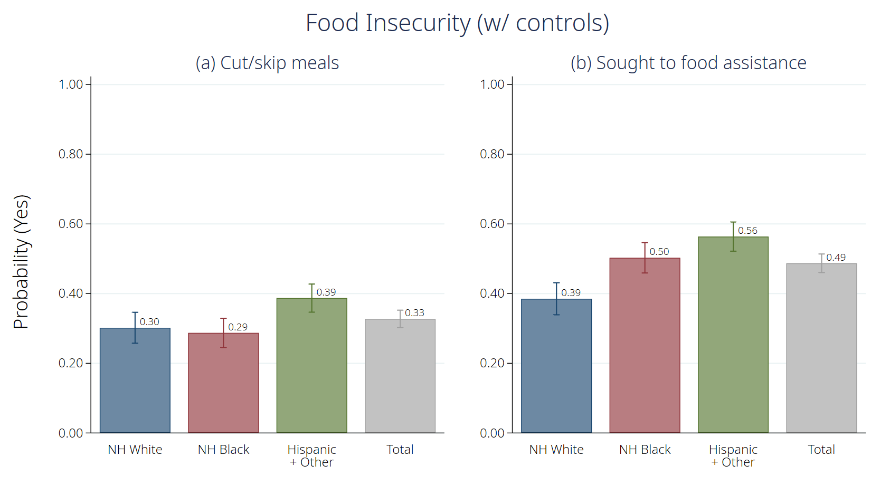

# Doubly Burdened: Race-Ethnic Disparities in the Effects of COVID-19 and COVID-19 Mitigation Strategies (NYS COVID-19 Disparities White Paper)

Authors: Ashley Fox<sup>1</sup> & Yongjin Choi<sup>2</sup></br>
_<sup>1</sup> Associate Professor, Department of Public Administration and Policy, Rockefeller College of Public Affairs and Policy, UAlbany</br>
<sup>2</sup> Doctoral Candidate, Department of Public Administration and Policy, Rockefeller College of Public Affairs and Policy, UAlbany_

**Prepared for the NYS COVID-19 Minority Health Disparities Team, University at Albany**

#### What's Included

* [Project Information](#project-information)
* [Abstract](#abstract)
* [Overview](#overview)
* [Methods](#methods)
* [Results](#results)
  * [Vaccine Hesitancy](#vaccine-hesitancy)
  * [Economic Impacts](#economic-impacts)
  * [Direct COVID19 Exposure and Impact](#direct-covid19-exposure-and-impact)
  * [School Closures](#school-closures)
  * [Race, Racism and Support for the Black Lives Matter Movement](#race-racism-and-support-for-the-black-lives-matter-movement)
  * [Policy Attitudes](#police-attitudes)
* [Conclusion](#conclusion)
* [Reference](#reference)


#### File Descriptions

* Data
  * **NYS_COVID19_Disparities_Numeric.csv**: Numeric version of the raw data
  * **NYS_COVID19_Disparities_Text.csv**: Text version of the raw data

* Codebook
  * **NYS_COVID19_Disparities_Codebook.docx**

* Review and Analysis
  * **White Paper.md**

Last updated: April 4th, 2021</br>

## Project Information

* Funding: The Community-Engagement Researchers Group, Governor's Task Force on COVID-19 Disparities, University at Albany.
* Time Period: Nov. 23. 2020 - Dec. 8. 2020.
* Sample Information
  * Size: 1,353 (based on Dec-11th version).
  * Ages 18 or higher
  * Area: New York State
* Method: Qualtrics Online survey.

## Abstract

Black and Hispanic populations across New York State and around the United States have been disproportionately impacted by COVID-19 both in terms of COVID-19 associated morbidity and mortality but also bearing a larger burden of the economic impacts. Race-ethnic minorities also experience more longstanding and justified distrust of the medical community, which could serve to prolong the pandemic effects in the most vulnerable communities by contributing to reduced vaccine uptake. This paper reports the results of a survey fielded in November 2020 with an oversampling of Non-Hispanic Black and Hispanic respondents across New York State concerning the impacts of the virus and intentions to seek vaccination and estimates of the social and economic impacts of COVID-19 on minority communities. Overall, the survey finds that Latinx populations have been especially negatively impacted by the virus followed by non-Hispanic (NH) Blacks and NH Whites. Consistent with other surveys, NH Blacks were more hesitant about vaccination than other groups; however, 42% of respondents reported that they would definitely get the vaccine as soon as possible and another 27% said they would probably get the vaccine. All groups reported substantial indirect economic and social effects related to stay-at-home orders including lost income, but Hispanics have been the most impacted population, followed by NH Blacks. More effort should be put in understanding and alleviating the economic and social harms from COVID-19 mitigation strategies and consideration should be given to how these economic and social effects may compound existing health disparities into the future.

## Overview

The SARS-CoV-2 virus (COVID-19), which was first identified in New York State (NYS) in February of last year, has exposed and heightened pre-existing inequalities of all kinds. However, while COVID-19 does not discriminate, efforts to prevent and contain it do. Black and Hispanic populations across NYS and around the United States are experiencing a double burden: Race-ethnic minorities have been disproportionately impacted by COVID-19 associated morbidity and mortality. Additionally, race-ethnic minorities are bearing a larger burden of the economic and social impacts of COVID-19 mitigation strategies. 

The COVID-19 vaccine offers hope of a reduction in both the direct health impacts from the disease and the indirect social and economic impacts, but only if enough trust can be built to assuage justified hesitancy.  Race-ethnic minorities experience more longstanding and justified distrust of the medical community, which could serve to prolong the pandemic effects in the most vulnerable communities by contributing to reduced vaccine uptake (Ray, 2020).

We fielded a survey of a diverse sample of New Yorkers to examine disparities in vaccine hesitancy and both the effects of COVID-19 and the effects of mitigation strategies (i.e., stay at home measures, school closures, economic impacts) on race-ethnic minorities compared with NH Whites.  We report the results of the survey in terms of overall effects on New Yorkers and broken out by race/ethnicity. 

## Methods

A survey of a sample of 1,353 Qualtrics respondents was fielded between November 23-December 8, 2020. Black and Hispanic respondents were oversampled to produce a balanced-sample of 429 non-Hispanic (NH) Whites, 443 NH Blacks and 481 Hispanics.  Respondents were drawn from both Downstate (43%) from Upstate (57%).  While the survey cannot be interpreted as representative of the population of the state of NY, the age and economic distribution match closely the pop of NY. 

We first examine race-ethnic disparities in hesitancy towards vaccination and the reasons for this. Next, we examine disparities in the economic and social impacts of COVID-19, support for the Black Lives Matter protests, and potential policy solutions preferred by different groups. We present the overall probability (percent) of respondents that endorse particular views broken out by race-ethnicity. We present the disparities unadjusted for and adjusted for socioeconomic confounders (e.g., age, gender, and annual household income in 2019).

### Data Prep

#### Delimiter, working directory, and description option


```stata
#delimit ;
clear all;
cd "[YOUR PATH]";
set more off;

set linesize 240;
display "{hline}";

set scheme s2color;
grstyle init;
grstyle color background white;

// Image Repository
global myimg "[YOUR IMAGE PATH]";

global grpcombine 
    b1("")
    ycommon
    xsize(9) ysize(5);
```

#### (Optional) Packages required


```stata
/*----- Installing Packages -----*/
ssc install estout, replace;
ssc install catplot, replace;
ssc install coefplot, replace;
ssc install tabout, replace;
ssc install grstyle, replace;
ssc install palettes, replace;
ssc install asdoc, replace;
```

#### Data Cleaning


```stata
/*----- Loading the data -----*/
use "NYS_COVID19_Disparities_Numeric", clear;

/*----- Variables -----*/
// Experiment 1
gen EXP1 = 0;
replace EXP1 = 1 if EXP1ARM1_COMP2 == 1;
label var EXP1 "Experiment1";
label define EXP1 0 "Broader Risk Group Arm" 1 "Racial Disparities Arm";
label values EXP1 EXP1;

// Race, ethnicity
gen RACE = 2;
replace RACE = 0 if DEMO_15 == "1";
replace RACE = 1 if DEMO_15 == "2";
label var RACE "Race";
label define RACE 0 "White" 1 "Black" 2 "Others"; // Please note that the "Others" category includes those who checked white or African American with other categories.
label values RACE RACE;

gen HISPANIC = 0;
replace HISPANIC = 1 if DEMO_14 == 1;
label var HISPANIC "Hispanic";
label define HISPANIC 0 "Non Hispanic" 1 "Hispanic";
label values HISPANIC HISPANIC;

replace DEMO_14_1 = 0 if DEMO_14_1 == . | DEMO_14_1 == 6;
label define DEMO_14_1 0 "Non Hispanic" 1 "Puerto Rican" 1 "Mexican" 2 "Dominican" 3 "Cuban" 4 "Other Hispanic";
label values DEMO_14_1 DEMO_14_1;

recode RACE (0=1 "White") (1=4 "Black") (2=7 "Other"), generate(RACE5);
generate RACE_ETHNICITY5 = RACE5+ HISPANIC;
tab RACE_ETHNICITY5;
recode RACE_ETHNICITY5 (1=0 "NH White") (4=1 "NH Black") (2 5 7 8=2 "Hispanic + Other"), generate(race_ethnicity_final);

// Metropolitan area: Based on zipcode (DEMO_4), New York (100-102), Bronx (104), Kings (112), and Queens (11004, 11005, 111, 114-116) are coded as 1
gen METRO = string(DEMO_4);
replace METRO = "00" + METRO if strlen(METRO) == 3;
replace METRO = "0" + METRO if strlen(METRO) == 4;
replace METRO = "1" if METRO == "11004" | METRO == "11005";
replace METRO = substr(METRO, 1, 3) if METRO != "1";
replace METRO = "1" if inlist(METRO, "100", "101", "102", "104", "110", "111" "112", "113", "114", "116");
replace METRO = "0" if METRO != "1";
destring METRO, replace;
label var METRO "Metropolitan Area (New York, Bronx, Kings, Queens)";
label define METRO 0 "Others" 1 "Metropolitan Area"; // Please note that the "Others" category includes those who checked white or African American with other categories.
label values METRO METRO;

// Age groups
gen AGE = DEMO_3 + 9;
replace AGE = 0 if AGE <= 29;
replace AGE = 1 if AGE >= 30 & AGE <= 39;
replace AGE = 2 if AGE >= 40 & AGE <= 49;
replace AGE = 3 if AGE >= 50 & AGE <= 59;
replace AGE = 4 if AGE >= 60;
label var AGE "Age";
label define AGE 0 "18-29" 1 "30-39" 2 "40-49" 3 "50-59" 4 ">60"; // Please note that the "Others" category includes those who checked white or African American with other categories.
label values AGE AGE;

//----- Media 1: How much media coverage of Coronavirus have you been consuming in the past week? -----//
gen MEDIA_FREQ = 0;
replace MEDIA_FREQ = 3 if MEDIA_1 == 1;
replace MEDIA_FREQ = 2 if MEDIA_1 == 2;
replace MEDIA_FREQ = 1 if MEDIA_1 == 3;
destring MEDIA_FREQ, replace;
label var MEDIA_FREQ "Media Consumption";
label define MEDIA_FREQ 0 "< Weekely" 1 "Weekly" 2 "Daily" 3 "> Daily";
label values MEDIA_FREQ MEDIA_FREQ;

// Media 2: Of the following TV news media outlets, which would you say is your primary source of news information?
gen MEDIA_FOX = 0;
replace MEDIA_FOX = 1 if MEDIA_2 == 1;
label var MEDIA_FOX "Fox News Viewers";
label define MEDIA_FOX 0 "Others" 1 "Fox News Viewer";
label values MEDIA_FOX MEDIA_FOX;


/*----- Vaccine Questions -----*/
// Vaccine 1: If a vaccine to prevent COVID-19 was approved by the FDA through normal procedures and available today for free to the public, would you...
gen VACC_TAKE = 0;
replace VACC_TAKE = 1 if VACCINE_1 <= 2;
label var VACC_TAKE "Willingness to get the vaccine, dichotomized";
label define VACC_TAKE 0 "Get the vaccine" 1 "Don't get the vaccine";
label values VACC_TAKE VACC_TAKE;

gen VACC_TAKE3 = 1;
replace VACC_TAKE3 = 2 if VACCINE_1 == 2 | VACCINE_1 == 3;
replace VACC_TAKE3 = 3 if VACCINE_1 == 4;
label var VACC_TAKE3 "Willingness to get the vaccine, 3 categories";
label define VACC_TAKE3 1 "Definitely get the vaccine" 2 "Prabably get or don't got" 3 "Definitely don't get the vaccine";
label values VACC_TAKE3 VACC_TAKE3;

recode VACCINE_1 (1=1 "definitely get vaccine") (2 3=0 "maybe get vaccine") (4=-1 "definitely not"), generate(vac_willingness);
recode VACCINE_1 (1 2=1 "Probably will get vaccine") (3 4=0 "probably will not get vaccine"), generate(vac_willingness_dummy);
recode VACCINE_1 (1=1 "Definitely will get vaccine") (2 3 4=0 "may get vacccine"), generate(definitely_vax_dummy);
recode VACCINE_1 (4=1 "Definitely will not get vaccine") (1 2 3=0 "will probably get vacccine"), generate(anti_vax_dummy);
label var anti_vax_dummy "Definitely Will not get vaccine";
recode VACCINE_1 (3=1 "Probably will not get vaccine") (1 2 4=0 "will probably get vacccine"), generate(prob_not_vax_dummy);

recode VACCINE_3 (1=1 "overeaction") (2=2 "still serious") (3=3 "very serious"), generate(seriousness_of_COVID);
recode VACCINE_4 (1=1 "threat to economy greater") (0=0 "threat to health greater"), generate(threat_to_econ);

recode VACCINE_2_1 (1=2 "major reason") (2=1 "minor reason") (3=0 "not a reason"), generate(vac_2_1_side_effect);
recode VACCINE_2_2 (1=2 "major reason") (2=1 "minor reason") (3=0 "not a reason"), generate(vac_2_2_dis_not_bad);
recode VACCINE_2_3 (1=2 "major reason") (2=1 "minor reason") (3=0 "not a reason"), generate(vac_2_3_not_high_risk);
recode VACCINE_2_4 (1=2 "major reason") (2=1 "minor reason") (3=0 "not a reason"), generate(vac_2_4_effectiveness);
recode VACCINE_2_5 (1=2 "major reason") (2=1 "minor reason") (3=0 "not a reason"), generate(vac_2_5_afraid_of_needles);
recode VACCINE_2_6 (1=2 "major reason") (2=1 "minor reason") (3=0 "not a reason"), generate(vac_2_6_relig_object);

recode VACCINE_9_1 (1 2= 1 "Agree vac help myself") (3 4=0), generate(vac_help_myself);
recode VACCINE_9_2 (1 2= 1 "Agree vac help family") (3 4=0), generate(vac_help_family);
recode VACCINE_9_3 (1 2= 1 "Agree vac help community") (3 4=0), generate(vac_help_community);

recode VACCINE_13 (1 = 1 "Yes") (2 = 0 "No") (3 = .), generate(VACCINE13);
label var VACCINE13 "Had flu vaccine since Aug 2020";

// Vaccine 2
recode VACCINE_2_1 (1 = 1 "A major reason") (2 3 = 0 "A minor or not a reason"), generate(VACCINE21);
recode VACCINE_2_2 (1 = 1 "A major reason") (2 3 = 0 "A minor or not a reason"), generate(VACCINE22);
recode VACCINE_2_3 (1 = 1 "A major reason") (2 3 = 0 "A minor or not a reason"), generate(VACCINE23);
recode VACCINE_2_4 (1 = 1 "A major reason") (2 3 = 0 "A minor or not a reason"), generate(VACCINE24);
recode VACCINE_2_5 (1 = 1 "A major reason") (2 3 = 0 "A minor or not a reason"), generate(VACCINE25);
recode VACCINE_2_6 (1 = 1 "A major reason") (2 3 = 0 "A minor or not a reason"), generate(VACCINE26);

// Vaccine 7: Does wearing a mask help to reduce the spread of the coronavirus?
gen BELIEVE_MASK = 0;
replace BELIEVE_MASK = 1 if VACCINE_7 <= 2;
label var BELIEVE_MASK "Does wearing a mask help to reduce the spread of the coronavirus?, recoded from VACCINE_7";
label define BELIEVE_MASK 0 "No/Not sure" 1 "Yes";
label values BELIEVE_MASK BELIEVE_MASK;

// COVID-19 Anxiety
gen WORRY_CONTRACTING = 0;
replace WORRY_CONTRACTING = 1 if SD_1_1 <= 2;
label var WORRY_CONTRACTING "Worry: Contracting Coronavirus";
label define WORRY_CONTRACTING 0 "Not worried at all" 1 "Worried";
label values WORRY_CONTRACTING WORRY_CONTRACTING;

// Exposure
recode EXPOSURE_2 (1 2 = 1 "Yes") (3 = 0 "No"), generate(EXPOSURE2);
label var EXPOSURE2 "Self tested positive";
recode EXPOSURE_3 (1 = 1 "Yes") (2 = 0 "No"), generate(EXPOSURE3);
label var EXPOSURE3 "Immediate family tested positive";
recode EXPOSURE_4 (1 = 1 "Yes") (2 = 0 "No") (3 = .), generate(EXPOSURE4);
label var EXPOSURE4 "Immediate family died";
recode EXPOSURE_5 (1 = 1 "Yes") (2 = 0 "No"), generate(EXPOSURE5);
label var EXPOSURE5 "Close friends tested positive";
recode EXPOSURE_6 (1 = 1 "Yes") (2 = 0 "No") (3 = .), generate(EXPOSURE6);
label var EXPOSURE6 "Close friends died";

// Food Insecurity
recode FOOD_1 (1 = 1 "Yes") (2 = 0 "No"), generate(FOOD1);
label var FOOD1 "Cut/skip meals";
gen FOOD2 = cond(strpos(FOOD_2,"1") + strpos(FOOD_2,"2") + strpos(FOOD_2,"3") + strpos(FOOD_2,"4") + strpos(FOOD_2,"5") > 0, 1, 0);
label var FOOD2 "Sought to food assistance";

// Child Care
recode CHILD_2_15_VACCINE (1 2 = 1 "Support") (3 4 = 0 "Oppose"), generate(CHILD_VACC);
label var CHILD_VACC "Child Vaccination";

gen CHILD2_2 = cond(strpos(CHILD_2_2, "1") > 0, 1,
               cond(CHILD_2_2 == "", ., 0));
label var CHILD2_2 "Full-time in person classes";

recode CHILD_2_3 (1 = 1 "Yes") (2 = 0 "No"), generate(CHILD2_3);
label var CHILD2_3 "Joined pod";

recode CHILD_2_5 (1 = 1 "Yes") (2 = 0 "No") (3 = .), generate(CHILD2_5);
label var CHILD2_3 "Kids' complications";

recode CHILD_2_8 (1 = 1 "Yes") (2 = 0 "No"), generate(CHILD2_8);
label var CHILD2_8 "Internet Access";

recode CHILD_2_9 (1 = 1 "Never") (2 3 4 = 0 "Sometimes/A lot/All the time") (5 = .), generate(CHILD2_9);
label var CHILD2_9 "Leaving child at unsafe circumstances";

recode CHILD_2_10 (1 = 1 "A lot") (2 3 = 0 "A little/No"), generate(CHILD2_10);
label var CHILD2_10 "Trouble in finding childcare";

// BLM
recode BLM_1 (1 2 = 1 "Extremely/Somewhat") (3 4 = 0 "A little bit/Not at all"), generate(BLM1);
label var BLM1 "Greater pandemic damage to the colored";

recode BLM_2 (1 2 = 1 "Support") (3 4 = 0 "Oppose"), generate(BLM2);
label var BLM2 "Feeling about the BLM";

recode BLM_8 (1 = 1 "Yes, in support") (2 3 4 5 = 0 "Others"), generate(BLM8);
label var BLM8 "Participation in BLM";

recode BLM_11 (1 = 1 "Never") (2 3 = 0 "At least once"), generate(BLM11);
label var BLM11 "Unfair treatments by the police";

// M4A and Policy
gen M4A7_1 = cond(strpos(M4A_7, "2"), 1, 0);
label var M4A7_1 "Top 3 Fed-Gov's response to the pandemic: Another one-time payment";
gen M4A7_2 = cond(strpos(M4A_7, "2"), 1, 0);
label var M4A7_2 "Top 3 Fed-Gov's response to the pandemic: Additional unemp. booster";
gen M4A7_3 = cond(strpos(M4A_7, "3"), 1, 0);
label var M4A7_3 "Top 3 Fed-Gov's response to the pandemic: Continue eviction rent relief";
gen M4A7_4 = cond(strpos(M4A_7, "4"), 1, 0);
label var M4A7_4 "Top 3 Fed-Gov's response to the pandemic: Continue maratoriums on other bills";
gen M4A7_5 = cond(strpos(M4A_7, "5"), 1, 0);
label var M4A7_5 "Top 3 Fed-Gov's response to the pandemic: Stimulus for small businesses";
gen M4A7_6 = cond(strpos(M4A_7, "6"), 1, 0);
label var M4A7_6 "Top 3 Fed-Gov's response to the pandemic: Stimulus for large businesses";
gen M4A7_7 = cond(strpos(M4A_7, "7"), 1, 0);
label var M4A7_7 "Top 3 Fed-Gov's response to the pandemic: Guarantee the salary";

recode M4A_8 (1 2 = 1 "Support") (3 4 5 = 0 "Oppose/don't know"), generate(M4A8);
label var M4A_8 "Support for the basic income";

recode M4A_3 (1 2 = 1 "Support") (3 4 5 = 0 "Oppose/don't know"), generate(M4A3);
label var M4A3 "Support for M4A";

recode BLM_9 (1 2 = 1 "Support") (3 4 5 = 0 "Oppose/don't know"), generate(BLM9);
label var BLM9 "Reallocating policy funding";

/*----- Ideology and Demographic Information -----*/
recode IDEOLOGY_1 (1=0 "Democrat") (2=1 "Republican") (3 4=2 "Others"), generate(IDEOLOGY);
recode DEMO_10 (1=1 "female") (2 3=0 "male or other"), generate(female);
recode DEMO_11 (1 2 3=0 "High school or less") (4=1 "Associate") (5=2 "College or University") (6=3 "Graduage"), generate(EDUCATION);
recode DEMO_12 (1 2=0 "<$20,000") (3 4=1 "$20,001-$75,000") (5 6 7 8=2 ">$75,001"), generate(INCOME);
```

    
    (3 observations deleted)
    
    (590 observations deleted)
    
    (5 observations deleted)
    
    
    (680 real changes made)
    
    
    
    
    
    (628 real changes made)
    
    (544 real changes made)
    
    
    
    
    
    (448 real changes made)
    
    
    
    
    (916 real changes made)
    
    
    
    (1353 differences between RACE and RACE5)
    
    
    
    RACE_ETHNIC |
           ITY5 |      Freq.     Percent        Cum.
    ------------+-----------------------------------
              1 |        429       31.71       31.71
              2 |        199       14.71       46.42
              4 |        443       32.74       79.16
              5 |        101        7.46       86.62
              7 |         33        2.44       89.06
              8 |        148       10.94      100.00
    ------------+-----------------------------------
          Total |      1,353      100.00
    
    (1154 differences between RACE_ETHNICITY5 and race_ethnicity_final)
    
    
    (1 real change made)
    
    (6 real changes made)
    
    (4 real changes made)
    
    (1,349 real changes made)
    
    (575 real changes made)
    
    (774 real changes made)
    
    METRO: all characters numeric; replaced as byte
    
    
    
    
    
    (418 real changes made)
    
    (341 real changes made)
    
    (204 real changes made)
    
    (173 real changes made)
    
    (217 real changes made)
    
    
    
    
    
    (512 real changes made)
    
    (482 real changes made)
    
    (238 real changes made)
    
    MEDIA_FREQ already numeric; no replace
    
    
    
    
    
    (295 real changes made)
    
    
    
    
    
    (931 real changes made)
    
    
    
    
    
    (592 real changes made)
    
    (189 real changes made)
    
    
    
    
    (781 differences between VACCINE_1 and vac_willingness)
    
    (781 differences between VACCINE_1 and vac_willingness_dummy)
    
    (781 differences between VACCINE_1 and definitely_vax_dummy)
    
    (1353 differences between VACCINE_1 and anti_vax_dummy)
    
    
    (1353 differences between VACCINE_1 and prob_not_vax_dummy)
    
    (0 differences between VACCINE_3 and seriousness_of_COVID)
    
    (0 differences between VACCINE_4 and threat_to_econ)
    
    (1353 differences between VACCINE_2_1 and vac_2_1_side_effect)
    
    (1353 differences between VACCINE_2_2 and vac_2_2_dis_not_bad)
    
    (1353 differences between VACCINE_2_3 and vac_2_3_not_high_risk)
    
    (1353 differences between VACCINE_2_4 and vac_2_4_effectiveness)
    
    (1353 differences between VACCINE_2_5 and vac_2_5_afraid_of_needles)
    
    (1353 differences between VACCINE_2_6 and vac_2_6_relig_object)
    
    (698 differences between VACCINE_9_1 and vac_help_myself)
    
    (733 differences between VACCINE_9_2 and vac_help_family)
    
    (731 differences between VACCINE_9_3 and vac_help_community)
    
    (650 differences between VACCINE_13 and VACCINE13)
    
    
    (602 differences between VACCINE_2_1 and VACCINE21)
    
    (1084 differences between VACCINE_2_2 and VACCINE22)
    
    (1029 differences between VACCINE_2_3 and VACCINE23)
    
    (573 differences between VACCINE_2_4 and VACCINE24)
    
    (1082 differences between VACCINE_2_5 and VACCINE25)
    
    (1109 differences between VACCINE_2_6 and VACCINE26)
    
    
    (1,181 real changes made)
    
    note: label truncated to 80 characters
    
    
    
    
    (1,216 real changes made)
    
    
    
    
    (1070 differences between EXPOSURE_2 and EXPOSURE2)
    
    
    (934 differences between EXPOSURE_3 and EXPOSURE3)
    
    
    (1117 differences between EXPOSURE_4 and EXPOSURE4)
    
    
    (802 differences between EXPOSURE_5 and EXPOSURE5)
    
    
    (1026 differences between EXPOSURE_6 and EXPOSURE6)
    
    
    (910 differences between FOOD_1 and FOOD1)
    
    
    
    
    (223 differences between CHILD_2_15_VACCINE and CHILD_VACC)
    
    
    (899 missing values generated)
    
    
    (219 differences between CHILD_2_3 and CHILD2_3)
    
    
    (335 differences between CHILD_2_5 and CHILD2_5)
    
    
    (35 differences between CHILD_2_8 and CHILD2_8)
    
    
    (282 differences between CHILD_2_9 and CHILD2_9)
    
    
    (229 differences between CHILD_2_10 and CHILD2_10)
    
    
    (688 differences between BLM_1 and BLM1)
    
    
    (654 differences between BLM_2 and BLM2)
    
    
    (867 differences between BLM_8 and BLM8)
    
    
    (667 differences between BLM_11 and BLM11)
    
    
    
    
    
    
    
    
    
    
    
    
    
    
    
    
    (777 differences between M4A_8 and M4A8)
    
    
    (822 differences between M4A_3 and M4A3)
    
    
    (754 differences between BLM_9 and BLM9)
    
    
    (1353 differences between IDEOLOGY_1 and IDEOLOGY)
    
    (667 differences between DEMO_10 and female)
    
    (1350 differences between DEMO_11 and EDUCATION)
    
    (1353 differences between DEMO_12 and INCOME)
    
    file NYS_COVID19_Disparities.dta saved
    

## Results

### Vaccine Hesitancy

#### Are minorities more vaccine hesitant and why?

Previous research has shown that race-ethnic minorities tend to be more vaccine hesitant than other groups owing to justified mistrust of the medical establishment due to historical mistreatment and implicit bias in medical care provision (Ray, 2020). In keeping with other studies, our survey found elevated mistrust of the vaccine among NH Blacks compared with NH Whites and Hispanics.  We asked respondents if a vaccine to prevent COVID-19 was approved by the FDA through normal procedures and available today for free to the public, how likely they would be to vaccinate as soon as possible. Overall, 42% of the sample reported that they would definitely get the vaccine as soon as possible, 44% would potentially get or not get the vaccine and 14% reported that they would definitely not get the vaccine. 

The probability of stating they would definitely not get the vaccine was 5.5 percentage points higher among Non-Hispanic Blacks with nearly 18% reporting they did not intend to get the vaccine.  Even after adjustment for confounders including income and education, NH Blacks were still more likely than other groups to report hesitancy. The percent stating they would definitely not get the vaccine was highest among NH Black women with 23% reporting they would definitely not vaccinate right away.  

If all individuals that reported some hesitancy towards getting the vaccine (44%) were to get the vaccine in addition to those who stated they would definitely get it (42%), this would be enough to achieve the levels of herd immunity that are being recommended by the CDC even without the most hesitant getting the vaccine. On the other hand, about one third expressed they would not get the vaccine even once it became widely available.

**Fig.1:** Proportion reporting they would definitely NOT get a COVID-19 vaccine ASAP w/ and w/o controls


NOTES: The proportion x 100 can be interpreted a percent; Controls include age, gender, and annual household income in 2019


```stata
/*----- Figure 1 -----*/
eststo clear;
local outcomes anti_vax_dummy;
local title0 "Vaccine Hesitancy";

local num = 1;
foreach x in `outcomes' {;
    
    eststo lm`num': qui reg `x' i.race_ethnicity_final i.AGE i.female i.INCOME;
    eststo mfx`num': qui margins, at(race_ethnicity_final=(0(1)2)) vsquish post;
    eststo lm1_`num': qui reg `x';
    qui coefplot (mfx`num', keep(1._at))
         (mfx`num', keep(2._at))
         (mfx`num', keep(3._at))
         (lm1_`num', keep(_cons) ciopts(color(gs10) recast(rcap)) color(gs10))
      , xtitle("") ytitle("")
        vertical legend(off) nooffsets recast(bar) barwidth(0.8) fcolor(*.8)
        citop ciopts(recast(rcap)) format(%9.2f)
        coeflabels(1._at = "NH White" 2._at = "NH Black" 3._at = `""Hispanic" "+ Other""' _cons = "Total", notick labgap(2)) plotregion(margin(b=0))
        addplot(scatter @b @at, ms(i) mlabel(@b) mlabpos(2) mlabcolor(black)) ylab(, ang(hor)) yscale(range(0.1(0.1)1))
        xsize(8) ysize(5)
        name(g`num', replace);
    
    local num = `num' + 1;
};

graph combine g1, 
    title("`title0' (w/ controls)")
    b1("")
    l1("Probability (Definitely will not get the vaccine)")
    ycommon
    xsize(9) ysize(5);

graph export "$myimg\vaccine1_control.png", replace;
```

[Back to Top](#top)

#### What are the major vaccine concerns?

Concern about side-effects and wanting to know more about how well it works were the two biggest concerns mentioned with more than half of the sample stating these were major concerns. These concerns were highest among NH Blacks both with and without adjustment for confounders. Hispanics were somewhat more likely than other groups to express other reasons for not vaccinating including that the disease is not that bad, not being in a high-risk group and religious objections. 

**Fig.2:** Proportion reporting major reasons they would be concerned about getting a COVID-19 vaccine ASAP w/ and w/o controls


NOTES: The proportion x 100 can be interpreted a percent; Controls include age, gender, and annual household income in 2019


```stata
/*----- Figure 2 -----*/
eststo clear;
local outcomes VACCINE21 VACCINE22 VACCINE23 VACCINE24 VACCINE25 VACCINE26;
local title0 "Why would you NOT get a vaccine to prevent COVID-19?";
local title1 "(a) Concern about side effects";
local title2 "(b) The disease is not that bad ";
local title3 "(c) I am not in a high-risk group";
local title4 "(d) Want to know about how well it works";
local title5 "(e) Afraid of needles";
local title6 "(f) Religious objection";

local num = 1;
foreach x in `outcomes' {;
    
    eststo lm`num': qui reg `x' i.race_ethnicity_final i.AGE i.female i.INCOME;
    eststo mfx`num': qui margins, at(race_ethnicity_final=(0(1)2)) vsquish post;
    eststo lm1_`num': qui reg `x';
    qui coefplot (mfx`num', keep(1._at))
         (mfx`num', keep(2._at))
         (mfx`num', keep(3._at))
         (lm1_`num', keep(_cons) ciopts(color(gs10) recast(rcap)) color(gs10))
      , title("`title`num''") xtitle("") ytitle("")
        vertical legend(off) nooffsets recast(bar) barwidth(0.8) fcolor(*.8)
        citop ciopts(recast(rcap)) format(%9.2f)
        coeflabels(1._at = "NH White" 2._at = "NH Black" 3._at = `""Hispanic" "+ Other""' _cons = "Total", notick labgap(2)) plotregion(margin(b=0))
        addplot(scatter @b @at, ms(i) mlabel(@b) mlabpos(2) mlabcolor(black)) ylab(, ang(hor)) yscale(range(0.1(0.1)1))
        xsize(8) ysize(5)
        name(g`num', replace);
    
    local num = `num' + 1;
};

graph combine g1 g2 g3 g4 g5 g6, 
    title("`title0' (w/ controls)")
    b1("")
    l1("Probability (A major reason)")
    ycommon
    xsize(9) ysize(5);
graph export "$myimg\vaccine1_2_control.png", replace;
```

[Back to Top](#top)

#### What is the best way to distribute the vaccine to encourage broader uptake, especially in minority communities?

NYS has developed an Equity Task Force that will work to ensure that vulnerable and underserved communities are not left behind by breaking down the barriers to vaccination and will ensure there is equitable distribution of the vaccine across the state. One strategy to increase vaccination includes actively promoting vaccination in communities that have both the highest rates of COVID-19 transmission and also may be the most hesitant to receive the vaccine. In addition, many of the most vulnerable communities are considered to be “health care deserts,” lacking the basic infrastructure to effectively deliver vaccines. As a consequence, the state is planning to distribute Community Vaccination Kits to communities, particularly those located within health care deserts, with the supplies and resources needed for setting up “pop-up” vaccination sites.

Respondents were asked about what types of delivery would make them more likely to vaccinate. Among the options, the probabilities were similar, except requiring people to pay \$20 of the out of pocket, which reduced people’s likelihood of vaccination. Importantly, delivery via Community Health Workers and Mobile Clinics, two strategies designed to improve access in minority communities, were not more likely than requirements or other measures in encouraging uptake with just over half of respondents reporting this measure would make them somewhat or much more likely to get the vaccine. All of the delivery options were more likely to encourage NH White and Hispanics to vaccinate while having less influence on NH Blacks both with and without controls. 

**Fig.3:** Proportion reporting that specific distribution mechanisms would make them more likely to get the COVID-19 vaccine w/ and w/o controls


NOTES: The proportion x 100 can be interpreted a percent; Controls include age, gender, and annual household income in 2019


```stata
*----- Figure 3 -----*
gen DELIV_1 = cond(DELIVERY_1 <= 2, 1, 0);
gen DELIV_2 = cond(DELIVERY_2 <= 2, 1, 0);
gen DELIV_3 = cond(DELIVERY_3 <= 2, 1, 0);
gen DELIV_4 = cond(DELIVERY_4 <= 2, 1, 0);
gen DELIV_5 = cond(DELIVERY_5 <= 2, 1, 0);
gen DELIV_6 = cond(DELIVERY_6 <= 2, 1, 0);
gen DELIV_7 = cond(DELIVERY_7 <= 2, 1, 0);

eststo clear;
local outcomes DELIV_1 DELIV_2 DELIV_3 DELIV_4 DELIV_5 DELIV_6 DELIV_7;
local title0 "How much would the following influence you getting vaccinated?";
local title1 "(a) Required to board a plane";
local title2 "(b) Workplace requre";
local title3 "(c) Free at retail";
local title4 "(d) Community health workers";
local title5 "(e) Mobile clinic";
local title6 "(f) $20 OOP";
local title7 "(g) Insu or Gov pay $20";

local num = 1;
foreach x in `outcomes' {;
    
    eststo lm`num': qui reg `x' i.race_ethnicity_final i.AGE i.female i.INCOME;
    eststo mfx`num': qui margins, at(race_ethnicity_final=(0(1)2)) vsquish post;
    eststo lm1_`num': qui reg `x';
    qui coefplot (mfx`num', keep(1._at))
                 (mfx`num', keep(2._at))
                 (mfx`num', keep(3._at))
                 (lm1_`num', keep(_cons) ciopts(color(gs10) recast(rcap)) color(gs10))
      , title("`title`num''") xtitle("") ytitle("")
        vertical legend(off) nooffsets recast(bar) barwidth(0.8) fcolor(*.8)
        citop ciopts(recast(rcap)) format(%9.2f)
        coeflabels(1._at = "NH White" 2._at = "NH Black" 3._at = `""Hispanic" "+ Other""' _cons = "Total", notick labgap(2)) plotregion(margin(b=0))
        addplot(scatter @b @at, ms(i) mlabel(@b) mlabpos(2) mlabcolor(black)) ylab(, ang(hor)) yscale(range(0.1(0.1)1))
        xsize(8) ysize(5)
        name(g`num', replace);
    
    local num = `num' + 1;
};

graph combine g1 g2 g3 g4 g5 g6 g7, 
    title("`title0' (w/ controls)")
    b1("")
    l1("Probability (Much/Somewhat more likely)")
    ycommon
    xsize(9) ysize(5);
graph export "$myimg\vaccine2_controls.png", replace;
```

[Back to Top](#top)

Parents were asked about their support for schools requiring children to vaccinate against COVID-19 to attend school if it would enable schools to fully reopen for in-person instruction (Fig 4). Eighty-four percent reported they would somewhat or strongly support this measure with little difference across race-ethnic groups, and 16% somewhat or strongly opposed the idea, with 9% strongly opposing.  This degree of hesitancy was slightly lower than observed for adult vaccination, but comports with national estimates that 84% of parents support childhood vaccinations down from 94% in 2001 (Russell, 2021).

**Fig.4:** Proportion supporting for requiring children to vaccinate against COVID-19 to attend school if it would enable schools to fully reopen w/ and w/o controls


NOTES: The proportion x 100 can be interpreted a percent; Controls include age, gender, and annual household income in 2019. These results are from a subsample of 468 parents.


```stata
*----- Figure 4 -----*
eststo clear;
local outcomes CHILD_VACC;
local title0 "Support for Requiring the School Vaccination";

local num = 1;
foreach x in `outcomes' {;
    
    eststo lm`num': qui reg `x' i.race_ethnicity_final i.AGE i.female i.INCOME;
    eststo mfx`num': qui margins, at(race_ethnicity_final=(0(1)2)) vsquish post;
    eststo lm1_`num': qui reg `x';
    qui coefplot (mfx`num', keep(1._at))
         (mfx`num', keep(2._at))
         (mfx`num', keep(3._at))
         (lm1_`num', keep(_cons) ciopts(color(gs10) recast(rcap)) color(gs10))
      , xtitle("") ytitle("")
        vertical legend(off) nooffsets recast(bar) barwidth(0.8) fcolor(*.8)
        citop ciopts(recast(rcap)) format(%9.2f)
        coeflabels(1._at = "NH White" 2._at = "NH Black" 3._at = `""Hispanic" "+ Other""' _cons = "Total", notick labgap(2)) plotregion(margin(b=0))
        addplot(scatter @b @at, ms(i) mlabel(@b) mlabpos(2) mlabcolor(black)) ylab(, ang(hor)) yscale(range(0.1(0.1)1))
        xsize(8) ysize(5)
        name(g`num', replace);
    
    local num = `num' + 1;
};

graph combine g1, 
    title("`title0' (w/ controls)")
    b1("")
    l1("Probability (Support)")
    ycommon
    xsize(9) ysize(5);

graph export "$myimg\vaccine2_2_control.png", replace;
```

[Back to Top](#top)

#### Since August 2020, have you had a seasonal flu vaccination?

In the present survey, 54% of the sample reported having received their flu vaccine since August, which is higher than typically observed in national surveys and higher than a survey from November 2019, but still less than is necessary to build herd immunity against the flu (CDC, 2019).  NH Blacks had substantially lower rates of flu vaccination than NH Whites at 43% compared with 62% among Whites. Hispanics also had lower vaccination rates at 56%. Adjustment for confounders did little to alter the disparity in vaccine uptake.

Receiving the flu vaccine is even more important during the pandemic than in a normal year for several reasons. First, by vaccinating against the flu, it will be easier for people to distinguish when their symptoms are likely to be the seasonal flu versus Coronavirus. Second, increased flu vaccination coverage could reduce hospitalizations related to complications from the flu. The CDC estimates the flu-related hospitalizations could be reduced by between 4,000 to 11,000 hospitalizations if coverage of the flu vaccine was increased by five percentage points (Hughes et al, 2019).

Prior to the pandemic, flu vaccination coverage rates were relatively low and not high enough to confer herd immunity against the flu. Based on self-reported estimates, in 2019, 63% of children aged 6 months to 17 years received a flu vaccination and 45% among adults ≥18 years, though coverage rates vary greatly by state (CDC, 2019). 

**Fig.5:** Proportion reporting that they received the flu vaccine since August w/ and w/o controls 


NOTES: The proportion x 100 can be interpreted a percent; Controls include age, gender, and annual household income in 2019


```stata
*----- Figure 5 -----*
eststo clear;
local outcomes VACCINE13;
local title0 "Flu Vaccine since Aug 2020";
local probtext " (Yes)";

local num = 1;
foreach x in `outcomes' {;
    
    eststo lm`num': qui reg `x' i.race_ethnicity_final i.AGE i.female i.INCOME;
    eststo mfx`num': qui margins, at(race_ethnicity_final=(0(1)2)) vsquish post;
    eststo lm1_`num': qui reg `x';
    qui coefplot (mfx`num', keep(1._at))
     (mfx`num', keep(2._at))
     (mfx`num', keep(3._at))
     (lm1_`num', keep(_cons) ciopts(color(gs10) recast(rcap)) color(gs10))
  , xtitle("") ytitle("")
    vertical legend(off) nooffsets recast(bar) barwidth(0.8) fcolor(*.8)
    citop ciopts(recast(rcap)) format(%9.2f)
    coeflabels(1._at = "NH White" 2._at = "NH Black" 3._at = `""Hispanic" "+ Other""' _cons = "Total", notick labgap(2)) plotregion(margin(b=0))
    addplot(scatter @b @at, ms(i) mlabel(@b) mlabpos(2) mlabcolor(black)) ylab(, ang(hor)) yscale(range(0.1(0.1)1))
    xsize(8) ysize(5)
    name(g`num', replace);
    
    local num = `num' + 1;
};

graph combine g1,
    l1("Probability`probtext'")
    title("`title0' (w/ controls)")
    $grpcombine;

graph export "$myimg\vaccine3_controls.png", replace;
```

[Back to Top](#top)

### Economic Impacts

#### Have minorities been more affected by the economic impacts of the pandemic and why?

_Job-related disruptions_

Nearly half of the sample reported having experienced some kind of job disruption due to the economic effects of the virus.  Overall, the probabilities of having experienced a job disruption are higher among the minority groups, especially Hispanics. Hispanics were 11 percentage points higher more likely to have experienced a job disruption compared with NH Whites though this reduced after adjustment for confounders. Thirteen percent reported having lost their job, 15% were furloughed, 21% experienced reduced hours and 16% had lost their health insurance. 

**Fig.6:** Proportion reporting that their work situation had changed since the start of the pandemic w/ and w/o controls


NOTES: The proportion x 100 can be interpreted a percent; Controls include age, gender, and annual household income in 2019


```stata
*----- Figure 6 -----*
eststo clear;
local outcomes JOBLOSS FURLOUGHED REDUCEHOUR PAYCUT INSURANCE_LOSS ANYJOBISSUE;
local title0 "Work changed since the start of the Coronavirus crisis?";
local title1 "(a) Job Loss";
local title2 "(b) Furloughed";
local title3 "(c) Reduced Hours";
local title4 "(d) Pay Cut";
local title5 "(e) Insurance Loss";
local title6 "(f) Any Job Issues";

local num = 1;
foreach x in `outcomes' {;
    
    eststo lm`num': qui reg `x' i.race_ethnicity_final i.AGE i.female i.INCOME;
    eststo mfx`num': qui margins, at(race_ethnicity_final=(0(1)2)) vsquish post;
    eststo lm1_`num': qui reg `x';
    qui coefplot (mfx`num', keep(1._at))
         (mfx`num', keep(2._at))
         (mfx`num', keep(3._at))
         (lm1_`num', keep(_cons) ciopts(color(gs10) recast(rcap)) color(gs10))
      , title("`title`num''") xtitle("") ytitle("")
        vertical legend(off) nooffsets recast(bar) barwidth(0.8) fcolor(*.8)
        citop ciopts(recast(rcap)) format(%9.2f)
        coeflabels(1._at = "NH White" 2._at = "NH Black" 3._at = `""Hispanic" "+ Other""' _cons = "Total", notick labgap(2)) plotregion(margin(b=0))
        addplot(scatter @b @at, ms(i) mlabel(@b) mlabpos(2) mlabcolor(black)) ylab(, ang(hor)) yscale(range(0.1(0.1)1))
        xsize(8) ysize(5)
        name(g`num', replace);
    
    local num = `num' + 1;
};

graph combine g1 g2 g3 g4 g5 g6, 
    title("`title0' (w/ controls)")
    b1("")
    l1("Probability (Yes)")
    ycommon
    xsize(9) ysize(5);
graph export "$myimg\econ1_control.png", replace;
```

[Back to Top](#top)

_Financial Difficulties_

As a consequence of job disruptions, over half of respondents reported having experienced difficulty in making payments for recurring expenses over the past 6 months. Rent/mortgage, car payment, and utility bills were particularly prevalent issues. Nearly a quarter of respondents reported issues paying their rent or mortgage.  Hispanics were especially vulnerable to these negative effects followed by NH Blacks. Overall Hispanics were 23 percentage points more likely to have experienced difficulty paying bills compared with Whites and NH Blacks were 16 percentage points more likely though these differences reduced somewhat after adjustment.

**Fig.7:** Proportion reporting that they had difficulty making payments over the past 6-months w/ and w/o controls


NOTES: The proportion x 100 can be interpreted a percent; Controls include age, gender, and annual household income in 2019


```stata
/*----- Figure 7 -----*/
eststo clear;
local outcomes PRBLM_RENT PRBLM_CAR PRBLM_UTILITY PRBLM_MEDICAL PRBLM_SCHOOL PRBLM_STULOAN PRBLM_CREDIC ANYPAYISSUE;
local title0 "Difficulty in making payment, over the past 6 months";
local title1 "(a) Rent/mortgage";
local title2 "(b) Car payment";
local title3 "(c) Utility bill";
local title4 "(d) Medcal bill";
local title5 "(e) School/daycare expenses";
local title6 "(f) Student loan debt";
local title7 "(g) Credit card bills";
local title8 "(H) Any pay issues";

local num = 1;
foreach x in `outcomes' {;
    
    eststo lm`num': qui reg `x' i.race_ethnicity_final i.AGE i.female i.INCOME;
    eststo mfx`num': qui margins, at(race_ethnicity_final=(0(1)2)) vsquish post;
    eststo lm1_`num': qui reg `x';
    qui coefplot (mfx`num', keep(1._at))
         (mfx`num', keep(2._at))
         (mfx`num', keep(3._at))
         (lm1_`num', keep(_cons) ciopts(color(gs10) recast(rcap)) color(gs10))
      , title("`title`num''") xtitle("") ytitle("")
        vertical legend(off) nooffsets recast(bar) barwidth(0.8) fcolor(*.8)
        citop ciopts(recast(rcap)) format(%9.2f)
        coeflabels(1._at = "NH White" 2._at = "NH Black" 3._at = `""Hispanic" "+ Other""' _cons = "Total", notick labgap(2)) plotregion(margin(b=0))
        addplot(scatter @b @at, ms(i) mlabel(@b) mlabpos(2) mlabcolor(black)) ylab(, ang(hor)) yscale(range(0.1(0.1)1))
        xsize(8) ysize(5)
        name(g`num', replace);
    
    local num = `num' + 1;
};

graph combine g1 g2 g3 g4 g5 g6 g7 g8, 
    title("`title0' (w/ controls)")
    b1("")
    l1("Probability (Yes)")
    ycommon
    xsize(9) ysize(5);
graph export "$myimg\econ2_control.png", replace;
```

[Back to Top](#top)

#### Are NH Whites more able to work from home?

Nearly 40% of the sample reported working from home since the onset of the pandemic. Hispanics and NH Blacks were moderately more likely to report working from home compared with NH Whites. This could reflect higher unemployment in these groups. Hispanics were also more likely to report that their jobs were considered to be essential at 55% compared with 45% of NH Whites, but this difference reduced after adjustment.

**Fig.8:** Proportion reporting that they were working from home or considered as an essential worker w/ and w/o controls


NOTES: The proportion x 100 can be interpreted a percent; Controls include age, gender, and annual household income in 2019


```stata
*----- Figure 8 -----*
gen WORKHOME = cond(strpos(STIMULUS_5,"1") > 0, 1, 0);

eststo clear;
local outcomes WORKHOME DEMO_2;
local title0 "Work from home";
local title1 "(a) Work from home since the pandemic";
local title2 "(b) Is your job considred essential?";

local num = 1;
foreach x in `outcomes' {;
    
    eststo lm`num': qui reg `x' i.race_ethnicity_final i.AGE i.female i.INCOME;
    eststo mfx`num': qui margins, at(race_ethnicity_final=(0(1)2)) vsquish post;
    eststo lm1_`num': qui reg `x';
    qui coefplot (mfx`num', keep(1._at))
         (mfx`num', keep(2._at))
         (mfx`num', keep(3._at))
         (lm1_`num', keep(_cons) ciopts(color(gs10) recast(rcap)) color(gs10))
      , title("`title`num''") xtitle("") ytitle("")
        vertical legend(off) nooffsets recast(bar) barwidth(0.8) fcolor(*.8)
        citop ciopts(recast(rcap)) format(%9.2f)
        coeflabels(1._at = "NH White" 2._at = "NH Black" 3._at = `""Hispanic" "+ Other""' _cons = "Total", notick labgap(2)) plotregion(margin(b=0))
        addplot(scatter @b @at, ms(i) mlabel(@b) mlabpos(2) mlabcolor(black)) ylab(, ang(hor)) yscale(range(0.1(0.1)1))
        xsize(8) ysize(5)
        name(g`num', replace);
    
    local num = `num' + 1;
};

graph combine g1 g2,
    title("`title0' (w/ controls)")    
    b1("")
    l1("Probability (Support/Favor)")
    ycommon
    xsize(9) ysize(5);

graph export "$myimg\policy3_controls.png", replace;
```

[Back to Top](#top)

#### Are there differences in stimulus receipt by race-ethnicity?

The 2.2 trillion dollar CARES Act, a Coronavirus stimulus bill, provided \$250 billion for direct payments to individuals and families, \$350 billion in small business loans, \$250 billion in unemployment insurance benefits and \$500 billion in loans for distressed companies. Under the plan, individuals who earn up to \$75,000 (married couples up to \$150,000) would get direct payments of \$1,200 each (\$2,400 for married couples) -- and an additional \$500 per each child. The payment would scale down by income, phasing out entirely at \$99,000 for singles and \$198,000 for couples without children.

We asked which of these forms of support respondents had received. Receiving the stimulus was the most common type of support received at 65\% most likely because eligibility for this payment was not contingent on job loss. Black and Hispanic people were about 11 percentage points less likely than Whites to have received a government check. Previous studies have shown that people without bank account to direct deposit into or not having a recent work history on file with the IRS to enable direct deposit were less likely to receive the stimulus checks (Marr et al., 2020). Fifteen percent of the sample reported having received unemployment benefits. Hispanics were modestly more likely to report report receiving unemployment benefits with and without adjustment.

**Fig.9:** Proportion reporting that they received a stimulus payment or unemployment benefits w/ and w/o controls


NOTES: The proportion x 100 can be interpreted a percent; Controls include age, gender, and annual household income in 2019


```stata
*----- Figure 9 -----*
gen STIMULUS_GOVCHECK = cond(strpos(STIMULUS_1,"1") > 0, 1, 0);
gen STIMULUS_BUSINESSLOAN = cond(strpos(STIMULUS_1,"2") > 0, 1, 0);
gen STIMULUS_UNEMP_BENEFIT = cond(strpos(STIMULUS_1,"3") > 0, 1, 0);

eststo clear;
local outcomes STIMULUS_GOVCHECK STIMULUS_UNEMP_BENEFIT;

local title0 "Types of Stimulus Bill Received";
local title1 "(a) Check from the government";
local title2 "(b) Unemployment Benefits";

local num = 1;
foreach x in `outcomes' {;
    
    eststo lm`num': qui reg `x' i.race_ethnicity_final i.AGE i.female i.INCOME;
    eststo mfx`num': qui margins, at(race_ethnicity_final=(0(1)2)) vsquish post;
    eststo lm1_`num': qui reg `x';
    qui coefplot (mfx`num', keep(1._at))
     (mfx`num', keep(2._at))
     (mfx`num', keep(3._at))
     (lm1_`num', keep(_cons) ciopts(color(gs10) recast(rcap)) color(gs10))
  , title("`title`num''") xtitle("") ytitle("")
    vertical legend(off) nooffsets recast(bar) barwidth(0.8) fcolor(*.8)
    citop ciopts(recast(rcap)) format(%9.2f)
    coeflabels(1._at = "NH White" 2._at = "NH Black" 3._at = `""Hispanic" "+ Other""' _cons = "Total", notick labgap(2)) plotregion(margin(b=0))
    addplot(scatter @b @at, ms(i) mlabel(@b) mlabpos(2) mlabcolor(black)) ylab(, ang(hor)) yscale(range(0.1(0.1)1))
    xsize(8) ysize(5)
    name(g`num', replace);
    
    local num = `num' + 1;
};

graph combine g1 g2,
    title("`title0' (w/ controls)")    
    b1("")
    l1("Probability (Yes)")
    ycommon
    xsize(9) ysize(5);

graph export "$myimg\econ4_controls.png", replace;
```

[Back to Top](#top)

#### Food Insecurity

Thirty-three percent of the sample reported some degree of food insecurity. Hispanics have been particularly negatively impacted by food insecurity with 42% of Hispanics reporting cutting or skipping meals and 60% reporting using some type of food assistance.  NH Blacks were also more likely than NH Whites to have sought food assistance and these disparities persisted after adjusting for confounders.

**Fig.10:** Proportion reporting that they experienced food insecurity w/ and w/o controls



NOTES: The proportion x 100 can be interpreted a percent; Controls include age, gender, and annual household income in 2019


```stata
/*----- Figure 10 -----*/
eststo clear;
local outcomes FOOD1 FOOD2;

local title0 "Food Insecurity";
local title1 "(a) Cut/skip meals";
local title2 "(b) Sought to food assistance";

local num = 1;
foreach x in `outcomes' {;
    
    eststo lm`num': qui reg `x' i.race_ethnicity_final i.AGE i.female i.INCOME;
    eststo mfx`num': qui margins, at(race_ethnicity_final=(0(1)2)) vsquish post;
    eststo lm1_`num': qui reg `x';
    qui coefplot (mfx`num', keep(1._at))
     (mfx`num', keep(2._at))
     (mfx`num', keep(3._at))
     (lm1_`num', keep(_cons) ciopts(color(gs10) recast(rcap)) color(gs10))
  , title("`title`num''") xtitle("") ytitle("")
    vertical legend(off) nooffsets recast(bar) barwidth(0.8) fcolor(*.8)
    citop ciopts(recast(rcap)) format(%9.2f)
    coeflabels(1._at = "NH White" 2._at = "NH Black" 3._at = `""Hispanic" "+ Other""' _cons = "Total", notick labgap(2)) plotregion(margin(b=0))
    addplot(scatter @b @at, ms(i) mlabel(@b) mlabpos(2) mlabcolor(black)) ylab(, ang(hor)) yscale(range(0.1(0.1)1))
    xsize(8) ysize(5)
    name(g`num', replace);
    
    local num = `num' + 1;
};

graph combine g1 g2,
    title("`title0' (w/ controls)")    
    b1("")
    l1("Probability (Yes)")
    ycommon
    xsize(9) ysize(5);

graph export "$myimg\health2_controls.png", replace;
```

[Back to Top](#top)

#### Mental Health

A quarter of the sample reported symptoms of depression including “lacking interest in doing things” and “feeling down.” Hispanics and NH Blacks were more likely to have experienced a mental health issue compared with NH Whites. The probability was higher among Hispanics even after controlling for confounders.

**Fig.11:** Proportion reporting that they experienced symptoms of depression w/ and w/o controls


 	 
NOTES: The proportion x 100 can be interpreted a percent; Controls include age, gender, and annual household income in 2019


```stata
/*----- Figure 11 -----*/
gen MENT_1 = cond(MENTAL_1 >= 3, 1, 0);
gen MENT_2 = cond(MENTAL_2 >= 3, 1, 0);
gen MENT_ANY = MENT_1 + MENT_2 ;
replace MENT_ANY = 1 if MENT_ANY >= 0;

eststo clear;
local outcomes MENT_1 MENT_2;

local title0 "Mental Health";
local title1 "(a) Little interest in doing things";
local title2 "(b) Feeling down";

local num = 1;
foreach x in `outcomes' {;
    
    eststo lm`num': qui reg `x' i.race_ethnicity_final i.AGE i.female i.INCOME;
    eststo mfx`num': qui margins, at(race_ethnicity_final=(0(1)2)) vsquish post;
    eststo lm1_`num': qui reg `x';
    qui coefplot (mfx`num', keep(1._at))
         (mfx`num', keep(2._at))
         (mfx`num', keep(3._at))
         (lm1_`num', keep(_cons) ciopts(color(gs10) recast(rcap)) color(gs10))
      , title("`title`num''") xtitle("") ytitle("")
        vertical legend(off) nooffsets recast(bar) barwidth(0.8) fcolor(*.8)
        citop ciopts(recast(rcap)) format(%9.2f)
        coeflabels(1._at = "NH White" 2._at = "NH Black" 3._at = `""Hispanic" "+ Other""' _cons = "Total", notick labgap(2)) plotregion(margin(b=0))
        addplot(scatter @b @at, ms(i) mlabel(@b) mlabpos(2) mlabcolor(black)) ylab(, ang(hor)) yscale(range(0.1(0.1)1))
        xsize(8) ysize(5)
        name(g`num', replace);
    
    local num = `num' + 1;
};

graph combine g1 g2,
    title("`title0' (w/ controls)")    
    b1("")
    l1("Probability (More than half the days)")
    ycommon
    xsize(9) ysize(5);

graph export "$myimg\health3_controls.png", replace;
```

[Back to Top](#top)

#### Have negative health behaviors (smoking, drinking, etc) increased more for minorities?

Between 10-16\% of respondents reported engaging more often in a number of harmful behaviors since the start of the pandemic including using pain medications, alcohol, cigarettes, marijuana and other drugs more frequently. Sixteen percent reported getting angry and yelling at friends or family more often. NH Whites were modestly more likely to engage in these behaviors after adjustment with the exception of using pain medications more where Hispanics reported higher rates.

**Fig.12:** Proportion reporting that they engaged in negative health behaviors w/ and w/o controls


NOTES: The proportion x 100 can be interpreted a percent; Controls include age, gender, and annual household income in 2019


```stata
*----- Figure 12 -----*
gen UNHEALTHY_PAINMEDI = cond(HEALTH_4_1 == 1, 1, 0);
gen UNHEALTHY_ALCOHOL = cond(HEALTH_4_2 == 1, 1, 0);
gen UNHEALTHY_SMOKING = cond(HEALTH_4_3 == 1, 1, 0);
gen UNHEALTHY_MARIJUANA = cond(HEALTH_4_4 == 1, 1, 0);
gen UNHEALTHY_OTHERDRUGS = cond(HEALTH_4_5 == 1, 1, 0);
gen UNHEALTHY_ANGRY = cond(HEALTH_4_6 == 1, 1, 0);

eststo clear;
local outcomes UNHEALTHY_PAINMEDI UNHEALTHY_ALCOHOL UNHEALTHY_SMOKING UNHEALTHY_MARIJUANA UNHEALTHY_OTHERDRUGS UNHEALTHY_ANGRY;

local title0 "Unhealthy Behaviors, More than Usual";
local title1 "(a) Used pain medications";
local title2 "(b) Used alcohol";
local title3 "(c) Cigarettes use";
local title4 "(d) Smoke marijuana";
local title5 "(e) Consumed other drugs";
local title6 "(f) Got angry";

local num = 1;
foreach x in `outcomes' {;
    
    eststo lm`num': qui reg `x' i.race_ethnicity_final i.AGE i.female i.INCOME;
    eststo mfx`num': qui margins, at(race_ethnicity_final=(0(1)2)) vsquish post;
    eststo lm1_`num': qui reg `x';
    qui coefplot (mfx`num', keep(1._at))
         (mfx`num', keep(2._at))
         (mfx`num', keep(3._at))
         (lm1_`num', keep(_cons) ciopts(color(gs10) recast(rcap)) color(gs10))
      , title("`title`num''") xtitle("") ytitle("")
        vertical legend(off) nooffsets recast(bar) barwidth(0.8) fcolor(*.8)
        citop ciopts(recast(rcap)) format(%9.2f)
        coeflabels(1._at = "NH White" 2._at = "NH Black" 3._at = `""Hispanic" "+ Other""' _cons = "Total", notick labgap(2)) plotregion(margin(b=0))
        addplot(scatter @b @at, ms(i) mlabel(@b) mlabpos(2) mlabcolor(black)) ylab(, ang(hor)) yscale(range(0.1(0.1)1))
        xsize(8) ysize(5)
        name(g`num', replace);
    
    local num = `num' + 1;
};

graph combine g1 g2 g3 g4 g5 g6,
    title("`title0' (w/ controls)")    
    b1("")
    l1("Probability (More than usual)")
    ycommon
    xsize(9) ysize(5);

graph export "$myimg\health5_controls.png", replace;
```

[Back to Top](#top)

#### Have health promoting behaviors increased more for minorities?

While people reported an increase in unhealthy behaviors, increases in healthy behaviors were also recorded. Overall, the negative health consequences of stress seemed to be balanced out by some improvements in positive health behaviors. About a fifth of the sample reported improvements sleep, physical activity and eating more fruits and vegetables. These gains were fairly evenly shared across race-ethnic groups. 

**Fig.13:** Proportion reporting that they engaged in positive health behaviors w/ and w/o controls


NOTES: The proportion x 100 can be interpreted a percent; Controls include age, gender, and annual household income in 2019


```stata
*----- Figure 13 -----*
gen HEALTHY_8HRS_SLEEP = cond(HEALTH_4_7 == 1, 1, 0);
gen HEALTHY_30MIN_ACT = cond(HEALTH_4_8 == 1, 1, 0);
gen HEALTHY_EAT_VEGI = cond(HEALTH_4_9 == 1, 1, 0);

eststo clear;
local outcomes HEALTHY_8HRS_SLEEP HEALTHY_30MIN_ACT HEALTHY_EAT_VEGI;

local title0 "Healthy Behaviors, More than Usual";
local title1 "(a) Got 8 hours of sleep";
local title2 "(b) Got 30 minutes of physical activity a day";
local title3 "(c) Ate 5 or more fruits and vegetables a day";

local num = 1;
foreach x in `outcomes' {;
    
    eststo lm`num': qui reg `x' i.race_ethnicity_final i.AGE i.female i.INCOME;
    eststo mfx`num': margins, at(race_ethnicity_final=(0(1)2)) vsquish post;
    eststo lm1_`num': qui reg `x';
    qui coefplot (mfx`num', keep(1._at))
         (mfx`num', keep(2._at))
         (mfx`num', keep(3._at))
         (lm1_`num', keep(_cons) ciopts(color(gs10) recast(rcap)) color(gs10))
      , title("`title`num''") xtitle("") ytitle("")
        vertical legend(off) nooffsets recast(bar) barwidth(0.8) fcolor(*.8)
        citop ciopts(recast(rcap)) format(%9.2f)
        coeflabels(1._at = "NH White" 2._at = "NH Black" 3._at = `""Hispanic" "+ Other""' _cons = "Total", notick labgap(2)) plotregion(margin(b=0))
        addplot(scatter @b @at, ms(i) mlabel(@b) mlabpos(2) mlabcolor(black)) ylab(, ang(hor)) yscale(range(0.1(0.1)1))
        xsize(8) ysize(5)
        name(g`num', replace);
    
    local num = `num' + 1;
};

graph combine g1 g2 g3,
    title("`title0' (w/ controls)")    
    b1("")
    l1("Probability (More than usual)")
    ycommon
    xsize(9) ysize(5);

graph export "$myimg\health6_controls.png", replace;
```

[Back to Top](#top)

### Direct COVID19 Exposure and Impact

#### Have minorities been more impacted by Coronavirus morbidity and mortality?

Large proportions of the sample had been directly impacted by Coronavirus. Just over a third of the sample reported having tested positive for COVID-19 themselves and a third reported that a family member had tested positive for Coronavirus. This is somewhat higher than estimates from anti-body tests, which have found that around 20% of New Yorkers have been exposed to the virus, but still may be plausible(Carbajal, 2020). Eighteen percent reported having lost a family member to COVID-19 and a quarter reported losing a close friend. Overall, minorities were more likely to be impacted by the pandemic. Hispanics were the most affected of all groups with 40% reporting an immediate family member having tested positive and 40% reporting they had had COVID-19. NH Blacks were also more likely to have a close friend or family member who died from Coronavirus infection. These differences persisted after adjustment for confounders.

**Fig.14:** Proportion reporting direct impact of Coronavirus w/ and w/o controls


NOTES: The proportion x 100 can be interpreted a percent; Controls include age, gender, and annual household income in 2019


```stata
*----- figure 13 -----*
eststo clear;
local outcomes EXPOSURE2 EXPOSURE3 EXPOSURE4 EXPOSURE5 EXPOSURE6;

local title0 "Coronavirus Exposure";
local title1 "(a) Self Tested Positive";
local title2 "(b) Immediate family tested positive";
local title3 "(c) Immediate family died";
local title4 "(d) Close friends tested positive";
local title5 "(e) Close friends died";

local num = 1;
foreach x in `outcomes' {;
    
    eststo lm`num': qui reg `x' i.race_ethnicity_final i.AGE i.female i.INCOME;
    eststo mfx`num': qui margins, at(race_ethnicity_final=(0(1)2)) vsquish post;
    eststo lm1_`num': qui reg `x';
    qui coefplot (mfx`num', keep(1._at))
         (mfx`num', keep(2._at))
         (mfx`num', keep(3._at))
         (lm1_`num', keep(_cons) ciopts(color(gs10) recast(rcap)) color(gs10))
      , title("`title`num''") xtitle("") ytitle("")
        vertical legend(off) nooffsets recast(bar) barwidth(0.8) fcolor(*.8)
        citop ciopts(recast(rcap)) format(%9.2f)
        coeflabels(1._at = "NH White" 2._at = "NH Black" 3._at = `""Hispanic" "+ Other""' _cons = "Total", notick labgap(2)) plotregion(margin(b=0))
        addplot(scatter @b @at, ms(i) mlabel(@b) mlabpos(2) mlabcolor(black)) ylab(, ang(hor)) yscale(range(0.1(0.1)1))
        xsize(8) ysize(5)
        name(g`num', replace);
    
    local num = `num' + 1;
};

graph combine g1 g2 g3 g4 g5,
    title("`title0' (w/ controls)")    
    b1("")
    l1("Probability (Yes)")
    ycommon
    xsize(9) ysize(5);

graph export "$myimg\health1_controls.png", replace;
```

[Back to Top](#top)

#### Are minorities more likely to have preexisting conditions/comorbidities?¶

Nearly 60% of the sample had one or more co-morbidities. Minorities were not more likely to have comorbidities than NH Whites after adjusting for covariates. Diabetes, heart disease, asthma and being overweight were the most common co-morbidites with between 10-15% reporting they had these.

**Fig.15:** Proportion reporting having a preexisting condition w/ and w/o controls


NOTES: The proportion x 100 can be interpreted a percent; Controls include age, gender, and annual household income in 2019


```stata
/*----- Figure 15 -----*/
replace HEALTH_2 = subinstr(HEALTH_2, "10", "Ten", .);
replace HEALTH_2 = subinstr(HEALTH_2, "11", "Eleven", .);
replace HEALTH_2 = subinstr(HEALTH_2, "12", "Twelve", .);
gen COND_1 = cond(strpos(HEALTH_2,"1") > 0, 1, 0);
gen COND_2 = cond(strpos(HEALTH_2,"2") > 0, 1, 0);
gen COND_3 = cond(strpos(HEALTH_2,"3") > 0, 1, 0);
gen COND_4 = cond(strpos(HEALTH_2,"4") > 0, 1, 0);
gen COND_5 = cond(strpos(HEALTH_2,"5") > 0, 1, 0);
gen COND_6 = cond(strpos(HEALTH_2,"6") > 0, 1, 0);
gen COND_7 = cond(strpos(HEALTH_2,"7") > 0, 1, 0);
gen COND_8 = cond(strpos(HEALTH_2,"8") > 0, 1, 0);
gen COND_9 = cond(strpos(HEALTH_2,"9") > 0, 1, 0);
gen COND_10 = cond(strpos(HEALTH_2,"Ten") > 0, 1, 0);
gen COND_12 = cond(strpos(HEALTH_2,"Twelve") > 0, 1, 0);
gen COND_ALL = 0;
replace COND_ALL = 1 if COND_12 == 0;

eststo clear;
local outcomes COND_1 COND_2 COND_3 COND_4 COND_5 COND_6 COND_7 COND_8 COND_9 COND_10 COND_ALL;

local title0 "Preexisting Conditons/Comorbidities";
local title1 "(a) Diabetes";
local title2 "(b) Heart disease";
local title3 "(c) Hypertension";
local title4 "(d) Cancer";
local title5 "(e) HIV/AIDS";
local title6 "(f) Ashma";
local title7 "(g) Chronic lung disease";
local title8 "(h) COPD";
local title9 "(i) Overweight/obesity";
local title10 "(j) Opioid addiction";
local title11 "(k) Any conditions/cormobidities";

local num = 1;
foreach x in `outcomes' {;
    
    eststo lm`num': qui reg `x' i.race_ethnicity_final i.AGE i.female i.INCOME;
    eststo mfx`num': qui margins, at(race_ethnicity_final=(0(1)2)) vsquish post;
    eststo lm1_`num': qui reg `x';
    qui coefplot (mfx`num', keep(1._at))
         (mfx`num', keep(2._at))
         (mfx`num', keep(3._at))
         (lm1_`num', keep(_cons) ciopts(color(gs10) recast(rcap)) color(gs10))
      , title("`title`num''") xtitle("") ytitle("")
        vertical legend(off) nooffsets recast(bar) barwidth(0.8) fcolor(*.8)
        citop ciopts(recast(rcap)) format(%9.2f)
        coeflabels(1._at = "NH White" 2._at = "NH Black" 3._at = `""Hispanic" "+ Other""' _cons = "Total", notick labgap(2)) plotregion(margin(b=0))
        addplot(scatter @b @at, ms(i) mlabel(@b) mlabpos(2) mlabcolor(black)) ylab(, ang(hor)) yscale(range(0.1(0.1)1))
        xsize(8) ysize(5)
        name(g`num', replace);
    
    local num = `num' + 1;
};

graph combine g1 g2 g3 g4 g5 g6 g7 g8 g9 g10 g11,
    title("`title0' (w/ controls)")    
    b1("")
    l1("Probability (Yes)")
    ycommon
    xsize(9) ysize(5);

graph export "$myimg\health4_controls.png", replace;
```

[Back to Top](#top)

### School Closures

#### Have school closures affected minorities more?

_Full-time in person classes_

Our sample consisted of 465 parents of school-age children. Only 33% of the sample with school-age children reported that at least one of them was in school full-time in-person. However, whereas 43% of NH Whites reported having at least one child full-time in person, only a quarter of NH Blacks did with Hispanics in between at 30%. To assist with the effort required on the part of parents to ensure active engagement in online learning, many parents have turned to “learning pods,” that bring together small groups for instruction with a privately hired teacher or adult supervisor. 

**Fig.16:** Proportion reporting having at least one child full-time in person w/ and w/o controls


NOTES: The proportion x 100 can be interpreted a percent; Controls include age, gender, and annual household income in 2019


```stata
*----- Figure 16 -----*
eststo clear;
local outcomes CHILD2_2;
local title0 "Full-time in person classes";

local num = 1;
foreach x in `outcomes' {;
    
    eststo lm`num': qui reg `x' i.race_ethnicity_final i.AGE i.female i.INCOME;
    eststo mfx`num': margins, at(race_ethnicity_final=(0(1)2)) vsquish post;
    eststo lm1_`num': qui reg `x';
    qui coefplot (mfx`num', keep(1._at))
         (mfx`num', keep(2._at))
         (mfx`num', keep(3._at))
         (lm1_`num', keep(_cons) ciopts(color(gs10) recast(rcap)) color(gs10))
      , xtitle("") ytitle("")
        vertical legend(off) nooffsets recast(bar) barwidth(0.8) fcolor(*.8)
        citop ciopts(recast(rcap)) format(%9.2f)
        coeflabels(1._at = "NH White" 2._at = "NH Black" 3._at = `""Hispanic" "+ Other""' _cons = "Total", notick labgap(2)) plotregion(margin(b=0))
        addplot(scatter @b @at, ms(i) mlabel(@b) mlabpos(2) mlabcolor(black)) ylab(, ang(hor)) yscale(range(0.1(0.1)1))
        xsize(8) ysize(5)
        name(g`num', replace);
    
    local num = `num' + 1;
};

graph combine g1,
    title("`title0' (w/ controls)")    
    b1("")
    l1("Probability (Yes)")
    ycommon
    xsize(9) ysize(5);

graph export "$myimg\child1_controls.png", replace;
```

[Back to Top](#top)

#### Differences in pod usage/preferences for reopening btw minorities and Whites.

Concern has arisen about what turning to small learning pods may mean in the long run for public education and how this may further contribute to achievement gaps as higher income parents are able to afford these alternative arrangements (Natanson, 2020). Among those who reported that at least one of their children was online or remote, over 65% of the sample reported having put their child in a pod or some kind of alternative arrangement for their schooling. Hispanics and NH Blacks were more likely to state that their children were in a learning “pod” or some alternative arrangement. NH Whites were the least likely to have adopted alternative arrangements with 40\% reporting their children were in a pod, though this may reflect higher in-person opportunities in this group. Given the question phrasing, it not possible to know what parents might think that a “pod or alternative arrangement” means and whether these are options that they are paying for out of pocket versus more of an exchange arrangement. 

**Fig.17:** Proportion reporting children are in a learning “pod” w/ and w/o controls among parents who reported that school was fully online or hybrid


NOTES: The proportion x 100 can be interpreted a percent; Controls include age, gender, and annual household income in 2019


```stata
/*----- Figure 17 -----*/
gen CHILD2_REMOTE = cond(strpos(CHILD_2_2, "2") > 0, 1,
                    cond(strpos(CHILD_2_2, "2") > 0, 1, 0));
label var CHILD2_REMOTE "Fully remote or hybrid";

eststo clear;
local outcomes CHILD2_3;
local title0 "Joined a Pod";

local num = 1;
foreach x in `outcomes' {;
    
    eststo lm`num': qui reg `x' i.race_ethnicity_final i.AGE i.female i.INCOME if CHILD2_REMOTE == 1;
    eststo mfx`num': qui margins, at(race_ethnicity_final=(0(1)2)) vsquish post;
    eststo lm1_`num': qui reg `x';
    qui coefplot (mfx`num', keep(1._at))
         (mfx`num', keep(2._at))
         (mfx`num', keep(3._at))
         (lm1_`num', keep(_cons) ciopts(color(gs10) recast(rcap)) color(gs10))
      , xtitle("") ytitle("")
        vertical legend(off) nooffsets recast(bar) barwidth(0.8) fcolor(*.8)
        citop ciopts(recast(rcap)) format(%9.2f)
        coeflabels(1._at = "NH White" 2._at = "NH Black" 3._at = `""Hispanic" "+ Other""' _cons = "Total", notick labgap(2)) plotregion(margin(b=0))
        addplot(scatter @b @at, ms(i) mlabel(@b) mlabpos(2) mlabcolor(black)) ylab(, ang(hor)) yscale(range(0.1(0.1)1))
        xsize(8) ysize(5)
        name(g`num', replace);
    
    local num = `num' + 1;
};

graph combine g1, 
    title("`title0' (w/ controls)")
    b1("")
    l1("Probability (Yes)")
    ycommon
    xsize(9) ysize(5);

graph export "$myimg\child4_controls.png", replace;
```

[Back to Top](#top)

#### Childrens' COVID-19 related comorbidities¶

While children have been shown to primarily experience only mild symptoms from COVID-19, children with comorbidities like asthma or overweight/obesity may be at heightened risk of complications. Asthma and obesity rates are higher in minority communities. It is estimated that about 13.4% percent of African-American children have asthma, compared to about 7.4 percent of white children (AAFA, 2020). For children and adolescents aged 2-19 years, the prevalence of obesity was 18.5% in 2019. Hispanics (25.8\%) and non-Hispanic Blacks (22.0\%) have higher obesity prevalence than non-Hispanic Whites (14.1\%) (CDC, 2020).The survey found that 30% of the sample reported some kind of comorbidity, or condition that might put their child at risk of a complication from COVID-19 infection. Minority children were somewhat more likely to have a COVID-19 related complication than NH Whites were, especially Hispanics without controls (34\% vs 25\%). Asthma was the most common complication mentioned.

**Fig.18:** Proportion reporting their child has a condition that might put them at risk for COVID-19 related complications w/ and w/o controls


NOTES: The proportion x 100 can be interpreted a percent; Controls include age, gender, and annual household income in 2019


```stata
*----- Figure 18 -----*
eststo clear;
local outcomes CHILD2_5 ;
local title0 "Kids' COVID-19 related complications";

local num = 1;
foreach x in `outcomes' {;
    
    eststo lm`num': qui reg `x' i.race_ethnicity_final i.AGE i.female i.INCOME;
    eststo mfx`num': margins, at(race_ethnicity_final=(0(1)2)) vsquish post;
    eststo lm1_`num': qui reg `x';
    qui coefplot (mfx`num', keep(1._at))
         (mfx`num', keep(2._at))
         (mfx`num', keep(3._at))
         (lm1_`num', keep(_cons) ciopts(color(gs10) recast(rcap)) color(gs10))
      , xtitle("") ytitle("")
        vertical legend(off) nooffsets recast(bar) barwidth(0.8) fcolor(*.8)
        citop ciopts(recast(rcap)) format(%9.2f)
        coeflabels(1._at = "NH White" 2._at = "NH Black" 3._at = `""Hispanic" "+ Other""' _cons = "Total", notick labgap(2)) plotregion(margin(b=0))
        addplot(scatter @b @at, ms(i) mlabel(@b) mlabpos(2) mlabcolor(black)) ylab(, ang(hor)) yscale(range(0.1(0.1)1))
        xsize(8) ysize(5)
        name(g`num', replace);
    
    local num = `num' + 1;
};

graph combine g1,
    title("`title0' (w/ controls)")    
    b1("")
    l1("Probability (Yes)")
    ycommon
    xsize(9) ysize(5);

graph export "$myimg\child2_controls.png", replace;
```

[Back to Top](#top)

### Race, Racism and Support for the Black Lives Matter Movement

#### Attitudes to BLM

Following the murder of George Floyd at the hands of the police in June 2020, protests against police brutality swept the country.  According to research conducted by the Crowd Sourcing Consortium, as many as 15 to 26 million people in the United States. may have participated in George Floyd protests and vigils (Buchanan et al., 2020). This is potentially the largest protest movement in United States history. 
At the time, there was some concern among public health officials about the impact of the protests on the spread of COVID-19. However, researchers collected data on nearly 40,000 people who participated in national demonstrations against police brutality and white supremacy and found a negative association between the percentage of a state’s population who reported protesting and the subsequent increase in cases of COVID-19 (Ramjug, 2020).
Protesters were largely younger individuals whose lives had been profoundly disrupted by the pandemic in fundamental ways, such as lost work or reduced wages and the protests ultimately have prompted broader calls for not only police reform but also “defunding” the police in order to fund critical social goods such as education and mental health services to improve quality of life in minority communities (Ramjug, 2020).
Our survey found overwhelming support (nearly 80%) for the Black Lives Matter protests and concern that the pandemic was doing greater damage to people of color. However, fewer NH Whites expressed concern about the pandemic doing more damage to people of color and were less supportive of the BLM protests- 67% and 68% respectively reporting being supportive. Thirty-six percent of the sample reported participating in a BLM protest though only 26% of NH Whites. NH Whites were also more likely to report never having experienced unfair treatment by the police. This was the case with and without controls.

**Fig.20:** Proportion reporting support for BLM and concern about pandemic’s effects on minorities w/ and w/o controls


NOTES: The proportion x 100 can be interpreted a percent; Controls include age, gender, and annual household income in 2019


```stata
*----- Figure 20 -----*
eststo clear;
local outcomes BLM1 BLM2 BLM8;
local title0 "Attitudes to BLM";
local title1 "(a) Greater pandemic impact to people of color";
local title2 "(b) Feeling about BLM";
local title3 "(c) Participation in BLM";

local num = 1;
foreach x in `outcomes' {;
    
    eststo lm`num': qui reg `x' i.race_ethnicity_final i.AGE i.female i.INCOME;
    eststo mfx`num': qui margins, at(race_ethnicity_final=(0(1)2)) vsquish post;
    eststo lm1_`num': qui reg `x';
    qui coefplot (mfx`num', keep(1._at))
         (mfx`num', keep(2._at))
         (mfx`num', keep(3._at))
         (lm1_`num', keep(_cons) ciopts(color(gs10) recast(rcap)) color(gs10))
      , title("`title`num''") xtitle("") ytitle("")
        vertical legend(off) nooffsets recast(bar) barwidth(0.8) fcolor(*.8)
        citop ciopts(recast(rcap)) format(%9.2f)
        coeflabels(1._at = "NH White" 2._at = "NH Black" 3._at = `""Hispanic" "+ Other""' _cons = "Total", notick labgap(2)) plotregion(margin(b=0))
        addplot(scatter @b @at, ms(i) mlabel(@b) mlabpos(2) mlabcolor(black)) ylab(, ang(hor)) yscale(range(0.1(0.1)1))
        xsize(8) ysize(5)
        name(g`num', replace);
    
    local num = `num' + 1;
};

graph combine g1 g2 g3,
    title("`title0' (w/ controls)")    
    b1("")
    l1("Probability (Agree)")
    ycommon
    xsize(9) ysize(5);

graph export "$myimg\BLM1_controls.png", replace;
```

[Back to Top](#top)

#### Experience of unfair treatments by the police

**Fig.21:** Proportion reporting experiencing unfair treatment by the police w/ and w/o controls


NOTES: The proportion x 100 can be interpreted a percent; Controls include age, gender, and annual household income in 2019


```stata
*----- Figure 21 -----*
eststo clear;
local outcomes BLM11;
local title0 "Never exprienced unfair treatments by the police";

local num = 1;
foreach x in `outcomes' {;
    
    eststo lm`num': qui reg `x' i.race_ethnicity_final i.AGE i.female i.INCOME;
    eststo mfx`num': qui margins, at(race_ethnicity_final=(0(1)2)) vsquish post;
    eststo lm1_`num': qui reg `x';
    qui coefplot (mfx`num', keep(1._at))
         (mfx`num', keep(2._at))
         (mfx`num', keep(3._at))
         (lm1_`num', keep(_cons) ciopts(color(gs10) recast(rcap)) color(gs10))
      , xtitle("") ytitle("")
        vertical legend(off) nooffsets recast(bar) barwidth(0.8) fcolor(*.8)
        citop ciopts(recast(rcap)) format(%9.2f)
        coeflabels(1._at = "NH White" 2._at = "NH Black" 3._at = `""Hispanic" "+ Other""' _cons = "Total", notick labgap(2)) plotregion(margin(b=0))
        addplot(scatter @b @at, ms(i) mlabel(@b) mlabpos(2) mlabcolor(black)) ylab(, ang(hor)) yscale(range(0.1(0.1)1))
        xsize(8) ysize(5)
        name(g`num', replace);
    
    local num = `num' + 1;
};

graph combine g1,
    title("`title0' (w/ controls)")    
    b1("")
    l1("Probability (Yes)")
    ycommon
    xsize(9) ysize(5);

graph export "$myimg\BLM2_controls.png", replace;
```

[Back to Top](#top)

#### Attitudes towards police reform, race-ethnic COVID-19 disparities and BLM (are minorities more supportive than whites?)

Majorities (68%) supported “defunding the police”- or reallocating some police funding towards community services such as mental health services and addiction treatment programs. Support was highest among NH Blacks and Hispanic people both with and without controls.

**Fig.22:** Proportion reporting they support “defunding” the police w/ and w/o controls


 	 
NOTES: The proportion x 100 can be interpreted a percent; Controls include age, gender, and annual household income in 2019


```stata
eststo clear;
local outcomes BLM9;

local title0 "Support for reallocating policy funding";

local num = 1;
foreach x in `outcomes' {;
    
    eststo lm`num': qui reg `x' i.race_ethnicity_final i.AGE i.female i.INCOME;
    eststo mfx`num': qui margins, at(race_ethnicity_final=(0(1)2)) vsquish post;
    eststo lm1_`num': qui reg `x';
    qui coefplot (mfx`num', keep(1._at))
         (mfx`num', keep(2._at))
         (mfx`num', keep(3._at))
         (lm1_`num', keep(_cons) ciopts(color(gs10) recast(rcap)) color(gs10))
      , xtitle("") ytitle("")
        vertical legend(off) nooffsets recast(bar) barwidth(0.8) fcolor(*.8)
        citop ciopts(recast(rcap)) format(%9.2f)
        coeflabels(1._at = "NH White" 2._at = "NH Black" 3._at = `""Hispanic" "+ Other""' _cons = "Total", notick labgap(2)) plotregion(margin(b=0))
        addplot(scatter @b @at, ms(i) mlabel(@b) mlabpos(2) mlabcolor(black)) ylab(, ang(hor)) yscale(range(0.1(0.1)1))
        xsize(8) ysize(5)
        name(g`num', replace);
    
    local num = `num' + 1;
};

graph combine g1,
    title("`title0' (w/ controls)")    
    b1("")
    l1("Probability (Agree)")
    ycommon
    xsize(9) ysize(5);

graph export "$myimg\policy1_controls.png", replace;
```

[Back to Top](#top)

## Part VIII. Police Reform and Policy Attitudes

#### Differences in attitudes towards stimulus and other policy measures to mitigate effects?

In addition to asking respondents about whether they had personally benefitted from the CARES act, we also asked respondents about their opinions on additional policies to offset the economic impacts of COVID-19 related safety measures. This survey was fielded well after the initial stimulus had been received and before the second round of stimulus was adopted. 
Respondents were asked to select the top three approaches to mitigating the economic impact of the pandemic. Nearly half of the sample reported supporting more stimulus payments and continuing unemployment benefits. Forty-three percent supported continuing rent relief and 31% supported moratoriums on other bills. Smaller proportions supported stimulus payments to boost small and large businesses and to guarantee workers salaries.

**Fig.23:** Proportion reporting support for additional stimulus and social protection policies w/ and w/o controls


 	 
NOTES: The proportion x 100 can be interpreted a percent; Controls include age, gender, and annual household income in 2019


```stata
/*----- Figure 23 -----*/
eststo clear;
local outcomes M4A7_1 M4A7_2 M4A7_3 M4A7_4 M4A7_5 M4A7_6 M4A7_7;

local title0 "Support for Fed-Gov's Response to the Pandemic";
local title1 "(a) Another one-time payment";
local title2 "(b) Additional unemp. booster";
local title3 "(c) Continue eviction rent relief";
local title4 "(d) Continue maratoriums on bills";
local title5 "(e) Stimulus for small businesses";
local title6 "(f) Stimulus for large businesses";
local title7 "(g) Guarantee the salary";

local num = 1;
foreach x in `outcomes' {;
    
    eststo lm`num': qui reg `x' i.race_ethnicity_final i.AGE i.female i.INCOME;
    eststo mfx`num': qui margins, at(race_ethnicity_final=(0(1)2)) vsquish post;
    eststo lm1_`num': qui reg `x';
    qui coefplot (mfx`num', keep(1._at))
         (mfx`num', keep(2._at))
         (mfx`num', keep(3._at))
         (lm1_`num', keep(_cons) ciopts(color(gs10) recast(rcap)) color(gs10))
      , title("`title`num''") xtitle("") ytitle("")
        vertical legend(off) nooffsets recast(bar) barwidth(0.8) fcolor(*.8)
        citop ciopts(recast(rcap)) format(%9.2f)
        coeflabels(1._at = "NH White" 2._at = "NH Black" 3._at = `""Hispanic" "+ Other""' _cons = "Total", notick labgap(2)) plotregion(margin(b=0))
        addplot(scatter @b @at, ms(i) mlabel(@b) mlabpos(2) mlabcolor(black)) ylab(, ang(hor)) yscale(range(0.1(0.1)1))
        xsize(8) ysize(5)
        name(g`num', replace);
    
    local num = `num' + 1;
};

graph combine g1 g2 g3 g4 g5 g6 g7,
    title("`title0' (w/ controls)")    
    b1("")
    l1("Probability (Favor)")
    ycommon
    xsize(9) ysize(5);

graph export "$myimg\policy2_controls.png", replace;
```

[Back to Top](#top)

### Support for Basic Income and Medicare-for-All

In addition to policies aimed at offsetting the direct economic impacts of the pandemic, respondents were asked about their support for broader social policies aimed at reducing economic insecurity include the universal basic income and Medicare for All. Large majorities supported these universal, redistributive policies: 72% supported Universal Basic Income and 68% supported Medicare for All. These policies were more likely to be supported by minorities.

**Fig.24:** Proportion reporting they support Universal Basic Income and Medicare for All w/ and w/o controls


 	 
NOTES: The proportion x 100 can be interpreted a percent; Controls include age, gender, and annual household income in 2019


```stata
/*----- Figure 24 -----*/
eststo clear;
local outcomes M4A8 M4A3;
local title0 "Support for Basic Income and Medicare-for-All";
local title1 "(a) Basic Income";
local title2 "(b) Medicare-for-All";

local num = 1;
foreach x in `outcomes' {;
    
    eststo lm`num': qui reg `x' i.race_ethnicity_final i.AGE i.female i.INCOME;
    eststo mfx`num': qui margins, at(race_ethnicity_final=(0(1)2)) vsquish post;
    eststo lm1_`num': qui reg `x';
    qui coefplot (mfx`num', keep(1._at))
         (mfx`num', keep(2._at))
         (mfx`num', keep(3._at))
         (lm1_`num', keep(_cons) ciopts(color(gs10) recast(rcap)) color(gs10))
      , title("`title`num''") xtitle("") ytitle("")
        vertical legend(off) nooffsets recast(bar) barwidth(0.8) fcolor(*.8)
        citop ciopts(recast(rcap)) format(%9.2f)
        coeflabels(1._at = "NH White" 2._at = "NH Black" 3._at = `""Hispanic" "+ Other""' _cons = "Total", notick labgap(2)) plotregion(margin(b=0))
        addplot(scatter @b @at, ms(i) mlabel(@b) mlabpos(2) mlabcolor(black)) ylab(, ang(hor)) yscale(range(0.1(0.1)1))
        xsize(8) ysize(5)
        name(g`num', replace);
    
    local num = `num' + 1;
};

graph combine g1 g2,
    title("`title0' (w/ controls)")    
    b1("")
    l1("Probability (Support/Favor)")
    ycommon
    xsize(9) ysize(5);

graph export "$myimg\policy3_controls.png", replace;
```

[Back to Top](#top)

## Conclusions

Surveying a diverse sample of New Yorkers, we find that New Yorkers have been heavily impacted by the pandemic both in terms of mortality from COVID-19 and its economic impacts. Hispanics have been the most adversely impacted minority group both in terms of the direct health effects of COVID-19 and its economic impacts followed by NH Blacks compared with NH Whites. About one-third of the sample reported that they would not get the vaccine as soon as possible with about 14% stating that they definitely would not get the vaccine right away. NH Blacks were overrepresented among those who reported that they would definitely not get the vaccine right away at 18% compared with 12% among NH Whites.

Nearly 18% had lost a close family member to COVID-19 and 25% a close friend. While 65% had received a stimulus payment, 55% had suffered financially, 53% were concerned about paying bills, 16% had lost their health insurance, 33% were food insecure, nearly 50% had sought food assistance, 25% were experiencing signs of depression, 12-16% were engaging in higher than normal rates of alcohol and drug use, and 56% had some form of a comorbidity that would put them at risk for COVID-19 related complications. 

Of a sub-sample of parents with school-age kids, only 1/3 reported having at least one child in school full-time in-person and only ¼ of NH Blacks. Nearly 10% of NH Blacks and Hispanics reported not having reliable internet access to facilitate online learning, 35% of the full sample had trouble finding reliable childcare and 45% reported needing to leave their child/children in an unsafe situation due to not having child care. 

In all categories except childcare and alcohol and drug use, minorities were more heavily impacted than NH Whites. There was strong support for continuing economic mitigation strategies such as more stimulus and eviction moratoriums as well as more broad risk protections like universal basic income and Medicare for All as well as reducing funding to the police to fund other social programs. Support was even stronger among minorities, but in all groups overwhelming majorities reported supporting these measures. 

While some of these impacts may be temporary, without significant economic recovery and efforts to mitigate the economic impacts of the pandemic, health disparities and generalized ecnomic inequality is likely to deepen into the forseeable future. Lost schooling will perhaps have the deepest long term effects on inequalities affecting a whole generation.

## Reference

Asthma and Allergy Foundation of America. (2020). Asthma Facts and Figures. https://www.aafa.org/asthma-facts/

Buchanan, L., Bui, Q., & Patel, J. K. (2020). Black Lives Matter May Be the Largest Movement in U.S. History. https://www.nytimes.com/interactive/2020/07/03/us/george-floyd-protests-crowd-size.html

Carbajal, E. (2020). About 20 percent of New Yorkers have had COVID-19, study finds. Becker’s Hospital Review. https://www.beckershospitalreview.com/public-health/about-20-percent-of-new-yorkers-have-had-covid-19-study-finds.html

Centers for Disease Control and Prevention. (2020). Childhood Obesity Facts. https://www.cdc.gov/obesity/data/childhood.html

Centers for Disease Control and Prevention. (2019).Flu Vaccination Coverage, United States, 2018–19 Influenza Season. Available at: https://www.cdc.gov/flu/fluvaxview/coverage-1819estimates.htm [last accessed 1/9/21]

Hughes, M.M., et al., Projected Population Benefit of Increased Effectiveness and Coverage of Influenza Vaccination on Influenza Burden – United States. Clin Infect Dis, 2019.

Fryer, R., & Levitt, S. D. (2020). Falling Behind. https://www.educationnext.org/fallingbehind

Marr, C., Cox, K., Bryant, K., Dean, S., Caines, R., & Sherman, A. (2020). Aggressive State Outreach Can Help Reach the 12 Million Non-Filers Eligible for Stimulus Payments. https://www.cbpp.org/research/federal-tax/aggressive-state-outreach-can-help-reach-the-12-million-non-filers-eligible-for

Ray, R. (2020). “How to overcome vaccine distrust among Black Americans,” The Hill. 
Available here: https://thehill.com/opinion/healthcare/531892-how-to-overcome-vaccine-distrust-among-black-americans [last accessed 1/7/21]

Natanson, H. (2020, September 2). Love or Hate Them, Pandemic Learning Pods Are Here to Stay — and Could Disrupt American Education. Washington Post. https://www.washingtonpost.com/local/education/love-or-hate-them-pandemic-learning-pods-are-here-to-stay--and-could-disrupt-american-education/2020/09/02/3d359f8c-dd6f-11ea-8051-d5f887d73381_story.html

Ramjug, P. (2020, August 11). Racial Justice Protests Were Not a Major Cause of COVID-19 Infection Surges, New National Study Suggests. News@Northeastern. https://news.northeastern.edu/2020/08/11/racial-justice-protests-were-not-a-major-cause-of-covid-19-infection-surges-new-national-study-finds/

Ray, R. (2020, December 29). How to Overcome Vaccine Distrust among Black Americans. The Hill. https://thehill.com/opinion/healthcare/531892-how-to-overcome-vaccine-distrust-among-black-americans

Russell, T. (2021). How to Talk to Anti-Vaxxers: Advice From the Experts: https://www.verywellfamily.com/how-to-talk-to-friends-who-are-against-vaccines-5093658 

Stanford Center for Education Policy Analysis. (2013). Racial and Ethnic Achievement Gaps. https://cepa.stanford.edu/educational-opportunity-monitoring-project/achievement-gaps/race/#second

Strauss, V. (2020, April 17). Why COVID-19 Will ‘Explode’ Existing Academic Achievement Gaps. Washington Post. https://www.washingtonpost.com/education/2020/04/17/why-covid-19-will-explode-existing-academic-achievement-gaps/
